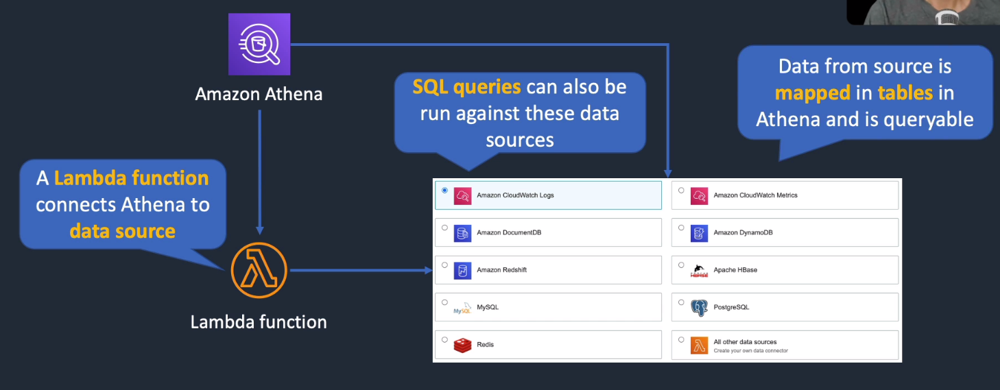
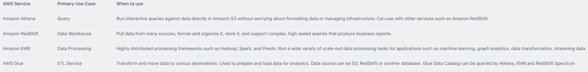
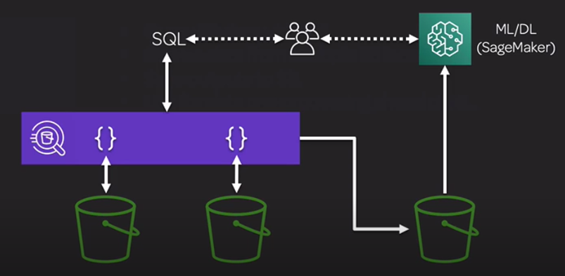

# AWS Athena

## General Info
Amazon Athena is an interactive query service used to analyze data in Amazon S3 using SQL queries. 
Athena is serverless, so there is no infrastructure to manage, and we only pay for the queries we run.

- Query S3 data with SQL (unstructured, semi-structured or structured data)
- Presto under the hood
- Source data from multiple S3 locations (CSV, JSON, ORC, Parquet, Avro, ...)
- Save outputs to S3.
- Can be used for data preprocessing ahead of ML.
- Serverless.
- Pay per query.
- Integrates with AWS Glue

Great for ad-hoc querying, integrates with QuickSight for easy visualization, it can also handle complex analysis (large joins, window functions, arrays, ...)

Athena auto executes queries in parallel, no need for complex ETL jobs to prepare data for analysis

interactive query service that enables us to analyse and query data located in S3 using standard SQL, 
serverless (nothing to provision), 
pay per query / per TB scanned, 
No need to set up complex ETL processes, 
works directly with data stored in S3, source data from multiple S3 locations, saves outputs to S3

**athena DB created for analytics need to be in the same region of the S3 buckets**, 
**use Apache Hive underneath, so we need to create a table based on input and define the fields**, 
**very useful to query CloudTrail logs stored in S3, easier to find who is provisioning stuff instead of manually going through the logs**

Can manage encryption when data is retrieved from S3.

**The table is not physically created with the data, it is just a virtual table with the data still living in S3.**

Athena has access to Glue Data Catalog (created by Glue crawlers).

Athena performs much more efficiently and at lower cost when using columnar formats such as Parquet or ORC.

Can query lots of other services
* CloudWatch logs & Metrics
* Amazon DocumentDB
* Amazon DynamoDB
* Amazon Redshift
* Apache HBase
* MySQL
* PostgreSQL
* Redis
* other data sources via connector

We need a Lambda function that connects Athena to the data source; then data from source is mapped in tables in Athena and is queryable.

You can get significant cost savings and performance gains by compressing, partitioning, or converting your data to a columnar format, 
because each of those operations reduces the amount of data that Athena needs to scan to execute a query.

## Use case
- query log files stored in S3 (ELB logs, S3 access logs, ...)
- generate business reports on data stored in S3
- analyse AWS cost and usage reports
- run queries on click-stream data (data stored in S3 based on user activity of a website)
- data pre processing ahead of ML (feature engineering, ...)

## Performance
* partition data - virtual columns -> reduce the data scanned
  * good candidate: columns that are used as filters are good for partitioning
  * bad: too many partitions
  * bad: data is heavily skewed to one partition value
* bucket our data - bucket the data within a single partition, specify one or more columns containing rows that we want grouped together
  * CLUSTERED BY (<bucketed columns>) into <number of buckets> BUCKETS
  * good candidate: primary key such as ID
* use compression - Parquet and ORC which compress data by default and are splittable (parallelism)
* Optimize file sizes: prefer big files > 128MB => use EMR tool S3DiscCP to merge files into bigger files 
* optimize columnar data store generation - Parquet/ORC
* optimize order by, group by, joins, like
  * user order by then limit
  * for join: specify larger table on the left side of the join
  * when using group by, order the columns by the cardinality by the highest cardinality (most number of unique values, distributed evenly) to the lowest
    * SELECT state, gender, count(*) FROM census GROUP BY state, gender;
* use approximate functions: approx_distinct(x) instead of count(distinct x) -> a little bit less accurate
* only include the columns that we need

[Performance tuning tips for Athena](https://aws.amazon.com/blogs/big-data/top-10-performance-tuning-tips-for-amazon-athena/)

## Benefits
Steps

1. point to data inside of S3
2. define the schema of that data (format like CSV, JSON, Parquet, ...)
3. create the table from the data in S3 (Hive) -> done automatically with the Console
4. select the correct database (default, other db created) and start querying

Works with many data types

* JSON (human readable), CSV (human readable), ORC (columnar, splittable), Parquet (columnar, splittable), Avro (splittable)
* but recommended to store data in columnar formats in S3 such as Apache Parquet or ORC as it improves performance
* can use EMR to convert data to columnar formats when outputting it

Integrations

* AWS Glue Data Catalog can store table metadata for Athena. This allows to change the virtual table if we made mistakes and stuff like that, save/delete the table, ...
* Glue can perform ETL on data that Athena wants to interact with
* Many other services can output or transform data into S3 and Athena can then query it

Common integrations, querying:

* AWS CloudTrail Logs
* Amazon CloudFront logs & metrics
* Classic Load Balancer logs
* Application Load Balancer logs
* Amazon VPC Flow logs

## Usage
The queries we do can be saved for later use (requires: a name and a description).

When we run queries, the outputs are saved in a bucket in S3 as CSV.

We can either create a table from the results of a query or a view.

## Performance
Not as performant as a data warehouse or a relational database. We are not dealing with a transactional systems so
it is probably okay if it takes some time.

## Examples
* Athena queries schemas of the multiple S3 repo and create some output on another bucket that is used by SageMaker.

* ad-hoc queries of web logs
* querying staging data before loading to Redshift
* Analyze CloudTrail / CloudFront / VPC / ELB logs in S3
* integration with Jupyter, Zeppelin, RStudio notebooks
* integration with QuickSight
* Integration via ODBC / JDBC with other visualization tools

Pipeline: AWS S3 -> AWS Glue -> Amazon Athena -> Amazon QuickSight

## Athena anti patterns
* highly formatted reports / visualization -> that's what QuickSight is for
* ETL -> use Glue instead

## Security
Access control

* IAM, ACLs, S3 bucket policies
* AmazonAthenaFullAccess / AmazonQuicksightAthenaAccess

Encrypt results at rest in S3 staging directory

* SSE-S3
* SSE-KMS
* CSE-KMS (client side encryption with KMS key)

Cross account access in S3 bucket policy possible

Transport Layer Security (TLS) encrypts in transit (between Athena and S3)

## Cost model
pay as we go

* $5 per TB scanned
* successful or cancelled queries count, failed queries do not
* no charge for DDL (create, alter, drop, ...)

Save lots of money by using columnar formats => save 30-90% and get better performance

* ORC
* Parquet

Glue and S3 have their own charges

## Resources

Athenas FAQ: https://aws.amazon.com/athena/faqs/

