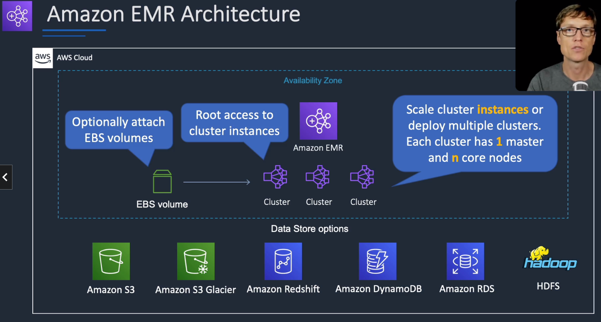
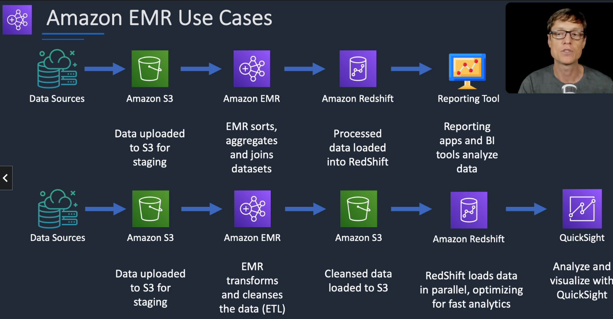
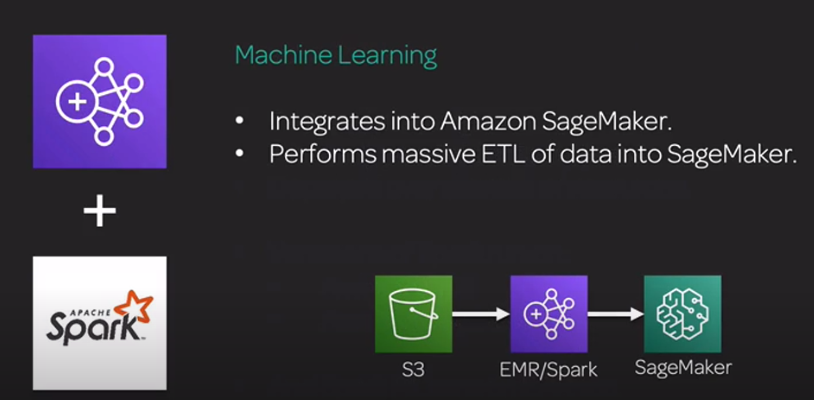
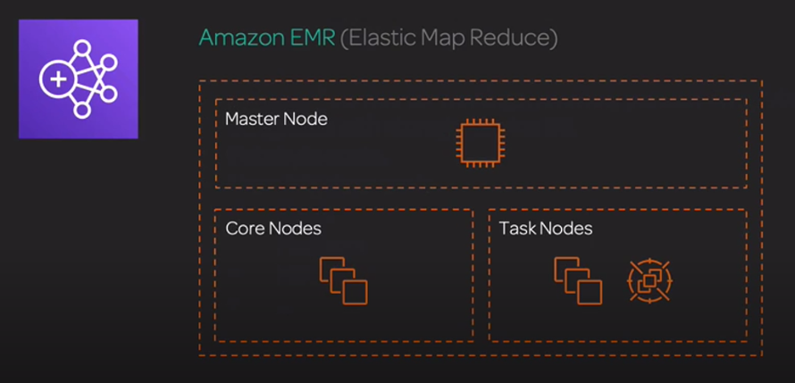

# Amazon EMR

## General Info
Managed hadoop cluster

makes it simple and cost effective to run highly distributed processing frameworks such as Hadoop, Spark, and Presto 
when compared to on-premises deployments. Amazon EMR is flexible – you can run custom applications and code, 
and define specific compute, memory, storage, and application parameters to optimize your analytic requirements.

With EMR you can run petabyte-scale analysis at less than half of the cost of traditional on-premises solutions and over 3x faster than standard Apache Spark.

Can run workloads on EC2, EKS, on premises using EMR on AWS Outputs

With EMR, we have access to the EC2 instance (SSH)

EMR only launches instances in one AZ within an Amazon VPC

Supports Apache Spark, HBase, Preso and Flink

Most used for log analysis, financial analysis, ETL
AWS provides the AMIs required to run Amazon EMR (Elastic Map Reduce), we cannot use custom AMIs or our own EBS volumes.

Great for log file analysis -> any Hadoop use cases since it is Hadoop under the hood

Note that EMR is powerful but it requires development and high maintenance

* petabyte scale
* managed service for hosting massively parallel compute tasks

Supports Apache MXNet and GPU instance types

* P3: 8 Tesla V100 GPU's
* P2: 16 K80 GPU's
* G3: 4 M60 GPU's (all Nvidia chips)

=> Need Deep Learning AMIs

We can combine EMR (with Spark) and SageMaker. Spark handles the pre processing of a huge amount of data and store it somewhere ready to be used by SageMaker for training.
=> For data of this size, you want to parallelize its processing. And that's something Apache Spark is good for. 
The sagemaker-spark package allows you to integrate SageMaker and Spark together, and you can also just use the two systems separately. 
Neither Glue ETL nor Kinesis Analytics can convert to LibSVM format, and scikit-learn is not a distributed solution.

ETL use cases and analytics use cases
* Managed cluster platform that simplifies running big data frameworks including Apache Hadoop and Apache Spark
* Used for processing data for analytics and business intelligence
* can also be used for transforming and moving large amounts of data 
* can perform ETL

With EMR, we do get root access to the EC2 instances





Step = programmatic task for performing some process on the data (count words, ...)
* cluster = collection of EC2 instances provisioned by EMR to run the Steps

## Integrations
* EC2: the instances that comprise the nodes in the cluster
* VPC: configure the virtual network in which we launch our instances
* S3: store input and output data (EMRFS)
* CloudWatch: monitor cluster performance and configure alarms
* IAM: configure permissions
* CloudTrail: audit requests made to the service
* Data Pipeline: schedule and start our clusters
* Lake Formation: discover, catalog and secure data in an Amazon S3 data lake

## Technologies
* managed Hadoop framework on EC2 instances
* Spark
    * fast analytics engine
    * massively parallel compute tasks
    * deployed over clusters of resources
    * implicit parallelism and fault tolerance
    * run on EMR and SageMaker
    * variation SparkML also runs on EMR
* HBase
* Presto
* Flink
* Hive & more

When using Amazon EMR release version 5.11.0 and later, the `aws-sagemaker-spark-sdk` component is installed along with Spark. 
This component installs Amazon SageMaker Spark and associated dependencies for Spark integration with Amazon SageMaker. 
We can use Amazon SageMaker Spark to construct Spark machine learning pipelines using Amazon SageMaker stages.



Spark ML aims to provide a uniform set of high-level APIs that help users create and tune practical machine learning pipelines. 
Amazon EMR can run Spark ML.

### Hadoop
* MapReduce: software framework to process lots of data in parallel in a distributed way
    * mappers: transform data
    * reduce: aggregate data to a final result
* YARN: manages cluster resources
* HDFS: hadoop distributed file system. Data copied on multiple nodes

### Spark
* MapReduce & Spark: spark replaced MapReduce on hadoop
* same underlying tech (YARN and HDFS)

Spark is executed in memory so faster than MapReduce & HDFS

How Spark works:

1. Driver Program (Spark Context): job coordinator
2. Cluster manager (Spark, YARN): manages the resources
3. Executor (cache, tasks): runs computations and stores data

=> not used for OLTP or batch job processing because it is more used as data transformer as it comes in

#### Spark components
##### Spark core
Foundation for the platform

* memory management
* fault recovery
* scheduling and monitoring jobs
* interact with storage systems
* APIs for Java, Scala, Python, R
* in memory caching
* directed acyclic graph (DAG) that makes it faster than mareduce

Under the hood: resilient distributed dataset (RDD) -> large dataset split on different computation nodes

##### Spark Streaming
Real time solution that leverages spark core fast scheduling capabilities to do streaming analytics.
Data gets ingested in mini batches and analytics on that data within the same application code written for batch analytics
can be applied to those mini batches
=> we can use the same code for batch processing and real time processing

supports ingestion from

* twitter
* kafka
* Flume
* HDFS
* Zero MQ
* Kinesis

Data stream: unbounded input table (new data stream = new rows appeneded to input table)

We can query using windows of time, ex with the past hour of the data that came in
```scala
val inputDF = spark.readStream.json("s3://logs")
inputDF.groupBy($"action", window($"time", "1 hour")).count().writeStream.format("jdbc").start("jdbc:mysql//...")
```

Spark Streaming + Kinesis: Kinesis Producer(s) -> Amazon Kinesis Data Streams <- Spark Dataset implemented from KCL

##### Spark SQL
* distributed query engine that provides low latency interactive queries up to 100x faster than MapReduce
* cost based optimizer
* code generation for fast query
* supports several datasources: JDBC, ODBC, JSON, HDFS, ORC, Parquet, Hive tables
* exposes a data frame (like Python) -> more used now compared to RDD like before

##### Spark MLLib
All the algorithms are implemented in a way that is distributed and scalable

* classification: logistic regression, naive Bayes
* regression
* decision trees
* recommendation engine (Alternative Least Squares - ALS)
* clustering (K-Means)
* LDA (topic modeling): extract topics from text information from documents in an unsupervised manner
* SVD
* PCA
* statistics
* ML workflow utilities (pipelines, feature transformation, persistence)

##### Graphx
distributed graph (computer science graphs, not quicksight graphs) processing framework built on top of Spark =>
a graph of people in a social network, it is more a data structure thing

provides ETL and exploratory analysis on iterative graph computation to enable users to interactively build and transform
a graph data structure at scale.

### Zeppelin + Spark
For zeppelin, we need to enable a Web Connection in the console to be able to access it.

* open port on security groups of the master (inbound 22 for our own IP address)
* create an SSH tunnel to access the notebook from our browser
* we need to have a proxy management tool (foxy proxy basic) installed in our browser to use that tunnel that we just created
* once it is setup, we can click on Zeppelin in the console and reach the notebook

Zeppelin

* can run Spark code interactively (like we can in Spark shell)
    * speeds up development cycle
    * allows easy experimentation and exploration of big data
* can execute SQL queries directly against SparkSQL
* query results may be visualized in charts and graphs (matplotlib and seaborn)
* makes Spark feel more like a data science tool

### EMR Notebook
* similar concept to Zeppelin with more AWS integration
* notebooks backed up to S3
* provision clusters from the notebook!
* hosted inside a VPC
* accessed only via AWS console

We can build Apache Spark applications and run queries on them on our cluster. They support Python, PySpark, Spark SQL,
Spark R and scala.

Comes packaged with popular open source graphical libraries from Anaconda to help us prototype our code and visualize
our results and perform EDA.

They are all hosted outside of the EMR cluster itself.

## Structure


**Master node**: manges the whole cluster, must be running all the time, coordinate the distribution of data and tasks among other nodes for processing.
The master node tracks the status of tasks and monitors the health of the cluster. Every cluster has a master node, 
and it's possible to create a single-node cluster with only the master node.
=> single EC2 instance

By default, each cluster writes log files on the master node. These are written to the /mnt/var/log/ directory

**Core Nodes**: managed by the master, they run a data daemon to coordinate the data storage and look after the tasks tracker.
They scale easily (up and down). A node with software components that runs tasks and stores data in the Hadoop Distributed File System (HDFS) 
on our cluster. Multi-node clusters have at least one core node. => can be scaled up & down but with some risk

**Task nodes**: optional, additional power (spot instances if we want) because they don't store data in HDFS so we don't lose data
=> no risk of data loss when removing

## Usage
* Transient (terminate cluster when job is done) vs Long Running clusters
    * can spin up task nodes using Spot instances for temporary capacity
    * can use reserved instances on long-running clusters to save $
* connect directly to master to run jobs
* submit ordered steps via the console

## EMR / AWS integration
* EC2 for the instances that comprises the nodes in the cluster
* VPC to configure the virtual network in which we launch our instances
* S3 to store input and output data
* CloudWatch to monitor cluster performance and configure alarms
* IAM to configure permissions
* CloudTrail to audit requests made to the service
* Data Pipeline to schedule and start our clusters

EMR uses S3 or DynamoDB (checkpoints statuts) as the persistent data store. When EMR starts, it can copy data required for it to operate 
from the persistent store into HDFS or use data directly from S3 or DynamoDB.

## Storage
* HDFS: stores data on multiple nodes to prevent data loss (default block size: 128MB)
    * if we terminate the nodes, the data goes with them
    * performant because the computation logic is executed close to the data
* EMRFS: access S3 as it if were HDFS
    * s3 file prefix: s3://
    * EMRFS Consistent View: optional for S3 consistency
    * Uses DynamoDB to track consistency
    * slower than HDFS but better for data retention
* Local file system
* EBS for HDFS

## Promises
* charges by the hour + EC2 charges
* provision new nodes if a core node fails
* can add or remove tasks node on the fly
* can resize a running cluster's core nodes

## Security and Encryption
By default, EMR instances do not encrypt data at rest.

Data can be encrypted in S3 or DynamoDB but it is needed to have custom MapReduce jobs (or Hive) to serialize/deserialize the data and handle encryption.

Encryption:

* S3 server side encryption and no HDFS copy: data stored in S3, no copy to HDFS. Hadoop processes it locally without making persistent local copies.
* S3 client-side encryption: need custom Serializer/Deserializer (Hive or InputFormater) -> apply encryption at each individual row or record so that we can split the file
* application level encryption - entire file encrypted: can use HMAC-SHA1 at the app level while we store data to S3 and DynamoDB
* application level encryption - individual fields encrypted / structure preserved: Hadoop uses standard SerDe such as JSON. Decryption during the Map stage, can use standard I/O redirection via custom decryption tools for streaming jobs
* hybrid: combination of S3 server-side encryption and client-side encryption as well as app level encryption

Data protection:

* between hadoop nodes: no additional protection required since all nodes reside in the same facility
* between Hadoop and S3: HTTPS used by default
* between Hadoop and DynamoDB: HTTPS used by default
* User or app access to Hadoop: use SSH for direct access or SSL/TLS if thrift/REST/Avro are used
* admin access to Hadoop: SSH -> SSH key pair is required, we need to have one or we need to create one

Security:

* IAM policies
* Kerberos
* IAM roles

## Instance types
Master node: m4.large if < 50 nodes, m4.xlarge if > 50 nodes

Core & task nodes:

* m4.large is usually good
* if cluster waits a lot on external dependencies (web crawler) -> t2.medium
* improved performance: m4.xlarge
* computation intensive app: high CPU instances
* Database, memory caching app: high memory instances
* network / CPU intensive (NLP, ML) -> cluster compute instances

### Spot instances
We can put task nodes on spot instances. The task nodes process data but do not hold persistent data in HDFS. 
Terminating a task node does not result in data loss or cause the application to terminate.

Only use on core & master if we are testing or very cost sensitive because we are risking partial data loss!

## Resources
FAQ: https://aws.amazon.com/emr/faqs/

