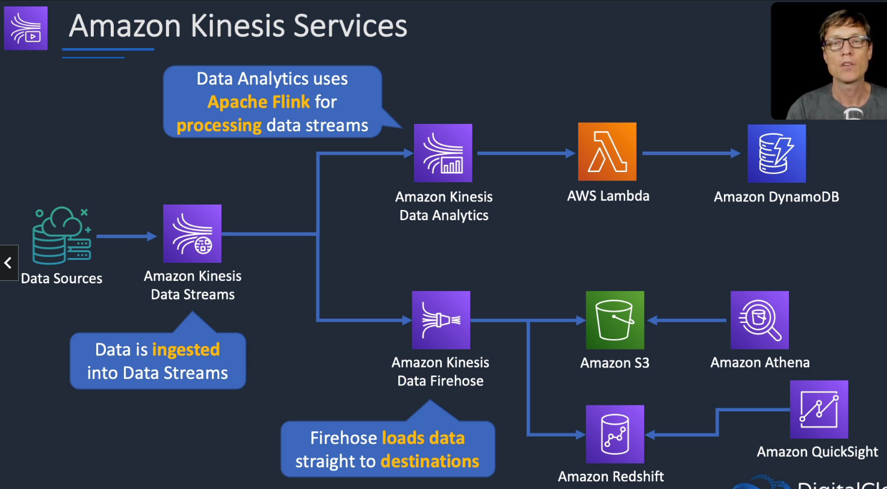
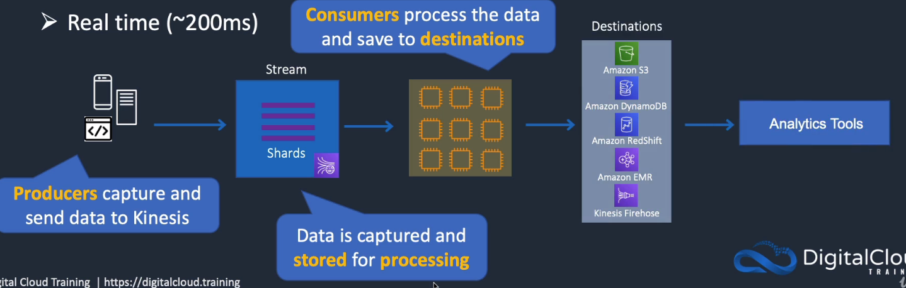
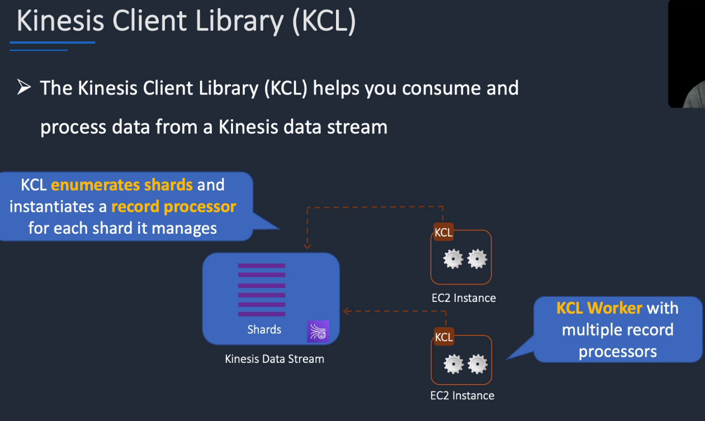
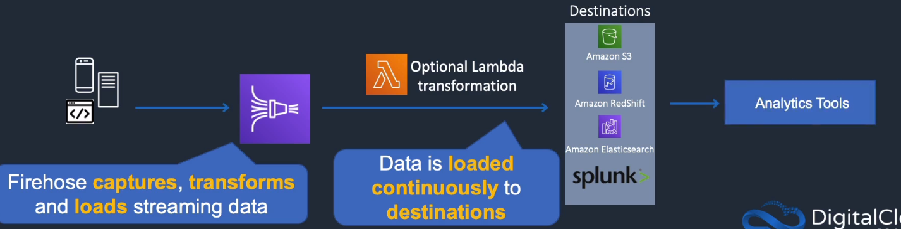
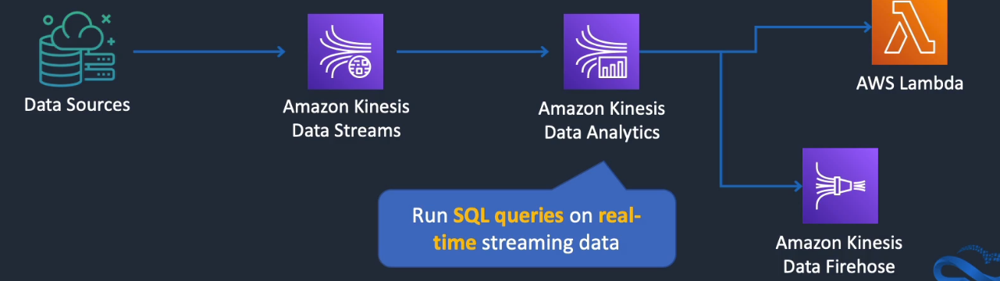
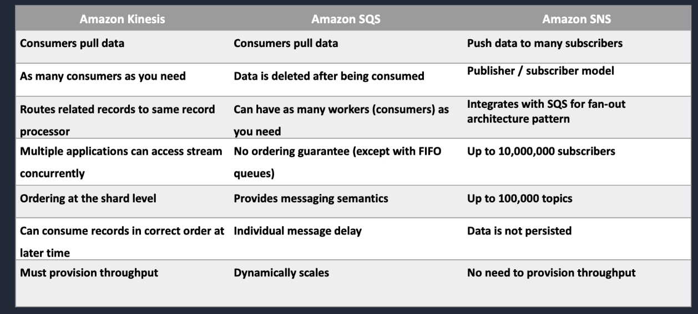
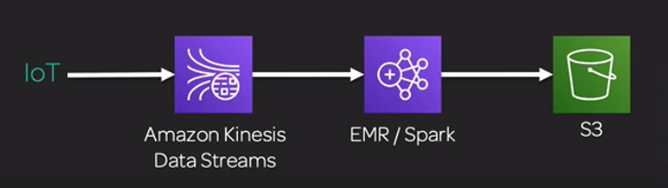
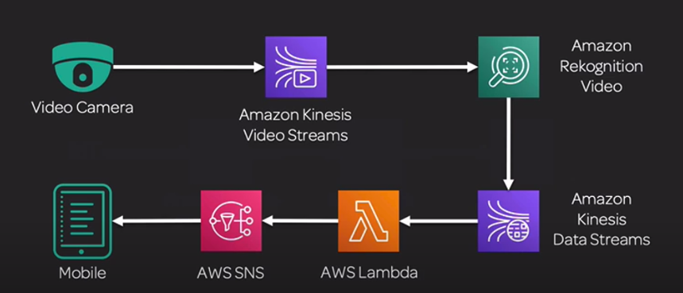

B# Amazon Kinesis

## General Info
* Managed alternative to Apache Kafka
* great for application logs, metrics, IoT, clickstreams
* great for real time big data
* great for streaming processing frameworks (Spark, NiFi, ...)
* data is automatically replicated synchronously to 3 AZ

Kinesis is a collection of 4 highly scalable services:

* Amazon Kinesis Data Streams: create real-time ML applications
* Amazon Kinesis Video Streams: real time video stream to create ML applications
* Amazon Kinesis Data Analytics: real time ETL/ML algorithms on stream
* Amazon Kinesis Data Firehose: ingest massive data near real time

Integrated with IAM, CloudTrail, CloudWatch, tags.
Kinesis supports authentication to control access to data. 
Can put data with HTTPS protocol and server side encryption with KMS (or encrypt data before writing in stream) AES256.
AWS managed keys with KMS is free, user keys cost money.
Encryption can be set at runtime but only the new data will be encrypted.
Stream specific feature. 
Possible to use VPC endpoints to access Kinesis Streams. 
Excellent with ingestion of large scale data, lots of data from a few sources (video), small amount of data from many sources (IoT)

Good use case:

1. ingest all the data in Amazon Kinesis Streams
2. streaming data
3. use Amazon Kinesis Analytics for analysis
4. send the data to Amazon Kinesis Firehose to put them in S3, Redshift, ...

Kinesis is only valid for fast streaming of small package (1MB max) -> not suitable for petabyte scale with huge packages

Firehose can be used to stream logs to 3rd party using HTTP endpoints (audit/security)

## Architecture patterns - analytics
* athena is being used to analyze a large volume of data based on data ranges. Performance must be optimized: use partition keys with dates + parquet
* lambda is processing streaming data from API gateway and is generating a TooManyRequestsException as volume increase: stream data into Kinesis Data Stream from API gateway and process in batches
* lambda function is processing streaming data that must be analyzed with SQL: replace Lambda by Kinesis Data Analytics, load with Kinesis Data Stream
* security logs generated by AWS WAF must be sent to a third party auditing application: send logs to Kinesis Data Firehose and configure the auditing application using an HTTP endpoint
* real time streaming data must be stored for future analysis: kinesis data streams -> firehose -> storage
* company runs several production databases and must run complex queries across consolidated data set for business forecasting: extract data to Redshift for OLAP

## Core Knowledge


### Kinesis Data Streams
* producers send data to Kinesis, data is stored in Shards for 24 hours (by default, up to 7 days)
* each shard can ingest up to 1k PUT records per seconds, default limit of 500 shards
  * one shard = 1MB/sec data input and 2MB/sec data output
* record = partition key, sequence number and data blob up to 1MB (before Base64 encoding)
  * partition key: group data by shard within a streams
* consumers then take the data and process it, data can be saved in another AWS service
* encryption with KMS, both producer and consumer need access to the key
* replicates synchronously across 3 AZs
* real time ~200ms vs firehose (**near** real time ~60 seconds)
* resharding (shard split and shard merge)
  * when data increase flow, add more shard with shard split (more costly since more shards)
* we pay for the shards so it is important to have the number of shards correct when setting it up
* a partition key can be specified with PutRecord to group data by shard
  * order is maintained for records within a shard => not cross shards
* Kinesis Data Streams stores data for later processing by applications (key difference with Firehose which delivers data directly to AWS services).





* each shard is processed by exactly one KCL worker and has exactly one corresponding record processor (1-1-1)
* one worker can process any number of shards so it's fine if the number of shards exceeds the number of instances

Common use cases include:
* Accelerated log and data feed intake. 
* Real-time metrics and reporting. 
* Real-time data analytics. 
* Complex stream processing.

Producers can use Kinesis Streams API, Kinesis Producer Library (KPL) and Kinesis Agent

### Kinesis Data Firehose
* producers send data to Firehose
* easiest way to load streaming data into data stores and analytics tools
* data streams can be used as source to firehose
* firehose can transform data in transit with Lambda
* can batch, compress and encrypt data before loading it
* synchro replicates data across 3 AZ
* store data records up to 24 hours
* can encrypt data with KMS
* max payload size 1MB
* no shards, completely automated (scalability is elastic)
* data is sent to another AWS service for storing
  * data can be optionally processed/transformed using Lambda
* near real time delivery ~60 seconds latency
* destinations
  * Redshift (via an S3 bucket)
  * Elasticsearch
  * S3
  * Splunk
  * Datadog
  * MongoDB
  * New Relic
  * HTTP Endpoint



Copy to Redshift
* first copy to S3
* COPY command from S3 to Redshift
* if data transformation is enabled -> can optionally back up source data to another S3 bucket

Copy to ElasticSearch & Splunk
* directly delivered to ES cluster or splunk
* can optionally be backed up to S3 bucket concurrently

### Kinesis Data Analytics
* provides real time SQL processing for streaming data
* easiest way to process and analyze real-time streaming data
* use cases
  * generate time series analytics
  * feed real time dashboards
  * create real time alerts and notifications
* can ingest data from Kinesis Streams and Firehose
* output: S3, Redshift, ElasticSearch, Data streams
* provides analytics for data coming in from Kinesis Data Streams and Kinesis Data Firehose
* 2 types of input
  * streaming data source: continuously generated data that is read into our app for processing
  * reference dat source: static data that the app uses to enrich data coming in from streaming sources
* destinations
  * Kinesis Data Streams
  * Kinesis Data Firehose (and then S3, Redshift, ES)
  * AWS Lambda
* kinesis data analytics application = 3 components:
  * Input: streaming source for the application
  * Application code: SQL statements that process input and produce output
  * Output: one or more in app streams to hold intermediate results



## Tips
If we want real time analysis: Kinesis Data Streams -> Kinesis Data Analytics -> Kinesis Firehose -> S3

If we want to ingest large amount of data to S3: Kinesis Firehose -> S3

Kinesis Data Streams PutRecord API uses name of the stream, a partition key and data blob. For firehose, PutRecord API uses the name 
of the delivery stream and the data record.

## Concepts
* Shard: base throughput unit of a stream. 1MB/sec data input and 2MB/sec data output. Support up to 1000 PUT records per second. Can be monitored in CloudWatch
It is possible to change the number of shards at runtime. 10 shards per region limit by default
* Record: unit of data stored in a stream. Has a sequence number, partition key and data blob (max 1MB before base64 encoding)
* Partition key: used to segregate and route records to different shards of a data stream. Specified by the producer when adding to the stream. Can configure data producer to use two partitions keys (key A to shard 1, key B to shard 2)
* Sequence number: unique ID of a record. Assigned by Kinesis when producer calls PutRecord or PutRecords. Sequence numbers for the same partition key increase over time

### Shards
Shards have to be partitioned in advance. The more shards, the more capacity and speed

How to calculate shards ?

If

* Record size = 500kb
* frequency: 2 records per second
* 7 consumer applications

Then

* incoming_write_bandwidth_in_KB = average_data_size_in_KB multiplied by the number_of_records_per_seconds. = 500 * 2 = 1000
* outgoing_read_bandwidth_in_KB = incoming_write_bandwidth_in_KB multiplied by the number_of_consumers = 1000 * 7 = 7000
* number_of_shards = max(incoming_write_bandwidth_in_KB/1000, outgoing_read_bandwidth_in_KB/2000)

=> So, number_of_shards = max(1000/1000, 7000/2000) = max(1, 3.5) = 4

#### Resharding
* split or merge shards to impact performance 
* UpdateShardCount API takes more time with more shards but stream is still used
* can only perform one resharding operation at a time

## Amazon Kinesis Data Streams
* Low latency streaming ingest at scale
* streams are divided in ordered Shards / Partitions

Amazon Kinesis Data Streams is a scalable and durable real-time data streaming service that can continuously capture 
gigabytes of data per second from hundreds of thousands of sources. 
It's a general endpoint that ingests large amounts of data for processing by Kinesis Data Analytics, Apache Spark on EMR, 
Amazon EC2, and Lambda. Kinesis Data Streams is used to build custom applications working with streaming data.

Collect and process large streams of data in real time. 
We create data-processing applications which read data from an Amazon Kinesis Data Stream as data records then process records (send to dashboard, generate alert, dynamically change price, advertising strategy, ...)
Data can come from a hundreds of thousands of sources and can be clickstreams, app logs, social media, ...

Streams manage infra, storage, networking and configuration.

General endpoint for ingesting large amounts of data for processing by:

* Kinesis Data Analytics
* Spark on EMC
* Amazon EC2
* Lambda

If we want real time analysis, data should be put in Kinesis Data Streams then analyzed by Kinesis Data Analytics for SQL based analysis to 
send alert directly. Once the processing is done, the streams are dumped into S3 using Kinesis Data Firehose.

### Data retention
24h by default, can go up to 7 days

* gives the ability to replay or reprocess the data
* multiple applications can consume the same stream
* once data is inserted in Kinesis, it can't be deleted (immutability)
* records can be up to 1mb in size

### Scenarios
* fast log and data feed intake and processing => process logs in seconds instead of the minute need to get them into CloudWatch
* real time metrics and reporting => use data in log directly instead of waiting a batch of records
* real time data analytics => parallel processing with real time data. For example, we can have tracking information of users in real time and react accordingly, we can have multiple streams for different purposes
* complex stream processing => put data from one stream to another stream to be processed by other applications

### Benefits
* real time aggregation of data
* loading of the aggregate data into a data warehouse / map reduce cluster
* durability and elasticity => once the stream is created, Amazon handles the scaling automatically
* parallel application readers => since multiple readers can be on the same stream, we can have different parallel processing with the same data

### Creation of a stream
1. create Kinesis Stream in Console or CreateStream API
2. Configure data producers to continuously add data to the stream
3. Build Kinesis applications to read and process data from the stream using Amazon Kinesis API or Amazon Kinesis Client Library (KCL)

### Limits
* designed to scale without limits by increasing the number of shards within a data stream
* records of a stream accessible for up to 24h, can be set to 7 days when "Extended Data Retention" is enabled
* max size of data blob (before base64 encoding) is 1 megabyte
* each shard can support up to 1000 PUT records per second

* producer
    * 1MB/s or 1000 messages/s at write PER SHARD else we get "ProvisionedThroughputException"
* consumer
    * 2MB/s at read PER SHARD across all consumers
    * 5 API calls per second PER SHARD across all consumers

### Kinesis Data Streams vs SQS vs SNS



Kinesis Streams enables real time processing of streaming bit data, provides ordering of records. A message can be read by multiple actor.
This is different with SQS, messages are processed independently (message level ack/fail).
Mainly kinesis streams and not firehose.

Kinesis
* same data records can be processed at the same time within 24 hours by different consumers
* routing related records to the same record processor (MapReduce)
* ordering is important and can be reprocessed later with the same order
* data can be replayed within this window if required
* 24h max retention (or 7 days with extended) => if we require to handle message more than 7 days, use SQS
* Consumers pull data. 
* As many consumers as you need. 
* Possible to replay data. 
* Meant for real-time big data, analytics, and ETL. 
* Ordering at the shard level. 
* Data expires after X days. 
* Must provision throughput.

SQS
* write to multiple queues using fanout, can then read from multiple queues but then we can't really reuse the information at a later time if we need to process it again
* queues are not FIFO by default (unless we use the FIFO one) so it is hard to know when it will be received by a worker process
* up to 14 days of retention
* message semantics (ack/fail) and visibility timeout
* supports delay of up to 15 minutes before a message can be processed
* dynamically increase concurrency/throughput at read time (easier to add workers than shards for kinesis streams)
* scales transparently
* Consumers pull data. 
* Data is deleted after being consumed. 
* Can have as many workers (consumers) as you need. 
* No need to provision throughput. 
* No ordering guarantee (except with FIFO queues). 
* Individual message delay.

SNS:
* Push data to many subscribers. 
* Up to 10,000,000 subscribers. 
* Data is not persisted (lost if not deleted). 
* Pub/sub. 
* Up to 10,000,000 topics. 
* No need to provision throughput. 
* Integrates with SQS for fan-out architecture pattern.


### Kinesis with CloudWatch
* Create streams using the CLI

  ```bash
  aws kinesis create-stream --stream-name testKinesis --shard-count 1
  aws kinesis describe-stream --stream-name testKinesis
  ```

* in CloudWatch console, go to **Events** then create a **rule** for EC2 instance state change notification. Pick Kinesis stream created as a target

* Test the rule by going to the EC2 console and stop an instance

* Go to CloudWatch console, choose Events, Rules then click on the name of the rule and choose "show metrics for the rule".

* At the command line enter 

  ```bash
  aws kinesis get-shard-iterator --shard-id shard-id-000000000 --shard-iterator-type TRIM_HORIZON --stream-name test
  ```

  ```bash
  aws kinesis get-records --shard-iterator shard-iterator-output-from-previous-step
  ```

**The JSON returned contains several "Records" with "Data" with value base64 encoded (the event).**

**In the backend, all of the logging data (alarms, events), can be taken further for analysis using Kinesis and from there it can be shipped to various services like Redshift, Kinesis Analytics, Elastic Search.**

### Enhanced fan-out

optional feature of Kinesis Data Streams to scale the number of consumers reading from a data stream in parallel while maintaining high perf
Can be activated without impacting data producers or data streams

Consumers must first register which activates enhanced fan-out. With KCL 2.x, registering is done automatically. Once registered, consumers will have their own logical enhanced fan-out throughput pipes provisioned for them.
Consumers need now to use the HTTP/2 SubscribeToShard API to retrieve data inside these pipes. Not supported by HTTP/1 GetRecords.

Use case: multiple consumers of a stream in parallel / at least one consumer that requires the use of SubscribeToShard API to provide sub-200ms data delivery between producers and consumers

limited to 5 consumers for a same stream by default

on-demand hourly cost + data retrieval cost for every GB retrieved

Connection can last up to 5 minutes

### Kinesis Producer Library (KPL)
Can add data to a stream using PutRecord, PutRecords, Amazon Kinesis Producer Library (KPL) or Amazon Kinesis Agent (Java agent on Linux to auto send data).

KPL: lib with a simple, asynchronous and reliable interface for producers. Supports C++ and Java.
If producer cannot write to the stream because of ProvisionedThroughputExceeded, need to retry or reshard.

Kinesis API is integrated with the SDK.

=> prio use this because it provides built-in performance benefits andd ease of use advantages

### Kinesis Client Library (KCL)
When developing a Kinesis Data Stream application, the recommended method to read data from a shard is KCL (Kinesis Consumer Library) because the KPL (Kinesis Producer Library) will only allow writing to Kinesis Streams and not reading from them. We cannot interart with Kinesis Data Streams via SSH. Note that we can also read data using the Kinesis Data Streams API but KCL is better.

Supports Java, Python, Ruby, Node.js, .NET

Supports both HTTP/1 GetRecords (no fan out) and HTTP/2 SubscribeToShard API (enhanced fan out)

KCL keeps track of the state, resharding events, sequence number checkpoints with DynamoDB (application name) -> need to make sure that there is no conflict
Charged for Streams + DynamoDB.

Can have ProvisionedThroughputExceeded while reading, need to retry or reshard.

layer of abstraction specifically for processing data in a consumer role => intermediary between record processing logic and the Kinesis Data Streams

When we start KCL application, it calls the KCL to instantiate a worker which performs the following tasks:
* connects to the stream
* enumerate the shards
* coordinates shard associations with other workers
* instantiates a record processor for every shard it manages
* pulls data records from the stream
* pushes the records to the corresponding record processor
* checkpoints processed records
* balance shard-worker associations when the worker instance count changes
* balance shard-worker associations when shards are split or merged
* KCL ensures that for every shard, there is a record processor
  * each shard processed by exactly one KCL worker and one corresponding record processor
  * one worker can process any number of shards -> fine if number of shards > number of instances

If we have two consumers -> load balance and create half the processors on one instance and half on another

Try not to have number of instances > number of shards (except for failure or standby purposes)

process is checkpointed into DynamoDB (IAM access required)

KCL can run on EC2, Beanstalk and on premises server

Records are read in order at the shard level

### Kinesis Connector Library
Requires KCL and can be used to connect to DynamoDB, Redshift, S3 and Elastic Search.

### Kinesis Storm Spout
used to integrate Kinesis Data Streams to Apache Storm.

### Billing
hourly shard cost (only for shards not in CLOSED state after resharding)

PUT payload unit cost determined by the number of 25KB payload units that the producer put on the stream

extended data retention (optional)

enhanced fan out (optional)

## Amazon Kinesis Video Streams
Amazon Kinesis Video Streams can be used to securely stream live video from devices to the AWS Cloud or build applications 
for real-time video processing and batch-oriented video analytics (ML, playback, and other processing). 
Kinesis Video Streams can also be used to watch our video streams in real time as they are received in the cloud.
Kinesis brings in all the data and
stores it for some defined time (eg 7 days). We can then pick any part of that video for 7 days.

Producers (**One producer per video stream!!!**)

* security camera
* body worn camera
* AWS DeepLens
* smartphone camera
* audio feeds
* images
* RADAR data
* RTSP camera

Video playback capability

Consumers

* build our own (MXNet, Tensorflow)
* AWS SageMaker
* Amazon rekognition video

Keep data for 1 hour to 10 years

### Use cases
1. Consume video stream in real time (Kinesis Video Streams -> Fargate (Docker))
2. Checkpoint stream Processing status (consumer) with DynamoDB
3. Send decoded frames for ML based inference (Fargate to SageMaker)
4. Publish inference results -> Kinesis Data streams
5. Consumed by AWS Lambda for Notifications 

Other use cases: detect conference attendees wearing a specific company shirt as part of a constest 
=> DeepLens does integrate with Kinesis Video Streams, which in turn integrates with SageMaker. 
However, a pre-trained model such as ImageNet or Rekognition won't know about these specific company shirts - 
you need to train your own model first. 


## Amazon Kinesis Data Firehose
Amazon Kinesis Data Firehose is a simple endpoint used for delivering real-time streaming data to Amazon Simple Storage Service (S3), 
Amazon Redshift, Amazon Elasticsearch Service (Amazon ES), and Splunk. Kinesis Data Firehose can also transform our data before delivering it.

managed service, no administration and it is near real time (60 seconds latency minimum for non full batches)

automatic scaling, supports many data formats

* can do data conversions:
    * from csv/json to Parquet/Orc (only for S3)
* can do data transformations through AWS Lambda (CSV -> JSON for instance)
* supports compression when target is S3 (Gzip, Zip, Snappy)

=> we only pay for the amount of data going through Firehose, not if they are there and unused

source data:

* direct PUT
    * SDK
        * PutRecord()
        * PutRecordBatch()
    * Amazon Kinesis Agent (standalone Java software)
    * AWS IoT (send MQTT messages)
    * CloudWatch logs
    * CloudWatch events
* input kinesis data stream

Using a combination of Kinesis Firehose with lambda would introduce a buffering delay of at least 1 minute or 1MB of data so the solution will not be real time.

Fully managed service (easy to launch and configure, secure, scalable) which provides an easy way to load streaming data into AWS from hundreds of 
thousands of sources into Amazon S3, Amazon Redshift (Amazon data warehouse), Elasticsearch or Splunk.
It is less complicated to put in place than a Kinesis stream but less configurable.

It can transform data during the ingestion to S3. It is a cost effective way to ingest data, transform it into Parquet format (for example) 
and write it to S3 for Glue Crawler to read it for an Athena table.

=> near real time analytics and hindsights

Firehose can capture data from:

* stream data (almost anything)
  * financial trading info
  * social networks
  * logs generated by mobile/web apps
  * geospatial services
  * telemetry from connected devices

We can use Elastic Map Reduce or business intelligence applications in addition to that to process and analyze the data

We can use the Firehose API or the Linux agent to send data

We can specify a batch size or a batch interval to control how quickly data is uploaded to the destination from firehose

Firehose supports compression -> lets us control how quickly we receive data at the destination via batching and compressing the data

Can handle gigabytes of data per second and maintain the latency we specify for the streams without any intervention or maintenance required

Firehose is secure -> automatic encryption after it is sent to our destination, we can also specify an encryption key from Amazon Key Management System (delivery stream encryption)

Firehose sends several metrics to cloudwatch to easily monitor the heal of our streams

Pay as you go -> pay for the data we transmit through the services and nothing from the infrastructure itself that handles the stream

We don't need to maintain anything, we may need to do that for Kinesis Streams though

Firehose support data streams and transformations but is not designed for custom data stream processing and real-time metrics => use Kinesis Data Streams and create custom applications to process data from streams

Firehose 

* Input
    * SDK Kinesis Producer Library (KPL)
    * Kinesis Agent
    * Kinesis Data Streams
    * CloudWatch Logs & Events
    * IoT rules actions
* work with Lambda (transform source records)
* output
    * S3
    * Redshift
    * ElasticSearch
    * Splunk

Data in Apache Parquet or Apache ORC format is typically more efficient to query than JSON. Kinesis Data Firehose can convert JSON formatted source records
using a schema from a table defined in AWS Glue (absolutely need Glue if we want that feature). 
For records that aren't in JSON format, we need to create a Lambda function that converts them to JSON in the transform phase.

If we put data in S3, we can specify S3 prefix and S3 error prefix, **it is required to have a trailing "/" at the end of the prefix**
We also need to configure the buffer size for S3, if we put 1MB (1MB-128MB) and a buffer interval of 60 seconds (60-900 seconds), this means that
the data will be delivered ASAP (as soon as 1st MB is reached or if we reach 60s).

By default, there is partioning done by Firehose in S3 (by date).

We can recover from failures if we put the following in another S3 bucket:

* source records
* transformation failures
* delivery failures

### Difference between Kinesis Data Streams and Firehose
* Streams (real time application)
    * going to write custom code (producer/consumer)
    * real time (~200ms latency for classic, ~70ms latency for enhanced fan-out)
    * must managed scaling ourselves (shard splitting (add shard), merging (remove shard))
    * data storage for 1 to 7 days, replay capability, multi consumers
* Firehose (delivery data)
    * delivery/ingestion service
    * fully managed, send to S3/Splunk/Redshift/ElasticSearch
    * serverless data transformations with Lambda
    * near real time (lowest buffer time is 1 minute)
    * automated scaling
    * no data storage

## Amazon Kinesis Data Analytics
Amazon Kinesis Data Analytics can be used to process and analyze streaming data from Kinesis Data Streams or Kinesis Data Firehose using SQL or JAVA. 
We can use Kinesis Data Analytics to create a leaderbord for an online game and you can calculate metrics in real time.

**cannot directly ingest source data**

Run standard SQL queries against streaming data from Kinesis Streams or Firehose. It can also use Java libraries.
This is not a BI tool so it doesn't make things pretty, it acts as a pre processing for data before storing it somewhere else.

=> **can be used to process and analyze streaming data using SQL or Java. We can create dashboard and calculate metrics in real time**

We can use AWS Lambda to process the output from Kinesis Data Analytics and issue an alert via SNS if needed

Perfect solution if we need to do some simple filtering on streaming data before storing them. This is better than
storing everything and do the post processing with Glue or other services.

Since we can use lambda, we can transform the data however we want. For example, we could convert gzip data and run SQL on the converted data

### Input / Output
* Input streams
    * Amazon Kinesis Data Streams
    * Amazon Kinesis Data Firehose
* Reference table (CSV or JSON data stored in S3)
    
Once the data is ingested, we can execute SQL query on Input Streams and Reference Table.
=> we can join the input streams to a lookup reference table

The output goes to

* Output Streams
    * Amazon Kinesis Data Streams to S3/Redshift
    * Amazon Kinesis Data Firehose to S3/Redshift
    * AWS Lambda
* Error Stream

### Use cases
* streaming  ETL: select columns, make simple transformations, on streaming data (reduce data)
* continuous metric generation: live leaderboard for a mobile games
* responsive analytics: look for certain criteria and build altering (filtering)

### Features
* only pay for resources consumed (but it is not cheap)
* serverless, scales automatically
* Use IAM permissions to access streaming source and destinations
* for performing transformation, 2 possible runtimes:
    * SQL
    * Flink to write the computation
* schema discovery if we already have data streaming in the source
* lambda can be used for pre-processing

### In-application stream
In-application streams are continuous flows of data records, we create them in SQL to contain the data we want to 
persist to the specified destination in JSON/CSV

### ML on Kinesis Data Analytics
We can run **Random Cut Forest algorithm**

* SQL function used for anomaly detection on numeric columns in a stream
* examples: fraud detection, detect anomalous subway ridership during the NYC marathon
* **uses recent history** to compute model => if data changes over time, the model will as well

We can also run **hotspots**

* also SQL function
* locate and return information about relatively dense regions in our data (clusters)
* examples: find a collection of ooverheated servers in a data center
* changes less compared to RCF

### Creation in console
We first need to create a kinesis stream (firehose, ...) and then we can create a Data analytics application (Start/Stop/Delete).
We need an IAM role, ...

We need to specify the source (firehose, ...), we can enrich reference data (optional) from S3. Then we can create real time analytics.

We create the query and we save it then run it. It starts the application and then we wait for results.

Results of the query are batched every 2-10 seconds but it takes a long time before they arrive.

Note that this is streaming so if no data goes through the stream, there will be no results displayed.

## Security
* control access/authorization using IAM policies
* encryption in flight using HTTPS endpoints
* encryption at rest using KMS
* possible to encrypt/decrypt data on the client side
* VPC endpoints available for kinesis to access within a VPC

## Architecture examples





## Resources

FAQ Data Stream: https://aws.amazon.com/kinesis/data-streams/faqs/

