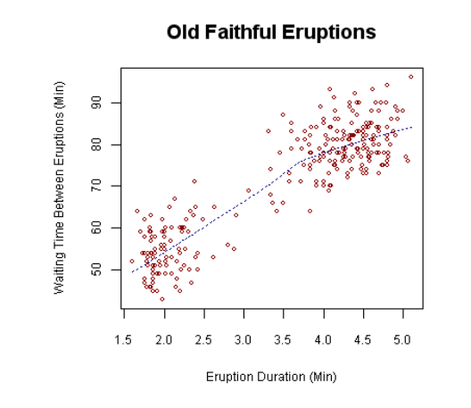
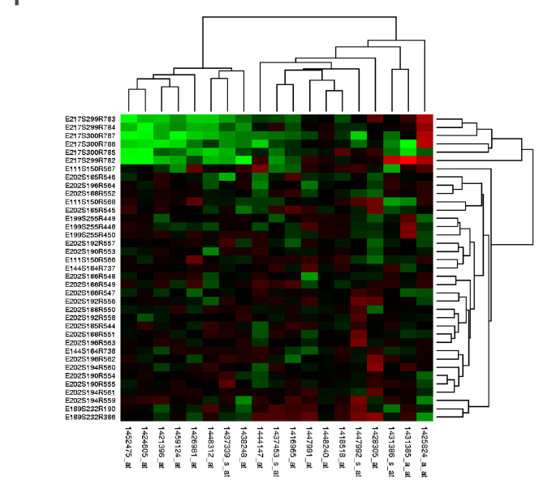
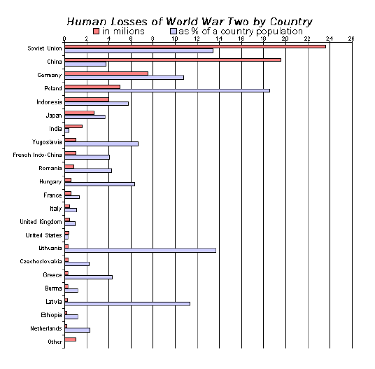
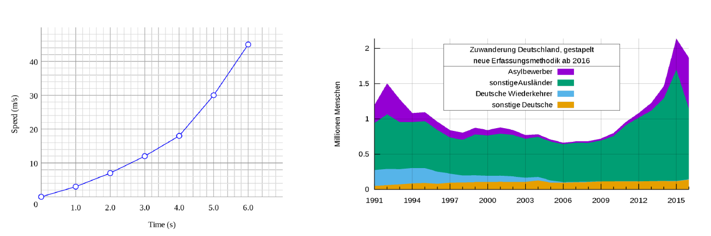
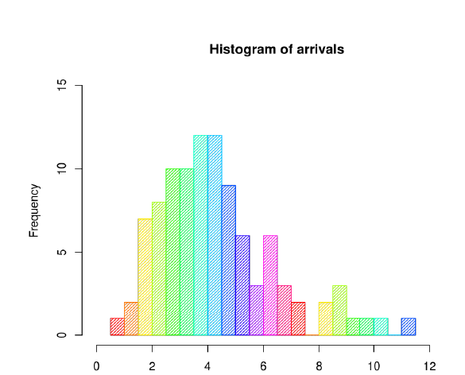
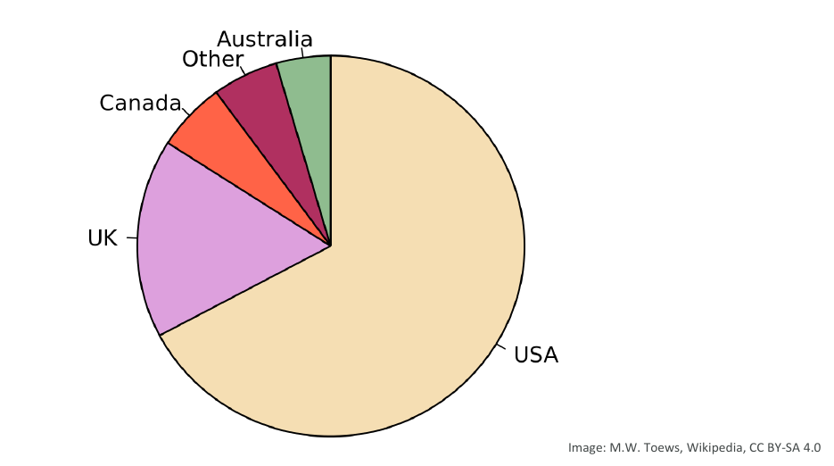
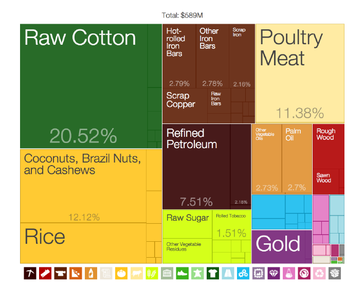
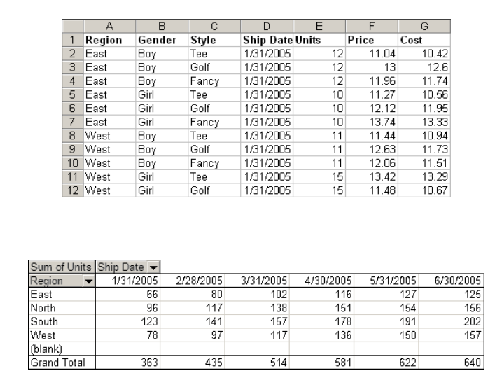

# Amazon Quicksight

## General Info

The service (Business intelligence tool) lives outside of AWS, we need to create a separate account (either standard or enterprise). It is end-user targeted even if cloud hosted.

- Business Intelligence (BI) tool
- Visualizes data from many sources
- Dashboards
- Email Reports
- serverless
- Embedded Reports
- End-user targeted application

**=> Service for business intelligence to create data visualization from data in our AWS resources.**

This is different than Athena (SQL on Data - Hive), with Quicksight, we load formatted data to do visualization graph.

Really fast, easy, serverless cloud-powered business analytics service. Allows employees in an organization:

* build visualizations
* perform ad-hoc analysis
* quickly get business insights from data
* anytime, on any device (browsers, mobile)

## Benefits
* automatic discovery of many AWS data sources
* integration with a variety of other relational databases
* integration with many SaaS providers
* access multiple data sources and build visualizations from them quickly
* create and share visuals and stories with stakeholders in read-only dashboards
* can create dashboard, email reports, embedded reports, ...

## Datasources
**Relational Data Sources**

* Athena, Aurora, Redshift, Redshift Spectrum (unstructured data in S3), S3, S3 Analytics
* other non AWS relation sources such as
  * Spark 2.0+
  * MariaDB 10.0+
  * SQL Server 2012+
  * MySQL 5.1+
  * PostgreSQL 9.3.1+
  * Presto / Snowflake / Teradata
  * any JDBC/ODBC data source

**File data sources**

* CSV/TSV
* ELF/CLF: extended and common log format files
* JSON
* XLSX: microsoft excel

**Software as a service data sources**

* Adobe analytics
* Github
* JIRA (direct connection)
* Salesforce
* ServiceNow (direct connection)
* Twitter

## Super-fast, parallel, in-memory calculation engine (SPICE)
* Datasets are imported into SPICE
    * uses columnar storage, in-memory, machine code generation
    * accelerates interactive queries on large datasets
* each user gets 10GB of SPICE
* highly available and durable
* scales to hundreds of thousands of users

## Datasets

identify the specific data within a data source that we want to interact with. For example, this could be a table in a relational database or a file inside of S3.

These datasets are then interacted with by using **SPICE** (the super-fast parallel in-memory calculation engine)

## Visual types

graphical visualizations of our data. There are a variety of possible visualizations we can use for different scenarios.

* AutoGraph: find graph automatically for our use case
* Bar Charts -> comparison and distribution (histograms)
* Line graphs -> for changes over time
* Scatter plots, heat maps -> for correlation
* Pie graphs, tree maps -> aggregation
* Pivot tables -> for tabular data
* Stories: narratives that present iteration of our data, contains key points, process, evolution of our work

### Relationships / Correlation
charts to determine if relationships exist between 2 or more variables

* scatter plots (2 variables)
  

* bubble charts (3 variables)
* heat maps

### Comparisons
* bar charts: comparing one variable in the same period

* column charts: one or more variable changing over time
* line charts and stacked line charts: three or more variables changing over time

### Distributions
* histograms: generally allow us to "bucket" data into a non-chronological interval

### Compositions / aggregation
* when we want to highlight the elements that make up our data and how they compare to each other
* with static data
    * pie charts, stacked 100% bar charts
  
    

    * tree maps
    
    

* with data that changes over time
  * stacked area
  * stacked column
  * stacked 100% area or column chart
  
### Tabular data
pivot tables

## Analyses
collections of visualizations and stories that are grouped together. They act as a container for what we aim to communicate.

We can use multiple datasets, visualizations and stories in an analysis.

### Stories
multiple iterations of an analysis that work together to tell a story. For example, one set of visualizations with different sets of filters that compare the sales data of different regions

## Dashboards
Read-only version of an analysis that we can share with other QuickSight users for reporting purposes

Dashboards preserve things like:

* filtering
* parameters
* controls
* sort order

The data in a dashboard reflects the current data in the datasets used by the analysis behind it. If the data changes, the dashboard will as well.

## QuickSight Machine Learning Inisghts
* anomaly detection using Random Cut Forest to find outliers
* forecasting: detect seasonality and trends, serverless solution
* auto-narratives: build dashboard automatically (automatic generation of narratives)

## Use Cases
* interactive ad-hoc exploration / visualization of data
* dashboards and KPI's
* stories
    * guided tours through specific views of an analysis
    * convey key points, thought process, evolution of an analysis
* analyze / visualize data from
    * logs in S3
    * on-premise databases
    * AWS (RDS, Redshift, Athena, S3)
    * SaaS applications, such as Salesforce
    * Any JDBC/ODBC data source
    
## Anti patterns
Quicksight is not really made for:

* highly formatted canned reports
    * QuickSight is for ad-hoc queries, analysis and visualization
* ETL
    * use Glue instead although QuickSight can do some transformations
   
## Security
* multi factor authentication on our account
* VPC connectivity
    * add quicksight's IP address range to our database security groups
* row level security
* private VPC access
    * elastic network interface, AWS direct connect
    
## User management
* users defined via IAM or email signup
* active directory integration with QuickSight entreprise edition

## Pricing
* annual subscription
    * standard: $9 / user / month
    * entreprise: 18$ / user / month
* extra SPICE capacity (beyond 10GB)
    * $0.25 (standard), $0.38 (entreprise) / GB / month
* month to month
    * standard: $12 / GB / month
    * entreprise: $24 / GB / month
* entreprise edition
    * encryption at rest
    * Microsoft Active Directory integration
    
Note that readers (getting secure access to interactive dashboards) pay 0.30 dollars per session up to 5 dollars per month

## Resources

FAQ:  https://aws.amazon.com/quicksight/resources/faqs/

