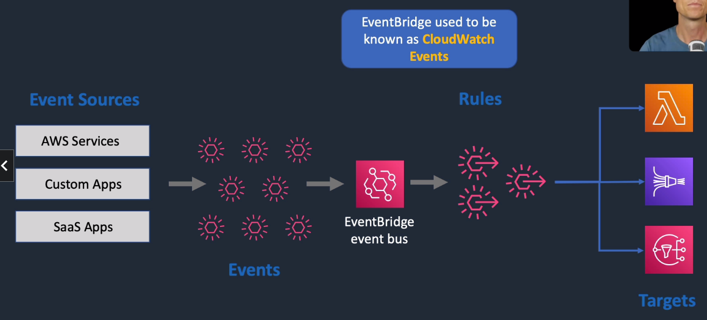
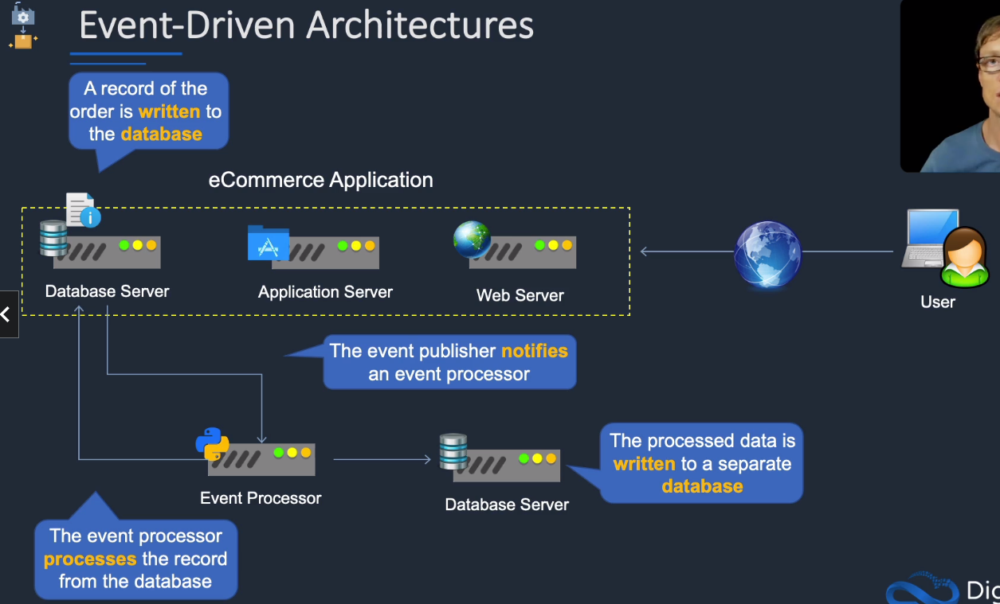
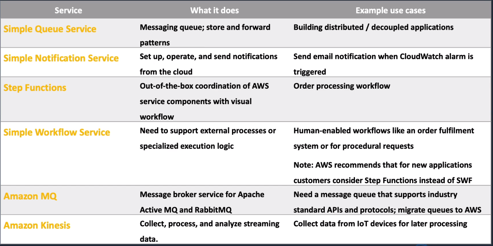
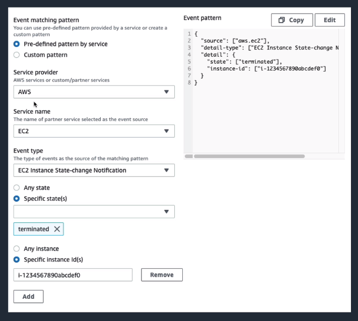
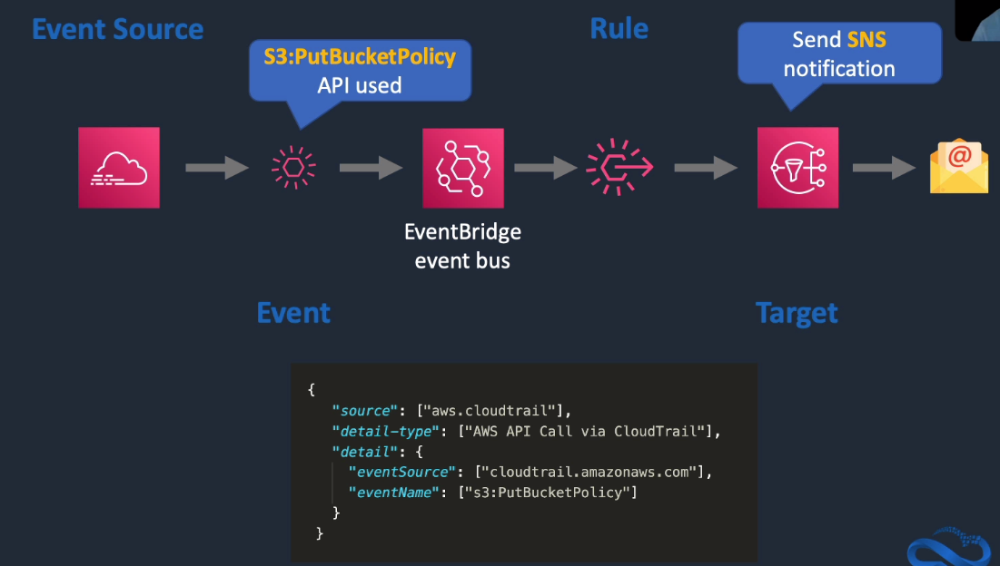

# Amazon EventBridge

## General Info
* used to be known as CloudWatch Events
* not a real time service, can sometimes take time to get a notification
* great use case to have event bridge rule on CloudTrail events to send notifications

## Event-Driven Architecture

The application reacts to events that happens in the environment
* record written in DB
* notification
* message in a queue

## Application Integration Services Comparison

## Example

### Send notification if an EC2 is terminated
EC2 terminated event -> EventBridge event bus -> Rule triggered -> sens SNS notification -> Email

### Trigger events when particular cloudtrail event happens

