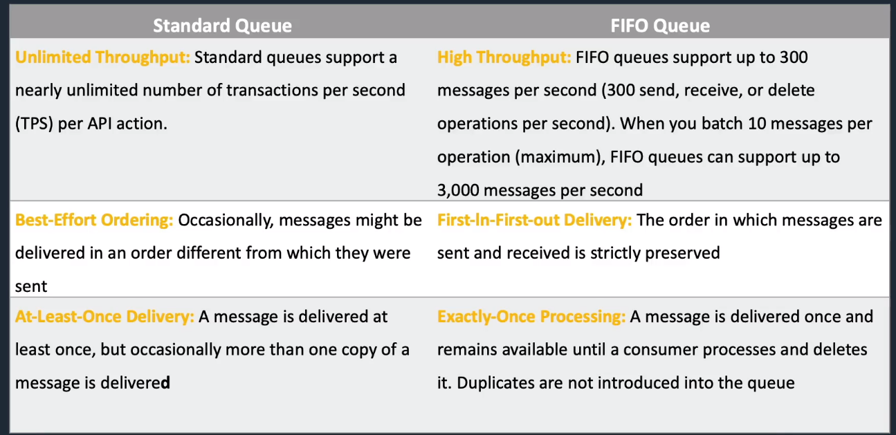

# Amazon Simple Queue Service (SQS)

## General Info

* fast, reliable, scalable, fully managed message queueing service
* good for decoupling -> send/store/retrieve short messages between services
* SQS ensures the delivery of a message at least once and it tries to deliver the message in order, SQS FIFO is exactly once with order respected
* possible to use server side encryption (SSE, CMK)

The queues act as a buffer between the components producing and consuming data.

SQS acts as a buffer for consumer, pull based

Messages up to 256KB in size, can be kept in queue from 1 minute to 14 days (default is 4 days), at least once processing guarantee
* SQS Extended Client (Java) -> max 2GB, data in S3, link in SQS queue message

Queue names must be unique within a region

A good use case is when the producers produce more output that the consumers can consume. Another good use case is when we have consumer not running all the time.

can transmit any volume of data without losing messages or requiring other services to always be available

SQS supports multiple readers and writers => a single queue can be shared by many components 

can delete queue any time even if we have messages in it

URL of a queue: https://sqs.region.amazonaws.com/account-id/queue-name

can have as many queues and as many messages as we want in SQS
queue can be empty 
can list all queues or subset of queues that share the same initial characters in their name

Any application can store in the queue; any application can retrieve from the queue.

A queue can be created in any region

Messages can be sent and read simultaneously.

We can scale an auto scaling group based on the amount of messages in a SQS queue => queues can be used to determine the load of an application by using the length of the queues! This metric can be used in CloudWatch to trigger an alarm for auto scaling.

Always a good way for decoupling when heavy write on database, use Lambda to write from the SQS queue to DB instead of the app directly. => good if we have unpredictable traffic

If we need to scale fast -> always SQS and Lambda since there is no ramp up like EC2 in ASG

If we have a system that goes down for maintenance, we need SQS to prevent data loss
* messages are not deleted if they don't receive a successful processing ACK
* try to reach the system in maintenance repeatedly 

=> this ensures that we don't lose data when system is down

SQS FIFO queue cannot buffer

If job processed before visibility timeout expires -> message deleted from queue else message visible again (min 30 seconds, max 12 hours)

SQS has short and long polling (up to 20 seconds)

SQS can be an event source for Lambda
* lambda process messages in the SQS queue
* supports standards and FIFO
* used to offload some process to Lambda asynchronously
* Lambda polls the queue and invokes the function synchronously with an event that contains queue messages
* batch read and invoke one lambda for each batch
* when successful process -> delete message from queu

## SQS Queue Types

### Standard and FIFO

FIFO queues require the Message Group ID and Message Deduplication ID parameters to be added to messages
* Message Group ID: the tag that specifies that a message belongs to a specific message from group Messages that belong to the same message group are guaranteed to be processed in a FIFO manner
* Message Deduplication ID: the token used for deduplication of messages within the deduplication interval
* exactly once processing
* order strictly preserved
* no duplicates into the queue (interval is 5 minutes) -> MessageDeduplicationId (SHA-256 with the message body)
* 300 transactions per seconds max, can batch 10 messages per operation so max 3k messages per second
* message with different Group ID may be received out of order
* Message with the same group ID are delivered to one consumer at a time
* need both message group ID and message deduplication ID in message for FIFO queues

Standard
* nearly unlimited transactions per second
* at least once delivery
* out of order (potentially) -> best effort ordering

### Dead Letter Queue
* messages not processed successfully are sent there
* main task: handling message failure
* set aside and isolate messages that can't be processed correctly to determine why their processing didn't succeed
* not a queue type, it is standard or FIFO that has been specified as a DLQ in the configuration of another standard of FIFO queue
* Dead-letter queues should not be used with standard queues when your application will keep retrying transmission.

### Delay Queue
This is the visibility of the message in the queue (can be configured)

* postpones delivery of new messages to a queue for a number of seconds
* messages sent to the delay queue remain invisible to consumers for the duration of the delay period
* default delay is 0 seconds, max is 900 (15 minutes)
* for standard, changing this setting only affects new messages
* for FIFO, the delay is applied to all
* when to use
  * large distributed app which may need to introduce a delay in processing
  * need to apply a delay to an entire queue of messages like adding a delay of a few seconds to allow updates to sales or stock control DB before notifications
* must be the same type as the source

## Console / CLI

When a queue is created, we can 

* send message
* view/delete messages
* configure queue
* add a permission
* purge queue => messages are "available" until a process read them
* delete a queue

## Limits

For the **default queues, the message order is not guaranteed** -> use sequencing information or timestamps in the message to handle order, Amazon still tries to keep the messages in order but we must not rely on that. If we absolutely need FIFO -> use SQS FIFO queues with exactly-once processing (not supported in all regions). **The queue name must end with .fifo (SQS4ASG.fifo).**

**message retention in queue**: 4 days by default, can be configured to up to 14 days after message is sent, minimum 1 minute. Messages deleted after 4 days (default) -> queue deleted after 30 days without notification if nothing has been done on the queue (SendMessage, ReceiveMessage, DeleteMessage, GetQueueAttributes, SetQueueAttributes, AddPermission, RemovePermission)

**Max Size 256KB text message** in any format, for any message > 256KB, we can use SQS Extended Client Library which uses S3 (Java) - max 2GB payload.

**Default visibility timeout is 30 seconds**, can be between 0 seconds and 12 hours

**Delivery delay** between 0 seconds and 15 minutes (message time in queue before being really available for processing)

SQS also has the possibility of **Long Polling**
* reduces extraneous polling when there is no message
* Long poll requests wait up to 20 seconds for the next message to arrive. 
* Long poll requests cost the same, potentially save money if no message
* param: WaitTimeSeconds and eliminates empty responses
* short polling returns immediately even if the message queue is empty => ReceiveMessageWaitTime = 0
* can be configured on the queue itself or in each API call we make
* long polling should not be used if app expects an immediate response to receive message calls

## SQS architectures

Some examples of architecture

### Simple decoupling of tiers
Use SQS queue between tiers to give time to a tier to scale based on burst traffic.

### Priority system

Some messages have higher priority than others for processing => use several queues, one for each priority and have the workers first pick the messages from the highest priority.

### Fanout

Use SNS topic to send our messages to multiple SQS queues at the same time to further decouple our processes.

For example, upload image on a website, then S3 then message sent to SNS topic. 3 SQS queues are subscribed to the SNS topic:

* one for thumbnail generation
* one for image recognition
* one for scanning the photo metadata

=> parallel asynchronous processing

## SQS operations

- CreateQueue, ListQueues, DeleteQueue
- SendMessage, ReceiveMessage, DeleteMessage
- SendMessageBatch, DeleteMessageBatch
- ChangeMessageVisibility, ChangeMessageVisibilityBatch
- SetQueueAttributes, GetQueueAttributes, GetQueueUrl
- AddPermission, RemovePermission

## Billing

Billed for 64KB message, 256KB max for a message but it is still billed as 4x64KB messages.

Free tier: first 1 million requests per month are free then $0.50 per 1 million requests + data transfer charges out of SQS

## Monitoring

SQS and CloudWatch are integrated so we can use CloudWatch to view and analyze metrics for queues. 

Metrics sent every 5 minutes, only for "active" queues. CloudWatch considers a queue to be active for up to 6 hours if it contains any messages or if any action accesses it.

Detailed monitoring **not** available for SQS but normal monitoring is free in CloudWatch. CloudWatch metrics are supported for both standard and FIFO queues.

Useful metrics:

* ApproximateNumberOfMessagesVisible: messages in the queue -> great for auto scaling

We can create alarm on metrics such as the queue length to trigger auto scaling of EC2 instances (workers) processing the SQS queues.

## Security
* IAM policies to control who can read/write messages
* authentication can be used to secure messages within queues
* in flight security using HTTPS
* can enable SSE using KMS (CMK), SSE only encrypts the message body, not the attributes

## API
* CreateQueue (aws sqs create-queue): standard or fifo
* DeleteQueue (aws sqs delete-queue): delete queue, regardless of content. Successful response even if queue doesn't exist
* PurgeQueue (aws sqs purge-queue): delete messages in queue
* SendMessage (aws sqs send-message)
* ReceiveMessage (aws sqs receive-message): one or more messages (up to 10), can use WaitTimeSeconds param for long poll
* DeleteMessage (aws sqs delete-message): delete specified message from specified queue -> use ReceiptHandle, not MessageId
* ChangeMessageVisibility (aws sqs change-message-visibility): default 30 seconds, min 0, max 12 hours
* SendMessageBatch
* DeleteMessageBatch
* ChangeMessageVisibilityBatch

## Resources

Documentation: https://docs.aws.amazon.com/AWSSimpleQueueService/latest/SQSDeveloperGuide/welcome.html

CLI: https://docs.aws.amazon.com/cli/latest/reference/sqs/index.html

API: https://docs.aws.amazon.com/AWSSimpleQueueService/latest/APIReference/Welcome.html

FAQ: https://aws.amazon.com/sqs/faqs

