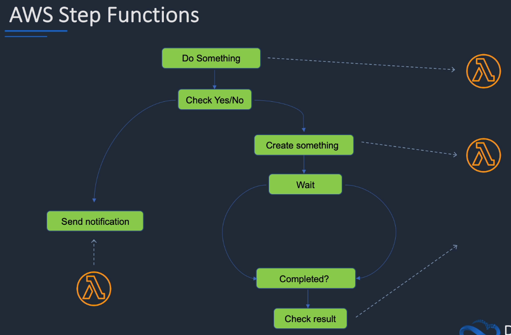

# AWS Step Functions

## General Info

Fully managed service to coordinate components and step through the functions of an application.

Series of steps in a visual workflow.

provides a graphical console to arrange and visualize the components of our application as a series of steps. This makes it simple to build and run distributed services.

**Step functions is frequently used to help orchestrate and visualize application logic in serverless applcations**

automatically triggers and tracks each step and retries when there are errors -> app executes in order and as expected

Step Functions lost the state of each step so when something goes wrong, we can diagnose and debug problems quickly.

It is possible to add, change steps without writing code

Supports orchestration of Lambda functions as wel as applications based on compute resources (EC2, ECS).

All the work in our state machine is done by tasks that can be performed by:

* lambda function integration
* passing parameters to API actions of other services
* activities



How it works
1. define steps of the workflow in the JSON-based Amazon States Language. Or visually with the GUI
2. start an execution to visualize and verify the steps of our app are operating as intended. The console highlights the real time status of each step and provides detailed history of every execution
3. step functions operates and scales the steps of our app and underlying compute for us. Helps ensure our app executes reliably under increasing demand.

SQS queue can be configured as input of a StepFunction workflow -> good for parallel processing of Lambda with a list of tasks in a SQS message

Apps can interact and update the stream via Step Function API.

## Features
* Built-in error handling – AWS Step Functions tracks the state of each step, so you can automatically retry failed or timed-out tasks, catch specific errors, and recover gracefully, whether the task takes seconds or months to complete. 
* Automatic Scaling – AWS Step Functions automatically scales the operations and underlying compute to run the steps of your application for you in response to changing workloads. Step Functions scales automatically to help ensure the performance of your application workflow remains consistently high as the frequency of requests increases. 
* Pay per use – With AWS Step Functions, you pay only for the transition from one step of your application workflow to the next, called a state transition. Billing is metered by state transition, regardless of how long each state persists (up to one year). 
* Execution event history – AWS Step Functions creates a detailed event log for every execution, so when things do go wrong, you can quickly identify not only where, but why. All of the execution history is available visually and programmatically to quickly troubleshoot and remediate failures. 
* High availability – AWS Step Functions has built-in fault tolerance. Step Functions maintains service capacity across multiple Availability Zones in each region to help protect application workflows against individual machine or data center facility failures. There are no maintenance windows or scheduled downtimes. 
* Administrative security – AWS Step Functions is integrated with AWS Identity and Access Management (IAM). IAM policies can be used to control access to the Step Functions APIs.

## Components

**Task** - all work in the state machine is done by tasks, tasks can be an activity or Lambda function

* **activity**:
  * program code that takes input and responds using Step Functions API actions
  * can be hosted on EC2, ECS or even mobile devices
  * interacts with Step Functions using API actions like GetActivityTask, SendTaskSuccess, SendTaskFailure and SendTaskHeartbeat API
* **lambda function**:
  * serverless function that responds to the state machine tasks
  * can be written in a variety of languages
  * can be easily and directly integrated with step functions

**State types** - step functions coordinates tasks through state machines. Each state in a state machine makes decision based on input, performs actions and passes output to other states

* each state has a name which must be a unique string inside that state machine
* state can do different things in a state machine
  * **Task** states do some work - activity or lambda
  * **Choice** states make choices between different branches
  * **Fail/Succeed** states stop the execution with a failure or success
  * **Pass** states pass their input to their output and can inject some fixed data to the process
  * **Wait** states delay the process for a certain amount of time or to a certain date or time
  * **Parallel** states begin parallel executions of the state machine

**Transition**

* when a state machine executes, it uses a StartAt field to select one of the states to begin with
* the next step is defined by the "Next" field which references another state defined in the state machine
* Certain flow-control states allow choices to determine multiple "Next" fields
* Transitions continue until
  * they reach a terminal state with type Succeed/Fail or "End": true
  * they hit a runtime error
* **state machines can only have one start state**

**Input and output**

* each state input is JSON
* state get inputs from previous state or for the first state, the input is passed in at execution
* certain states pass through input without changing it, others modify the input
* task states take the input provided, send that input to a task and then receive output from the task to be passed along

## Structure

**State machines** defined using the **JSON Amazon States Languages**. State machine has an ARN and IAM role associated to it.

JSON file that describes the state machine and creates a visual workflow.

```json
{
  "StartAt": "SendReminder", 
  "States": { 
    "SendReminder": { 
      "Type": "Wait", 
      "SecondsPath": "$.waitSeconds",
      "Next": "ChoiceState"
    },
    "ChoiceState": {
      "Type": "Choice",
      "Choices": [
        {
          "Variable": "$.preference",
          "StringEquals": "email",
          "Next": "EmailReminder"
        },
        {
          "Variable": "$.preference",
          "StringEquals": "sms",
          "Next": "TextReminder"
        },
        {
          "Variable": "$.preference",
          "StringEquals": "both",
          "Next": "BothReminders"
        }
      ],
      "Default": "DefaultState"
    },

    "EmailReminder": {
      "Type": "Task",
      "Resource": "EMAIL_REMINDER_ARN",
      "Next": "NextState"
    },

    "TextReminder": {
      "Type": "Task",
      "Resource": "TEXT_REMINDER_ARN",
      "Next": "NextState"
    },
    
    "BothReminders": {
      "Type": "Parallel",
      "Branches": [
        {
          "StartAt": "EmailReminderPar",
          "States": {
            "EmailReminderPar": {
              "Type": "Task",
              "Resource": "EMAIL_REMINDER_ARN",
              "End": true
            }
          }
        },
        {
          "StartAt": "TextReminderPar",
          "States": {
            "TextReminderPar": {
              "Type": "Task",
              "Resource": "TEXT_REMINDER_ARN",
              "End": true
            }
          }
        }
      ],
      "Next": "NextState"
    },
    
    "DefaultState": {
      "Type": "Fail",
      "Error": "DefaultStateError",
      "Cause": "No Matches!"
    },

    "NextState": {
      "Type": "Pass",
      "End": true
    }
  }
}
```

We can define a DefaultState of type "Fail" in case of error.

## API actions

* **CreateStateMachine**
  * collection of states that can do work
  * specified in JSON based structured languages
* **StartExecution**
* **ListExecutions**: list state machine executions and can use optional filters
  * eventually consistent and may not display most recent executions
  * can get additional results using the *nextToken* value provided in an earlier result
* **StopExecution**

## Benefits of Step Functions

* managed by AWS to be scalable and highly reliable
* visual overview of application logic
* avoid coding large amounts of application logic by defining it in a JSON state machine
* reuse application components and edit workflows easily
* easily integrates with AWS services like AWS Lambda
* executing a state machine is very detailed in the Console, we can see everything (the path, the exceptions, event history, ...)

## Use cases

* upload file to S3 -> lambda triggered -> step functions to do some processing on the files (create thumbnails, transcode videos, index files, ...)
* coordinate AWS Batch jobs that process data like raw reads generated from sequencers and then process them in a genomics pipeline to identify the variation in a biological sample compared to a standard genome reference
* coordinate container tasks in microservices and serverless applications
* publish events from serverless workflows
* access database from serverless workflows, coordinate session-based applications such as all the steps of a checkout process on an ecommerce site
* sequence of machine learning workflows: step functions -> ETL -> sage maker (training) -> sage maker (create model) -> create transform job to run inferences on dataset (sagemaker)

## Resources

User guide: https://docs.aws.amazon.com/step-functions/latest/dg/welcome.html

API: https://docs.aws.amazon.com/step-functions/latest/apireference/Welcome.html

ASL: https://states-language.net/spec.html

