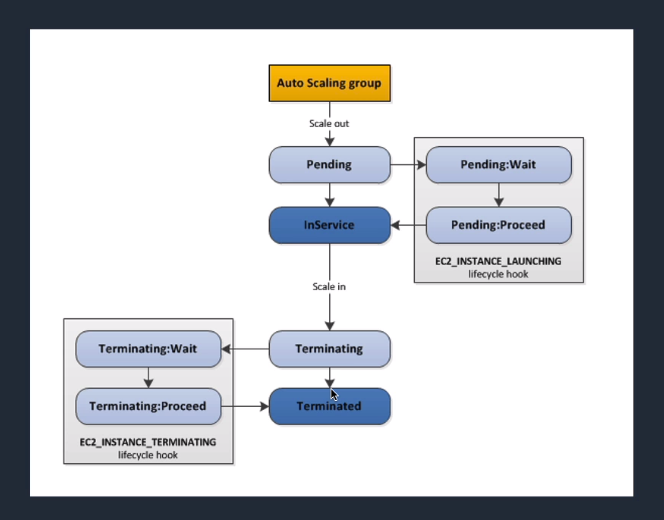
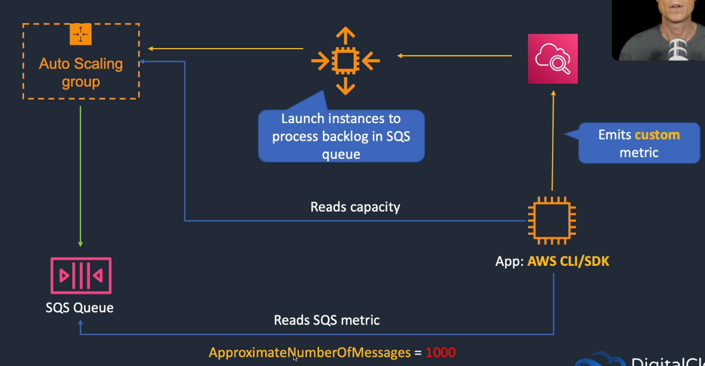
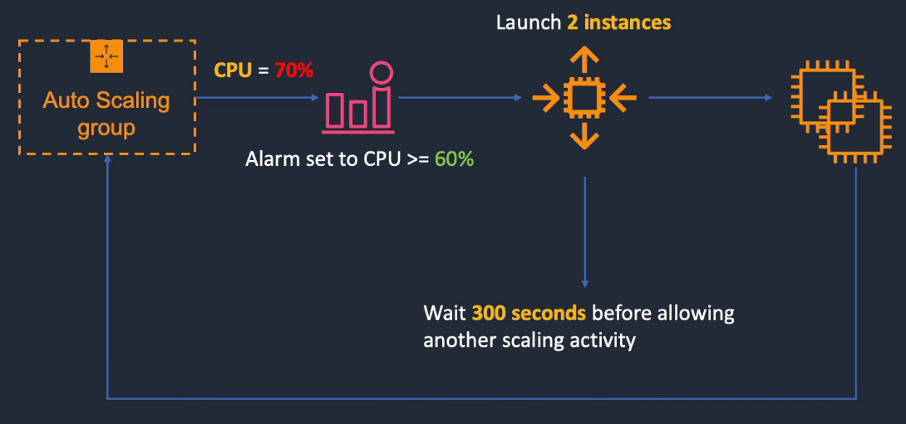
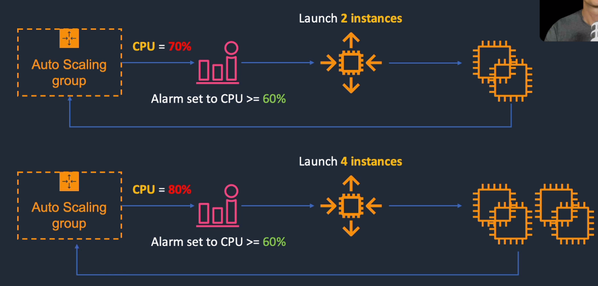
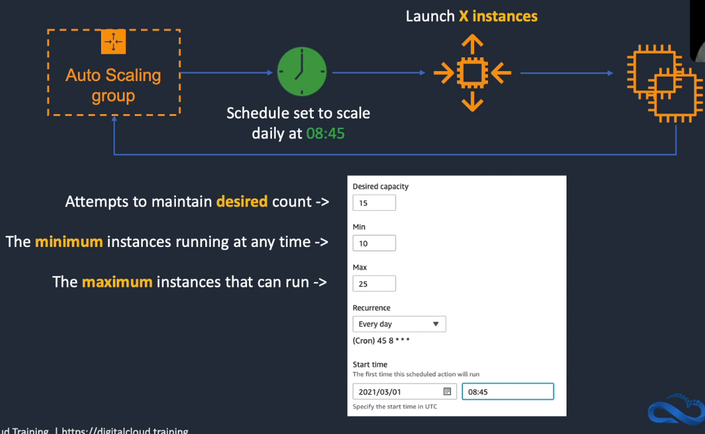

# Amazon EC2 Auto Scaling

## General Info
Auto scaling benefits:
- free, we just pay for the resources
- better fault tolerance 
  - replace unhealthy instances
  - multi AZ
- better availability (make sure we have the right capacity for the load)
- better cost management (do not have idle instances if it is not required)
- better performance (increase capacity as demand increases)
- suitable for stable demand applications or hourly/daily/weekly demand flucutations

If not in ASG, we need to stop/start the instance to be able to be redeployed on a healthy host (**not reboot because the instance will stay as-is**)

If we have auto scaling based on SQS queue depth and our CPU process is killed during scale in because of the long processing time, the cost effective way is to put the ASG in StandBy mode when we process the job and put it into InService when it is done.

status of unhealthy instances: OutOfService and status of healthy instances: InService

when we start an ASG, we must specify either a launch template, a launch configuration or an EC2 instance

when we want to troubleshoot an instance -> InService to Standby state

EC2 ASG supports cooldown periods (default 300 seconds) when using simple/manual scaling policies but not when using target tracking policies, step scaling policies or scheduled policies

when launching multiple instances, cooldown starts when the last instance launches

lifecycle max 48h or 100 hearth beat, whichever is smaller

Lifecycle hooks can affect the impact of any cooldown periods configured for the Auto Scaling group, manual scaling, or a simple scaling policy. The cooldown period does not begin until after the instance moves out of the wait state.

Instance protection starts when the instance state is InService. If you detach an instance that is protected from termination, its instance protection setting is lost. When you attach the instance to the group again, it inherits the current instance protection setting of the group.

Auto scaling not limited to EC2, scaling policies can also be done for ECS, Aurora, EC2 Spot, EMR, read/write capacity and global secondary indexes for DynamoDB

There is a distinction between AWS Auto Scaling (only available in the main first regions) and EC2 Auto Scaling. 
AWS Auto Scaling lets us define dynamic scaling policies for multiple resources across multiple services (EC2 instances and spot fleets, ECS, DynamoDB, Aurora replicas, ...) while EC2 Auto Scaling only handles EC2.
Individual services have their own auto scaling strategy (like EC2 Auto Scaling).
Can select AWS CloudFormation stack for generic auto scaling or select resources based on tags (except for ECS).

Predictive scaling (only EC2, free to use) is a feature of AWS Auto Scaling that looks at historic traffic patterns and forecasts them into the future to schedule changes in the number of EC2 instances.
Predictive scaling sets up the minimum capacity based on forecasted traffic, target tracking changes the actual capacity based on the actual traffic at the moment.
They are both configured together by a user to generate a scaling plan (collection of scaling instructions for multiple AWS resources).
Predictive scaling needs up to two weeks of historical data but can work with 1 day of data.
Every 24h, Predictive Scaling forecasts traffic 48h into the future and schedules capacity changes for those 48 hours.
We can configure a buffer time to start instance before the expected spike happens.

for EC2, it is likely better to use multiple small EC2 instances instead of big ones

## Auto scaling group
ASG is a collection of EC2 instances that have similar characteristics and are treated as one logical group.

**An auto scaling group is based on a launch configuration (mandatory).** We can only specify one launch configuration for an Auto Scaling group at a time. The auto scaling group defines the **minimum number of instances**, the **maximum number of instances** and the desired capacity. The **desired capacity** changes automatically (can also be manually) based on the scaling policies. **We can change the launch configuration of an auto scaling group at runtime**. It will be used when a new instance is required **but the existing instances will not be changed.** If we updated our ASG with a new launch config, we probably want to use the termination policy **OldestLaunchConfiguration** to replace the instances.

It is possible to create an auto scaling group with 0 instance at the start without a scaling policy.

The auto scaling group performs health check on the instances (ELB or EC2).

We can change the size of the ASG at any time. Change desired capacity (increase) to manually create new instances.

Auto scaling group must be configured to launch in multiple AZ otherwise it will launch all instances in a single one.

If user suspends AddToLoadBalancer in ASG -> instances will not be registered with ELB and the user has to manually register when the process is resumed

We cannot merge auto scaling groups, we need to update one to span across zones and remove the other

A **scaling plan** tell the ASG how and when to scale. We can create scaling plans based on **conditions (dynamic) or time (scheduled)**.

A **scaling policy** drives the scale in/out process. Used by CloudWatch for the trigger of the scaling process.

Before creating an ASG, analyze:

- how long it takes to launch and configure an instance
- what metrics have the most relevance to performance
- how many availability zones we want to use
- what role we want auto scaling to play
  - increase/decrease capacity
  - ensures a minimum number of instances is running
- what existing resources we can use (current EC2 instances or AMIs)

**We can create an auto scaling group by specifying an EC2 instance!** We must also specify attributes such as minimum, maximum and desired instances. Auto scaling will automatically create the launch configuration and will associate it with the auto scaling group. The launch configuration will take the AMI ID, instance type and availability zone from the EC2 instance. There are some limitations though:

- tags are not copied to the ASG
- ASG includes block device mapping from the AMI used to launch the instance and not the instance itself (mappings will be lost if added after the instance was started)
- if instance attached to load balancer, the load balancer name is not copied to the Auto Scaling Group **LoadBalancerNames** attribute

The default period between two scaling events is 5 minutes.

### Termination policies

Used to determine which instances should be terminated when scaling in. We can edit the termination policy while the ASG is running, we can also have multiple termination policies active at the same time (can have them all) => executed in order from left to right if the tested policy cannot find any instance to terminate. The default policy should be the last one.

* **OldestInstance**: useful when upgrading the instances in the ASG to a new EC2 instance type
* **NewestInstance**: useful when testing a new launch config but don't want to keep it in production
* **OldestLaunchConfiguration**: useful when updating a group and phasing out the instances from a previous config
* **ClosestToNextInstanceHour**: terminates instances closest to the next billing hour. helps maximize the use of our instances and manage EC2 usage costs
* **AllocationStrategy**: terminate instances in the ASG to align the remaining instances to the allocation strategy for on-demand or spot instances, current selection of instance types, distribution across N lowest priced spot pools.
* **OldestLaunchTemplate**: first the non current launch template followed by the oldest version of the current launch template. Useful when updating a group and phasing out the instance from a previous configuration.
* **Default**: useful when we have more than one scaling policy for the group
  * check AZ imbalance and pick one with the most instances
  * check instances with oldest launch config, if there is only one instance using the old launch config -> terminate this one
  * if more instances, select instances closest to the next billing hour, if multiple select one at random

**Even if we have custom termination policies, the ASG will first check for imbalances across AZ (if we have an AZ with 4 and another one with 2, the termination policies will be applied on the AZ with 4)**

We can have **instance protection** set to our instances and they won't be touched during a scale in. The only way to remove it is manually or if it is marked unhealthy. **The instance protection can be applied to a single instance or the complete ASG.**

### Suspending auto scaling

We can suspend any of the following process, we can also suspend more than one of those processes. Generally, we suspend for troubleshooting (resize an instance, ...) -> this is due to avoid triggering auto scaling with our manual actions. 

We can use the API, CLI, Console. We can edit this setting while the ASG is active.

* Launch: if we suspend Launch, this disrupts the other processes. For example, if we have an instance in a standby state, we wouldn't be able to change that instance to an InService state. => **if this process is suspended, we will not be able to launch new instances**
* Terminate: if we suspend Terminate, this disrupts other processes. **For example, any actions that would start a scale in process will not work.**
* Health Check: either EC2 instances unhealthy or if the ELB reports the instance as unhealthy. Even if we manually set the health check of an instance, the process can override that.
* ReplaceUnhealthy: works with health check, terminate, launch processes
* AZRebalance: kill instances from one AZ to balance with another one
* AlarmNotification: receive notification from CloudWatch alarms. Suspend this and this remove the ability to execute scaling policies from received CW alarms notification.
* ScheduledActions: scale policy for certain days of the weeks or certain times during the day
* AddToLoadBalancer: add instances to the load balancer when they are launched. Useful for testing new instances. **We do not suspend the launch of an EC2 instance, they are just not added to the load balancer.** When we resume this, we need to manually add these instances to the load balancers because only the new ones will be added to the load balancer.

### Self-healing
In an ASG, instances are either **healthy** or **unhealthy**. If an instance is marked as "impaired" (unhealthy), it is terminated and replaced.

**Auto scaling group with min 1, max 1, desired 1**

Used for:

- creating a low cost, self healing, immutable infrastructure. 
- No additional software to install or configure. 
- Keep servers running and highly available without user interaction.

Good for:

- important servers we need to stay online but only require one
- Bastion/Jump Box or an OpenVPN server

## Dynamic Scaling
Scale out = increase number of instances (horizontally)
Scale in = decrease number of instances (horizontally)
Scale up = more powerful instance
Scale down = less powerful instance

Random facts
* Good way to delete an auto scaling group with the instances -> set minimum size and desired capacity to 0.
* If an ASG is deleted, all the instances will be terminated and the ASG will be deleted
* Can suspend Launch or Terminate in ASG independently -> good way to debug a problem in an EC2 without triggering the scaling process
* Replacing unhealthy instances: first terminates the instance and then launch a new instance
* Using the CLI, we can define the instance health ourselves (--health-status) for instance, but it is almost impossible to do it unless the ASG is suspended (error if instance is being terminated)

Scaling process => we can disable specific actions if needed!
* Launch - adds a new EC2 instance to an ASG
* Terminate - Removes an EC2 instance from the group
* AddToLoadBalancer - adds instances to an attached ELB or target group
* AlarmNotification - accepts notifications from CloudWatch alarms that are associated with the group's scaling policies
* AZRebalance - balances the number of EC2 instances in the group evenly across all the specified AZ
  * Autoscaling can potentially grow more than the maximum size in AZRebalance process (10% more allowed) if the terminate process is suspended
* HealthCheck - checks the health of the instances and marks an instance as unhealthy if Amazon EC2 or ELB tells ASG that the instance is unhealthy
* ReplaceUnhealthy - terminates instances that are marked as unhealthy and then creates new instances to replace them
* ScheduledActions - performs scheduled scaling actions

Settings to know
* Cooldowns - used with simple scaling policy to prevent ASG from launching or terminating before effects of previous activities are visible. Default is 5 minutes.
* Termination Policy - controls which instances to terminate first when a scale in event occurs
* Termination Protection - prevents auto scaling from terminating protected instances
* Standby State - used to put an instance in the InService state into the Standby state, update or troubleshoot the instances
* Lifecycle Hooks - used to perform custom actions by pausing instances as the ASG launches or terminates them



### Target tracking with auto scaling group metrics
* we say that we want the ASGAverageCPUUtilization to be 60%
* AWS recommend scaling on metrics with a 1-minute frequency
* there is a warm up period for the instance boot -> instance metrics are not counted until warm up time has expired

Metrics
* ASGAverageCPUUtilization
* ASGAverageNetworkIn: average number of bytes received on all network interfaces by the ASG
* ASGAverageNetworkOut
* ALBRequestCountPerTarget: number of requests completed per target in an ALB target group

### Target tracking with SQS
App gathers info from SQS queue, ASG metrics and emit a custom metric to CloudWatch which can start instances to process backlog



### Simple scaling


### Step scaling
All about the size of the alarm breach



### Scheduled scaling
Scaled in at a certain time, scaled out at another time



## Auto Scaling default limits
100 launch config
20 ASG
50 lifecycle hooks per ASG
50 (10 attached) load balancers per ASG
20 step adjustments per scaling policy

## Launch Configuration
Auto scaling is driven by a **launch configuration** is a template for the EC2 instances we will launch in our ASG where we specify

- AMI
- instance type
- key pair
- one or more security groups
- block device mapping

When creating a launch configuration, we can provide any configuration we want for the EC2 template (IAM Role, monitoring details, user data, IP address assigned (only in public subnet, to all instances or no IP assigned), the Linux kernel we want to use, ...)

**We cannot edit a launch configuration**, we need to copy it and change it while we create it. We can use a launch configuration with multiple auto scaling groups. 

**We can create a launch configuration from a running EC2 instance.** Note that sometimes, some EC2 properties are not supported by the ASG so the instances created will not be completely similar. ASG will derives the following when copying a running instance:

- attributes from the instance
- block device mapping from AMI => **ignores any additional block device we may have added to the instance after launch**
- we can also override values that are created
  - AMI
  - block devices
  - Key Pair
  - instance profile
  - instance type
  - Kernel
  - Monitoring (detailed)
  - placement tenancy
  - Ramdisk
  - security groups
  - Spot price
  - User Data: bash script to configure an instance
  - Assign Public IP
  - EBS Optimized

### Spot instances in launch configuration

If our instances can be started and stopped without any need for the load -> use spot instances in the ASG. **=> we CANNOT use the same launch configuration to launch on-demand instances and spot instances**

We set our bid price in the launch configuration **(we need to create a new launch configuration to change our bid price)**

If the instance is terminated, auto scaling will attempt to launch a replacement to maintain desired capacity (only if the bid price is still respected).

## Auto Scaling Triggers
CloudWatch can send a notification to an ASG based on metrics and threshold.

Autoscaling triggers can be an SQS queue size -> make sure we can process all messages.

First create a launch configuration then an autoscaling group. We now need to create scaling policy

``` bash
aws autoscaling put-scaling-policy --policy-name sqs-scaleout --auto-scaling-group-name ASG4SQS --scaling-adjustment 1 --adjustment-type ChangeInCapacity
aws autoscaling put-scaling-policy --policy-name sqs-scalein --auto-scaling-group-name ASG4SQS --scaling-adjustment -1 --adjustment-type ChangeInCapacity
```

This returns two ARN that we will use in CloudWatch for scaling out

```bash
aws cloudwatch put-metric-alarm --alarm-name AddCapacityToProcessQueue --metric-name ApproximateNumberOfMessagesVisible --namespace "AWS/SQS" --statistics Average --period 300 --threshold 3 --comparison-operator GreaterThanOrEqualToThreshold --dimensions Name=QueueName,Value=SQS4ASG.fifo --evaluation-periods 2 --alarm-actions arnofthescaleoutpolicy
```

... and for scaling in

``` bash
aws cloudwatch put-metric-alarm --alarm-name RemoveCapacityToProcessQueue --metric-name ApproximateNumberOfMessagesVisible --namespace "AWS/SQS" --statistics Average --period 300 --threshold 1 --comparison-operator LessThanOrEqualToThreshold --dimensions Name=QueueName,Value=SQS4ASG.fifo --evaluation-periods 2 --alarm-actions arnofthescaleinpolicy
```

In both cases, thresholds will drive the scale out/in events => must be adapted for real use cases.

```bash
aws cloudwatch describe-alarms --alarm-names AddCapacityToProcessQueue RemoveCapacityToProcessQueue
```

```bash
aws autoscaling describe-policies --auto-scaling-group-name ASG4SQS
```

If we send 3 messages in the queue (thresholds 3 for scale out), new instance is created.

The scale in and scale out policy change the desired capacity.

## Notifications (SNS) & Monitoring (CloudWatch)
To be notified when ASG detects unhealthy instances, we can use SNS.
=> SNS coordinates and manages the delivery or sending of notifications to subscribing clients/endpoints. We can configure ASG to send an SNS notification whenever ASG scales.

If user suspends Auto Scaling AlarmNotification (CloudWatch -> ASG) -> AWS will receive the alarms but will not execute Auto scaling policy.

Most secure way for EC2 instances in ASG to write custom metrics to CloudWatch -> IAM role with CloudWatch permissions and modify the autoscaling configuration to use EC2 instances that have been assigned the new role

Can change CloudWatch detailed monitoring by creating a new launch config with detail monitoring enabled and update the auto scaling group
Detailed monitoring is enabled by default for ASG

Can also configure CloudWatch to send a notification to ASG based on CPU Utilization and configure AS policy to remove the instance

### Auto scaling metrics
Can keep an eye on instances, lifecycle hooks, ...

* GroupMinSize: the min size of the ASG
* GroupMaxSize: the max size of the ASG
* GroupDesiredCapacity: the desired capacity of the ASG
* GroupInServiceInstances: number of healthy instances
* GroupPendingInstances: pending states count
* GroupStandbyInstances: standby states count
* GroupTerminatingInstances: terminating instances count
* GroupTotalInstances:  show total number of instances in the ASG (in service, pending and terminating

## Lifecycle
Life of an EC2 instance attached to an ASG.

- starts when the ASG launches an instance
- ends when we terminate the instance or when the ASG takes the instance out of service and terminates it

Process

1. ASG receives order to scale out and creates an instance that has the state **Pending**
2. the instance comes in contact with **EC2_INSTANCE_LAUNCHING lifecycle hook** then state **Pending: wait** then state **Pending: proceed**
3. After the hooks, the instance is attached to the ASG and has the state **InService **(=> part of the desired capacity count in the ASG). The instance will remain active unless
   1. **Terminated**
      1. scale in policy occurs
      2. fail health check
         => the instance enters the **terminating phase** which calls another lifecycle hook called **EC2_INSTANCE_TERMINATING**, the state is **Terminating: Wait** and then **Terminating: Proceed**.
      3. finally the state is Terminated
   2. **Standby**: the instance is put in state **EnterStandby** => **EnteringStandby** => **Standby**. Instances in this state will continue to be managed by the ASG but they won't receive traffic. When they are selected to take traffic again, they go to state **Pending** through **InService**.
   3. **Detached**: **DetachInstances -> Detaching -> Detached -> standalone EC2 instance**. The instance can be reattached **AttachInstances** which goes to the states **Pending** through **InService**

### Lifecycle Hooks
**The hooks allow us to perform custom actions as ASG launches or terminates instances.** For example, we could install software on a newly launched instance or copy logs from an instance before termination. Hooks solve the problem of taking a long time to configure our new instances because we don't want to mark them as unhealthy if the configuration takes a long time. We don't want to serve traffic to an instance that is still being configured and marked healthy.

When ASG launches or terminates instances, a **cooldown** takes effect. The cooldown period helps ensure that the ASG doesn't launch/terminate more instances than needed. The cooldown starts when an instance enters the **InService** state so if an instance is left in the **Pending: Wait** as we perform functions on it, ASG will still wait before adding any additional servers.

At the conclusion of a lifecycle hook, an instance can result in one of two states: **ABANDON** (terminate instance and launch a new one if necessary) or **CONTINUE** (put the instance into **InService**).

We can use lifecycle hooks with Spot instances but this does **NOT** prevent an instance from terminating due to a change in the Spot price. When a Spot instance terminates, we must still complete the lifecycle action.

Lifecycle hooks can also be used to send notifications to CloudWatch, SNS, ...

Lifecycle hooks are global to an ASG and not to a particular instance.

#### Steps

**Scale out**

1. scale out events: new instance created
2. Pending state
3. pending: Wait state: wait until continue status received or timeout, wait 60 minutes default, can be extended to 48h max (record-lifecycle-action-heartbeat)
4. Read custom actions: information for the config (bash scripts, ...) and a token to control the lifecycle action
5. Pending: Proceed state, default wait 60 minutes 
6. InService

**Scale In**

1. scale in events
2. Terminating state
3. Terminating: Wait state
4. Read custom actions
5. Terminating: Proceed state
6. Terminated

**=> if we need more time, we can manually send a heartbeat (record-lifecycle-action-heartbeat) or change default wait timeout (put-lifecycle-hook with param heartbeat-timeout).**

**=> 48 hours is the maximum we can keep a server in a wait state, regardless of heartbeats.**

Good use of Lambda here. For example, when it is in waiting state, a lambda could do some API calls and directly impacts the EC2 instance with custom configuration.

We can set a notification target for our lifecycle hooks to send a notification (CloudWatch, SNS, SQS, ..)

We can call **complete-lifecycle-action** command to tell the ASG to proceed (CONTINUE/ABANDON).

=> even in pending: wait state, our instance is healthy. But since the state does not match InService, no traffic is sent to it.

#### Creation

We need to specify

* lifecycle transition
  * instance launch -> autoscaling:EC2_INSTANCE_LAUNCHING
  * instance terminate -> autoscaling:EC2_INSTANCE_TERMINATING
* the heartbeat timeout (default 3600 seconds)
* the default result (ABANDON or CONTINUE)
* the notification metadata (optional)

When doing it in the console, we need to first create the ASG with 0 instance then create the lifecycle hook then change the desired capacity.

#### Example

This script will be copied into the **user data** of the lifecycle hook.

````bash
wget http://dl.fedoraproject.org/pub/epel/epel-release-latest-7.noarch.rpm && \
rpm -ivh epel-release-latest-7.noarch.rpm && \
yum update -y && \
yum install stress -y && \
INSTANCE_ID="`wget -q -O - http://instance-data/latest/meta-data/instance-id`" && \
aws autoscaling complete-lifecycle-action --lifecycle-action-result CONTINUE --instance-id $INSTANCE_ID --lifecycle-hook-name devops-pro-hook --auto-scaling-group-name devops-pro --region eu-central-1 || \
aws autoscaling complete-lifecycle-action --lifecycle-action-result ABANDON --instance-id $INSTANCE_ID --lifecycle-hook-name devops-pro-hook --auto-scaling-group-name devops-pro --region eu-central-1
````

All the actions need to complete successfully before sending CONTINUE else ABANDON is sent.

Our EC2 instance needs to have a role that allows autoscaling actions such as autoscaling:CompleteLifecycleAction

## Tuning

If we scale out and scale in too fast, we will overused or underused our EC2 instances.

There is a rule of thumb -> we scale out fast and we scale in slow! 

The best way is to understand our load, our spikes and tune against that. We don't want to overreact to every spike.

## Potential problems

- associated key pair does not exist (SSH)
- security group does not exist
- autoscaling config is not working correctly
- autoscaling group not found
- instance type specified is not supported in the AZ, not supported for auto scaling
- AZ is no longer supported (very unlikely)
- invalid EBS device mapping
- autoscaling service is not enabled on our account (AWS organization for instance)
- attempting to attach an EBS block device to an instance store AMI

If instance launched via ASG are being marked unhealthy due to an ELB health check (but instances still running) -> add ELB health check to the ASG. This will check the results of both EC2 instances status check and the ELB instance health check.

If ASG fails to launch a single instance for more than 24 hours -> AS will suspend the scaling process

Multiple scheduled actions can be specified but should have unique time value, they cannot overlap otherwise -> error
We cannot have the desired capacity lower than minimum capacity -> error

## Using AMI for autoscaling

When lots of setup and config must be done on an EC2 instance before being available, it is better to create an AMI from an already done setup. This way, we can react faster to autoscaling events.

When creating an image, the instance must be either **running** or **stopped**, we cannot create one when the instance is stopping or terminating. Visibility is private by default. When creating an AMI, the status is **pending** until it is **available**. The AMI has an **owner** ID, an AMI ID and a name.

For the ASG, if we create tags, they will be applied to all EC2 instances created with this ASG.

## Blue/Green deployment

If we can't/don't want to do B/G deployment using DNS.

### Using the load balancer and blue/green ASG

**we can use load balancing for traffic management to the B/G environments. The DNS record will always point to the load balancers, we just switch the auto scaling groups in the load balancer => we can have multiple ASG behind the same ELB!**

This technique uses autoscaling to manage the EC2 resources for the blue and green environments, scaling up or down based on actual demand. Autoscaling integrates with ELB so any new instances are automatically added to the LB pool if they pass the health checks governed by the load balancer. 

A blue group carries the production load while a green group is staged and deployed with the new code. When it is time to deploy, we attach the green group to the existing load balancer to introduce traffic to the new environment. **The green ASG will be favored because of the "least outstanding request" algorithm.** **With this technique, we don't have weighted routing like with Route 53 B/G but we can still simulate that with the desired capacity and max instances of our ASG green&blue.**

As we scale up the green ASG, we can take the blue ASG instances out of service by either terminating them or putting them in Standby state in case there is a need to rollback.

**Good point as well is that our load balancer is already warmed for the current production traffic!**

### Using the ASG launch configurations

Only one launch configuration with an ASG at a time and it can't be modified after we created it. Replace the existing launch config (blue) with the new launch config (green).

Scale the auto scaling group to twice its original size. Then shrink  the auto scaling group back to its original size. By default, instances with the old launch configuration are removed first (or we could place the instances in Standby state for rollback)

To perform a rollback, update the ASG with the old launch configuration then do the preceding steps in reverse.
