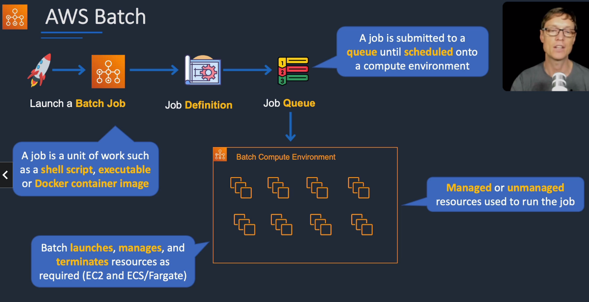

# AWS Batch

## General Info

managed service that runs batch computing workloads at scale in containers. Batch configures and manages the 
environment automatically (scaling).

AWS Batch dynamically provisions the optimal quantity and type of compute resources based on the volume and 
specific resource requirements of the batch jobs submitted.

* EC2 
* EC2 spot instances

No need to manage clusters, fully serverless. We just pay for the underlying EC2 instances

Run batch jobs as Docker images

We submit jobs (CloudWatch events) or we can orchestrate them (AWS Step Functions) and then we monitor the progress.

AWS Batch is only designed for scheduling and allocating the resources needed for batch processing. If we need to synchronize
long running process -> AWS Step Functions.

Compute can be done on managed resources (AWS handles everything) or unmanaged (we manage)

## Use cases
* financial services: post trade analatics
* life sciences: drug screening for biopharma
* digital media: visual effects rendering

## Components
* Job: shell script, Linux executable or Docker container image
* Job Definition: specifies how jobs are to be run
* Job Queues: jobs reside here while waiting for a compute environment
* Compute environment: compute resources running the jobs

## AWS Batch vs Glue
Glue

* very apache spark focus
* Glue ETL: run apache spark code, scala or python based, focus on ETL
* Glue ETL: do not worry about configuring or managing the resources
* Data Catalog to make the data available to Athena or Redshift Spectrum

Batch

* for any computing job regardless of the job (must provide Docker image) - example cleanup an S3 bucket
* resources are created in our account, managed by Batch
* for any non-ETL related work, Batch is probably better

## Resources
FAQ:  https://aws.amazon.com/batch/faqs/