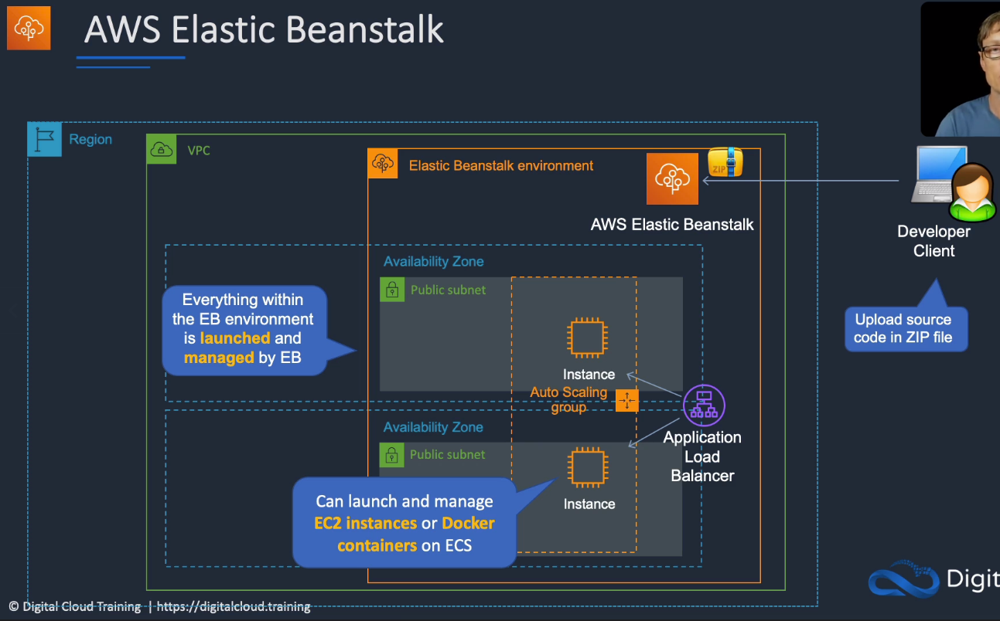
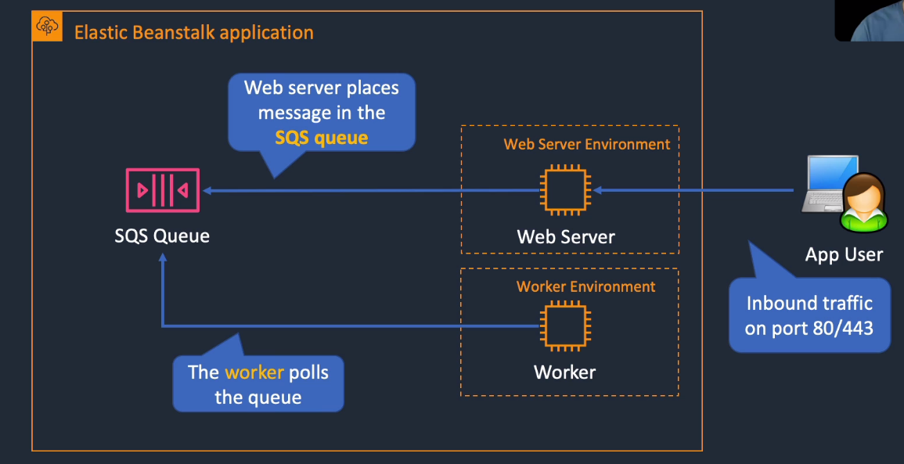
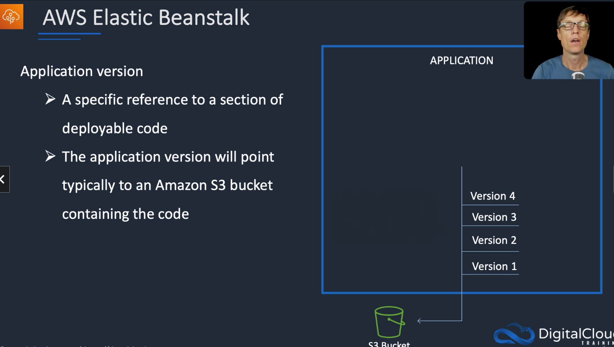
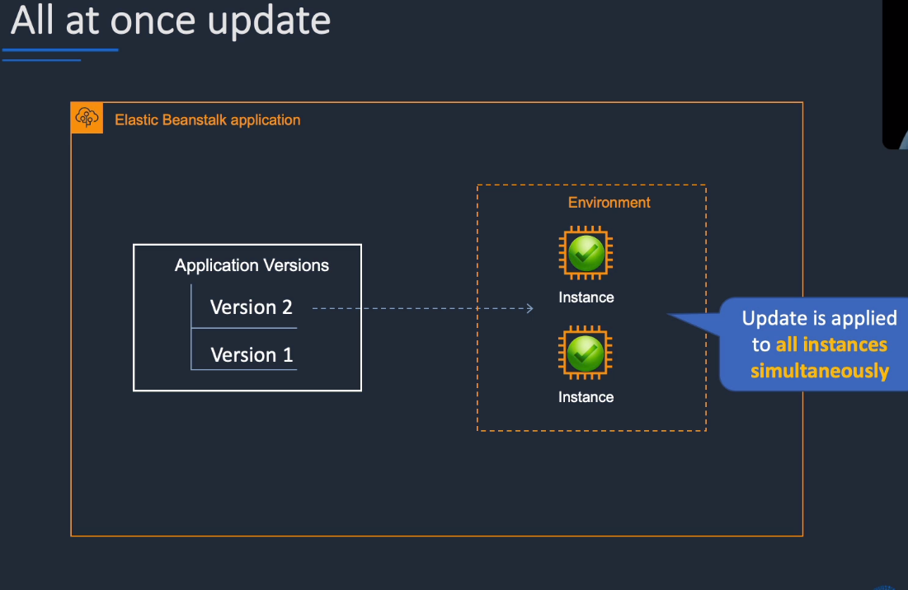
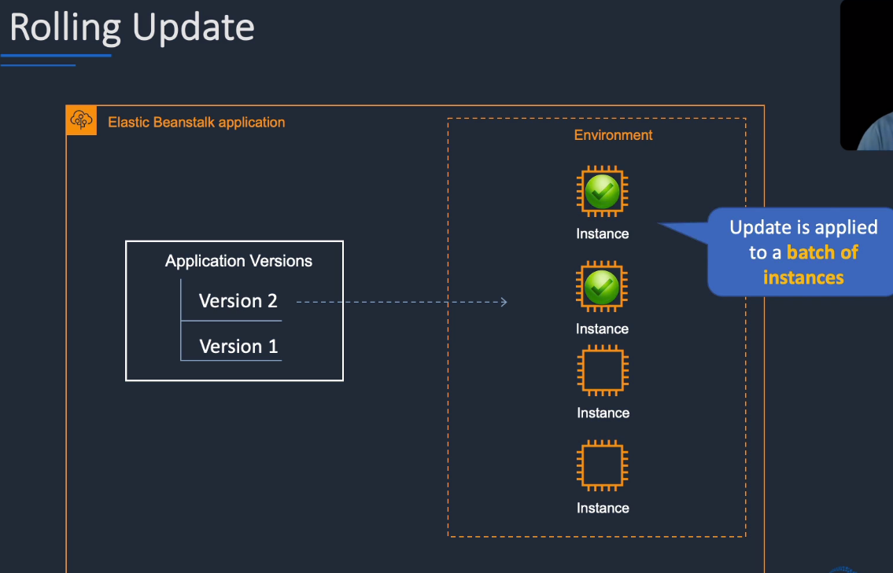
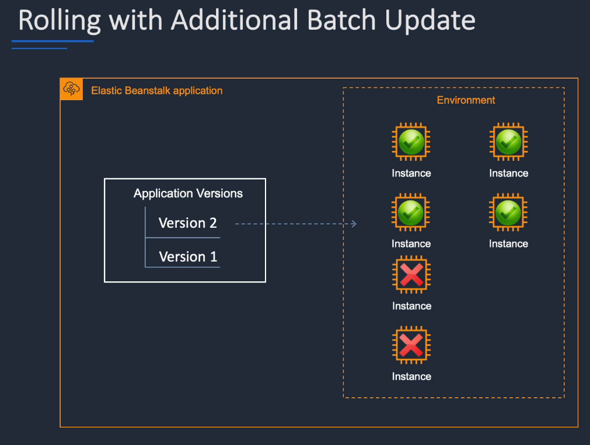
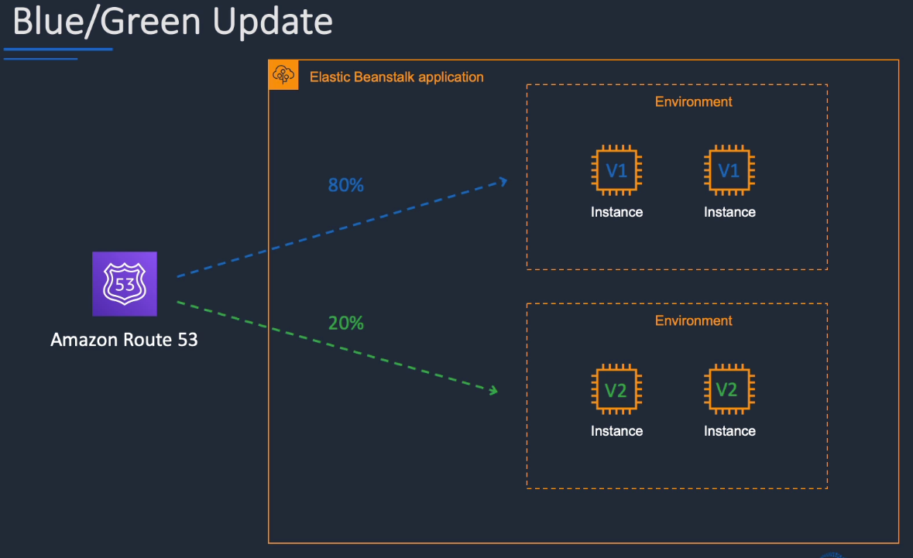
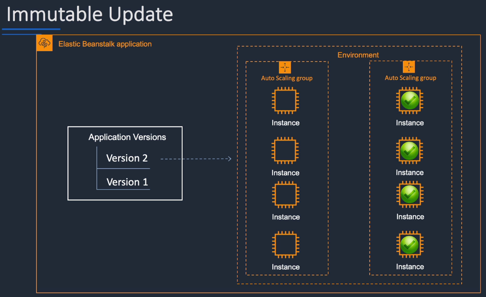

# AWS Elastic Beanstalk 

## General Info

The infra is handled by AWS, developers can focus on code. Platform-as-a-Service solution

Benefits:

- fastest and simplest way to deploy a web app in AWS
- auto scale up and down
- can select EC2 instance type that is optimal for our app
- retain full administrative control over resources powering the app OR have beanstalk do it for us
- automatically managed platform updates: OS updates, Java, PHP, NodeJS, ...
- we can monitor and manage application health via a dashboard
- integrated with CloudWatch for metrics
- integrated with X-Ray for performance data
  => updates, monitoring, metrics and healthcheck all included

When we delete the application, all the resources created are deleted as well.
Great for simple application. For application that requires lots of services -> use CloudFormation.

AWS Stores application files and optionally, server log files in S3. Enabling log file rotation to S3 in Beanstalk config -> send logs to S3 after rotation otherwise they are deleted after 15 minutes. S3 can also be used for application storage (**include SDK in the app deployable file**).

Beanstalk has a highly abstract focus towards infrastructure, focusing on components and performance, not configuration and specifications.

We can easily download the logs of the system of our application (last 100 lines of logs for example).

In Beanstalk, we can directly create alarms based on our resources.

There is leader-only options to execute commands only on one node (the leader), afterwards it becomes a normal node like the rest.

4 main components: create application, upload version, launch environment, manage environment

enhanced health check, all instances must pass 12 health checks in 2 minutes, 18 minutes over 3 minutes for worker

By default, the application deployed on beanstalk is public but we can use private VPC with properly configured subnets, security groups and NACLs to have a private beanstalk.

IAM users with appropriate permissions can interact with Beanstalk. We can allow/deny permissions to specific Beanstalk resources such as applications, application versions and environments.

order or precedence from least to highest

1. ebextension configuration files
2. saved configurations (restore point of a running environment)
3. settings applied directly to the environment via the console, CLIs or SDKs
if we have data stored on EBS and we want to have access from EC2 for each deployment -> use .ebextensions and config file with BlockDeviceMappings option

## Core knowledge
We just have to create VPC, subnets. All the rest (LB, EC2, RDS, ...) is managed by Elastic Beanstalk. Best practice not to have RDS managed by beanstalk though.



Supports: Java, .NET, PHP, Node.js, Python, Ruby, Go, Docker web applications + their platforms (Tomcat, Apache, Nginx, Passenger, Java SE, IIS)

Keywords for exams:
* if we are a developer and don't care about the infra
* migrate to AWS without worrying about infrastructure
* simple way to deploy code

### Key architecture components
**<u>Applications</u>** are the high level structure in beanstalk. 
* An entire application can be one Elastic Beanstalk or each logical component of our application can be an EB application or an EB environment within an application. 
* Application represents a **workload** or **workload group.** 
* => collection of components such as environments, versions and configuration
* Each application is provided with its own URL and can be accessed independently. **URL can be swapped between environment in order to control deployments, especially blue/green deployment.** For example, we can deploy in dev environment and do some testing. Once the testing is successful, we swap the URL with the prod. This way the dev environment becomes the new production environment.

An **<u>environment</u>** is an isolated self-contained set of components and infrastructure. 
* Applications can have multiple environments (prod, staging, dev, v1, ...)
* can also be **functional type** (front-end, back-end). 
* Environments are either **single instance** or **scalable**
* Environments are either **web server environments** or **worker environments**  
  * worker environment
    * used to handle tasks that take a long time to complete. This is used to decouple the frontend from a process that performs blocking operations (more responsive) => processing images, videos, sending email, generate ZIP archive, ... 
    * support SQS DLQ. One option is to spawn a worker process locally, return success and process the task asynchronously, must be combined with SQS for best perf/reliability. 
    * also good for scheduled tasks
  * web servers
    * standard applications that listen for and then process HTTP requests, typically over port 80
  


**<u>Application versions</u>** are unique packages which represent versions of apps
* we can deploy in multiple environments like dev, testing, staging, prod, ...). A single version can be deployed to one or more environments within an application
* An application is uploaded to Beanstalk as an **application bundle** - .zip. 
* We can have multiple versions in an application
* **Each application can have many versions 1:M relationship** => same version for every component or different versions for each component



**<u>Environment configurations</u>** are settings and parameters that define the environment and resources 
* To update an environment, we just need to change the config in ebextensions and beanstalk will update it automatically.

**<u>Configuration template</u>** is used to create repeatable environment configurations

## Deploy / undeploy / updates
Beanstalk uses CloudFormation under the hood => we have access to resources type and configurations supported by CF. 
When we create a beanstalk environment, we can find it as a CloudFormation stack (awseb*) in the CloudFormation console!

Provide functionality which can be utilised by CI/CD servers

If we deploy an application with a bug and our environment is still being updated. We cannot deploy another application while the deployment is ongoing. 
We need to wait to have the environment available for deployment again and rollback. 
We can still abort the current deployment though, and then we can update with the correct version.

Undeploy/shutdown -> remove an environment, multiple environment in a single instance of Beanstalk

### Deployments policies
Default deployment from console or CLI: rolling and all at once with SDK

Can update the whole environment or rolling updates to a percentage.

all at once 
  * in place updates
  * deploys the new version to all instances simultaneously. 
  * Our application is down during that time
  * fastest deployment
  * good for quick iterations in dev environment
  * if update fails, need to roll back the changes by re-deploying the original versions to all of our instances
  * no additional cost since we are not launching additional instances



rolling: update a batch of instances, and then move onto the next batch once the first batch is healthy
  * based on health (beanstalk waits until instances in a batch pass health checks before moving on to the next batch) or time running
  * we have lower capacity during the updates (may or may not be a problem)
  * downtime is one batch at a time
  * application is running both versions simultaneously
  * not ideal for performance sensitive systems
  * if update fails, we need to perform an additional rolling update to roll back the changes
  * no additional cost
  * long deployment time



rolling with additional batch: like rolling but launches new instances in a batch ensuring that there is full availability
  * batch rolling updates default timeout 30 minutes
  * more expensive since we create new instances
  * no reduced capacity
  * can set the batch size
  * app running both versions simultaneously
  * additional batch is removed at the end of the deployment
  * long deployment time
  * good for prod if we can't reduce capacity



blue/green: create a new "stage" environment and deploy updates there
  * Beanstalk provides the possibility to easy clone an existing environment, update the new one and use it instead of the old one if the tests are fine (blue/green deployment). Beanstalk provides also the "swap environment URLs" action to easily switch the URL of two applications. Environments are still running while we are doing the swap.
  * Deployment zero downtime with a clone and a URL swap. To update an app, we just need to upload a new version and then deploy to an environment
  * not a beanstalk feature, we use Route53 with weighted routing policy
  * zero downtime



immutable: 
  * launches new instances in a new ASG and deploys the version update to these instances before swapping to these instances once healthy
  * requires enhanced health reporting to evaluate our environment's health during update
  * for a period, we have double the capacity provisioned
  * zero downtime
  * high cost
  * long deployment
  * quick rollback in cases of failures
  * great for prod environment
  * no reduce capacity



## Beanstalk technologies support

Service for deploying and scaling web applications developed in many popular languages like Java, .NET, PHP, Node.JS, Python, Ruby, Go and docker.

Many available application server platforms like Apache Tomcat, Apache HTTP for Python/PHP, Nginx (Node.js), Puma and Passenger (Ruby) and IIS for .NET. **Docker can be used to support any programming languages that is not natively supported by Beanstalk.**

Supported deployment platforms include git, IDE (eclipse, visual studio) and manual uploads like .war and .zip files.

**AWS services used by Beanstalk: EC2, RDS, ELB, ASG, S3, SNS / OS used by Beanstalk: Amazon Linux or Windows Server 2012 R2.**

For data layer -> can use RDS, DynamoDB, SQL Server, Oracle or other SGBD running on EC2.

## Maintenance

* We can specify a maintenance windows (weekly 2h long time slot, updates can complete outside of the maintenance window) where the environment will automatically be updated (OS, web and app servers, languages, frameworks, ...). 
* Maintenance window is per environment basis -> allows env updates to be staggered if we don't want multiple pieces of our app to be updated at the same time.
* If we don't set a time for the maintenance window, one is selected for us
* This is not enabled by default, we need to configure which types of updates to allow and when updates can occur. 
* During an update, only the "abort" action is available
* Only minor updates and patches will be automatic, the major updates with breaking changes (Tomcat 7 to Tomcat 8) will not be applied automatically. For MAJOR upgrade, we can apply the update in-place on an existing environment or create a clone of an existing environment with the new platform version. 
* Platforms are versioned with MAJOR.MINOR.PATCH. MAJOR means there are incompatible changes, MINOR is an additional feature that is backward compatible, PATCH is backward compatible bug fix. The automatic updates is done on a new set of instances (blue/green => immutable).
* if we have several new versions between the current one and the latest one, the latest one will be applied. We don't go through all the versions.

## Use cases & anti-patterns

Use cases:

* we want to spend minimal time learning/configuring infrastructure
* quick prototyping and testing
* shorter application lifecycles
* maintain some flexibility over the resources powering our apps
* deploy application without taking care of the underlying infra, monitoring, ...

Anti-patterns

* when we need complete control over resource configurations (=> use CF or OpsWorks instead)
* existing apps can be difficult to fit in the Beanstalk model
* can get complicated if we have lots of dependencies

## Environment types

**Web servers** are the front-end to the users (present an application, interact with the user or service in some way and optionally generate outputs which can be stored or delivered); the **worker** environment is designed to take output generated by another environment and act upon it. **Both are loosely coupled using a SQS queue.** 

To improve the performance of the system, the autoscaling group is based on the number of messages in SQS queue. More workers are created if needed to handle the compute requirement.

Elastic Beanstalk automatically handles this for us using **sqsd (daemon)** => our application doesn't need to be aware of that. Workers and daemon communicate via standard HTTP.

## Creation of a Beanstalk application

We just need to specify a **name**, the kind of apps we want (docker, python, ...).

We then select a sample application or we can upload our code.

We have access to more configuration if we want like the instances, capacity, load balancer, rolling updates and deployments strategies, security, monitoring, managed updates, notifications, ...

Once our application is started, we have a **dashboard** to see the health, the possibility to edit **configurations**, **logs** section, **health**, **monitoring**, **alarms**, ...

**Elastic Beanstalk will handle deployment, capacity provisioning, load balancing, auto-scaling and application health.**

## Configuration

We still retain full control of the configuration of AWS resources, we only pay for the resources (EC2 instances, S3 buckets, ...). We can still take full administrative control. Beanstalk is based on CloudFormation

Beanstalk organizes our resources between **web tier**, **network tier** and **data tier**.

Similarly to OpsWorks, we can also configure **time-based scaling** to scale our infra based on hours in the day.

At any time, we can specify our instances, alarms, health reporting (enhanced, basic), ...

**We can configure how our application is deployed** (all at once, rolling, rolling with additional batch or immutable). For the batch, we have the batch type (percentage or number) or the batch type (value that matches the batch type).

We can also configure how changes to environment's instances are propagated (rolling update). **We can specify here the minimum instances in service at any given time.**

**In the network tier, we have the load balancing configuration: listener port, http(s), SSL certs, connection draining, session stickiness, ...**

**It is not advised to tie the data tier to an elastic beanstalk app because if the application is deleted, so is the data tier. It is then better to create one outside of beanstalk and link it to an app.**

**=> We can only use one RDS instance in one elastic beanstalk environment.** 

=> **A clone operation of the application will not clone the database.**

## .ebextensions

.ebextensions is a configuration folder within a beanstalk application source bundle (.zip), at the root. Config files (.config - YAML or JSON) are handled alphabetically. .ebextensions can also be used to create AWS resources. We should use ebextensions to put parameters into Beanstalk environments => they are exposed inside the instances as environment variables.

It allows granular configuration of the EB environment and customisation of the resource it contains (EC2, ELB and others).

Customizing beanstalk configuration can be done:

* **before environment creation**: can use configuration files in .ebextensions folder (.config file), saved configurations, JSON document, Beanstalk CLI
* during environment creation: with the wizard console
* after environment creation: 

**Saved Configurations**: configurations can be saved and stored as object in S3; Can be used to save settings we've applied to an existing environment during or after environment configuration. They can be used for new or existing environment for that application. They can be used as restore point for this particular config at a later date.

**Order of precedence for configuration**

* direct changes has highest precedence
* saved configuration comes next
* configuration files have the lowest precedence

**Types of configurations:**

* deployment options
* software dependencies
* CloudWatch metrics and alarms
* autoscaling and other service configs
* creating other resources (SQS, SNS, RDS)

**Files within .ebextensions are YAML formatted and end with a .config extension.** Config files contain a number of key sections:

* **option_settings**: declare global configuration options. We can configure EB environment, AWS resources in our environment, software on instances
* **resources**: specify additional resources to provision in our environment or define granular configuration on those resources => very similar to a CloudFormation template in YAML, can create alarm, SQS, SNS, ... We also have "Outputs" in the resources like CloudFormation
* other sections => allow customisation of the EC2 instances as part of our environment. Similar to the cloud formation **AWS::CloudFormation::Init** directive.
  * **packages**: install packages on EC2
  * **sources**: orchestrate download and unpack of a file in environment
  * **files**: allows creation of flies on the instance
  * **users**: creates users
  * **groups**: creates groups
  * **commands**: execute commands on the EC2
  * **container_commands**: execute commands on the containers
  * **service**: manipulation of services on the EC2 instance, enable service, make sure it is running, ...

We can have as many .config files as we want. These config are processed in alphabetical order.

A **leader instance** is an EC2 instance within a load balancing, autoscaling environment chosen to be the leader/master. Beanstalk only has the concept during environment creation. Afterwards, the leader becomes a normal node so no instance is the leader node => they are all equal.

The **leader_only** directive can be used on within the container_commands section of a .config file within ebextensions.

``` yaml
container_commands:
  name of container_command:
    command: "command to run"
    leader_only: true
 name of container_command:
   command: "command to run"
```

**=> this ensures that the command only run once.** For example, we should populate a dataset only once.

### Example 1: create custom monitoring

``` yaml
sources:
  /aws-scripts-mon: https://ec2-downloads.s3.amazonaws.com/cloudwatch-samples/CloudWatchMonitoringScripts.zip
  
commands:
  01-setupcron:
    command: echo "*/5 * * * * root perl /aws-scripts-mon/mon-put-instance-data.pl --mem-used > /dev/null" > /etc/cron.d/cwpump
  02-changeperm:
    command: chmod 644 /etc/cron.d/cwpump
```

Two main sections here, sources and commands.

Sources unzip the file in the URL to **/aws-scripts-mon**. Then all commands are executed one by one.

As a whole unit, the .config configures custom monitoring on all EC2 instances which form part of the EB environment.

### Example 2: create users and groups

``` yaml
users:
  - myuser:
      groups:
        - group1
        - group2
      uid: 50
      homedir: "/tmp"
      
groups:
  - group1: 45
  - group2: 99
```

Creates a user called "myuser" with UID 50, home is /tmp and user belongs to two groups with defined GID.

### Example 3: services management

``` yaml
services:
  sysvinit:
    - myservice:
        enabled: true
        ensureRunning: true
```

Service called "myservice" should be enabled at boot and running.

### Example 4: create resources

This creates a DynamoDB table called DDBTable.

``` yaml
Resources:
  DDBTable:
    Type: AWS::DynamoDB::Table
    Properties:
      KeySchema:
        HashKeyElement:
          AttributeName: id
          AttributeType: S
        ProvisionedThroughput:
          ReadCapacityUnits: 1
          WriteCapacityUnits: 1
```

This creates a SQS queue called MySQSQueue

``` yaml
Resources:
  MySQSQueue:
    Type: AWS::SQS::Queue
    Properties:
      VisibilityTimeout:
        Fn::GetOptionSetting:
          OptionName: VisibilityTimeout
          DefaultValue: 30
```

**Fn::GetOptionSetting** can be used to retrieve values from other config files find in the **options_settings** block. => very important. We also define default values in case we cannot find the settings in the options_settings.

Since this is based on CloudFormation, we have access to built in functions like **Ref**, **Fn::GetAtt** to reference resources and inject those values into configuration files (DB connectivity or referring to the APP_CONFIG structure and referencing values by their name).

## Docker in Beanstalk

The **application source bundle** contains the source, the dependencies, the scripts and .ebextensions which are deployed in the EC2 instances.

multi container cannot build Dockerfile, must pull from registry

We also have a **Dockerfile** (part of the bundle). The Dockerfile will use the data from the application source bundle to build an image + export port. This will create a custom image for each EC2 instance. => **this should be used if we don't have a docker registry (private/public).**

We also have the file **dockerrun.aws.json**:

* AWS EB specific file
* defines how to deploy an existing docker registry stored container as a EB application
* defines the port that the container is listening on - allowing EB to map this to standard port, mappings, ...
* can also point EB at a public or private registry hosted pre-built docker container image **(good for CI/CD for instance)**
* contains any authentication information to a **.dockercfg** file for private docker registry
* allows EC2 <-> Container mapping for files
* points EB at where our application logs are located
* configure the docker (RAM, volumes, environment variables, links, ...)
* AWSEBDockerrunVersion: 1 for single container, 2 for multiple

**.dockercfg**:

* contains authentication information for private docker registry
* stored on S3
* use **docker login registry-url** to generate a config.json or .dockercfg (version dependent)
* use this file as a basis, create an auth file in a S3 bucket
* the bucket **needs** to be in the same region as the EB environment

dockerrun.aws.json ->

``` json
"Authentication": {
    "Bucket": "my-bucket",
    "Key": "mydockercfg"
}
```

mydockercfg ->

``` json
"server": {
    "auth": "auth_token",
    "email": "email"
}
```

This will allow EB to authenticate to the private registry.

Docker is a great choice if we want consistency => packages the app and dependencies in a container.

Scenarios:

* multiple developers working on the same app but on different machines and possibly different OS. Create a docker image of the app and send to all developers creating an identital environment
* migrating an existing application running on a custom application server to AWS. Package the app and dependencies with docker and deploy with beanstalk

Docker can be used with beanstalk to

* maintain consistency across multiple uses
* abstract application from underlying virtualized hardware
* answer the question: "Do I have all I need to run my application reliably?"

Two generic configurations for docker with beanstalk

* single container: used to deploy a docker image and source code inside a single container per instance
* multi container: used to deploy multiple containers per instance. Uses ECS to deploy a cluster in the EB environment. Example: php in one container and nginx in another one

The single container environment can have both a **mandatory** Dockerfile (specify the build instructions) and and **optional** Dockerrun.aws.json file (specify the image to use as well as beanstalk configuration) => use both if we want more configuration than what beanstalk provides

For multicontainer deployment, it is **required** to use the Dockerrun.aws.json file

* this deployment does not support custom images with Dockerfiles. Instead, we need to host images in public or private repositories:

  * build the custom image
  * deploy the image to an online repo
  * create beanstalk environment

* in addition to Dockerrun file, we can also have configuration files in the .ebextensions directory. Example, we can create an ELB with a listener for port 8080 ->

  ```yaml
  options_settings:
  	aws:elb:listener:8080:
  	ListenerProtocol: HTTP
  	InstanceProtocol: HTTP
  	InstancePort: 8080
  ```

  The map that port to our container from the host instance in the Dockerrun file:

  ```json
  "portMappings": [
      {
          "hostPort": 8080,
          "containerPort": 8080
      }
  ]
  ```

## Deployment strategies

Environment types

* load balancing and auto scaling
  * auto scaling handles launching, configuring and terminating instances
  * ELB handles client requests and communicates with back end instances
* single instance environments
  * one instance with an elastic IP address
  * the ASG group keeps one instance running
  * no load balancer

**=> environment type affects how we do update! Rolling update with one instance does not make sense for instance while it does for an ASG-ELB with more than 1 instance.**

**=> we can switch from single instance to load balanced in the configuration console of Beanstalk at runtime.**

Deployment methods

* **all at once**: updates all existing instances at the same time with an in-place update
  * pros: fastest method, requires no DNS change **=> DNS change should be avoided as much as possible because they could cause issues downstream**
  * cons: can cause downtime because all the instances will be down at the same time
  * on deployment failure: redeploy a working version
* **rolling**
  * pros: prevents downtime by removing a batch of instances from rotation; take the batch of instances out of the load balancer, update them and reattach them (+ beanstalk double check with the health check) before updating another batch when the health checks are OK, control over number of instances update at once, uses health checks, requires no DNS change, keep at least one instance up and running
  * cons: if deployment fails halfway through instances serve different versions of the app, can cause capacity issues (if we know that we need 4 instances for the traffic, we don't want to have less than that during an update). To rollback, we look at the deployment ID for each batch and we manually terminate the instances from the failed deployment and then beanstalk automatically replaces these instances with the version of the last successful deployment
  * on deployment failure: redeploy with another rolling deployment + terminate instances with the failed version
* **rolling with additional batch**: updates one batch of instances at a time, starting with a batch of new instances not in rotation => introduces completely new instances in the ASG so if we need 4 instances for the load, we won't have that impact
  * pros: same benefits as rolling deployment, prevents capacity issues
  * cons: can take longer than the rolling deployment
  * on deployment failure: redeploy with another rolling with additional batch deployment
* **immutable**: replace existing instances with new instances by creating a temporary ASG, testing one instance with the new app, then adding the new instances to the original ASG while terminating the original instances and the temporary ASG
  * pros: prevents downtime, uses new resources instead of in-place updates, simple and clean rollback
  * cons: doubles the number of instances for a short period of time, we must keep an eye on our EC2 region limit! If we will go over the limit, this is not a good option.
  * on deployment failure: terminate the temporary ASG and redeploy
* **blue/green**: replaces all resources including the ELB, ASG and instances -> not only the instances. This creates a new environment for the new application.
  * pros: prevents downtime, uses new resources instead of in-place updates, can test updates in an isolated environment
  * cons: requires a DNS name change, doubles the number of instances while deployments are running
  * on deployment failure: swap URLs

**=> in Beanstalk console, we can only select a deployment that is valid for our environment type. For example, we cannot select rolling, rolling with batch or blue/green if we only have one instance because these 3 deployments require an ASG-ELB. -> single instance only supports all-at-once or immutable.**

## Beanstalk with CloudFormation

CF -> simple, finely controllable way to model and version collections of AWS resources

Beanstalk -> quickly get code running scalbly and reliably without worrying about the underlying resources

We can combine the features of Beanstalk with CF. CF keeps infra definition under source control and make it easy to evolve. We can test changes to our infra on staging accounts and review them before deployment.

No undocumented changes can happen in our infrastructure. We can rollback to a previous version of our infra. Beanstalk provides a great environment to run and operate our applications and allows to test various versions of our application and when paired with CF, we can quickly adjust our infra to meet the needs of our app while maintaining robust configuration management.

**To combine both, we create a cloud formation stack and within the stack, we have our beanstalk environment.**

```json
"Resources": {
    "sampleApp": {
        "Type": "AWS::ElasticBeanstalk::Application",
        "Properties": {}
    },
    "sampleAppVersion": {
        "Type": "AWS::ElasticBeanstalk::ApplicationVersion",
        "Properties": {
            "SourceBundle": {
                "S3Bucket": {},
                "S3Key": "bla.zip"
            }   
        }
     },
     "sampleConfigurationTemplate": {
         "Type": "AWS::ElasticBeanstalk::ConfigurationTemplate",
         "Properties": {
          }
     },
     "sampleEnvironment": {
         "Type": "AWS::ElasticBeanstalk::Environment",
         "Properties": {
          }
     }
}
```

Important types: AWS::ElasticBeanstalk::Application, AWS::ElasticBeanstalk::ApplicationVersion, AWS::ElasticBeanstalk::ConfigurationTemplate, AWS::ElasticBeanstalk::Environment

**=> good to know, with that kind of setup, we will have two stacks in CloudFormation. Our stack that contains the Beanstalk + the beanstalk stack created by CF.**

**=> great for A/B testing, we can deploy different versions of our application like that to compare them to see which one is best. We can combine that setup with Route 53 and weighted routing policy.**

=> we can combine beanstalk with CF, OpsWorks and Puppet if we want.

## Resources

Developer guide: https://docs.aws.amazon.com/elasticbeanstalk/latest/dg/Welcome.html

API: https://docs.aws.amazon.com/elasticbeanstalk/latest/api/Welcome.html

CLI: https://docs.aws.amazon.com/elasticbeanstalk/latest/dg/eb-cli3.html
