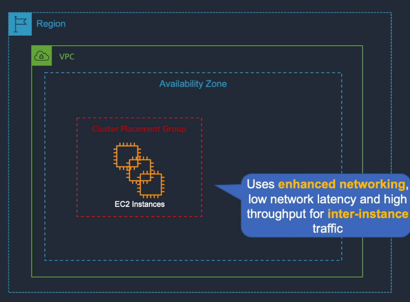
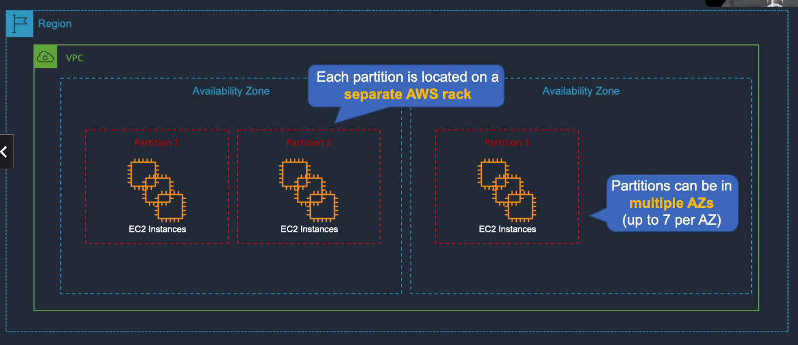
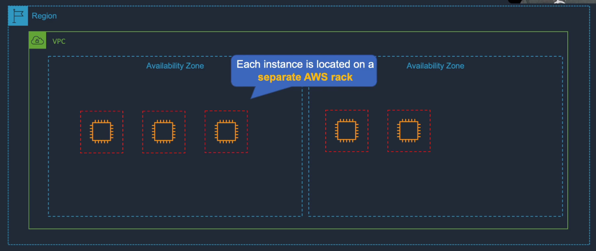
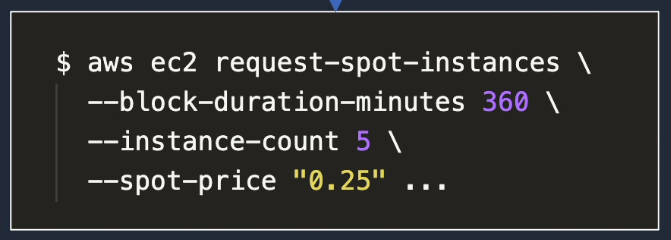
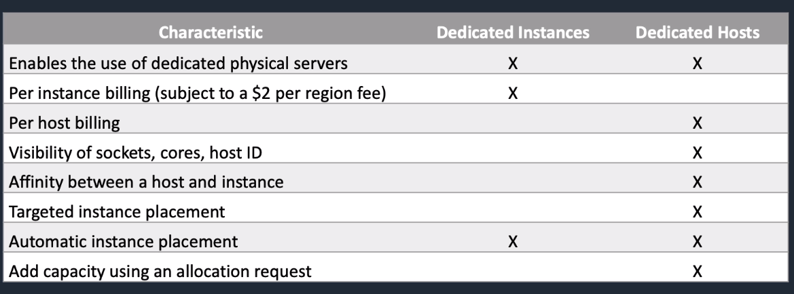
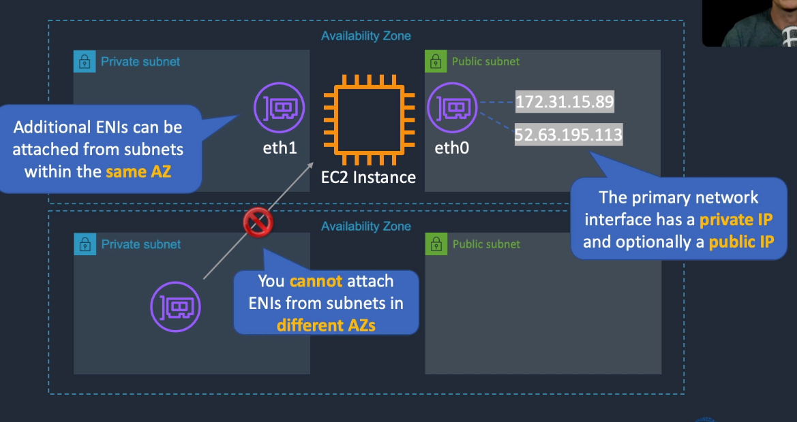
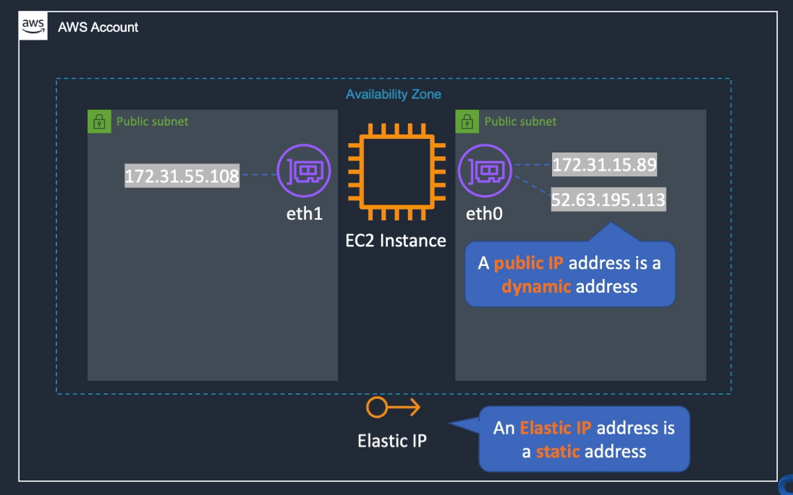
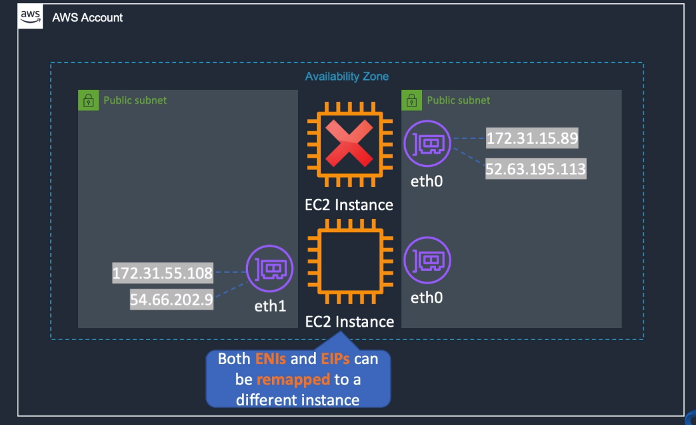
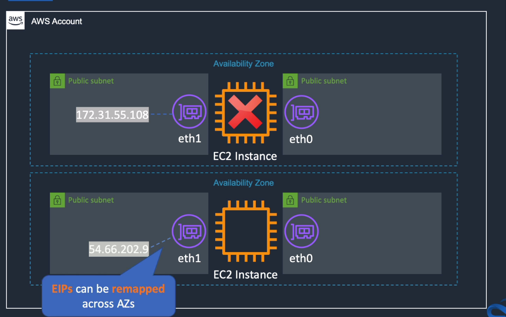
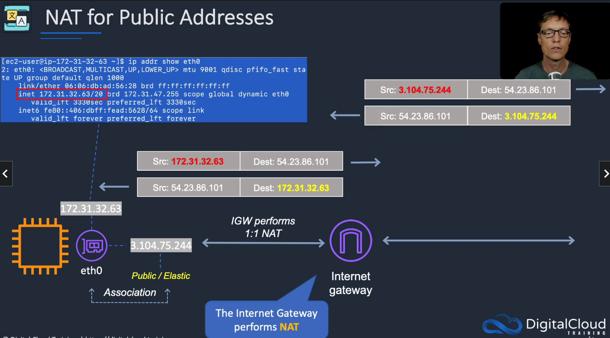

# Amazon EC2

## General Info

EC2 (Elastic Cloud Computing) instance needs authorization to post info on CloudWatch (need an IAM role)

(Scalability) Can increase sizes as required using reserved instances
(Elasticity) Increase number of EC2 instances based on auto scaling

By default, only a private IP address is created when launching an EC2 instance.

Logs in the AWS console for EC2:

- last 3 system events' log errors for windows
- exact console output that would normally be displayed on a physical monitor for Linux

EC2 instance in public subnet has 3 things by default (Public IP address, Internet Gateway, Private IP address) but NO Elastic IP Address (static IP address reserved for our account), we need to create one

When launching an EC2 instance, AWS choses an Availability Zone for us -> best practice is to leave that as-is as it helps AWS balances the load (system health, available capacity and so on)

If we want to move an EC2 instance to another AZ -> stop (not terminate), create AMI (CreateImage API call), run new instance with AMI in other AZ, if Elastic IP... need to reassociate it
=> user cannot change the zone of that instance

We don't see the same AZ for everyone -> for example, two users can be in different data centre when using the same AZ (us-east-1a)

AWS provides root to a limited set of services: EC2, EMR, Beanstalk, Opswork

Shared tenancy to dedicated/host (or vice versa) cannot be changed while instance running (need create AMI then start a new one from the AMI with the correct tenancy)
Dedicated to host (or vice versa) can be changed while instance running

EC2 stop/start -> Elastic IP released, must be assigned manually when starting, instance can be start on a new host
EC2 reboot -> instance will be on the same host, same everything

Description tab -> "State transition reason" will show "User initiated shutdown" if instance is stopped/terminated by the user

There is max number of emails that we can send from an EC2 -> can be lifted by contacting AWS support

SLA of 99.99% for EC2 and EBS within a region, SLA credit received when region has less than 99.95% availability during monthly billing cycle

NVMe storage encrypted (cannot be disabled), cannot be controlled by KMS keys, only a few instances support this storage

It is possible to hibernate an instance to get an instance up and running quickly. Start instance, bring them to desired state and hibernate => hibernation retains memory state across stop/start cycles
RAM persisted to EBS root volume. When stopped -> RAM is cleared.
Hibernation needs to be enabled when we launch the instances (for the API) or we can just do it from the Console => cannot be done afterwards.
The only way to see if an instance is hibernated is by checking the instance details reason field "Client.UserInitiatedHibernate" because it is in "stopped" state.
RAM data is automatically encrypted => root volume must be encrypted EBS volume for it to work. Instance cannot hibernate more than 60 days (can start/stop to reset).
Root volume should have sufficient space to hold the RAM size otherwise hibernation fails.

Can import/export VMWare instances to EC2.

NTP endpoint located at 169.254.169.123 and accessible from any instance running in a VPC

Optimize CPU give greater control of EC2 instances (can specify custom number of vCPU and can disable Intel Hyper-Threading technology).
Can only be used with virtualized EC2 instances

Use case:

* running EC2 workloads that are not compute bound with vCPU-based licensing costs
* running workloads that benefit from disabling hyper-threading on EC2 instances

## Pricing

- on demand 
  - low cost, flexible, no up front payment or long term commitment 
  - short term app, spiky, unpredictacle workloads that cannot be interrupted 
  - app being developed or tested on EC2 
  - pay fixed rate by the hour (or by the second) with not commitment
- reserved 
  - contract 1 or 3 years 
  - app with steady state or predictable usage that requires reserved capacity 
  - users able to make upfront payments to reduce their total computing costs even further 
  - Standard RI: can have up to 75% off on demand 
  - Convertible RI: up to 54% off on demand, capability to change the attributes of reserved instance as long as this result in the creation of reserved instances of equal or greater value 
  - Scheduled RI: available to launch within time windows of reservation -> predictable recurring schedule that only requires a fraction of a day/week/month 
  - With consolidated billing, **any** single instance from any of the accounts can get the benefit of AWS RI pricing (just need same zone and same size)
- spot 
  - app that have flexible start and end times 
  - app that are only feasible at very low compute prices 
  - users with urgent computing needs for large amounts of additional capacity 
  - concept: if spot price (0.5 euro) dips below the bid price (1 euro), instances can be used. spot price affected by offer/demand
  - **workload can be shutdown suddenly**
- dedicated host
  - physical hardware is dedicated to a tenant, not shared 
  - great for licensing which does not support multi tenancy or cloud deployments 
  - can be purchased on demand (hourly), pay per host
  - can be purchased as a reservation for up to 70% off the on demand price
- dedicated instances
  - physical isolation at the host hardware level from instances belongings to other customers
  - pay per instance
  - shared with account, not other customers
- saving plans
  - commitment to a consistent amount of usage (EC2, Fargate, Lambda)
  - pay by $/hour
  - 1 or 3 year commitment
  - compute: any region, family, size, tenancy and OS
  - EC2: within a selected region and instance family, any size, tenancy and OS

EBS backed instance:
- charged for a minute minimum and then by the second
- no charge for instance stopped (only the storage of EBS volume)
- when stop/start -> full minute then second

instances drive the cost either by the hour or by the second (minimum of 60 seconds)

data transfer between AWS services in different regions will be charged as Internet Data transfer on both sides of the transfer
Transfer data between 2 EC2 in two AZ also cost money (out to another region + in from another region)

### Billing
* Billing starts when EC2 initiates the boot sequence and ends when terminates ("running" state). 
* When stopped -> only EBS volume charge
* billed per second, minimum of 1 minute -> for Amazon Linux / Ubuntu instances
* billed per hour, minimum of 1 hour -> for Windows and Red Hat Entreprise Linux and SUSE entreprise
* EBS volumes are billed per second, minimum of 1 minute

### Use cases
Several possibilities
* on-demand
* reserved, scheduled reserved
* spot instances
* dedicated instances, dedicated hosts

Scenarios:
* Developer working on a small project for several hours; cannot be interrupted: **on demand**
* Compute-intensive, cost-sensitive distributed computing, can withstand interruption: **spot**
* Steady state, business critical, line-of-business application, continuous demand: **reserved**
* Reporting app, runs for 6h a day, 4 days per week: **scheduled reserved**
* Database with per-socket licensing: **dedicated hosts**
* Security sensitive application requires dedicated hardware, per instance billing: **dedicated instance**

## EC2 Placement groups

Cluster
* packs instance close together inside an AZ
* spread instances on same hardware
* spreads instance across logical partitions)
* need enhanced networking support (not all EC2 instance types have that)
* low latency network performance necessary for tightly coupled node-to-node communication
* typical for High Performance Computing (HPC) applications
* free



Partition
* spread instances across logical partitions such that groups of instances in one partition do not share the underlying hardware with groups of instances in different partitions
* typically used by large distributed and replicated workloads (Hadoop, Cassandra, Kafka)



Spread
* strictly places a small group of instances across distinct underlying hardware to reduce correlated failures



### Use cases
* Tightly coupled application that requires low-latency, high throughput network traffic between instances: **cluster**
* Distributed and replicated NoSQL DB; requires separate hardware for node groups: **partition**
* Small number of critical instances that should be kept separate from each other: **spread**

## API
* RunInstances API is used to create a new instance from AMI
* DescribeInstances API to get info on the running instances
* TerminateInstances API to kill running instances
* StopInstances API if EBS backed / StartInstances API to start a stopped instances

## IAM Role

Applications must sign their API requests with AWS credentials but we don't want to store them in EC2. Roles are temporary credentials not stored in our EC2 that can be used to use the API.

Create an IAM role:

1. IAM console
2. create IAM role
3. define which accounts or AWS services can assume the role
4. Specify role when we launch instances or attach the role to a running/stopped instance -> cannot assign a role to a terminated instance
5. Have the application retrieve a set of temporary credentials and use them

We can assign role to an auto scaling group and when a new instance is started, the IAM role is associated to that instance.

Using IAM role facts:

* secured temporary credentials in EC2 instead of the access keys, rotated often

* roles have policies in JSON format that tell what they can do on what resource

* instance can assume only one role, role can be attached to multiple instances

* if role changed in ASG, it is propagated to all instances

* **when we create an IAM role using the IAM console, the console creates an instance profile automatically and gives it the same name as the role to which it corresponds. This is not the case for the CLI, API, SDK -> need to create both.**

* instance metadata -> iam/security-credentials/role-name to know the role

* to enable an IAM user to launch an instance with an IAM role or to attach or replace an IAM role for an existing instance -> must grant the user permission to pass the role to the instance

  ```json
  {
      "Effect": "Allow",
      "Action": "iam:PassRole",
      "Resource": "*"
  }
  ```

Sensitive data can then be stored in S3 with a very limited access, we can create a role to access it.

## SSH problems

private key must have 400 rights -> "Unprotected private key"
if wrong user name for OS login -> "Host key not found error"

## Reserved instances / reserved capacity

no RI for spot instances or instances running on dedicated hosts

There is a marketplace to sell unwanted RI to other customers. RI can still be used while it is on the market place. Need a US account.
AWS charges a 12% service fee of the total upfront price of each RI sold in the RI marketplace

### Types
Reserved Instance
* discount for 1 year / 3 years commitment
* cannot change config (instance type, ...)
* Guarantee that we can launch this instance when we need it
* Zonal RI: reserved in a particular AZ
* Regional RI: reserved in a particular region

Convertible RI
* reserved instances with attributes that can be changed during the term. 
* Great for users who can commit (time, 1 year or 3 years) but not the instance size 
* Can select a new instance type, OS, tenancy or payment option when we change. 
* Cannot transfer RI to another region. 
* Free to change config. 
* Need to convert to the same value or higher.

on-demand capacity reservation
* create and manage reserved capacity on EC2. 
* Choose AZ and number of instances with their specifications 
* no commitment, we pay for as long as it is active. 
* We pay for the reserved capacity whether instances are running or not. 
* Can be changed at any time while it is active, cannot be changed when ended/deleted.

Scheduled RI
* being deprecated in favor of On-Demand Capacity reservation and Savings Plans
* match capacity reservation to a recurring schedule
* minimum 1200 hours per year
* example: reporting app that runs 6h a day, 4 days a week = 1248 hours per year

### Discount
When the attributes of a used instance match the attributes of an RI, the discount is applied
* operating system
* instance type
* availability zone => we can reserve capacity in a specified AZ
* region
* tenancy
  * default => shared
  * dedicated => dedicated hardware

### Payment options
* All upfront
* partial upfront + monthly
* no upfront so monthly payment, less discount

### Update reserved instances
Standard Reserved Instance
* can change AZ
* can change instance size (Linux)
* networking type

=> use Modify ReservedInstances API

Convertible Reserved Instances
* change AZ
* can change instance size (Linux)
* networking type
* change family
* change OS
* change tenancy
* change payment option

=> use ExchangeReservedInstances API

## Spot instances
* money saving instances
* can be interrupted at any time with a 2 minute notification (when price is higher than what we want to pay max) => instance metadata and cloudwatch events
* Best suited for fault-tolerant and flexible workloads. 
* Supported by EMR, ECS, Datapipeline, CloudFormation and batch. 
* Can request spot instances up to spot limit for each region 
* pay the spot price that's in effect at the beginning of each instance hour for the running instance. If price changed, the new price will only be valid for the subsequent hour
* Spot instances can be hibernated, same rules apply. Cannot restart a stopped/hibernated instance directly, this is handled by EC2.
* Not charged if interrupted by AWS in the first hour, if we terminate ourselves we pay at the nearest seconds. If AWS stops in the subsequent hour, we pay at the nearest second.
* **Spot capacity pool**: set of unused EC2 with the same instance type, OS, AZ and network platform (EC2-Classic or EC2-VPC).
=> recommended to use multiple spot capacity pools to have enough instances for the workload

### Spot Block
* designed to not be interrupted and will run continuously for the duration we select, independent of Spot market price
* for 1 to 6 hours
* pricing is 30% - 45% less than on demand



### Spot Fleet
Spot fleet: Launch and maintain the number of spot/on-demand instances to meet specified target capacity

EC2 fleet: launch and maintain specified number of spot / on demand / reserved instances in a single API call
* can define separate OD/Spot capacity targets, bids, instance types, and AZs

* one API call can provision compute capacity across different instance types, AZ, on-demand, reserved instances and spot instances 
* used to optimize scale, performance and cost 
* EC2 Spot fleet and EC2 fleet provides the same functionality, no need to migrate 
* Free service, only pay for the resources 
* Use case: big data workloads, containerized app, grid processing workloads, ... 
* EC2 Fleet does **not** support multi-region 
* Instances can be tagged 
* There is a maintain mode used to modify the total target capacity, AMI used, ... when started 
* Supported by ASG

## Amazon Machine Image (AMI)
AWS provides a selection of default AMIs (Amazon Linux, Red Hat, Suse, Ubuntu, Windows Server)

* template for launching EC2 instances => quickest way to launch a preconfigured instance (with the app we want and so on)
* provides all the info needed to launch an EC2 instance
* Images launched for the first time may take slightly longer to boot
* Once we create a custom AMI, we need to bundle it (EBS backed -> AWS console bundle action, instance store backed -> AMI tools to upload it to S3)
* **Instance store is also called S3 backed instance.**
* **AMI are registered on a per-region basis, they must be copied and registered to be used in another region**
* Can share an encrypted snapshot with specific AWS accounts (not make public) -> need to share custom CMK key used to encrypt it
* Copying an image does not copy the permissions 
* Copying an image will create a new image completely independent of the source AMI => no link
* We can use the user-data to update the AMI at creation time => slows down boot if we do a lot, prefer Customized AMI for application

Include 3 main things:
* template for the root volume (OS, applications)
* launch permissions: which AWS account can use the AMI to launch instances. Can be public, private or shared with other accounts
* block device mapping to specify EBS volumes to attach to the instance at launch time

### Customized AMI
We can create our own AMIs
1. launch an instance from an existing AMI
2. connect and customize it
3. create custom AMI image from our instance
4. register the AMI before it can be used to launch an instance (automatically done with the console, not with the SDK/CLI)

Create an AMI from instance store -> start instance, change it, bundle it, register a new AMI

can be shared or copied between user accounts except 
* encrypted AMI cannot be shared -> need to copy the underlying snapshot, reencrypt it using our own key and create new AMI from the snapshot
* AMI with associated billingProducts code (Windows AMIs and AMIs from AWS Marketplace, include a small license fee)
  => need to launch an EC2 instance using the shared AMI and create an AMI from the instance

Advantages: much faster to start since everything is already installed

We can also use the user-data to finalize the setup

### Sharing AMI
After creating one
* can either keep it private (**default**)
* share it with a specified list of AWS accounts
* make it public
* sell it to other AWS users

**Sharing account still has control and ownership of the AMI and is still charged for storage of the AMI within their AWS account, stored in S3**

owner of the source AMI must grant us read permissions for the storage that backs the AMI (EBS snapshot or S3)

**if we copy an AMI that was shared with us, we are the owner of the copy and will be charged (monthly) for storage of the target AMI in the destination region**

**cannot directly copy an encrypted AMI shared by another account. We need to copy the snapshot and reencrypt using our own key. The sharing account must also share with us the underlying snapshot and encryption key used to create the AMI. We then own the copied snapshot and can register it as a new AMI**

**we can,ot directly copy an AMI with an associated billingProducts code (Windows, RedHat, AMIs from AWS marketplace), anything with a subscription/licensing fee BUT we can still launch an instance using the shared AMI and create an AMI from the  instance**

A billingProducts code is used to bill for the use of an AMI (small fee included to cover the Windows Server or SQL Server Licence)

### Automation and configuration management tools
* AWS CloudFormation
* AWS OpsWorks
* AWS Systems Manager
* AWS CodePipeline, CodeDeploy, ...
* Chef and Puppet
* Jenkins

## EC2 Dedicated instances vs Dedicated hosts
* Both have dedicated hardware and both can be used to launch EC2 instances. 
* Can be selected when launching an EC2 instance (in the tenancy part: shared, dedicated instance, dedicated host)

Dedicated instances
* EC2 instances that run in a VPC on hardware dedicated to a single customer. 
* Dedicated instances are physically isolated at the host hardware level from instances that belong to other AWS accounts. 
* **Dedicated instances may share hardware with other instances from the same AWS account that are not dedicated instances**
* Can be paid on demand but save up to 70% by purchasing reserved instance, save up to 90% by purchasing spot instances. 
* **Charged by the instance**

Dedicated hosts
* **gives additional visibility** and control over how instances are placed on a physical server. 
* We can consistently deploy our instances to the **same physical server over time**. 
* As a result, dedicated hosts enable us to use our existing server bound software licenses (Oracle, ...) and address corporate compliance and regulatory requirements. 
* => we rent a specific server for our use like in a datacenter (access to cores, sockets, host id, ...). 
* **Charged by the host**
* **if specific regulatory we need dedicated host.**



## Create EC2 instance

Required information

- number of instances: a number but can be launch in auto scaling group
- Network: default VPC (virtual private cloud) or we can create a new one
- Subnet: default subnet in any Availability zone or create a new one
- auto assign public IP: can be defined by the subnet, enabled or disabled
- placement group: logically group instances to benefit from greater redundancy or higher networking throughput (they will be in the same availability zones). Can have high memory cluster, gpu cluster, ... Can be combined to create bigger clusters (safer to start smaller cluster as well for capacity)
- IAM role: required if the EC2 instance needs to do action on other AWS resources (like cloudwatch). **roles can be attached/replaced when the instance is running, doing that is almost instant**
- Shutdown behavior: Stop or Terminate (cannot be restarted)
- Enable termination protection: cannot terminate and destroy by error.  If we terminate an EBS backed instance, it is deleted and we can lose data. If we stop it, we can restart it but we lose the content in the RAM. We can also hibernate it (we don't lose the RAM). 
- Monitoring: enable cloudwatch detailed monitoring
- Tenancy: run on shared instance or not
- T2 unlimited: apps can burst more compared to the baseline but extra cost
- Advanced details: can specifiy a bootstrap scripts that is executed (root) when the instance is up and running 
- Storage: General storage, IOPS, ...
- Tags: important concept, can be used to track for billing, name the instance, ...
- Configure security group: firewall rules for the instance (**the security group can be changed at runtime and this will affect all EC2 instances that are using the security group**)

For SSH, it is needed to have a SSH key pair (create it or use existing one). Key must have rights 400 (normal SSH behavior)

### EC2 Launch issues

- InstanceLimitExceeded error: reached limit on the number of instances we can launch in a region (20 by default, can be extended by asking AWS per region basis)
- InsufficientInstanceCapacity error: AWS does not have enough available on-demand capacity for the request (wait and try, request fewer instances, select different instance type, use reserved instance, new request without specifying AZ)

### Bastion Host

Bastion host (or jump box)

- host located in public subnet (internet access through internet gateway)
- connect EC2 instance using SSH or RDP
- first login to bastion host, then to EC2 instance using SSH/RDP over the private subnet
- the goal is to safely administer EC2 instances without exposing them to the internet
- need to be as safe as possible (limited IP range access, ports, ...)

connected to a public subnet, can connect it over the internet
used to securely connect to instances in a private subnet
allows to safely administer EC2 instances without exposing them to the internet
for incoming SSH/RDP only
does not enable outgoing requests (e.g. internet access for our instances)
For high availability, create 2 bastion in different subnets. Create a DNS entry in Route 53 which uses round robin DNS and point to each instances. Connect using the DNS entry.

The security group should have an inbound rule TCP 22 with the source IP that we want to allow

## Virtualization

**Para-Virtualization**

* used to be the primary form of virtualization on the AWS platform
* requires instance OS and driver modifications, the host OS presents an API which the guest OS needs to support => designed to improve performance
* originally offered better performance than HVM

**Hardware Virtualization (HVM)**

* abstracts the VM away from any communication with the host => the VM really thinks that it is talking to the real hardware
* originally very slow, due to the instructions being intercepted by the hypervisor and being translated in software before being executed
* modern CPU's have added specific virtual instructions to improve the performance hit. Generally, this is limited to memory translation operations with newer CPU's looking to add network I/O acceleration
* Network I/O remained slow - improved via guest drivers and recently CPU support

**Nitro Hypervisor**

* new hypervisor for C5 instances, use kernel-based VM (KVM)
* increased compute and memory resources 
* AWS will invest in Nitro and Xen hypervisors in the future
* need EBS backed HVM AMI with support for ENA and booting NVMe storage

The kind of virtualization heavily impacts the size, type and features available. **AMIs support Para-Virtual or HVM**. Generally, the older AMIs are the one that support para virtualization. Using HVM will limit which AMI's we can use, historically there were more para virtual than HVM but this is changing. Using HVM will allow a much wider selection of instances types and sizes. **Some instances families are only supported using HVM like T2...** Some older instance types only support para virtualization such as **T1**.

**=> old version are still used today because they usually have really attractive spot pricing**

=> certain features like enhanced networking require HVM; **enhanced networking has no extra cost and provide a performance boost when used correctly**

## EC2 instance types

**D2** (density) => dense storage for fileservers/data warehousing/hadoop, high sequential read and write access to very large datasets

**R4/R5** (RAM) => memory optimized for memory intensive apps/DBs

**M4/M5** (main choice for general purpose apps) => general purpose for application servers, only with EBS, up to 25GBps of network bandwidth between instances within a Placement Group

**A1** => xxx for scale out web servers, containers microservices, dev environments, ...

**C4/C5** (compute) => compute optimized for CPU intensive apps/DBs, EBS by default, can utilize up to 25Gbps of network bandwidth

**G3** (graphics)=> graphics intensive for video encoding/3D application streaming

**I3** (IOPS) => high speed storage for NoSQL DBs, Data Warehousing -> random I/O

**F1** (FPGA) => Field Programmable Gate Array for hardware acceleration for our code

**T2/T3** (cheap general purpose) => lowest cost, general purpose for web servers/small DBs, burstable performance

**P2/P3** (Graphics, think pics) => graphics/general purpose GPU for machine learning, deep learning

**X1** (extreme memory) => memory optimized for SAP HANA/Apache Spark (TB of RAM)

We can remember the kind of available instances with **DR MAC GIFT PX**

There are also

* z1d => high compute and high memory
* H1 => storage optimized (high sequential read/write access)

**By usage**:

General purpose: A, T, M			=> money from **ATM** saved with cheap general purpose

Compute: C						=> **C** language for compute speed

Memory Optimized: R, X, Z		=> e**X**treme **R**am**Z**

Accelerated Computing: P, G, F		=> **F**emale **P**ro**G**amer (GPU, ...)

Storage Optimized: H, I, D			=> **HI**gh **D**ensity storage

AWS does not delete old instance types, it is just preferable to use the recent versions (more cost effective, powerful, ...)

## EC2 CloudWatch metrics

**EC2 metrics**

* **CPUUtilization**: % of allocated EC2 compute units currently in use
* **CPUCreditUsage, CPUCreditBalance, CPUSurplusCredit***: check the CPU credits for T2/T3. If we don't have credits -> performance is the baseline (max). Stopped instance does not retain its previously earned credit balance
* **DiskReadOps**: completed read operations from all instances store volumes available to an instance
* **DiskWriteOps**: completed write operations from all instance store volumes available to an instance
* **DiskReadBytes**: bytes read from all instances store volumes available to the instance **(can be used to determine the speed of an application)**
* **DiskWriteBytes**: bytes written from all instance store volumes available to the instances **(can be used to determine the speed of an application)**
* **NetworkIn**: number of bytes received on all network interfaces of an instance **(can be used to determine an increase in network traffic)**
* **NetworkOut**: number of bytes sent on all network interfaces of an instance **(can be used to determine an increase in network traffic)**
* **NetworkPacketsIn** & **NetworkPacketsOut**: monitors the number of packets sent and received on all network interfaces of an instance
* **StatusCheckFailed_Instance**: keeps track of whether the instance passed the status check within the last minute
* **StatusCheckFailed_System**: keeps track of whether an instance passed the system status check within the last minute
* **StatusCheckFailed**: combines both of the status checks and reports whether they passed (0 passed, 1 failed)

**Scaling Policies**: changes the capacity of the ASG using a scaling adjustment that we specify in the policy itself

* **ChangeInCapacity**: increase/decrease the current capacity of the ASG by a specified number of instances
* **ExactCapacity**: specify the exact number of instances we want instead of just adding/subtracting from the current number
* **PercentChangeInCapacity**: use percentage value instead of a specific number

**Scaling Policy Type**: affects how our auto scaling group scales out and in

* **Simple Scaling**
  * increase or decrease the current capacity of the group from a single scaling adjustment. 
  * **After scaling activities start, the policy has to wait for the activity or health check to complete and the cooldown period to expire before acting on an alarm again.** Cooldown period a crucial in ASG to prevent creating/terminating too many instances too fast.
* **Step Scaling**
  * increase or decrease the capacity from a set of scaling adjustments instead of just one. **It continues to act on any alarm even if the activity is still in progress.** 
  * For the configuration, we can configure lower bound and upper bound for the step (40 <= CPUUti <= 60). We can add multiple steps (for example, based on CPU utilization: 40-60 step1, 60-80 step2, >=80 step3). For each steps, we can select the number of instances we want to add. 
  * **There is no wait time, if a condition is met, the scaling is started.** 
  * We can specify an **instance warmup time** with our step adjustment => make the ASG add newly launch instance to the size of the group but without including the instance in the groups cloudwatch metrics -> even with multiple alarm breaches, the ASG does not add more instances than it needs. For example, if we start 1 instance for a specific alarm and we are supposed to start 2 instances for the next alarm, we will only launch 2 instances and not 3.

**=> metrics will be used to create alarm in our scaling policy that will be used by our auto scaling groups.**

Let's imagine that our ASG creates too many instances for the load, how can we fix this ? 

* publish custom metrics with the elapsed time since an instance launched to the time the instance response to an ELB health check
* then adjust the pause time and cooldown properties of our ASG to be greater than the value of our custom metric 
* we can perform this adjustment periodically

## Instance storage

temporary block-level storage for many EC2 instance types. Cannot be stopped and started -> only terminated.
Unlike EBS volumes, instance store volumes cannot be detached or attached to another instance.

The number and storage capacity of EC2 local instance store volumes are fixed and defined by the instance type.

There is no simple way for an application running on an EC2 instance to determine which block device is an instance store (ephemeral) volume and which is an EBS (persistent) volume.
Sometimes, it is needed to format the instance storage and mount it before use.

Good for temporary storage that is continually changing like buffers, caches, scratch data, ...

Same physical server that hosts the EC2 instances => good for sequential access

Can boost performance with RAID0 of instance storage.

t1, t2, c4 are EBS only, the rest can use ephemeral storage.

Two EC2 instance families are purposely built for storage-centric workloads:

* storage optimized (i2): good for NoSQL DB, 365k read random IOPS, 315k write random IOPS, 6.4 TB SSD max => very high random IOPS
* dense storage (d2): good for massively parallel processing like MapReduce, 3.5GiB/s read, 3.1Gib/s write, 48TiB HDD => high disk throughput

## Limits

max 20 on-demand instances of the same instance family. Some instance types are further limited per region => range from 1 to 20 depending on the region

Reserved instances is limited to 20 for all instance family

## Network

### Interfaces
Elastic Network Interface (ENI)
* can have multiple ENI but must be in the same AZ (one subnet = 1 AZ, so we need to choose the same subnet)
* primary ENI has a private address and optionally a public one
* basic adapter when we don't have any high performance requirements
* can be attached when an instance is running, can be detached and reattached to another instance (must be in the same AZ)
* can use with all instance types



Elastic Fabric Adapter (EFA)
* High Performance Computing (HPC), ML, Message parsing interface (MPI)
* tightly coupled applications
* only supported by very large instances
* higher bandwidth and lower inter-instance latency
* Specific extra adapter on the EC2, can only be attached at launch or stopped instances

Enhanced Network Interfaces (ENA)
* VPC networking, EFA bypass the instance kernel 
* Enhanced networking
  * more performance
  * lower inter-instance latencies, ... optional and disabled by default. Need the "ena" drivers. 
  * Only supported in VPC. 
  * Free service. 
  * ENA supports up to 25GBps.

### IP address 


Elastic IP (EIP)
* limited to 5 addresses per region (soft limit)
* static public IP address
* Charged when EIP is not attached to a running EC2. 
* Takes a few minutes for remapping to another instance
* can be associated to an ENI so when we attach it to an EC2, we can use the address to target it
* can be moved between instances and elastic network adapters



Note that if an instance fails in an AZ and we want to attach the EIP to another instance in another AZ.
We move the EIP to another ENI in this subnet.



Private IP address
* remains associated with the network interface when the instance is stopped and restarted
* released when instance is terminated
* used in public and private subnets

Public IP address
* associated exclusively with the instance until it is stopped, terminated, replaced with an EIP
  * if an ENI with an Elastic IP is attached to the instance, we don't get a new public IP address if we stop/start an instance
* instance keeps the public IP address after reboot
* adequate when we do not need a long-lived internet routable end point
* dynamic because if we stop the instance and start it again, we get another one
* used in public subnet
* free
* cannot be moved between instances

### NAT for public addresses
On our local computer, if we do ip addr show eth0, we see the public IP address. 

**On AWS, we only see the private IP address** => the instance doesn't know anything about its public IP address

The instance doesn't know that it is an association outside the instance performed by the internet gateway.
The Internet Gateway replaces the private address of the instance by the public IP during transit and back.



## Architecture patterns - compute
* high availability and elastic scalability for web servers: EC2 auto scaling, application load balancer across multiple AZ
* low latency connections over UDP to a pool of instances running a gaming application: NLB with UDP listener
* clients need to whitelist static IP addresses for a highly available load balanced application in an AWS region: NLB + Elastic IP in each AZ since whitelist IP
* application on EC2 in an ASG requires disaster recovery across regions: ASG in other region with 0-0-0. Take snapshots and copy them across regions (Lambda/DLM)
* application on EC2 must scale in larger increments if a big increase in traffic occurs, compared to small increase in traffic: ASG with step scaling policy
* need to scale EC2 instances behind an ALB based on the number of requests completed on each instance: use cloudwatch metrics, target tracking policy ALBRequestCountPerTarget
* need to run a large batch computing job at the lowest cost. Must be managed, nodes can pick up where others left off in case of interruptions: EC2 spot instances and AWS batch
* tightly coupled high performance computing (HPC) workload requires low-latency between nodes and optimum network performance: cluster placement group, single AZ, elastic fabric adapter (EFA)
* Line of Business application (long term running) receives weekly burst of traffic and must scale for short periods - need the most cost-effective solution: reserved instances for minimum required workload and then use spot instances for the bursts in traffic
* application must startup quickly when launched by ASG but requires app dependencies and code to be installed: customized AMI + bootstrap user-data if needed
* application runs on EC2 behind ALB. Once authenticated users should not need to reauthanticate if an instance fails: session state in DynamoDB or elasticache
* 

## Resources

Documentation: https://docs.aws.amazon.com/AWSEC2/latest/UserGuide/concepts.html

API: https://docs.aws.amazon.com/AWSEC2/latest/APIReference/Welcome.html

CLI: https://docs.aws.amazon.com/cli/latest/reference/ec2/index.html


