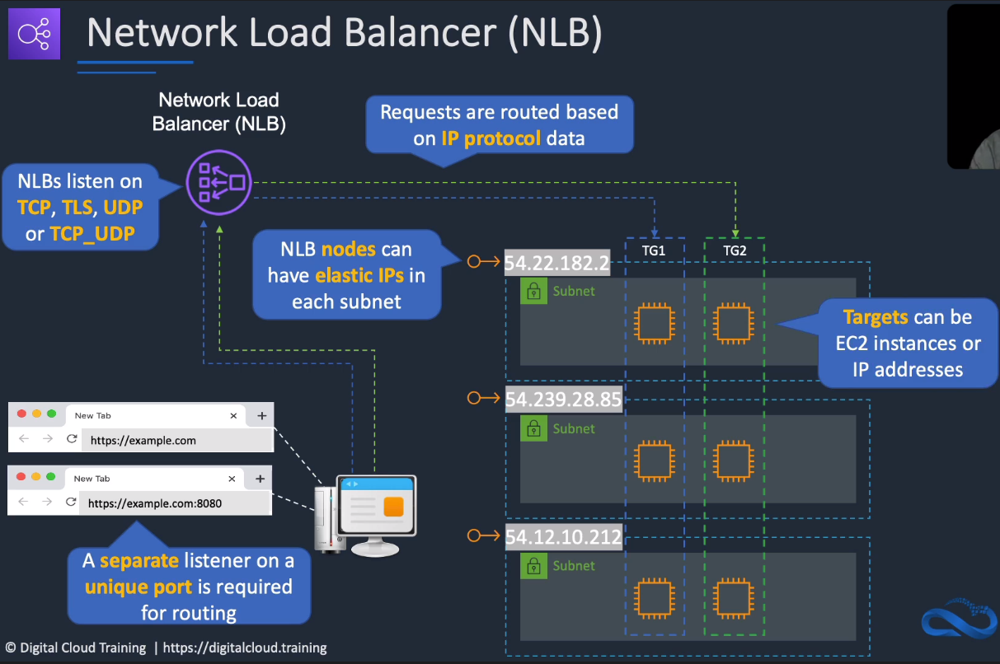

# AWS Elastic Load Balancing

## General Info

4 ways to monitor load balancers:

- CloudWatch metrics: performance
- Access logs: who accesses what (ELB logs, access logs). Can store data where the EC2 instance has been deleted (auto scaling group for instance) in case we didn't save the application logs. Stored in S3. 
- Request tracing: application load balancer only, trace everything from ALB to resources (S3, ...)
- CloudTrail logs: who provisioned LB for instance

Enable Sticky Session to ensure a user request always go to the same server (cookie in the request).

An ELB can be deleted even if instances are registered with it, they will still keep running.

If an EC2 instances makes many automatic actions when starting, it can happen that the EC2 instance is marked as unhealthy behind an ELB and an auto scaling group. To solve this, we should change the healthchecks to be done after the first requests have been done successfully.

in a VPC, it is possible to have only the Load Balancer in the public subnet and all the other instances in the private subnets

In Auto scaling scenarios, it is possible that an instance suffers from high usage even if others are available:

- check stick session enabled
- check web app uses long polling such as "comet" or "web sockets" that keep the connections open

Connection draining can be disabled from EC2 -> ELB console or from CLI => do not kill connection before timeout when an instance is shutting down, default is 300 seconds (can be set between 1 and 3600 seconds)

Possible to pre warm ELB -> need to ask AWS:

- traffic expected (requests / sec)
- start + end dates of the expected traffic increase
- Best of both worlds*: place ALB behind a NLB to get the benefit of bothtotal size of a typic request/response

Availability Zones on an ELB can be added/removed on the fly from AWS console 

Logs will contain: request processing time, response processing time, backend processing time

Monitoring ELB activity: ELB API calls with CloudTrail (logs S3), ELB access logs, CloudWatch metrics
ELB health check is performed internally and does not help with the ELB activity

Access logging is optional (disabled by default): when enabled ELB logs are stored in S3 -> bucket[/prefix]/AWSLogs/aws-account-id/elasticloadbalancing/region/yyyy/mm/dd/aws-account-id_elasticloadbalancing_region_load-balancer-name_end-time_ip-address_random-string.log

SSL listener at ELB and back-end instances -> ELB will not modify the headers, will just forward the requests

ELB can be accessed privately from VPC using VPC endpoints (it uses AWS PrivateLink).

It is possible to configure an EC2 instance to only accept traffic from ALB, it is also possible to configure security group for the front-end of an ALB.

Cannot convert one Classic to an ALB or vice versa but it is possible to migrate.

ALB can support HTTP and HTTPS requests together with 2 listeners, one for 80, one for 443.

To handle SSL termination at ALB, either use AWS Certificate Manager to create one or create one from other sources and load it to AWS Certificate Manager or IAM service. With multiple certificates, Server Name Indication (SNI) is automatically enabled.

Can integrate ALB with AWS WAF for protection.

Load balancer can route to any arbitrary IP in a VPC  (10.0.0.0/8, 172.16.0.0/12, 192.168.0.0/16). This means any target in Peered VPC, EC2 class and on-premises locations reachable over AWS Direct Connect or VPN.

to handle HTTPS on a load balancer, we need to have at least one SSL certificate attached to it

if instances fail health checks but are not being replaced

* use ELB health check for ASG (likely cause)
* security group problems as well (need to have security group associated to EC2 to allow traffic from ELB but also security group of ELB in a VPC to allow traffic to EC2 instances)
* timeout too short -> adjust response timeout settings in ELB health check config

ELB waits until instances pass a minimum number of ELB health checks before sending traffic

when we have multiple environments with too many load balancers, we can merge some of them to decrease the number and attach multiple SSL certificates and SNI at each load balancer (w.r.t the website traffic)
=> reduce costs

ALB supports round_robin and least_outstanding_requests
* round_robin when instances have the same processing capability -> route requests evenly
* least_outstanding_requests when requests vary in complexity + targets vary in processing capability

## Session State and Session Stickiness
Best solution. We can store session data (authentication details) in DynamoDB table or ElastiCache. 
This prevents user from authenticating again if there is a problem in the backend and an instance is terminated

Another solution is to use sticky session. A cookie is generateed and client bound to instance for cookie lifetime.
The session data is stored locally. If the instance fails, the load balancer generates another cookie and is directed to 
another instance. Note that if an instance fails, the session state is lost so it is better to have the session saved in 
DynamoDB or Elasticache.

## Type of ELB

### Application load balancer

* the main one, 
* HTTP and HTTPS, operates at request level, can do routing based on the request (more intelligent routing) - content base routing. 
* We can send specific requests to specific web servers (based on the URL for example). We create rules with a condition (a URL endpoint) and a corresponding action like forward.
* handles TLS termination
* supports path based routing, host based routing, query string parameter based routing, and source ip address based routing
* supports instances, ip addresses, lambda functions and containers as targets
* HTTP/2 is supported and enabled natively. Clients that support HTTP/2 can connect to an ALB over TLS. Application load
* supports WebSockets and Secure WebSockets
* Request tracing enabled by default
* elbv2 for the CLI
* supports IPv6
* target groups is a group of IP that can be used for LB but can also be a lambda. This means that Lambda function can be invoked based on content based routing rules
* supports authentication with OpenID connect, preferable to use Cognito though
* cannot redirect from HTTPS to HTTP, only HTTP-HTTP, HTTP-HTTPS, HTTPS-HTTPS
* supports text/plain, text/css, text/html, application/javascript, application/json
* Load balancing can be done on TCP ports 1-65535

#### Request routing with ALB
* path based routing: look at the end of the URL (the endpoints) and redirects based on that
* host based routing: look at the front of the URL (members -> host field) and redirects based on that
* targets can be EC2 instances, Lambda, Containers, ...

### Network load balancer 

* NLB does **NOT** have security groups configured; the pass connections straight to EC2 instances with the source IP of the client preserved (when registered by instance-id)
  * EC2 instances security groups **MUST** allow the IP of the clients
* operates at the connection level
* routes connections based on IP protocol data (layer 4)
* ultra high performance, low latency and TLS offloading at scale
* can have a static IP / elastic IP
* supports UDP and static IP addresses as targets
* Route53 can be configured to resolve directly the EIP rather than the DNS name of the NLB as there is only IP address to return
  * to filter traffic, the network ACL for the subnet can be configured to block all non-UDP traffic
* for very high network throughput prod environment
* capable of handling millions of requests per second while maintaining ultra low latencies
* the most expensive one => use for extreme performance
* auto provide a static IP per availability zone to the load balancer, can be assigned an Elastic IP
* supports only TCP and TLS listeners
* supports TLS termination
* supports long running connections useful for WebSocket type applications, need to configure TCP listeners that route the traffic to the target that implement WebSockets protocol
* preserve source IP of the clients, even with TLS termination
* can be created in a single AZ by providing a single subnet when we create the NLB
* support DNS regional and zonal fail-over (with Route 53 health check)
* supports 200 targets per AZ
* only one that supports white list IP address
  * this is done using security groups, outbound rules, we add this IP and protocol/port
  * for this to work, we need to remove outbound 0.0.0.0/0
  * we use an Elastic IP for this since this is the only way to guarantee the IP
* the NLB created is just the logical LB, the real NLB are the ones created at the subnet level that redirects requests to the target groups
  * if we curl the public NLB DNS, we get the IP address of the node we reached once our request has been forwarded

#### Request routing with NLB
* Create listener based on ports since they can't handle path or host based routing like ALB (:80, :8080)
* targets can be EC2 instances or IP addresses, targets can be outside a VPC (on-prem)

### Classic load balancer

* support sticky sessions (session per instance)
* currently being phased out (legacy)
* routing at layer 4 and layer 7
* does not support request tracing
* should only be used if application is built within the EC2 classic network.
* elb for the CLI
* does not preserve the source IP of the clients
* supports HTTP, HTTPS (secure HTTP), SSL (secure TCP), TCP
* perform load balancing on TCP ports
  * EC2-VPC: 1-65535
  * EC2 classic: 25, 80, 443, 465, 587, 1024-65535
* support IPv6 (only way to support IPv6 in VPC is through Load Balancer)
* EC2 can be configured to only access traffic from Classic LB
* can use both HTTP 80 and HTTPS 443 on the same CLB
* can handle SSL termination (ACM)

**=> Best of both worlds: place ALB behind a NLB to get the benefit of both**

### Gateway Load balancer
* used in front of virtual appliances such as firewalls, IDS/IPS (intrusion detection), and deep packet inspection systems
* operates at layer 3 - listens for all packets on all ports
* forward traffic to the target groups specified in the listener rules
* exchanges traffic with appliances using the GENEVE protocol on port 6081

## Access control and SSL/TLS
We can control the access multiple ways:
* NACL (stateless so we need to control inbound and outbound)
* Security groups of the ALB and the EC2
* No security group for NLB

### IP address seen by the app
* in case of AWS ALB: the private address of the CLB/ALB
* in case of AWS NLB: 
  * instance ID in the NLB: the client IP
  * if we specify instance by IP address:
    * if TCP/TLS the NLB IP
    * if UDP/TCP_UDP, the client IP
* when using an NLB with a VPC endpoint or AWS Global Accelerator, source IPs are private IPs of NLB nodes
* X-forwarded-for can be used with ALB to capture client IP

### SSL/TLS termination
For ALB
* traffic is encrypted until SSL/TLS termination (certificate is an ACM certificate or IAM)
* we could also have a self signed certificate on the EC2 instance

In both cases, we have a new connection created after each load balancer.

For NLB
* can either just forward the traffic without SSL termination at the NLB => one single encrypted tunnel
* can have similar setup than ALB where a new connection is created after the NLB

## Create load balancer

### Classic Load Balancer

Go to EC2 -> Load Balancers. In the setup, we need to attach an EC2 instance so this needs to be created first.
Health check must point to a valid page (GET 200).

### Application load balancer

need a least 2 public subnets in order to deploy an application load balancer
Go to EC2 -> Load Balancers, create a new ALB.

- listeners: process that checks for connection requests using protocol and port configured (HTTP, 80)
- availability zones: AZ to be handled by the LB (the more the better)
- target group: LB routes requests to the targets of the target group using the protocol and port configured, perform health checks on the targets. **each target group can be associated with only one load balancer** => only for ALB.

We must then select the health checks (/index.html for instance) and the EC2 instances that the ALB will connect to.

Once the ALB is started, we get access to a DNS name for it that we can use to get access to our EC2 instance index.html page. **takes a little bit of time to be available**

## Pre-Warm ELB

Contact AWS to ask them to pre-warm our ELB -> configure ELB to the appropriate level of capacity based on the traffic that we expect

AWS needs to know:

- start and end dates of the expected spikes
- expected request rate per second
- total size of a typical request

**ELB can scale automatically when the traffic increases *slowly* but not when there are sudden huge spikes**

## Load balancers and static IP addresses

Application load balancers automatically scale to workload but the IP addresses (used by the clients) change with new ALB are started, **cannot be handled by static IP address**

Network load balancers solve this by creating a static IP address in each subnet (keep firewall rules simple) - clients only need to enable access to a single IP address per subnet
**=> for static/elastic IP addresses related scenarios, the network load balancers is needed.**

**Best of both worlds: put an ALB behind a NLB**

## ELB error messages

- Classic & ALB: successful response code is 200
- Unsuccessful requests: 4XX (client side) or 5XX (server side) response code

Example

- 400 Bad request: header is malformed for example
- 401 Unauthorized: user access denied
- 403 Forbidden: request blocked by Web Application Firewall (WAF) access control list
- 460 Client closed connection before the load balancer could respond, client timeout period may be too short
- 463 Load Balancer received an X-Forwarded-For request header with > 30 IP addresses (limit) - similar to a malformed request
- 500 Internal server error: error on the load balancer (bad config, ..)
- 502 Bad Gateway: app server closed the connection or sent back a malformed response
- 503 Service Unavailable: no registered targets (LB cannot sent request to web servers)
- 504 Gateway timeout: app is not responding, problem with web server or database
- 561 Unauthorized: received an error code from the ID provider when trying to authenticate a user

## ELB CloudWatch metrics

ELB publishes data points (LB iteself + backend instances) to Amazon CloudWatch automatically, no need to setup IAM role.
Metrics are gathered by 60 seconds interval by default.

Once a load balancer is created, we have access to lots default metrics (in Load balancer windows, not EC2) enabled automatically: 

Overall health

- UnHealthyHostCount: number of unhealthy instances registered
- HealthyHostCount: number of healthy instances registered 
- BackendConnectionErrors: number of unsuccessful connections to backend instances
- HTTPCode_backend_2XX, 3XX, 4XX, 5XX

Performance metrics

- Average latency (ms): number of ms taken for registered instance to respond/connect
- Requests count: number of requests completed/connections made during the specified interval (1 or 5 minutes)
- SurgeQueueLength (classic LB only): number of pending requests, max queue size is 1024, additional requests will be rejected
- SpilloverCount (classic LB only): number of rejected requests (queue full)

LB metrics are published to CloudWatch automatically (for LB and backend apps) every 60 seconds (default)
Can create alarm to send notification if a certain metric reaches a user-defined limit

Different types of metrics:

- metrics for general health: HealthyHostCount, UnHealthyHostCount, HTTPCode\_Backend\_2XX
- metrics for performance: Latency, RequestCount, SurgeQueueLength (only classic), SpilloverCount (only classic) -> high number can indicate a perf issue, need to scale infra, ...

ELB metrics vs logs

- metrics
  - the ELB can publish data points about the load balancer and backend instances
  - we can retrieve statistics about those data points and an ordered set of time series data
  - sync'ed at 60 seconds intervals
- logging
  - logs give information regarding requests made to the ELB
  - each log contains: when a request was received, the client IP address, latency info, the request paths and parameters and server responses

ELB metrics

- BackendConnectionErrors: number of unsuccessful connections between ELB and its instances (health checks failures)
- HealthyHostCount, UnhealthyHostCount: **number of health and unhealthy instances registered** with the ELB -> unhealthy still registered because sometimes, they come back to a healthy state
- HTTPCode_backend_XXX: HTTP response codes from backend instances
- HTTPCode_ELB_4XX and HTTPCode_ELB_5XX: **responses from the load balancers and not the instances**. 5XX if there are no healthy instances or if the request rate is more than what can handle the instances and the ELB
- Latency: time elapsed in second after request leaves ELB to be received at backend, can help spot issues with the backend servers
- RequestCount: number of requests completed during a specific interval (1 or 5 minutes)
- SurgeQueueLength: number of requests that are pending routing (only for Classic Load Balancer)
- SpillOverCount: number of requests rejected due to SurgeQueueLength being full (only for Classic Load Balancer)

ELB statistics: metric data aggregations over a specified period of time. Aggregations are made using

- namespace
- metric name
- dimensions
- unit of measure within a time period

Using statistics, we can compare max latency to average latency and create alarm to react quickly in case of problems.

For ELB, we could filter metrics using dimensions (AZ dimension, load balancer name dimension).

**For ELB metrics in CloudWatch, we received metrics from EC2 instances for as long as they are registered with the ELB even if they are unhealthy.**

**We can access CloudWatch meitrcs and alarms directly from the load balancers settings "Monitoring".**

## Access logs

Different kind of logs than CloudWatch and CloudTrail.

Access logs capture detailed info about requests sent to the load balancer

- what time the request was received
- client IP address
- latencies
- request paths
- server responses

Look at data from requests going to our applications such as:

* timestamp: when the load balancer received the request
* client:port: IP address and port of the requesting client
* backend:port: IP address and port of the instance that processed the request

Request processing time:

* HTTP: total time it took from the ELB receiving the request until the request is sent to an instance
* TCP: total time from the load balancer accepting a TCP/SSL connection to when it sent the first byte of data to an instance

Response Processing Time

* same info, just in reverse

How to use logging data:

* process data with Elastic Map Reduce or 3rd party tools
* feed the data into those tools and receive data back out

**This information can be used to analyze traffic patterns and troubleshoot issues**

Intervals can be either 5 or 60 minutes (default) -> **no other values are allowed.**

**Access logs can store data (via access logs) where the EC2 instance has been deleted (eg. Auto scaling group) if we don't save web server logs anywhere persistent => access logs can be used after problems for troubleshootings!**

**no additional charge for access logs**

To have access logs, they need to be enabled on the load balancer but we also need to create a bucket with the proper name **AND** a bucket policy

### Logs storage

**Access logs is disabled by default, need to activate it** (when attaching the policy to an S3 bucket). When enabled, logs are stored as compressed files in the specified Amazon S3 bucket. Logging can be disabled anytime. Access logs can become huge in production, to process them, we can use Athena and others technologies.

When we create the bucket security policy in S3, we need to give the principal of the load balancer. There is one per region and they can be found here: https://docs.aws.amazon.com/elasticloadbalancing/latest/classic/enable-access-logs.html#attach-bucket-policy We just need to copy the "**Elastic Load Balancing Account ID**" from the page (must match our region).

AWS policy generator:

* type of policy: S3 Bucket Policy

* statements: 

  * allow/deny: allow

  * Principal: the Elastic Load Balancing Account ID

  * AWS service: S3

  * Actions: all actions or specific actions

  * Amazon Resource Name (ARN): the ARN of the bucket -> arn:aws:s3:::bucket_name/key_name

    for example: arn:aws:s3:::s3ForElblogging/our-application-name/AWSLogs/our_account_id/\*

    this is the path that the ELB will use to store the logs

Then generate and we ca now enable access logs on the ELB.

## Request Tracing

**only available for Application load balancers only**

Used to track HTTP requests from clients to targets or other services.
When ALB receives a request, it adds or updates a header "*X-Amzn-Trace-Id*" before sending the request to the target.
Note: any service between the ALB and the target can also add or update this header.

## Security

ELB can be configured with SSL certificate, to know the matching cipher at the client side, use option "Server Order Preference"

ELB can be the SSL termination to reduce compute power needed on an EC2 instance but we don't have end-to-end encryption anymore

Security policy consists of:

- SSL protocols
- SSL ciphers
- Server Order Preference option
  => if user does not configure security policy -> ELB will select the latest version of the policy
  => Two policies: predefined policy or custom security policy

**End-to-End security: security between client and load balancer and between load balancer and EC2 instances**

**SSL termination: where our encrypted message ends. If it is end-to-end security, the EC2 instances will be the SSL termination.**

**If using HTTPS or SSL, need to deploy an X.509 SSL certificate and also specify a security policy (frontend parts of the load balancer and backend parts)**

ELB listeners

* listeners check for connection requests
* **need to configure listeners for front end clients to connect to and for backend clients to connect to**
* options are: HTTP or HTTPS, TCP or SSL
* port 80 or 443 typically

HTTP/HTTPS and TCP/SSL differences

* HTTP/HTTPS
  * layer 7, application layer
  * can analyze headers from requests
  * use x-forwarded-for header to get client IP address
  * can enable sticky sessions
* TCP/SSL
  * layer 4 transport layer
  * proxy protocol can be used to get client IP address
  * sticky session cannot be enabled

Configure backend Authentication:

* create a public key policy
* create backend instance authentication policy (from the public key policy)
* set the backend instance authentication policy with the instance port and protocol (either HTTPS or SSL)

**Once configure, the ELB only communicates with an instance if it has a matching public key**

**Authentication policy can have multiple public key policy and the elastic load balancer cycle through them and test each policy until it finds a match.**

### Creating end to end security with ELB

We need to have HTTPS (443) on both sides of the Load balancer.

For the certificates, we can choose between several types:

* certificate from ACM (recommended) - AWS Certificate Manager -> AWS manages everything (provision, deploy, manage, renew SSL, ACM manages certificate renewals for us)

* certificate from IAM - can only be selected if we have one already in IAM

* upload a certificate to IAM

  We give it:

  * a name
  * **the private key in pem format** (RSA private key)
  * **the certificate body in pem format (SSH2 public key)**
  * the certificate chain (optional): in case we have an intermediate CA and not the root CA

  We then select the cipher

  * **predefined security policy (default) from a list - ELBSecurityPolicy with several protocols selected by default (TLSv1, TLSv1.1, TLSv1.2, Server Order Preference, AES, SHA256, ...) => best to pick the most recent one**
  * custom security policy

  We now configure the backend certificates (with backend auth or without backend auth)

  * give a name
  * **give the certificate body pem encoded**. **We need to remove the SSH2 header/footer, we can have multiple public keys (ELB cycle until a match)**

## Health checks

To discover availability of the EC2 instances, ELB periodically sends pings, attempts connections, sends requests to test EC2 instances (healthy = InService, not healthy = OutOfService). The load balancer performs health checks on all registered instances whether the instance is in a healthy state or an unhealthy state (if unhealthy, no traffic is sent).

If an unhealthy instance becomes healthy again, it will receive traffic again.

Load Balancer checks the health of registered instances using either the default health check configuration provided by the ELB or a health check configuration that we can configure

If we associated the auto scaling group with a classic load balancer, we can use the load balancer health check to determine the health state of instances in our ASG.

### Configuration

**Health check configuration can be edited at any time.**

Ping protocol:

* HTTP
* TCP (port 22 for instance)
* HTTPS
* SSL

Response timeout: 5 seconds default, time to wait when receiving a response from the health check (min 2 sec, max 60 sec)

Interval: 30 seconds default

Unhealthy threshold: 2 times before unhealthy (default) - 10 max

Healthy threshold: 10 times before healthy again (default, max) - 2 min

### ELB health checks with auto scaling

ASG periodically checks health status of each instance

ASG can use EC2 check only (default) or EC2 checks + LB health checks. If both checks are used, it only needs one failure from either to consider the instance unhealthy.

**If we have attached one or more load balancers or target groups to the ASG and a load balancer reports that an instance is unhealthy, it does not consider the instance unhealthy and therefore it does not replace it.**

**If we have an ELB in the ASG, we need to have health checks configured for both EC2 and ELB.**

1. Select auto scaling group
2. for health check type, select ELB
3. for health check grace period, 300
4. save
5. on the instance tab, the health status column displays the results of the newly added health checks

### Troubleshooting problems

We can get OutOfService for several reasons.

* we selected HTTP 80 /index.html but we don't have index.html
* security groups problems (port 22 by default, no port 80)
* instances in the ASG are automatically killed -> ELB health check not configured and we use one. Check also the health check configuration (timeout, interval, ...)

## Session

Option 1: Load balancer generated cookie stickiness

* load balancer will issue a cook if the user doesn't have one
* sends users to specific instance based on cookie

Option 2: application generated cookie stickiness

* load balancer will use an application-generated cookie to associate a session with an instance
* sends users to specific instance based on the application-generated cookie

=> both options can cause problems with overutilized/underutilized instances

Non-ELB option (recommended): use a caching service such as Amazon ElastiCache:

* ELB requests are evenly distributed to instances
* Instances then check ElastiCache (using Redis or Memcached) for the session
* if no session exists in ElastiCache, the instance can check a backing database

## Billing

charged for each hour or partial hour that the ALB is running and the number of (full or partial) Load Balancer Capacity Units (LCU) used per hour.

LCU defines the maximum resource consumed in any one of the dimensions: new connections, active connections, bandwidth and rule evaluations (CloudWatch)

Clasisc Load Balancers is billed for bandwidth and hourly usage

NLB charged for each hour or partial hour that the NLB is running and the number of full/partial LCU

## Resources

SSL AWS without load balancer: https://hackernoon.com/easy-lets-encrypt-certificates-on-aws-79387767830b

