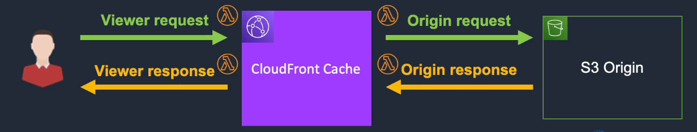

# AWS Lambda

## General Info

We can create Lambda from blueprints (examples), from scratch, or we can use AWS Serverless application repository.

We can use SNS to send a notification to trigger the function -> scheduling lambda

Lambda is a serverless computing platform:
* serverless means that we can run code without provisioning or managing servers
* we pay only for compute time we consume (to the millisecond), we don't pay for any idle time
* by default, lambda is highly available, fault-tolerant, scalable, elastic and cost-efficient. No maintenance window, downtimes, ...
* event: source can be CLI, API, SDK or an external trigger

Lambda functions or lambda function packages are the core concept when programming with lambda and consist of:

* application code
* any application dependencies our code requires such as libraries, configuration or other dependencies

Lambda easily integrates with many other AWS services including:

* cloudwatch logs for monitoring (need a role to send logs to cloudwatch otherwise we have no way to debug a lambda)
* API Gateway for exposing HTTP API endpoints backed by Lambda
* KMS to deal with encryption keys
* Many other services through the SDKs and the IAM Role assigned to a Lambda function on creation

Lambdas are region based, stateless (rapid scaling), event-driven based on triggers (files placed in S3 bucket, DynamoDB table updates, SNS notification, SQS messages, API Gateway, Kinesis (streaming analytics), Mobile/IoT backends, ...)

Only needed to provide:

* code
* memory allocation (128MB - 3008MB, 64MB increments)
* execution timeouts (minimum 1 second, maximum 900 seconds)
* IAM Role (execution role) - when created, the new role is scoped to the current function. To use it with other functions, we can modify it in the IAM console.
* Event Source mapping: required to know what triggers the lambda

AWS Serverless Application Model (SAM) is a framework that we use to build, test and deploy our lambdas (similar to CloudFormation). SAM is a specification that prescibes the rules for expressing serverless applications on AWS. There is a repository with available lambdas (AWS Serverless Application Repository). Specification is open source (Apache 2.0).

Each lambda runs in its own isolated environment with its own resources and file system view. Lambda stores code in S3 and encrypts it at rest + integrity checks while code in use. AWS may choose to retain an instance of our function and reuse it to serve a subsequent request (but we shouldn't plan around that). 

Lambda has access to threads and processes but the resources must be shared among all the threads/processes it uses.

Functions should be small, optimized. Code in zip file must be max 50MB (compressed).

Lambda functions only has access to a maximum of 500MB of non-persistent disk space in /tmp

With the SDK, Lambda has access to AWS services such as DynamoDB and S3 for stateful data even if the initial function is stateless.

Lambda is designed to process events within milliseconds. Latency will be higher immediately after a Lambda function is created, updated or if it has not been used recently.

When called through the AWS Mobile SDK, Lambda functions automatically gain insight into the device and application that made the call through the "context" object

Can deploy lambda with CodeDeploy, CodePipeline, CLI, ... When deployed, there is a ~1 minute window where both versions of a function could be used

Great combinations with Step Functions to coordinate a series of Lambda functions in specific order, Step Functions will maintain state during executions.

For troubleshooting, we have CloudWatch logs but we can also enable AWS X-ray by adding X-Ray permissions to lambda function's execution role and changing the function's tracing mode to active. This gives info like lambda service overhead, function init time, function execution time. We can add the X-Ray SDK in lambda deployment code to create our own trace segments, annotate traces or view trace segments for downstream calls made from the function (only available for Node.js and Java).

Integrated with CloudWatch, must be debugged using CloudWatch logs (Lambda creates a log group with some info about the execution time, ...).

## Invocations
Synchronous:
* CLI
* SDK
* API Gateway
* Result returned immediately
* Error handling happens client side (retries, exponential backoff, ...)

Asynchronous:
* S3, SNS, CloudWatch Events, ...
* Lambda retries up to 3 times and then goes to a Dead Letter Queue (if specified; SNS or SQS)
* Processing must be idempotent (due to retries)

Event source mapping:
* SQS, Kinesis Data Streams, DynamoDB Streams
* Lambda does the polling (polls the source)
* Records are processed in order (except for SQS standard)

Note that SQS can also trigger a Lambda

## Concurrency limits and restrictions
Concurrency is subject to a regional quota that is shared by all functions in a region. We can configure a function with
reserved concurrency limit to ensure a Lambda can reach a certain level of concurrency. We need to monitor the Throttles Lambda metric
to be sure that other Lambdas are not impacted and have enough concurrency available.
* when a function has reserved concurrency, no other function can use that concurrency
* reserved concurrency also limits the maximum concurrency for the function
* applies to function as a whole including versions and aliases

lambda will keep unreserved concurrency pool at minimum of 100 concurrent connections

default 1000 concurrent execution per region

Burst concurrency quotas:
* 3000 - US West (Oregon), US East (N. Virginia), Europe (Ireland)
* 1000 - Asia Pacific (Tokyo), Europe (Frankfurt), US East (Ohio)
* 500 - Other Regions

=> if the concurrency limit is exceeded, throttling occurs with error "Rate exceeded" and 429 "TooManyRequestsException"

If the error occurs, check throttling message in Amazon CloudWatch Logs but no corresponding data points in the Lambda Throttles metrics.
**If there are no Lambda Throttles metrics, the throttling is happening on API calls in our Lambda function code.**

How to solve:
* configure reserved concurrency
* use exponential backoff in our application code

Concurrency metrics:
* ConcurrentExecutions
* UnreservedConcurrentExecutions
* ProvisionedConcurrentExecutions
* ProvisionedConcurrencyInvocations
* ProvisionedConcurrencySpilloverInvocations
* ProvisionedConcurrencyUtilization

Restrictions with Lambda
- outbound connections only TCP/IP and UDP/IP sockets are supported
- ptrace is blocked
- TCP port 25 is also blocked (anti spam measure)

## Runtime problems

Failure during processing

- for S3 bucket notification and custom events: lambda retries 3 time (code problem, CPU/RAM resource exceeded)
- for streams (DynamoDB, Kinesis): Lambda will continue attempting execution until the data expires

Throttle limit exceeded:

- synchronous: 429 error code
- asynchronous: function can absorb reasonable bursts of traffic for 15-30 minutes then rejected 429 error code
- S3 events, DynamoDB, Kinesis: retried for 24h then timeout

It is possible to configure a dead letter queue (SQS or SNS) in which the event will be placed, without one the event is rejected.

## Lambda layers

We can configure Lambda function to pull in additional code and content in the form of layers. A layer is a ZIP archive that contains libraries, a custom runtime or other dependencies. With layers, we can use libraries in our function without needing to include them in our deployment package.

A function can use up to 5 layers at a time, total unzipped size cannot exceed 250MB

## EC2 vs Lambda

EC2 offers flexibility, instance types, OS customization, network and security settings. Easier to move app to the cloud. Need to be in charge of the instance, improved by Beanstalk, ECS.

Lambda offers less power (limited to 3GB RAM, 15min timeout), potentially cheaper if we don't have continuous load. Great for events based action.

## Event source

Lambda functions can be invoked on demand but can also be triggered by events coming from

* S3
* DynamoDB (using DynamoDB stream)
* Kinesis Data Streams, Data Firehose
* SNS/SES/SQS
* Cognito
* CloudFormation
* CloudWatch logs/events, Scheduled Events
* CodeCommit
* Config
* API Gateway (RESTful API with HTTP/HTTPS)
* CloudFront
* Alexa

Many other services such as CloudTrail can act as event sources simply by logging to S3 and using S3 bucket notifications to trigger Lambda functions.

**For event sources where events arrive in batches (SQS, Kinesis, DynamoDB streams), the event parameter in the function may contain multiple events in a single call, based on the batch size we request.**

For Kinesis and DynamoDB streams, the records sent to Lambda are strictly serialized per shard => 2 sequential records in the same shard will be sent one after the other (first one then second one) but it is possible that if the first timeout, the 2 is handled before. There is a retry mechanism (24h timeout).

## Creation

We can create a lambda from scratch, pick an example from blueprints or find one in the serverless application repository.

We need to provide the following information:

* name
* runtime: .NET, Go, Java 8, Node.js, Python, Ruby, PowerShell
* role: we can create a role from one or more templates or create a custom role
* role name: the new role will be scoped to the current function. If we want to use it with other functions, we need to modify it in the IAM console.
* policy templates: a list of available policy templates

From the console, it is easy to code a lambda function and add permissions and so on in the configuration (for example, CloudWatch events, ...).

We can test our lambda functions from the Console, just need to select the kind of trigger in a drop down list. From the console, we can also monitor what happened during the test using CloudWatch metrics.

Lambda creates record in the CloudWatch logs (log group will be /aws/lambda/function_name, the version of the lambda that is executed appears in the log file names ($LATEST for instance):

* START with a request ID
* END with a request ID
* REPORT with a request ID with the time it took to run, what it means regarding the billing, the max size of MB of the lambda and the actual MB size used

Only the runtime distribution libraries are available by default (+ the SDK like boto3 for python). If we want to use other libs, we need to create a **function package**.

Deployed lambda available a few seconds after upload.

We can embed our own copy of a library (including the AWS SDK) in order to use a different version than the default one provided by AWS Lambda

To enable VPC support, we need to specify one or more subnets in a single VPC and a security group as part of the function configuration. To disable VPC support, we just need to have an empty list of subnets and security group. Lambda functions do not support multi VPC access (except with VPC peering). Lambda requires NAT gateway if internet is needed in a VPC.

## Core concepts and terminology

AWS Lambda functions are triggered by events. These events can be a variety of things including:

* HTTP API requests through API Gateway
* CloudWatch scheduled events based on cron expression (can be a real cron '\
  *...' or something like rate(1 minute)) or events patterns like auto scaling, health, ...
* S3 file uploads
* DynamoDB streams changes
* Direct invocation using the CLI/SDKs
* many other event sources.

A lambda function will receive as arguments an **event** and a **context**. The event will contain data that the Lambda function can use and the context will be used to write a status (context.succeed("Ready!")). The context is a way to get runtime information like time-remaining (time before lambda timeouts) and request ID. The function returns a JSON value (statusCode, body, ..).

AWS Lambda invokes our function via a **handler** object which represents the name of our lambda function and serves as the entry point that AWS Lambda uses to execute our function code. For python, the handler will look like **filename.functionname** 

We then setup the **memory** in MB and the **timeout period**.

**Logging and exceptions** are always handled through CloudWatch logs and functions communicate success and failure to AWS.

**Runtime-specific concepts** each runtime has a few differences and some have unique concepts like the Node.js callback which is used to return information back to the caller.

When invoking functions directly with the Lambda Invoke API action, we can pick an invocation type:

* **synchronous**: wait for the return value and return it
* **asynchronous**: don't wait for the return value, discard it

**When triggered from an event, the type of invocation is determined by the service invoking the function.**

## Function Configuration

Can configure:

* language runtime: Node.js version, Java 8, Python 2.7/3.6 version, .NET core 1.01/2.0, Go 1.x
* the handler:
  * each function has a handler file and function
  * format of the lambda handler value is filename.functionname
* memory:
  * 128MB to 3008MB (in 64MB increments)
  * CPU allocation scales with memory
* maximum execution duration:
  * from 1 to 900 seconds (15 minutes) in 1 second increments
* permissions
  * IAM roles
  * resource-based access control policies allow other services and external accounts to invoke or take other actions on a lambda function. For example if we want DynamoDB streams to trigger our function, we need to set it up.
* Environment variables
  * key-value pairs available at runtime for all functions
  * can be encrypted using KMS, there is a default key for aws/lambda that can be used but we can use a custom one
  * environment variables are retrieved like normal environment variables. In Python: os.environ['key']
  * if we forget to set them, we get the error "Module Initialization error" and we need to set them
* AWS VPC: grants access to VPC resources (need to specify subnets, security groups, ...), we can select "No VPC" if we don't need any access to private VPC
* Dead Letter Queues: configure SQS or SNS to accept data from failed function executions -> good for debugging
* Concurrency: specify the maximum number of concurrent invocations of the function. by default 1000 unreserved account concurrency (valid for all functions) but we can reserve, say 100 for this particular function. In that case, there is a remaining 900 concurrent invocations for the other functions.
* Tags: key-value pairs to help organize the functions
* Auditing and compliance: can be logged by CloudTrail

## Function packages

Function packages or deployment packages are zip packages of all the code and dependencies required by the lambda function when it runs.

Function package include:

* handler file
* custom libraries or packages
* any other application code that integrates with the handler
* third party packages from providers like npm or pip that the function requires

Specific examples:

* Python: pip install the libraries in the same directory as the function code -> 
  * pip install -r requirements.txt -t .
  * quit virtual env and delete it
  * zip all files and directories (but not the root directory of the project that contains everything) => AWS needs to be able to unzip the archive and have access to the main file at the root + all the directories with the dependencies.
* Node.js: include the node_modules folder with the npm dependencies

Function packages can be a .zip file or zip in S3 and contains the function code and libraries not included within the runtime

## Versions and aliases
Lambda provides us with two useful tools for managing the production function code:

* versions
  * lambda versions are distinct versions of the functions stored inside of AWS each with their own unique ARNs
  * versions are either
    * The $LATEST version (literally just called LATEST) -> the only mutable version
    * a numbered version like 1 or 2
      * Numbered versions are assigned a number starting with 1 and each subsequent version is incremented by one
      * numbered versions are immutable (=> once published)
  * because different versions have unique ARNs, this allows us to effectively manage them for different environments like production, staging, development
  * can publish one or more versions of the Lambda function
* aliases
  * lambda aliases are like a pointer to a specific lambda version
  * using aliases, we can invoke a function with the alias without having to know which version of the function is being referenced
  * aliases have static ARNs but can point to any version of the same function, the ARN is unique
  * aliases can also be used to split traffic between lambda versions (weighted) -> points to one or two versions
  * alias can be modified, we can update an alias to point to a different version
  * can use alias traffic shifting -> canary deployments of Lambda function (weight)
  
```shell
aws lambda update-alias --function-name myfunction --name myalias --routing-config '{"AdditionalVersionWeights" : {"2" : 0.05} }'
```

Benefits of versions and aliases:

* easier development workflow and management of stages
* avoid having to reconfigure event sources (they can just point to a function alias)
* rolling back to an earlier versions becomes as easy as updating the alias
* using alias traffic splitting between versions can also help test new versions in production, blue/green deployment

=> we create a new version with "publish new version" in actions menu.

=> we create alias in the actions menu

* need a name (mandatory)
* description (optional)
* the version of the function (mandatory): we can specify $LATEST but that's not recommended
* **additional version (optional): split traffic, weight based => blue/green deployment or canary testing**

An alias has a specific ARN like arn:aws:lambda:{region}:{account id}:function:{function name}:{alias}

## Use cases

* Lambda can be used to react based on a specific event that is happening

* any event-driven task like S3 bucket changes or DynamoDB table updates

* Stream processing and ETL processes

* IOT and mobile backends

* Web application APIs

* retrieve latest AMI for a region within a CloudFormation template

  * **a lambda function in CF is a Custom Resources** that is provided out of the box by CF. Custom Resources can also be used to handle new services not yet supported by CF.

    ```json
    "Resources": {
        "MyInstance": {
            "Type": "AWS::EC2::Instance",
            "Properties": {
                "InstanceType": {"Ref": "InstanceType"},
                "ImageId": {"Fn::GetAtt": ["AMIInfo", "Id"]},
                ...
            }
        },
        "AMIInfo": {
            "Type": "Custom::AMIInfo",
            "Properties": {
                "ServiceToken": {"Fn::GetAtt": ["AMIInfoFunction"]},
                "Region": {"Ref": "AWS::Region"},
                "Architecture": {"Fn::FindInMap": ["AWSInstanceType2Arch", {"Ref": "InstanceType"}, "Arch"]}
            }
        },
        "AMIInfoFunction": {
            "Type": "AWS::Lambda::Function",
            "Properties": {
                "Code": {
                    "S3Bucket": {"Ref": "S3Bucket"}, # from parameters
                    "S3Key": {"Ref": "S3Key"} # from parameters
                },
            	"Handler": {"Fn::Join": ["", [{"Ref": "ModuleName"}, ".handler"]]},
            	"Role": {"Fn::GetAtt": ["LambdaExecutionRole", "Arn"]},
                "Runtime": "nodejs8.10",
            	"Timeout": "30"
            }
        }
    },
    "Outputs": {
        "AMIID": {
            "Value": {"Fn::GetAtt": ["AMIInfo", "Id"]}
        }
    }
    ```

## Lambda@Edge
* Run Node.js and Python code to customize the content CloudFront delivers
* set the trigger to be CloudFront requests. 
* Function is executed at the edge location of CloudFront. 
* Code must satisfy the Lambda@Edge service limits. Optimized for latency sensitive use cases where end viewers are distributed globally. 
* All the info we need to make a decision should be available at the CloudFront edge within the function and the request.

Function will trigger in response to CloudFront events:
* Viewer request: when user makes an HTTP(S) request to CloudFront
* Origin request: when CloudFront edge server does not already have the requested objects in its cache and the request is ready to be sent to the backend origin webserver
* Origin response: when CloudFront at edge receives a response from backend origin webserver
* Viewer response: when CloudFront server at the edge is ready to respond to the end user or the device that made the request



**API Gateway and Lambda are regional services. Lambda@Edge and CloudFront allows us to execute logic across multiple AWS locations based on where end viewers are located.**

## Pricing model

Billed for the compute time rounded up to the 100ms.

The resources needed like RAM, CPU

First 1m requests per months are free and then $0.2 per 1M requests

400000 GB-seconds per month free (3.2 millions seconds of compute time are free)

## Security and access control

For sensitive information, it is better to use client-side encryption with KMS and store the resulting values as ciphertext in environment variable

## Serverless Application Repository

quickly deploy code samples, components and complete applications for common use cases such as web and mobile back-ends, event and data processing, logging, monitoring, IoT and more.

Each application is packaged with a SAM template that defines the AWS resources used.

Publicly shared applications also include a link to the application's source code. 

Free to use, we only pay for the resources used in the apps we deploy.

## Resources

Documentation: https://docs.aws.amazon.com/lambda/latest/dg/welcome.html

CLI: https://docs.aws.amazon.com/cli/latest/reference/lambda/index.html

