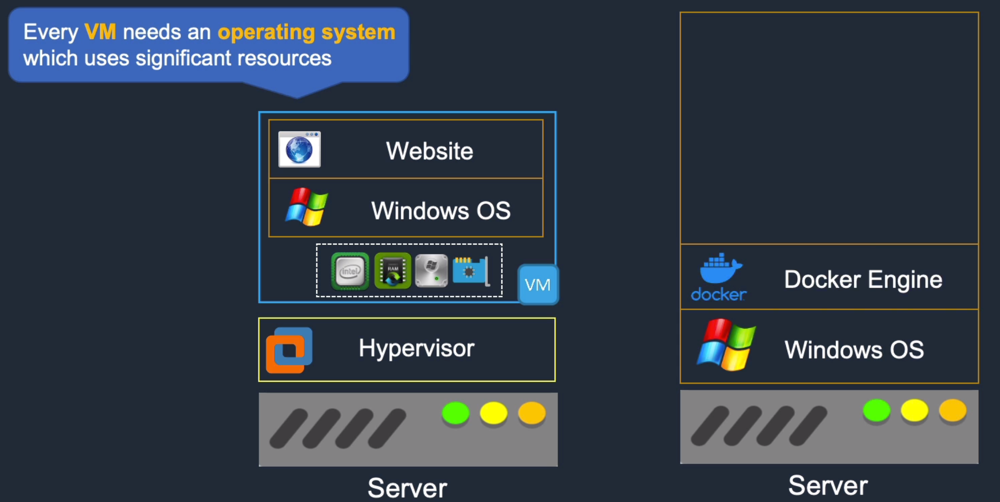
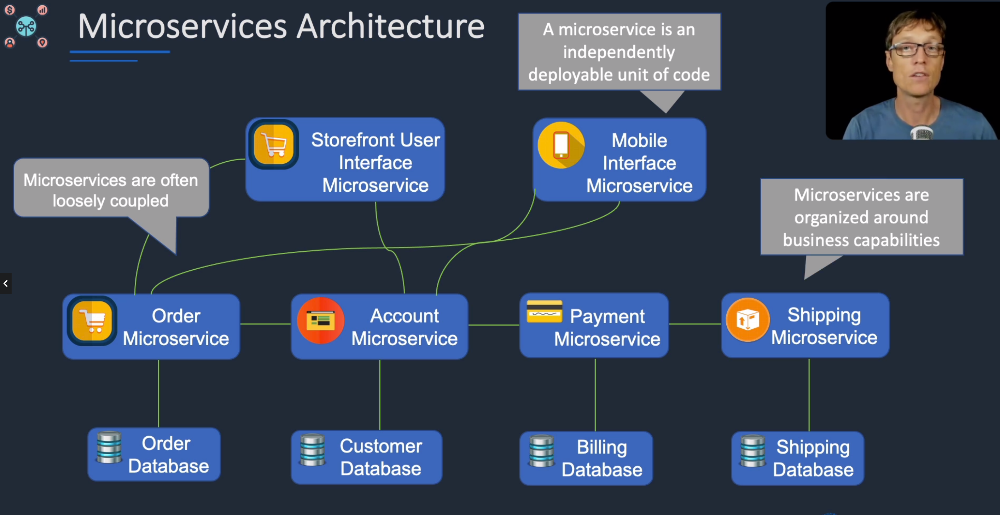
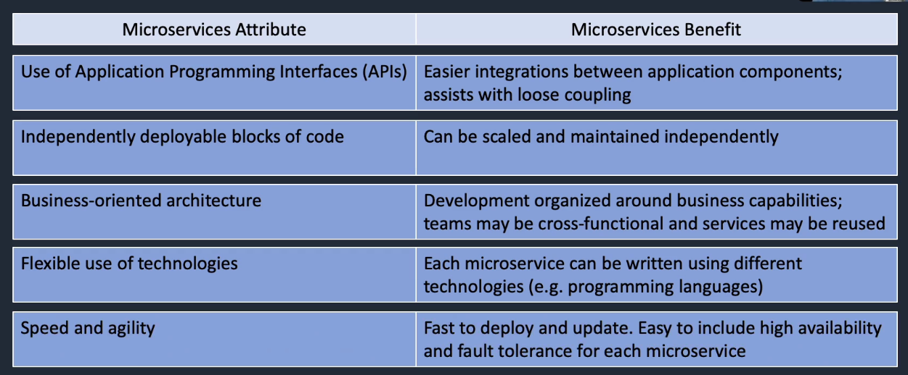
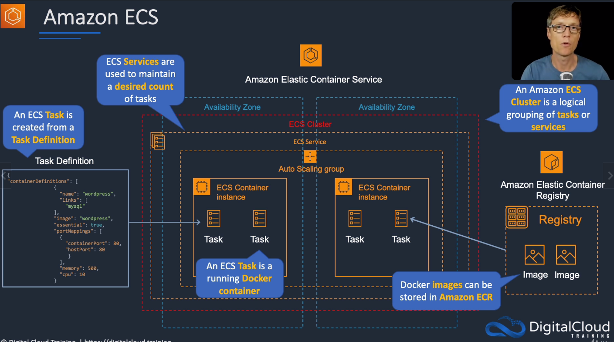
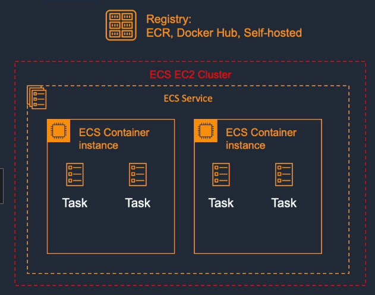
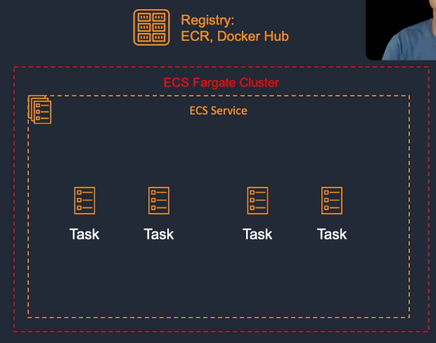
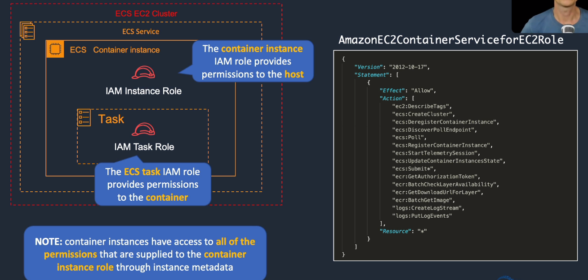
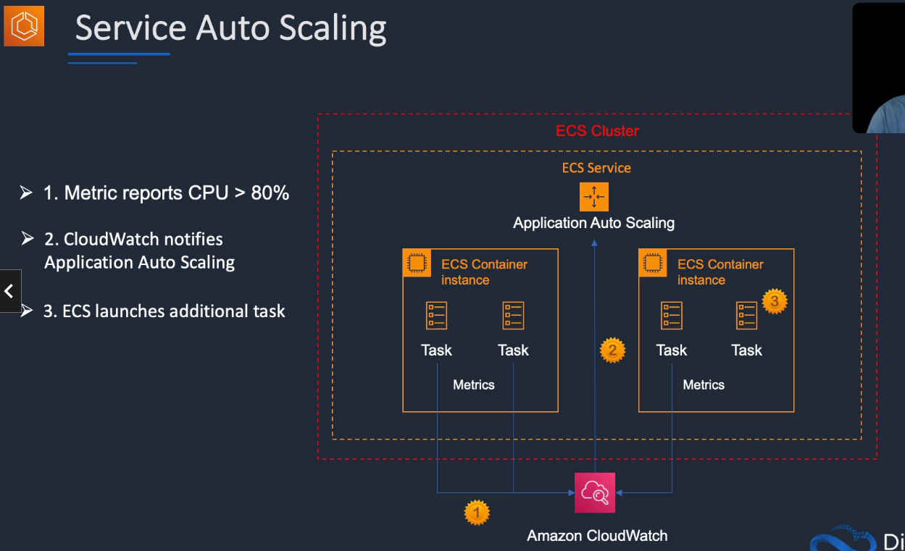
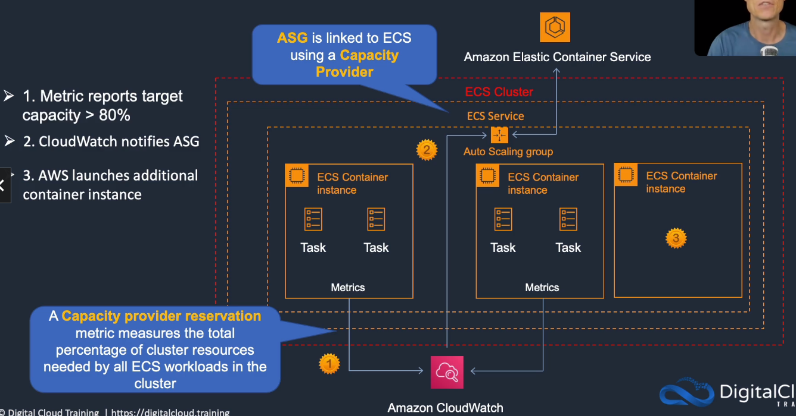
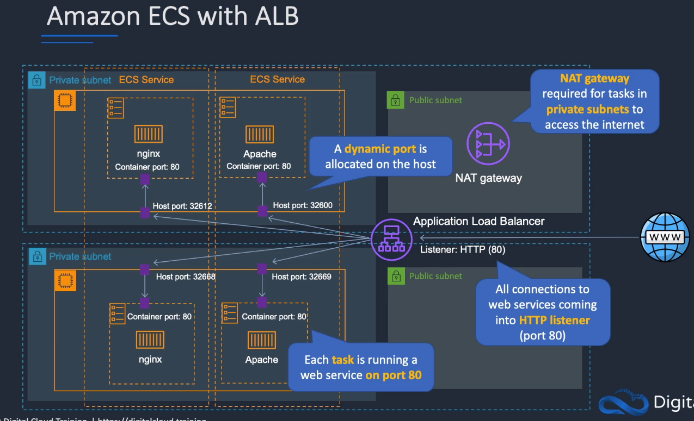

# Amazon Elastic Container Service (ECS)

## General Info

ECS includes support for the awslogs log driver to send logs to CloudWatch logs

Run Docker containers on a cluster of EC2 instances

ECS has two modes: Fargate launch type and EC2 launch type. More customization with EC2 but need to plan and provision.

Why use ECS/containers ? 

* create distributed applications and micro services
  * create app architecture comprised of independent tasks or processes (micro services)
  * can have separate containers for various components of our app
    * web server
    * app server
    * message queue
    * backend servers
  * this allows us to start/stop/manage/monitor/scale each container independently
* batch and etl jobs
  * package batch and etl jobs into containers and deploy them into a shared ec2 clusters
  * run different versions of the same job or multiple jobs on the same cluster
  * share cluster capacity with other processes and/or grow jobs dynamically on-demand to improve resource utilization
* Continuous integration and deployment
  * by using Docker's image versioning, we can use containers for continuous integration and deployment
  * build processes can pull, build, create Docker images for the containers

Container registry located on AWS via the ECR service (Elastic Container Registry), a 3rd party repository like Docker Hub or a self hosted registry

containers can make use of IAM roles via task roles or they can utilize roles applied to the ECS container instance

If ECS task gets 403 error to access a bucket. We need to check if any of the following has changed
* bucket policy
* ECS container instance IAM role
* ECS task execution role

ECS and Docker are a good choice if we need to scale based on memory usage and have long running time (> 15 minutes))

## Docker and microservices architecture
Role of the hypervisor: abstract the hardware from the software (virtual machine)

With Docker architecture, the Docker engine replaces the hypervisor of a server with VM.

Container includes all the code, settings, and dependencies for running the application.

Each container
* isolated from other containers
* start much faster than en EC2 instance
* very resource efficient

Microservices
* many instances of each microservice can run on each host
* microservices can also be spread across hosts
* updates are easier
* scaling is easier
* more resilient
* stateless most of the time, but we can mount a volume or EBS if needed

* We can run multiple applications on port 80 on the same host with a load balancer
* we can run ECS instances using EC2 Spot
* **ECS Spot instance draining** can be enabled on the instance => ECS receives a Spot Instance interruption notice and places the instance in DRAINING status
  * DRAINING = ECS prevents new tasks from being scheduled for placement on the container instance

## Core knowledge

**Cluster**
* logical grouping of container instances into which we can place Amazon ECS tasks
* in the case of Fargate, we don't manage these instances
* can be Networking Only (Fargate), EC2 Linux + Networking (normal EC2 instances with Linux), EC2 Windows + Networking

**Amazon ECS Container Agent**
* allows container instances to connect to the cluster OS is included in the AMI that is optimized for Amazon ECS
* run on EC2 instance
* communicates information like running tasks and resource utilization
* Responsible to start/stop the tasks when told by the ECS

**ECS Container instance**
* EC2 instance that is running the ECS container agent and has been registered into a cluster
  * need an IAM Role (if we don't use Fargate)
  * configuration

**Capacity provider**
* similar to an auto scaling group

**Task definition**
* an application description (JSON) that contains one or more container definitions
* Configuration of the container (image to use, docker registry, CPU, RAM, port, volumes, ...)
* we need to be aware of the launch type (Fargate vs EC2) when we create a task definition
* if we use Fargate, we can only configure one port (expose), for EC2 we configure expose + dynamic port
* task definitions have versions => revision number. One is created each time we change the task definition

**Scheduler**
* method used for placing tasks on container instances

**ECS Service**
* run and maintain a specified number of instances of a task definition simultaneously (long running task)
* configure security group
* load balancing (Application Load Balancer) and so on

**Task**
* instantiation of a task definition running on a container instance
* started/stopped by the ECS agent based on instruction or schedule
* task must select the task definition + revision number

**Container**
* a docker container created as part of the task

**Registry**
* where docker images are located
* Amazon Elastic Container Registry, Docker Hub

### Launch types

EC2
* explicitly provision EC2 instances
* responsible for managing EC2 instances
* charged per running EC2 instance
* EFS and EBS integration
* we handle cluster optimization
* more granular control over infrastructure
* Docker images can be self hosted

Fargate
* auto provision resources
* provision and manage compute
* charged for running tasks
* no EFS/EBS integration
* handles cluster optimization
* limited control, infra is automated
* images can only come from ECR and Docker Hub

### ECS and IAM Roles
For EC2 Container instances, we need to provide roles for the container instances and the tasks themselves.

**all the permissions of the EC2 container instance are forwarded to the ECS task**

For Fargate, we only have IAM task role!

### ECS networking modes
awsvpc
* task is allocated its own elastic network interface (ENI) and a primary private IPv4 address
* same networking properties as Amazon EC2 instances
* Fargate must use this mode

bridge
* task utilises Docker's built-in virtual network which runs inside each Amazon EC2 instance hosting the task
* only available for EC2

host
* the task bypasses Docker's built-in virtual network
* maps container ports directly to the ENI of the Amazon EC2 instance hosting the task
* only available for EC2

none
* no external network connectivity
* only available for EC2

## Deploy docker image to AWS
Using ECR which is a docker registry hosted on Amazon, well integrated with ECS.

1. First build the image: **docker build -t image-name .**

2. Create repository on ECR: **aws ecr create-repository --repository-name cda-penguin-app**

   This returns a response with the repo ARN, the registryID, the repositoryName, repositoryUri, createdAt.

   We need to copy the **repositoryUri** to be able to push images to this repository: 375320954029.dkr.ecr.us-east-1.amazonaws.com/cda-penguin-app

3. login to ECR: **aws ecr get-login --region us-east-1 --no-include-email**. This returns a command that we can execute to login.

   **docker login -u AWS -p {some random string base64 encoded} https://375320954029.dkr.ecr.us-east-1.amazonaws.com**

4. tag image docker relative to the ECR repository: **docker tag cda-flask-app:latest 375320954029.dkr.ecr.us-east-1.amazonaws.com/cda-penguin-app**

   [cloud_user@ip-10-0-1-5 cda-2018-flask-app]$ docker image ls
   REPOSITORY                                                     TAG                 IMAGE ID            CREATED             SIZE
   375320954029.dkr.ecr.us-east-1.amazonaws.com/cda-penguin-app   latest              535fae9031bf        12 minutes ago      206MB
   cda-flask-app                                                  latest              535fae9031bf        12 minutes ago      206MB

5. upload the image to the ECR: **docker push 375320954029.dkr.ecr.us-east-1.amazonaws.com/cda-penguin-app**

6. We can now go to ECS in the Console and then **Cluster** to create a cluster using Fargate

7. Create a **container definition** (= where is the container?) and a **task definition** (= what is the configuration of the container?)

   1. Container defition -> custom. Give a name and copy the image: **375320954029.dkr.ecr.us-east-1.amazonaws.com/cda-penguin-app**, put some RAM limits if necessary (HARD limits or SOFT limits) and setup the port mappings.
   2. Edit the task definition. Setup the task definition name, the network mode (awsvpc), the task execution role (IAM role), compatibilities (FARGATE, ...)

8. Configure **service**. The number of desired tasks running, security group (with CIDR block), load balancer type (None or Application Load Balancer).

9. Finally, configure the **cluster** configuration. Give it a name, a VPC ID, Subnet => both can be left as default which will be created automatically by fargate.

10. Review and create

11. Once completed, we can view the service running. Go to tasks and get the ENI ID which is a link to the EC2 instance where it is running. Get the public DNS and test.

## Auto Scaling
service can optionally be configured to use Service Auto Scaling to adjust its desired count up or down in response to CloudWatch alarms (CPU and memory usage)

Two types of scaling:
* service auto scaling
  * **task level**
  * auto adjusts the desired **task count** up or down using the Application Auto Scaling service
  * supports 
    * target tracking (cloudwatch metric)
    * step (in response to cloudwatch alarms and how big the breach is)
    * scheduled scaling policies (based on date and time)

* cluster auto scaling:
  * uses a Capacity Provider to scale the number of EC2 cluster instances using EC2 Auto Scaling Group (ASG)
    * way to talk between ECS and EC2 auto scaling => only for EC2, not Fargate
    * when associated ECS CP with an ASG -> cluster can now scale ASG auto
      * managed scaling with an auto-created scaling policy on our ASG + **new** scaling metric (Capacity Provider Reservation)
      * managed instance termination protection, which enables container-aware termination of instances in the ASG when scale in happens
      

## Load balancing
Each container will have a dynamic port (host) that maps to the exposed port (container).

Only the Application Load Balancer is aware of these dynamic ports! => well integrated with ECS

We also need a NAT gateway if we want internet access, same as an EC2.

We need to have a target group that targets IP addresses (Fargate), not instances or Lambda functions!

## AWS App Mesh
* monitor and control microservices, integrate with ECS and EKS.
* Standardize how microservices communicate, giving us end-to-end visibility and helping ensure high availability for our app
* when a component fails, instead of going offline, app mesh will degrade the functionality
* App mesh uses "Envoy proxy" 

## AWS Cloud Map

service discovery for micro services
