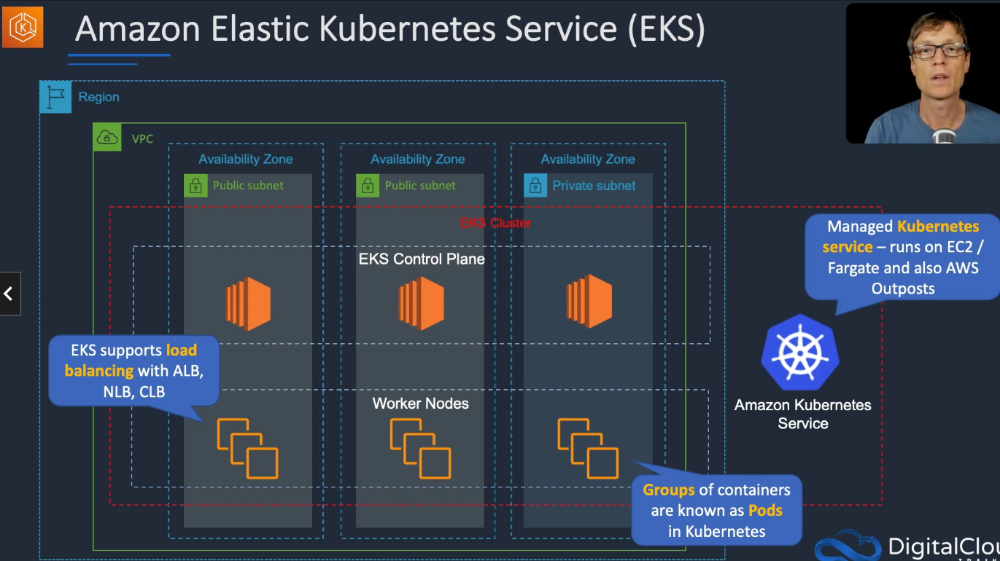

# Amazon Elastic Kubernetes Service (EKS)

## General Info
* EKS cluster across multiple availability zones.
* runs on EC2, Fargate, AWS Outposts (on-prem)
* EKS Control Plane
* EKS supports load balancing with ALB, NLB, ClassicLB
* Groups of containers are known as Pods in Kubernetes

## Use cases
* when we need to standardize container orchestration across multiple environments using a managed kubernetes implementation
  * less locked in to AWS ecosystem
  * customer already uses Kubernetes on-premise, easier to migrate
* Hybrid deployment (AWS + On-premises)
* Batch processing
  * sequential or parallel batch workloads on EKS using Kubernetes Jobs API
  * plan, schedule, execute batch workloads
* Machine learning (Kubeflow), run distributed training jobs use GPU EC2, including Inferentia
* build web applications that auto scale, highly available configuration across multiple AZ

## Architecture patterns - containers and PaaS
* company plans to deploy Docker containers on AWS at the lowest cost: Amazon ECS with a cluster of Spot instances and enable spot instance draining
* company plans to migrate Docker containers to AWS and does not want to manage OS: Fargate launch type
* Fargate task is launched in a private subnet and fails with CannotPullContainer: need a NAT gateway + disable auto assignment of public IP address
* application will be deployed on ECS and must scale based on memory: use service auto-scaling and use the memory utilization
* application will run on ECS tasks across multiple hosts and needs access to an S3 bucket: use task execution IAM role (not EC2 container instance one) for the permission
* company requires standard docker container automation and management service to be used across multiple environments: use EKS
* company needs to move many simple web apps running on PHP, Java and Ruby to AWS, usage is very low: beanstalk (single instance)
* business critical application running on beanstalk must be updated. zero downtime and quick and complete rollback: immutable with new ASG and swap traffic
* dev application running on beanstalk needs cost-effective and quick update, downtime is okay: all at once update
* need managed environment for running a simple web application. App processes incoming data which can take several minutes per task: beanstalk with worker and web (decoupled with SQS)

