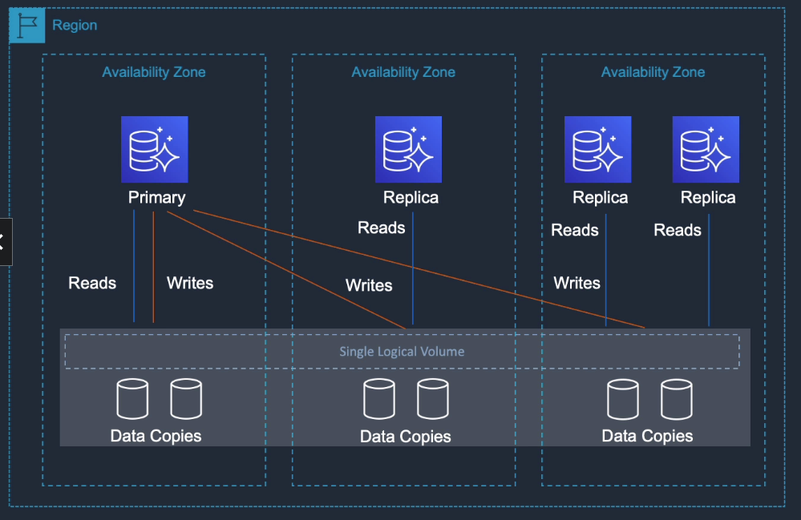

# Amazon Aurora

## General Info
* MySQL and PostgreSQL compatible database (Amazon proprietary database).
* Relational DB engine combining speed and availability of high-end commercial DB with the simplicity and cost-effectiveness of open source database.
* Aurora provides up to five times better performance than MySQL and 3 times better perf than PostgreSQL at a price point one tenth that of a commercial DB while delivering similar performance and availability.
* We have to think about Aurora in terms of cluster of instances and not a single instance (primary instance and replicas).

Aurora is compatible with MySQL 5.6

Creating Aurora DB takes time (15-20 minutes)

Two flavors: **standard and serverless**

Error logs are generated automatically but we can also generate slow query log and the general log by settings parameters in our DB parameter group
=> troubleshoot Aurora

2 copies of data are kept in each AZ with a minimum of 3 AZ’s (6 copies). Can handle the loss of up to two copies of data without affecting DB write availability and up to three copies without affecting read availability.

You can create read replicas for an Amazon Aurora database in up to five AWS regions. This capability is available for Amazon Aurora with MySQL compatibility.

## Aurora fault tolerance
* fault tolerance across 3 AZs
* single logical volume
* replicas scale out read requests
* up to 15 replicas with sub 10ms replica lag
* replicas are independent endpoints
* can promote replica to be a new primary or create a new primary
* set priority (tiers) on Aurora replicas to control order of promotion
* can use auto scaling to add replicas

## Key features

## Backups and snapshots
Backups

- automatic, continuous and incremental backups
- point in time restore within a second up to the last 5 minutes. 
- the backup retention period can be up to 35 days.
- stored in S3
- no impact on database performance

Snapshots

- user initiated snapshots are stored in S3
- kept until we explicitly delete them
- incremental

## Scaling
(Scalability) Modify instance type
(Elasticity) Aurora serverless, scale on demand

Aurora starts with 10GB, scales in 10GB increments to 64TB (storage auto scaling) without any disruption of the data

Compute resources can scale up to 64vCPUs and 488GB of RAM

if Aurora 100% CPU Utilization

- because of write -> need to scale up (increase instance size)
- because of read -> need to scale out -> add new read replicas

## Replicas

Amazon Aurora replicas
* share underlying volume with the primary instance
* updates made by primary are visible to all replicas
* up to 15 replicas
* same region
* low performance impact on primary (=> use storage layer))
* replica can be a fail-over target with no data loss

MySQL read replicas
* primary instance data is replayed on the replica as transactions
* up to 5
* high performance impact on primary => (use transaction log)
* replica can be a fail-over target with potentially minutes of data loss

=> no postgresql replicas

For replication, we have roles "writer" and "reader" which is master/slave. We also have the information like the replication lag. On a read replica, there is a property "Failover priority", the lower it is the most likely it is to be picked up in case of failover (0, 1, ...). This can be setup when we create a read replica (Tier 0 > Tier 1 > Tier 2...).

## Cross region replicas
Creating a new cross region replica will also create a new Aurora cluster in the target region. 
If the replication is disrupted, we will need to set up again. 
**It is recommended that we select "multi A-Z deployment" to ensure high availability for the target cluster** 

## Failure and fault tolerance

* single logical volume
* replicas scale-out read requests
* up to 15 replicas with sub-10ms replica lag
* replicas are independent endpoints
* can promote aurora replica to be a new primary or create new primary
* set priority tiers on replicas to control order of promotion
  * Fail-over is defined by tiers, the lower the tier, the higher the priority with tier 0 being the highest priority available. 
  * Aurora detects databases crash and restarts without the need of crash recovery or cache rebuilding. 
  * There is an automatic fail-over to one of up to 15 read replicas.
* can use auto scaling to add replicas

Database failure
* two copies of the data is contained in 3 separate AZ (6 copies total)
* recovery in a healthy AZ without data loss
* if this fails -> we still have point-in-time or snapshot restore

Fault tolerance
* data divided into 10GB segments across many disks
* FT across 3 AZs
* transparently handles loss
* designed to handle the loss of up to two copies without affecting db write availability and up to three copies without affecting read availability
* storage is self-healing (continuous errors checks and repairs)

With Aurora, there is **backtrack** functionality which is a rollback up to 72 hours without the need to restore a backup.

### Cross region replica with Aurora MySQL

### Aurora Global Database

The secondary is read only.

Amazon Aurora Global Database is designed for globally distributed applications allowing a single Amazon Aurora DB
to span multiple AWS regions. It replicates data with no impact on database performance, enable fast local reads with low latency in each region
and provides disaster recovery from region-wide outages.

A database in a secondary region can be promoted to full read/write capabilities in less than 1 minute.

### Aurora multi master in a region
* all nodes allow reads/writes
* available for MySQL only
* up to four read/write nodes
* single region only
* cannot have cross-region replicas
* can work with active-active and active-passive workloads
* can restart read/write DB instance without impacting other instances
* Aurora Multi-Master is designed to achieve high availability and ACID transactions across a cluster of database nodes with configurable read after write consistency.

* Aurora Multi-Master improves upon the high availability of the single-master version of Amazon Aurora because all the nodes in the cluster are read/write nodes. 
* With single-master Aurora, a failure of the single writer node requires the promotion of a read replica to be the new writer. 
* In the case of Aurora Multi-Master, the failure of a writer node merely requires the application using the writer to open connections to another writer.

### Aurora Serverless
* on-demand, auto scaling configuration for Aurora (MySQL compatible edition) where the DB will auto startup/shutdown and scale up or down capacity based on the application's needs.
* Pay on per-second basis for the DB capacity when the DB is active
* Can migrate between standard and serverless configuration with a few clicks in the AWS RDS console
* router fleet controls connection
* capacity can seamlessly scale up and down
* there is a warm pool of capacity using  aurora capacity unit (ACU) is 2GB of memory + CPU
* With Aurora Serverless, you only pay for database storage and the database capacity and I/O your database consumes while it is active.

#### Use cases
* infrequently used applications
* new applications
* variable or unpredictable workloads
* dev and test database
* multi tenant applications

## Security
* All aurora instances must be created in a VPC 
* SSL (AES-256) is used to secure data in transit 
* We can encrypt the database using AWS Key Management service. 
* When creating an Aurora DB, if we have encryption enabled (default), all the read replicas and copies will be encrypted as well. 
* Encrypted storage, snapshots, replicas and backups

=> **we cannot encrypt an existing unencrypted database, we need a migration to an encrypted database**

## Resources

Documentation: https://docs.aws.amazon.com/AmazonRDS/latest/AuroraUserGuide/CHAP_AuroraOverview.html

CLI: https://docs.aws.amazon.com/cli/latest/reference/rds/index.html
