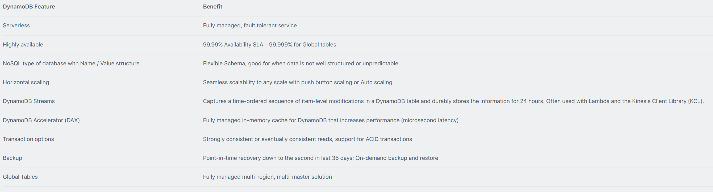
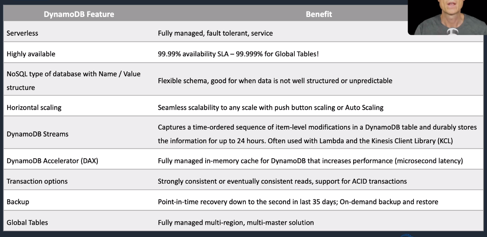
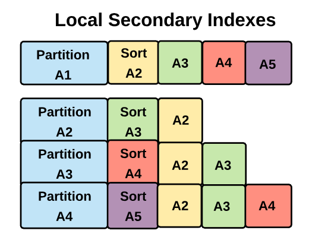
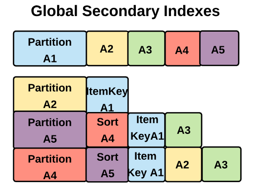
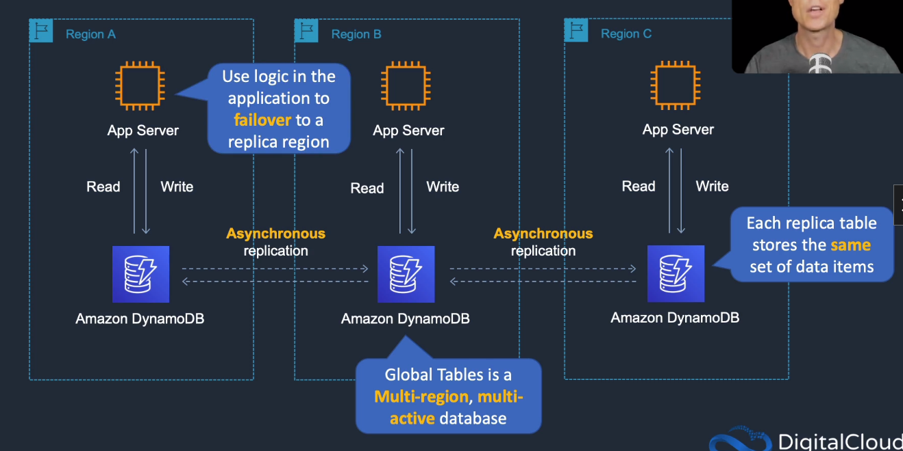
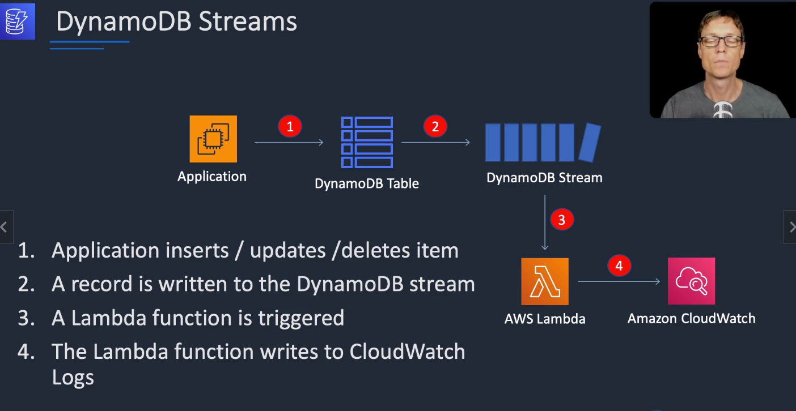

# Amazon DynamoDB

## General Info

(Scalability) Unlimited amount of storage
(Elasticity) Increase additional IOPS for additional spikes in traffic and decrease after the spike

DynamoDB is a fully managed, fully resilient (can lose one AZ) and highly available NoSQL database service.

Predictable fully manageable performance with seamless scalability.

There are no visible servers, DynamoDB automatically allocates more as required.

There is no practical storage limitations.

Data is replicated across multiple AZ. Data is accessed through HTTPS endpoint and hardware or datacenter failure will be invisible to our application.

DynamoDB is fully integrated with IAM - rich and controllable security (including Federated and Web identity) => perfect for mobile and webapps.

In DynamoDB, we don't create database, we only create tables.

two types of key: partition key + partition key and sort key

DynamoDB auto scale to meet workload demands, and partitions and repartition our data as the table size grows + replicates data across 3 facilities in an AWS Region

Supports GET/PUT operations using a user-defined primary key (only required attribute for items in a table); can be single attribute partition key or a composite partition-sort key.

if our table has bad performance due to too many partitions (can happen if we set too many RCU/WCU temporarily), we can use AWS Datapipeline to export the data to a new table with good capacity units

with mobile users, it is easy to have a single table for all users and limit access to certain items using "dynamodb:LeadingKeys"

CloudFormation-Lambda-DynamoDB is a great combinations to handle information retrieval at runtime such as IP range available (in order to not have conflicts with VPC) for dynamic config
=> ip ranges are allocated/de-allocated as stacks are created and deleted, info stored in DynamoDB and retrieved by Lambda in CF

for random spike of high WCU needed, in order to reduce cost we can use SQS to process the spikes with a smaller WCU numbers

Push button scaling -> change RCU/WCU, and it scales horizontally (more partitions)

DynamoDB attributes in a table can have a TTL, so they are automatically deleted from the database after some time
* temporary data
* session store
* helps reduce table size
* set a timestamp for deletion on a per item basis
* no extra cost and does not use WCU/RCU

ProvisionedThroughputExceeded -> use DynamoDB auto scaling with min/max capacity units based on target utilization + use DAX if read heavy (no write)

The aggregate size of an item cannot exceed 400KB including keys and all attributes. => points to object in S3 if more than 400KB

Only identity based policies (user, group, roles) -> no resource based policies

You can use a special IAM condition to restrict user access to only their own records.

If your access pattern exceeds 3000 RCU or 1000 WCU for a single partition key value, your requests might be throttled.

Best practices for partition keys:
* Use high-cardinality attributes – e.g. e-mailid, employee_no, customerid, sessionid, orderid, and so on. 
* Use composite attributes – e.g. customerid+productid+countrycode as the partition key and order_date as the sort key. 
* Cache popular items – use DynamoDB accelerator (DAX) for caching reads. 
* Add random numbers or digits from a predetermined range for write-heavy use cases – e.g. add a random suffix to an invoice number such as INV00023-04593

Replicated write capacity unit (rWCU):
* When using DynamoDB global tables, your data is written automatically to multiple AWS Regions of your choice.
* Each write occurs in the local Region as well as the replicated Regions.

Streams read request unit:
* Each GetRecords API call to DynamoDB Streams is a streams read request unit.
* Each streams read request unit can return up to 1 MB of data.

Transactional read/write requests:
* In DynamoDB, a transactional read or write differs from a standard read or write because it guarantees that all 
* operations contained in a single transaction set succeed or fail as a set.

* Provisioned capacity: fixed number of RCU/WCU
* Auto scaling: specified number of RCU/WCU with possiblity of more with auto scaling
  * need scaling policy
  * scale read or write or both with a minimum that we want
  * contain also a target utilization: percentage of consumed provisioned throughput at a point in time
  * uses target tracking algorithm
* On-Demand: unspecified, scale instantly

DynamoDB has TTL available, delete items based on a timestamp in a column, within 48 hours of expiration, also deleted from LSI/GSI

Optimistic Locking is a strategy to ensure that the client-side item you are updating (or deleting) is the same as the item in DynamoDB. =>
protects DB writes from being overwritten by the writes of others and vice versa.

Conditional Updates with condition expression to determine which items should be modified. If condition is true -> update, else operation fails

VPC endpoints for DynamoDB, KMS for encryption, SSL/TLS for in transit

Copy data from DDB to Redshift for business intelligence

Integrated with Hive on EMR to query DynamoDB

## DB choice for HA
* If possible, choose DynamoDB over RDS because of inherent fault tolerance. 
* If DynamoDB can’t be used, choose Aurora because of redundancy and automatic recovery features. 
* If Aurora can’t be used, choose Multi-AZ RDS. 
* Frequent RDS snapshots can protect against data corruption or failure, and they won’t impact performance of Multi-AZ deployment. 
* Regional replication is also an option but will not be strongly consistent. 
* If the database runs on EC2, you must design the HA yourself.

## Best practices
* Keep item sizes small. 
* If you are storing serial data in DynamoDB that will require actions based on date/time use separate tables for days, weeks, months. 
* Store more frequently and less frequently accessed data in separate tables. 
* If possible compress larger attribute values. 
* Store objects larger than 400KB in S3 and use pointers (S3 Object ID) in DynamoDB.

## Features


## Anti patterns
* traditional RDS apps
* joins/complex transactions
* BLOB data
* Large data with low I/O rate

## Consistency Model
Eventually consistent reads:

* When you read data from a DynamoDB table, the response might not reflect the results of a recently completed write operation.
* The response might include some stale data.
* If you repeat your read request after a short time, the response should return the latest data.

Strongly consistent reads:

* When you request a strongly consistent read, DynamoDB returns a response with the most up-to-date data, reflecting the updates from all prior write operations that were successful.
* A strongly consistent read might not be available if there is a network delay or outage. In this case, DynamoDB may return a server error (HTTP 500).
* Strongly consistent reads may have higher latency than eventually consistent reads.
* Strongly consistent reads are not supported on global secondary indexes.
* Strongly consistent reads use more throughput capacity than eventually consistent reads.

DynamoDB uses eventually consistent reads by default.

You can configure strongly consistent reads with the GetItem, Query and Scan APIs by setting the –consistent-read (or ConsistentRead) parameter to “true”.

## Transactions
* all-or-nothing changes to multiple items both within and across tables
* ACID (atomicity, consistency, isolation and durability)
* read/write multiple items across multiple tables 
* checks for a pre-requisite condition before writing to a table
* group multiple Put, Update, Delete, ConditionCheck actions then TransactWriteItems
* group multiple Get then TransactGetItems
* no additional cost

## Core knowledge


## API

CreateTable API to create a table

PutItem to write an item

BatchWriteItem to write a collection of items

GetItem / BatchGetItem to get items

UpdateTable API to update the scaling capacity

PutScalingPolicy API for auto scaling config -> auto scale RCU/WCU with min/max value

## Conditional Writes and Atomic Counters

**Atomic counters**: DynamoDB writes are applied in the order received so they can be used to increment existing values for the purposes of things like a record of website visitors. If the operations fail they can be retried. However, this does risk updating the item twice and possibly under or over counting. 

**Conditional Writes**: when we need additional control over the success conditions of a write, we can use conditional writes. These writes will only succeed if the item attributes they are writing to meet one or more expected conditions

For conditional writes, we would something like 

```python
dynamodb.update_item(
	TableName='my_table',
    Key={
        'Artist': {'S': 'My artist'}
    },
    UpdateExpression='SET price =:val',
    ExpressionAttributeValues={
        ':val': {'N': '15.37'},
        ':currval': {'N': '18.37'}
    },
    ConditionExpression='price =:currval',
    ReturnValues="ALL_NEW"
)
```

This means that we would only update the price to 15.37 if the current price is 18.37. If we try this request a second time, we get an exception "**ConditionalCheckFailedException**".

## Capacity unit
### Modes
On demand
* pay per-request pricing for reads and writes
* enabled as default

Provisioned
* specify number of reads/writes per seconds (RCU/WCU)
* In our account, we can specify a **total number of provisioned capacity units per region** that can be used by all our tables combined.
* can use AWS auto scaling to auto adjust in response to demand
* Reserved performance, we pay for the reservation even if we don't use it.
* Performance scales in a linear way. **We specify how many reads and writes we want per second on a per table basis** and the system handles the rest. If we go over the capacity, we are throttled. There is a burst pool of 300 seconds of our read and write amounts. 

Can switch between modes once per day

### Read capacity units (RCU)
* number of 4KB blocks per second. For example, 8KB read = 2 RCU, 2KB read = 1 RCU.
* each API call to read data is a read request
* can be strongly consistent, eventually consistent or transactional
* for items up to 4KB in size, one RCU equals
  * one strongly consistent read requests per second
  * two eventually consistent read requests per second
  * 0.5 transactional read requests per second
* items larger than 4KB requires additional RCUs

Reads by default take data from one of these locations (**Eventually Consistent => use 1/2 RCU per 4KB block**). 

We can also have **Immediately Consistent => uses 1 RCU per 4KB block.**

### Write capacity units (WCU)
* number of 1KB blocks per second. For example, a 2KB writes would use 2 WCUs. A 500 bytes write would use 1 WCU.
* each API call to write data is a write request
* for items up to 1 KB in size, one WCU can perform
  * one standard write request per second
  * 0.5 transactional writes requests (one transactional requires 2 WCU)
* items larger than 1KB require additional WCUs

DynamoDB is a distributed system. When we write data, we write it in multiple location at the same time. 
It is only acknowledged when at least 2 nodes have confirmed the write.

We can have auto-scaling capacity units enabled, but we need a specific role for that, even with administrator, 
we don't have it. We need to provide upper and lower bounds for read and write capacity. 
This is combined with CloudWatch alarms where we will have event to adjust provisioned capacity up or down as needed. 
Auto Scaling will be enabled by default for all new tables, but we can also configure it for existing ones. 

=> big potential problem with that since we cannot remove partitions if more partitions are created because we have a huge spike of reads or writes. 
Fortunately, we can specify a min and max numbers of capacity units that will be allowed.

## Structure

DynamoDB is a collection of tables in each region => region resilient service. The service namespace is at the regional level. Availability zones are unimportant in a DynamoDB architecture.

Tables are the highest level structure within a database. We specify the performance requirements at the table level.

DynamoDB uses the performance (RCU/WCU) and the data quality to manage underlying resource provisioning.

**Partition keys are unique, items with the same partition key are stored together but the order is defined by the sort key**. **A partition key + a sort key is a unique item ID.** **=> the partition key doesn't have to be unique between items but the sort key does.**

### Table

Unlike SQL databases, the data structure or schema is **NOT** defined at the table level.

**Table** has **rows**. Each row is an **item**. Each **item** contains a number of elements called **attributes**. Each row can have a different number of attributes or different attributes.

There are a number of these attributes that are special!

The table **hash key** (or **partition key**) must be unique in the table and it is used when we want to retrieve data using the **Query** operation.

The second special attribute is called the **range key (or the sort key**) and is used for

* each occurence of a hash in a partition key may have multiple data items
* one-to-many relationships
* sorted items

A **Query** operation can pull a range of values by using the **range key** or sort on those values using the **sort key**.

### Attribute types

* String
* Number: positive or negative
* Binary: base64 encoding
* Boolean
* Null
* Document (Arrays/List/Map): JSON
* Set: (array) ["red", "green", "blue"]

### Partitions

Conceptually imagined as an underlying server which can cope with a certain level of RCU and WCU; and store a certain amount of data => underlying storage and processing nodes of DynamoDB

Initially, one table equates to one partition. Initially, all the data for that table is stored and computed (insert, update, delete) by that one partition. We don't directly control the number of partitions but we can influence them. A partition can store a maximum of 10GB of data and can handle 3000 RCU and 1000 WCU.

**=> there is a capacity and performance relationship to the number of partitions** 

When we go beyond 10GB or 3k RCU or 1k WCU (**whichever happens first**), a new partition is added and the data is spread between them over time.

Data is distributed between the partitions using the hash/partition key.

When multiple partitions exist, the partition for a particular item is selected based on the hash/partition key for each unique value and the item is assigned to a particular partition.

For example, say we have the following structure: 3 columns (test_id, student_id and result). We can have multiple time the same value for test_id, multiple times the same value for student_id and multiple time the same values for result => **this is independently, we cannot have two rows with the same values.** A test will have many students with different results associated to the same test_id. A student_id will be part of different test_id item.

**A partition may host multiple hash and partition key values**

* partition 1 has test_id 1, 5, 6, 8
* partition 2 has test_id 2, 7
* partition 3 has test_id 3, 4, 9

**for one specific test (hash key value), there can only be one partition. => we cannot have test_id 1 (or its hash value) in multiple partitions**

Within each hash/partition key, there may be many students taking the test. **This is an ideal range/sort key value.** It will allow many items per partition key so we can store the results of the one-to-many test-student relationships. It also allows sorting of the test results by student_id or the selection of test results for a group of student (ie. for one school).

**Partitions will automatically increase. While there is an automatic split of data across partitions, there is no automatic decrease when load/performance reduces => this is a problem because the allocated WCU and RCU is split between partitions.** For example, if we add 30k RCU and DynamoDB has 10 partitions, we will have 3k RCU per partition.

This means that in each single partition key value (ie. each test) is limited to 10GB of data => each test could have millions of students. Because each partition is limited to 3k RCU and 1k WCU, it inherits those limits and it is limited to those values. => **very important to keep that in mind when we pick hash/partition key.**

**=> we need to be extra careful when we increase and decrease WCU and RCU (increase over the limit = new partitions but they are not removed).**

**=> Since our partition key will have a limited of RCU/WCU, we may have performance issues after decreasing the RCU/WCU even if the total RCU/WCU is appropriate for the load! We will end up with throttling issue for partition keys.** 

**=> table performance is split across the partitions, what we apply at the table level isn't what we often get.**

**True performance is based on performance allocated, key structure and time and key distribution of reads and writes.**

Exam tip: You typically need to ensure that you have at least the same, or more, RCU/WCU specified in your GSI as in your main table to avoid throttling on your main table.

## Global and Local Secondary Indexes

https://www.dynamodbguide.com/secondary-indexes/

DynamoDB offers two main data retrieval operations: **SCAN** and **QUERY**. Scan is a very inefficient operation => full scan table, returns all attributes for all items in a given table or index. Query can be used to select a single item by specifying one partition key or a partition and sort value if the table uses partitions and sort keys. Using a single partition key and a range of sort values, multiple items can be returned in a very data efficient way. With Query, we can filter the results using a specific attribute.

You can use the ProjectionExpression parameter so that Scan only returns some of the attributes, rather than all of them.
If you need to further refine the Scan results, you can optionally provide a filter expression. A filter expression is applied after a Scan finishes but before the results are returned.
For faster performance on a large table or secondary index, applications can request a parallel Scan operation by providing the Segment and TotalSegments parameters.

Without indexes, our ability to retrieve info is limited to the primary table structure (**only partition key or composite key of partition & sort key**). Indexes allow secondary representations of the data in a table using alternative range key attributes or even alternative partitions and range key attributes => allow efficient queries on those representations.

**When we query/scan, we need to specify into which index we want to get the data from!!! DynamoDB doesn't select the index by itself.**

Indexes come in two forms: **Global Secondary and Local Secondary**.

**A secondary index is a data structure that contains a subset of attributes from a table along with an alternate key to support query operations. A table can have multiple secondary indexes which give our applications access to many different query patterns.**

### Local Secondary Index (LSI)



**=> index that has the same partition key as the base but a different sort key, share throughput with the table**

Can only be created at the time of the table creation. LSI's use the same partition key but with a different sort key. 

By default, LSI contains Partition, Sort and new Sort + optionally, any other attributes can be used as projected values (=> non key attributes that are also stored in the table). **We can specify our projected attributes to be All/Keys Only/Include -> limit the scope of our queries.**

Any data written to the table is copied asynchronously to any LSI's (=> assume Eventual Consistency) but we can have strong consistent as well (=> use **ConsistentRead** parameter in Query).

Reading or writing to an LSI consumes RCU/WCU on the main table. 

An LSI is a sparse index, an index will only have an item if the index sort key attribute is contained in the table item (attribute != null), a partition key is always present. => very efficient lookup since we don't care about null values for the sort key.

Storage and performance considerations with LSI's:

* by default, we only store key values in a LSI (= partition key, sort key, new sort key)

* if we retrieve an item which is projected, we are charged accordingly (just for that item being retrieved).  We are charged for just the size of all the index entries rounded to the nearest 4KB rather than the full size of the item in the original table => we can potentially save in retrieval cost via LSI.

* if an item is not in the LSI then we have two penalties

  * an additional query latency while the item is retrieved from the main table

  * DynamoDB will have to fetch the item from the main table in addition to the index

    => we are charged the retrieval cost for each entire item in the main table rather than just the attribute being retrieved

    **=> plan LSI and item projects, very important!**

Any queries based on this sort key are much faster using the index than the main table.

#### Example: query LSI for non projected values

Weather forecast table with item of 6x50 bytes (=> 300 bytes total). 

* Column 1: weather_id (partition key)
* Column 2: datetime (sort key)
* Column 3: sunlight sensor
* Column 4: security attribute called intrusion_detected (wildlife, ...)
* Column 5: UV detector
* Column 6: the result of the measurement

We've noticed a set of temperature anomalies and we think it may be due to animals getting into the equipment and increasing the ambient temperature with body heat.

The current model is very inefficient with pulling data back only when intrusions are detected as this is not a key-value. We either need to check on per weather station basis and check of the intrusion attribute or scan the whole table and filter on the intrusion field.

The logical solution is to create a LSI when the table is created. (=> 200 bytes total per row)

* Column 1: weather_id -> same partition key
* Column 2: the intrusion detected field (new sort key)
* Column 3: projected value (=> temperature value)
* Column 6: date time (sort key of main table)

With this, we can pull back only records for a given station when an intrusion value is true. It is also a good idea to project an attribute in the index.

Query LSI: select a single partition key and a sort key value of true (= intrusion). The query returns 4 rows, each of 200 bytes which is all of the items sizes combined including headings and the query is rounded up to 4KB. From a throughput perspective, it is nice and efficient.

Now let's assume that we also begin to suspect the intrusion is impacting the sunlight sensor. 

LSI + index: 

- Column 1: weather_id -> same partition key
- Column 2: the intrusion detected field (new sort key)
- Column 3: projected value (=> temperature value)
- Column 4: sunlight sensor
- Column 6: date time (sort key of main table)

As we haven't projected this value in the LSI, will the query succeed or fail ? The query will complete but at a significant cost (performance and financial). DynamoDB will initially query the LSI (4 rows x 200 bytes) but will also query the main table to retrieve the non projected value.

The first issue is performance => additional query latency generated by the LSI and table query.

The second issue is the cost => we will be billed for the whole item from the main table for each rows returned from the LSI query. 4 rows of 200 bytes = 800 bytes rounded up to 4k + 4 complete rows from main table (6 attributes x 50 bytes) rounded up to 4KB each => 1 x 4KB + 4 x 4KB: total query size = 20KB

**Just because we queried a non projected values in the LSI!** we pay 20KB instead of 4KB and we have a loss of performance

#### Writing to LSI

Let's say we have a table

* column 1: partition key
* column 2: sort key
* column 3: non index attribute

We create a LSI 

* column 1: partition key
* column 2: a new attribute (not yet in the main table) as its sort key
* column 3: projected value

The LSI is currently empty as there is no attribute for the LSI sort key in the main table (=> sparse index).

Scenario 1: we update the main table either by updating an item with a value for the attribute used by the LSI new sort key or by adding a new item that contains the value for this attribute (LSI sort key)

=> both options will take one WCU in the main table for the write in the LSI.

Scenario 2: delete a row containing a value for an attribute used by the LSI new sort key (=> the LSI needs to be updated). This cost one WCU to also remove the item from the LSI.

Scenario 3: update the attribute LSI key from the main table (value changed from dog to cat) -> 2 operations are needed on the LSI: 

* remove the item from the LSI with value dog
* add the item to the LSI with value cat

Updates which don't impact any defined index attributes such as adding or deleting rows without any defined index attributes don't require additional index operations.

#### Concerns with LSI

* be aware of ItemCollections (= all the data in the table and an index which shares one partition key). For the weather station example, it would be all data in the main table and any indexes for one weather station.
* ItemCollections only apply  to tables with a LSI. If we don't have any LSI, we don't need to worry about ItemCollections
* The maximum size of a Item Collection is 10GB per partition key value (=> per weather station). They limit the number of range keys for a given partition key. In our example, having an LSI would limit the effective datetime range we could store data for all of our weather stations.
* => ItemCollectionSizeLimitExceededException means that we have an LSI and the capacity requirements for a given partition key in the table and indexes exceed 10GB.

### Global Secondary Indexes (GSI)



**=> an index with a partition key and a sort key that can be different from those on the base table, does not share throughput with the table**

* shares many of the same concept as a LSI but with a GSI, we can have alternative partition & sort key
* can be created at any time
* as with a LSI, we can define an attribute projection using 
  * just the keys (Keys Only)
  * a selection of attributes (Include) => specify custom projection values
  * (ALL) attributes
* unlike LSI's where the performance is shared with the table, RCU and WCU are defined on the GSI -> same way as the table (we have another set of RCU/WCU just for the GSI)
* As with LSI, changes are written to the GSI asynchronously => assume eventually consistent
* GSI can only have eventually consistent reads

In the LSI example, we could not query efficiently all the items where an intrusion was detected. We can do that with a GSI.

We create a GSI with

* the instrusion field becomes the partition key
* the weather station id becomes the sort key
* we also project all the values into the table as we want to perform lookups on the temperature readings as part of our queries.

Done this way, we can now look for data where the intrusion field is true and pull all the weather stations by querying any range or pull a subset if we are looking for a subset. We can then see the times for each record and the temperature recordings allow us to identify any trends either temporal or geospatial.

This might not be a good design because our partition key can only have two values (true or false) which may cause ongoing performance issues if the data grows.

A better idea would be to use sparse indexes and having either a true value in the intrusion attribute or nothing at all => GSI only stores data for intrusion.

The mechanisms for updating GSI is the same than LSI except that we don't share RCU/WCU with the main table for GSI.

## DynamoDB Global tables
* global tables provide fully managed solution for deploying multi region
* multi master database without having to build and maintain own replication solution
* only solution that allows writing in both regions on the same instance (Aurora cannot)
* relies on DynamoDB streams (new and old images)
* multi region, multi active database (can write in both tables)
  * good for DR
  * good for multi region performance



* Global table = collection of one or more replica tables, all owned by a single AWS account
* Replica table = a single DynamoDB table that functions as part of a global table, each replica has the same set of data items. Any given global table can only have one replica table per region

With a global table, each replica table stores the same set of data items. DynamoDB does not support partial replication of only some of the items.

It is important that each replica table and secondary index in your global table has identical write capacity settings to ensure proper replication of data.

## DynamoDB performance
### DynamoDB Accelerator (DAX)
* DAX is a cache for DynamoDB deployed in our VPC
* can have security groups
* need IAM role for the cache to access DynamoDB
* need IAM role for the EC2 to access dynamodb and the DAX
* fully managed, highly available, in-memory cache for DynamoDB
* performance from milliseconds to microseconds
* improve READ performance, not WRITE
* no need to update application logic since it is the same API calls


#### DAX vs ElastiCache
* optimized for DynamoDB (vs elasticache)
* does not support Lazy Loading (uses write-through caching)
* with elasticache we have more management overhead (invalidation)
* with elasticache, need to modify application code to point to cache
* Elasticache supports more datastores

### Provisioned Throughput

provisioned capacity

* unit of read capacity: 1 strongly consistent read/second or 2 eventually consistent reads/second for items as large as 4KB
* unit of write capacity: 1 write/second for items up to 1KB
* key concepts:
  * calculating required throughput
  * understanding how secondary indexes affect throughput
  * what happens if apps read/writes exceed throughput

Calculating read capacity: round up to nearest 4KB multiplier. Items that are 3KB in size can still only do 1 strongly consistent or 2 eventually consistent reads per second.

**Read throughput with LSI**

* Capacity units are shared with table for LSI
* if we read only index keys and projected attributes, the capacity calculations are the same
  * **calculate using the size of the index entry, not the table item size**. If table has 6 attributes for an item but our index has only 4, the size required will be calculated on the 4 attributes only.
  * rounded up to the nearest 4KB

**Write throughput with LSI**

* adding/updating/deleting an item in a table also costs write capacity units to perform the action on the local index

**Read throughput with GSI**

* global indexes have their own throughput capacity, completely separate from that of the table's capacity
* support eventually consistent reads which means that a single global secondary index query can get up to 8KB read capacity unit

**Write throughput with GSI**

* putting/updating/deleting items in a table consumes the index write capacity units

**Exceeding Throughput**

* requests exceeding the allocated throughput may be throttled
* with global secondary indexes, all indexes must have enough write capacity or the write might get throttled
* we can monitor throughput in the AWS console

#### Examples

**Read capacity**: items are 3KB size, we want 80 strongly consistent read per second for a table => 80 \* 3KB rounded to 4KB/4KB = 80 provisioned read capacity throughput required, divided by 4KB because it is the size of a read capacity unit. For eventually consistency, divide by 2 so we have 40

**Write capacity**: item size 1.5KB, we want 10 writes per second => 2KB \* 10 = 20 write capacity units required

### Partitions

https://read.korzh.cloud/aws-dynamodb-partitions-and-key-design-56688bee8502

Starts and ends with partitions. Partitions act like unit of storage and they drive the read and write capacity.

Estimate number of partitions that DynamoDB will create, two formulas; one based on performance, the other on capacity.

**Performance**: partitions = Desired RCU / 3k RCU + Desired WCU / 1k WCU (=> rounded up to the largest number). This means that DynamoDB will provide one partition for each 3k RCU or 1k WCU.

Real world example where we want to achieve 7500 RCU and 3000 WCU -> 2.5 partitions for RCU and 3 partitions for WCU -> 6 partitions for performance.

**Capacity**: partitions = data size in GB / 10GB

Real world example where we want to store 65GB -> 7 partitions

Once we have the number of partitions for performance and capacity, we take the maximum which is 7 in that example. 7 partitions will provide the required performance for read, write and capacity.

How does that influence true performance ?

Our allocated reads and writes are distributed across partitions! If we have, for example, 4k WCU which is 4 partitions, each partition will receive 1k WCU. This is a problem because we don't really have 4k WCU unless with write data in parallel on the 4 partitions (=> example valid for RCU as well). If we write data on only 1 partition, we will use only 1k WCU instead of the 4k WCU. **Since one partition key cannot be split in different partitions, if we write data for one partition key, we will limit ourselves to the WCU available for that partition. Because of that, the partition key numbers is crucial, we shouldn't have a small numbers of partition key in our design.** 

How to select an appropriate key for a given workload? For small workload (< 1k WCU and < 3K RCU, < 10gb), this is not a problem because we will have only one partition and a bad key will not have a disastrous effect on the performance.

Good partition key:

* an attribute that has many distinct values (student ID if we have more students, candidate ID for an election, ...) => we want the attributes to be as big and distinct as possible
* the attribute should have a uniform write/read pattern across all partition key values
* the attribute should have a uniform temporal write/read pattern across time (during the day/night)
* if any of the above aren't possible with an existing value => consider synthetic/created/hybrid value
* we shouldn't mix **hot** (heavily used) and **cold** (rarely used) key values within a table **

Example: voting to an US elections, many candidates for the party, not all of them are equals (not uniform write/read), there are timezones differences between the states (not uniform temporal write/read) => we have a problem. Even if we scale the WCU, we will create even more partitions. This is a problem for when we have less candidates (like the 2 last one) because only the 2 partitions where these 2 candidates ID will be used, the others won't. To solve this, we implement a **key sharding plan for the table in DynamoDB**.

For each partition, we implement a suffix of 1 to N **(number of partitions ? what if the table grows and requires more partitions than initially planned?)**; this expands our available pool of partition keys. When writing to the database, an application takes the candidate that's due to receive the vote and adds a random number from 1 to N values as a suffix. This gives us a much wider range of partition keys meaning the much more leveled write pattern and DynamoDB will handle this pattern so that it is distributed across partitions. Reading those values is a case of reading each one from 1. The suffix will drive on which partition our data will be written **(the same suffix ends on the same partition ?)**. 

### Global Secondary Indexes - performance considerations

GSI have their own RCU and WCU values and use alternative keys.

If we have 12k WCU on the table (12 partitions x 1k WCU) and we don't plan the GSI to expect that loads (too low WCU or default values), we will have throttling at the GSI level but also at the main table!

After updating to 12k WCU for the GSI, we would expect the problem to be solved. In reality, that's not the case if the partition key of the GSI is not properly thought. If we have a small number of distinct values for this key (say a boolean value), this means that we have two very hot partition keys. This is also a limit for the number of partitions we can have for the GSI since a partition key value can only be found on one partition. The GSI will only have 2 partitions active (the one where we have true/false for the attributes). DynamoDB will allocate 6k WCU to each active partition. There is another problem with that because if the true/false items are not uniformly distributed, we will still have problems of performance because the biggest side will require more WCU that it has => we will still have throttling issue in the index and the table.

Additionally, if the data is not uniformly distributed, we will also have performance problem. Let's say that in an hour, we need 15 RCU and WCU for the last 55 minutes but the first 5 minutes, we need 50 WCU. This could be the case if if we receive a batch of information at the end of the hour and then the RCU/WCU needs stabilizes after 5 minutes. The 15 RCU and WCU allocated will be sufficient for 55 minutes but not the first 5 minutes so we will be throttled at each start of the hour when the batch is received.

We have 3 main options:

* rely on burst - get 300 seconds of our RCU/WCU => in reality, relying on burst is a bad idea
* change our application, force it to spread periodic batch writes over time
* use SQS as a managed write buffer

In the case of read not uniformly distributed, for example, when we have a read spike because of an online sale of 1 or 2 products in the front page (the other products are not on sale). We will have more reads for product 1 and 2 compared to the others.

Increase the RCU is dangerous => we want to plan for the normal load because partitions can increase but not decrease.

Relying on burst capacity in that case won't work, not a long term solution.

We could use a static HTML based in S3 for the products on sales => scalable solution but user experienced diminished.

Another solution is to use caching using ElastiCache. We can combine that with DynamoDB streams to handle the cache based on the update on DynamoDB.

## Web Identity Federation with DynamoDB

Use cases:

- give access to DynamoDB to users external to our account
- not create IAM user for each mobile user

We first register the app with an Identity Provider such as Amazon and obtain a unique app ID. We then create an IAM role which will access the DynamoDB table. The role must have an IAM document policy attached to it. We then specify the conditions for access. 

Users sign in to Amazon and provide STS with the token and the app ID to request access. If valid, STS will return temporary credentials to the app and allows it to access the DynamoDB table. 

*Steps*:

1. First create a DynamoDB table
2. go to Access Control for the table.
3. select the provider (Amazon, Google, Facebook)
4. Select allowed actions: BatchGetItem, GetItem, DeleteItem, ...
5. select allowed attributes
6. generate policy
7. create role, not for EC2 but for Web Identity (Cognito or any OpenID provider)
8. specify the application ID (gotten from Amazon/Facebook/Google)
9. use the policy generated before then create role
10. check trust relationships (Amazon, Google, ...)
11. specify session duration (default 1h)

## Streams & replications



**Allows identical copies (called replicas) of a DynamoDB table (called master table) to be maintained in one or more AWS regions. Writes to the table will automatically be propagated to all replicas. Read replicas are updated asynchronously. Use cases: disaster recovery, faster reads, data migration. Before DynamoDB streams were released -> Data Pipeline was used.**

DynamoDB stream is an ordered record of updates to a DynamoDB table. We enable a stream on a particular table.

When a stream is enabled on a table, it records changes to a table and stores those values for 24 hours. Entries older than 24 hours are expired.

AWS guarantee that each change to a DynamoDB table occur in the stream once and only once and that ALL changes to the table occur in the stream in near real time.

A stream represents a timeline from 24h ago to now on a continuous basis.

By default, only the partition key is stored in the stream but we don't see the nature of the action (create/update/delete) on a partition key. We don't see the attributes before and after the changes.

=> streams have a number of configurations to overcome this limitation.

Streams can be configured with four views.

- KEYS_ONLY: only the key attributes are written to the stream
- NEW_IMAGE: the entire item POST update is written to the stream
- OLD_IMAGE: the entire item PRE update is written to the stream
- NEW_AND_OLD_IMAGES: the pre and post operation state of the item is written to the stream allowing more complex comparison operations to be performed

Use case:

- replications 
  - We may have a game or large distributed applications with users worldwise using a multi master database model. A synced set of tables operating worldwide.
  - We can also have a database table in one AWS region replicating to another AWS region for Disaster recovery failover.
- triggers
  - lambda function triggered when items are added to a dynamo DB stream performing analytics on data
  - lambda function triggered when a new user signup happens on our web app and data is entered into a users table

Replication is a feature recently added by AWS, it is not built into DynamoDB rather that streams and Kinesis technologies are utilized by replication platform built using CloudFormation and Elastic Beanstalk.

Replication model

- create or select table to be replicated (source table)
- download replication template and apply cloud formation stack then wait
- get replication management console from CF output and then login to replication console and create a replication group identity => need to provide the source and destinations regions & tables. The only other option here is to bootstrap which is copy the existing data or not.
- wait until process has completed, status shifts to active, replication will occur automatically. In the background additional checkpoint tables will be created
- at this point, we have synchronization between regions

### Data Pipeline with DynamoDB

Old method before Streams were released.

* Used to export data from a DynamoDB table to a file in S3
* can import data from S3 into DynamoDB table, **in the same AWS region or in a different region**
* copy data from DynamoDB table in one region, store the data in S3 and import the data from S3 to an identitcal DynamoDB data. We will have additional costs for the underlying AWS servers that are used
* when we use Data Pipeline for exporting and importing data, we must specify the actions the pipeline can perform and which resources the pipeline can consume
* **Required IAM roles for DataPipeline:**
  * DataPipelineDefaultRole: actions our pipeline can take on our behalf
  * DataPipelineDefaultResourceRole: for the resources pipeline will provision on our behalf (EMR Cluster and EC2 instances within it)

Use case:

* maintain a test set from production data for testing
* backup test data in S3 that can be reused for several tests cases
* disaster recovery if we have multi region
* reduce network latency for users around the world, they can just use the table closest to them

**=> Data Pipeline launches EMR cluster which fetches data from DynamoDB and store them in S3 and vice versa.**

Create pipeline

* name
* source: 
  * **build using a template: AWS CLI commands, DynamoDB to S3, S3 to DynamoDB, run job on EMR, Full copy of RDS MySQL to S3, Load S3 data to MySQL, MySQL to Redshift, Redshift to MySQL, S3, always scenarios like these.**
  * import a definition
  * build using architect: GUI to customize the pipeline
* schedule: on pipeline activation, on a schedule. We can run every days, set start date/end date
* logging: enabled/disabled
* security access: default mentioned above, custom IAM roles

## Limits and common DynamoDB errors

Limits:

* 20 GSI max per table
* 5 LSI max per table
* Max 100 attributes for projection into all table's local and global secondary indexes.
* capacity units: max number of RCU and WCU per table per region (default limit)
* number of dynamodb tables: 256 tables max per region
* item size: max 400KB 
* number of concurrent requests (update/delete/create) at the same time
* API: BatchGetItem (max 100), BatchWriteItem (max 25) and both cannot exceed 16MB
* max 10k write and 10k read on a single table -> soft limit
* max 20k read/write units from a single subscriber account -> contact AWS for more
* min 1 read/write capacity unit on table

DynamoDB errors:

* AccessDeniedException 
* ThrottlingException: delete/create/update tables too quickly
* ProvisionedThroughputExceededException: throughput of the table is insufficient to support the amount of read and write operations we are doing
* ResourceNotFoundException: requested table does not exist or is too early in the CREATING state

## On-Demand vs auto scaling
On-Demand is the new pricing model for DynamoDB. We don't have to set RCU/WCU, DynamoDB scales automatically without limit.
This is different than auto scaling because the scaling happens over time and we need to define the min and max capacity units.
If the RCU/WCU reached the limits (auto scaling), the users would get throttled.

On-demand perfectly fits the serverless model where the traffic cannot be predicted.

If the traffic can be predicted, it would be more beneficial to have an auto scaling system with provisioned throughput in place.
If the capacity units are fully utilized at any time during the month, it is more beneficial to have provisioned throughput otherwise on-demand would likely be a better candidate.

Existing tables can be switched to on-demand in the console.

Reserved provisioned capacity cannot be used with DynamoDB on-demand.

Hot partitioning doesn't seem to be a problem since there is "adaptive capacity" for DynamoDB to handle new partitions without performance loss.

40k RCU and 40k WCU limit for on-demand per table in most regions and we can only switch once per day between on-demand and provisioned capacity.

### Summary

steady, predictable traffic -> choose reserved capacity

variable, predictable traffic -> choose provisioned capacity

variable, unpredictable traffic -> choose on-demand

## Billing

Billing is done on the number of RCU and WCU.

We pay the reserved capacity even if not used.

We pay for the storage and the data transfer

LSI's share the same RCU/WCU than the main table.

GSI's have their own RCU/WCU.

## Resources

Doc: https://docs.aws.amazon.com/amazondynamodb/latest/developerguide/Introduction.html

API: https://docs.aws.amazon.com/amazondynamodb/latest/APIReference/Welcome.html

CLI: https://docs.aws.amazon.com/cli/latest/reference/dynamodb/index.html

Best practice: https://docs.aws.amazon.com/amazondynamodb/latest/developerguide/best-practices.html
