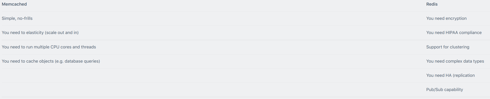
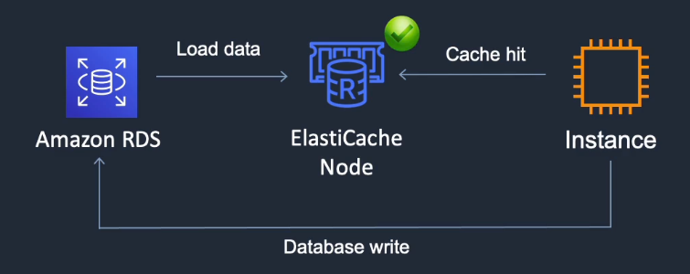
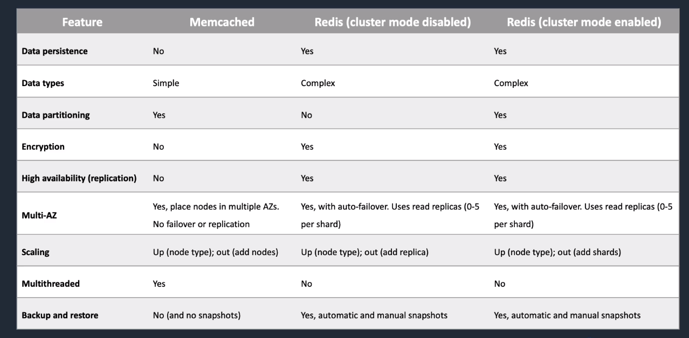
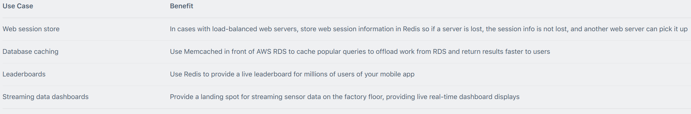
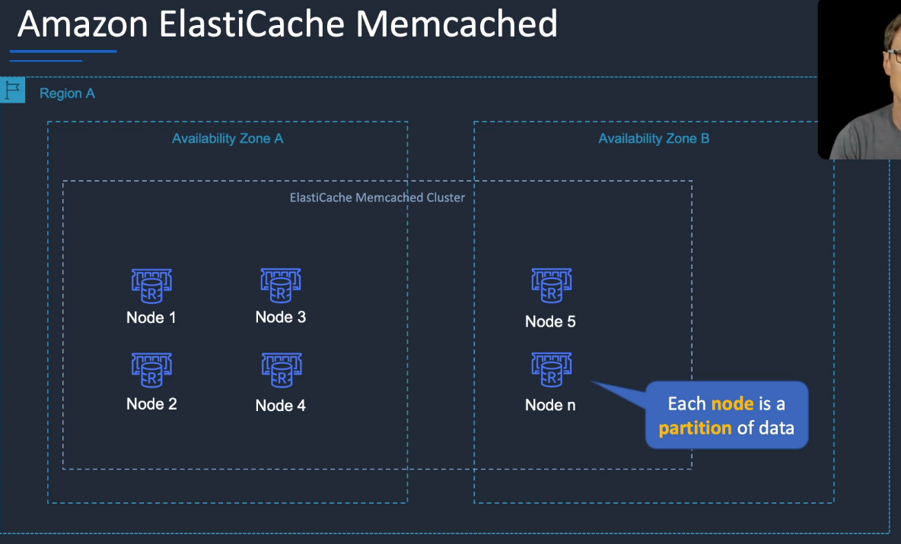
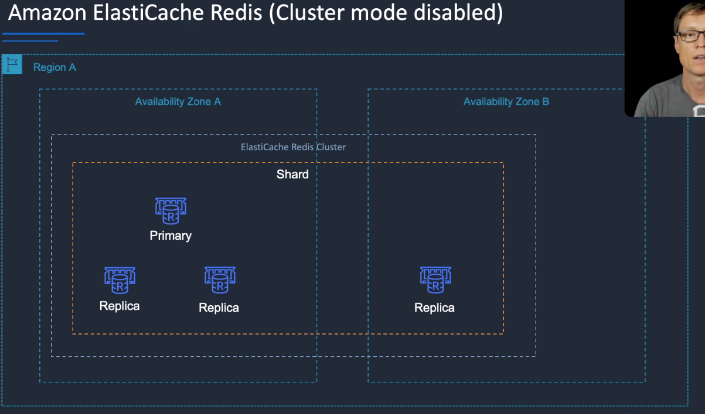
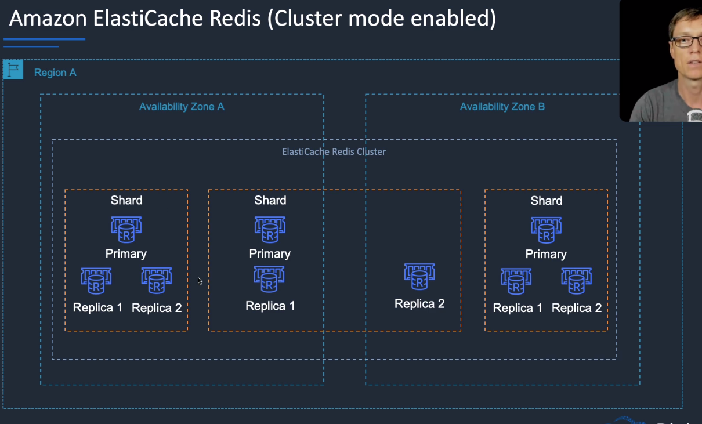

# Amazon ElastiCache

## General Info

Web service that makes it easy to deploy, operate and scale in-memory cache (key value store) in the cloud.
=> improve performance of application when retrieving info from cache memory instead of slower disk based DB.
**great for read heavy application workloads (throughput and latency) or compute intensive workloads (recommendation engine)**

ElastiCache allows for managing web sessions and also caching dynamically generated data.

ElastiCache EC2 nodes cannot be accessed from the Internet, nor can they be accessed by EC2 instances in other VPCs.

Best for scenarios where the DB load is based on Online Analytics Processing (OLAP) transactions. 
Cached information may include the results of I/O-intensive database queries or the results of computationally intensive calculations.

Each node runs an instance of the Memcached or Redis protocol-compliant service and has its own DNS name and port.

Access to ElastiCache nodes is controlled by VPC security groups and subnet groups (when deployed in a VPC).

You cannot move an existing Amazon ElastiCache Cluster from outside VPC into a VPC.

Subnet groups are a collection of subnets designated for your Amazon ElastiCache Cluster. 
You need to configure subnet groups for ElastiCache for the VPC that hosts the EC2 instances and the ElastiCache cluster.

When not using a VPC, Amazon ElastiCache allows you to control access to your clusters through Cache Security Groups (you need to link the corresponding EC2 Security Groups).

ElastiCache nodes are deployed in clusters and can span more than one subnet of the same subnet group.

Applications connect to ElastiCache clusters using endpoints.

* Memcached – simplest model, can run large nodes with multiple cores/threads, can be scaled in and out, can cache objects such as DBs.
* Redis – complex model, supports encryption, master / slave replication, cross AZ (HA), automatic failover and backup/restore.

## Engines
Two engines: 
* Memcached (multithreaded, **does not support multi A-Z**), no multi AZ failover, replication, each node has a partition of the data
* Redis (not multithreaded, support data structures such as sorted sets and lists, **supports master/slave replication and multi-AZ** which can be used to achieve cross AZ redundancy)

Redis has cluster mode that can be enabled/disabled

Generally, the application needs to be built to work with either Redis or Memcached. Popular options like MySQL have Memcached plugins which allow an application to easily work with ElastiCache (if using Memcached as the engine)

If caching more and more slow with memcached, the parameter that should be adjusted (if overhead pool is less than 50MB): Memcached\_Connections\_Overhead

For memcached, if lots of Evictions or Get Misses -> increase number of nodes or increase the size of the nodes in the cluster

Elasticache for Redis can fulfill several roles like: 
* Pub/Sub operations
* Sorted Sets
* Scales by adding shards, not nodes.
* Supports master / slave replication and multi-AZ for cross-AZ redundancy.
* A Redis shard is a subset of the cluster’s keyspace, that can include a primary node and zero or more read replicas.
* Supports automatic failover and backup/restore.
* In Memory DataStore (but **NOT** relational data store as it is only a key value store) 

## Architecture

**caching improves app performance by storing data in memory for low latency access, cached info may include the result of I/O-intensive DB queries or the results of computationally-intensive calculations**

**Elasticache is a good choice if DB is particularly read-heavy and not prone to frequent changing**

elasticache is good choice if database is particulary read-heavy and not prone to frequent changing

Redshift can also be used if we have lots of online analytic processing (OLAP) transactions

## Core knowledge

### Use Cases
* data is relatively static and frequently accessed
* data is slow and expensive to get compared to cache retrieval
* requires push button scalability for memory, writes and reads
* often used for storing session state like DynamoDB
* high number of reads and low number of DB writes
* interesting data requires a slow and expensive query to acquire it -> caching
* it doesn't make sense to cache webpages that return the results of a search because such queries and results are almost always unique
* cache is stale data, if this is not a problem for the application the info can be cached. If the app requires up-to-date info at all time, not a good idea to cache

Exam tip: the key use cases for ElastiCache are offloading reads from a database and storing the results of computations and session state. Also, remember that ElastiCache is an in-memory database and it’s a managed service (so you can’t run it on EC2).

## Metrics & monitoring
Important metrics to monitor with CloudWatch:

- CPUUtilization: host level metric (percentage)
  - (Memcached) 90% need to scale,
  - (Redis) divide 90 by the number of cores. Example for redis, if instance has 4 cores, the thresholds for CPU Utilization would be 90/4 -> 22.5%
- SwapUsage: host level metric (bytes).
  - (Memcached) Should not exceed 50MB! (increase memcached_connections_overhead parameter which defines the amount of memory to be reserved for memcached connections and other overheads). **Size of swap file = size of RAM**
  - (Redis) No SwapUsage metric, instead needed to use reserved-memory
- Evictions: cache engine metric, need to create custom alarm based on needs.
  - (Memecahed) either scale up (increase memory of existing nodes) or scale out (add more nodes)
  - (Redis) only scale out
- CurrConnections: 
  - cache engine metric, **required** to create custom alarm based on needs
  - **If large and sustained spike in the number of concurrent connections, it is either a large traffic spike or app is not releasing connections as it should be**
  
Memcached shouldn't go over 90% CPU Utilization -> add more nodes

Redis shouldn't go over 90 / number cores for the CPU -> add more replicas

## Security
* CloudTrail enabled
* identity-based policies
* Redis Auth to require a token with ElastiCache redis

## High availability
Memcached:

* Because Memcached does not support replication, a node failure will result in data loss. 
* Use multiple nodes to minimize data loss on node failure. 
* Launch multiple nodes across available AZs to minimize data loss on AZ failure.

Redis:

* Use multiple nodes in each shard and distribute the nodes across multiple AZs. 
* Enable Multi-AZ on the replication group to permit automatic failover if the primary nodes fail. 
* Schedule regular backups of your Redis cluster.

## Scaling
### Memcached
* add nodes (partition of data) to a cluster
* scale vertically (node type) - must create a new cluster manually

**Since memcached node have a partition of the data and not a replication, we need to pay attention to the cost/time it would take to get that data again if a node fails.**

### Redis
A shard has a primary and 0-5 replicas.

Cluster mode disabled:
* add replica or change node type - creates a new cluster and migrates data

Cluster mode enabled:
* online resharding to add or remove shards, vertical scaling to change node type
* offline resharding to add or remove shards, change node type or upgrade engine (more flexible than online)

## Caching Strategies

**Lazy Loading**:

* Loads the data into the cache only when necessary (if a cache miss occurs). 
* Lazy loading avoids filling up the cache with data that won’t be requested. 
* If requested data is in the cache, ElastiCache returns the data to the application. 
* If the data is not in the cache or has expired, ElastiCache returns a null. 
* The application then fetches the data from the database and writes the data received into the cache so that it is available for next time. 
* Data in the cache can become stale if Lazy Loading is implemented without other strategies (such as TTL).

**Write Through**:

* when using a write through strategy, the cache is updated whenever a new write or update is made to the underlying database
* allows cache data to remain up-to-date
* can add wait time to write operations in the application
* without a TTL can result in a lot of cached data that is never read and can be as big as the database

Exam tip: Compared to DynamoDB Accelerator (DAX) remember that DAX is optimized for DymamoDB specifically and only supports the write-through caching strategy (does not use lazy loading).

**Adding Time To Live (TTL)** - can be added to both strategy:

* The drawbacks of lazy loading and write through techniques can be mitigated by a TTL. 
* The TTL specifies the number of seconds until the key (data) expires to avoid keeping stale data in the cache. 
* When reading an expired key, the application checks the value in the underlying database. 
* Lazy Loading treats an expired key as a cache miss and causes the application to retrieve the data from the database and subsequently write the data into the cache with a new TTL. 
* Depending on the frequency with which data changes this strategy may not eliminate stale data – but helps to avoid it.

