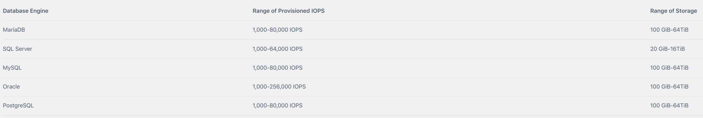
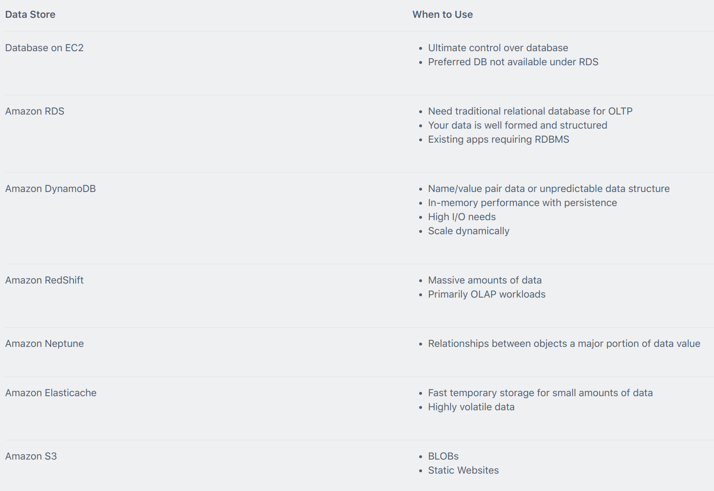
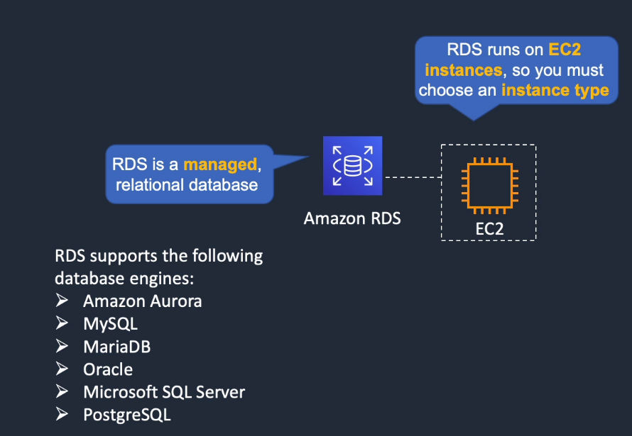
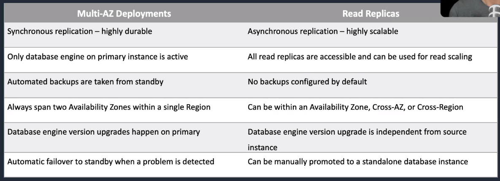
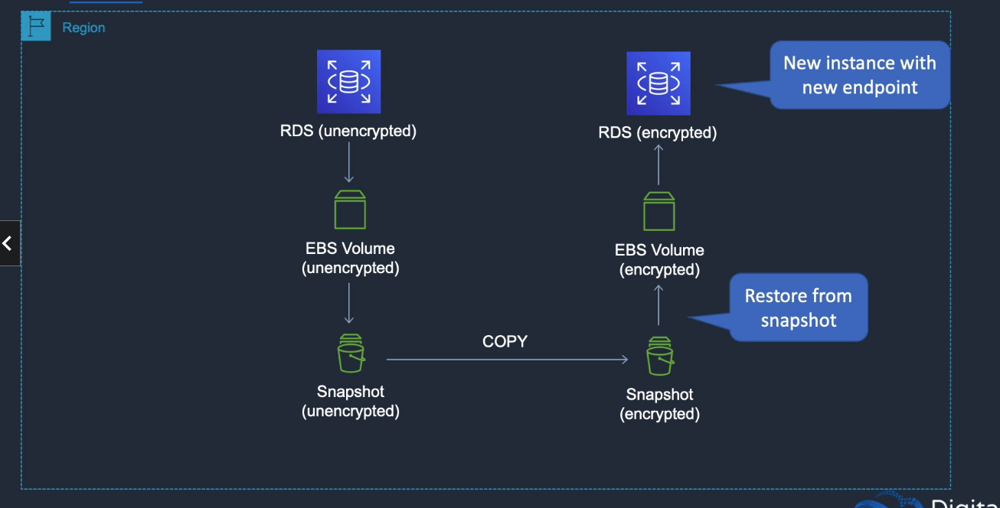
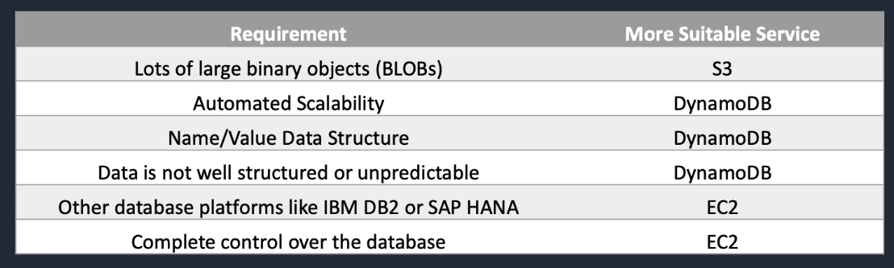
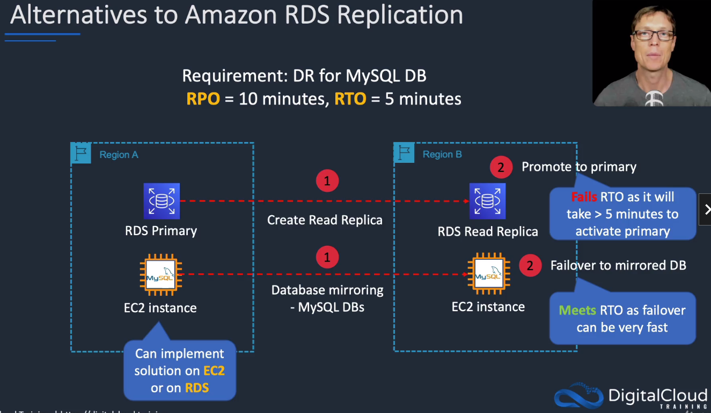

# Amazon RDS

## General Info

* Service to create, operate and scale databases. 
* DBs are fast (CPU, RAM)
* cost-efficient
* capacity is resizable.
* can also be highly available if we need
* minimal administration required for us
* managed relational database that runs on EC2 instances so we must choose an instance type
* we can lower costs with reserved instances! => always the most cost effective solution

**read replica (performance) =/= multi AZ (disaster recovery)**

We can retrieve the RDS version in AWS console or AWS CLI with "aws rds describe-db-instances --region"

We can have **reserved instances** with RDS! (significant discount). Logic since the managed RDS instance lives in our VPC in an instance type we chose.

RDS multi AZ is great to improve performance from on-prem DB.

If performance issue, check cloudwatch for
* read/write response times
* CPU utilization
* available memory
* free storage on the instance
* read/write IO on disk => need to use provisioned IOPS for DB instances
  * need to be sure that we have enough credits for the DB needs

* Automatic failover for Multi-AZ option.
* Read replicas option for read heavy workloads.

Windows integrated authentication for SQL only works with domains created using the AWS directory service – need to establish a trust with an on-premises AD directory.

Scalability
* can only scale RDS up (compute, storage)
* cannot decrease storage
* can scale storage on all DB engines except MS SQL
  * need to create a new instance from a snapshot for MS SQL
* scaling may have performance degradation (storage) and downtime (compute)
  * done during the maintenance window
* max DB size 64TiB for all except MS SQL (16TiB)

## On demand, reserved instance
On-demand and reserved instance pricing available.

Reserved instances are defined based on the following attributes which must not be changed:
* DB engine. 
* DB instance class. 
* Deployment type (standalone, multi-AZ). 
* License model. 
* Region.

Reserved instances:
* Can be moved between AZs in the same region. 
* Are available for multi-AZ deployments. 
* Can be applied to Read Replicas if DB instance class and region are the same. 
* Scaling is achieved through changing the instance class for compute and modifying storage capacity for additional storage allocation.

## Performance
* EBS volumes: General purpose, Provisioned IOPS, Magnetic (not recommended)

## Use case, alternatives and anti patterns

## Engines
* MySQL
* MariaDB
* Microsoft SQL Server
* PostgreSQL
* Oracle
* Amazon Aurora

RDS (Relational Database Service) can be used with
* general purpose SSD storage (3 IOPS per GB) with the ability to burst up to 3k IOPS
* provisioned IOPS SSD storage (fast, predictable, consistent IOPS). We can specify our IOPS at creation => maintained for the life of that instance. It is optimized for I/O intensive, transactional, database workloads. IOPS available varies by engine.

Oracle and MS SQL Server are limited to 1 DB per instance (licensing) -> the other engines do not have that limit

## Scaling and deployment
* scale DB tier that is read heavy -> use read replicas or shard data set
* (Scalability) Increase instance size (eg. from small to medium)
* (Elasticity) Not very elastic, can't scale RDS based on demand

### Scaling types
* Vertically scaled: more compute power added to the instance, not more hosts by changing the instance type
* Horizontally scaled: add read replicas (master/slave hierarchy) -> for high read 
* sharding: method of horizontal scaling (split DB into multiple DB)
  * only works if we can split our tables that aren't joined by queries
  * We can do that by creating a read replicas that we promote to master once it is provisioned, we then delete the tables how we want.

We can also scale database **storage** from 5GB to 6TB General Purpose (SSD) storage => **can be scaled live** but it can take a long time and slow down the instance

Microsoft SQL will **NOT** let us scale the storage => need to create a new database and migrate all the data if we need to increase the disk space.

### Read replicas
* Read replicas' are used to scale, **NOT** for automatic failovers 
* Can have up to 5 read replicas for MySQL, PostgreSQL and MariaDB 
* Can have read replicas in different regions for all engines 
* Replication is asynchronous only, not synchronous 
* Read replica's can be built off Multi AZ databases 
* Read replica's themselves can also be multi AZ 
* Can have read replica of read replica but beware of latency 
* key metric to look for monitoring is replica lag 
* Read replicas can be promoted to masters
* use built-in replication functionality of DB engine

**read only copies of the database, asynchronous update using DB native engine, can create multiple read replicas for a given source DB instance (up to 5 for MySQL, PostgreSQL and MariaDB) and distribute app's read traffic amongst them**

When to use:
- scaling beyond compute or I/O capacity of a single DB instance for read-heavy DB workloads. The excess read traffic can be directed to one or more read replicas
- serving read traffic while the source DB instance is unavailable. If source DB instance cannot take I/O requests (due to I/O suspension for backups or scheduled maintenance), we can direct read traffic to read replica(s)
- business reporting or data warehousing scenarios -> run queries against read replicas instead of production DB instance (can also use Amazon RedShift)

Amazon uses native asynchronous replication to update read replica
- MySQL
- PostgreSQL
- MariaDB

For Aurora
* SSD-backed virtualized storage layer purpose-built for DB workloads
* share the same underlying storage as the source instance, lowering costs and avoiding the need to copy data to the replica nodes

**API call: CreateDBInstanceReadReplica**
* When creating a new Read Replica, AWS will take a snapshot of the DB.
* **If multi a-z is not enabled, snapshot will be done on primary DB which can cause brief I/O suspension for around 1 minute else the secondary will be used.**
* The read replica will be reachable using a new end point DNS address once created.

Important information:
- A read replica can be promoted to its own standalone database => which breaks the replication link
- Read replica can be in different region for all engines, not necessarily another A-Z**
- Read replicas are only asynchronous
- Read replicas themselves can now be Multi A-Z
- DB snapshots and automated backups cannot be taken of read replicas because it is asynchronous and we might miss information (not the case for Multi A-Z failover since it is synchronous)
- Key metric to look for is REPLICA LAG
- Read replicas (performance) =/= Multi A-Z (highly available)

### Disaster Recovery (DR) with Multi-AZ fail-over

RDS multi-AZ failover is **NOT** a scaling solution but a disaster recovery solution (a primary DB is active, data is synchronously copied to standby DB). Synchronous replication.

Amazon handles the DNS (CNAMES) for the RDS instance in case of failover, takes around 1 minute

Multi AZ keeps a copy of the database in a separate Availability Zone in case of a failure or disaster. AWS manage the failure from one AZ to another automatically.

url: instance\_name.random\_alpha\_numerics.region.rds.amazonaws.com
In case of a problem, the DNS will be switched automatically to another AZ that works.

**This is used for disaster recovery only, not for improving performance (scalability). For performance improvement, need to use read replicas**.

When we write on the DB, the standby DB is synchronized as well. Automatic failover in case of maintenance or other problems (DB, AZ failure) without administrative intervention.
The system is down for around 1 minute before the failover is working.

MySQL, Oracle & PostgreSQL engines use synchronous physical replication 
SQL server engine uses synchronous logical replication using SQL server native Mirroring technology
=> both approaches safeguard the data in the event of a DB instance failure or loss of an Availability Zone

This makes the database highly available. **The backups and restores are taken from the secondary to avoid I/O suspension on the primary**

**We can force failover by rebooting the instance or using RebootDBInstance API call**

**we don't have to setup multi A-Z at creation time, we can add it later**

RDS HA and failover support for DB instances using Multi AZ deployments: Oracle, PostgreSQL, MySQL and MariaDB
SQL Server DB instances use SQL Server Mirroring

To prevent impacts on the RDS instance (if we have only one) during backup, we can create multi-AZ RDS and migrate our DB to it. 
When backups are taken, they will be taken from the secondary, not the primary.

### Multi AZ vs read replicas

With multi AZ, it is really 2 AZ, cannot be in 2 regions.

Important note: since we can manually promote a standalone database instance (read replicas) to master in another region, this can help with disaster recovery. 
With multi AZ, it is only in another AZ.

Multi AZ is for DR scenario

A failover may be triggered in the following circumstances:
* Loss of primary AZ or primary DB instance failure. 
* Loss of network connectivity on primary. 
* Compute (EC2) unit failure on primary. 
* Storage (EBS) unit failure on primary. 
* The primary DB instance is changed. 
* Patching of the OS on the primary DB instance. 
* Manual failover (reboot with failover selected on primary).

Recommended to use the endpoint rather than the IP address to point applications to the RDS DB and implement DB connection retries in the application

The secondary DB in a multi-AZ configuration cannot be used as an independent read node (read or write).

In multi-AZ configurations snapshots and automated backups are performed on the standby to avoid I/O suspension on the primary instance.

Combining Read Replicas with Multi-AZ enables you to build a resilient disaster recovery strategy and simplify your database engine upgrade process.

A Read Replica in a different region than the source database can be used as a standby database and promoted to become the new production database in case of a regional disruption.
This allows you to scale reads whilst also having multi-AZ for DR.

In multi-AZ deployments version upgrades will be conducted on both the primary and standby at the same time causing an outage of both DB instance.

Ensure security groups and NACLs will allow your application servers to communicate with both the primary and standby instances.

Read replicas are for workload sharing and offloading. Read replicas provide read-only DR.

You can have read replicas of read replicas for MySQL and MariaDB but not for PostgreSQL.

You can promote a read replica to primary.

Read replicas can be in another region (uses asynchronous replication).

## Maintenance, backup, and recovery
RDS provides:
* provision infrastructure
* install DB software
* automatic backup
* automatic patching
* synchronous data replication (Multi A-Z fail-over)
* automatic fail-over (Multi A-Z fail-over)

We are responsible for
* DB settings
* schema
* performance tuning

You can take snapshots of PostgreSQL read replicas but cannot enable automated backups.

You can enable automatic backups on MySQL and MariaDB read replicas.

DB Snapshots are user-initiated and enable you to back up your DB instance in a known state as frequently as you wish, and then restore to that specific state.

Cannot be used for point-in-time recovery.

Restored DBs will always be a new RDS instance with a new DNS endpoint.

Snapshots can be shared with other AWS accounts.

### Notifications
**RDS uses Amazon Simple Notification Service to provide a notification when an RDS event occurs. 
Can have an event notification on a DB security group change for instance (configuration change), can also have backup notification, ...**

**Category of events**: DB instance, DB snapshot, DB security group, DB parameter group

Notification can be enabled or not using the radio button "Enabled" in the console. 
Event notifications are sent to the addresses we provided when we created the subscription, can have many different subscriptions

You can use the following automated monitoring tools to watch Amazon RDS and report when something is wrong:

* Amazon RDS Events – Subscribe to Amazon RDS events to be notified when changes occur with a DB instance, DB snapshot, DB parameter group, or DB security group.
* Database log files – View, download, or watch database log files using the Amazon RDS console or Amazon RDS API operations. You can also query some database log files that are loaded into database tables. 
* Amazon RDS Enhanced Monitoring — Look at metrics in real time for the operating system. 
* Amazon RDS Performance Insights — Assess the load on your database and determine when and where to act. 
* Amazon RDS Recommendations — Look at automated recommendations for database resources, such as DB instances, read replicas, and DB parameter groups. 

In addition, Amazon RDS integrates with Amazon CloudWatch, Amazon EventBridge, and AWS CloudTrail for additional monitoring capabilities:
* Amazon CloudWatch Metrics – Amazon RDS automatically sends metrics to CloudWatch every minute for each active database. You don’t get additional charges for Amazon RDS metrics in CloudWatch. 
* Amazon CloudWatch Alarms – You can watch a single Amazon RDS metric over a specific time period. You can then perform one or more actions based on the value of the metric relative to a threshold that you set. 
* Amazon CloudWatch Logs – Most DB engines enable you to monitor, store, and access your database log files in CloudWatch Logs. 
* Amazon CloudWatch Events and Amazon EventBridge – You can automate AWS services and respond to system events such as application availability issues or resource changes. Events from AWS services are delivered to CloudWatch Events and EventBridge nearly in real time. You can write simple rules to indicate which events interest you and what automated actions to take when an event matches a rule 
* AWS CloudTrail – You can view a record of actions taken by a user, role, or an AWS service in Amazon RDS. CloudTrail captures all API calls for Amazon RDS as events. These captures include calls from the Amazon RDS console and from code calls to the Amazon RDS API operations. If you create a trail, you can enable continuous delivery of CloudTrail events to an Amazon S3 bucket, including events for Amazon RDS. If you don’t configure a trail, you can still view the most recent events in the CloudTrail console in Event history.

### Maintenance
During maintenance, some actions can require the DB to be offline:
- scale compute operations
- OS patching
- DB patching

Maintenance that require a resource to be offline:
- scale compute operations (a few minutes)
- required OS or DB patching

Default is a weekly maintenance window but we can change that.

### Backups and snapshots
* Reliably restore DB within 5 minutes -> RDS automatic backup (turned on by default). Amazon will backup DB and transaction logs and store both for a user specified retention period.
* Auto backup = point in time backup (daily) + transaction logs
* Retention period of backup = 1 day default but can be up to 35 days
* If user does not provide maintenance window -> AWS select the default maintenance window

Categories and events for the DB Snapshot Source Type:
- Creation
- Deletion
- Notification
- Restoration

We can restore a snapshot which creates a new database instance. Restore can be any point in time during the retention period.

We can also do manual backups (snapshot)
* backs up entire DB instance, not just individual databases
* for single AZ DB instances, there is a brief suspension of I/O
* for multi-AZ SQL server, I/O activity is briefly suspended on primary
* for multi-AZ MariaDB, MySQL, Oracle and PostgreSQL, the snapshot is taken from the standby
* snapshots do NOT expire (no retention period) contrary to the automatic ones

## RDS Security
* can be run in private VPCs
* can specify security groups for the database but also for the EC2 instances
* can offer encryption with SSL/TLS
* can offer encryption for data at rest (AES256) => only at creation time, cannot change that after that
  * DB volume
  * DB snapshot
  * backups
  * read replicas
  * minimal impact on performance
* RDS for Oracle and SQL Server is also supported using Transparent Data Encryption (TDE) (may have performance impact)
* can use AWS KMS to manage encryption keys

**We cannot have an encrypted read replica of an unencrypted DB instance or vice versa** => primary and read replicas have the same encryption settings

Since KMS keys are located in a region, if a read replica is in another region then another KMS key in that region is used.

We cannot restore an unencrypted backup or snapshot to an encrypted DB instance.

If we want to encrypt a database that is currently unencrypted, we need to use EBS volume snapshot and copy.

Cannot unencrypt an encrypted database. Cannot create unencrypted snapshots of encrypted DB instances. Cannot create unencrypted read replicas of an encrypted DB instance

=> the only way to unencrypt an encrypted DB is to export the data and import the data into another DB instance.

Encryption consistency -> unencrypted/unencrypted or encrypted/encrypted (if different region, need different KMS key since they are only in a region)

only support Identity-based policies, not resource based policies

With MySQL and PostgreSQL, we can use IAM DB authentication -> token

## Patterns
### Scenarios
* relational DB running on MySQL must be migrated to AWS and must be highly available: use RDS MySQL and configure Multi-AZ standby node for HA
* RDS DB has high query traffic that is causing performance degradation: create read replicas and configure app to use these endpoints for reads
* RDS DB is approaching its storage capacity limits and/or is suffering from high write latency: scale up the DB instance to an instance type that has more storage/CPU
* RDS DB is unencrypted and a cross region read replica must be created with encryption: use EBS volume backup, copy+encrypt, restore
* Aurora DB deployed and requires a cross region replica: deploy Aurora MySQL replica in the second region
* Aurora DB deployed and requires a read replica in the same Region with minimal sync latency: deploy aurora replica in the region in a different AZ
* Aurora deployed and app in another region requires read-only access with low latency - sync latency must also be minimized: use Aurora Global Database and configure app in the second region to use the reader endpoint
* App and DB migrated to Aurora and requires the ability to write to the DB across multiple nodes: use aurora multi master for an in region multi master database
* application requires a session state data store that provides low latency: dynamodb or elasticache
* multi-threaded in memory database for unstructured data: elasticache memcached
* in-memory datastore required that offers microsecond performance for unstructured data: DynamoDB DAX
* in-memory datastore required that supports data persistence and high availability: elasticache Redis
* serverless database required that supports NoSQL key value store workload: DynamoDB
* serverless database required that supports MySQL and PostgreSQL: Aurora serverless
* relational DB required for a workload with an unknown usage pattern (low and ariable): Aurora sererless
* application requires key-alue database that can be written to from multiple AWS regions: DynamoDB global tables

### Anti Patterns and alternatives
* if engine is not available in RDS
* if we need root access to the OS to install management tools
* if we want full control and ultimate flexibility, manage everything etc -> EC2

If we need to scale read, RDS is fine up to a point with Aurora. If we need to scale write, we need DynamoDB.

## DB Subnet groups
* A DB subnet group is a collection of subnets (typically private) that you create in a VPC and that you then designate for your DB instances. 
* Each DB subnet group should have subnets in at least two Availability Zones in a given region. 
* It is recommended to configure a subnet group with subnets in each AZ (even for standalone instances). 
* During the creation of an RDS instance you can select the DB subnet group and the AZ within the group to place the RDS DB instance in. 
* You cannot pick the IP within the subnet that is allocated.

## Logging
MySQL has error log by default, slow query and general logs must be enabled in the parameters. No transaction logs available for the user.
Can access MySQL logs by directing the logs to a DB table in the main database and query that table

## Resources

Documentation: https://docs.aws.amazon.com/AmazonRDS/latest/UserGuide/Welcome.html

API: https://docs.aws.amazon.com/AmazonRDS/latest/APIReference/Welcome.html

CLI: https://docs.aws.amazon.com/cli/latest/reference/rds/index.html
