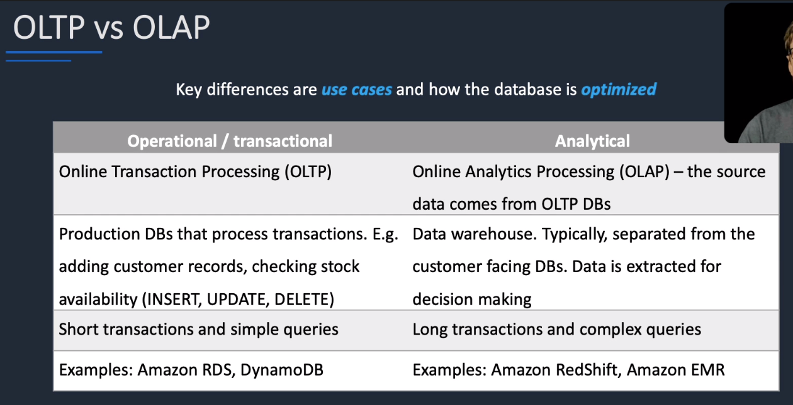
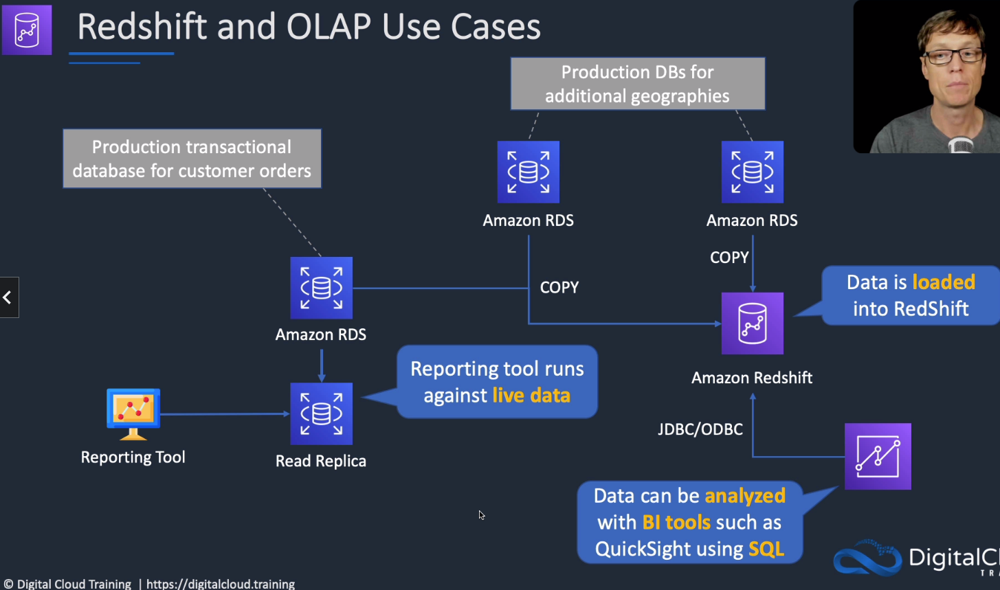
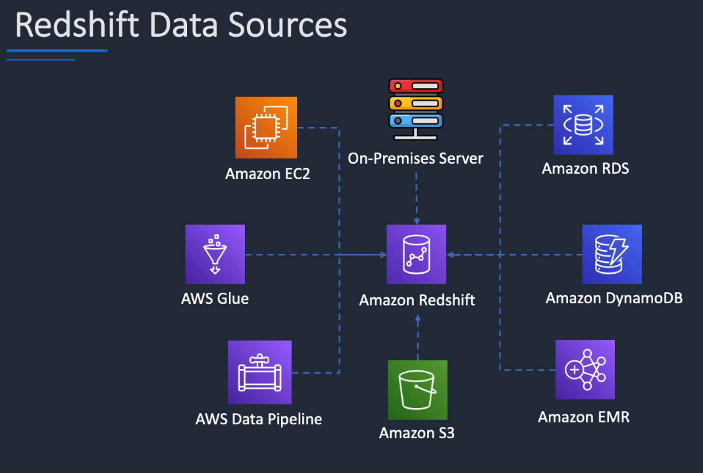

# Amazon Redshift

## General Info

fast, fully managed, petabyte-scale data warehouse service

fastest query performance for entreprise reporting and business intelligence workloads, particularly those involving 
extremely complex SQL with multiple joins and sub queries

Generally used for big-data analytics, it can integrate with most popular business intelligence tools:

* Jaspersoft
* Microstrategy
* Pentaho
* Tableau
* Business Objects
* Cognos

RedShift can store huge amounts of data but cannot ingest huge amounts of data in real time.

RedShift automatically selects the compression scheme.

RedShift uses EC2 instances so you need to choose your instance type/size for scaling compute vertically, but you can also scale horizontally by adding more nodes to the cluster.

Leader node:
* Manages client connections and receives queries. 
* Simple SQL endpoint. 
* Stores metadata. 
* Optimizes query plan. 
* Coordinates query execution.

Compute nodes:
* Stores data and performs queries and computations. 
* Local columnar storage. 
* Parallel/distributed execution of all queries, loads, backups, restores, resizes. 
* Up to 128 compute nodes.

Amazon RedShift Spectrum is a feature of Amazon Redshift that enables you to run queries against exabytes of unstructured data in Amazon S3, with no loading or ETL required.

Only available in one AZ but can restore snapshots in another AZ

Can run a cluster in multiple AZ, we need to load data from S3 to the two different cluster -> no sync in between

Always 3 copies of the data: original, replica on compute nodes, backup copy on S3

RedShift provides fault tolerance for the following failures:
* Disk failures. 
* Node failures. 
* Network failures. 
* AZ/region level disasters.

For nodes failures the data warehouse cluster will be unavailable for queries and updates until a replacement node is provisioned and added to the DB.

Can load encrypted data from S3, supports SSL between clients and redshift, VPC for network isolation, encryption data at rest (AES 256), cloudtrail integration, CloudHSM/KMS

High availability for RedShift:
* Currently, RedShift does not support Multi-AZ deployments. 
* The best HA option is to use multi-node cluster which supports data replication and node recovery. 
* A single node RedShift cluster does not support data replication and you’ll have to restore from a snapshot on S3 if a drive fails.

Copy data to Redshift from database if we run online analytical processing (OLAP) transactions on it => move stress from primary DB

replicates all data within data warehouse cluster when loaded and continuously backed up to S3
try to maintain at least 3 copies of the data (original and replica in compute nodes and a backup in S3)
can asynchronously replicate snapshots to S3 in another region for disaster recovery supported by Amazon RDS varies by DB engine

RedShift is different than RDS because it is the only one that is optimized for analytics.

RedShift is a datawarehouse, is usually very large and hold data from various systems for reporting. Petabyte-scale data warehousing service (OLAP)

Fully managed and scalable.

Features:

* snapshots
* encryption (data at REST, in transit and snapshots)
* SQL (PostgreSQL compatible because forked)
* Low Cost (~$1k per TB per year)

Massive Parallel Processing power (MPP). Integrated with business intelligence tools such as Tableau, Jaspersoft, Amazon QuickSight (pay as you go, cheap per user per month, can query from RedShift, DynamoDB, RDS, ...)

During the loading of the data in RedShift, we often have ETL. The data should be batch loaded to RedShift.

RedShift is a column based storage so it is efficient to retrieve data since they are stored together (we don't scan per rows).

A RedShift datawarehouse has a leader node and some compute nodes (1.6PB data max per node). We connect to the leader node using a business tools (QuickSight). Leader talks to compute nodes and compute nodes talk to each other as well.

**=> RedShift is optimized for analytics, other systems feed it, run reports from RedShift instead of running complicated reports on transactional DB, scalable (we can add more nodes if we need to)** 

Reporting tool (must support JDBC/ODBC connectors) shouldn't hit the main database (performance issue) so migrate data to OLAP DB (or query the read replica) for querying without impacting the prod DB.

If we need live data, we should use a read replica. If we are fine with a some outdated data -> redshift is fine. 

## RedShift spectrum
* query unstructured data stored in S3 using SQL (similar than Athena)
* query exabytes of data in a few minutes
* the query is executed on Redshift + S3

=> move infrequently accessed data to S3 and use spectrum to allow them to still be queried from Redshift.
EMR and Glue based ETL jobs are not practical as the job needs to be invoked every time data needs to be queried in Redshift. Once the query is done, data needs to be
deleted again to save costs.

## Difference between data lake and data warehouse
Data warehouse: only structured data 

Data lake: can contain structured, semi-structured and unstructured data

## Move data
* **move data from Redshift** to another service through S3
use command `UNLOAD` - Unloads the result of a query to one or more text files on Amazon S3.

* move data from X **to Redshift** using S3
`COPY` - Loads data into a table from data files or from an Amazon DynamoDB table. 
The files can be located in an Amazon Simple Storage Service (Amazon S3) bucket, an Amazon EMR cluster, 
or a remote host accessed using a secure shell (SSH) connection.

There is no such thing as a LOAD command for Redshift. COPY is much faster than insert. 

=> move data with the least amount of time and no infra management: use AWS Glue ETL job and AWS Data pipeline. EMR cluster needs to be provisioned and managed, Lambda is not 
meant to handle ETL workloads.

## Use cases
* perform complex queries on massive collections of structured and semi structured data and get fast performance
* frequently accessed data that needs a consistent, highly structured format
* use Spectrum for direct access of S3 objects in a data lake
* managed data warehouse solution
  * automated provisioning, configuration and patching
  * data durability with continuous backup to S3
  * scales with simple API calls
  * exabyte scale query capability
