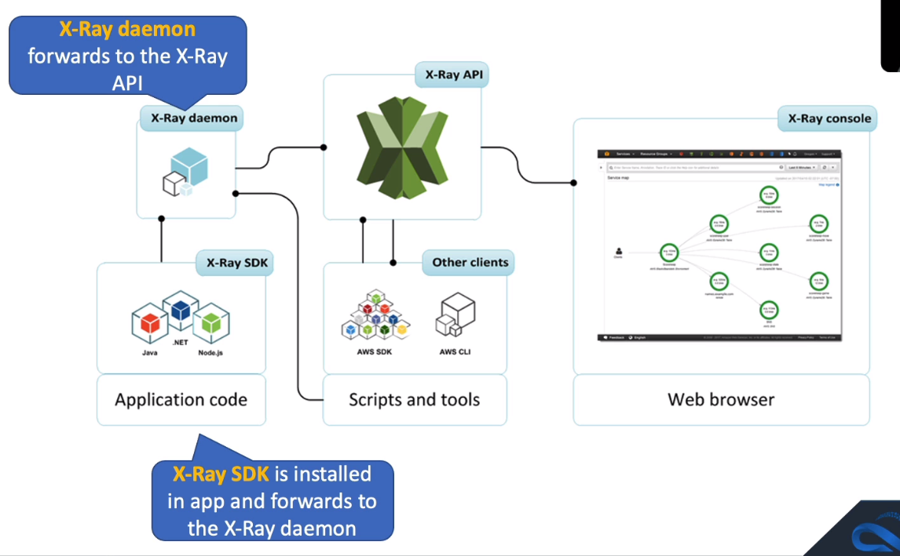

# AWS X-Ray

## General Info

AWS X-Ray helps developers analyze and debug production, distributed applications, such as those built using a microservices architecture.

With X-Ray, you can understand how your application and its underlying services are performing to identify and troubleshoot the root cause of performance issues and errors.

X-Ray provides an end-to-end view of requests as they travel through your application and shows a map of your application’s underlying components.

X-Ray collects data and makes it available to view, filter and sort. Can use the data to gain insights and identify potential optimizations to make inside our application

It uses a correlation ID (unique ID attached to all requests and messages related to a specific event chain). The trace ID is added to the HTTP requests in specific tracing headers name *X-Amzn-Trace-Id*.
Any micro service can read, add, update this header.

=> helps us analyze and debug production, distributed applications

X-Ray works with:

* EC2
* ECS
* Lambda
* Beanstalk

Supported languages:

* Java
* Node.js
* .NET

Code must be aware of the X-Ray SDK -> not an easy enable

There is a daemon to have (EC2, Lambda, Beanstalk, ...) -> it assumes a role, can be used for cross account logging

With EKS, we can have the daemon in a docker (ensure port mappings, network settings and IAM task roles are defined)

Maximum size of a trace is 500KB and is retained for 30 days from the the time it is recorded at no additional cost. First 100k trace records each month are free, first milion traces retrieved or scanned each months are free. After that, \$5 per million traces recorded, \$0.5 per million traces retrieved.

Application must be configured to work with X-Ray.

X-Ray can replace ElasticSearch, Kibana, Spring Cloud Sleuth.

**=> end to end view of requests**

* analyze and debug production, distributed applications such as those built using a microservices architecture
* AWS X-Ray supports applications running on:
  * EC2
  * ECS
  * Lambda
  * Beanstalk
  * EKS via a Docker Xray agent in the pods
* X-Ray SDK must be integrated with application along with X-Ray agent
  * SDK provides
    * interceptors to add our code to trace incoming HTTP requests
    * client handlers to instrument AWS SDK client that our application uses to call other AWS services
    * an HTTP client to use to instrument calls to other internal and external HTTP web services
* X-Ray SDK -> X-Ray daemon -> X-Ray API -> X-RAy console
* can also have other clients via AWS SDK and CLI

Get metadata for DB (MySQL, PostgreSQL), DynamoDB, Aurora, SQS, SNS

The X-Ray SDK is installed in your application and forwards to the X-Ray daemon which forwards to the X-Ray API.

The X-Ray SDK provides:

* Interceptors to add your code to trace incoming HTTP requests.
* Client handlers to instrument AWS SDK client that your application uses to call other AWS services.
* An HTTP client to use to instrument calls to other internal and external HTTP web services.

## Concepts

**Segments**: 
* data about the work done by the application (can include data on: the request, the response, subsegments and issues)
* An X-Ray segment encapsulates all the data points for a single component (for example, authorization service) of the distributed application. 
* Segments include system-defined and user-defined data in the form of annotations and are composed of one or more sub-segments that represent remote calls made from the service.

**Subsegments**: 
* more granular view of data inside of segments
* Subsegments provide more granular timing information and details about downstream calls that your application made to fulfill the original request. 
* A subsegment can contain additional details about a call to an AWS service, an external HTTP API, or an SQL database. 
* You can even define arbitrary subsegments to instrument specific functions or lines of code in your application. 
* For services that don’t send their own segments, like Amazon DynamoDB, X-Ray uses subsegments to generate inferred segments and downstream nodes on the service map. 
* This lets you see all your downstream dependencies, even if they don’t support tracing, or are external.

**Service Graph**: 
* JSON document that contains information about how the application's services and resources interact (this can create a visualized service map)

**Traces**: 
* trace IDs track requests as they go through the applications
* first X-Ray supported service to interact with a request adds an HTTP trace ID header
* the trace ID header propagates downstream to track the request as it moves through the system
* An X-Ray trace is a set of data points that share the same trace ID.

**Sampling**: 
* X-Ray applies an algorithm to sample request data but we can configure the frequency of sampling (reduce it on high-volume and lower-volume requests) => this is not done on every requests to prevent overloading the app
* To provide a performant and cost-effective experience, X-Ray does not collect data for every request that is sent to an application. 
* Instead, it collects data for a statistically significant number of requests. 
* **X-Ray should not be used as an audit or compliance tool because it does not guarantee data completeness.**

**Tracing header**: 
* X-Amzn-Trace-Id: Root={long string of random alphanumeric};Parent={string of random alphanumeric};Sampled=1

**Filter expressions**: 
* used in X-Ray console to search through the traces by different characteristics (specific trace IDs, partial URL paths, annotations)

**Annotation and metadata**: 
* additional way to store searchable (annotations) and non-searchable (metadata) data about traces
* An X-Ray annotation is system-defined, or user-defined data associated with a segment. 
* System-defined annotations include data added to the segment by AWS services, whereas user-defined annotations are metadata added to a segment by a developer. 
* A segment can contain multiple annotations. 
* These are key / value pairs used to index traces and use with filters. 
* Use annotations to record information on segments or subsegments that you want indexed for search.

Exam tip: Remember that annotations can be used for adding system or user-defined data to segments and subsegments that you want to index for search. Metadata is not indexed and cannot be used for searching.

**Errors, Faults, Exceptions**: 
* X-Ray tracks application errors (stack trace, ...) and categorizes them as:
* Error: client error (4XX)
* Fault: server faults (5XX)
* Throttle: 429 Too many requests
