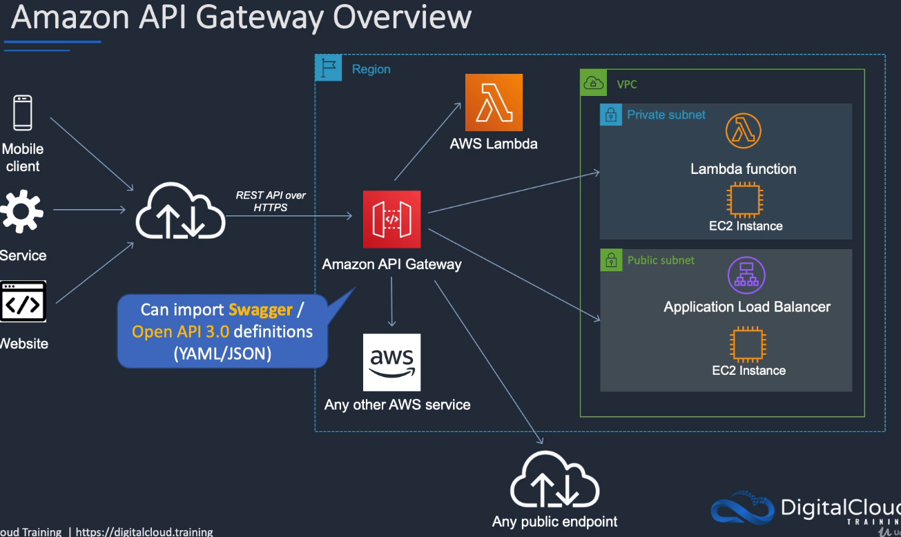
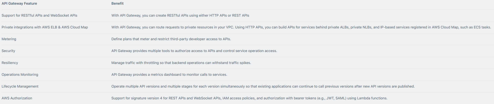
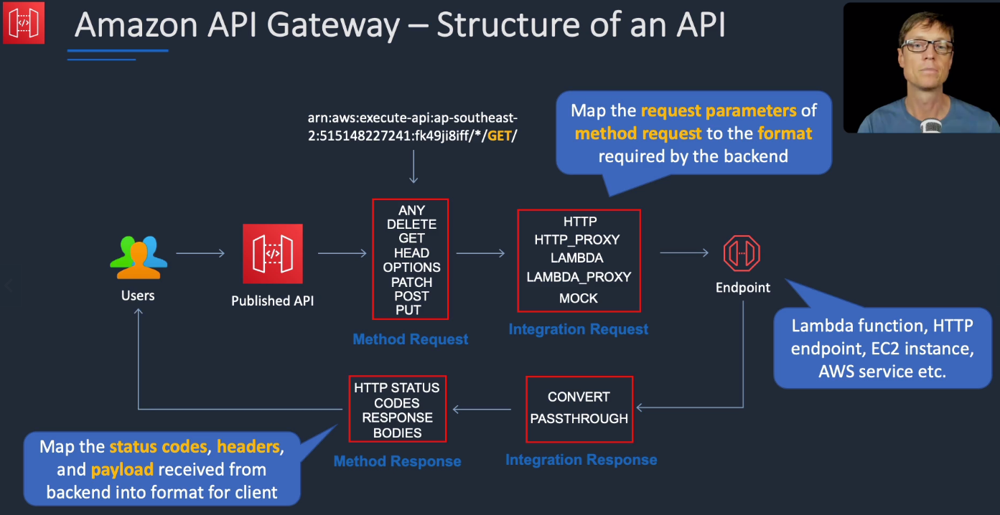
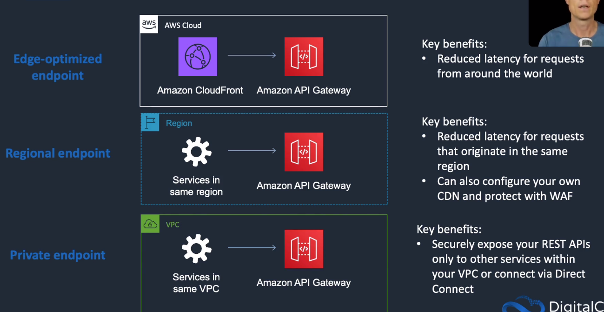
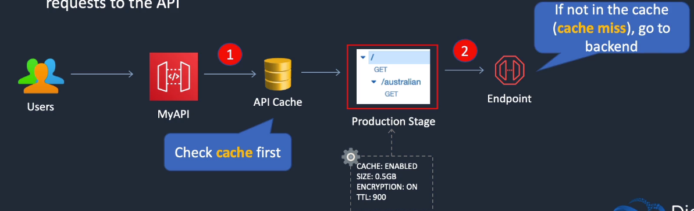
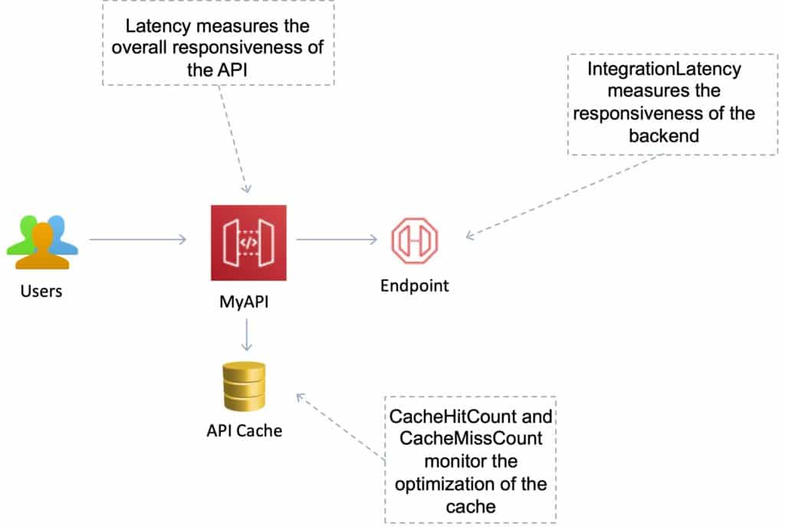
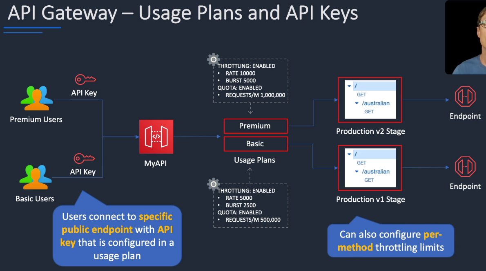
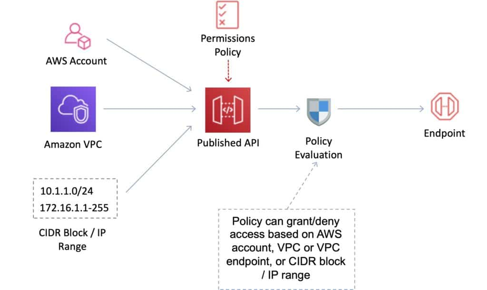
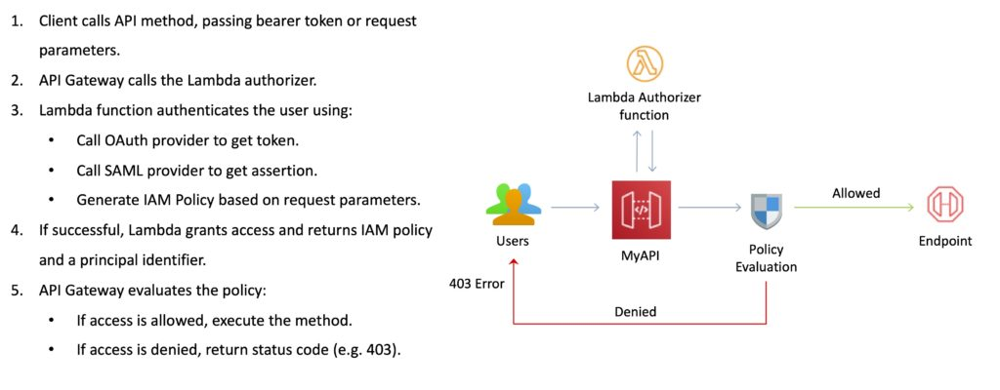
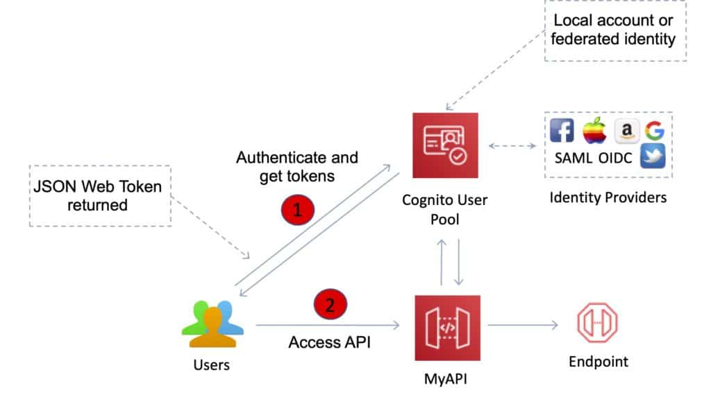

# Amazon API Gateway

## General Info

Fully managed service that acts as a front door to our back end services by allowing us to create, publish, monitor, maintain and secure our REST and WebSocket API at any scale. We can create robust, secure and scalable API that access AWS or other web services as well as data stored in the AWS cloud. We can create API for use in our own client applications or we can make our API available to 3rd party app developers.

WebSocket API is used for backend and @connections commands can send callback messages to connected clients as data is updated

Can process up to hundreds of thousands concurrent API calls including traffic management, authorization, access control, monitoring and API version management.

We can have canary deployment in API Gateway two ways:

* with Lambda (weighted routing between versions)
* with the "Canary" menu at stage level where we redirect traffic to % prod and the rest to a temporary stage called "Canary". At the end, we can "Promote Canary" or "Delete Canary" based on the test results.

Main features:

* build RESTful APIs with
  * resources
  * methods (GET, POST, PUT)
  * settings
* deploy APIs to a stage (different envs like dev, beta, production). Each stage can have its own throttling, caching metering and logging
* create a new API version by cloning an existing one. We can create and work on multiple versions of an API (API version control)
* roll back to previous API deployments: history is kept
* HTTPS only
* cloudfront is used as the public endpoint for API gateway
* custom domain names can point to an API or stage -> we can provide our own certificate
* create and manage API keys for access and meter usage for the API keys through CloudWatch logs
* set throttling rules based on the number of request per second (for each HTTP method): request over the limit throttled (HTTP 429 response)
* security using signature v4 to sign and authorize API calls. Temporary credentials generated through Cognito and STS.
* Permissions to invoke a method are granted using IAM roles and policies or API Gateway custom authorizers.

Benefits of API Gateway:

* ability to cache API responses
* DDoS protection via CloudFront
* SDK generation for iOS, Android and JavaScript
* Supports Swagger and OpenAPI (import and export)
* requests/response data transformation (JSON IN to XML OUT for example)

API Gateway provides several features that assist with creating and managing APIs:

* Metering – Define plans that meter and restrict third-party developer access to APIs.
* Security – API Gateway provides multiple tools to authorize access to APIs and control service operation access.
* Resiliency – Manage traffic with throttling so that backend operations can withstand traffic spikes.
* Operations Monitoring – API Gateway provides a metrics dashboard to monitor calls to services.
* Lifecycle Management – Operate multiple API versions and multiple stages for each version simultaneously so that existing applications can continue to call previous versions after new API versions are published.

URL of an API endpoint looks like this: https://1a2sb3c4.execute-api.us-east-1.amazonaws.com/cars

We can test API endpoint in the AWS Console and receives reponse, response headers, execution logs, ... before deploying it to a stage.

API Gateway can execute Lambda functions, start Step Functions state machines, call HTTP endpoints hosted on Beanstalk, EC2, non-AWS hosted HTTP based operations that are accessible via internet. Gateway can also have mapping template to generate static content to be returned (mock APIs). Gateway can generate Custom SDKs (Android, iOS, JavaScript) but only for REST.

Possible to monetize API by publishing them as products in AWS marketplace.

Gateway offers the ability to create/update/delete documentation associated with each portion of the API. Also supports documentation inheritance to define doc string once and use it in multiple places (error handling).

API Gateway can import Swagger / OpenAPI 3.0 definitions (YAML/JSON)



API caching should be used for better performance -> reduce the number of Lambda invoked by requests

If we get TooManyRequestsException error from Lambda, we can make API gateway push requests to Amazon Kinesis Data Streams and use
Lambda processing as batches instead of individual request => only if it is not needed to have a direct response

Restrict access of API endpoint to IAM user -> ensure they have execute-api:Invoke permissions on the REST resource 



## Architecture patterns for serverless applications
* application includes EC2 and RDS. Spikes in traffic causing writes to be dropped by RDS: decouple EC2 and RDS with an SQS queue; use lambda to process records in the queue
* migrate decoupled on-premises web app. Users upload files and processing tier processes and stores in NFS file system. Should scale dynamically: migrate to EC2 instances, SQS and EFS. Use auto scaling and scale the processing tier based on the SQS queue length
* Lambda function execution time has increased significantly as the number of records in the data to process has increased: optimize execution time by increasing memory available to the function which will proportionally increase CPU
* API Gateway forwards streaming data to AWS Lambda to process and TooManyRequestsException is experienced: send the data to Kinesis Data Stream and then configure Lambda to process in batches
* Migrating app with highly variable load to AWS. Must be decoupled and orders must be processed in the order they are received: FIFO SQS
* Company needs to process large volumes of media files with Lambda which takes +2hours. Need to optimize time and automate the whole process: configure Lambda function to write jobs to queue. Configure queue as input to Step Functions which will coordinate multiple functions to process in parallel
* Objects uploaded to S3 bucket must be processed by AWS Lambda: S3 event trigger lambda
* Company requires API events that involve the root user account to be captured in a third party ticketing system: CloudTrail, eventbridge, SQS, Lambda
* Legacy app uses many batch scripts that process data and pass on to the next script. Complex and difficult to maintain: Lambda + step functions to coordinate components
* Lambda processes objects created in bucket. Large volumes of objects can be uploaded. Must ensure function does not affect other critical functions: configure reserved concurrency to set the maximum limit for the function. Monitor critical functions' cloudwatch alarms for the throttles lambda metric
* EC2 instance processes images using JavaScript code and stores in S3. Load is highly variable. Need a more cost effective solution: Use Lambda instead of EC2
* Solution architect needs to update Lambda function code using canary strategy; traffic should be routed based on weights: use alias weight routing version
* app uses API Gateway regional REST API. Just gone global and performance has suffered: switch to edge-optimized API with cloudfront for the global user base
* app uses API Gateway and Lambda. During busy periods, many requests fail multiple times before succeeding. No errors reported in Lambda: throttling of the API gateway, not the lambda => increase throttling limit
* need to ensure only authorized IAM users can access REST API on API Gateway: set authorization to AWS_IAM for API Gateway method. Grant execute-api:Invoke permissions in IAM policy

## Security

Option to set API methods to require authorization -> AWS signature version 4 or Lambda authorizers (OAuth, JWT verification - cached for up to 1 hour). Use AWS credentials (access and secret keys) to sign requests to the service and authorize access like other AWS services. Can have temp credentials with a role using Cognito. Even if Gateway can generate API keys associated with a usage plan, it is not recommended to do that, use signed API calls or OAuth.

**Usage plan**: declare plans for 3rd party dev that restrict only to certain APIs, define throttling and request quota limits and associate them with API keys.

All the endpoints are HTTPS only, no support for HTTP. By default, Amazon API Gateway certificate but we can provide our own. 

API Gateway is protected by IAM for accessibility, CloudTrail for logging and monitoring of API usage and API changes, CloudWatch for execution logging and alarms. We can use CloudFormation templates to enable API creation.

DDoS protection layer 7 (counterfeit requests), layer 3 (SYN floods).

Gateway can generate client-side SSL certificate and share the public certificate with us; we can then use it on the backend to make sure that the request comes from API Gateway and nothing else.

Can set up CloudFront with custom SSL certificate and use it with regional API in Gateway. We can then configure the Security Policy for the CloudFront with TLS 1.1 or higher.

## Monitoring

Gateway logs API calls, latency and error rates to CloudWatch (also available in Gateway console)

By default, Gateway monitors traffic at a REST API level. We can enable detailed metrics for each method. Detailed metrics are also logged to CloudWatch and will be charged at the CloudWatch rates.

Metric details are specified by REST API and stage (to know what is used by the users). 

Integrated with CloudWatch logs. We can optionally enable logging for each stage in the API. For each method in the REST APIs, we can set the verbosity of the logging and if full request and response data should be logged. => near real time

## Throttling and caching

Throttling limits can be set for standard rates and bursts at multiple levels (global and by service call).

Individual developers can be throttled with a usage plans and their individual API keys.

Throttling rules applied:

1. check against AWS account limit, if below continue
2. check limit on stage or method, if below continue
3. check if there is a usage plan limit on a per-API key basis

Caching can be used at API Gateway level, need to specify the size in gigabytes. Cache specific to a stage. Possible to invalidate cache for each stage. Available for REST API only.

If caching is not enabled and throttling limits have not been applied -> all requests will pass through until the account level throttling limits are reached

## Benefits of API Gateway

* metering: define a set of plans, configure throttling and quota limits on a per API key basis. Automatically metters traffic and lets us extract utilization data for each API key. Gateway auto protects against counterfeit requests (Layer 7) and SYN floods (Layer 3)
* security: integrates with IAM, Cognito to authorize access to APIs. Can verify signed API calls, use custom authorizers written as Lambda functions, can help verify incoming bearer tokens removing auth concerns from backend code
* resiliency: manage traffic with throttling so that backend app can withstand traffic spikes, has an internal cache to avoid calling backend every time
* operations monitoring: metrics in CloudWatch (backend performance metrics, latency data, error rates). We can enable detailed metrics for each method and also receive error, access and debug logs in CloudWatch logs
* lifecycle management: supports multiple API versions and multiple stages for each version simultaneously so that existing apps can continue to call previous versions after new API versions are published
* designed for developers: quickly create API and assign static content for their responses -> teams who depend on API can begin development while we build the backend
* real time two way communication: chat apps, streaming dashboards, notifications without having to run or manage any servers

## REST API vs Web Socket API

A REST API (stateless) receives messages from the client and forwards those to the backend resource. 
It also forwards response from the backend to the client => **strict request-response, there cannot be a response without a request.** 
Can accept any payloads sent over HTTP (JSON, XML, query string parameters). 
We can declare any content type for our responses and then use the transform templates to change the backend response into our desired format. Available everywhere.

Rest API in API Gateway can be public or private (only deployed in a VPC).

A Web Socket API (stateful) supports two-way communication between client apps and backend. 
The backend can send callback messages to connected clients. The backend services can independently send messages to its clients, 
**it doesn't need to be initiated by a request.** Before API Gateway support, this could be done but it requires extra servers to keep track of the sessions. 
To do that, there is a new resource type called a "route" (with routing key and integration backend to invoke). 
Web Socket API can be composed of one or more routes. T
he client needs to provide the route(s) to tell API Gateway which lambda functions to trigger: onConnect (on first connect), sendMessage, onDisconnect. 
**The two way connections facilitate real-time communication** (chat, ...). When the client is connected, the backend receives a callback URL to send messages to the client. 
Can define backend integrations with Lambda, Kinesis or any HTTP endpoints to be invoked when messages are received from the connected clients. 
Available only the main regions. Can use IAM roles and policies or AWS lambda Authorizers for authorization. 
The callback URL can be used to disconnect the client. Max message size is 128KB

## Mapping templates
* Mapping templates can be used to modify request / responses. 
* Rename parameters. 
* Modify body content. 
* Add headers. 
* Map JSON to XML for sending to backend or back to client. 
* Uses Velocity Template Language (VTL). 
* Filter output results (remove unnecessary data).

## Creation of an API

Can create a new API, import one from Swagger or use an example API.

If we create a new one, we need to specify the API name and the endpoint type:

* regional: default, endpoint closer to the users are used
* edge optimized: cloudfront used

It is possible to clone an existing API to be able to work simultaneously on two version. We can also use the Swagger importer tool to import Swagger API definitions into API Gateway => create or update.

## API configuration



* Integration request:
The internal interface of a WebSocket API route or REST API method in API Gateway, in which you map the body of a route request or the parameters and body of a method request to the formats required by the backend.

* Integration response:
The internal interface of a WebSocket API route or REST API method in API Gateway, in which you map the status codes, headers, and payload that are received from the backend to the response format that is returned to a client app.

* Method request:
The public interface of a REST API method in API Gateway that defines the parameters and body that an app developer must send in requests to access the backend through the API

* Method response:
The public interface of a REST API that defines the status codes, headers, and body models that an app developer should expect in responses from the API.

Mapping template: use Velocity Template Language (VTL) to transforms request body to backend data format or response backend to response frontend (done in integration)

The mapping depends on the integration:
* Lambda proxy -> lambda custom integration
* HTTP proxy -> HTTP custom integration

### Resources
logical entities that can be accessed via resource paths (/songs, /films, ...)

Same origin policy
* Used to prevent cross-site scripting attacks. 
* Web browser permits scripts in a first web page to access data in a second web page but only if the web pages have the same origin. 
* This is enforced by web browsers.

Enable API Gateway CORS (cross origin resource sharing): yes/no for each resource we create to allow requests from other domain
* Can enable Cross Origin Resource Sharing (CORS) for multiple domain use with JavaScript/AJAX. 
* CORS is one way that the server at the other end (not the client code in the browser) can relax the same-origin policy. 
* CORS allows restricted resources (e.g. fonts) on a web page to be requested from another domain outside the domain from which the first resource was shared.

Using CORS:
* Can enable CORS on API Gateway if using JavaScript / AJAX. 
* Can be used to enable requests from domains other than the APIs domain. 
* Allows the sharing of resources between different domains. 
* The method (GET, PUT, POST etc.) for which you will enable CORS must be available in the API Gateway API before you enable CORS. 
* If CORS is not enabled and an API resource received requests from another domain the request will be blocked. 
* Enable CORS on the API resources using the selected methods under the API Gateway.


Resources URLs:

* API gateway resource URLs: https://{random stuff}.execute-api.{region}.amazonaws.com/{stage}/{resource path}
* custom API domains can simplify the URL: https://api.mycarcompany.com/mystage/cars
* resources can have child resources: https://{random stuff}.execute-api.{region}.amazonaws.com/{stage}/{resource path}/{child resource}
* both resources and child resources have associated HTTP methods

Protected by resource policy (JSON) with a principal (IAM user or role) to specify who can invoke the API.

### Stage
the environment like test, staging, prod

they are similar to tags and appears in the URL 

we can enable here the API caching, default method throttling, client certificate, some tags

They define the lifecycle of the API (test -> staging -> prod)

stages can be configured using variables that can be accessed from our API configuration or mapping templates

**stage variables**: key-value pairs of configuration values associated with a stage (similar to environment variables). For example, we could define the HTTP endpoint for our method integration as a stage variable and use the variable in our API configuration instead of hardcoding the endpoint

Stages have history so it is easy to rollback

You can create canary deployments for any stage – choose the % of traffic the canary channel receives.

### Methods
HTTP methods can be GET, PUT, POST, DELETE, OPTIONS, PATCH, HEAD, ANY

Methods can be configured to respond to requests in a variety of ways:

* lambda functions: lambda proxy integrations allow request data to be passed to a lambda as event without modification, need to specify the region where the lambda is located
* existing HTTP endpoints like in an EC2 instances
* integrated with other AWS services 
* VPC Link

Example workflow: user facing app includes API Gateway endpoint URL -> HTTP GET from application -> API Gateway GET mapping -> API Gateway triggers lambda -> Lambda returns result to API Gateway -> API Gateway returns response to the caller -> app receives data and displays it to the user

### Integrations
For lambda function
* lambda proxy integration
* lambda custom integration

For an HTTP endpoint
* HTTP proxy integration
* HTTP custom integration

For an AWS service action
* AWS integration of the non-proxy type only

## Deployments and stages

Deployments:

* snapshot of the API's resources and methods
* must be created and associated with a stage in order for anyone to access the API

Stages:

* snapshot of the complete API
* references to a lifecycle status of our API such as dev, prod, beta
* once created, we have an **Invoke URL** that makes it available for query
* can be mapped to deployments in order to have a functional API => store configuration for deployments
* settings on a stage can be used to do things like
  * enable caching
  * customize request throttling: **enabled by default**
  * configure logging
  * define stage variables
  * logging
  * stage variables
  * SDK for this API
  * export the API

**Resources need to be deployed to be used "Deploy API" action menu. We need to specify the deployment stage if it already exists or create a new one. Once deployed to a stage, the API is available.**

**Once the API is deployed, we can change the resources without affecting what's deployed as it needs to be redeploy to a stage to be available.**

Since there is a deployment history at the stage level, we can easily rollback.

### Deployment types


Edge-Optimized Endpoint
* An edge-optimized API endpoint is best for geographically distributed clients. API requests are routed to the nearest CloudFront Point of Presence (POP). This is the default endpoint type for API Gateway REST APIs.
* Edge-optimized APIs capitalize the names of HTTP headers (for example, Cookie).
* CloudFront sorts HTTP cookies in natural order by cookie name before forwarding the request to your origin. For more information about the way CloudFront processes cookies, see Caching Content Based on Cookies.
* Any custom domain name that you use for an edge-optimized API applies across all regions.

Regional Endpoint
* A regional API endpoint is intended for clients in the same region. 
* When a client running on an EC2 instance calls an API in the same region, or when an API is intended to serve a small number of clients with high demands, a regional API reduces connection overhead. 
* For a regional API, any custom domain name that you use is specific to the region where the API is deployed. 
* If you deploy a regional API in multiple regions, it can have the same custom domain name in all regions. 
* You can use custom domains together with Amazon Route 53 to perform tasks such as latency-based routing. 
* Regional API endpoints pass all header names through as-is.

Private Endpoint 
A private API endpoint is an API endpoint that can only be accessed from your Amazon Virtual Private Cloud (VPC) using an interface VPC endpoint, which is an endpoint network interface (ENI) that you create in your VPC. 
Private API endpoints pass all header names through as-is.

## Caching, monitoring, usage plans

### Caching
* cache API responses so that duplicate API requests do not have to hit our backend
  * reduces load on the back end
  * speeds up calls to the back end
* caching can be setup on a per API or per stage basis
* defined per stage
* can encrypt caches
* Clients can invalidate the cache with the header: Cache-Control: max-age=0 .
* can flush entire cache (invalidate it) immediately if required
* add caching to API calls by provisioning an Amazon API Gateway cache and specifying size in gigabytes
* cache endpoint's reponse
* configuration
  * cache capacity: from 0.5GB to 237GB
  * encrypt cache
  * time to live
  * per-key cache invalidation
  * require authorization



Default TTL is 300 seconds (min 0, max 3600)

### Monitoring
* monitors activity and usage
* monitoring can be done on the API or stage level
* throttling rules are monitored by CloudWatch: requests per second, burst requests
* Monitoring metrics include statistics such as:
  * caching
  * latency
  * detected errors
* method level metrics can be monitored
* near real time backend metrics API calls, latency, error rates
* can create CloudWatch alarms based on these metrics
* integrated with cloudtrail to monitor REST API changes



Understanding the following metrics is useful for the exam:

* Monitor the IntegrationLatency metrics to measure the responsiveness of the backend. 
* Monitor the Latency metrics to measure the overall responsiveness of your API calls. 
* Monitor the CacheHitCount and CacheMissCount metrics to optimize cache capacities to achieve a desired performance.

### Throttling
* API Gateway sets a limit on a steady-state rate and a burst of request submissions against all APIs in our account
* Limits
  * by default, API Gateway limits the steady-state request rate to 10k requests per second
  * maximum concurrent requests is 5k requests across all APIs within an AWS account
  * if we reach these limits, we get 429 Too Many Requests error response
* the client can resubmit the failed requests in a way that is rate limiting while complying with the API Gateway throttling limits

* Server-side throttling limits are applied across all clients. These limit settings exist to prevent your API—and your account—from being overwhelmed by too many requests.
* Per-client throttling limits are applied to clients that use API keys associated with your usage policy as a client identifier.

### Usage plans
Create plans with different configurations (throttling, burst, quota, ...) and generate API key for these plans.



A usage plan specifies who can access one or more deployed API stages and methods — and how much and how fast they can access them.

## API Gateway with Lambdas

API Gateway can trigger Lambda functions. When we call API gateway endpoint with GET, POST, PUT, or other methods, a lambda function will be invoked. API Gateway handles the request coming from the client and passes it to the Lambda function. The Lambda function returns a response to API Gateway which forwards it to the client. **API Gateway transforms requests/responses if required.**

The parameters are event, context and if we want to send info the client, callback.

**Lambda functions can be referenced with the alias or with {funciton_name}:{version} in API gateway. This makes it really easy to update the API Gateway/Lambda combo because we can either change the endpoint to point to a specific version of a Lambda or we can change the alias and point to another version of the function.**

## Private endpoints

API endpoints only available to resources in our VPC or DirectConnect data center. This is made possible by AWS PrivateLink. We can apply a Resource Policy to an API to restrict access to a specific VPC or VPC endpoint.

Requirements

* a VPC with at least one subnet and DNS resolution enabled

* a VPC endpoint (AWS service) configured as such

  * service name = "com.amazonaws.{region}.execute-api"
  * the two private subnets 
  * enable private DNS name = enabled
  * a security group set to allow TCP port 443 inbound from either an IP range in our VPC or another security group in our VPC

* an API in API gateway with

  * endpoint type = private (not regional or edge optimized)

  * a resource policy (in API gateway config) giving access to the API from the VPC endpoint => Source VPC Whitelist. We need to give access to our API to anything that match this condition

    ```json
    "Condition": {
        "StringEquals": {
            "aws:sourceVpce": "our vpc id"
        }
    }
    ```

With this in place, we can now have a Lambda in the private subnet access the API. We need the DNS name of the private VPC endpoint, the endpoint DNS for the API Gateway API (once deployed) to create the lambda stack example from CloudFormation template.

## Identity and access management
* Resource-based policies. 
  * IAM user, IP, VPC or VPC endpoints in any account can invoke the API or not
  * for private, edge optimized, regional

* Standard IAM Roles and Policies (identity-based policies).
* IAM Tags. 
* Endpoint policies for interface VPC endpoints. 
* Lambda authorizers. 
  * validate token in the header being passed
  * cache result of the auth
  * lambda must return an IAM policy for the user
  * pay per lambda invocation
  * handles authentication and authorization
  * good for OAuth, SAML, 3rd party authentication

* Amazon Cognito user pools.
  * web or mobile app through cognito (google, facebook, amazon, apple, SAML identity providers)
  * signup/signin services
  * built in customizable web UI to sign in users
  * security features with MFA


## Billing

REST: number of API calls and the amount of data transferred out

WebSockets: messages sent and received and for the time a user/device is connected to the WebSocket API

Cache is charged hourly

If we have a cache hit, we are charged for the cache and the API calls

## Resources

Documentation: https://docs.aws.amazon.com/apigateway/latest/developerguide/welcome.html

API v2: https://docs.aws.amazon.com/apigatewayv2/latest/api-reference/api-reference.html

CLI v2: https://docs.aws.amazon.com/cli/latest/reference/apigatewayv2/index.html

