# General usage for ML services

## General info
During the exams, we should give priorities to answer that use AWS managed services instead of creating custom models.

First read the answers, try to get a feel of what the questions will be about and decide to skip or not. If not skip,
read the actual question. Try to find wrong answers for the questions. Then read the context before the question.
Go back to the answers with the new info.

Analyze and visualize clickstream data as it arrives into the data lake: s3 -> Glue -> Athena -> Quicksight for a full serverless solution

## AWS Data Stores for Machine Learning
* Redshift
    * need to provision it like an entire big database
    * Data warehousing
    * SQL analytics (OLAP - Online analytical processing), not data storage
    * load data from S3 to Redshift
    * use Redshift Spectrum to query data directly in S3 (no loading)
    * columnar based
* RDS, Aurora
    * relational store
    * data storage
    * SQL (OLTP - online transaction processing)
    * must provision servers in advance
    * row based
* DynamoDB
    * NoSQL data store
    * serverless as in no need to provision servers
    * provision read/write capacity
    * useful to store a ML model output served by our application
* S3
    * Object storage
    * serverless
    * infinite storage
    * integration with most AWS services
* ElasticSearch
    * indexing of data
    * search amongst data points
    * clickstream analytics
    * no ML directly on ES
* ElastiCache
    * caching mechanism
    * not really used for ML but can be trick questions during exam
    
## Database Migration Service (DMS)
* Quickly and securely migrate databases to AWS, resilient, self healing
* source database remains available during the migration
* supports
    * homogeneous migrations (ex: Oracle to Oracle)
    * heterogeneous migrations (ex: Microsoft SQL server to Aurora)
* continuous data replication using CDC
* we must create an EC2 instance to perform the replication tasks -> EC2 running DMS

### AWS DMS vs Glue
Glue

* very apache spark focus
* Glue ETL: run apache spark code, scala or python based, focus on ETL
* Glue ETL: do not worry about configuring or managing the resources
* Data Catalog to make the data available to Athena or Redshift Spectrum

AWS DMS

* continous data replication
* no data transformation
* once the data is in AWS, we can use Glue to transform it (common usage!)

## AWS Step Functions
* use to orchestrate & design workflows
* easy visualizations
* advanced error handling and retry mechanism outside the code
* audit of the history of workflows
* ability to wait for an arbitrary amount of time
* max execution time of a state machine is 1 year

**We can do the following with step functions!**

* start the training of a ML model
    * generate dataset
    * train model
    * save model
    * batch transform
* tune a ML model
    * generate training dataset
    * hyperparameter tuning
    * extract model path
    * hyperparameter tuning save model
    * extract model name
    * batch transform
* manage a batch Job 
    * submit
    * notify success or failure

## S3 in Machine Learning context - Summary
Good for storing structured data (csv, json) and unstructured data (text files, images)

- Cost effective storage for large amounts of data.
- Can store structured and unstructured data.
- Can use Amazon Athena to query S3 data with standard SQL expressions.
- max object size is 5TB
- we can add ObjectTags (key value pair, up to 10) -> useful for security/lifecycle

### Partitioning
* patterns for speeding up range queries (ex: AWS athena)
* by date: s3://bucket/my-dat-set/year/month/day/hour/data_00.csv
* by product: s3://bucket/my-data-set/product-id/data_32.csv

=> we can define whatever partitioning strategy we like but date and product are very common

=> data partitioning will be handled by some tools we use (Glue)

### Storage tiers
Always 11 9's durability

* s3 standard (general purpose) - best ava with 99.99%, data used all the time here
* s3 standard - infrequent access (IA) - 99.9% ava
* s3 one zone - infrequent access: we lose availability because only one AZ, the rest has >= 3, 99.5% ava
* s3 intelligent tiering: let amazon decide, 99.9% ava
* amazon glacier -  archiving, unused data

#### Lifecycle rules
set of rules to move data between different tiers to save storage cost

* Transition actions: objects are transitioned to another storage class
* Expiration actions: S3 deletes expired objects on our behalf

### S3 as data lake
A data lake is a centralized repository that allows us to store all our structured (e.g. CSV, JSON) and unstructured data (text files, images) at any scale.

Advantages:

* infinite size, no provisioning
* decoupling of storage (S3) to compute (EC2, Athena, Redshift, Rekognition, Glue)
* S3 is designed for 99.999999999% (11 9’s) of data durability.
* add data from many sources
* centralized architecture
* supports any file format because it is an object storage
* define the data schema at the time of the analysis
* much lower cost than data warehouse solutions
* tolerant of low quality data (double edge sword) compared to data warehouse which is more strict with the data quality

Disadvantages:

* unsuitable for transactional systems
* needs cataloguing before analysis

The following image represents the flow of the use of the components in this arch, not necessarily the flow of data.


Kinesis is about getting as much data as possible from the outside world and put it in an AWS environment (S3, ...).

Athena allows querying data we have on S3 -> need defined structured to be able to use SQL syntax

AWS Glue Data Catalog: crawl data on S3 and produce a DB catalog that Athena can use to query data from S3

ML/DL (SageMaker): use data from S3 or from Athena

As another example of architecture, we could have


Data could come from somewhere else than Kinesis. We could also use Elastic Map Reduce/Spark as well to get data from S3 
before feeding SageMaker data content. We have SparkML that allows doing ML even in EMR jobs.

EMR is an efficient ETL platform.

Note that there exists a way to use FTP to S3: AWS Transfer for SFTP is a fully managed, secure file transfer service for S3

### S3 security
Very important to secure the data because some of it could contain sensitive information

We can use object tags for security (with IAM policies) and lifecycle management

* encryption at rest (SSE = server side encryption)
    * SSE-S3: encrypts S3 objects using keys handled & managed by AWS
    * SSE-KMS: create our own keys or import them and use those keys to encrypt data in S3 (AWS Key Management Service) - key can still be managed by AWS "aws/s3"
        * additional security (user must have access to KMS key)
        * audit trail for KMS key usage
        * key generate by KMS Customer Master Key (CMK)
    * SSE-C: customer manage own encryption keys
    * client side encryption and send to S3

Security can be 

* user based
    * IAM policies: which API calls should be allowed for a specific user, roles
* resource based
    * bucket policies: bucket wide rules from the S3 console - allows cross account
    * Object Access Control List (ACL): finer grain
    * Bucket Access Control List (ACL): less common
  
S3 Bucket policies are JSON based policies

* resources: buckets and objjects
* actions: set of API to Allow or Deny
* Effect: Allow/Deny
* Principal:  the account or user to apply the policy to
    
We can use an S3 bucket policy to:

* grant public access to the bucket
* force objects to be encrypted at upload ti~~~~~~~~me
* grant access to another account (cross account)

The old way to enable default encryption was to use a bucket policy and refuse any HTTP command without the proper headers but now
we can just use the default encryption option in S3
=> bucket policies are evaluated before "default encryption"

Note that we can encrypt all objects in a bucket but this is not done by default. When we create a bucket, the encryption is set to None.
When we put object in the bucket, we check "None" (this means use bucket encryption config) but not encrypted by default.
=> if we set the default encryption property on the bucket to AES-256 for instance, only the new objects will be encrypted

When storing confidential data on S3 such as person information

* redact patients names and medical record numbers from the patient data with AWS Glue
* use KMS to encrypt the data on S3

Can track encryption status of S3 with CloudWatch and CloudTrail

* Cloud trail events: PutBucketEncryption, GetBucketEncryption, DeleteBucketEncryption
* CloudWatch Events with S3 bucket level operations as the event type

#### Amazon Macie
Amazon Macie is a security service that uses machine learning to automatically discover, classify, 
and protect sensitive data in AWS. Amazon Macie recognizes sensitive data such as personally identifiable 
information (PII) or intellectual property and provides you with dashboards and alerts that give visibility 
into how this data is being accessed or moved. The fully managed service continuously monitors data access activity for 
anomalies and generates detailed alerts when it detects the risk of unauthorized access or inadvertent data leaks. 
Amazon Macie is available to protect data stored in Amazon S3.

#### VPC endpoint
we can stay within AWS network with VPC endpoint. Resources in our VPC will go through a specific way inside AWS to reach the bucket instead of the internet.

* allow traffic to stay within our VPC (instead of going through public web)
* make sure private services (SageMaker) can access S3
* need NAT gateway for notebooks to have access to internet if not in public subnet

#### Logging and audit
* S3 access logs can be stored in other S3 bucket
* API calls can be logged in AWS CloudTrail

#### Tagged based
add tag Classification=PHI to our objects (personal health information)

We can then combine IAM policies and bucket policies for these tags

## Data migration
AWS Database Migration Service (AWS DMS) is a cloud service that makes it easy to migrate relational databases, data warehouses, 
NoSQL databases, and other types of data stores. We can use AWS DMS to migrate our data to the AWS Cloud, 
between on-premises instances (through an AWS Cloud setup), or between combinations of cloud and on-premises setups. 
We can migrate data to Amazon S3 using AWS DMS from any of the supported database sources.


## Artificial intelligence / ML / DL
AI: A general term used to describe systems that appear to be intelligent. These systems perceive their environment and respond in a way that seems to maximize their value.

Turing test: A method of inquiry in artificial intelligence (AI) for determining whether or not a computer is capable of thinking like a human being.

ML: A subset of artificial intelligence used to develop statistical models to perform a specific task relying on patterns and inference with minimal human intervention.

DL: subset of ML, represents the neurons of a brain (input, activation, output), all connected

## Amazon Deep Learning AMIs

AMI with pre-installed Apache MXNet and Gluon, TensorFlow, Microsoft Cognitive Toolkit, Caffe, Caffe2, Theano, PyTorch, Chainer and Keras

Keras: open-source neural-network library written in Python. It is capable of running on top of TensorFlow, 
Microsoft Cognitive Toolkit, Theano, or PlaidML. 
Designed to enable fast experimentation with deep neural networks, it focuses on being user-friendly, modular, and extensible.

Gluon: clear, concise, and simple API for deep learning. 
It makes it easy to prototype, build, and train deep learning models without sacrificing training speed.

PyTorch is a python-based, scientific computing package targeted at two sets of audiences.

- A replacement for NumPy to use the power of GPUs.
- A deep learning research platform designed to provide maximum flexibility and speed.

Apache MXNet is an open-source deep-learning software framework, used to train, and deploy deep neural networks. 
It is scalable, allowing for fast model training, supports a flexible programming model, 
and supports multiple programming languages (including C++, Python, 
Julia, Matlab, JavaScript, Go, R, Scala, Perl, and Wolfram Language).

TensorFlow is an end-to-end open-source platform for machine learning. 
It has a comprehensive, flexible ecosystem of tools, libraries, and community resources.

scikit-learn is a free software machine learning library for the Python programming language. 
It features various classification, regression, and clustering algorithms and is designed to interoperate with the 
Python numerical and scientific libraries NumPy and SciPy.

## EC2 for ML
Instance types targeted at ML tasks:

* Compute Optimized
* Accelerated Computing (GPU)

**The ml.instances are not available outside of SageMaker, we cannot access them directly like an EC2 instance. Similar to RDS instances.**

There are AWS AMI for deep learning

Conda based:

* Libraries: TensorFlow, Keras, MXNet, Gluon, PyTorch
* GPU Acceleration: CUDA 8 and 9, cuDNN 6 and 7, NCCL 2.0.5 libraries, Nvidia driver 384.81

Deep Learning Base AMIs:

* libraries: none
* GPU acceleration: CUDA 8 and 9, cuDNN 6 and 7, NCCL 2.0.5 libraries, Nvidia driver 384.81

EC2 instance type limits:

* brand new account = no ML for us to protect us from large bills
* service limit increases take days

## Amazon Service Chaining with AWS Step Functions
Step functions: (state machines) let us coordinate multiple AWS services into serverless workflows so we can build and update apps quickly.

Services that can be used for chaining ML applications:

- AWS Step Functions
- AWS Lambda
- Amazon S3
- Amazon SNS
- Amazon SQS

The ML services become really powerful when combined with other AWS services.

* Amazon Translate
* Amazon Transcribe
* Amazon Comprehend
* Amazon Rekognition
* Amazon Polly

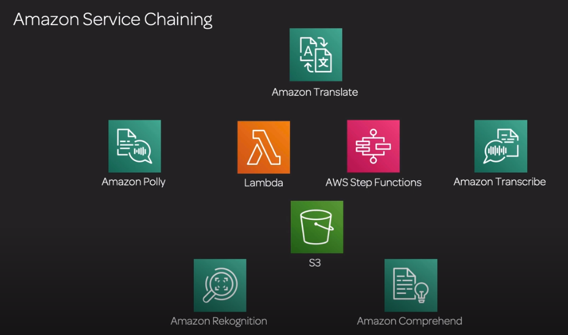

### Examples
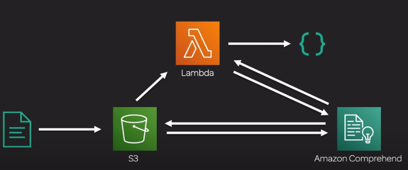

Files to S3 -> lambda triggered -> Amazon Comprehend retrieves files from S3, process then store response in S3 or back to Lambda then DynamoDB or S3

This simple example works well because Comprehend is fast. If we chain multiple ML services, the pipeline can become really slow.

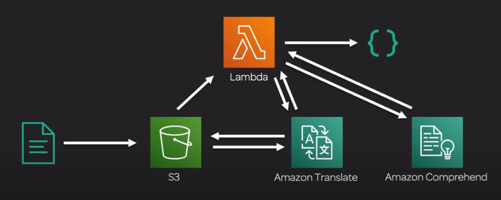

This architecture is not great because we have a single lambda functions doing multiple jobs and there is a risk of timeout.

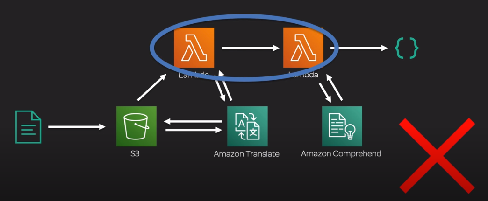

We don't like a lambda calling another lambda even if each lambda has a single job. This is not reliable because of the coupling.
The first lambda function cannot finish until the second has finished.

The best practice here is to use AWS Step Functions which is designed to orchestrate the running of multiple lambdas. Step Functions
save the states of the process (=> it is a state machine after all).

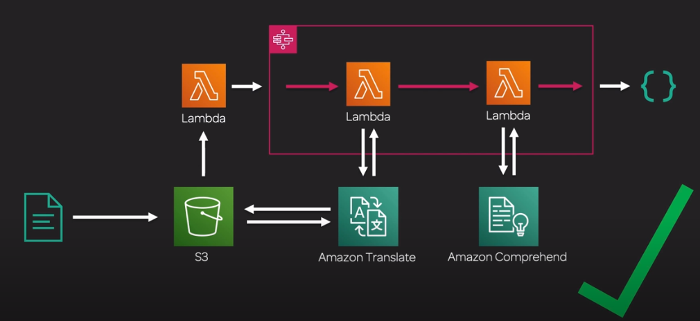

This architecture is okay if the services that are called are quick to process the jobs. Basically, text processing ML is quick, audio and video is not.
Amazon Transcribe is not a synchronous call but asynchronous.

We use time check (wait state) and decision point from step functions to synchronize long running jobs. Transcribe gives an ID of the jobs,
the lambda checks the status and goes to the decision point to know what should be done.

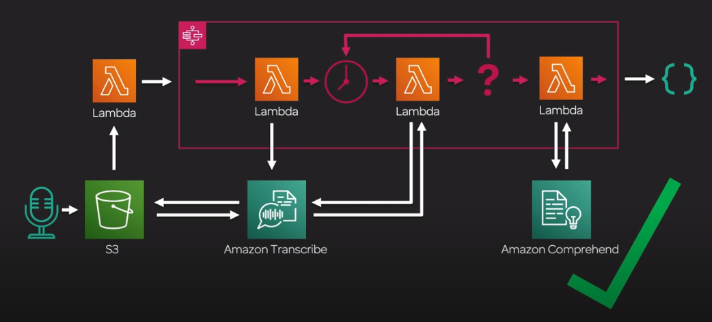

For translation purposes of Audio: Transcribe -> Translate -> Comprehend (sentiment analysis)

## Combine aws services
if a lambda function needs to call other AWS services, we need to create an IAM role that it can assume at execution time

The lambda that triggers the step functions need full access cloudwatch and step functions

### Lambda trigger function
This lambda should be triggered by an S3 events.

```python
import boto3
import os
import json

def lambda_handler(event, context):
    stepfunctions = boto3.client('stepfunctions')
    bucket = event['Records'][0]['s3']['bucket']['name']
    key = event['Records'][0]['s3']['object']['key']
    
    input = {
        "Bucket": bucket,
        "Key": key
    }
    
    response = stepfunctions.start_execution(
        stateMachineArn=os.environ['STATEMACHINEARN'],
        input=json.dumps(input, default=str)
    )
    
    return json.dumps(response, default=str)
```
This uses an environment variable STATEMACHINEARN 

### Lambda status checker
```python
import boto3

transcribe = boto3.client('transcribe')

def lambda_handler(event, context):
    
    payload = event['Input']['Payload']
    transcription_job_name = payload['TranscriptionJobName']
    
    response = transcribe.get_transcription_job(
        TranscriptionJobName=transcription_job_name
    )
    
    transcription_job = response['TranscriptionJob']
    
    transcript_file_uri = "none"
    if 'Transcript' in transcription_job:
        if 'TranscriptFileUri' in transcription_job['Transcript']:
            transcript_file_uri = transcription_job['Transcript']['TranscriptFileUri']
    
    return {
        'TranscriptFileUri': transcript_file_uri,
        'TranscriptionJobName': transcription_job_name,
        'TranscriptionJobStatus': response['TranscriptionJob']['TranscriptionJobStatus']
    }

```

### Lambda transcribe
```python
import boto3
import uuid

def lambda_handler(event, context):
    s3_bucket = event['Input']['Bucket']
    s3_object = event['Input']['Key']
    
    s3_path = "s3://" + s3_bucket + "/" + s3_object
    job_name = s3_object + '-' + str(uuid.uuid4())

    client = boto3.client('transcribe')

    response = client.start_transcription_job(
        TranscriptionJobName=job_name,
        LanguageCode='en-US',
        MediaFormat='mp4',
        Media={
            'MediaFileUri': s3_path
        }
    )

    return {
        'TranscriptionJobName': response['TranscriptionJob']['TranscriptionJobName']
    }
```

### Lambda polly wrapper
```python
import boto3
import os

polly = boto3.client('polly')

def lambda_handler(event, context):
  
    payload = event['Input'][0]['Payload']
    payload_other = event['Input'][1]['Payload']
    
    payload.update(payload_other)
    
    translatedText = payload['TranslatedText']
    transcriptionJobName = payload['TranscriptionJobName']
    sentiment = payload['Sentiment']

    response = polly.start_speech_synthesis_task(
        LanguageCode=os.environ['LANGUAGECODE'],
        OutputFormat='mp3',
        OutputS3BucketName=os.environ['OUTPUTS3BUCKETNAME'],
        OutputS3KeyPrefix=sentiment + "/" + transcriptionJobName + "-" + sentiment,
        Text=translatedText,
        TextType='text',
        VoiceId=os.environ['VOICEID']
    )

    return {
        'TaskId': response['SynthesisTask']['TaskId'],
        'TranscriptionJobName': transcriptionJobName
    }
```

https://docs.aws.amazon.com/polly/latest/dg/voicelist.html

### Lambda translate wrapper
```python
import boto3
import json
import os
import urllib.request

translate = boto3.client('translate')

def lambda_handler(event, context):

    payload = event['Input']['Payload']
    transcriptFileUri = payload['TranscriptFileUri']
    transcriptionJobName = payload['TranscriptionJobName']

    transcriptFile = urllib.request.urlopen(transcriptFileUri)
    transcript = transcriptFile.read()
    transcript = json.loads(transcript)
    transcript_text = transcript['results']['transcripts'][0]['transcript']

    response = translate.translate_text(
        Text=transcript_text,
        SourceLanguageCode=os.environ['SOURCELANGUAGECODE'],
        TargetLanguageCode=os.environ['TARGETLANGUAGECODE']
    )

    return {
        'TranslatedText': response['TranslatedText'],
        'TranscriptionJobName': transcriptionJobName,
    }
    
```

### Lambda comprehend wrapper

```python
import boto3
import json
import urllib.request

comprehend = boto3.client('comprehend')

def lambda_handler(event, context):

    payload = event['Input']['Payload']
    transcriptFileUri = payload['TranscriptFileUri']
    transcriptionJobName = payload['TranscriptionJobName']

    transcriptFile = urllib.request.urlopen(transcriptFileUri)
    transcript = transcriptFile.read()
    transcript = json.loads(transcript)
    transcript_text = transcript['results']['transcripts'][0]['transcript']
    
    response = comprehend.detect_sentiment(
        Text=transcript_text,
        LanguageCode='en'
    )

    sentiment = response['Sentiment']

    return {
        'Sentiment': sentiment,
        'TranscriptionJobName': transcriptionJobName
    }
```

### Step functions
```json
{
  "StartAt":"transcribe",
  "States":{
    "transcribe":{
      "Type":"Task",
      "Resource":"arn:aws:states:::lambda:invoke",
      "Parameters":{
          "FunctionName":"arn:aws:lambda:us-east-1:417341588733:function:lab-transcribe-wrapper:$LATEST",
          "Payload":{
            "Input.$":"$"
          }
      },
      "Next":"transcribe-wait"
    },
    "transcribe-wait":{
        "Type":"Wait",
        "Seconds":2,
        "Next":"transcribe-status"
    },
    "transcribe-status": {
      "Type":"Task",
      "Resource":"arn:aws:states:::lambda:invoke",
      "Parameters":{
          "FunctionName":"arn:aws:lambda:us-east-1:417341588733:function:lab-transcribe-status-checker:$LATEST",
          "Payload":{
            "Input.$":"$"
          }
      },
        "Next": "transcribe-complete"
    },
    "transcribe-complete":{
        "Type":"Choice",
        "Choices":[
            {
                "Variable":"$.Payload.TranscriptionJobStatus",
                "StringEquals":"COMPLETED",
                "Next":"process-transcript"
            },
            {
                "Variable":"$.Payload.TranscriptionJobStatus",
                "StringEquals":"FAILED",
                "Next":"error"
            }
        ],
        "Default":"transcribe-wait"  
    },
    "process-transcript":{
    "Type":"Parallel",
    "Branches":[
        {
            "StartAt":"comprehend",
            "States":{
              "comprehend": {
                "Type": "Task",
                "Resource": "arn:aws:states:::lambda:invoke",
                "Parameters": {
                  "FunctionName": "arn:aws:lambda:us-east-1:417341588733:function:lab-comprehend-wrapper:$LATEST",
                  "Payload": {
                    "Input.$": "$"
                  }
                },
                "End": true
              }
            }
        },
        {
            "StartAt":"translate",
            "States":{
              "translate": {
                "Type": "Task",
                "Resource": "arn:aws:states:::lambda:invoke",
                "Parameters": {
                  "FunctionName": "arn:aws:lambda:us-east-1:417341588733:function:lab-translate-wrapper:$LATEST",
                  "Payload": {
                    "Input.$": "$"
                  }
                },
                "End": true
              }
            }
        }
    ],
    "Next":"polly"
    },
    "polly":{
      "Type": "Task",
      "Resource": "arn:aws:states:::lambda:invoke",
      "Parameters": {
        "FunctionName": "arn:aws:lambda:us-east-1:417341588733:function:lab-polly-wrapper:$LATEST",
        "Payload": {
          "Input.$": "$"
        }
      },
      "End": true
    },
    "error": {
        "Type": "Pass",
        "End": true
    }
  }
}
```

The architecture looks like this with parallel processing. 

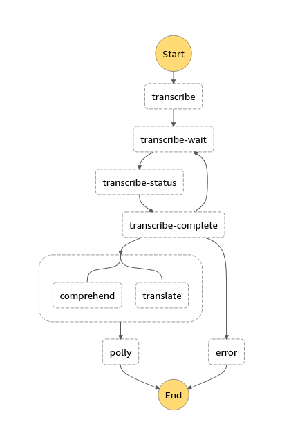

## Examples
### Full data engineering pipeline real time layer
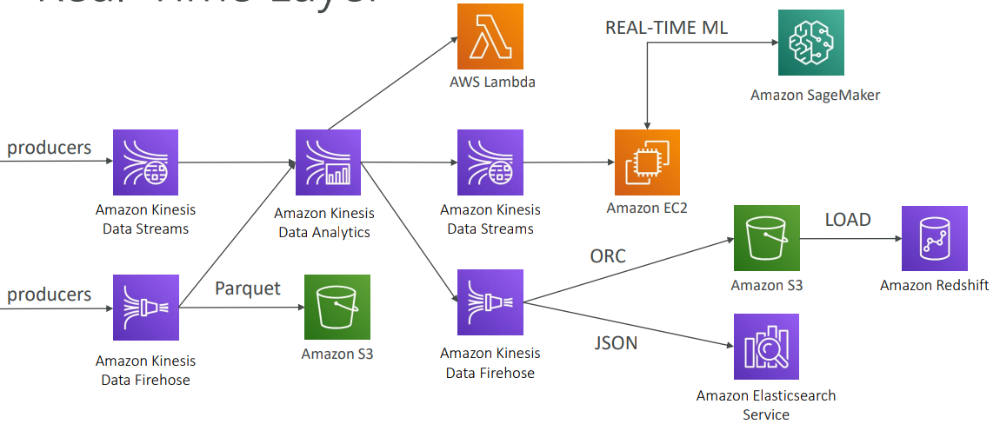

### Full data engineering pipeline video layer
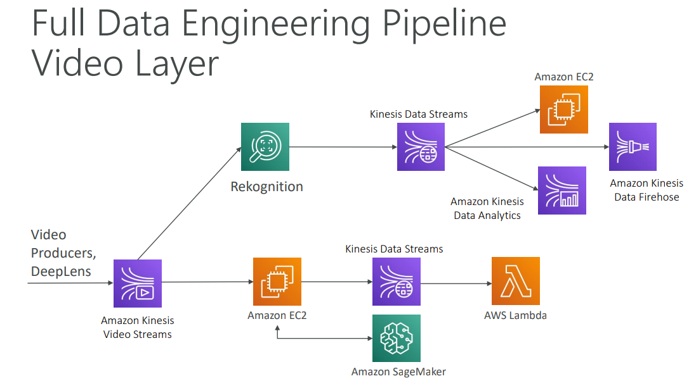

### Full data engineering pipeline batch layer
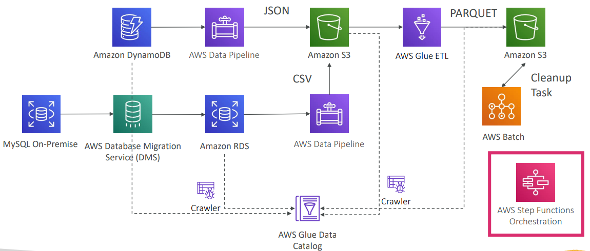

### Full data engineering pipeline analytics layer
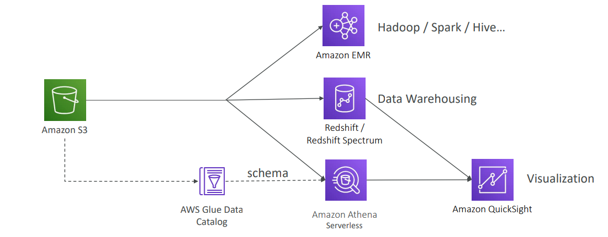

### Normal flow + spike, need cost effectiveness
If we train a model daily with click data to get personalized recommendations:

* publish click data on S3 using Firehose
* process data nightly using Spark & MLLib using spot instances in EMR cluster
* publish model's results to DynamoDB for producing recommendations in real time

### AWS ML services
* build our own Alexa: Transcribe -> Lex -> Polly
* make a universal translator: Transcribe -> Translate -> Polly
* celebrity detector: DeepLens -> Rekognition
* are people on the phone happy?: Transcribe -> Comprehend
