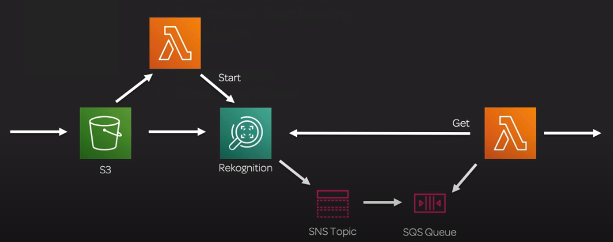
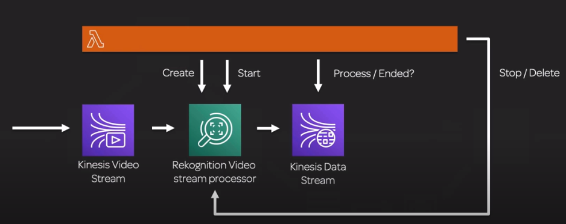

# Amazon Rekognition

## General info
Amazon Rekognition is a simple and easy to use an API that can quickly analyze any image or video file stored in Amazon S3.

All about image and video analysis. It is a pre-trained deep learning model with a simple API.

service that makes it easy to add image analysis to our apps, same technology than Prime Photos

We don't need to provide data, we just give an image and asks "please tell me everything you can about this image".

Rekognition is not the fastest service in the world so if we use lambda, we need to pay attention to the timeout.

Rekognition cannot be used to create labels for training data

Does not support incremental learning but we can use incremental learning with SagemMaker's image classification model

## Use case
* object and scene detection -> can use our own face collection
    * we have results like "looks like a face", "appears to be female", "age range", "smiling" with confidence etc
* image or content moderation: look for things in an image (filtering such as porn filter), can be coupled to Amazon A2I for human review (augmented AI)
    * response with suggestive content or not, what it is and the confidence
* facial analysis: find faces in images, how many are there, what gender is the person, sad/happy face, beards, ...
* celebrity recognition: if we have large amount of video data and we want to know if we have celebrities in them for whatever reason
* face search and verification: we provide a picture of a face and we ask, can you find this person on the image ? useful for security
* text in image: OCR => image to text. Useful if we can't filter based on the text image directly, we extract it then analyze it
* image labeling (object and scene detection)
    * detect persons, bike, car, ... in an image but can also detect activities such as delivering a package or playing football
    * custom labels: extend the detection with something unique for our business
* pathing: keep track of people movement in a video (football match, ...)

Returns metadata with the info from the image for example, bounding boxes with confidence

## Input
* images come from S3 or provide image bytes as part of request -> S3 faster if image already there
* facial recognition depends on good lighting, angle, visibility of eyes, resolution
* video must come from Kinesis Video Streams
    * h.264 encoded
    * 5-30 FPS
    * favor resolution over framerate
* can use with Lambda to trigger image analysis upon upload

### Real life scenario
* create a filter to prevent inappropriate images being sent via a messaging platform (nudity, offensive text)
* enhance metadata catalog of an image library to include the number of people in each image
* scan an image library to detect instances of famous people
* Detect people of interest in a live video stream for a public safety application.
* Create a metadata catalog for a stock video footage library.
* Detect offensive content within videos uploaded to a social media platform.

## Rekognition Custom Labels
* train with a small set of labeled images -> reuse the existing network and add our stuff
* use our own labels for unique items
* example: the NFL uses custom labels to identify teams, logos, pylons and foam fingers in images

## API
### Text in image
We can use a bucket or binary stream for the image.

The lambda needs lambda execution (cloudwatch logs), read only perm for S3 + rekognition:DetectText

```python
import boto3

def lambda_handler(event, context):
    rekognition = boto3.client('rekognition')
    response = rekognition.detect_text(
        Image = {
            'S3Object': {
                'Bucket': 'xxxx',
                'Name': 'xxx'    
            }           
        }
    )

    text = ''
    for detection in response['TextDetections']:
        if detection['Type'] == 'WORD':
            text += f'{detection["DetectedText"]} '

    return {
        'statusCode': 200,
        'body': text.strip()
    }
```

### Facial comparison
```python
import boto3

def lambda_handler(event, context):
    rekognition = boto3.client('rekognition')
    
    results = list()
    for suspect in ['suspect1.jpg', 'suspect2.jpg', 'suspect3.jpg']:
        response = rekognition.compare_faces(
            SourceImage = {
                'S3Object': {
                    'Bucket': 'xxxx',
                    'Name': suspect
                }         
            },
            TargetImage = {
                'S3Object': {
                    'Bucket': 'xxxx',
                    'Name': 'xxx'    
                }    
            }   
        )

        if len(response['FaceMatches']) > 0:
            results.append({'suspect': suspect, 'is_match': 'yes', 'Similarity': response['FaceMatches'][0]['Similarity']})
        elif len(response['UnmatchedFaces']) > 0:
            results.append({'suspect': suspect, 'is_match': 'no'})

    return {
        'statusCode': 200,
        'body': results
    }
```

## Video
Similar to image analysis but architecture is a little bit different. Works on stored videos (S3) or streaming videos.
It analyzes one frame at a time.

### Stored videos


The key component that can be easily changed is the lambda function (could be replaced by EC2).

Since rekognition can take a long time, especially for video. The input lambda fires the request and terminates. The results are sent to SNS then SQS to decouple the architecture.
Another lambda picks up the results from Rekognition once the job is done.

### Streaming videos


The long lambda is just a monitoring of the task, this could be done with something else like EC2, Step Functions, ...

We put the events from Rekog video stream processor to Kinesis Data Stream. Based on the events, a lambda detects that the stream is finished and the processor should be stopped and destroyed.

### Real life scenario
* detect people of interest in a live video stream for a public safety application
* create a metadata catalog for stock video footage library
* detect offensive content withing videos uploaded to a social media platform

## Exam tips
For exams, we should always try to use managed services as much as possible instead of creating our own models.

## Billing
pay per image analysis and face metadata we store

## Resources

FAQ:  https://aws.amazon.com/rekognition/faqs/

CLI: https://docs.aws.amazon.com/cli/latest/reference/rekognition/index.html

