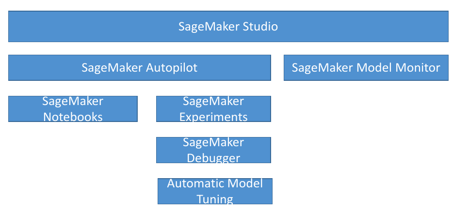
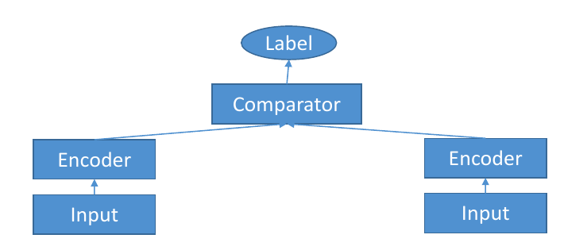
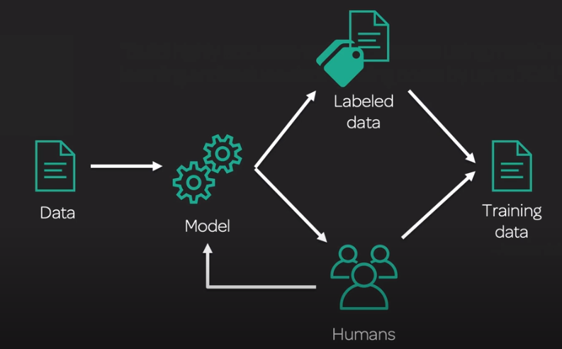
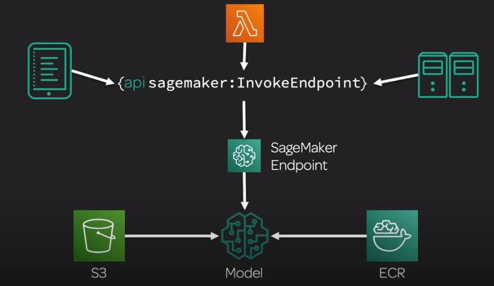
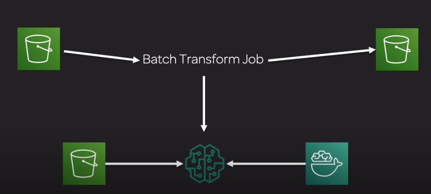
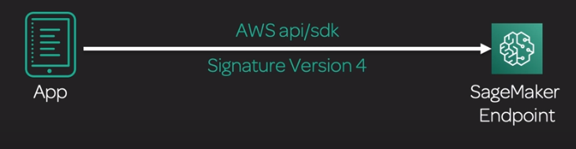
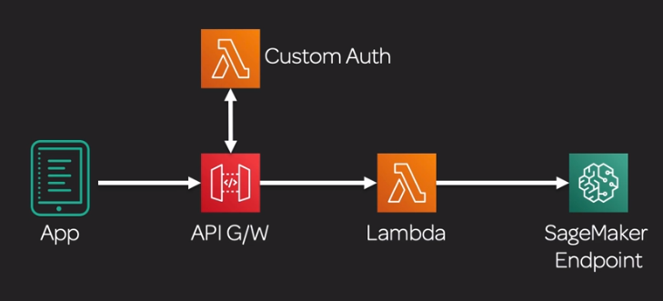

# Amazon SageMaker

## General info
fully managed platform for building, training and deploying ML models at any scale

includes modules that can be used together or independently

It is almost possible to spend all our time in SageMaker and get everything done (build, train, deploy, ...). SageMaker is a fully
managed service that covers the entire ML workflow 

* fetch, clean, label and prepare data
* choose algo
* train & evaluate model
* tune and optimize it for deployment
* deploy model, make predictions and take action

The deployment can be done with 1 API call for load balancing, EC2 fleet, ...

Amazon SageMaker' supervised algo that requires a CSV file, the CSV file must  

* not have a header record
* must have the target variable in the first column.

To run unsupervised learning algorithms that don't have a target, specify the number of label columns in the content type. For example, in this case text/csv;label_size=0.

Most algorithms support RecordIO and CSV format.

If we want to use record io format, we need to put ContentType application/x-recordio-protobuf in the input channel data

## S3 & Data
* contains training data
* stores model artifacts: model.tar.gz (configured in OutputDataConfig S3OutputPath in create_training_job call)

Improve training performance:

* change data format to protobuf recordIO format
* use pipe moode to stream data from S3

If we need to process 1TB of CSV from SageMaker but we are limited to 5GB disk space, we can shuffle the training data and create a 5GB slice of this shuffled data.
Build the model on jupyter notebook using this slice of training data. Once the evaluation metric looks good, create a training job on SageMaker infrastructure with the appropriate instance types
and instance counts to handle the entire training data.

## SageMaker architecture
* training
    * retrieve training data from S3
    * retrieve training code image from ECR
    * stores model artifacts on S3
* deployment/hosting
    * retrieve model artifacts on S3
    * retrieve inference code image on ECR
    * create an endpoint
* infer: client apps call endpoint which calls the model for inference

## SageMaker and Docker containers
* all models in SageMaker are hosted in Docker containers
    * pre-built deep learning
    * pre built scikit learn and Spark ML
    * pre built tensorflow, mxnet, chainer, pytorch
        * cannot support multi GPU alone
    * our own training and inference code or we can extend a pre-built image
* this allows us to use any script or algorithm within SageMaker regardless of runtime or language
    * containers are isolated and contain all dependencies and resources needed to run
    
**If we have additional functional requirements for an algorithm or model we developed in a framework for a pre-built Amazon SageMaker Docker image, we can modify an Amazon SageMaker image.**

Main scenarios for running scripts, algo, models in SageMaker:

* build own custom container image: You can package your own script or algorithm to use with Amazon SageMaker in a Docker container as long as you follow certain contractural requirements for the container.
* use pre built container images: Amazon SageMaker provides pre-built containers to support deep learning frameworks such as Apache MXNet, TensorFlow, PyTorch, and Chainer. 
Machine learning libraries, such as scikit-learn and SparkML, are also supported by providing pre-built Docker images. Additionally, Amazon SageMaker SDK estimator classes are deployed when using the Amazon SageMaker Python SDK.
* use built in algorithm: Amazon SageMaker provides built-in algorithms hosted in Docker containers behind the scenes (we do not deal with them directly).
* extend a pre built image: If you have additional functional requirements for an algorithm or model that you developed in a framework for a pre-built Amazon SageMaker Docker image, you can modify an Amazon SageMaker image.

If we want to train on multiple GPU, we need to use

* Horovod: a distributed deep learning training framework that works with TensorFlow, Keras, PyTorch, and Apache MXNet. It is designed for speed and ease of use.
* Parameter servers: use one or more dedicated processes to collect gradients computed by 'worker' processes, 
then aggregate them and distribute the updated gradients back to the workers in an asynchronous manner

If we don't have internet access all the time, we can still use sagemaker. We create a docker compose (nvidia docker) environment to create our algo and we push it
to ECS and train on sagemaker when we have internet.

### Using Docker
* docker containers are created from images (train & inference are different)
* images are built from a Dockerfile
* images are saved in a repository -> Amazon ECR

### Amazon SageMaker containers
Docker for training and inference are different. We can use Amazon Sagemaker Containers tool to create containers. 
Amazon SageMaker Containers is a library that implements the functionality we need to create containers to run scripts, 
train algorithms, or deploy models compatible with Amazon SageMaker.

* env variable SAGEMAKER_PROGRAM: entry point for Script Mode, script must be located in /opt/ml/code
* RUN pip install sagemaker-containers in our Dockerfile

### Structure
#### Training container
/opt/ml/input/config/hyperparameters.json

/opt/ml/input/config/resourceConfig.json

/opt/ml/input/data/\<channel_name\>/\<input data\>

* train: training data folder
* validation: validation data folder
* train_lst: training label
* validation_lst: validation label
* model: if we want to do transfer learning

/opt/ml/model -> used to store the model for inference

/opt/ml/code/\<script files\> -> preprocessing of data before training, script file to start training

/opt/ml/output/failure -> we should put failure information there

#### Inference container
/opt/ml/model -> and model files in it, where the artifacts are (data, config, model)

#### Our docker image
/opt/program (where the code is) with the following files

* nginx.conf -> nginx conf proxy
* predictor.py -> flask web server to make predictions at runtime. Need to be updated to match our needs
* serve/ -> deployment stuff, program in there will be started when the container is started for hosting. Launches gunicorn server which runs multiple instances of a flask app
* train/ -> training stuff
* wsgi.py -> small wrapper that's used to invoke our flask app for serving results
    
```dockerfile
FROM tensorflow/tensorflow:2.0.0

RUN pip install sagemaker-containers
COPY train.py /opt/ml/code/train.py
ENV SAGEMAKER_PROGRAM train.py
```

```bash
cd dockerfile
!docker build -t my_custom_docker_image .

from sagemaker.estimator import Estimator
estimator = Estimator(image_name='my_custom_docker_image', role='sage maker role', train_instance_count=1, train_instance_type='local')
estimator.fit()
```

##### Inference Requirements
Our inference container must respond to /invocations and /ping on port 8080 and ping requests in under 2s. 
Model artifacts need to be compressed in tar format, not zip.

All sockets connection requests must be accepted within 250ms

#### Environment variables
* SAGEMAKER_PROGRAM: run a script inside /opt/ml/code
* SAGEMAKER_TRAINING_MODULE & SAGEMAKER_SERVICE_MODULE: where we are going to be loading up the tensorflow, mxnet or whatever and modules
* SM_MODEL_DIR: model checkpoints are saved and pushed into S3
* SM_CHANNELS / SM_CHANNEL_*: channel train, test, validation
* SM_HPS / SM_HP_*: hyperparameters
* SM_USER_ARGS
* and many more

## AWS SageMaker control - console, SDK and notebooks
We can interact with sagemaker through the console. We can use cloudformation to create the environment needed for sagemaker
but sagemaker already does that for us with the SDK.

For example, CreateTrainingJob requires instance count parameter which will automatically deploy the number of instances
and load balance them automatically. This is created automatically.

Controlled also with jupyter notebooks which can be local or remote (training on another instance).

Note that we have boto3 which is one for one the API SDK but we also have sagemaker python SDK (higher level).

=> we can use SageMaker SDK, Jupyter Notebooks and SageMaker console to train a SageMaker model

```python
import sagemaker
import keras
from keras.datasets import mnist

sess = sagemaker.Session()
role = sagemaker.get_execution_role()

prefix = 'keras_mnist'
sess.upload_data(data archive, key_prefix=prefix + "blabla")

!pygmentize our_script.py

estimator... 
fit()
predictor.predict()

tuner = HyperparameterTuner(estimator, ...)

sess.delete_endpoint(endpoint_name="endpoint name")
```

* pygmentize: make it compatible for training
* the script that we execute for training, must have a __main__ containing the training logic needed


### High level sagemaker SDK of estimators
* predict(): used for real time inference
* deploy(): deploy the model behind a sagemaker endpoints
* fit(): train a sagemaker model
* transform(): on the sagemaker.transformer.Transformer object, need argument output_path to know where to put the inferences in S3

## Amazon Elastic Inference
Amazon Elastic Inference (EI) is a resource we can attach to your Amazon EC2 CPU instances to accelerate our deep learning (DL) 
inference workloads. Amazon Elastic Inference allows us to attach GPU-powered acceleration to many 
Amazon machine instances to reduce the cost of running deep learning inference (up to 75%). 
Amazon Elastic Inference supports TensorFlow, Apache MXNet, and ONNX models through MXNet.

=> speed up throughput and decrease latency for a fraction of the cost of using a GPU instance for the endpoint

### GPU
If we want GPU for training and inference, we need to to be using

* supported ML algorithms that use GPU for both training and inference
* the correct instance type that supports GPU

There is no such thing as a GPU flag in the SDK or in the docker image of the sagemaker algorithm!

## AWS SageMaker notebooks
Notebooks can be Stopping, Stopped, Pending, InService, Deleting. We can either open notebooks in Jupyter or JupyterLab.
When we click on Jupyter, a presigned URL is generated under the hood. 
**We need to be logged in in order to have access to the notebook, we cannot give the link to somebody else**

Once the notebook is started, we have access to sagemaker examples (directly from the github). If we choose to use them, 
they are copied into our notebook instance.

An Amazon SageMaker notebook instance is a fully managed ML compute instance running the Jupyter Notebook App. 
Amazon SageMaker manages creating the instance and related resources. We can then use Jupyter notebooks in our notebook instance 
to prepare and process data, write code to train models, deploy models to Amazon SageMaker hosting, and test or validate our models.


* Notebook instances: 
    * we can have a small notebook instance for playing and trigger big training job on other instances
    * we need a role with sage maker full acess, s3 read/write, ...
    * root access or not ?
    * encrypt data or not ?
    * network is important because we can select where the notebook will be. We need to put a VPC with S3 endpoint
* lifecycle configuration: very much like bootstrap scripts that we can use on EC2 instances
    * bash script that is executed when creating notebooks or starting notebooks
* git repositories

## Apache Spark with SageMaker
* pre process data as normal with Spark -> Generate DataFrames and process it on a cluster
* use sagemaker-spark library
* SageMakerEstimator: KMeans, PCA, XGBoost
* SageMakerModel
* connect notebook to a remote EMR cluster running Spark (or use Zeppelin)
* training dataframe should have
    * a feature column that is a vector of Doubles
    * an optional labels column of Doubles
* call fit on our SageMakerEstimator to get a SageMakerModel
* call transform on the SageMakerModel to make inferences
* works with Spark Pipelines as well

=> allows us to combine pre processing big data in Spark with training and inference in SageMaker (best of both worlds)

## SageMaker Studio
* visual IDE for ML
* integrates many features
    * SageMaker Notebooks
        * create and share jupyter notebooks with Studio
        * switch between hardware configurations (no infrastructure to manage)
    * SageMaker experiments
        * organize, capture, compare and search our ML jobs
    * SageMaker debugger
        * saves internal model state at periodical intervals
            * gradients / tensors over time as a model is trained
            * define rules for detecting unwanted conditions while training
            * a debug job is run for each rule we configure
            * logs & fires a CloudWatch event when the rule is hit
    * SageMaker Autopilot
        * automates
            * algo selection
            * data preprocessing
            * model tuning
            * all infrastructure
        * does all the trial & error for us
        * more broadly, this is called AutoML
    * SageMaker Model Monitor
        * get alerts on quality deviations on our deployed models
        * visual data drift: loan model starts giving people more credit due to drifting or missing input features
        * no code needed
        


## Built-in Algorithms
They can come from built-in algo in SageMaker, the AWS Marketplace or custom.

### Common parameters for built-in algo
https://docs.aws.amazon.com/sagemaker/latest/dg/sagemaker-algo-docker-registry-paths.html

If deep learning -> use GPU, mostly train on single GPU instance

Channel: train for all, optional test for all unsupervised algo 

All algos file+pipe except DeepAR (JSON, Parquet), IP Insights (CSV), Object2Vec (JSON) and Seq2Seq modeling (recordIO) 

Nont parallelizable: most NLP algo + semantic segmentation and k-means

* BlazingText
* LDA
* Object2Vec
* Seq2Seq modeling
* k-means
* Semantic Segmenation


### Incremental training
Over time, you might find that a model generates inference that are not as good as they were in the past. 
With incremental training, you can use the artifacts from an existing model and use an expanded dataset to train a new model. 
Incremental training saves both time and resources.

Only three built-in algorithms currently support incremental training (=> only computer vision algo): 

* Object Detection
* Image Classification
* Semantic Segmentation

Use case:

* train a new model using an expanded dataset that contains an underlying pattern that was not accounted for in the previous training
* use the model artifacts from a popular publicly available model in a training job
* resume training job that was stopped
* train several variants of a model (different hyperparameters settings or using different datasets)

=> only file input mode for incremental training. This is different than Record wrapper where we can have RecordIO if it is the format for the dataset

In sagemaker SDK, the model_uri drives the incremental learning mode
```python
incr_ic = sagemaker.estimator.Estimator(training_image,
                                        role,
                                        train_instance_count=1,
                                        train_instance_type='ml.p2.xlarge',
                                        train_volume_size=50,
                                        train_max_run=360000,
                                        input_mode='File',
                                        output_path=s3_output_location,
                                        sagemaker_session=sess,
                                        hyperparameters=hyperparams,
                                        model_uri=ic.model_data) # This parameter will ingest the previous job's model as a new channel
incr_ic.fit(inputs=data_channels, logs=True)
```

### Network isolation
SageMaker training and deployed inference containers are internet enabled by default (allows access to external services and resources on the public internet).

Network isolation prevents containers from accessing resources (training and inference). 
Some algorithms need access (at least to S3) and are therefore not compatible with this network isolation:

* SageMaker reinforcement learning
* Pytorch
* scikit-learn
* chainer

For network isolation, use boolean EnableNetworkIsolation during creation of training job. This will block all access, even to S3.

### Machine Learning
#### K-Means
based off web scale k-means clustering algorithm, find discrete groupings within data

* unsupervised clustering
* divide data into K groups where members of a group are as similar as possible to each other
    * we define what similar means
    * measured by euclidian distance (need normalized features)

##### Input
* supports recordIo and csv
* file or pipe on either
* train channel, optional test
    * train ShardedByS3Key (efficient wiith multi machine), test FullyReplicated (we need all data for testing)

##### How is it used?
* every observation mapped to n-dimensional space (n = number of features)
* works to optimize the center of K clusters
    * extra cluster centers may be specified to improve accuracy which end up getting reduced to k
    * K = k * x
* algorithm
    * determine initial cluster centers
        * random: pick k centroid at random
        * kmeans++: pick one point at random for the center, pick the second point as far away as possible from the first point and so on (tries to make initial clusters far apart)
    * iterates over training data and calculate cluster centers
    * reduce clusters from K to k -> using Lloyd's method with kmeans++
    
##### Instance types
* CPU or GPU but CPU recommended
    * only one GPU per instance used on GPU
    * so use p*.xlarge if we are going to use GPU
    
##### Hyperparameters
* feature_dim: number of features input data
* extra_center_factor
* init_method
* k: number of required clusters
    * choosing K is tricky
    * plog within cluster sum of squares as function of K
    * use elbow method
    * basically optimize for tightness of clusters
* usual epochs, eval_metrics (msd, ssd), mini_batch_size

#### K-nearest neighbors (KNN)
* dimension reduction ?
* classification: find the K closest points to a sample point and return the most frequent label
* regression: find the K closest points to a sample point and return the average value

The algorithm uses an index based algorithm and the training data stays in memory so it is memory bound

##### Input
* train channel contains our data
* test channel emits accuracy or MSE
* recordsio-protobuf or CSV training (first column is label)
* file or pipe mode on either

##### How is it used?
* data is first sampled
* sagemaker includes a dimensionality reduction stage
    * avoid sparse data (curse of dim)
    * at cost of noise/accuracy
    * sign or "fjlt" methods
* build an index for looking up neighbors
* serialize the model
* query the model for a given K

##### Instance types
* training on CPU or GPU
    * ml.m5.2xlarge
    * ml.p2.xlarge
* inference
    * CPU for lower latency
    * GPU for higher throughput on large batches

##### Hyperparameters
* feature_dim: number of features in the input data
* k: number of nearest neighbors -> need to experiment to find diminishing values of K
* predictor_type: classifier for classification or regressor for regression
* sample_size: number of data points to be sampled from the training data set
* dimension_reduction_target: between 0 and feature_dim

#### Linear learner
* numeric
    * linear regression -> fit line, predictions based on that line
* classification (linear threshold function is used) => only valid if we can fit a line in our data
    * binary classification: 0 or 1
    * multiclass classification: between 0 and num_classes - 1

The Amazon SageMaker Linear Learner algorithm provides a solution for both classification and regression problems. (=> not totally similar to linear regression)
With the Amazon SageMaker algorithm, we can simultaneously explore different training objectives and choose the best solution 
from a validation set. We can also explore a large number of models and choose the best. The best model optimizes either of the following:

Metrics: mean square error (MSE), cross entropy loss, absolute error / F1 score, precision, recall, accuracy

##### Input
* process recordIO-protobuff format: float32 data only
* CSV: first column assumed to be the label
* supports file and pipe mode

##### How is it used?
* preprocessing
    * training data must be normalized (so all features are weighted the same)
    * linear learner can do this for us automatically
    * input data should be shuffled
* training
    * uses stochastic gradient descent
    * choose an optimization algo (Adam, AdaGrad, SGD, etc)
    * multiple models are optimized in parallel
    * tune L1, L2 reg
* validation
    * most optimal model is selected
    
##### Instance types
* training
    * single or multi machine CPU or GPU
    * multi GPU does not help

##### Hyperparameters
* balance_multiclass_weights: gives each class equal importance in loss functions
* learning_rate
* mini_batch_size
* predictor_type: binary_classifier, multiclass_classifier, regressor
* feature_dim: number of features in input data
* num_classes: required if predictor_type is multiclass_classifier
* accuracy_top_k: for top k accuracy for multi class classification
* beta_1 and beta_2: for adam optimizer
* bias_lr_mult: allows a different LR for the bias term
* L1 reg
* wd: weight decay (L2 reg)

#### Principal Component Analysis (PCA)
* reduce dimensionality (number of features) of the data
    * project higher dimensional data (lots of features) into lower dimensional (like a 2D plot) while minimizing loss of information
    * the reduced dimensions are called components
        * first component has largest possible variability
        * second component has next larges
* unsupervised

##### Input
* recordio-protobuf or CSV
* file or pipe on either

##### How is it used?
* covariance matrix is created then singular value decomposition (SVD)
* two modes
    * regular: sparse data and moderage number of observations and features (small dataset)
    * randomized: large number of observations and features, uses approximation algorithm (big dataset)
    
##### Instance types
* GPU or CPU: it depends on the specifics of the input data

##### Hyperparameters
* substract_mean: unbias data
* feature_dim: input dimension
* mini_batch_size: number of rows in mini batch
* num_components: number of PC to compute
* algorithm_mode: regular or randomized

#### eXtreme Gradient Boosting (XGBoost)
grandient boosted trees algorithm, supervised learning, predict target variable by combining an ensemble of estimates from a set of simpler, weaker models

* boosted group of decision trees
* new trees made to correct the errors of previous trees
* uses gradient descent to minimize loss as new trees are added
* fast
* can be used for classification (binary, multi class)
* can be used for regression (regression trees)
* can be used for ranking

##### Input
* xgboost is weird since it is not made for sagemaker, it is just open source xgboost
* only takes text/libsvm & text/csv => not a sagemaker algorithm
* no protobuf (recordio)

##### How is it used?
* models are serialized/deserialized with Pickle
* can use a framework within notebooks: 
    * Sagemaker.xgboost: this means that we can deploy directly from a notebook
    * as a built-in sagemaker algorithm: docker in ECR then deploy

##### Instance types
* only trains using CPUs
* is memory bound, not compute bound
* M4 is a good choice

##### Hyperparameters
* num_round (required): number of rounds to run during training
* num_classes (required): number of classes, required if objective is set to multi:softmax or multi:softprob
* alpha: L1 reg term on weights; larger = more conservative
* lambda: L2 reg term; larger = more conservative
* base_score: initial prediction score of all instances, global bias
* booster: which booster to use ? 
    * gbtree and dart: tree based model
    * gblinear: linear function
* subsample: prevents overfitting
* eta: step size shrinkiage, prevents overfitting
* gamma: minimum loss reduction to create a partition; larger = more conservative

To tune hyperparameters, we can use

* k-fold validation: split dataset in k-parts, each part is used as holdout set for k-training runs
* holdout set (= validation set): part of the data set aside manually by data scientists to not be part of the training

### NLP
For machine translation, we first need to tokenize our words into integers which refer to vocabulary files that we must provide.

#### BlazingText
Text classification (supervised)

* predict labels for a sentence !!!! not a document
* useful in web searches, information retrieval
* Comprehend

Word2vec (unsupervised)

* creates a vector representation of words -> word2vec algorithm maps words to high-quality distributed vectors
* semantically similar words are represented by vectors close to each other => **word embedding**
* useful for NLP but is not an NLP algo in itself
* order of words don't matter as it uses skip-gram and continuous bag of words (cbow) architectures
* used in machine translation, sentiment analysis
* **it only works on individual words, not sentences or document!**

The Amazon SageMaker BlazingText algorithm provides highly optimized implementations of the Word2vec and text classification algorithms. 
The Word2vec algorithm is useful for many downstream natural language processing (NLP) tasks, such as 

* sentiment analysis (RNN can be used for this as well)
* named entity recognition, machine translation, etc.

A word2vec/text classification algorithm that can be used for the following.

- Natural language processing (NLP)
- Sentiment analysis
- Named entity recognition
- Machine transalation

##### Input
* for supervised (text classification)
    * one sentence per line
    * first word in the sentence is the string __label__ followed by the label: __label__4 linux ready for prime time , intel says , ...
        * the tokens within the sentence, including the punctuation, must be space separated !
* also augmented manifest text format (json)
* word2vec (unsupervised) just wants a text file with one training sentence per line

##### How is it used?
* word2vec has multiple modes
    * cbow (continous bag of words): word order does not matter, we lose the order information
    * skip-gram: n-grams so the order actually does matter in that case
    * batch skip-gram: distributed computation over many CPU nodes
    
cbow and skip-gram are the modes supported while running the word2vec implementation of the SageMaker BlazingText algorithm on a single GPU instance.

##### Instance types
* for cbow and skipgram, recommend a single ml.p3.2xlarge: any single CPU or single GPU instance will work
* for batch_skipgram: can use single or multiple CPU instances -> horizontal scaling
* for text_classification, c5 recommended if less than 2GB training data. For larger datasets, use a single GPU instance (ml.p2.xlarge or ml.p3.2xlarge)

##### Hyperparameters
* word2vec
    * mode: batch_skipgram, skipgram (GPU ok), cbow (GPU ok)
    * learning_rate
    * window_size
    * vector_dim
    * negative_samples
* text classification
    * epochs
    * learning_rate
    * word_ngrams & vector_dim: to know how many words we are going to look at together

* batch_size: size of mode when batch_skipgram
* evaluation: evalute trained model with WordSimilarity-353 test
* min_char: min char for ngrams
* min_count: words with frequency less than min_count are discarded
* the usual: epochs, learning_rate, early_stopping, patience, ...
    
the correct metric while tuning hyperparameters for Blazing Text algo in the unsupervised mode (word2vec) is **train:mean_rho** for modes

* skipgram
* cbow
* batch_skipgram

The metric **validation:accuracy** is the metric to used in supervised mode (text classification algo)

#### Object2Vec
* similar to word2vec but for arbitrary objects
* capable of creating embeddings for arbitrary objects such as Tweets. BlazingText can only find relationships between individual words, not entire sentences like tweets.
* creates low dimensional dense embeddings of high dimensional objects
* basically word2vec, generalized to handle things other than words (like whole documents if we want)
* compute neares neighbors of objects
* visualize clusters
* genre prediction
* recommendations (similar items or users)
* unsupervised
* Generalization of Word2Vec

can be used to find semantically similar objects such as questions, tickets. BlazingText Word2Vec can only find semantically similar words.

Amazon SageMaker Object2Vec generalizes the Word2Vec embedding technique for words to more
complex objects, such as sentences and paragraphs. 

=> **If the supervised learning task is at the level of whole
sentences/paragraphs, for which there are labels, and no labels are available at the word level, Object2Vec needs be used
instead of Word2Vec**

Amazon SageMaker Object2Vec algorithm is a highly customizable multi-purpose algorithm that can learn low dimensional dense 
embeddings of high dimensional objects. Embeddings are an important feature engineering technique in Natural Language Processing (NLP): 
pre-defined embeddings can be used to efficiently compute nearest neighbors of a given word.

##### Input
* data must be tokenized into integers
* training data consists of pairs of tokens and or sequences of token
    * sentence-sentence pairs: "A soccer game with multiple males playing." and "Some men are playing a sport."
    * labels-sequence pairs: the genre tags of the movie (titanic -> romance and drama) and a short description of the movie
    * customer-customer pairs: The customer ID of Jane and customer ID of Jackie.
    * product-product pairs: The product ID of football and product ID of basketball.
    * items review user-item pairs: A user's ID and the items she has bought, such as apple, pear, and orange.

process training data in the form of a pair of entities:

* (token, sequence)
* (token, token)
* (sequence, sequence)


##### How is it used?
* process data into JSON lines and shuffle it
* train with two input channels, two encoders, and a comparator
* encoder choices
    * average-pooled embeddings
    * CNN
    * bidirectional LSTM
* comparator is followed by a feed forward neural network
* we have two paths going in parallel for each component of that pair (we can have different pairs of different things there) => 2 input channels
    * each channel input has its own encoder and its own input path
    * the two input channels feed into a comparator which generates the ultimate label



##### Instance types
* can only train on a single machine (CPU or GPU, multi GPU ok)
    * ml.m5.2xlarge
    * ml.p2.xlarge
    * if needed, go up to ml.m5.4xlarge or ml.m5.12xlarge
* inference: use ml.p2.2xlarge
    * use INFERENCE_PREFERRED_MODE environment variable to optimize for encoder embeddings rather than classification or regression

##### Hyperparameters
* usual deep learning ones: dropout, early stopping, epochs, learning_rate, batch size, layers, activation function, optimizer, weight decay
* enc1_network, enc2_network: choose hcnn, bilstm, pooled_embedding
* enc0_max_seq_len: maximum sequence length for the enc0 encoder
* enc0_vocab_size: the vocabulary size of enc0 tokens
* dropout: regularization dropout param
* early_stopping_patience & early_stopping_tolerance

#### Latent Dirichlet Allocation (LDA)
Amazon Comprehend,  use cases:

* text analysis
* topic discovery

The Amazon SageMaker Latent Dirichlet Allocation (LDA) algorithm is an unsupervised learning algorithm that attempts to 
describe a set of observations as a mixture of distinct categories. 
LDA is most commonly used to discover a user-specified number of topics shared by documents within a text corpus.

* latent dirichlet allocation
* another topic modeling algo -> not deep learning!
* unsupservised: the topic themsellves are unlabeled; they are just groupings of documents with a shared subset of words
* can be used for things other than words even if it is mostly used with words
    * cluster customers based on purchases
    * harmonic analysis in music

Observations are referred to as documents. The feature set is referred to as vocabulary. A feature is referred to as a word. 
And the resulting categories are referred to as topics.

##### Input
* supports recordIO and CSV
* train channel, optional test channel (unsupervised)
* each document has counts for every word in vocabulary (in CSV format)
* pipe mode only supported with recordIO

Must use recordio and pipe mode for huge dataset.

##### How is it used?
* unsupervised; generates however many topics we specify
* optional test channel can be used for scoring results: per-word log likelihood
* functionally similar to NTM but CPU based -> maybe cheaper / more efficient

##### Instance types
* single instance CPU training

##### Hyperparameters
* num_topics: number of topics to find
* feature_dim: size of vocabulary of the input document corpus
* mini_batch_size: total number of documents in the document corpus
* alpha0: initial guess for the concentration parameter, smaller values generate sparse topic mixtures, larger values (> 1.0) produce uniform mixctures
* max_iterations: max number of iterations during the Alternating Least Squares (ALS)

#### Neural Topic Model (NTM)
Amazon SageMaker NTM is an unsupervised learning algorithm used to organize a corpus of documents into topics that contain word 
groupings based on their statistical distribution. For example, documents that contain frequent occurrences of words 
such as 'bike', 'car', 'train', 'mileage', and 'speed' are likely to share a topic on 'transportation'. 
Topic modeling can be used to classify or summarize documents based on the topics detected, retrieve information, or 
recommend content based on topic similarities.

* organized documents into topics
* classify or summarize documents based on topics
* it is not just TF-IDF
    * "bike", "car", "train", "mileage" and "speed" might classify a document as "transportation" for example (although it wouldn't know to call it that)
* unsupervised: algo is "neural variational inference"

##### Input
* four data channels
    * train is required
    * validation, test, auxiliary are optional
* recordio-protobuf or csv
* words must be tokenized into integers
    * every document must contain a count for every word in the vocabulary in CSV
    * the auxiliary channel is for the vocabulary (maps integers to word)
* file or pipe mode

##### How is it used?
* we define how many topics we want
* these topics are a latent representation based on top ranking words
* one of two topic modeling algo in SageMaker -> we can try them both (LDA) and see which one works best

##### Instance types
* GPU or CPU
    * GPU recommended for training
    * CPU ok for inference
    * CPU is cheaper

##### Hyperparameters
* lowering mini_batch_size and learning_rate can reduce validation loss -> at expense of training time
* feature_dim: vocabulary size of the dataset
* num_topics: number of required topics
* batch_norm: use batch norm during training or not
* encoder_layers_activation: sigmoid, tanh, relu
* epochs & learning_rate

#### Sequence-to-Sequence (seq2seq)
Amazon SageMaker sequence-to-sequence is a supervised learning algorithm where the input is a sequence of tokens (for example, text or audio), 
and the output generated is another sequence of tokens. Example applications include machine translation 
(input a sentence from one language and predict what that sentence would be in another language), 
text summarization (input a longer string of words and predict a shorter string of words as a summary), 
and speech-to-text (audio clips converted into output sentences in tokens).

useful for machine translation, text summarization, speech to text

The expected tokens are integers, not floating points, **only supports RecordIO-Protobuf format** and seq2seq can use both RNN and CNN models

If we want context sensitive spelling correction functionality, we should use seq2seq. n-grams, levenstein distance, word2vec cannot work for this use case.

Used for?

* Input is a sequence of tokens, output is a sequence of tokens
* machine translation
* text summarization
* speech to text
* implemented with RNN's and CNN's with attention

##### Input
* recordio-protobuf: tokens must be integers (unusual since most algo want floating point data)
* start with tokenized text files
* convert to protobuf
    * packs into integer tensors with vocabulary files
* must provide training data, validation data and vocabulary file that it can use to actually map those tokenized files to actual words for encoding
* there are exxamples in sagemaker samples on github

##### How to use
* training for machine translation can take days, even on SageMaker
* pre trained models are available
* public training datasets are available for specific translation tasks

##### Instance types
* can only use GPU instance types (P3, ...)
* can only use a single machine for training BUT can use multi GPU on one machine

##### Hyperparameters
* batch_size: mini batch size for gradient descent
* optimizer_type: adam, sgd, rmsprop
* learning_rate
* num_layers_encoder & num_layers_decoder
* beam_size: length of the beam for beam search

Can optimize on 

* accuracy: vs provided validation dataset
* BLEU score: compares against multiple reference translations (good to use)
* perplexity: cross entropy (good to use)

### Computer vision
#### Image classification algorithm
Image classification algorithm: CNN (Amazon Rekognition), image recognition

* assign one or more labels to an image
* doesn't tell us where objects are, just what objects are in the image

Can run in two modes: full training or transfer learning

The Amazon SageMaker image classification algorithm is a supervised learning algorithm that supports multi-label classification. 
It takes an image as input and outputs one or more labels assigned to that image.

Cannot be used to create labels for training data

##### Input
* Recommended input format: Apache MXNet recordIO -> not protobuf! => this is for interoperability with other deep learning frameworks
* raw jpg or png images
* image format requires .lst files to associate image index, class label and path to the image
* augmented manifest image format enables pipe mode

##### How is it used?
* ResNet CNN under the hood
* full training mode: network initialized with random weights
* transfer learning mode
    * init with pre trained weights
    * the top fully connected layer is initialized with random weights
    * network is fine tuned with the new training data
* default image size is 3 channel 224x224 (ImageNet's dataset)

##### Instance Types
* GPU instances for training (P2 or P3), multi GPU and multi machine OK
* CPU or GPU for inference (C4, P2, P3)

##### Hyperparameters
* usual deep learning hp: batch size, learning rate, optimizer
    * optimizer specific param: weight decay, beta1, beta2, eps, gamma
* num_classes: number of output classes
* num_training_samples: number of training examples in the input dataset
* augmentation_type
    * crop: random crop and horizontal flip
    * crop_color: crop + change color
    * crop_color_transform: crop_color + random transformation such as rotation, ...
* beta_1 and beta_2: config for adam optimizer
* early_stopping: boolean

#### Object detection 
The Amazon SageMaker Object Detection algorithm detects and classifies objects in images using a single deep neural network. 
It's a supervised learning algorithm that takes images as input and identifies all instances of objects within the image scene. 
The object is categorized into one of the classes in a specified collection with a confidence score that it belongs to the class.

* identify all objects in an image with bounding boxes
* detects and classifies objects with a single deep neural network
* classes are accompanied by confidence scores
* can train from scratch or use trained models based on ImageNet

##### Input
* recordIO or image format (jpg or png)
* with image format, supply a JSON file for annotation data for each image

##### How is it used?
* takes an image as input, outputs all instances of objects in the image with categories and confidence scores
* uses a CNN with the Single Shot multibox Detector (SSD) algorithm: the base CNN can be VGG-16 or ResNet-50
* transfer learning mode / incremental training
    * use a pre trained model for the base network weights, instead of random iniitial weights
* uses flip, rescale, and jitter internally to avoid overfitting

##### Instance types
* use GPU instances for training (multi GPU and multi machine OK)
    * ml.p2.xlarge, ml.p2.8xlarge, ml.p2.16xlarge
    * ml.p3.2xlarge, ml.p3.8xlarge, ml.p3.16xlarge
* use CPU or GPU for inference
    * C5, M5, P2, P3 all OK

##### Hyperparameters
* mini_batch_size
* learning_rate
* optimizer: sgd, adam, rmsprop, adadelta
* num_classes: number of output classes
* num_training_samples: number of training samples in input dataset
* base_network: vgg-16, resnet-50, ...
* early_stopping: boolean
* early_stopping_min_epochs, early_stopping_patience, early_stopping_tolerance
* image_shape: auto resize but recommended is 300 and 512 for performance. Note that the format is "3,224,224" for channels,width,height

#### Semantic Segmentation
The Amazon SageMaker semantic segmentation algorithm provides a fine-grained, pixel-level approach to developing computer vision applications. 
It tags every pixel in an image with a class label from a predefined set of classes. 
Tagging is fundamental for understanding scenes, which is critical to an increasing number of computer vision applications, 
such as self-driving vehicles, medical imaging diagnostics, and robot sensing.

* **pixel level object classification**
* different from image classification -> that assigns labels to whole images
* different from object detection -> that assigns labels to bounding boxes
* useful for self driving vehiclles, medical imaging diagnostics, robot sensing
* **produces a segmentation mask**

Cannot be used to create labels for training data

##### Input
* jpg image and png nnotations
* for both training and validation
* label maps to describe annotations
* augmented manifest image format supported for pipe mode
* jpg images accepted for inference

##### How is it used?
* built on mxnet gluon and gluon cv
* choice of 3 algo
    * full convolutional network (FCN)
    * pyramid scene parsing (PSP)
    * deep lab v3
* choice of backbones:
    * resnet50
    * resnet101
    * both trained on ImageNet
* incremental training or training from scratch supported too

##### Instance types
* only GPU supported for training (P2 or P3) on a single machine only
    * specifically ml.p2.xlarge, ml.p2.8xlarge, ml.p2.16xlarge
    * ml.p3.2xlarge, ml.p3.8xlarge, ml.p3.16xlarge
* inference on CPU (C5 or M5) or GPU (P2 or P3)

##### Hyperparameters
* backbone: the architecture like resnet-50
* algorithm
    * fcn: fully convolutional network algo
    * psp: pyramid scene parsing
    * deeplab: deeplab v3 algo
* num_classes: number of classes to segment
* num_training_samples: number of samples in the training data
* crop_size: image size for input during training
* usual early_stopping, ... epochs, learning_rate

### Recommender systems
#### Factorization machine algorithms (FMA)
A factorization machine is a general-purpose supervised learning algorithm we can use for both classification and regression tasks. 
It is an extension of a linear model designed to capture interactions between features within high dimensional sparse datasets economically. 
For example, in a click-prediction system, the factorization machine model can capture click rate patterns observed when ads from a certain ad category are placed on pages from a certain page category. 
Factorization machines are a good choice for tasks dealing with high dimensional sparse datasets, such as click prediction and item recommendation.

* dealing with sparse data
    * click prediction
    * item recommendations
    * since an individual user doesn't interact with most pages / products, the data is sparse
* supervised: classification or regression
* limited to pair-wise interactions: user->item for example
* good for sparse data but doesn't perform dimensionality reduction per se (use PCA for that).

=> for inference, supports application/json and application/x-recordio-protobuf

##### Input
* process recordIO-protobuff float32 format (don't use CSV, impractical for sparse data)

=> use for sparse data, only support RecordIO-protobuf format for training

##### How is it used?
* find factors we can use to predict a classification (click or not? purchase or not?) or value (predicted rating?) given a matrix 
representing some pair of things (users & items?)
* usually used in the context of recommender systems

##### Instance types
* CPU or GPU
    * CPU recommended
    * GPU only works with dense data -> if we have dense data... why are we using FactoMachine in the first place, isn't there something better to use ?

##### Hyperparameters
* initialization methods for bias, factors and linear terms
    * uniform, normal, or constant
    * can tune properties of each method

### Anomaly detection
#### IP Insights algorithm
used to identify a user attempting to log into a web service from an anomalous ip address

* unsupervised learning of IP address usage patterns
* identifies suspicious behavior from IP addresses
    * identify logins from anomalous IP's
    * identify accounts creating resources from anomalous IP's

=> can be used for fraud detection

process feature in pair of entities: (entity, IPv4 address)

##### Input
* Only supports CSV, cannot use parquet or recordIO-protobuf file format
    * entity, ip
* user names, account ID's can be fed in directly, no need to pre process
* training channel, optional validation (computes AUC score)

##### How is it used?
* uses a neural network to learn latent vector representations of entities and IP addresses
* entities are hashed and embedded: need sufficiently large hash size
* automatically generates negative samples during training by randomly pairing entities and IP's

##### Instance types
* CPU or GPU
    * GPU recommended
    * ml.p3.2xlarge or higher
    * can use multiple GPU's
    * size of CPU instance depends on vector_dim and num_entity_vectors

##### Hyperparameters
* num_entity_vectors
    * hash size
    * set to twice the number of unique entity identifiers
* vector_dim
    * size of embedding vectors
    * scales modell size
    * too large results in overfitting
* epochs, learning rate, batch size, etc

#### Random Cut Forest (RCF)
unsupervised algo for detecting anomalous data points within a dataset => data diverge from otherwise well structured or patterned data

* anomaly detection
* unsupervised
* detect unexpected spikes in time series data
* breaks in periodicity
* unclassifiable data points
* assigns an anomaly score to each data point
* based on an algo developed by Amazon that they seem to be very proud of! -> will appear in multiple responses

anomalies can manifest as unexpected spikes in time series data, breaks in periodicity or unclassifiable data points

Amazon SageMaker Random Cut Forest (RCF) is an unsupervised algorithm for detecting anomalous data points within a data set. 
These are observations which diverge from otherwise well-structured or patterned data. 
Anomalies can manifest as unexpected spikes in time series data, breaks in periodicity, or unclassifiable data points.

=> can be used for fraud detection

=> only supports CPU for both training and inference

##### Input
* recordIO-protobuf or CSV
* can use file or pipe mode on either
* optional test channel for computing accuracy, precision, recall, F1 on labeled data (anomaly or not)

##### How is it used?
* creates a forest of trees where each tree is a partition of the training data; looks at expected change in complexity of the trees
as a result of adding a point into it. If we add a point and there is a whole lot of new branches, that's probably anonamly
* data is sampled randomly then trained
* RCF shows up in Kinesis Analytics as well, it can work on streaming data too

##### Instance types
* does not take advantage of GPUs
* use m4, c4, c5 for training
* ml.c5.xl for inference

##### Hyperparameters
* feature_dim: number of features in dataset
* eval_metrics: accuracy, precision_recall_fscore
* num_samples_per_tree: number of random samples given to each tree -> should be chosen such that 1/num_samples_per_tree approximates the ratio of anomalous to normal data
* num_trees: number of trees in the forest, increasing reduces noise

### Time series forecasting
#### DeepAR forecasting
supervised algo for forecasting scalar (1D) time series using RNN.

* forecasting one dimensional time series data
* uses RNN's
* allows us to train the same model over several related time series that are somehow interdependent, it can learn from those relationships
* finds frequencies and seasonality

A good model will capture the:

* trends: continous increases or decreases in a metric's value
* sesonality: reflects periodic (cyclical) patterns that occur in a system

The algorithm is good for forecasting new product performance, we don't have any other good algorithm fit for this use case.

##### Input
* JSON lines format: Gzip or Parquet
* each record must contain
    * start: the starting time stamp
    * target: the time series values
* each record can contain
    * dynamic_feat: dynamic features such as, was a promotion applied to a product in a time series of product purchases
    * cat: categorical features
    
##### How is it used?
* always include entire time series for training, testing and inference
* use entire dataset as training set, remove last time points for testing and evaluate on withheld values
* don't use very large values for prediction length (> 400 data points)
* train on many time series and not just one when possible

##### Instance types
* can use CPU or GPU
* single or multi machine
* start with CPU (c4.2xlarge, c4.4xlarge) then move up to GPU if necessary (only helps with larger models)
* CPU only for inference
* may need larger instances for tuning

##### Hyperparameters
* context_length: number of time points that the model gets to see before making a prediction, should be about the same as the prediction_length. 
Can be smaller than seasonalities; the model will lage one year anyhow
* epoch: maximum number of passes over the training data
* mini_batch_size
* learning_rate
* num_cells: 
* prediction length: number of time-steps that the model is trained to predict (AKA forecast horizon)
* time frequency: granularity of the time series in the dataset (monthly, weekly, daily, hourly, every minute), need an integer and the type -> 1m, 2w, 3d, 1h, 5min

### Reinforcement learning
#### SageMaker RL
In SageMaker:

* uses deep learning framework with tensorflow and mxnet
* supports intel coach and ray rllib toolkits
* custom open source or commercial environments supported
    * matlab, simulink
    * energyplus, roboschool, pybullet
    * amazon sumerian, AWS RoboMaker

Distributed training with SageMaker RL

* can distribute training and/or environment rollout
* multi core and multi instance

##### Instance types
* no specific guidance given in developer guide
* but it is deep learning so GPU are helpful
* supports multiple instances and cores

##### Hyperparameters
* parameters of our choosing may be abstracted
* hyperparameter tuning in SageMaker can then optimize them

## The three stages of SageMaker
- Build (preprocessing, Amazon SageMaker Ground Truth, and notebooks)
- Train (Using built-in and custom algorithms, hyperparameter tuning, notebooks, and infrastructure)
- Deploy (Real-time and batch deployments, notebooks, infrastructure, and Amazon SageMaker Neo)

### Build
It is really important to have a good business understanding of the problem we are trying to solve.
We need to have a goal in mind. Without that, we can't select the correct algorithm, the right data processing and so on.
There is no algorithm for which we can say here is our data, find the solution, even with unsupervised learning.

#### Data Pre processing
* visualize: sanity check to make sure that the data looks like what we should expect
    * visually: matplotlib, seaborn
    * kmeans clustering: get hindsights of our data to maybe add new categories and try other algo
* explore: figure out if we need to manipulate the data in any way
    * visual analysis
    * statistical analysis
* feature engineering
    * directly in notebook if small
    * EMR for huge dataset
* synthesize
    * skewed datasets so get more data or create more data that makes sense
    * data augmentation with images: rotate, contrast, colors, ...
* convert files like csv to recordIO / numpy array etc
* change structure if needed, combine multiple files into one, ...
* split the data if it is needed (train, validation, test)

We can use SageMaker notebooks to import data from EMR or other services like S3. We can also use SageMaker algorithms, 
not for training but for visualizing the data (PCA, Kmeans algo, ...).

#### Amazon Mechanical Turk
Amazon Mechanical Turk (MTurk) is a crowdsourcing marketplace designed to makes it easier to outsource processes and jobs 
to a distributed workforce who can perform these tasks virtually. This could include anything from conducting 
simple data validation and research to more subjective tasks like survey participation, content moderation, and more. 
MTurk enables companies to harness the collective intelligence, skills, and insights from a global workforce to streamline business processes, 
augment data collection and analysis, and accelerate machine learning development.

#### Amazon Ground Truth
Amazon SageMaker Ground Truth offers access to public and private human labelers and provides them with built-in workflows 
and interfaces for common labeling tasks. Additionally, SageMaker Ground Truth can lower our labeling costs by up to 70% using automatic labeling, which works by 
training Ground Truth from data labeled by humans so the service learns to label data independently.

Use it when we don't have training data at all and it needs to be generated by humans first (image classification dataset) IF humans can infer easily
=> Ground Truth manages humans who will label our data for training purposes

easy access to public (team somewhere else) and private human labelers (our team) and provides them with built-in workflows and interfaces for common labeling tasks

* under the hood, mechanical turk is used
* we can define work instructions

can use automatic labeling, service learns to label data independently from labels created by humans.

If the service has high confidence -> auto labelling of raw data, if not it transfers the labelling to humans



The first step is to pass it to a model pre trained by Amazon and then export labeled data or check with humans.

We have a high confidence that the training data is top quality.

If we need to analyze videos with sagemaker and we don't have training data, we need to use ground truth to first create labels for the training videos.
Then the labeled videos can be used to train the downstream SageMaker model for the image processing. 
=> Rekognition or Kinesis Video Streams or an unsupervised learning algorithm cannot be used to create labels for the training videos. 

Other ways to generate training labels:

* Rekognition 
    * AWS service for image recognition
    * auto classify images
* Comprehend
    * AWS service for text analysis and topic modeling
    * auto classify text by topics, sentiment
* any pre trained model or unsupervised technique that may be helpful

##### More than human labeling
Ground Truth is more than human labeling! 

* creates its own model as images are labeled by people
* as this model learns, only images the model isn't sure about are sent to human labelers
* build highly accurate training datasets for ML and reduce data labeling costs by up to 70% -> still expensive

Human labelers are

* Mechanical Turk
* our own internal team -> if we have sensitive data
* professional labeling companies -> cost more

### Train 
#### Architecture of algorithms
SageMaker uses Amazon ECS to host the algorithms in docker images and s3 to handle data (input/output).
The data can also come from Amazon EFS and Amazon FSx for Lustre (high throughput interface for data stored in S3).

ML docker containers:

* sagemaker built in algorithms
* aws deep learning containers
* aws marketplace
* custom (our own)

Training options

* built in training algo
* Spark MLLib
* custom python tensorflow/mxnet/pytorch code
* our own docker image
* algo from AWS market place

If we build it without the console, we need to know where the training image and inference image are located (in which ECR).
Need to check the documentation to know that, they are not all in the same account (one account per region)

During training, SageMaker starts EC2 instance then pulls docker containers and data from S3.

The model is then stored in S3.

##### Training input mode
File: normal files (image, text files, ...)

Pipe: RecordIO definition of our data

Amazon SageMaker Pipe mode streams the data directly to the container, which improves the
performance of training jobs. In Pipe mode, your training job streams
data directly from Amazon S3. Streaming can provide faster start times for training jobs and better throughput.
With Pipe mode, you also reduce the size of the Amazon EBS volumes for your training instances. 

Each algorithm has different needs, sometimes we need to have a GPU for training for instance: https://docs.aws.amazon.com/sagemaker/latest/dg/sagemaker-algo-docker-registry-paths.html

Is the algo parallelizable ? can we split the training jobs into multiple instances or not

##### EC2 instances types
AWS recommends for training

* ml.m4.xlarge, ml.m4.4xlarge, ml.m4.10xlarge (CPU)
* ml.c4.xlarge, ml.c4.2xlarge, ml.c4.8xlarge (CPU)
* ml.p2.xlarge, ml.p2.8xlarge, ml.p2.16xlarge (GPU) - more expensive but faster

All the other values in the exams are wrong values (no h1, a1, ...)

Note that we can have the notebook on a small instance and only do the training on a big instance

We can manually attach GPU to an instance

There is also **managed spot training** to optimize cost of training models up to 90% over on demand instances. 
We have SageMaker checkpoints (snapshot of model state in S3 at a given point of the training) to be able to use that.
This is basically using transfer learning to restart after a crash. => use checkpoints for big training job to not waste time in case of crash

Managed Spot Training can optimize the cost of training models up to 90% over on-demand instances. 
Amazon SageMaker manages the Spot interruptions on your behalf. 
Managed Spot Training uses an Amazon EC2 Spot instance to run training jobs instead of on-demand instances. 
We can specify which training jobs use spot instances and a stopping condition that specifies how long Amazon SageMaker 
waits for a job to run using Amazon EC2 Spot instances.


A checkpoint is a snapshot of the state of the model. They can be used with Managed Spot Training. 
If a training job is interrupted, a snapshot can be used to resume from a previously saved point. This can save training time. 
Snapshots are saved to an Amazon S3 location we specify.

#### Create training job
Example of training job in console for image classification

* job name
* IAM role: need SageMakerFullAccess and S3 if data is in S3
* algorithm source
    * sagemaker built in algo
    * our own algo resource
    * own algo container in ECR
    * algo subscription from AWS Marketplace
* choose an algorithm: PCA, KNN, RandomCutForest, ...
* input mode: file or pipe
* metrics that will be published into cloudwatch
    * train:accuracy
    * train:accuracy:epoch
    * validation:accuracy
    * validation:accuracy:epoch
* instance type
* instance count
* additional storage volume per instance in GB: recordIO doesn't need much but file needs to download all the data locally
* encryption key
* stopping condition: x minutes, hours then timeout
* network config: VPC, ...
* hyperparameters: epochs, ... with built in algo, lots of default are shown
* input data configuration: we can remove validation, etc if we don't use them, we have some config to do for all channels
    * channel train:
        * channel name = train
        * input mode (optional): file or pipe
        * content type (optional): application/x-image or application/x-recordio
        * compression type
        * data source S3 (bucket, prefix, ...) or file system
    * we can add other channels if we want (validation, test, ...) but we also need to create channels for labels (train_lst, validation_lst)
* checkpoints configuration: S3 config to store the checkpoints
* output data configuration: S3 bucket where to store the outputs (models, ...)
* managed spot training: enabled yes/no and we need to specify a maximum wait time before job terminates
* finally the tags and then we can create the training job

We are billed for the training time on a particular instance.

In cloudwatch, we see the CPU, Memory, GPU metrics but also the ones defined in the training job. The output is a model.tar.gz in S3.

The model.tar.gz in S3 is the only thing remaining from the training job.

Note that if we don't have log in cloudwatch and the job has failed, it is because the S3 location for training data is incorrect or the training job has the wrong training image.

#### Automatic model tuning - hyperparameter tuning
Feature/service of sagemaker

3 stages:

* choose an algorithm
* select which ones & set ranges for hyperparam
* choose the metric to measure: accuracy, recall, ROC/AUC, ...

then, 

* Sagemaker then spins up a "HyperParameter Tuning Job" that trains as many combinations as we will allow (training instances are spun up as needed, potentially a lot of them)
* the set of hyperparameters producing the best results can then be deployed as a model
* it learns as it goes, so it doesn't have to try every possible combination

**Ranges**:
You specify the hyperparameters and range of values over which to search by defining hyperparameter ranges for your tuning job. 
Choosing hyperparameters and ranges significantly affects the performance of your tuning job.

**Configure training jobs**: 
This is required to specify the container image for the training algorithm, input configuration for training and test data, storage location for the algorithm's output, 
type of instance to use for the training jobs, values for hyperparameters not tuned in the tuning job, 
stopping condition for the training job, and optionally the metrics that the training jobs emit.

**Define metrics**: 
To optimize hyperparameters, a tuning job evaluates the training jobs it launches by using a metric that the training algorithm writes to logs. 
Amazon SageMaker hyperparameter tuning parses your algorithm’s stdout and stderr streams to find algorithm metrics, such as loss or validation-accuracy, that show how well the model is performing on the data set.

SageMaker will then initiate a whole batch of training jobs with each a set of different parameter. We don't test all possible combinations.
Inside of hyperparameter tuning there is a tuning model (ML training ML on how to do ML). The tuning model analyze the results and 
talk to sagemaker to help go towards the good test paths for some params. The model with the best metric is persisted.

SageMaker automatic model tuning works with

* AWS built in algo
* custom algo
* sagemaker prebuilt containers

Limits:

* there are limits on how many hyperparameters we can try at the same time
* be mindful of the EC2 resource limits because it can be easy to reach the limits

If the job is consuming more resources that we would like (high cost) -> use less concurrency while tuning + logarithmic scales on our parameter ranges =>
Since the tuning process learns from each incremental step, too much concurrency can actually hinder that learning. Logarithmic ranges 
tend to find optimal values more quickly than linear ranges.

##### Best practices
* don't optimize too many hyperparameters at once
* limit our ranges to as small a range as possible -> choose the smallest possible ranges for our hyperparameters
* use logarithmic scales when appropriate -> whenever we do an auto model tuning job, we say the range but also the scale on
on which we want to explore this range.
    * linear would just go through a linear manner
    * if we have hyper parameter where the values tend to range from something like 0.01 to 0.1 we probably want to try log scale
* don't run too many training jobs concurrently -> this limits how well the process can learn as it goes
    * run one or two, allow sagemaker to learn from those etc
* make sure training jobs running on multiple instances report the correct objective metric in the end

##### Early stopping
We can use early stopping to prevent overfitting. 

If the value of the objective metric for the current training job is worse (higher when minimizing or lower when 
maximizing the objective metric) than the median value of running averages of the objective metric for previous 
training jobs up to the same epoch, Amazon SageMaker stops the current training job.

##### Random search
In a random search, hyperparameter tuning chooses a random combination of values from within the ranges you specify for hyperparameters for each training job it launches. 
Because the choice of hyperparameter values doesn't depend on the results of previous training jobs, you can run the maximum number of concurrent training jobs without affecting the performance of the search.

##### Bayesian search
Bayesian search treats hyperparameter tuning like a regression problem. Given a set of input features (the hyperparameters), hyperparameter tuning optimizes a model for the metric you choose. To solve a regression problem, 
hyperparameter tuning makes guesses about which hyperparameter combinations are likely to get the best results and runs training jobs to test these values. 
After testing the first set of hyperparameter values, hyperparameter tuning uses regression to choose the next set of hyperparameter values to test.

### Deploy
2 ways to deploy

* persistent endpoint for making individual predictions on demande
* sagemaker batch transform to get predictions for an entier dataset

cool options:

* inference pipelines for more complex processing
* sagemaker neo for deploying to edge devices
* elastic inference for accelerating deep learning models
* automatic scaling (increase # of endpoints as needed)

3 steps for deployment:

- Create a model definition in Amazon SageMaker: To create the model, you tell Amazon SageMaker where it can find the model components, 
including the S3 path where the model artifacts are stored and the Docker registry path for the image that contains the inference code. 
In subsequent deployment steps, the model is specified by name.
- Create an endpoint configuration for an HTTPS endpoint: You specify the name of one or more models and the compute instances you want Amazon SageMaker to launch to host each model.
- Create an HTTPS endpoint: The endpoint configuration is provided to Amazon SageMaker, the appropriate machine learning compute instances are launched, and model(s) are deployed as specified in the configuration.

With sagemaker Python SDK, we just need to call deploy() method of sagemaker.estimator.Estimator to deploy a model

For python SDK (boto3), we need to call:

* create_model()
* create_endpoint_config()
* create_endpoint()

#### Inference pipeline
* linear sequence of 2-5 containers
* any combination of pre trained built in algorithms or our own algos in docker containers
* combine pre processing, predictions, post processing
* Spark ML and scikit learn containers OK
    * spark ML can be run with Glue or EMR
    * serialized into MLeap format
* can handle both real time inference and batch transforms

An inference pipeline is an Amazon SageMaker model composed of a linear sequence of two to five containers that process 
requests for inferences on data. We use an inference pipeline to define and deploy any combination of pretrained 
Amazon SageMaker built-in algorithms and our own custom algorithms packaged in Docker containers. 
We can use an inference pipeline to combine preprocessing, predictions, and post-processing data science tasks. 
Inference pipelines are fully managed.

Within an inference pipeline model, SageMaker handles invocations as a sequence of HTTP requests.

Simple design: inference data -> model -> inference or prediction

In reality, it is possible that we will chain multiple models together: inference data -> model -> model -> model -> inference or prediction

This means that we are carrying on the data pre processing in the models in the pipeline. For example, the first model could be PCA, the second could be a linear model.

This is supported by SageMaker, when we define endpoints we can chain them.

Can be used to make either real time predictions or to process batch transforms directly without any external preprocessing

with inference pipeline, we can package Spark and Scikit learn preprocesses into containers -> good if we need to migrate legacy code that uses that

#### Real time inference
With real time inference, we have a sagemaker endpoint that provides access to a model or a chain of models.

SageMaker endpoint is configured where we specify the name of one or more models in production variants and the ML compute 
instances that we want Amazon SageMaker to launch to host each production variant. The service launches the ML 
compute instances and deploys the model or models as specified in the configuration. 
To get inferences from the model, client applications send requests to the Amazon SageMaker runtime HTTPS endpoint.

To run that model, we get a docker image from ECR and the model from S3. The SageMaker endpoint provides access to this.
Note that this endpoint is not accessible from the outside world. => **only internal to AWS**

The endpoint just contains the name. AWS takes the name that we are trying to reach and the scope of the authentication; from that, AWS figures out which endpoint we are actually trying to access.

apisagemaker:InvokeEndpoint -> call endpoint (we need to be authenticated) from inside AWS. A service inside AWS, with the correct role, can call this endpoint with the data.
From mobile, we need the SDK installed on the device. We can also use lambda (from API gateway, this is how our model is reachable from the outside).



You can monitor Amazon SageMaker using Amazon CloudWatch. Amazon CloudWatch collects endpoint invocation metrics, 
including the number of requests sent to a model endpoint (invocations), the number of requests where the model returned a 
4xx HTTP code (Invocation4XXErrors), and more.

#### Batch inference
Batch inference works in a similar way. We still need the model in S3 and a docker image from ECR. 
We then create a BatchTransformJob. that will download a complete folder of data (for instance).
The output of the batch is then stored in S3 with all the inferences made.

Batch transform is used for

* preprocess or get inferences for an entire dataset
* we need to work with large datasets, process datasets quickly, or have sub-second latency
* we use preprocessing to remove noise or bias from our dataset that interferes with training or inference. 
* inference when we don't need a persistent endpoint. For example, we can use Batch Transform to compare production variants that deploy different models.

You can reduce the time it takes to complete batch transform jobs by using different parameter values, such as max payload size (MB), 
max concurrent transforms, and batch strategy. Amazon SageMaker automatically finds the optimal parameter settings for built-in algorithms. 
For custom algorithms, you can provide these values through an execution-parameters endpoint.



Python boto3 SDK:

* create_transform_job()
* describe_transform_job()

#### Deploy the model
For real time inference, 3 steps:

* define the model
    * model name
    * an IAM role
    * container input options
        * provide model artifacts and inference image location
            * location of inference code image in ECR: we can find that info in the training jobs output console
            * location of model artifacts in S3: s3://bucket/key
            * container host name (optional)
        * use a model package resource
        * use a model package subscription from AWS market place
    * environment variables
    * network: VPC, ...
    * tags
* define an endpoint configuration
    * name
    * encryption key (optional)
    * add model (the one previously created)
    * tags
* create the endpoint itself (this part costs money)
    * name
    * use an existing endpoint configuration (the one we created before) or create a new endpoint configuration
    * tags

Status is now "Creating" because it needs to pull the docker image from ECR and the model from S3, once done: InService.

#### Call an endpoint
To configure sagemaker, we use "aws sagemaker".

The only API call to make is through sagemaker-runtime.

* --endpoint-name is the one defined in the console
* --body is a binary file so we use fileb://
* specify the json file for the prediction that will be streamed to it. The json response from tha command is just some 
* status that we sent something (the metadata response), this is not the real prediction.

```shell script
aws sagemaker-runtime invoke-endpoint --endpoint-name pinehead --body fileb://ph-test.png --profile [PROFILE-NAME] ./output.json
cat ./output.json
[0.349..., 0.65...]
```



#### Accessing endpoint from apps
Note that we cannot call any sagemaker endpoint, we need to be authentified and we need to have access to it. 
For a public endpoint, we need to go through API gateway and lambda call.



We should still have some kind of authentication to not have unwanted people abuse the expensive resources provided for the endpoint.

```python
import json, boto3
import base64
from botocore.exceptions import ClientError

def lambda_handler(event, context):
    client = boto3.client('sagemaker-runtime')
    
    body = base64.b64decode(event['body'])
    
    try:
        response = client.invoke_endpoint(
            EndpointName='pinehead',
            Body=body,
            ContentType='application/x-image'
        )
        
        payload = response['Body']
        output = payload.read()
        string = output.decode("utf-8")
        string = string[1:-1]
        values = string.split(",")
        
        if float(values[0]) > float(values[1]):
            ret = "Not Pinehead"
        else:
            ret = "Pinehead"
        
    except ClientError as e:
        ret = ("Error: %s" % e)
        
    return {
        'statusCode': 200,
        'body': json.dumps(ret, default=str)
    }

```

This lambda is called by API Gateway from the external AWS. This lambda needs a role to cloudwatch full access and to call a sagemaker endpoint (InvokeEndpoint).

For the API gateway, we trigger a lambda for POST request, we use "Lambda Proxy Integration" because it makes it easier.
We just need to deploy the API in API gateway, stage prod and get an invoke URL for the api gateway and our stage.

We use postman to create a post request, the body is type "raw" and we copy the image in base64 format.

**Note that sagemaker endpoint is sensitive for the size of the input. We need to resize it to match the input from the model.**

#### Production Variants
* we can test multiple models on live traffic using *Production Variants*
    * Variant Weights tell SageMaker how to distribute traffic among them
    * roll out new iteration of our model at say 10% variant weight
    * once confident in perf, ramp it up to 100%
* with that, we can do A/B tests and validate performance in real world settings
    * offline validation isn't always useful (ex: recommender systems)

#### SageMaker on the edge
##### SageMaker Neo
Neo is a new capability of Amazon SageMaker that enables machine learning models to train once and run anywhere in the cloud and at the edge (Greengrass).

Note that only image classification models are currently supported by Neo.
The models must be exported as frozen graphs from TF, MXNet, pytorch and xgboost models.

If we want to classify images with low latency, Neo is the best option. We could use Kinesis Video Streams, Rekognition and Kinesis Data Streams for similar use cases but the latency will be higher than a model at edge.

* train once, run everywhere
    * edge devices
        * ARM, intel, nvidia processors (NVIDIA Jetson Edge device)
        * embedded in whatever
        * good use case when we don't want to wait several hudnred milliseconds to get a response back form the internet somewhere
* optimizes code for specific devices
    * tensorflow, mxnet, pytorch, ONNX, xgboost
* consists of a compiler and a runtime

##### Neo + AWS IoT Greengrass
* neo compiled models can be deployed to an HTTPS endpoint => code optimization
    * hosted on C5, M5, M4, P3 or P2 instances
    * must be same instance type used for compilation since it is optimized for this device!
* or we can deploy to IoT Greengrass => deploy to edge 
    * this is how we get our model to an actual edge device
    * inference at the edge with local data using model trained in the cloud
    * uses lambda inference applications

Devices that run Linux, including distributions such as Ubuntu and Raspbian, and support Arm or x86 architectures can host the 
AWS IoT GreenGrass Core. AWS IoT Greengrass then lets users build IoT solutions that connect different types of devices with the cloud and each other.

Advantages of using Neo

* run ML models with up to 2x better performance
* reduce framework size by 10x
* run the same ML model on multiple hardware platforms

Advantage of running at edge

* can operate offline
* very low latency local events (near real time)

## Production
### Version tag
The version tag to use in registry path must be ":1" and not ":latest". Note that the version tag cannot be ":0" or "-1".

Additionally, the training image and inference image registry path used for SageMaker algorithm are region based.

### Logging and monitoring
best practice:

* cloudtrail: record actions taken by a user, role, aws service. Keeps the record for 90 days -> does not monitor calls to InvokeEndpoint
* sagemaker monitoring metrics are available on CloudWatch at a 1 minute frequency
* cloudwatch keeps the sagemaker monitoring statistics for 15 months but can only be searched metrics that were updated in the last 2 weeks

## Managing SageMaker Resources
### Instance types
* in general, algo for DL will benefit from GPU instances (P2 or P3) for training
* inference is usually less demanding and can get away with compute instances C4 & C5
* GPU instances can be expensive

Spot training

* can use EC2 spot instances for training: 90% over on demand instances
* spot instances can be interrupted: use checkpoints to S3 so training can resume
* can increase training time as we need to wait for spot instances to become available

=> it is more complex, takes more time for training but it is a lot cheaper

### Elastic Inference
* accelerate deep learning inference: at fraction of cost using a GPU instance for inference since it doesn't use a real GPU
* EI accelerators may be added alongside a CPU instance: ml.eia1.medium / large / xlarge
* EI accelerators may also be applied to notebooks
* only works with tensorflow and mxnet pre built containers
    * ONNX may be used to export models to MXNet
* works with custom container built with EI-enabled Tensorflow or MXNet
* works with Image Classification and Object Detection built in algorithms

### Automatic Scaling
* we set up a scaling policy to define target metrics, min/max capacity, cooldown periods
* works with CloudWatch
* dynamically adjusts number of instances for a production variant
* load test our config before using it

Endpoints can be scaled automatically but SageMaker need permissions

* use SageMakerFullAccessPolicy
* custom policy
    * sagemaker:DescribeEndpoint
    * sagemaker:DescribeEndpointConfig
    * sagemaker:UpdateEndpointWeightsAndCapacities
    * application-autoscaling
    * iam:CreateServiceLinkedRole
    * cloudwatch:PutMetricAlarm
    * cloudwatch:DescribeAlarms
    * cloudwatch:DeleteAlarms
    
should be used most of the time in production if we expect varying workload

To get the status of the job, use the API call DescribeTrainingJob (describe_training_job)

### Availability Zones
* sagemaker automatically attempts to distribute instances across AZ
* but we need more than on instance for this to work
* deploy multiple instances for each production endpoint
* configure VPC with at least two subnets, each in a different AZ

## Security
Securing the data is very important because it can be customer data, patient data, intellectual property that we need to keep secure.

Careful with personal information!

### Securing Sagemaker Notebooks
Security controls

* IAM policy: sagemaker:CreatePresignedNotebookInstanceUrl when notebooks accessed through the console, we are logged in to the console
    we can use this policy to allow or deny access to someone. 
    
* Use MFA if possible
* use encryption if possible
* use SSL/TLS when connecting to anything
* Notebook root access or not because we don't necessarily need root access
    * when we create notebooks, we have access to lifecycle scripts to configure the instance (start or create) => similar to bootstrap scripts for EC2
    the scripts are run as root but we could have root when we create it to setup the environment and then a simple user for the data scientist
* sagemaker instance profiles
    * grant access to variable services, we often need S3
* sagemaker does not support resource based policies => policy assigned to the resource itself instead of the user or role

When we create the IAM role from the create notebook instance page, we have access to a lot of stuff from S3, we can easily limit that.
By default, we have access to all bucket with sagemaker in the name, all object with sagemaker in the name.
Any object with tag sagemaker and value "true". Any bucket with a bucket policy that allows access to sagemaker.

With the default permissions for S3, we have access to GetObject but there are still some securities in place because we don't have HeadObject so we get a 403 if we try to copy files from bucket.
We need to specify a bucket in the policy to have access. Do not put S3 full access by default.

Important to note that Amazon SageMakerFullAccess gives a lot more permissions than just sagemaker. 
We have autoscaling, cognito, codecommit, ec2, logs, cloudwatch, ecr and others.

Models, notebook instances, endpoints can be controlled by IAM policies

If we want to secure API calls made to sagemaker endpoints, we can use Amazon VPC endpoints powered by AWS PrivateLink for private connectivity between customer's VPC and request router to access hosted model endpoints

Unless we add a policy with S3FullAccess permission to the basic role created for a notebook, it is restricted to buckets with "sagemaker" in the bucket name.

### IAM
* use persmissions for
    * CreateTrainingJob
    * CreateModel
    * CreateEndpointConfig
    * CreateTransformJob
    * CreateHyperParameterTuningJob
    * CreateNotebookInstance
    * UpdateNotebookInstance
* predefined policies
    * AmazonZageMakerReadOnly
    * AmazonSageMakerFullAccess
    * AdministratorAccess
    * DataScientist

We can attach tags to the groups of SageMaker resources to be kept private to specific groups and use ResourceTag conditions in IAM policies

### Encryption
#### At rest
* AWS KMS -> accepted by notebooks and all sagemaker jobs
    * training, tuning, batch transform, endpoints
    * notebooks and everything under /opt/ml and /tmp can be encrypted with a KMS key
* S3
    * can use encrypted S3 buckets for training data and hosting models
    * S3 can also use KMS
    
#### In transit
* all traffic supports TLS/SSL
* IAM roles are assigned to Sagemaker to give it persmissions to access resources
* inter node training communication may be optionally encrypted
    * can increase training time and cost with deep learning
    * AKA inter container traffic encryption
    * enabled via console or API when setting up a training or tuning job
    
### Give access
* provide acces to externally authenticated users through identity federation
* create a role to delegate access to the resources with the third party AWS account

Note that sagemaker does NOT support resource based policies

#### Audit
* AWS CloudTrail provides a record of actions taken by a user, role, or AWS service in Amazon SageMaker. 
CloudTrail captures all API calls for Amazon SageMaker with the exception of InvokeEndpoint as events.
    * log files delivered to S3 for auditing
* CloudWatch Events delivers a near real-time stream of system events that describe changes in AWS resources. 
We can create CloudWatch Events rules to react to a status change in an Amazon SageMaker training, hyperparameter 
tuning, or batch transform job to send notifications on suspicious activity.
* Amazon CloudWatch Logs enables you to monitor, store, and access your log files from EC2 instances, 
AWS CloudTrail, and other sources. CloudWatch Logs can monitor information in the log files and notify you when certain thresholds are met.
    * CloudWatch alarm on: invocations and latency of endpoints, health of instance nodes (CPU, memory etc), Ground Truth (active workers, how much they are doing)
### SageMaker and VPC
SageMaker hosts models in a public VPC by default. We should create Private VPC to have access to VPC endpoint

You can connect to your notebook instance from your VPC through an interface endpoint in your Virtual Private Cloud (VPC). 
Communication between your VPC and the notebook instance is securely within the AWS network over the interface endpoint.

To train or host models from a notebook, you need internet access. 
To enable internet access, make sure your VPC has a NAT gateway and your security group allows outbound connections.

Models and data stored in S3 (public internet)

* create an Amazon S3 VPC endpoint
* use custom endpoint policy for S3
* encrypt data within S3 (server side encryption or S3 KMS)
* vpc interface endpoint to use PrivateLink

Highly available sagemaker endpoints

- Configure the VPC with at least two subnets, each in a different Availability Zone. -> SageMaker auto attempts to distribute instances across AZ
- In many cases we can use more small instance types to host our endpoints.

Be careful of the wording (S3 gateway...):
There is no such thing as S3 gateway for your VPC. If you disable direct internet access, the notebook instance won't be able to train or host models unless your VPC has an interface endpoint (PrivateLink) 
or a NAT gateway and your security groups allow outbound connections.

#### Summary
* training jobs run in a VPC
* we can use private VPC for even more security
    * need S3 VPC endpoints
    * custom endpoint policies and S3 bucket policies can keep this secure
* notebooks are internet enabled by default
    * this can be security hole
    * if disabled, VPC needs an interface point (PrivateLink) or NAT Gateway and allow outbound connections for training and hosting to work
* training and inference containers are also internet enabled by default
    * network isolation is an option but this also prevents S3 access

## Resources

FAQ:  https://aws.amazon.com/sagemaker/faqs/

CLI: https://docs.aws.amazon.com/cli/latest/reference/sagemaker/index.html

Boto3 SDK: https://boto3.amazonaws.com/v1/documentation/api/latest/reference/services/sagemaker.html

Sagemaker Python SDK: https://sagemaker.readthedocs.io/en/stable/

Github sagemaker examples: https://github.com/awslabs/amazon-sagemaker-examples

Sagemaker python sdk: https://github.com/aws/sagemaker-python-sdk

SageMaker algorithms: https://docs.aws.amazon.com/sagemaker/latest/dg/algos.html

SageMaker developer guide: https://docs.aws.amazon.com/sagemaker/latest/dg/