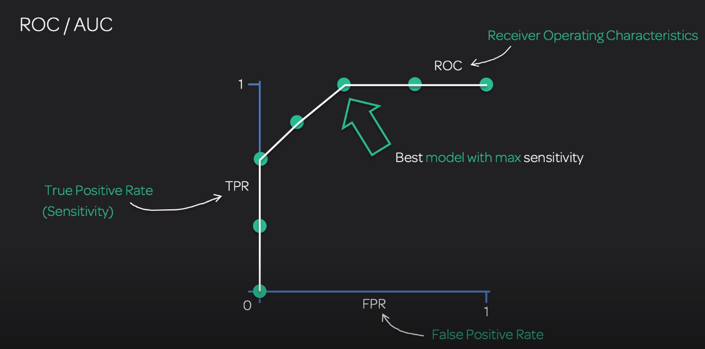
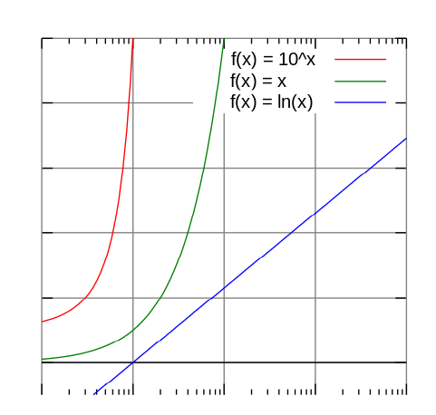
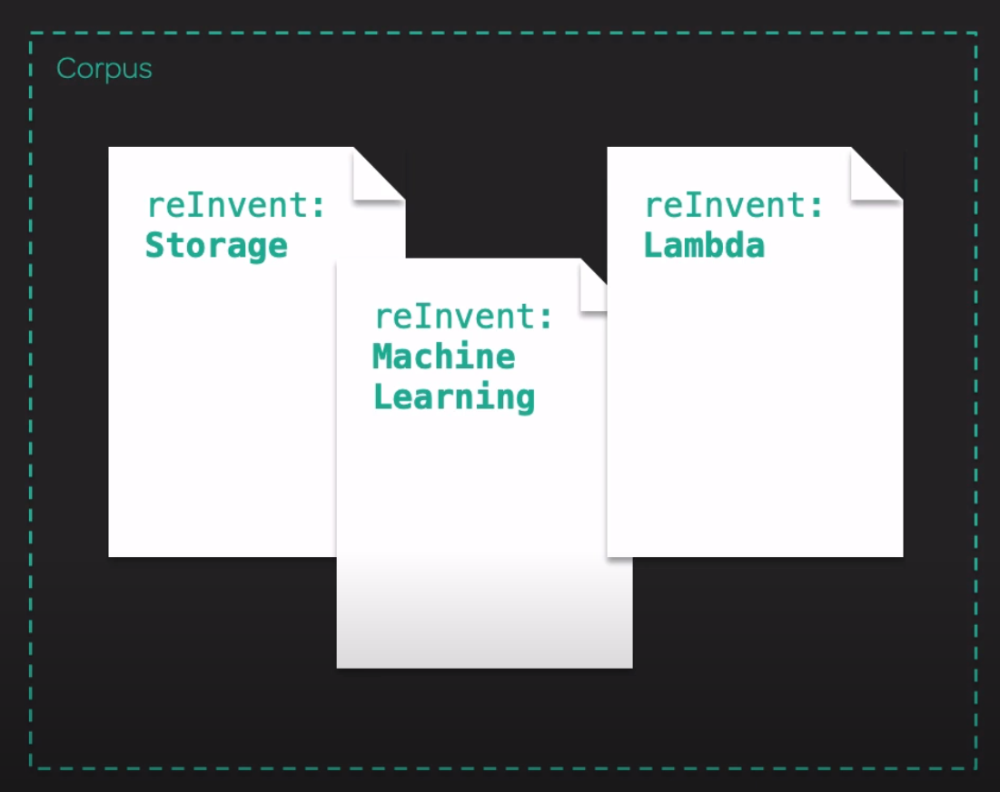
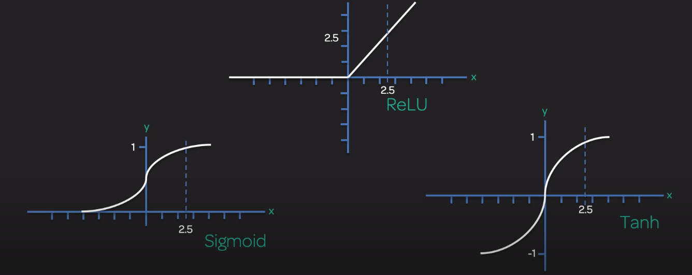
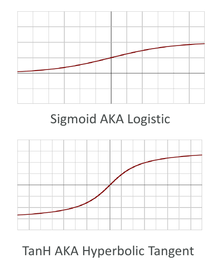

# ML & DL theory

## General info

This page contains the ML & DL theory for the AWS ML specialty certification (MLS-C01).

* [AWS Course page](https://aws.amazon.com/certification/certified-machine-learning-specialty/)
* [AWS exam guide](https://d1.awsstatic.com/training-and-certification/docs-ml/AWS%20Certified%20Machine%20Learning%20-%20Specialty_Exam%20Guide%20(1).pdf)
* [AWS Sample questions](https://d1.awsstatic.com/training-and-certification/docs-ml/AWS%20Certified%20Machine%20Learning%20-%20Specialty_Sample%20Questions.pdf)

## Concepts
### Machine learning lifecycle


#### Data processing
##### Collect data
scrap, download from DB -> anything dealing with the retrieval of raw data

##### Process data
Organizing the data in a format that machine learning algorithims can understand.

features and labels (output, or dependent variables), feature engineering (create new features, ...), 
feature reduction (= remove uninteresting features to speed up model training), encoding (string to number for instance), 
formatting of the data (SageMaker prefers RecordIO data format)

features = Input attributes or independent variables.

##### Shuffle data
Always shuffle dataset for **non** time series data. For time series, the model is meant to predict events in the future, we must
also validate the model on events in the future. If the data is mixed up between the training and test sets, then future data will leak
into the model and our validation results will overestimate the performance on new data

Data randomization is shuffling the data before it is split to mitigate clustering of data and overfitting to a subset of data. 
**Always randomize the data.** Otherwise the algorithms may learn from residual signals in the training data resulting from the order
in which they were collected

* Data collected over time (medical records, survey records, ...)
* batches of data (class sorted), generated at the same time

If we don't randomize the training set, we will have an imbalance such as:

* test set contains recent records and no old records while training set only has old records
* training set has both classes represented while the test set only has one

Some algo will shuffle data during training but not between the training and test data sets
=> **Best practice is to always randomized the data before splitting.**

If we create more data, we need to shuffle to avoid getting stuck at a local minima during batch training.

##### Split data
Split between a train, validation (if not cross validation) and test

#### Train
In the machine learning life cycle, training is the process of an algorithm learning from the training data and generating 
a model to capture these relationships.

Data for machine learning is typically split into the following categories:

* Training data (~80%) - directly influences the model.
* Validation data - used to tune hyperparameters.
* Testing data (~20%) - used to test the complete model.

Model is directly influenced by the training data, the validation is used and indirectly 
influenced the model during training.
The testing data should never be seen by the model during the training.

The test data is **used only once**. If we don't split our complete dataset each time, 
once we use the test data to evaluate our model, we need to create another one because if we change our
model or hyper parameters, the test data will have directly influenced the model and thus the next accuracy.

##### Optimization
During training, we need to calculate the error between the model predictions and the expected prediction.

In linear regression, we square the differences then sum them 
(-> some of them are below the prediction line and will give negative results). 

We graph the Sum of Square Residuals vs Slope of the model line


The **gradient descent** is then used to find the minima of the slope (slope == 0), that's where the error is the smallest.

Gradient descent is an iterative optimization algorithm for finding a function minimum by taking steps proportional to the negative of the gradient. 
Gradient descent is used to optimize many different types of machine learning algorithms including linear regression, logistic regression, and support vector machines.

The step size for the gradient descent is called the **learning rate**. If it is too big, we risk missing the minima, 
if it is to small, we will take too long to reach the minima.

##### Regularization
Regularization is a way to avoid overfitting by penalizing high-valued regression coefficients. 
In other words, regularization reduces parameters and shrinks (simplifies) the model. 
Two types of regularization are: L1 regularization (lasso regression) and L2 regularization (ridge regression).

We don't always add regularization, **only when we see that the model is overfitting**.

The goal of regularization is to penalize some features to lower their importance in the prediction.
=> mathematically desensitize the model to a particular dimension

* L2 regularization (Ridge regression - squared values): 
shrink coeff for least important predictors very close to zero (-> never zero) => all predictors can impact the model
* L1 regularization (Lasso regression - absolute values): penalize high coefficients, force some coeff to be zero => variable selection, some feature do not impact the prediction

For both, extra variable added and optimized to offset the effect of multiple variables. There is also a tuning parameter $lambda$, the larger it is, the more penalty we have.

If we have high bias (high training error, high test error), we should decrease L1 reg or use L2 reg and drop L1 reg.
=> Getting more training data alone will not address the model bias. You can think of L1 as reducing the number of features in the model altogether. 
L2 “regulates” the feature weight instead of just dropping them.

##### Hyper parameters
External parameters that we can set when we initiate a training job. They depend on the algorithm used.

* learning rate: size of the step taken during gradient descent optimization (between 0 and 1)
* batch size: number of samples used to train at any one time. Common values are 32, 64 and 128.
The batch size is related to the infrastructure because we split the dataset so if we have multiple nodes ready for training
we should adapt our batch size accordingly to make sure that they all have some data to work with
=> **Can be all of the data (batch, full batch), one sample (stochastic), or some of the data (mini-batch).**
* epochs: number of time we go through the complete dataset during training. Each epoch contains one or more batches.
Each epoch should see the model gets closer to the desired state. Common values are 10, 100, 1000, ...

This is different than parameters that are set inside the training jobs when the model is trained (=> weights)

#### Validation
* low variance vs high variance: how close are our results?
    * low: clustered together
    * high: separated by 
* low bias vs high bias: how far are we from the center
    * low: not far
    * high: far from the center


=> Variance is a spread of hits with respect to the average hit location, bias is the deviation of average hit location from the bullseye (center).

It is good practice to plot learning curves because it gives a good visualization of the bias/variance tradeoff.
Also, learning curves show the relationship between training set size and the chosen evaluation metric (RMSE, accuracy, ...) on training and validation sets.
They can be an extremely useful tool when diagnosing your model performance, as they can tell you whether your model is suffering from bias or variance.

Note that it is possible to have the validation loss lower than training loss, possible causes

* regularziation since it applies during training but not during validation and testing
* validation set is easier than the training set
* averages of training and validation losses are measured at different epoch points 

##### Overfitting
Check if overfit (works well with training data but not great on unseen data)

variance error: error from sensitivy to small fluctuations in the training set. High variance can cause an algo to model the random noise in the training data rather than the intended outputs (overfitting)

Prevent overfit (high variance):

- early stop
- check that validation loss still diminishes
- try smaller set of features
- reduce number of layers
- penalize model more (dropout(), regularization, ...)
- Using fewer feature combinations.
- Decreasing n-grams size.
- Decreasing the number of numeric attribute bins.
- Increasing the amount of regularization used (lambda parameter).
- add more training data (if not enough data to learn from)
- increase number of passes on the existing training data (if not enough data to learn from)


model might have a high variance problem, validation error is much higher than the training error -> overfit

##### Underfitting

underfit (doesn't infer very well for anything) on the test data.

bias error: error from erroneous assumptions in the learning algo. High bias can cause algo to miss the relevant relations between features and target outputs (underfitting)

Prevent underfit (high bias) -> improve performance due to insufficient data by:

- Increasing the amount of training data examples.
- Increasing the number of passes on the existing training data.
- Adding new domain-specific features.
- Adding more Cartesian products.
- Changing the types of feature processing (e.g. increase n-grams size).
- Decreasing the amount of regularization used (lambda parameter).


model suffers from high bias, both training and validation error is high and doesn't improve with more training examples (-> underfitting)

##### k-fold Cross-Validation
In cross-validation, we run our modeling process on different subsets of the data to get multiple measures of model quality.

Each epoch, use a small part of the training set to create a validation set. 
This subset of training data is changed after each epoch. 

In k-fold cross validation, the original sample is randomly partitioned into k equal sized subsamples. 
Of the k subsamples, a single subsample is retained as the validation data for testing the model, and the remaining 
k − 1 subsamples are used as training data. The cross-validation process is then repeated k times, 
with each of the k subsamples used exactly once as the validation data. 
The k results can then be averaged to produce a single estimation.

There is a parameter that defines the number of split we do with the training set.
It is also possible to test different algorithms on the dataset with this technique.
Some algorithms may do this automatically during training.

This makes a specific validation set obsolete so we have more data for training (80% for example).

###### When to use
Cross-validation gives a more accurate measure of model quality, which is especially important if you are making a 
lot of modeling decisions. However, it can take longer to run, because it estimates multiple models (one for each fold).

So, given these tradeoffs, when should you use each approach?

* For small datasets, where extra computational burden isn't a big deal, you should run cross-validation.
* For larger datasets, a single validation set is sufficient. Your code will run faster, and you may have enough data that there's little need to re-use some of it for holdout.
There's no simple threshold for what constitutes a large vs. small dataset. But if your model takes a couple minutes or less to run, it's probably worth switching to cross-validation.

Alternatively, you can run cross-validation and see if the scores for each experiment seem close. If each experiment 
yields the same results, a single validation set is probably sufficient.

##### Metrics
###### Regression evaluation
####### Root Mean Square Error (RMSE)
The root mean square error metric is a distance measure between the predicted numeric target and the actual numeric answer (ground truth). 
The smaller the value of the RMSE, the better the predictive accuracy of the model. A model with perfectly correct predictions would have an RMSE of 0.

####### Mean Squared Error (MSE)
also Mean Squared Deviation (MSD)

average of the squares of the errors (average squared difference between the estimated values and the actual values). 
This value is always non negative and the closer we are to 0, the better.

####### Mean absolute error (MAE)
measure of errors between paired observations expressing the same phenomenon. It is an arithmetic average of the absolute errors.
The mean absolute error uses the same scale as the data being measured so we can't use it for comparisons between series using different scales.

Commonly used for forecast error in time series analysis

####### Residual Sum of Squares (RSS)
The residual sum of squares (RSS), also known as the sum of squared residuals (SSR) or the sum of squared errors (SSE), 
is the sum of the squares of residuals (deviations predicted from actual empirical values of data). 
RSS measures discrepancy between the estimation model and the actual data. 
The smaller the RSS, the tighter the fit of the model to the data.

###### Classification
####### Confusion Matrix
Sometimes, accuracy doesn't tell the whole story

* a test for a rare disease can be 99.9% accurate by just guessin "no" all the time
* we need to understand true positives and true negative as well as false positive and false negatives

Positive doesn't necessarily means positive case like we could expect. Predicting fraud (which is a negative sentiment) could very well be
a positive case -> it all depends how we setup our labels.

We also need to pay attention to the labels, there is no real convention between predicted vs actual.

######## Binary 


A confusion matrix (error matrix) in machine learning is a table used to describe the performance of a 
classification model on a set of test data for which the true values are known.

Used for classification to evaluate predictions:

* condition positive (P): the number of real positive cases in the data
* condition negative (N): the number of real negative cases in the data
* true positive (TP): predicted yes, actual yes
* true negative (TN): predicted no, actual no
* false positive (FP): false alarm (type 1 error), predict a yes when it was no
* false negative (FN): miss (type 2 error), predict a no when it was yes


We want to aim as high as possible for TP and TN since they are correct predictions.
To evaluate performance with the matrix, we need to ask the right question that fits our business needs.
We might be okay with with FN for a specific case but not for another. For example, we don't want to say to people that
they don't have cancer when they in fact do (type 2 error).

######## Multi class confusion matrix + heat map
A confusion matrix is not limited to only 2 categories:


Diagonal represents correct predictions (TP, TN). Color is different based on the number of predictions made for this particular use case (=> heat map)

######## Sensitivity/Recall
$\frac{\text{TP}}{\text{TP}+\text{FN}}$

Example: throw a net in the ocean, I want to catch as many fish as possible but don't care if I catch other things too.
** => use it when we want to find as many positives as possible; false positives are acceptable**

** Recall measures the fraction of actual positives predicted as positive. 
What proportion of actual positives was identified correctly? In cases where it is better to err on the side of predicting too 
many positives (such as predicting fraud for a bank), high recall is important. In this case, we would prefer to err on the side of 
calling more things fraud than to miss a fraud classification.**

Sensitivity = True Positive Rate (TPR) = Recall = the number of correct positives out of the actual positive results

The closer the value is to 1, the less false negative we have. This is our goal, **we don't want false negatives!**

Recall (true positive rate, sensitiviy, commpleteness or probability of detection)

* measures the proportion of actual positives that are correctly identified (e.g. the proportion of people who test positive for the disease among those who actually have the disease).
* percent of negatives wrongly predicted
* good choice of metric when we care a lot about false negatives (fraud detection)
* => **TP over first column**


######## Specificity
$\frac{\text{TN}}{\text{TN}+\text{FP}}$

Specificity = True Negative Rate (TNR) = the number of correct negatives out of the actual negatives

The closer the value is to 1, the less false positive we have.


Example: throw a net in the ocean, I want to catch only fish, I don't care if I don't catch them all but I don't want to catch other things

** => use it when we want to make sure that we don't get too many bad predictions **

If the model has a high specificity, it implies that all false positives (think of it as false alarms) have been weeded out. 
In other words, the specificity of a test refers to how well the test identifies those who have not indulged in substance abuse.

######## Accuracy
$\frac{\text{TP}+\text{TN}}{\text{Total}}$

Accuracy: the proportion of all predictions that were correctly identified => answers the question *how right am I generally?*

Note that RMSE (Root mean squared error) is also an accuracy measurement since it only cares about right & wrong answers.

Accuracy cannot be trusted if we have a large class imbalance. For example, if we have 99%-1% separation and we predict 100% something, we will be right 99% of the case.

######## Precision
$\frac{\text{TP}}{\text{TP}+\text{FP}}$

Precision: the proportion of actual positives that were correctly identified => subset of accuracy *how good am I at identifying positive results?*

* correct positives
* percent of relevant results
* good choice of metric when we care a lot about false positives: medical screening, drug testing
* => **TP over first row**


Precision measures the fraction of actual positives among those that are predicted as positive. 
What proportion of positive identifications was actually correct? An application that needs to be extremely sure about 
positive predictions is highly precise. In this case, if we say a show is fit for children to view, it needs to be highly precise.

=> uses this when we want to be extra sure that an email is spam before potentially putting it in the spam folder. **We don't want false positive!**

######## F1 score
F1 score is the combination of recall (sensitivity) and precision which takes into account the false positives and the false negatives.
$$\frac{2}{ \frac{1}{ \text{Recall} } + \frac{1}{\text{Precision}} } = \frac{ \text{Recall} * \text{Precision} }{ \text{Recall} + \text{Precision} } * 2$$

=> precision (P) = (TP / (TP+FP)), Recall (R) = (TP / (TP+FN)), F1 score = (2PR)/ (P+R)


F1 score is a binary classification metric that considers both binary metrics precision and recall. It is the harmonic mean between precision and recall. 
The range is 0 to 1. A larger value indicates better predictive accuracy. F1 is often more useful than accuracy, especially if you have an uneven class distribution.

F1 score should be used when we have an uneven class distribution. It is also better to used F1 score 
compared to accuracy since accuracy does not care about FP and FN.

=> we care about precision AND recall, in reality we care more about one than the other though

######## ROC/AUC
The Area Under the ROC (Receiver Operating Characteristic) Curve (AUC). Should be used for **balanced** classes dataset, if not balanced use another one like PRC (preicision recall curve)

Typically not used in multi class classification -> need to extend the ROC curve and ROC area to multi label classification, it is necessary to binzarize the output

A **receiver operating characteristic curve, or ROC curve**, is a graphical plot that illustrates the diagnostic ability of a binary classifier 
system as its discrimination threshold is varied. The ROC curve is created by plotting the true positive rate (TPR, sensitivity, recall) 
against the false positive rate (FPR, fallout, probability of false alarm, 1 - specificity) at various threshold settings.
=> graphical plot that illustrates the diagnostic ability of a binary classifier system as its discrimination threshold is varied.

* plot of true positive rate (recall) vs false positive rate at various threshold settings
* points above the diagonal represent good classification (better than random)
* ideal curve would just be point in the upper left corner
* the more it is bent toward the upper left, the better

**Area under the curve, or AUC**, measures the ability of the model to predict a higher score for positive examples as compared to negative examples. 
Because it is independent of the score cut-off, you can get a sense of the prediction accuracy of your model from the AUC metric without picking a threshold.

* equal to probability that a classifier will rank a randomly chosen positive instance higher than a randomly chosen negative one
* ROC AUC of 0.5 is useless classifier (0.5 is "no discrimination line" = random), 1.0 is perfect
* commonly used metric for comparing classifiers

For ROC/AUC, we draw a 2D graph with the False Positive Rate on the x-axis and True Positive Rate (= sensitivity) on the y-axis.
We plot several FPR and TPR from different confusion matrices




We need to find the best model between these two points. With the area under the curve, we can generally know how well this model overall 
is good at distinguishing between the different classes that it has. **The larger the area, the better it is**


Note that an AUC of 0.5 is what we should get for completely random predictions. If our model does less than 0.5 for AUC, it is terrible.

The area under the curve receiver operating characteristic curve is an indicator of how well a model performs. The higher the score, the better the model performs.

The ROC curve is created by plotting the true positive rate (TPR) against the false positive rate (FPR) at various threshold settings. 
The true positive rate is also known as sensitivity, recall, or probability of detection in machine learning. 
The false positive rate is also known as the fallout or probability of false alarm and can be calculated as (1 − specificity).

=> usually the best metric for binary classification model, does not require to set a classification threshold and it is also useful when there is a high class imbalance.

######### Precision-Recall curve (PRC)
* plot of the precision (vertical axis) versus the recall (horizontal axis) for different thresholds
* more informative than the ROC curve when evaluating binary classifiers on **imbalanced** datasets

In simple terms, high precision means that an algorithm returned substantially more relevant results than irrelevant ones, 
while high recall means that an algorithm returned most of the relevant results. If the event is rare (such as rare disease) 
we don't want to have a high false-positive rate (healthy people diagnosed as sick). In the case of cash transactions, the 'positive' 
event we want to identify is a fraudulent transaction, so we want to minimize false negatives.

######## Gini Impurity
Used by decision trees to determine where to place nodes inside the tree.

Gini impurity is a measure of how often a randomly chosen element from the set would be incorrectly labeled if it was randomly 
labeled according to the distribution of labels in the subset. 
Gini impurity can be used to identify features which represent the biggest split in decision trees.

For each node (root, intermediate), the algorithm looks at each feature separately and calculates gini impurity
$$\text{Gini impurity} = 1 - (\text{probability of dog})^2 - (\text{probability of cat})^2$$

We then take the weighted average to evalute the feature correlation with the label.


This gives us a number ($0.362$) that can be used to compare with other features.
The smaller the number is, the better correlated it is.

##### Ensemble learning
* ensemble methods (common example: random forest)
    * decision trees are prone to overfitting
    * make lots of decision trees and let them all vote on the result (=> random forest)
 
* bagging
    * generate N new training sets by **random sampling with replacement**
    * we create a bunch of different models that just have different training sets that are generated this way, that are recycled from the original set of training data
    * each resampled model can be trained in parallel (big advantage) and we just let them all vote on the final result
    
* boosting
    * observations are weighted -> we started with each data point that has equal weights but as we run our models, we assign weights to those data set points
    and as we learn that over time, we keep refining those weights of the underlying observations => better model in the end
    * some will take part in new training sets more often
    * training is sequential; each classifier takes into account the previous one's success
    
Bagging vs boosting

* XGBoost is the latest hotness => its strength is accuracy
* boosting generally yields better accuracy
* bagging avoids overfitting and is easier to parallelize

=> it depends on our goals

* accuracy -> boosting
* prevent overfitting, having a regularization effect and having more parallelizable architecture -> bagging

#### Test
A test set should be used to make sure that our model really generalizes well on unseen data. Note that if the test set is used, it should be changed
for the next check because the test set result may impact the algorithm configuration so the test set will have an impact on the design
and cannot be considered as unseen data anymore.

#### Deploy & Infer
Host model in execution environment according to requirements, batch, as a service, infrastructure (load balancing)

#### Improve
After monitoring of the performance, we can decide on some improvements. Improve should go to collect data and not split data.

### Pipelines
Pipelines are a simple way to keep your data preprocessing and modeling code organized. Specifically,
a pipeline bundles preprocessing and modeling steps so you can use the whole bundle as if it were a single step.
 
Benefits:

* cleaner code: don't need to keep track of training and validation data at each step
* fewer bugs: fewer opportunities to misapply a step or forget a preprocessing step
* easier to productionize
* more options for model validation (cross validation)

1. define preprocessing steps

```python
from sklearn.compose import ColumnTransformer
from sklearn.pipeline import Pipeline
from sklearn.impute import SimpleImputer
from sklearn.preprocessing import OneHotEncoder

categorical_cols = [cname for cname in X_train.columns if X_train[cname].nunique() < 10 and 
                        X_train[cname].dtype == "object"]

numerical_cols = [cname for cname in X_train.columns if X_train[cname].dtype in ['int64', 'float64']]


numerical_transformer = SimpleImputer(strategy='constant')

categorical_transformer = Pipeline(steps=[
    ('imputer', SimpleImputer(strategy='most_frequent')),
    ('onehot', OneHotEncoder(handle_unknown='ignore'))
])

preprocessor = ColumnTransformer(
    transformers=[
        ('num', numerical_transformer, numerical_cols),
        ('cat', categorical_transformer, categorical_cols)
    ])
```

2. Define the model

```python
from sklearn.ensemble import RandomForestRegressor

model = RandomForestRegressor(n_estimators=100, random_state=0)
```

3. Create and evaluate the pipeline

```python
from sklearn.metrics import mean_absolute_error
from sklearn.pipeline import Pipeline

my_pipeline = Pipeline(steps=[('preprocessor', preprocessor),
                              ('model', model)
                             ])

my_pipeline.fit(X_train, y_train)
preds = my_pipeline.predict(X_valid)
score = mean_absolute_error(y_valid, preds)
print('MAE:', score)
```

### Data leakage
Data leakage (or leakage) happens when your training data contains information about the target, 
but similar data will not be available when the model is used for prediction. 
This leads to high performance on the training set (and possibly even the validation data), but the model will perform poorly in production.

It is crucial to know **how the data is collected**. If the data is gathered before the target, that's fine. If not, there is a leakage.

Basically, we need to have the same features in the training set than the one we will have at the time to predict something in production, nothing more.

#### Target leakage
Target leakage occurs when your predictors include data that will not be available at the time you make predictions. 
It is important to think about target leakage in terms of the timing or chronological order that data becomes available, not merely whether a feature helps make good predictions.

Example: we have a column "got_pneumonia" and "took_antibiotic_medecine". 

People take antibiotic medicines after getting pneumonia in order to recover. 
The raw data shows a strong relationship between those columns, but took_antibiotic_medicine is frequently 
changed after the value for got_pneumonia is determined. This is target leakage.

The model would see that anyone who has a value of False for took_antibiotic_medicine didn't have pneumonia. 
Since validation data comes from the same source as training data, the pattern will repeat itself in validation, 
and the model will have great validation (or cross-validation) scores.

But the model will be very inaccurate when subsequently deployed in the real world, because even patients who 
will get pneumonia won't have received antibiotics yet when we need to make predictions about their future health.

=> solution: any variable updated (or created) after the target value is realized should be excluded

Another example, predict shoelaces needed when the feature sets contains something related to leather. The more leather 
we use, the more shoes we make, the more shoelaces we need

#### Train-test contamination
A different type of leak occurs when you aren't careful to distinguish training data from validation data.

Recall that validation is meant to be a measure of how the model does on data that it hasn't considered before. 
You can corrupt this process in subtle ways if the validation data affects the preprocessing behavior. This is sometimes called train-test contamination.

Example: preprocessing (fitting imputer for missing values) before calling train_test_split().

=> If your validation is based on a simple train-test split, exclude the validation data from any type of fitting, 
including the fitting of preprocessing steps. This is easier if you use scikit-learn pipelines. When using cross-validation, 
it's even more critical that you do your preprocessing inside the pipeline!

#### Detect data leakage
* if first model has high accuracy (should be extremely rare for a scenario without data leakage)
* look at the features and try to find connections with the target
* combination of caution, common sense and data exploration

=> better be safe than sorry, drop features in doubt

#### Example
An agency that provides healthcare wants to predict which patients from a rare surgery are at risk of infection, 
so it can alert the nurses to be especially careful when following up with those patients.

You want to build a model. Each row in the modeling dataset will be a single patient who received the surgery, 
and the prediction target will be whether they got an infection.

Some surgeons may do the procedure in a manner that raises or lowers the risk of infection. But how can you best incorporate the surgeon information into the model?

* Take all surgeries by each surgeon and calculate the infection rate among those surgeons.
* For each patient in the data, find out who the surgeon was and plug in that surgeon's average infection rate as a feature.

=> This poses a risk of both target leakage and train-test contamination (though you may be able to avoid both if you are careful).

You have target leakage if a given patient's outcome contributes to the infection rate for his surgeon, which is then plugged back into the prediction model for whether that patient becomes infected. You can avoid target leakage if you calculate the surgeon's infection rate by using only the surgeries before the patient we are predicting for. Calculating this for each surgery in your training data may be a little tricky.

You also have a train-test contamination problem if you calculate this using all surgeries a surgeon performed, 
including those from the test-set. The result would be that your model could look very accurate on the test set, 
even if it wouldn't generalize well to new patients after the model is deployed. This would happen because the surgeon-risk 
feature accounts for data in the test set. Test sets exist to estimate how the model will do when seeing new data. 
So this contamination defeats the purpose of the test set.

### Algorithms categories
#### Supervised
We train with labeled data to predict unlabeled data -> we know what we are trying to predict.

* Support Vector Machines: used for classification and regression, create a line that separates different 
groups in the data as much as possible
* Simple/Multivariate Linear regression: model depend linearly on the unknown parameters
* Logistic regression: binary classification
* Naive Bayes: probabilistic classifiers based on applying Bayes' theorerm
* Linear Discriminant Analysis: used for dimensionality reduction (create one variable as a linear combination of other 
features or measurements) => LDA explicitly attempts to model the difference between the classes of data
* Decision trees: decision making based on conditions, we follow the branches based on our feature values to reach
a leaf (class to predict)
* K-Nearest neighbour: used for classification and regression. k closest training examples in the feature space.
For classification, class will be defined as the highest number of neighbours.
For regression, the output is the property value of the object -> the average of the values of KNN
* Artificial Neural Networks

#### Unsupervised
Unsupervised learning is where we train the model to look for patterns in the data when the data is not classified or labeled ahead of time.
=> Looking for patterns in the data, we don't have predefined outputs during the training.

Clustering (best way to uncover similar groups)

* hierarchical clustering: goal is to build a hierarchy of clusters
* k-means: classification in clusters with the nearest mean (centroid)

Anomaly Detection

* local outlier factor: measure local deviation of a given data point with respect to its neighbours

Neural Networks

* auto encoders: ANN to learn efficient data codings (dimensionality reduction) to ignore the noise. There is a reduction side
and the reconstruction side to generate output as close as possible than the input
* Generative Adversarial networks (GAN): generate new data with same statistics as the training set (generate photos, ...)
* Self Organizing map: ANN for dimensionality reduction to produce a 2 dimensional representation of the input space (=> the map)

#### Reinforcement learning

Reinforcement learning is where a reward (reinforcement) is provided when the correct action is taken. 
Over time, the model evolves to maximize the reward for a particular action.

During training, the algorithm receives rewards or penalties based on its actions.
For example, a model that will learn to play a game (StarCraft 2, Mario, GTA, ...).

AWS launches AWS DeepRacer league where we can train a small car to learn to drive in a race.

## Data
Make sure that the data is clean, properly formatted and ready to be used for the training.

Machine learning models are only as good as the data that is used to train them.
A key characteristic of good training data is that it's provided in a way optimized for learning and generalization. 
The process of putting together the data in this optimal format is known in the industry as feature transformation.

Ideal characterists of a good dataset for ML:

* should be representative of the underlying business problem to be solved
* should have fair sampling with even distribution of outcomes

Key components of data processing

- Visualizing
- Exploring
- Engineering
- Synthesizing
- Converting
- Changing the structure of the data
- Randomizing the data
- Splitting the data

When using the average of some value, the less data we have to compute the average, the less we can trust the value we computed. 
For example, if we use rating stars of customers for particular food, this is an important point to take into consideration

=> as the number of data point increases, the error of the mean decreases as $\frac{1}{\sqrt{n}}$

### Data types
3 main data types

#### Numerical
Most common data type.

* represents some sort of quantitative measurement
    * heights of people
    * page load times
    * stock prices
    * etc
* discrete data
    * integer based; often counts of some event
        * how many purchases did a customer make in a year ?
        * how many times did I flip "heads" ?
* continous data
    * has an infinite number of possible values
        * how much time did it take for a user to check out ?
        * how much rain fell on a given day ?

#### Categorical / Nominal
* qualitative data that has no inherent mathematical meaning
    * gender
    * yes/no binary data
    * race
    * state of residence
    * product category
    * political party
    * etc
* we can assign numbers to categories in order to represent them more compactly, but the numbers don't have mathematical meaning
* We refer to categorical variables without an intrinsic ranking as nominal variables.

#### Ordinal
* mixture of numerical and categorical
* categorical data that has a mathematical meaning
* example: movie ratings on a 1-5 scale, these values have mathematical meaning 1 means worse movie than 2

### Correlation
A statistical tool used to measure the relationship between two or more variables (i.e. the degree to which the variables are associated with each other) 
such that the change in one is accompanied by a change in another.

### Data Distribution
How is data distributed ? => Probability distributions describe what we think the probability of each outcome is


#### Continuous data
Probability density function -> for continous data (infinite number of possibilities)

##### Normal (Gaussian) distribution
Result of **probability density function**

bell shape centered around 0 $\sigma$ (the mean), instantly recognizable, **continuous data** => infinite number of possible values
Gives the probability of a data point falling within some given range of a given value.

There is the mean and standard deviation $\sigma$ around the mean
- range $(-1 \sigma, 1 \sigma)$ contains 68.2% of data distribution
- range $(-2 \sigma, 2 \sigma)$ contains 95.4% of data distribution
- range $(-3 \sigma, 3 \sigma)$ contains 99.6% of data distribution

**=> for a given range of value, the probability density function gives us a way of finding out the probability of that range occurring**

#### Discrete data
probability mass function -> for discrete data (finite number of possibilities)

##### Binomial and hypergeometric distribution
**discrete data with two possible events**

sum of the outcomes of things (n > 1) that follow a Bernoulli distribution (n=1).

Toss a fair coin 20 times, how many times does it come up heads ? This count is an outcome that follows the binomial distribution. 
Its parameters are n, the number of trials, and p, the probability of a “success” (here: heads, or 1).

For hypergeometric distribution, pick a ball from a bag without replacement. The probability of success changes as balls are removed.

##### Bernoulli and uniform distribution
discrete outcomes, for example tail or head for a coin, the distribution over the discrete outcomes (0 heads, 1 tails)

Both outcomes were equally likely and that's what's illustrated in the diagram

special case of binomial distribution because it has a single trial (n=1). We can think of a binomial distribution as the sum of
Bernoulli distributions.

##### Poisson distribution
Result of **probability mass function** because we work with **discrete data** here. Poisson is for discrete events but not necessarily binary ones!

count of customers calling a support hotline each minute ? 

The Poisson is a discrete probability distribution that expresses the probability of a given number of events occurring in a fixed interval of time or space. 

Like the binomial distribution, the Poisson distribution is the distribution of a count — the count of times something happened. 
It’s parameterized not by a probability p and number of trials n but by an average rate lambda, which in this analogy is simply the constant value of np. 
The Poisson distribution is what you must think of when trying to count events over a time given the continuous rate of events occurring.
When things like packets arrive at routers, or customers arrive at a store, or things wait in some kind of queue, think “Poisson.”

Probability p is independent of other events, n is the total count, the poisson process with the intensity is p*lambda

### Time series analysis
series of points over time. They tend to be discrete samples taken over discrete points in time over a period of time

We have a **trend** in a time series (longer term changes over time): going upwards, downwards

**seasonality** (periodic changes): points in time tend to peak at a certain time and is low at another time; there is a repeating pattern.
If we substract the seasonality from the raw data, we get the trend.

We can have both at the same time. 

**Noise** are some variation that are just random in nature

Seasonality (if constant) + trends + noise = time series

* additive model = only if seasonality is constant
* seasonal variation is constant

Or sometimes, seasonality (if not constant) * trends * noise - trends sometimes amplify seasonality and noise

* multiplicative model => only if seasonality not constant
* seasonal variation increases as the trend increases


### Visualizing
#### Stock charts
track markets with market changes displayed on a graph

#### Line plot/chart
Shows trends in data **over a period of time or a particular correlation** (one axis represent a variable value, the other axis a timeline)

Good for bringing out the annual salary trend for several locations => multi series line chart is best suited for this job


#### Histograms
sns.distplot(a=data column, kde=False) -> create categories and the y axis represents the count in each category

approximate representation of the distribution of numerical or categorical data, first step is to bin the range of values 
=> divide the entire range of values into a series of intervals and then count how many values fall into each interval

=> best suited to analyze the underlying distribution of data (salary distribution of people, ...)


We can have multiple histograms inside one

```python
sns.distplot(a=iris_set_data['Petal Length (cm)'], label="Iris-setosa", kde=False)
sns.distplot(a=iris_ver_data['Petal Length (cm)'], label="Iris-versicolor", kde=False)
sns.distplot(a=iris_vir_data['Petal Length (cm)'], label="Iris-virginica", kde=False)
plt.legend()
```


#### Bar charts/graphs
Simplest and most straightforward way to compare various categories (bars of varying lengths). One axis has the categories, the other has the value of each

compare number or frequency of occurences for different categories

bars can be stacked to show the larger category divided into smaller categories


#### Density plot
sns.kdeplot(data=..., shade=True)

kernel density estimate is a smoothed histogram


can create 2D KDE plot with sns.jointplot(): sns.jointplot(x=iris_data['Petal Length (cm)'], y=iris_data['Sepal Width (cm)'], kind="kde")


in addition to the 2D Kde plot in the center, we have

* the curve at the top of the figure -> kde plot for data x-axis 
* the curve on the right of the figure -> kde plot for data y-axis

#### Pie charts
Simplest and most efficient visual for comparing parts of a whole (budget allocations, populations segments, ...)

Good way to show relative sizes for a same thing

#### Scatter plots / scattergram / bubble chart
graph consists of two axes, each representing variable of some data (number of miles driven by a vehicule vs total gallons of gas used)

Can show correlation:

* no correlation: no apparent relationship between the variables
* negative correlation: one value increases, the other decreases
* positive correlation: one value increases, the other as well

Good for finding outliers

Good to combine with regression line to see the trend (sns.scatterplot + sns.regplot) -> we can use color to display 3 variables (x, y, hue). 
We can add another regression line with sns.lmplot

```python
sns.scatterplot(x=insurance_data['bmi'], y=insurance_data['charges'])
sns.regplot(x=insurance_data['bmi'], y=insurance_data['charges'])
sns.scatterplot(x=insurance_data['bmi'], y=insurance_data['charges'], hue=insurance_data['smoker'])
sns.lmplot(x="bmi", y="charges", hue="smoker", data=insurance_data)
```


##### Categorical scatter plot
scatter plots to highlight the relationship between two continuous variables. However, we can adapt the design of the scatter plot to feature
a categorical variable on one of the main axes => **categorical scatter plot** 

```python
sns.swarmplot(x=insurance_data['smoker'],
              y=insurance_data['charges'])
```

Easier to tell which category is better (whatever the metric) because there is less noise than a scatter plots with regression lines.


#### Stacked bar graphs
studying group of people, it is common to compare multiple variables at once (racial backgrounds, ages, gender in addition of total population)

#### Box plot
- The box contains 50% of the data.
- The line in the box indicates the median value of the data.
- The ends of the lines (or whiskers) extending from the box indicate the minimum and maximum data values, 
unless outliers are present, in which case the whiskers extend to a maximum of 1.5 times the inter-quartile range.

Good for finding outliers

Another plot uses the same technique (violin plot)

##### Example
An analyst is trying to create a box plot for the following data points: 10.2, 14.1, 14.4. 14.4, 14.4, 14.5, 14.5, 14.6, 14.7, 14.7, 14.7, 14.9, 15.1, 15.9, 16.4

Based on these data points, we have the following characteristics:

* Q1(25th percentile) = 14.4
* Q2(50th percentile) = 14.6
* Q3(75th percentile) = 14.9

Identify the data points that would show up as outliers on the box plot (Select three): 10.2, 14.1, 15.9, 14.4, 15.1, 16.4

* Interquartile Range (IQR) = Q3-Q1 = 0.5
* Minimum outlier cutoff = Q1 - 1.5 * IQR = 14.4 - (1.5*0.5) = 13.65
* Maximum outlier cutoff = Q3 + 1.5 * IQR = 14.9 + (1.5*0.5) = 15.65

So the outlier would be anything less than 13.65 or anything more than 15.65. Thus the outliers are 10.2, 15.9, 16.4 for the given problem statement.

#### Mindmap
diagram used to visually organize information

#### Treemap
Alternative way of visualizing the hierarchical structure of a tree

#### Heatmap
Geographic heat maps are an interactive way to identify where something occurs and demonstrate areas of high and low density

colors of the cells represent the average values at the points there


#### Pair plot
every possible combination of attributes against each others => all of them are displayed side by side in a grid

This is awesome to find which features are correlated together

#### Choose plots (seaborn)
* Trends (a trend is defined as a pattern of change)
    * sns.lineplot - Line charts are best to show trends over a period of time and multiple lines can be used to show trends in more than one group
* Relationships (many different chart types that we can use to understand relationships between variables in our data)
    * sns.barplot - bar charts are useful for comparing quantities corresponding to different groups
    * sns.heatmap - heatmaps can be used to find color coded patterns in tables of numbers
    * sns.scatterplot - Scatter plots show the relationship between two continuous variables; if color coded we can also show the relationship with a third categorical variable
    * sns.regplot - including a regression line in the scatter plot makes it easier to see any linear relationship between two variables
    * sns.lmplot - useful for drawing multiple regression lines, if the scatter plot contains multiple color coded groups
    * sns.swarmplot - categorical scatter plots show the relationship between a continous variable and a categorical variable
* Distribution (show the possible values that we can expect to see in a variable along with how likely they are)
    * sns.distplot - Histograms show the distribution of a single numerical variable
    * sns.kdeplot - KDE plots (1D and 2D) show an estimated, smooth distribution of a single numerical variable (or two numerical variables)
    * sns.jointplot - useful for simultaneously displaying a 2D KDE plot with the corresponding KDE plots for each individual variable

### Features handling
#### Feature selection
Feature selection (variable selection, attribute selection) is the process of selecting a subset of relevant features 
(independent variables, predictors) for use in model construction. Feature selection can improve model accuracy, 
simplify models, shorten model training times, and reduce overfitting.

The goal is to improve model accuracy and speed up training. 

A trend line is a line indicating the general course or tendency of something.

This requires domain knowledge because we will need to create new features that better represent reality
or remove useless features (the name of the person does not impact the choice of liking tea or not).
We should be sure that the feature is really not important though.
=> **to know that we will run multiple training with different features and analyze the impact on the model quality**

By removing dimension, the algorithm trains quicker and more accurately since we removed some noise.

Another feature to remove is one that does not impact the prediction, for example if all the values are the same
for this specific feature in our samples.

If the feature has no correlation with the label, we might drop it too.

In our data we can also have **gaps and anomalies** and we need business knowledge to handle that. For example,
if a data is missing, that doesn't necessarily mean that it is wrong. A 0 or NaN could be relevant for that particular sample.
We could also have **anomaly** in our data. A height of "2" cm for a person cannot be true. If there is a high percentage of missing values, we can either drop the features or we can do something called **imputation**.
This means that we will create data for this feature based on the most likely valid value by analyzing the distribution.

Usually drop features if:

* low correlation to the target label
* lots of missing values
* has low variance

=> drop features that will not help the model learn

=> if we know that some info (rows in the dataset) will not be used later by the business, 
we can drop them as well otherwise we would just inject noise in the model because they are outliers. Example:

* house price prediction with outliers (old house, high price)
* these outliers will not be shown on the price website so they are useful for the model

Feature selection on the train set only to prevent leakage

#### Univariate feature selection
* simple and fastest: for each feature, measure how strongly the target depends on the feature using a statistical test (SelectKBest from scikit learn)
* we specify the "K" features we want to end up with and we let the algorithm find them
* one feature at a time 
* faster on large dataset
* when we do univariate feature selection, we need to choose K ourselves (SelectKBest()), to find the best K: 
To find the best value of K, you can fit multiple models with increasing values of K, then choose the smallest 
K with validation score above some threshold or some other criteria. A good way to do this is loop over values of 
K and record the validation scores for each iteration.

The opposite of that is L1 regularization (lasso) which penalizes the absolute magnitude of the coefficients => usually, L1 is more powerful than univariate but can be slow

* with L1, we can control the number of K we keep, we need to play with "C" parameter -> find the regularization parameter that leaves the desired number of features
* iterate over models with different regularization parameters from low to high and choose the one that leaves K features

##### Types of features selection
* backward elimination: 
* forward selection: 
* bidirectional elimination: 
* score comparison: 

#### Feature engineering
Applying our knowledge of the data, and the model we are using, to create better features to train our model with.

* which features should I use ?
* do I need to transform these features in some way ?
* how do I handle missing data ?
* should I create new features from the existing ones ?

Feature engineering means that we **create new feature based on existing features**. For example, we could divide the height
of a person by its age in order to reduce dimensions. => need to train and figure out the good features.

Feature engineering is the process of using domain knowledge of the data to create features that make machine learning algorithms work 
(e.g. separating time from a date/time field, combining fields - height/weight). 
Feature engineering can improve model accuracy and speed up training.

##### Interaction
* An easy way to create new features is by comining categorical variables, "CA" & "Music" -> "CA_Music" => 
new categorical feature that can provide information about correlations between categorical variables.
* also effective to create new numerical features -> easy improvement of the model
 

##### Curse of Dimensionality
* too many features can be a problem -> leads to sparse data
* every feature is a new dimension
* much of feature engineering is selecting the features most relevant to the problem at hand (where domain knowledge comes into play)

=> unsupervised dimensionality reduction techniques can also be employed to distill many features into fewer features

* PCA
* K-Means

##### Feature simplification
We can also **simplify features**. For example, a timestamp (unix epoch) may not be interesting for our problem but we can extract
the hour digit if it is more relevant to the prediction. => **best practices**

##### Feature Transformation
Machine learning models are only as good as the data that is used to train them. 
A key characteristic of good training data is that it is provided in a way that is optimized for learning and generalization. 
The process of putting together the data in this optimal format is known in the industry as feature transformation.

* applying some function to a feature to make it better suited for training
* feature data with an exponential trend may benefit from a logarithmic transform, the model may have easier time to find real trends in it
    * sometimes models have difficulty with non linear data coming into it
* example with youtube recommendations
    * a numeric feature $x$ is also represented by $x^2$ and $\sqrt{x}$ -> we add feature, we don't always remove the initial feature
    * this allows learning of super and sub-linear functions
    
    
    
###### Normalization
**Normalization**: (or min-max normalization) scales all values into a fixed range between 0 and 1. 
This transformation does not change the distribution of the feature, 
and the effects of the outliers increases due to the decreased standard deviations. 
therefore, before normalization, it is recommended to handle the outliers. => **best practices**

Most models require feature data to at least be scaled to comparable values

* otherwise features with larger magnitudes will have more weight than they should (modeling age and income -> more value for incomes)

This is provided by the framework like scikit learn (MinMaxScaler).

**=> remember to scale our results back up if we don't predict categories!**

###### Standardization
**Standardization** (or z-score normalization) scales the values while taking into account standard deviation. 
If the standard deviation of features is different, their range also would differ from each other. 
This reduces the effect of the outliers in the features. => **best practices**

We do that if some models prefer feature data to be normally distributed around 0 (most neural nets) => 
features need to be scaled such that they have 0 mean and a standard deviation of 1.

###### Logarithm transformation
**Logarithm transformation** is one of the most commonly used math transfo in feature engineering:

* helps handle skewed data and after transfo, the distribution becomes more approximate to normal
* in most of the cases, the magnitude order of the data changes within the range of the data (difference between 15 and 20, 65 and 70 is 5 years but in young age, there is a higher magnitude difference)
. log transform normalizes the magnitude differences like that
* decrease the effect of the outliers, due to the normalization of magnitude differences and the model become more robust
* log transformation won't help our model since tree-based models are scale invariant. However, this should help if we had a linear model or neural network.

###### Squares, other powers, exponentials transformation
These might help the model discriminate, like the kernel trick for SVMs. 
One method is to create a bunch of new features and later choose the best ones with feature selection algorithms.

###### Cyclical features handling
Hours of the day, days of the week, months in a year, and wind direction are all examples of features that are cyclical. 
Many new machine learning engineers don’t think to convert these features into a representation that can preserve information such as 
hour 23 and hour 0 being close to each other and not far.

=> The best way to engineer **cyclical features** is to represent these as (x, y) coordinates on a circle using sin and cos functions.

Now the magic happens. We map each cyclical variable onto a circle such that the lowest value for that variable appears right next to the largest value. 
We compute the x- and y- component of that point using sin and cos trigonometric functions.

=> for hours variable, 0 (midnight) is on the right, the hours increase counterclockwise around the circle. In this way,
23:59 is very close to 00:090 as it should be.

If we do that for month (1-12), we usually shift from 1 to have 0-11 for convenience.

```python
import numpy as np

df['hr_sin'] = np.sin(df.hr*(2.*np.pi/24))
df['hr_cos'] = np.cos(df.hr*(2.*np.pi/24))
df['mnth_sin'] = np.sin((df.mnth-1)*(2.*np.pi/12))
df['mnth_cos'] = np.cos((df.mnth-1)*(2.*np.pi/12))
```

Now instead of hours extending from 0 to 23, we have two new features "hr_sin" and "hr_cos" which each extend from 0 to 1 and 
combine to have the nice cyclical characteristics we're after.

=> using this variable will likely improve the model performance (predict number of object being used at a particular time)

Without that, the days, hours, month are considered numerical when they shouldn't since they are categorical! 
They should be handled in a logical cyclical way.

###### Categorical feature handling
Model cannot process text features so we need to replace them with numbers.

Fitting a label encoder to a column in the training data creates a corresponding integer-valued label for each unique 
value that appears in the training data. In the case that the validation data contains values that don't also appear in the training 
data, the encoder will throw an error, because these values won't have an integer assigned to them. 

The **cardinality** of a categorical feature is the number of unique values in the column.

Try not to get too many new features after handling the categorical features because high risk of overfitting and it will take longer to train (and infer).

####### Dropping
We can just drop the categorical features if they don't contain valuable information for our training.

####### Label Encoding
replace the string by a number and keep a lookup tables to find which number means which name. 
(=> converting categorical text data into model-understandable numerical data) 

This can create problem for our algorithm because it might give more importance to bigger number when there is none 
(if a number means a specific country for example, we meant the number as an ID but the model sees it as important)

A good example for this would be to replace the size of an item (XS, S, M, L, XL) by a 
number since the size will likely impact the price since more materials will be needed.

=> This approach assumes an ordering of the categories, a mathematical meaning, ...

Random label encoding: This is a common approach that is simpler than providing custom labels; however, 
we can expect an additional boost in performance if we provide better-informed labels for all ordinal variables.

=> label encoding is not a problem for trees algo but a problem for other algorithm since we create ordinal values

####### One Hot Encoding
create one feature for each value of the initial feature that we want to represent. The value of this new feature will be binary (0 or 1).

One hot encoding converts each categorical text element (e.g. for an existing country feature with values of Australia, Brazil, U.S.A., U.K.) 
into a new feature (e.g. new Australia, Brazil, U.S.A., and U.K. features) with a binary value (either 0 or 1). 
A 1 is used if the feature is present (hot) for the record (e.g. if U.K. applied, 
then a 1 would be in the new UK feature column and the other new feature columns would be set to 0).
=> this technique prevents values to appear as having an ordinal relationship

One hot encoding is very common in deep learning where categories are represented by individual output "neurons"


With that, the model cannot think that a country is more important than another. Note that we add more features but they are only 0 and 1 so easy to process.

=> one hot encoding does not assume an ordering of the categories

For large datasets with many rows, one-hot encoding can greatly expand the size of the dataset. 
For this reason, we typically will only one-hot encode columns with relatively low cardinality. Then, high cardinality 
columns can either be dropped from the dataset, or we can use label encoding.

=> we shouldn't hot encode categories with a lot of features otherwise we add too many extra features

####### Count Encoding
* replace categorical value with the number of times it appears in the dataset
* rare values tend to have similar counts so we can classify rare values together at prediction time
* common values with large counts are unlikely to have the same exact count as other values
* this results in the common/important values get their own grouping

####### Target Encoding
* replaces a categorical value with the average value of the target for that value of the feature (only on train data)
* often blended with the target probability over the entire dataset to reduce the variance of values with few occurences
    * uses the target to create new features (only on train set)
example: country "CA", we calculate the average outcome for all the rows with country "CA"

####### CatBoost encoding
* similar to target encoding in that it's based on the target probablity for a given value. 
However with CatBoost, for each row, the target probability is calculated only from the rows before it.

###### Binning
* take numerical data and transform them into categorical data
* bucket observations together based on range of values
    * for example: estimated ages of people (put all 20-something in one classification, 30-something in another)
* quantile binning categorizes data by their place in the data distribution
    * ensures that every one of our bins has an equal number of samples within them
    * great solution when we need to transform continuous data to discrete values and we don't want to lose the distribution in the process
* transforms numeric data to ordinal data
* especially useful when there is uncertainty in the measurements (one of the few good reason to do that)
    * this removes the uncertainty in the measurements once we removed the initial feature
* another reason might be that we just really want to use a model that works on categorical data instead
    * questionable because we are throwing info away by binning

###### Missing and unbalanced data, outliers
####### Missing data
**For missing data**, we can create (impute) new data. 

Because missing data can cause problems for analyzing data, imputation is seen as a way to avoid the pitfalls involved 
with removing the records containing the missing data (listwise deletion, complete case). Note that we could also copy data from another feature.
For example, a feature "full review summary" could replace an empty "full review". This depends on the business use case.
**Note that imputation data should be done first (with supervised learning or not) before removing data.**

If we use data imputation, sometimes we get better results if we create a new column and we have a boolean saying if the data from some column
was imputed or not.

######## Mean replacement
* We can do that by taking the mean of all the values in this column (sum of entire list divided by the number of items in the list).
We take the mean to make sure that we don't skew the dataset too much. It is better to have the mean value even if it is wrong
compared to having 0 which is even more wrong. This is fast & easy and won't affect the mean or sample size of overall dataset.
* we can use the median instead of the mean if we have outliers -> less impact. Median is that number separating the higher half of a sample, a population or a probability distribution from the lower half
=> median makes it less sensitive to outliers

=> but it is generally pretty terrible

* only works on column level, misses correlations between features. Example if we have age and income, if we put the mean, a 10 or 15 years old might have an income of 50k which doesn't make sense
* can't use on categorical features (imputing with most frequent value can work in this case though)
* not very accurate

=> on the certification exam, if we are asked what's the best way to do data imputation -> mean replacement probably isn't.

=> A rough imputation method such as mean or median can be a reasonable choice when only a handful of values are missing, 
and there aren't large relationships between features that we might compromise. If outliers, median is a better choice than mean.

Note that sometimes, this gets less better results than just dropping the columns. It is important to compare what we try!

######## Dropping
For missing data for a few samples, we could drop the rows of the samples.
If we have many missing values, it would be wise to remove the feature completely.
If the feature is needed, we can't simply drop it, we must find a way to populate it no matter how high is the missing data percentage.

Remove records containing the missing data:
This is the most common means of dealing with missing data. All cases (records) with a missing value are deleted. 
If the data are missing completely at random, then listwise deletion does not add any bias, 
but it does decrease the power of the analysis by decreasing the effective sample size. 
If the cases are not missing completely at random, then listwise deletion will introduce bias.

Remove features entirely:
This is one option that may be pursued but with caution. It would still be wise to consult someone 
with domain knowledge and to perform a correlation analysis on the available data.

* **we should NOT do that if we have lots of missing data**. In the exam, pay attention to keywords like "needed".
* use Amazon Mechanical Turk or a vendor managed workforce
* if the feature is critical, gather more data, do not drop.

######### Rules
if not many rows contain missing data...

* ... and dropping those rows doesn't bias our data...
* ... and we don't have a lot of time...
* ... maybe it is a reasonable thing to do.

=> but it's never going to be the right answer for the best approach, almost anything is better, maybe we can substitute another similar field perhaps (review summary vs full text) ?

For example, if we have incomes in our dataset. We may have people with really low incomes and very high incomes that do not report their incomes. So by dropping
these rows, we may have a bad model accuracy

=> on the certification exam, if we are asked what's the best way to handle missing data -> dropping data probably isn't.

######## Forward & backward fill
fill missing values with previous (backward fill) or next value (forward fill)

Most likely used with time series data?.

######## Interpolation
Linear interpolation is basically a straight line between two given points where data points between these two points are missing and interpolate
missing data from that line.

######## Get more data
=> most likely the best thing to do even if it is more work

* better than imputing data
* sometimes we just have to try harder or collect more data

######## Supervised learning to predict missing values
=> most likely the second best thing to do even if it is more work

We can also use supervised learning to predict missing values based on the values of other features. Different
supervised learning approaches might have different performances, but any properly implemented supervised
learning approach should provide the same or better approximation than mean or median approximation

KNN: find K "nearest" (most similar) rows and average their values

* assumes numerical data, not categorical
* there are ways to handle categorical data (Hamming distance) but categorical data is probably better served by deep learning
* euclidean distance is used so make sure that the data range is similar for the features (normalization, standardization)

Deep Learning

* better for categorical data (classification)
* build a ML model to impute data for our ML model
* works well for categorical data, really well but it is complicated

Regression

* find linear or non linear relationships between the missing feature and other features
* most advanced technique: MICE (multiple imputation by chained equations)
    * state of the art in this space right now for imputing missing data
    
**Deep learning is better suited to the imputation of categorical data and we need more data than a normal algorithm.
If the data we are trying to impute is numerical, we should use KNN.**

####### Unbalanced data
**For unbalanced data**, meaning that we have a large number of samples for one category compared to another
(detect fault in products). We should really try to get more data for our use case (best strategy).
For example, fraud is rare and most rows will not be fraud.
=> if we predict no fraud all the time, we have high accuracy but the model is terrible since we don't detect the fraud.

Beware of the terminology, "positive" doesn't mean good! A positive result is whatever the classifier is trying to predict, good or bad.

* it means the thing we are testing for is what happened
* if our model detects fraud, then fraud is the positive case.

We could also try a different algorithm.

If not possible, we create more data (synthesize data with our domain knowledge).
=> what could vary in the data that probably doesn't indicate a fault. 
We can then generate minority data with randomized values within range of these variations in some features.
For example, if the variation in weight indicates a problem but not a variation with height and width, 
we will generate data with the same weight as the faulty one with different height and width to give more variation in our dataset.

=> unbalanced data is mainly a problem with neural networks

The best solution would still be to try to find more data for the small of number of cases.

######## Oversampling
* can be done at random
* duplicate samples from the minority class. For each minority point we have, we count that as 10. The problem with that the faults detected will 
likely be very closely related to the training data since we will lack diverse faults in our training data (=> oversampling = data duplication))

=> the dumb copy really helps with a neural networks

######### SMOTE
SMOTE = Synthetic Minority Over-sampling Technique

* with datasets that are not fully populated, it adds new information by adding synthetic data points to the minority class => oversampling
* artificially generate new samples of the minority class using nearest neighbors
    * run K-nearest-neighbors of each sample of the minority class
    * create a new sample from the KNN result (mean of the neighbors)
* both generates new samples and undersample majority class
* generally better than just oversampling
* better than just making copies because we generate more different data for the minority class 

######### ROSE
ROSE = Randomly Over Sampling Examples

Uses smoothed bootstrapping to draw artificial samples from the feature space neighbourhood around the minority class

######## Undersampling
* instead of creating more positive samples, remove negative ones => delete from majority class
* throwing data away is usually not the right answer unless we are specifically trying to avoid big data scaling issues => probably the only valid reason to undersample

If our dataset is too big, the best way would be to get more computational power for the dataset instead of undersampling

######## Adjusting thresholds
* simpler methods compared to oversampling/undersampling
* when making predictions about a classification (fraud/not fraud), we have some sort of thresholds of probability at which point we will
flag something as the positive case (fraud)
* if we have too many false positives, one way to fix that is to simply increase that threshold
    * guaranteed to reduce false positives
    * but could result in more false negatives
    
=> we need to evaluate the impact of false negatives and false negatives before choosing a threshold!

####### Outliers
Outliers are data points outside of the general cluster of datapoints

######## Variance
The variance ($\sigma^2$) is simply the average of the squared differences from the mean

For example, what is the variance of the dataset (1, 4, 5, 4, 8)?

* first find the mean (1 + 4 + 5 + 4 + 8)/5 = 4.4
* now find the differences from the mean (-3.4, -0.4, 0.6, -0.4, 3.6)
* find the squared differences (11.56, 0.16, 0.36, 0.16, 12.96)
    * we want to make sure that negative variances count just as much as positive variances otherwise they would all just cancel each
    other out and that would be bad
    * we want to give more weight to the outliers so this amplifies the effect of things that are very different from the mean
* find the average of the squared differences:  $\sigma^2 = \frac{(11.56, 0.16, 0.36, 0.16, 12.96)}{5} = 5.04$

######## Standard deviation
$\sigma$ is the square root of the variance: $\sigma^2 = 5.04$ so $\sigma = \sqrt{5.04} = 2.24$

This is usually used as a way to identify outliers. Data points that lie more than one standard deviation from the mean can be considered unusual.
=> we can talk about how extreme a data point is by taking about "how many sigmas" away from the mean it is.

######### Dealing with outliers
* sometimes it is appropriate to remove outliers from our training data => do this responsibly, understand why we are doing this
    * in collaborative filtering, a single user who rates thousands of movies could have a big effect on everyone else's ratings. That may not be desirable
    * in web log data, outliers may represent bots or other agents that should be discarded
* but if someone really wants the mean income of US citizens, we shouldn't toss out billionaires just because we want to

=> don't fudge our numbers by throwing out outliers but throw out outliers if it is not consistent with what we are trying to model in the first place

In box and whisker, the outliers are lying outside 1.5 the Inter Quartile Range. 

standard deviation provides a principled way to classify outliers (we find data points more than some multiple of a standard deviation in our training data). 
Use common sense to find which multiple.

There is no hard and fast rule regarding outlier, we need to look at our data and kind of eyeball it.

* distribution
* histograms

=> see if there is actual things that stick out here as obvious outliers and understand what they are before we just throw them away

Remember that AWS's Random Cut Forest algo creeps into many of its services because it is made for outlier detection

* QuickSight
* Kinesis Analytics
* SageMaker and more

=> good chance that's what they are looking for in the exams!

##### Data augmentation
For image, we can use data augmentation. We do some small transformations on the training set (not the validation/test set) in order to create more data:

* horizontal flip if it works with our data -> does not work for a stop sign for instance
* crop
* shift
* rotate
* blur
* zoom
* ... 

#### Summary
Feature selection:

* use domain knowledge to drop irrelevant features
* drop features with very low correlation to the labeled data
* drop features with very low variance
* drop features with lots of missing data

Feature engineering:

* simplify features and remove irrelevant information
* standardize data ranges across features, features with range 1-10 and another one with 1-100 can be standardized within the same range
* transform data to suit the model/problem -> if the data does not follow a linear pattern, we can perform logarithmic transformation
to allow the data to fit on a line
* use PCA, Label Encoding and One Hot Encoding

### Record IO format
RecordIO is a set of binary data exchange formats that divide data into individual chunks, 
called records, and prepends the record length in bytes. RecordIO is used for pipe mode to stream data. Streaming data results 
in faster training start times and better throughput. Most Amazon SageMaker algorithms work best with RecordIO.

We don't want to load data individually because it will take a long time to train with them all.
We need to use a file format called RecordIO file which will have all the data in one file.

**RecordIO is used for Pipe mode (data stream) as opposed to file mode**
Thanks to that, we have a faster training start times and better throughput during the training.

Since we stream, we don't need to copy all the data before starting the training.

=> **SageMaker streams data directly from S3 if RecordIO format and the training instances don't need a local disk copy of data.**

## Model explainability

* What features in the data did the model think are most important?
* For any single prediction from a model, how did each feature in the data affect that particular prediction?
* How does each feature affect the model's predictions in a big-picture sense (what is its typical effect when considered over a large number of possible predictions)?

### Values
* debugging: we can create error with our preprocessing of messy data, we can also have target leakage
* informing feature engineering: sometimes we can go through this process using nothing but intuition about the underlying topic but we need more direction when we have
100s or 1000s features
* directing future data collection: if we have a good understanding of the value of features we currently have for our model, it can help to reason about what new values will improve it even more
* informing human decision making: for these decisions, insights can be more valuable than predictions
* trust: in practice showing insights that fit the general understanding of the problem helps build trust 

### Techniques
Some techniques that help get insights on our model's predictions

####  Feature importance
* what features have the biggest impact on predictions? 
* fast to calculate
* widely used and understood
* consistent with properties we would want a feature importance measure to have
* gives general insights 

**Permutation importance is calculated after a model has been fitted.**

=> If I randomly shuffle a single column of the validation data, leaving the target and all other columns in place, 
how would that affect the accuracy of predictions in that now-shuffled data?

Really good as a first technique to get a rapid view of the important features for our model, which ones affect it the most

=> permutation importance is great because it creates a simple numeric measures to see which features mattered to the model but doesn't tell 
how each features matter. If a feature has medium permutation importance, that could mean it has:

* a large effect for a few predictions but no effect in general
* a medium effect for all predictions

##### Process
1. Get a trained model
2. Shuffle the values in a single column, make predictions using the resulting dataset. 
Use these predictions and the true target values to calculate how much the loss function suffered from shuffling. 
That performance deterioration measures the importance of the variable you just shuffled.
3. Return the data to the original order (undoing the shuffle from step 2). Now repeat step 2 with the next column in the dataset, 
until you have calculated the importance of each column.

#### Partial Dependence Plots (PDP)
* calcullated after a model lhas been fit
* used to plots the effect of each feature independently
* gives general insights 

##### Process
* for each row of data
    * we use the fitted model to predict our outcome 
    * we change the value (small variation) for one variable and we make a series of predictions
    * we trace out predicted outcomes on the vertical axis as we move from small values to large values (horizontal axis)
    
At the end, we plot the average predicted outcome on the vertical axis.
    
This gives us a graph with domain 0 -> inf and range from (- a value, another value) where we can see the evolution of the importance as we change the value from lower to higher

#### SHapley Additive exPlanations (SHAP)
* what if we want to break down how the model works for an individual prediction ?
* shows the impact of each feature
    * A model says a bank shouldn't loan someone money, and the bank is legally required to explain the basis for each loan rejection
    * A healthcare provider wants to identify what factors are driving each patient's risk of some disease so they can directly address those risk factors with targeted health interventions

=> **SHAP values interpret the impact of having a certain value for a given feature in comparison to the prediction we'd make if that feature took some baseline value**

This gives a graph like this


Interpretation: 

* predict 0.7 where base value is 0.4979
    * feature values causing increased predictions are pink and their visual size shows the magnitude of the feature's effect
    * feature values decreasing the prediction are in blue
* if we subtract the length of the blue bars form the length of the pink bars, it equals the distance from the base value to the output


##### Plots
###### SHAP summary plots
SHAP summary plots give us a birds-eye view of feature importance and what is driving it.


Each dot has 3 characteristics:

* vertical location shows what feature it is depicting
* color shows whether that feature was high or low for that row of the dataset
* horizontal location shows whether the effect of that value caused a higher or lower prediction

Example: blue point top left was for a team that scored few goals, reducing the prediction by 0.25

* if no points on left and right of the line -> model ignored the features completely
* the more we go away from the line, the bigger the impact (positive or negative impact) on the prediction

Note that the distance difference between left and right points don't indicate a higher permutation importance -> outliers have too much of an impact here to be able to deduct that

###### SHAP dependence contribution plots
* Partial Dependence Plots show how a single feature impacts predictions but they don't show
    * what is the distribution of effects ?
    * is the effect of having a certain value pretty constant or does it vary a lot depending on the values of other features?


* each dot represents a row of the data. 
* horizontal location is the actual value from the dataset
* vertical location shows what having that value did to the prediction. 
* spread suggests that other features must interact with Ball Possession %. For instance, the two points in the middle (50%) that affects predictions in an opposite manner
=> The fact this slopes upward says that the more you possess the ball, the higher the model's prediction is for winning the Man of the Match award.

##### SHAP summary
* bigger range of effects on the predictions = how spread are we from left to right
* the spread does not mean higher permutation importance because outliers skew the results
* need to check the color (high importance) with the position on the horizontal line (shap) to deduct a bigger impact or not if we change the value (from 0 to 1 for instance)
* low importance and high importance mixed together = both high and low values can have positive or negative impact, this means that there is an interaction with another feature that gives that result

#### Summary
* first use permutation importance to show which features seem important for the model, this gives a good indication that the model must be doing something right or not if they make sense
* with the important features, create a partial dependence plot to show how this or these specific features impact the model's prediction
    * if we see a positive linear result for a feature, it is good
    * it is also good to check with other features to compare their evolution
* now we can ask ourselves, could the data be wrong ? Is our model doing something more complex than experts in the field expect ?
* we can plot a simple graph with the label (y axis) w.r.t. to the low variance feature found in previous step (the feature that the PDP shows not moving that much between low and value for the importance)
* finally, we use SHAP to get a proper graph (components of individual predictions)

## Machine Learning Algorithms
An algorithm is a set of instructions, typically used to solve a class of problems or perform a computation. 
Machine learning algorithms are programs (math and logic) that adjust themselves to perform better as they are exposed to more data.

### Unsupervised algorithms
#### K-Means
Unsupervised type / inference classification into groups/classes/clusters

K-means is an unsupervised learning algorithm. It attempts to find discrete groupings within data, where members of a group are as 
similar as possible to one another and as different as possible from members of other groups. You define the attributes 
you want the algorithm to use to determine similarity.

We can use it to explore data that we don't understand for instance. K represents a number; the number of classes
that we want to algorithm to figure out with our data.

The algorithm starts by making K completely random data points in our data space. These points represents the centers
of the clusters we want. Since they are random at first, they are most likely wrong. An iterative process then starts
to change the centroid points based on the distance with all the other closest points to try to find a better 
center for the clusters. The closest points that have been mapped to the centroid are temporarily part of a cluster.
The center of this cluster is now the new centroid point. This process is repeated until the algorithm has found the
K centroids that don't move anymore when trying to find the center of the clusters.

Note that if there is only a single point to choose from for the next centroid of the cluster, the point is chosen.
This helps to have big moves that can unblock an isolated wrong centroid.

=> tries to keep the centroids as small as possible

Strategies for first pick:

* random approach
* cluster sum of squares


But even with that, we largely depend on the first random points at the beginning which could still be completely blocked.
K-means looks at **total variation** to prevent that. It adds all the distances between all the points of the same cluster
to their centroid.


With that, the algorithm can select the best centroids.

Since we need to define K (number of clusters) and we can't always know the best value, we can plot the reduction in Variation
with respect to the number of clusters (K). We end up with an elbow plot with the information we need.


With that, we can find the smallest K after which the clustering won't be that helpful. K-means is an unsupervised learning method, 
and the best we can do is try to optimize the tightness of the resulting clusters. Within-Cluster Sum of Squares (WSS) is one way to measure that. 

=> right algorithm to uncover discrete groupings within data

K-means may be used for dimensionality reduction.

* pros: easily adaptable, works well on small and large datasets, fast, efficient and performant
* cons: need to choose the number of clusters

use k-means++ algo to prevent random init trap 

* unsupervised
* k = number of centroids
* calculation of prediction error: no
* optimization done using elbow method
* convergence: when cluster memberships don't change anymore

##### Choosing K
* Choosing the right number of clusters
    * WCSS (within-cluster sums of squares) = sum of all cluster((sum of all distances squared between the data points of a cluster and the centroid of this cluster))
    * smaller is better
    * if we put more clusters, the number will be smaller but we cannot go until K = number of data points
        * if the number of clusters = number of data points -> WCSS = 0
    * if we plot WCSS as a function of the number of clusters, we can see when it is not worth it to create more cluster anymore
        * the slope gets smaller and smaller after each cluster
        * look for elbow for the optimal number of clusters

#### Hierarchical clustering
* pros: optimal number of clusters can be obtained by the model itself, practical visualisation with the dendrogram
* cons: not appropriate for large dataset

2 types:

* agglomerative (bottom-up approach, most common)
    * step 1: make each datapoint as a single point cluster (thar forms N clusters)
    * step 2: take the two closest data points and make them one cluster (that forms N-1 clusters)
    * step 3: take the two closest clusters and make them one cluster (that forms N-2 clusters)
        * points are also clusters
        * distance between clusters can be
            * option 1: closest points
            * option 2: furthest points
            * option 3: average distance
            * option 4: distance betweeen centroids
    * step 4: repeat step 3 until there is only cluster
* divisive (top-bottom)

* dendrograms (memory of the algorithm)
    * map points against euclidean distances
        * height of the bar is the distance between two points
        * points are joined by lineas to form a bar (bar plot where bar kind of merge together)
    * once we have dendrogram
        * set a threshold to reject clusters bigger than the threshold
        * number of clusters we get are the number of lines crossed by the threshold line
        * take a threshold (rule of thumb): take the bigger line that doesn't cross the other extended horizontal lines (largest distance)
        

#### Latent Dirichlet Allocation (LDA)
Unsupervised type / inference classification, text analysis (topic discovery, sentiment analysis, document tagging), unsupervised topic modeling (similar to Comprehend and Neural Topic Model).

The latent Dirichlet allocation (LDA) an unsupervised machine learning algorithm used for classification (predicting a label) tasks; 
often used for text analysis (e.g. topic discovery, sentiment analysis, document tagging). 
This is not the same as linear discriminant analysis which also uses the abbreviation LDA.

=> Do not confuse it with Linear Discriminant Analysis (LDA). LDA in the exams means Latent Dirichlet Allocation.

Basically, LDA is a description of the way that documents are constructed => distinction between documents, topics and words

Document is composed of one or more topics composed of one or more words. 
Words can belong to multiple topic and multiple topic can belong to multiple documents.

=> Use LDA to figure out the right categories for each product (recommend products use case)


A **corpus** is a collection of documents.



Text data pre-processing:

* remove stop words: and, but, the, ... -> becomes less readable for humans but more for the algorithm
* apply stemming or lemming
    * stemming: take the root of the word (learning, learnability, ... -> learn)
    * lemming: more accurate because it uses vocabulary and morphological analysis of words 
    (saw returns see or saw and not "s" like stemming)
* tokenize: take all words and put them in list
* choose the number of topics (K)

First, LDA will assign a random topic (as a number) to each tokenized word. This will most likely be wrong 
but it is a starting point of an iterative process.
We then count the words by topic and we count the topics by document.


Once we have that starting point, we need to find a better topic for each word. 

We do that like that:
1. take a word in the list (we go through all the list one at a time), for example python
2. look at the documents in which the word appears
3. multiply the topics (random at first) of the words by the matching topic in the document
4. take the highest result and use the topic for the word
5. start at 1 with the next word in the list


We can then use these values to perform topic analysis on a new document that we might have.

#### Principal Component Analysis (PCA)
Unsupervised type

Data must be linearly separable for the linear kernel, if not, use kernel PCA

Visually, we can only visualize 3 dimensions. With PCA, we are able to draw the data in such a way where we can see 
relationships between the points (=> unsupervised learning).

The algorithm uses dimension reduction. We remove dimensions in the data but we still keep the meaning of the data (-> remove noise).
Think like reducing the dimension of a 3D object by taking a picture of it. The picture in 2D retains the characteristics of the
3D object without the extra dimension.

Method:
1. look in the data which aspects have the most impact by finding the central points of all our data in the graph (mean value of all distinct dimension)
2. we then center our graph with this point as center of origin
3. next, we "draw" the smallest possible box that encompass as many points as possible around the center or origin. 
We don't necessarily end up with a cube.
4. the longest length of the box represents the largest variation in our data => PC1, the second longest => PC2, the third longest => PC3 and so on based on the dimensions
5. we then take the 2 or 3 longest (or more if we have many more dimensions) and plot
6. we can then see our data with the most relevant features, we dropped the noisy features and we kept characteristics close to the input data
7. we then remove the box in our 2 or 3D graphs and we can create clusters of data based on the close neighbours.

Note that this is a good algo even for storage. If we have 1tb of data and we want to minimize it without compression (because already compressed),
we don't need to throw more hardware, we could just use PCA to reduce dimension and the size of the data volume.

If we have a large number of observations and features, we should use the mode "randomized" because it uses an approximation algorithm.

For dataset with sparse data and a moderate number of observations and features -> use "regular" mode

Summary:

* unsupervised ML model
* often used as a data preprocessing step
* there can be as many PC's as features or values
* PC1 and PC2 can be used to plot a 2D graph to show groups of features
* we can choose how many PC we keep in the end or we can say that we want to keep 80%, 90% 
of the characteristics of the data and the algorithm keeps the required PC
* use PCA for linear problem (data is linearly separable), if not, we need to use Kernel PCA (go into higher dim to extract new PCA)

### Supervised algorithms
#### logistic Regression
Supervised type / inference for binary answer (Yes/No). 

Logistic regression is a supervised machine learning algorithm used to describe data and explain the relationship between 
one dependent binary variable and one or more nominal, ordinal, interval, or ratio-level independent variables.

* we predict the probability of going into a specific category or not (but we can have more than 2 categories)
* Sigmoid (or soft step) function (range between 0 and 1, domain all real numbers) is used to find the point between the yes/no answer.

$sigmoid(x) = \frac{1}{1 + e^{-x}}$

We can tune the "middle threshold for classification" based on how important are false positives, false negatives.

* threshold at 0.5: if < 50% then no, else yes
* high threshold -> increase specificity (less false positive)
* low threshold -> increase sensitivity (less false negative) -> less prediction of not cancer if there is a cancer, no fraud if there is a fraud

#### Linear Regression
Supervised type / used for numeric inference, output is in a particular range

Linear regression is a supervised machine learning algorithm that uses a linear approach to modeling the relationship between a 
numeric-dependent variable (or response variable) and one or more independent variables (explanatory variables).

Use cases:

- Financial forecasting
- Marketing effectiveness
- Risk valuation

examine root cause for underperformance of a regression model (overestimate outcome), metrics to use is "Residuals" => 
The residuals plot would indicate any trend of underestimation or overestimation. Both Mean Absolute Error and RMSE would only give the error magnitude. 
AUC is a metric used for classification models.

Outliers can skew linear models. If it is explicitely said that we don't care about making predictions to outliers, we can just drop them for the training.

* pros: work on any size of dataset, gives info about relevance of features
* cons: linear regression assumptions

##### Polynomial regression
* pros: works on any size of dataset, works very well on non linear problems
* cons: need to choose the right polynomial degree for good bias/variance tradeoff

##### Multivariate linear regression
same as univariate linear (one variable), here we have multiple of the same degree!

###### Model improvement
* Once we have the first model with all the features, we can start dropping irrelevant features to improve the performance
* Create an ordinary least square regressor (OLS) and fit and check the summary.
* We want the lower p-value because it is the most significance between our independent variable with respect to the dependent variables
* we keep applying this process until we can't remove features and we found the best ones
* to be able to do that, we use p-values and adjusted R squared

#### Naive Bayes
supervised probabilistic classifiers based on Bayes' Theorem with strong (naive) independence assummptions between the features.

what is the probability to produce a bad output/a defect given parameter X: for each new data point, we will calculate the probability for each class

$P(A \vert B) = \frac{( P(B \vert A) * P(A) )}{P(B)}$

where

* P(A|B): posterior probability, what is the proba of A given B
* P(B|A): likelihood -> number of similar observations among A / total number of A
    * number of point in the circle that are part of a certain category / total number  of points of that category
* P(A): prior probability -> number of A / total probability
    * number of points of a category A / total number of points
* P(B): marginal likelihood -> number of similar observations / total observations
    * number of point in the circle / total number of points
    
1. calculate posterior probability of class 1
2. calculate posterior probability of class 2
3. compare the two results and assign the class with higher probability to the new data point

#### Linear Discrimniant Analysis
supervised 

* method used to find linear combination of features that characterizes or separates two or more classes of objects or events
* resulting combination may be used as a linear classifier or more commonly dimensionality reduction
* data must be linearly separable

#### Support Vector Machines (SVM) - LinearSVC
Supervised type / used for classification, we separate data into groups 

used to draw the best decision boundary (line) between categories of points

Support vector machines are supervised machine learning algorithms used for classification (predicting a label) and regression analysis.

The goal is to draw a hyperplane between our data points that best separates them. =>  best-fit plane between margins of classes. 
We look for support vectors that represent
the boundary/edge of the data (margins). We draw the hyperplane to be as far as possible from all these support vectors 
(the margins).

maximum margin is the maximum distance possible between the line and the closest point of a category and the closest point of the other category.
The line is called the maximum margin hyperplane

=> Support vectors are a connection of points closest to the other class and represent the edge or boundary of our class. 
Support vectors are used to build margins.

Use cases:

- Customer classification
- Genomic identification


This is 2D but it is not a problem to have higher dimensions.

other algorithms will try to find the classes that define the best element (like apple vs oranges) but
svm will look at the classification problem the other way, it will try to find the apple that looks the most like an orange 
and use it as the support vector

##### Kernel SVM
If the data cannot be linearly separated, we cannot use SVM with a linear kernel, we need to use SVM with a RBF kernel.
An alternative would be to use KNN.

* svm -> decision boundary is a straight line (data is linearly separable)
* kernel svm -> not a straight line (data is not linearly separable)

We need to transform our non linearly separable data into a linearly separble data using a higher dimensional space 

* map to a higher dimension (2D is a line, 3D is a hyperplane) -> computationally intensive for large dataset
* project the separation from higher dimension and get the non linear separator

* pros: easily adaptable, works very well on non linear problem, not biased by outliers
* cons: need to manually apply feature scaling

##### Support Vector Regression
We could also use it for regression. It uses the same principle as SVM. 

The objective, we are moving on with SVR, is to basically consider the points that are within the decision boundary line. Our
best fit line is the hyperplane that has a maximum number of points

#### Decision Trees
Supervised type / inference: binary yes/no, numeric, classification, regression (predicting a quantity) 

We can make path choices on binary decision, numeric decision or multiple choices decision


They are composed of a root node, 2 leaf nodes or more, 0 or more internal nodes


The root node will be the feature mostly correlated with the label. The internal nodes are chosen based on previous choice.
The data is analyzed to figure out the mostly correlated feature from all the remaining features matching this path choice.


The tree is not necessarily symmetric because the features with higher correlations are different between the two paths.

Decision trees can perform an automatic feature selection if not taking them into account if they are not correlated
to the output.

* pros: interpretability, no need for feature scaling, works on both linear and non linear problems
* cons: poor results if small datasets, overfitting can easily occur

#### Random Forests
Supervised type / inference: binary yes/no, numeric, classification, regression (predicting a quantity)

Random forest is a collection of decision trees to make them more accurate. For each decision tree, the random forest 
algorithm will take a random subset of the features. The algo then repeats the same process to create the decision
tree with the subset of features. The number of trees is a hyper parameter.

During inference, all trees are used and the output from all trees are aggregated into one final output.

* pros: powerful and accurate, good perf on many problems, including non linear problems
* cons: no interpretability, overfitting can easily occur, need to specify the number of trees

#### Extreme Gradient Boosting (xgboost)
* one of the best algo for gradient boosting in terms of model performance and execution speed
* feature scaling doesn't have to be applied since xgboost is based on decision trees
* good for large dataset
* can work through most regression, classification and ranking problems
* boost
    * ensemble method that seeks to create a strong classifier (model) based on “weak” classifiers. 
    In this context, weak and strong refer to a measure of how correlated are the learners to the actual target variable. 
    By adding models on top of each other iteratively, the errors of the previous model are corrected by the next predictor, 
    until the training data is accurately predicted or reproduced by the model
    * ensemble method that sequentially adds predictors and corrects previous models. However, 
    instead of assigning different weights to the classifiers after every iteration, this method fits the new model to 
    new residuals of the previous prediction and then minimizes the loss when adding the latest prediction.
    => updating the model using gradient descent and hence the name, gradient boosting
* important hyperparameters
    * n_estimators (how many trimes we go through the modeling cycle) => number of models in the ensemble
        * too low value = underfitting
        * too high value = overfitting
        * typical values range from 100-1000 (depend on learning_rate)
    * early_stopping_rounds: auto find the ideal value for n_estimators (put high value for n_estimators and wait for early stopping)
        * good value should be 5 (patience)
    * learning_rate: multiple the predictions from each model by a small number -> each tree we add to the ensemble helps us less
        * default is 0.1
    * n_jobs: number of threads

##### Inner working
Gradient boosting is a method that goes through cycles to iteratively add models into an ensemble.

It begins by initializing the ensemble with a single model, whose predictions can be pretty naive. 
(Even if its predictions are wildly inaccurate, subsequent additions to the ensemble will address those errors.)

Then, we start the cycle:

* First, we use the current ensemble to generate predictions for each observation in the dataset. To make a prediction, we add the predictions from all models in the ensemble.
* These predictions are used to calculate a loss function (like mean squared error, for instance).
* Then, we use the loss function to fit a new model that will be added to the ensemble. Specifically, 
we determine model parameters so that adding this new model to the ensemble will reduce the loss. 
(Side note: The "gradient" in "gradient boosting" refers to the fact that we'll use gradient descent on the loss function to determine the parameters in this new model.)
* Finally, we add the new model to ensemble, and repeat!

#### K-Nearest Neighbour (KNN)
Supervised type / inference classification

=> KNN needs historic data with label!

The k-nearest neighbors algorithm (k-NN) is a supervised, non-parametric method used for classification and regression. 
The input consists of the k closest training examples in the feature space. 
The output depends on whether k-NN is used for classification or regression.

This is different than k-means because knn is supervised, we need labeled data for training.

The K here represents the number of neighbour to take into account (distance points) before associating a new data point
to a cluster.


How to determine the value to use for K:

* make K large enough to reduce the influence of outliers
* make K small enough that classes with a small sample size don't lose influence. For example, a cluster of 2 and
a cluster of 10, if we pick 5, we will always chose the biggest cluster.

KNN can handle non linear clustering problems!

* supervised
* k = number of closest neighbors to look at
* calculation of prediction error: yes
* optimization: cross validation and confusion matrix
* convergence: when all observations classified at the desired accuracy

use knn for imputing continuous missing data and deep learning for classification

#### Recommender systems
* collaborative filtering
    * build a model from a user's past behavior as well as similar decisions made by other users (users who bought this also bought this)
    * cold start problem, need data of user before making good predictions
* content based filtering 
    * uses a series of discrete, pre tagged characterists of an item in order to recommend additional items with similar properties (spotify info for music, ...)
    * no cold start problem
    
## Deep Learning Algorithms
### General Neural Networks


#### Model capacity
abstract metric that tells us how able the model is to learn -> if we add more layers (at the risk of overfitting), the model capacity is higher
because the model has more knobs to play with to learn on the training data

If we underfit, that means that the model capacity is too low and we need to add more possibilities for the network to learn

#### Neurons, layers, weights, bias, epochs
* When created, a neuron has random weights connected to each neuron of the previous layer.
* a neuron of layer A is connected to all neurons of layer B and vice versa. They don't necessarily all activates 
since the weights will be different after training
* Weights are assigned to each input on the basis of relative importance to other inputs. 
These weights are multiplied by the appropriate input in the activation function of an artificial neuron.
* bias: value needed to prevent the neuron to be deactivated (always produce 0), the more neurons are turned off, the less the network can train
* the bias and weights are adjusted by the NN during training
* layers: 1 input, 0-n hidden layers, 1 output
* number of times the training algo will see the complete training set

#### Activation function, forward/backward propagation, loss function
* activation function: math function that takes an input value (input vector * input weights + bias) and forwards an output value.
The goal of this function is to introduce non linearity into ANN. The main function of bias is to provide every node with a trainable constant value.
* forward propagation: flow from input to output, weights, bias and activation functions are used to generate final outputs in the output layer.
Forward propagation is when we apply a set of weights to the input data and calculate an output. For the first forward propagation, the set of weights is selected randomly.
* loss function: function to calculate the error of the predicted output against the target output. Use gradient descent and learning rate.
convention is to use a math function where lower result is better
    * common functions: binary cross entropy and categorical cross entropy => measure of the uncertainty associated with a given distribution
* backward propagation: after forward propagation, we go from the output layer to the input layer 
and we update the weights and bias to reduce the loss function. Only the neurons which activated during the forward pass are changed

if during multiple runs with identical parameters, the loss function converges to different, yet stable, values, this means that we have multiple local minima.
=> the solution for this would be to reduce the batch size (to move more on the curve) and decrease the learning rate (to make sure that we don't overshoot the global loss function minimum)


The number of forward and back propagation is defined by the epochs.



* optimizer determines how we determine the numerical values that make up the model. So it can affect the resulting model and predictions
* loss determines what goal we optimize when determining numerical values in the model. So it can affect the resulting model and predictions
* metrics determines only what we print out while the model is being built, but it doesn't affect the model itself.

##### Linear activation function


* doesn't really do anything, just mirror the input
* can't do backpropagation

##### Binary step function


* it is on or off
* can't handle multiple classification (it is binary)
* vertical slopes don't work well with calculus

##### Non linear activation functions
* these can create complex mappings between inputs and outputs
* allow backpropagation (-> useful derivative)
* allow for multiple layers (linear functions denegerate to a single layer

###### Sigmoid / Logistic / tanh



* nice & smooth
* scales everything from 0-1 (sigmoid, logistic) or -1 to 1 (tanh / hyperbolic tangent)
* but: changes slowly for high or low values -> vanishing gradient problem
* computationally expensive, computers are not good for trigonometry
* tanh generally preferred over sigmoid

###### Rectified Linear Unit (ReLU)


* most used function in neural networks (improve accuracy in NN) -> only outputs a positive number or zero
* easy & fast to compute
* but when inputs are zero or negative, we have a linear function and all of its problems -> "Dying ReLU problem" which is not
problematic most of the time

###### Leaky ReLU


* solves dying ReLU by introducing a negative slope below 0 (not as steep)

###### Parametric ReLU (PReLU)


* ReLU but the slope in the negative part is learned via backpropagation
* complicated and your mileage may vary

###### Other ReLU variants
* Exponential Linear Unit (ELU): like leaky but instead of a straight line, it is an exponential function instead
* Swish
    * from Google, performs really well
    * mostly a benefit with very deep networks (40+ layers)
* Maxout
    * outputs the max of the inputs
    * technically ReLu is a special case of maxout
    * but doubles parameters that need to be trained, not often practical

###### Softmax
* use softmax for classification examples where multiple classes of results can be computed
* basically converts outputs of last layer to a probabilities of each classification
* can't produce more than one label for something (sigmoid can)

##### Choosing an activation function
* multiple classification: softmax on the output layer
* RNN's do well with tanh
* for everything else
    * start with ReLU
    * if we need to do better -> try Leaky ReLU
    * last resort: PReLU, Maxout
    * Swish for really deep networks

### Convolutional Neural Networks (CNN)
Supervised type / inference classes of images

Convolutional neural networks are supervised machine learning algorithms used for classification (predicting a label), 
most frequently used for image classification.

What are they for?

* when we have data that doesn't neatly align into columns
    * images that we want to find features within
    * machine translation: we don't know where the verb, noun, etc can be in a sentence
    * sentence classification
    * sentiment analysis: we don't know where a phrase might that indicates some happy/frustrated sentiment
* they can find features that aren't in a specific spot
    * like a stop sign in a picture
    * words within a sentence
* they are feature location invariant => we try to find the pattern wherever in the input and not a specific place

=> not that for NLP tasks, they are variants of CNN

Inner working of a CNN (inspired by the biology of the visual cortex)

* local receptive fields are groups of neurons that only respond to a part of what our eyes see (**subsampling**)
* they overlap each other to cover the entire visual field (**convolutions**) => break up this data into little chunks and process those chunks individually and then the system assembles
a bigger picture of what we are seeing higher up in the chain
* they feed into higher layers that identify increasingly complex images
    * some receptive fields identify horizontal lines, lines at different angles etc (**filters**)
    * these would feed into a layer that identifies shapes
    * which might feed into a layer that identifies objects
* for color images, extra layers for red, green and blue

How do we know that we see a "stop sign"?

* individual local receptive fields scan the image looking for edges and pick up the edges of the stop sign in a layer
* those edges in turn get picked up by a higher level convolution that identifies the stop sign's shapes (and letter too)
* this shape then gets matched against our pattern of what a stop sign looks like also using the strong red signal coming from our red layers
* that information keeps getting processed upward until we recognize a stop sign and brake

=> a CNN works the same way

The different layers identify features of an image that will help classify it


* The first layers will discover high level characteristics such as shapes, edges, ...
* the more layers we traverse towards the output layer, the more specific the detection becomes (beaks, ...)


A **convolutional filter** (= an edge detection filter)

* small matrix that will be multiplied with each group of pixels 
of the same size and the result will be stored in an output matrix
* The next multiplication is done with the next group of pixels and so on. 
The stride defines how many pixels we jump for the next multiplication.
    * with stride 2 compared to one, we divide by 4 the output (half the width and half the length)
* The numbers in the convolutional filter matrix dictates what kind of shapes
we detect on the input matrix. 
* We don't choose the numbers ourselves, the network does during training. 
* doesn't have to be square
* larger convolution filter detect more than smaller ones
* all these outputs from filters are stacked together, this is how the network learn the overall picture


The end result helps detecting the edge of the image.


The convolutional filter defines what we want to detect (left edges, right, corners, ...)


Max pooling: method to down sample an input representation (image, hidden layer output matrix) to reduce its dimensionality 

* helps against overfitting
* if we have a matrix 4x4, we can reduce it to 2x2 by taking the max value from each 4 blocks in the 4x4 matrix

#### CNN with Keras / Tensorflow
* source data must be of appropriate dimensions (width * length * color channels)
* Conv2D layer type does the actual convolution on a 2D image
    * Conv1D and Conv3D also available, doesn't have to be image data
* MaxPooling2D layers can be used to reduce a 2D layer down by taking the maximum value in a given block (1D and 3D variant as well)
    * reduce the processing load on the CNN
* Flatten layers will convert the 2D layer to a 1D layer for passing into a flat hidden layer of neurons
* dropout: randomly drop a percentage of neurons during training to prevent overfitting. Allows bigger network (bigger model capacity) since we reduce overfitting
* Typical usage: Conv2D -> MaxPooling2D -> Dropout -> Flatten -> Dense -> Dropout -> Softmax

#### CNN difficulties
* very resource intensive (CPU, GPU, RAM)
* lots of hyperparameters: kernel sizes, many layers with different numbers of units, amount of pooling... in addition to the usual stuff like number of layers, choice of optimizer
* getting the training data is often the hardest part (+ storage and access)

#### Transfer learning
reuse an existing networks that has been trained a huge dataset and only update the end layers to answer our specific business needs, 
storing knowledge gained while solving one problem and applying it to a different but related problem.
=> pay attention to that during the exams, we don't want to retrain the full model if we don't have enough data.

Do not hesitate to use data augmentation. For example, if we lack 90° rotation in our dataset compared to the test dataset, it is a quick win to retrain with such data augmentation.

transfer learning is not magical, the first layers (edges, ...) need to match our use case, we can't use a pre trained model on every day images and apply it
for all other cases (pictures of stars, ...)

##### Specialized CNN architectures
=> defines specific arrangement of layers, padding and hyperparameters

* LeNet-5: Good for handwriting recognition
* AlexNet: image classification, deeper than LeNet
* GoogLeNet: even deeper but with better performance, introduces inception modules (groups of conv layers)
* ResNet (Residual Network): even deeper, maintains performance via skip connections

### Recurrent Neural Networks (RNN)
Supervised type / inference for stock predictions, time series data, voice recognition, NLP, ...

Recurrent neural networks (RNNs) are supervised machine learning algorithms where connections between nodes form a directed graph along a temporal sequence. 
RNNs are most frequently used for handwriting and speech recognition but can also be used for stock predictions and time series data.

RNN make predictions based on context that is learned and remembered during training. 
The RNN has a memory to remember previous predictions to influence future predictions.

Music is fundamentally a time-series problem, which RNN's (recurrent neural networks) are best suited for. 
You might see the term LSTM used as well, which is a specific kind of RNN.

#### Recurrent neuron


There is a looping mechanism

* whatever the output of a neuron, it is fed again as input for the same neuron additionally to new input
* whatever the output of the layer, it becomes the input of the same layer
* most likely a tanh as activation function

#### RNN topologies
What are they for?

* time series data
    * when we want to predict future behavior based on bast behavior
    * web logs, sensor logs, stock trades
    * where to drive our self driving car based on past trajectories
* data that consists of sequences of arbitrary length
    * machine translation
    * image captions
    * machine generated music

* sequence to sequence: predict stock prices based on series of historical data
* sequence to vector: words in a sentence to sentiment
* vector to sequence: creates captions from an image
* encoder -> decoder (sequence -> vector -> sequence): machine translation

#### Training RNN
* backpropagation through time: just like backpropagation on multi layer perceptrons but applied to each time step
* all those time steps add up fast
    * ends up looking like a really, really deep neural network
    * can limit backpropagation to a limited number of time steps (truncated backpropagation through time)
* state from earler time steps get diluted over time: this can be a problem when learning sentence structures
* it is really hard, very sensitive to topologies, choice of hyperparameters
* very resource intensive
* a wrong choice can lead to a RNN that doesn't converge at all

##### Cells
A "memory cell" is the visualization of a neuron over time


More recent behaviors tend to have a higher impact on the current time step. This can be something that we don't wish because
the words at the beginning of a sentence may matter as much as the few previous words. If that's the case => use LSTM/GRU cell

By default, RNN can remember a little bit but **Long short-term memory** (LSTM) can remember a lot
=> maintains separate short-term and long term-states

**Gated recurrent unit**: simplified LSTM cell that performs about as well

layer of recurrent neurons:


### Recursive Neural Network
* apply the same set of weights recursively over a structured input to produce structured prediction over variable size input structures
* successful in learning sequence and tree structures in NLP (phrase and sentence continuous representations based on word embedding)
* a text is made up of sentences which are made up of words and so on -> tree

### Reinforcement learning
* we have some sort of agent that explores some space
* as it goes, it learns the value of different state changes in different conditions
* those values inform subsequent behavior of the agent
* examples: pac-man, cat & mouse game (game AI)
    * supply chain management
    * hvac systems
    * industrial robotics
    * dialog systems
    * autonomous vehicles
* yields fast on line performance once the space has been explored

#### Reinforcement learning Key Terms
* environment: the layout of the board/maze/etc
* state: where the player/pices are
* action: move in a given direction etc
* reward: value associated with the action from the state
* observation: surroundings in a maze, state of chess board

#### Q-Learning
* specific implementation of reinforcement learning
* we have
    * a set of environmental states "s" - is there something close to me?
    * a set of possible actions in those states "a" - move up, down, left, right, ...
    * a value for each state/action "q"
* start off with Q values of 0
* explore the space
* as bad things happen after a given state/action, reduce its Q for the state that it was in
* as rewards happen after a given state/action, increase its Q for the state that it was in
* state actions
    * pacman has a wall to the west
    * pacman dies if he moves one step south
    * pacman just continues to live if going north or east
* we can look ahead more than one step by using a discount factor when computing Q (here "s" is the preivous state, "s'" is current state)
    * Q(s, a) += discount * (rewards(s, a) + max(Q(s')) - Q(s, a))

##### Exploration problem
* how do we efficiently explore all of the possible states?
    * simple approach: always choose the action for a given state with the highest Q. If there's a tie, choose at random
        * but that's really inefficient and we might miss a lot of paths that way
    * better way: introduce an epsilon term
        * if random number is less than epsilon, don't follow the highest Q but choose at random
        * that way, exploration never totally stops
        * choosing epsilon can be tricky

##### Markov Decision Process
* provide a mathematical framework for modeling decision making in situations where outcomes are partly random and partly under the control of a decision maker
* MDP's are just a way to describe above description using mathematical notation
* states are still described as "s" and "s'"
* state transition functions are described as $P_a(s, s')$
* our "Q" values are described as a reward function $R_a(s, s')$
* an MDP is a discrete time stochastic control process

##### Summary
* we can make an intelligent pacman in a few steps
    * have it semi randomly explore different choices of movement (actions) given different conditions (states)
    * keep track of the reward or penalty associated with each choice for a given state/action (Q)
    * use those stored Q values to inform its future choices
    

### Natural Language Processing (NLP)
most NLP algo are classification models

text needs to be converted to something numeric for learning 

main library: NLTK (BLEU score evaluation), spacy

BLEU (bilingual evaluation understudy) is an algorithm for evaluating the quality of the text which has been machine-translated 
from one natural language to another. The range of this metric is from 0.0 (a perfect translation mismatch) to 1.0 (a perfect translation match).

#### Text encoding
* all non digit characters are encoded into numbers
* before any processing, we need to know what type of encoding is present and if necessary, change it
* prefer unicode UTF-8 or UTF-16

#### Use cases
* text classification
    * sentiment analysis: positive/neutral/negative
    * part of speech tagging: detect part of speech (noun, verb, ...). A word can have different meaning (read a book, book a flight, ...)
    * trying to detect what is in the text
* topic modeling
* machine translation: google translate
* named entity recognition (NER): which items in the text map to proper names (people, places, organization) 

#### Vocabulary
* unigrams: word taken individually into consideration
* bigrams: 2 words
* n-grams: n words taken into consideration
* topic: subjects found in the documents
* corpus: collection of documents
* stop words: words that appear frequently but don't have much information -> the, or, is, but, ...
* important words: the word which can explain the data the most
* infrequent or rare words -> not very helpful
* tokenizing: split a text to list
    * word tokenizer: splits a text into words and treats each word as a feature
    * sentence tokenizer: splits a text into sentences and treats each sentence as a feature
    * tweet tokenizer: extracts even the emojis and hashtags from a social media text to be used as features
    * regex tokenizer: lets us build our own custom tokenizer using regex patterns of our choice
* canonicalization (reduce word to its base form)
    * stemming: fast, rule based technique that chops the suffix and keep the root of the word
        * porter stemmer: only works on english words
        * snowball stemmer: more versatile stemmer, works on several languages
    * lemmatization: lemma of word is its base form (calming, calms, calmed -> calm)
        * slower but better result
        * if the part of speech tagging is incorrect in the text, this will affect the lemmatizer performance -> consider using stemmer
* pattern matching: match tokens or phrases with chunks of text or whole documents
* world frequency distribution: words count of a document and visualize
* t-SNE: algorithm to reduce dimensionality and still represent the data correctly (matrix dim goes from VxD to Vx2)
    * if we scatter plot that, we have a 2D plot word cloud with clusters of similar words
        * japan, japanese, china, chinese
        * medical words
        * sports
        * politics etc
        
#### NLP preprocessing
* substitution: remove noise from text in its raw format -> extract text from html, xml, ...
* decoding to UTF-8 (str.decode("utf-8-sig"))
* check for null and empty values
* remove stop words: most commonly occuring words which are not relevant in the context of the data
    * do not remove for speech tagging, parsing, ...
* tokenize each word: convert text into tokens before transforming it into vectors. It is also easier to filter out unnecessary tokens.
* normalization
    * change numbers to word equivalent
    * lowercase everything (if that doesn't impact the process) => don't lowercase for sentiment analysis, we lose information
    * negation handling: change "aren't" to "are not", ...
    * remove standalone punctuations: all the comma, dot, ...
    * lemmatization: finds the base or dictionary form of the word known as the lemma -> are, is, being becomes be. Some libraries do all of that for us (Gensim)
    * stemming: stupidly take the root of the words, can be inacurrate sometimes

Important notes

* lemmatizing and dropping stopwords might result in poor performance -> consider that as hyperparameter
* don't blindly lowercase everything -> for sentiment analysis, it is important

##### Lexical processing
* transform raw text into words, sentences, paragraphs (depend on the need)
    * words contained in a sentence give us a pretty good idea of what the sentence means
    * consider all plural words to be equivalent to the singular form
* lexical processing is basic, we need more advanced system of analysis if we want to really catch the meanings

##### Syntactic processing
* instead of looking at the words, we look at the syntactic structures (grammar of the language to understand the meaning)
* differentiate between subject and object in the sentence
* make connection between words "Prime Minister", "UK" -> easier to find an answer for this if we can link them both together in the sentence

##### Semantic processing
* lexical and syntactic are not enough when it comes to building advanced NLP app such as language translation, chatbots, ...
* identify synonyms, antonyms, ...
* we infer the word's meaning to the collection of words that usually occur around it. Example: detect that "PM" or "Prime Minister" are always related to someone
* goal of this processing: understand that "King" and "Queen" are related to each other as in Queen is the female version of King. 
    * we can also discover that these two words can be clubbed under the word "Monarch".

##### Phonetic hashing
* combines the same phonemes (smallest unit of sound) into one bucket and gives them the same hash code for all the variations => colour and color have the same code
* technique used to canocalize words that have different variants but same phonetic characteristics, that is, the same pronunciation
* Soundexes are algorithm that can be used to calculate the hash code of a given word
    * algo differ from language to language
    
##### Spelling errors
Very important to fix that because it impacts stemming/lemmatization

###### Edit distance 
* minimum number of edits required to convert one string to another
    * insertion of a char in a given string => aquire -> acquire
    * deletion of a char in a given string => "neccessary" to "necessary"
    * substitution => absense to absence
* most common algorithm: **Levenshtein edit distance** 

###### Spelling corrector
* spell correction is an important part of lexical processing -> could be an initial pre processing layer
* based on edit distance, we can use a corrector
* common one: **Norvig spell corrector**
* need a big dictionary of proper spelling word -> use a seed document
* main functions
    * edits_one(): function creates all the possible words that are one edit distance away from the input word (generate random word)
    * edits_two(): function creates a list of all the possible words 2 edits away
    * known(): funciton filters out the valid English word from a list of given words. Uses frequency distribution as a dictionary that was created using the seed document
    * possible_corrections(): function takes the input word and uses the above three functions to return the correct spelling for a given input word
    * prob(): function will create a probability associated with each of the suggested correct spellings and return the one that is the most frequent among the input words in our text corpus
    => this is why we need a large corpus instead of a dictionary -> get correct words + get frequency distribution
    
```python
import re

def words(document):
    return re.findall(r"\w+", document.lower())
all_words = Counter(words(open('big.txt').read()))

def edits_one(word):
    alphabets = "abcdefghijklmnopqrstuvwxyz"
    splits = [(word[:i], word[i:]) for i in range(len(word) + 1)]
    deletes = [left + right[1:] for left, right in splits if right]
    inserts = [left + c + right for left, right in splits for c in alphabets]
    replaces = [left + c + right[1:] for left, right in splits if right for c in alphabets]
    transposes = [left + right[1] + right[0] + right[2:] for left, right in splits if len(right)>1]
    return set(deletes + inserts + replaces + transposes)

def edits_two(word):
    return (e2 for e1 in edits_one(word) for e2 in edits_one(e1))

def known(words):
    return set(word for word in words if word in all_words)

def possible_corrections(word):
    return known([word]) or known(edits_one(word)) or known(edits_two(word)) or [word]

def prob(word, N=sum(all_words.values())): 
    return all_words[word] / N

def spell_check(word):
    correct_word = max(possible_corrections(word), key=prob)
    if correct_word != word:
        return "Did you mean " + correct_word + "?"
    else:
        return "Correct spelling."
```

#### Bag of words (bow) representation
* sentence 1: "Tea is life. Tea is love"
* sentence 2: "Tea is healthy, calming and delicious."
* vocabulary of our corpus (8 words): tea, is, life, love, healthy, calming, and, delicious

For each document, count up how many times a term occurs and place that count in the appropriate element of a vector.  
For example, the first sentence has tea twice so it will becomes 2 in the vector 1 first position (see vocabulary)

* v1 = [2 2 1 1 0 0 0 0] 
* v2 = [1 1 0 0 1 1 1 1]

=> this representation is called bag of words. The documents with similar terms will have similar vectors.

Note that vocabularies frequently have tens of thousands of terms so these vectors can be very large

#### Term Frequency-Inverse Document frequency (tf-idf) matrix
Similar to **bag of words** except that each term count is scaled by the term's frequency in the corpus => using TF-IDF can potentially improve our models

We can calculate TF-IDF with functions: standard, smooth or probabilistic

Shape of the TF-IDF matrix is: number of documents x number of unique n-grams 

We know that words that appear in many documents are probably less meaningful. Because of that, we can weight each count by a measure of how many documents that 
words appear in. => raw word count / document count

Used to reflect how important a word is to a document in a collection or corpus. 
The tf-idf value increases proportionally to the number of times a word appears in the document and is offset by the number of documents in the corpus that contain the word
which helps to adjust for the fact that some words appear more frequently in general.

Really important data for search, figures out what terms are most relevant for a document

"Please call the number below" and "Please do not call us"
=> give 8 unigrams and 8 bigrams with 2 sentences, this gives a dimension 2x16

no matter the technique we use, we are always interested in a matrix of size VxD

* V = vocabulary size (number total of words)
* D = vector dimensionality (total number of documents)

##### Term Frequency
measures how often a word occurs in a document -> a word that occurs frequently is probably important to that document's meaning

##### Document Frequency
how often a word occurs in an entire set of documents -> i.e. all of wikipedia or every web page

This tells us about common words that just appear everywhere no matter what the topic like: "a", "the", "and", etc

##### Inverse document frequency
an inverse document frequency factor is incorporated which diminishes the weight of terms that occur very frequently in 
the document set and increases the weight of terms that occur rarely

##### Explanation
A measure of relevancy of a word to a document might be:

$\frac{\text{Term Frequency}}{\text{Document Frequency}}$

since division is the same as multiplying by the inverse mathematically -> $\text{Term Frequency} * \text{Inverse Document Frequency}$

That is, take how often the word appears in a document, over how often it just appears everywhere. That gives us a measure of how important
and unique this word is for this document.

In practice, there are some nuances to how we actually use this

* we actually use the log of the IDF, since word frequences are distributed exponentially. That gives us a better weighting of a words overall popularity
* TF-IDF assumes a document is just a "bag of words" (we lose meaning with that)
    * parsing documents into a bag of words can be most of the work
    * words can be represented as a hash value (number) for efficiency
    * what about synonyms? various tenses? abbrivations? capitalizations? misspellings?
* doing this at scale is the hard part, it is good to use a cluster (Spark for instance)

An extension of TF-IDF is to not only compute relevancy for individual words (terms) but also for bi-grams or more generally n-grams

* "I love certification exams"
    * unigrams: "I", "love", "certification", "exams"
    * bi-grams: "I love", "love certification", "certification exams"
    * tri-grams: "I love certification", "love certification exams"

##### Using TF-IDF
A very simple search algorithm could be:

* compute TF-IDF for every word in a corpus
* for a given search word, sort the documents by their TF-IDF score for that word
* display the results

##### Examples of TF-IDF

###### Example 1
Tf-idf is a statistical technique frequently used in Machine Learning areas such as text-summarization and classification. 
Tf-idf measures the relevance of a word in a document compared to the entire corpus of documents. You have a corpus (D) containing the following documents:

* Document 1 (d1): “A quick brown fox jumps over the lazy dog. What a fox!”
* Document 2 (d2): “A quick brown fox jumps over the lazy fox. What a fox!”

tf is the frequency of any "term" in a given "document". Using this definition, we can compute the following:

* tf(“fox”, d1) = 2/12 , as the word "fox" appears twice in the first document which has a total of 12 words
* tf(“fox”, d2) = 3/12 , as the word "fox" appears thrice in the second document which has a total of 12 words


An idf is constant per corpus (in this case, the corpus consists of 2 documents) , and accounts for the ratio of documents that include that specific "term". 
Using this definition, we can compute the following:

* idf(“fox”, D) = log(2/2) = 0 , as the word "fox" appears in both the documents in the corpus

Now,

* tf-idf(“fox”, d1, D) = tf(“fox”, d1) * idf(“fox”, D) = (2/12) * 0 = 0
* tf-idf(“fox”, d2, D) = tf(“fox”, d2) * idf(“fox”, D) = (3/12) * 0 = 0

=> Using tf-idf, the word “fox” is equally relevant (or just irrelevant!) for both document d1 and document d2

###### Example 2
2 documents in our entire corpus

* one document only contains one sentence: "I love certification exams"
* the other document only contains one sentence: "I love puppies"

If we compute TF-IDF for every individual term across every individual document, the matrix might look like that.


The documents appear on the rows of the matrix and each individual term appears on the columns. Since we are looking at both 
unigram and bigrams, we start by taking each individual unique word that appears in this corpus as individual terms, 
"I", "love", "certification", "exams", "puppies".

Since the words "I" and "love" appear in both documents, those are counted twice, those are duplicated here, we only consider
those once in the matrix so a term can only appear once in a given column and then we are looking at bi grams as well
and the unique bi grams across the entire documents set are: "I love", "love puppies", "certification exams". The bigram
"I love" is shared among these two documents so they will appear more than once and the job of TF-IDF will be to flesh
out this matrix and actually compute the TF-IDF values for each document for each individual term. Those terms can be
unigrams or bigrams in this example.

In this particular example, the dimensions of this matrix are 2x9 because we have two rows corresponding to documents
and nine columns corresponding to 9 unique terms which consists of both the uni grams and bigrams that are uniquely 
represented within this document set.

###### Example 3
build a very simple document search algo using TF-IDF, what is the workflow of such algo ?

compute TF-IDF value for every word in a document corpus, for a given search word sort the documents by their TF-IDF score, 
and then display them in descending order. TF-IDF indicates the relevancy of a particular word in a particular document.

#### Word Embeddings
* a vector that represents a word, we are embedding a categorical entity (a word) into a vector space
* word embeddings (word vectors) is better than bag of words -> represent each word numerically in such a way that the vector 
corresponds to how that word is used or what it means. 
* vector encodings are learned by considering the context in which the words appear
* words that appear in similar contexts will have similar vectors (leopard, lion, tiger will be close together and they will be far away from planet and castle)
* relations between words can be examined with mathematical operations
    * subtracting the vectors for "man" and "woman" will return another vector. If we add that to the vector for "king", the result is close to the vector for "queen"
* algo: Word2vec and GloVe
    * try to find pre trained models of these two and reuse them for transfer learning


these vectors can be used as features for ML models, they will typically improve the performance of our models above bag of words encoding.

=> spaCy provides embeddings learned from a model called word2vec!

```python
import numpy as np
import spacy

nlp = spacy.load('en_core_web_lg')
text = "These vectors can be used as features for machine learning models."
with nlp.disable_pipes():
    vectors = np.array([token.vector for token in  nlp(text)])
```

vectors.shape gives (12, 300) -> 300 dimensional vectors with one vector for each word.

However, we only have document-level labels and our models won't be able to use the word-level embeddings. So, you need a vector representation for the entire document.
There are many ways to combine all the word vectors into a single document vector we can use for model training. 
A simple and surprisingly effective approach is simply averaging the vectors for each word in the document. 
Then, you can use these document vectors for modeling.

```python
import pandas as pd
import numpy as np
import spacy

nlp = spacy.load('en_core_web_lg')
spam = pd.read_csv('../input/nlp-course/spam.csv')

with nlp.disable_pipes():
    doc_vectors = np.array([nlp(text).vector for text in spam.text])
    
doc_vectors.shape
```

##### Word analogies
* King - Man ~= Queen - Woman
* King - Queen ~= Prince - Princess
* France - Paris ~= Germany - Berlin
* Japan - Japanese ~= China - Chinese
* Walk - Walking ~= Swim - Swimming

=> we need to keep the equality on both sides to be able to compare both sides

When we say that both sides have equality, we just mean that their vector direction and magnitude are the same

How do we find these analogies? => 4 words in every analogy, input 3 words and output 1 word

* King - Man = ? - Woman
* King - Man + Woman = ?

We will use vector distance to find the closest word vector (= matching word)!

$\text{Euclidean distance: } \vert a - b \vert^2 = (a_1 - b_1)^2 + ... + (a_D - b_D)^2$

$\text{Cosine distance (cosine of an angle between 2 vectors): } 1 - \frac{a^Tb}{\vert a \vert \vert b \vert}$

$\text{Since } a^Tb = \vert a \vert \vert b \vert cos(\theta)$

It is more common to use cosine distance but there is no definitive choice (try both).

* if we have V words and each is represented by a vector of size D, we have a VxD matrix
* word2vec and GloVe have no concept of analogies
    * they just suddenly emerge out of the model and training process
* raw word counts and TF-IDF also give us VxD matrices
    * but the analogies don't work
 
##### Classification models
with the document vectors, we can train scikit learn models, xgboost models and any other standard approach to modeling

we used the doc_vectors as train set with a model like LinearSVC (svm)

##### Document Similarity
* documents with similar content generally have similar vectors
* we can find similar documents by measuring the similarity between the vectors.

A common metric for this is the cosine simillarity which measures the angle between two vectors, a and b.

$cos(\theta) = \frac{a * b}{\vert\vert a \vert\vert * \vert\vert b \vert\vert}$

=> dot product of a and b, divided by the magnitude of each vector. Cosine similarity varies between -1 and 1 corresponding
complete opposite to perfect similarity respectively.

```python
import numpy as np

def cosine_similarity(a, b):
    return a.dot(b)/np.sqrt(a.dot(a) * b.dot(b))
```

Sometimes people center document vectors when calculating similarities. That is, they calculate the mean vector from all documents, 
and they subtract this from each individual document's vector. How could this help with similarity metrics?

=> Sometimes your documents will already be fairly similar. For example, this data set is all reviews of businesses. 
There will be stong similarities between the documents compared to news articles, technical manuals, and recipes. 
You end up with all the similarities between 0.8 and 1 and no anti-similar documents (similarity < 0). 
When the vectors are centered, you are comparing documents within your dataset as opposed to all possible documents.

### Tuning neural networks
#### Learning rate
* hyperparameter
* neural networks are trained by gradient descent (or similar means)
* we start at some random point, and sample different solutions (weights) seeking to minimize some cost function over many epochs
* how far apart these samples are is the **learning rate**

Effect:

* too high a learning rate means we might overshoot the optimal solution
* too small a learning rate will take too long to find an optimal solution, increase training time

#### Batch size
* how many training samples are used within each epoch
* somewhat counter intuitively
    * smaller batch sizes can work their way out of "local minima"
    * batch sizes that are too large can end up getting stuck in the wrong solution
    * random shuffling at each epoch can make this look like very inconsistent results from run to run
* smaller batch size pair well with smaller learning rate

=> When using a smaller batch size, calculation of the error has more noise than when we use a larger batch size. 
The thing is, that noise can help the algorithm jump out of a bad local minimum and have more chance of finding either a 
better local minimum, or hopefully the global minimum.

#### Regularization
* prevent overfitting
    * models that are good at making predictions on the data they were trained on but not on new data that it hasn't seen before
    * overfitted models have learned patterns in the training data that don't generalize to the real world
    * often seen as high accuracy on training data set but lower accuracy on test or validation test (train, valid, test set)
* overfitting can be caused by too many layers, too many neurons: if we simplify the model, it doesn't have that many possibilities to learn from the noise anymore
* some techniques
    * dropout: remove neurons at random during training to prevent any individual neuron from overfitting to a specific data point
    * early stopping: stop training if some metric doesn't evolve anymore (valid loss, ...) -> the config that is kept is the one where we started to notice the stalling or the one at the end when we really stop ?

##### L1 (Lasso) & L2 (Ridge) regularization
* prevent overfitting in ML in general
* a regularization term is added as weights are learned
* L1 term is the sum of the weights: $\lambda * \sum_{i=1}^{k} \vert w_i \vert$
    * can work well if we think that not all our features matter
    * performs feature selection - entire features go to 0 => can reduce dimensionality
    * computationally inefficient
    * sparse output => can make up for its computational inefficiency
* L2 term is the sum of the square of the weights: $\lambda * \sum_{i=1}^{k} \vert w_i^2 \vert$
    * all features remain considered, just weighted => better choice if we think that all features are importent
    * computationally efficient
    * dense output
* same idea can be applied to loss functions
* L1 effectively removes features that are unimportant and doing this too aggressively can lead to underfitting. 
L2 weighs each feature instead of removing them entirely, which can lead to better accuracy. 

#### Vanishing gradient problem
* when the slope of the learning curve approaches zero, things can get stuck
* we end up working with very small numbers that slow down training or even introduce numerical errors
* becomes a problem with deeper networks and RNN's as these "vanishing gradients" propagate to deeper layers
* opposite problem: exploding gradients

Fix ->

* multi level hierarchy: break up levels in their own sub networks trained individually, this limits the propagation of the vanishing gradient through our NN
* LSTM (in RNN)
* Residual Networks such as ResNet or an ensemble of shorter networks
* better choice of activation function such as ReLU, LeakyReLU

Gradient checking

* a debugging technique
* numerically check the derivatives computed during training
* useful for validating code of neural network training

example: with sigmoid, our network is underfitting so we add more layers. After adding them, our accuracy no longer converges successfully while training.
We should use ReLU since it doesn't have a small derivative and avoid this problem.

## Model performance
Optimization in machine learning refers to either defining some error measure and minimizing the result or maximizing some utility function.

### Model deterioration in production
Once the model is deployed, it needs to be monitored. It is quite common that a model is "perfect" at first but then has
performance problem after months. If we can't benefit from incremental learning (mainly computer vision), we need to retrain the model.
The best way to this is to retrain the model completely with the complete historical data + the new data from the time the model was deployed
up until now.

It is also possible that the training data distribution is different than the distribution for the production inference data.
During training, it is crucial that the setup we train for are the same than the we will have in production.

## Machine learning tools and frameworks

### Jupyter Notebooks
The Jupyter Notebook is an open-source web application that allows us to create and share documents that contain 
live code, equations, visualizations, and narrative text. Uses include: data cleaning and transformation, numerical 
simulation, statistical modeling, data visualization, machine learning, and more.

Main points:

- Integrated development environment (IDE).
- Web-based.
- Think 'Wiki for code'.
- Combines executable code with documentation.
- Designed to be shared.
- Used extensively for data science, machine learning, and deep Learning.
- Supports many languages, including Python.

A **kernel** is a configuration of a type of environment that we have on the jupyter server (Python, R, Octave, ...). User connects to server via browser and the server executes the kernel.
The server contains notebook files.

Cells can either be Rich Text (markdown) or code. Variables are kept while the notebook is running.

SageMaker is the home of Jupyter Notebooks in AWS -> fully managed notebook instances with multiple kernel options. SageMaker shows documentation in notebooks examples.
Also available on github sagemaker examples.

Shortcuts:

* shift + enter: execute cell and go to the next one (or create?)
* escape: go to command mode to navigate notebook with keys
* in command mode
    * A: insert new cell above current cell
    * B: insert new cell below
    * M: change current cell to markdown
    * Y: change current cell to code
    * DD: delete current cell
    * enter: go back to edit mode
    * shift + J or shift + down: select multiple cell
    * shift + M: merge multiple cells

### ML & DL frameworks
Main frameworks:

* PyTorch (Facebook) / Fastai
* mxnet: favored by AWS because very good at scaling in cloud infrastructure / gluon: API specification -> abstraction of mxnet which is complex
* scikit learn: easiest framework for ML
* TensorFlow (Google) / Keras: higher level API on top of TensorFlow/Theano

During the exam, do not mix Algorithm (CNN, ...) with frameworks (mxnet, ...).

Main languages: Python, R, Go (?)

#### TensorFlow
Tensor in machine learning refers to high-dimensional matrices. 
Usually it is a stack or pile of matrices that have more than just two dimensions (width and height), 
and now has depth (and even more dimensions). Each depth layer is a matrix. => multi dim array that can hold data

Graph: flowchart that defines the way we want to process data

We create a graph, we add what we want and then we run it to execute everything.

```python
import tensorflow as tf

graph = tf.get_default_graph()
graph.get_operations()

a = tf.constant(10, name='a')
b = tf.placeholder(tf.int32, name='b')
c = tf.multiply(a, b, name='c')
d = tf.add(c, 100, name='d')

value_for_b = {b:[
    [1, 2, 3],
    [4, 5, 6],
    [7, 8, 9]
]}

with tf.Session() as sess:
    result = sess.run(d, feed_dict=value_for_b)
print(result)
```

#### PyTorch
Differs from tensorflow because we run directly the operation. For backpropagation, TF knows because it has the graph
while pytorch needs to store where it comes from to go back the other way.

```python
import torch

x = torch.zeros(2, 2)
x = torch.ones(2, 2)
x = torch.randn(2, 2)

y = x + 10 
q = torch.zeros(2, 2, requires_grad=True)
w = q + 10
e = w / 2
```
With the arg "required_grad=True", we tell the tensor to keep track of what it is involved with (-> use autograd).
Because of that, we can see grad_fun such as:

* gives a tensor with grad_fn=<AddBackward0> the tensor knows that it cames from an addition operation
* gives a tensor with grad_fn=<DivBackward0>

#### MXNet
Similar architecture than pytorch (graph created on the fly). 

```python
import mxnet as mx
from mxnet import nd
from mxnet import autograd

cpu = nd.array([[1, 2, 3], [4, 5, 6]], mx.gpu())
x = nd.array([[1, 2, 3], [4, 5, 6]])
x.attach_grad()

with autograd.record():
    y = x * x + 10
y.backward()
print(x.grad)
```

* mxnet is similar to numpy array except there is the auto grad to keep track
* mx.gpu() will use the gpu, it is cpu by default
* attach_grad() is required to have a tensor with autograd attached
* autograd.record() tracks the operations

#### Scikit-learn
Framework for ML.

```python
from sklearn import datasets
from sklearn.utils import shuffle
from matplotlib import pyplot as plt

digits = datasets.load_digits()
print(digits)

d = zip(digits.data, digits.target)
d = list(d)

plt.imshow(d[0][0].reshape(8, 8)) 
plt.show()
print(d[0][1])

def print_dataset(d):
    num_rows = 5
    num_cols = 5
    num_images = num_rows * num_cols
    plt.figure(figsize=(15, 16))
    
    for i in range(num_images):
        plt.subplot(num_rows, num_cols, i + 1)
        plt.imshow(d[i][0].reshape(8, 8))
        plt.title(d[i][1])
    plt.show() 

print_dataset(d)
shuffled_d = shuffle(d)
print_dataset(shuffled_d)
```

#### Pandas
Python lib for slicing and dicing data

* data frames (2D array)
* series (1D array)
* interoperates with numpy

```python
df[['col_a", "col_b']][:5]
df['education_level'].value_counts()
```

#### Matplotlib & seaborn
visualize data 


