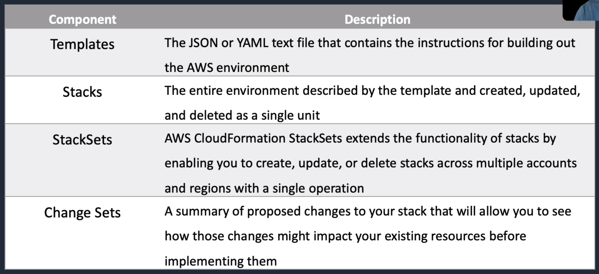
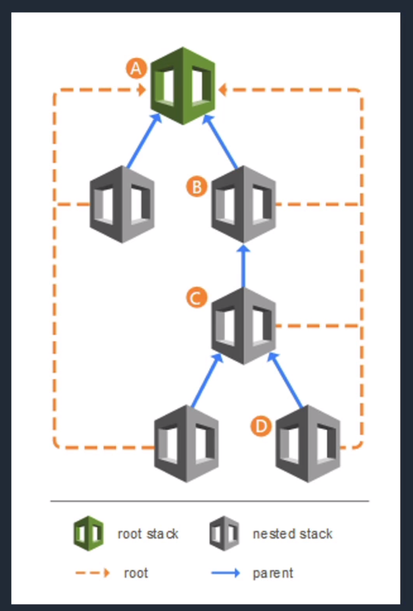

# AWS CloudFormation

## General Info
Service to manage, configure and provision AWS infra as code
Resources are defined using a CloudFormation template
CloudFormation interprets the template and makes the appropriate API calls to create the resource defined
Supports YAML or JSON
Region specific, we need to be in the right region (AMI, ...) to deploy our stack

CloudFormation handles the order of resources instantiation

CloudFormation can be used by users or by other services like Elastic Beanstalk.

**When creating a stack, we can select Rollback on failure yes/no (yes by default) to remove any resources created if something fails. No is useful for debugging purposes when the stack is failing.**

Benefits:

- infra provisioned constently with fewer mistakes
- less time and effort than configuring things manually
- can version control and peer review templates
- free to use (only charged for what we create)
- can be used to manage updates & dependencies
- can be used to rollback and delete the entire stack

**If we have to run a database with CF and cannot have any kind of performance degration after being deployed, the good practice is to test the CF script several times and load-test it to a value matching the anticipated maximum peak load. EBS pre-warning is no longer needed unless we restore from S3 based snapshot**

Can delete a stack and remove all resources created (DELETE_IN_PROGRESS)

CF is free, we pay for the underlying resources
CF provides a set of app bootstraping scripts (install packages, files, services, ...)
CF works with lots of AWS services (EC2, EBS, VPC, IAM, S3, RDS, ELB, ...)

Can synchronize resources creation with **WaitCondition**

Provide functionality which can be utilised by CI/CD servers

CloudFormation can run scripts within instances (via User Data), can expand files and load directories within instances from source files

Each stack has a name and ID, a template can be applied any number of time -> each stack and resources are unique.

The events during stack creation, update and deletion can be configured, meaning CF can be as strict or relaxed, as controlling or as messy as we want.

**It is possible to do blue/green with cloud formation because we can switch DNS, ASG, ... -> we have complete control over the infrastructure.**

CF uses CreationPolicy for EC2 and EC2 auto scaling (best practice) and use cfn-init to define what apps to install.

Deploy a template updates the entire stack which may not be what we want.

CF uses UserData and cfn-init => can update cfn-init data but cannot update UserData on a running EC2 instance. UserData is not a "desired-state" effect, it is just a list of commands (use UserData to install 3rd party agent for desired state process). For desired state process, it is cfn-init and AWS::CloudFormation::Init.

To update the AMI with new software -> change ASG launch configuration resource and update the stack, use the UpdatePolicy attribute for the ASG.

To update an app -> update cfn-init and then update the stack. To update a stack, update resources in templates. CF will read the differences between old and new.

Undeploy allows us to delete the stack. DeletionPolicy allows us to selectively keep resources (Retain allows us to keep anything), snapshot is offered on the following services EBS, RDS, RedShift..

When CF waits for signal, the status is CREATE_IN_PROGRESS

When lifecycle hooks end: CONTINUE or ABANDON

Limits:

* 200 stacks per account 
* Template, parameter, output and resource description fields are limited to 4096 char
* up to 60 parameters and 60 outputs per template

Stack can have a role (need the team to have iam:PassRole permission)

## Core Knowledge
* consistent deployment -> cloudformation (keyword!)
* few mistakes (human error)
* less time and effort than configuring resources manually
* can use version control and peer review for the templates, uploaded to CloudFormation or S3
* free to use
* can be used to manage updates and dependencies
* can rollback and delete the entire stack
* cloudformation assumes a role we give it and execute the API calls defined in the template
* logical ID (inside cloudformation), physical ID once the resources have been created



Stack creation errors:
* auto rollback on error is enabled by default
* charged for resources provisioned even if there is an error

StackSets
* extends functionality of stacks by enabling us to create, update, or delete stacks across multiple accounts and regions with a single operation
* use admin account and target accounts across specified regions
* stack set is managed by signing in to the AWS administrator account in which it was created

NestedStacks
* re-use CloudFormation code for common use cases
* example: standard config for load balancer, web server, application server
* no copy of code, create a standard template for each common use case and reference from within our CloudFormation template



Change Sets
* two methods for updating a stacks: direct update or creating and executing change sets
  * direct update
    * submit changes and AWS CloudFormation immediately deploys them
    * only use them when we need quick deploy
  * change sets
    * can preview the changes AWS CloudFormation will make to the stack and then decide whether to apply those changes
    * we provide a template file for an existing stack, CloudFormation compares and returns the results
    * 

## Concepts

* infra as code -> template can be version controlled, collaborative, automated
* single template or multiple templates, must be available in S3 buckets => template is the class in OO, the stack is the instance of the class. There is a size limit for a stack so it is better to organize multiple templates and stacks.
* can interact with other tools such as Puppet, OpsWorks, Beanstalk, ... -> CF creates instance and Puppet put it in a certain state
* we can validate our template before applying it - basic lint
* Stacks can be updated
  * change AMI
  * updating cloudwatch alarms
  * updating ASG
* Stacks update steps
  * update template
  * update stack with new template -> **only the resources which are updated in the template will be updated in the stack**
  * if successful -> status is **UPDATE_COMPLETE**
  * when doing an update, there are opportunities to review our updates before applying them
* Stack policies - can be used to prevent resource updates
  * json documents
  * similar to IAM and bucket policies
  * **applies to all users who have access to the stack (production stack should not be changed by anybody)**: allow/deny actions to users within the stack
* Consideration for updating a stack
  * how will the update affect the resource
  * is the change mutable (change AMI, ...) or immutable
* Rollbacks and deletion of stacks
  * can change the default behavior to not roll back. Investigate the resource that caused any issues by checking logs then manually delete the stack
  * if anything fails during the stack creation -> rollback, we can disable that behavior for troubleshooting
* rollback failure reasons
  * nested stacks - dependencies between resources, needed to delete them first
  * a resource was modified outside of the template => bad practice, only update through cloud formation
  * S3 buckets not empty so cannot be deleted by CF (only valid for CF)
  * need to have permissions to update or delete the resources within the stack
  
easier to maintain small templates which are nested in a CF template than a big one

## Deployments strategies

when considering CF deployments, we need to look at 

* deployment methods
* environments
* requirements (time, cost, application)
* lifecycle of the application

Bootstrapping applications with CloudFormation (helper scripts) -> can install, configure, start services on EC2 instances. **Called directly from the CF template.**

* cfn-init: AWS::CloudFormation::Init
* cfn-signal
* cfn-get-metadata
* cfn-hup

Bootstrapping considerations -> bootstrapping takes time

* **speed**: can speed up by pre-baking AMI and deploy with auto scaling
* **security**: use **NoEcho** property set to true to hide sensitive information. We can also use parameters in the template.
* **downtime**: perform rolling updates on auto scaling groups to avoid downtime => **"update policy" in the template**

Deploying with CF and **Puppet** => use CF helper scripts to deploy Puppet first

* use puppet to provision, configure and patch applications
* puppet deployments have a master and client nodes
* Puppet provides config management and ensure the state of our instances
* **=> great for applications that have a longer lifecycle**, not immutable infra, we need to update it so we don't throw everything away each time there is an update

Deploying with CF and **OpsWorks**

* OpsWorks supports Chef recipes
* OpsWorks supports dynamic configurations **(ideal for apps with longer lifecycles)**
* Use CF to manage OpsWorks resources while OpsWorks configures software, deploys applications, scales the environment and monitor resources
* OpsWorks provides a higher level of abstraction, making it more convenient to deploy certain environments
* **=> better suited for longer deployments, not so great for shorter deployments**

Deploying with CF and Elastic **Beanstalk**

* Beanstalk can handle deployments
  * all at once deployment
  * rolling deployment
  * rolling with additional batch
  * immutable deployment
* this deployment can help decouple our environment
* can integrate beanstalk with services like RDS, S3, DynamoDB without having to throw away these important resources

**Using Beanstalk with CF vs using OpsWorks with CF**

* doesn't allow as much flexibility for some configurations and deployments
* beanstalk makes a lot of configuration for us by default, OpsWorks requires more config
* **is more suitable for shorter application lifecycles where an environment can be thrown away with each deployment**

Deploying with CF and code services

* can use CF to provision the infrastructure then deploy and manage applications through CodeDeploy, CodeCommit and CodePipeline

**In-Place vs Disposable methods**

* **in place upgrades**
  * perform updates on existing resources, faster (don't have to wait on new resources), can be used with applications that don't keep sessions
  * **OpsWorks and puppet can be used and are recommended**
* **Disposable upgrades**
  * roll out a new set of resources and remove older ones
  * work well with immutable infrastructure and blue/green deployments
  * **Beanstalk and CF are better suited for this (although OpsWorks and Puppet can be used)**

## Usage

In cloudformation, we can create resources different way:

- Create a Stack: create with file or with a designer, there are some sample templates that we can reuse, or S3 (upload or select from S3)
- Create a StackSet: container for AWS CloudFormation stacks to provision stacks across AWS accounts and regions 
- Design a template: using AWS CloudFormation designer
- Template from existing resources: CloudFormer creates template from existing resources.

## cfn commands

- cfn-init: reads templates metadata from AWS::CloudFormation::Init and acts accordingly to fetch and parse metadata from CF, install packages, write files to disk, enable/disable and start/stop services
- cfn-signal: sends a signal to CF to indicate whether EC2 instances have been successfully created or updated
- cfn-get-metadata: parse and retrieve info from CF metadata and print it to standard out.
- cfn-hup: daemon that detects changes in resource metadata and runs user-specified actions when a change is detected
- cfn-nag: performs additional evaluations on templates to look for potential security concerns
- cfn-check: performs deeper checks on resource specifications to identify potential errors before they emerge during stack creation

## Terminology

**Stack**: Cloud Formation unit of (logical) grouping for infrastructure, can be a project, a component of a project, an atomic individual component infrastructure such as an S3 bucket. The stack controls the lifecycle of the infra structure.

**Template**: JSON doc giving CF instructions on how to act and what to create. A template can be used to update and create a stack.

**Stack policy**: IAM style policy statement which governs what can be changed and by who.  Can be added at creation time via CLI/Console and added to an existing stack afterwards via the CLI. A policy **cannot** be removed afterwards but can be updated.

## Workflow

1. User create a CloudFormation template
2. User add template to CloudFormation via Create Stack operation
3. CloudFormation creates the resources specified in the template; there is a single template limit of 200 but there are ways to get around that

We can then update the template if we want. CloudFormation will update the configuration and create new resources based on the update.
We can then delete the stack if we want. Some resources might be left alone if we defined it.

## When and where to use

- template instead of doing manual deployment, gain time if we have to redo the infra
- create a repeatble pattern environment (wordpress blog + DB)
- run automated testing for CI/CD environments, create a dedicated, clean environment, inject code, run testing, produce results and delete the test environment; all with no human input
- be able to define an environment once, and have it deployed to any region of AWS without reconfiguration. Need to design it clean and generic
- manage configuration using software development style versioning and testing concepts (Infra-as-code)

**A template should be designed so it is equally suitable for X applications, in one or more regions. Portability = no static name, ...**

## Template

YAML or JSON template used to describe the endstate of the infrastructure (provisioning or changing)
Once created, upload to CloudFormation using S3 (cannot delete the bucket in S3 if it is used by CF)
CloudFormation reads the template and makes API calls
Resulting resources are called a **stack**

**Only the resources part in the template is mandatory, the rest is optional most of the time.**

### Structure

**AWSTemplateFormatVersion**: "2010-09-09" **=> only available version**

**Description (optional)**

**Metadata (optional)**

**Parameters (optional)**: input values needed to be provided when creating the stack, can do some checks like AllowedValues, Type, ... Parameters can be passed to the template via Console, CLI or API. Parameters can influence directly or indirectly the resources creation (ip addresses, instance size, names, password, ...).
Each parameter has a **type** (String, Number, List, CommaDelimitedList and lots of AWS specific types like AWS::EC2::KeyPair::KeyName, AWS::EC2::AvailabilityZone::Name).
Parameter can also have a **default value** that will be used if non is specified.
Parameter can be limited to **allowed values**: specify one or more values which the parameter can take (Production, Dev, Testing, ...).
Parameter can allow a certain **pattern**: regular expression that defines the format the paramater can take
For numbers, we can have **Min&MaxValue**, for String, **Min&MaxLength**

https://docs.aws.amazon.com/AWSCloudFormation/latest/UserGuide/parameters-section-structure.html
**Parameters are important, they also remove some of the power of cloud formation. By relying on parameters for naming, we lose the possibility to instantiate templates without human interactions.**
**Without params, CF picks generated names for elements -> can reapply the templates indefinitely**

**Conditions (optional)**: test a condition and take action based on the result, provision resources based on environment. Can have conditional elements to resources or the whole resource can be conditional.

**Mappings (optional)**: set user defined key-values based on region (RegionMap -> eu-west-1 -> ami = ami name to be used)

**Transform (optional)**: include snippets of code outside the main template like code for lambda function, some code snippets provided by AWS, ... => good for code re-use, stored in S3, reference resources located in S3 like lambda code (Serverless Application Model (SAM)) or reusable snippets of CloudFormation code
https://docs.aws.amazon.com/AWSCloudFormation/latest/UserGuide/CHAP_TemplateQuickRef.html

**Resources (mandatory)**: AWS resources that we want to deploy, CloudFormation doesn't support all the resources in AWS but it gets better over time.
Each resource consists of a **logical ID (friendly name)** (-> used as reference in other parts of the template) and a **type** MUST be specified within the template for each object being created (type is something like AWS::RDS::DBInstance).
Each resource contains a **properties** JSON object, used to configure resource specific elements, some of which may be **required** depending on the resource type.
If a name is required (for example a S3 bucket name), one will be generated based on the stack name and random letters -> mystack-bucket-fjkelsjflskjfs302
If we don't name things with parameters, we can have generated names to have large scale template re-use.
**when the stack with generated name is deleted, the resources are also deleted - self cleanup => is it the same with resources named via parameters like a S3 bucket ?** 

"Parameters": {
    "DBPassword": {
        "Type": "String"
    }
},
"Resources": {
    "MyDB": {
        "Type": "AWS::RDS::DBInstance",
        "Properties": {
            "MasterUserPassword": {"Ref": "DBPassword"},
            ...
        }
    }
}

**Outputs (optional)**: output to display at the end of the stack creation (instance ID created, ...). Display in the CLI or the Console. Can also be used in **parent stacks**.
A stack can have many outputs and each output can be a constructed value, parameter references, pseudo parameters or an output from a function such as fn::GetAtt or Ref

"Resources": {
    "Bucket1": {
        "Type": "AWS::S3::Bucket"
    }
},
"Outputs": {
    "BucketName": {
        "Value": {"Ref": "Bucket1"}
    }
}

### Nesting

Template contains resources but can also contains whole stacks nested within parent template. Nested stacks can themselves have nested stacks.

Once a nested stack is created, it generates output that can be referenced in the parent stack. Stacks are executed sequentially or do we have some parallelism when we don't have any dependencies between them ?

Allows a potentially huge set of infrastructure to be split over multiple templates => **there are size limits to a template/stack (460k template limit assuming it is in S3).** Updating via the CLI potentially has smaller limits. We also have 200 resources limit in one template or stack. We also have 100 mappings, 60 parameters, 60 output limit per stack or template (by nesting, we can overcome these limits).

Allows more effective infrastructure as code reuse. With only one template, we may not always need every component. With nesting, we can split off infrastructure and/or resources. Smaller templates to maintain.

```json
"SQLStack": {
    "Type": "AWS::CloudFormation::Stack",
    "Properties": {
        "TemplateURL": "https://s3.etc.etc/template.json",
        "Parameters": {
            "VPC": {"Fn::GetAtt": ["AD", "Outputs.VPC"]}
        }
    }
}
```

**If we don't pass parameters, the default nested default will be used. If there isn't a default and we don't pass anything, the create will fail.**

## Intrinsic functions and conditionals
https://docs.aws.amazon.com/AWSCloudFormation/latest/UserGuide/intrinsic-function-reference.html

inbuilt functions provided by AWS to help us manage, reference, conditionally act upon resources, situations and inputs to a stack => if/else

currently available:
* Fn::Base64 -> **some parameters like EC2 User Data require it (base64 encoding)**; accepts plain text and output base64 (for example, yum command to base64 for EC2 bootstrap script)
{"user-data": {Fn::Base64": "yum upgrade -y"}}

* Fn::FindInMap -> mapping lookups, accepts a 'mapping object', one (top level key) or two (top level key + second low level key) keys and returns a value. Essentially used to query a hash/dict lookup (like mappings for AMI)
"Mappings": {
    "RegionMap": {
        "us-east-1": {"32": "ami-6411e20d", "64": "ami-7a11e213"}
    }
},
"myEC2Instance": {
    "ImageId": {"Fn:FindInMap": ["RegionMap", {"Ref": "AWS::Region"}, "32] }
}
=> select 32bit version of image based on the region referenced by Ref.

* Fn::GetAtt -> can provide attributes of resources created in a stack as an output , advanced reference lookups on non default values of resources (nested stacks and custom resources), specific values (EC2 IPs, ...). **Get attribute of an object within the template OR a nested template. Ref is different, it allows reference to an object for another object.**
{ "Fn::GetAtt": [ "logicalNameOfResource", "attributeName" ]}

* Fn::GetAZs -> retrieval of AZ for a rejoin -> {"Fn::GetAZs": "region" }, if specified with a region, it returns a list of AZ in that region. If region is omitted, returns list of AZ of the region where the template is executed (like { "Fn::GetAZs": {"Ref", "AWS::Region" }}), we can then use Fn::Select instead of specifying one manually

* Fn::Join -> can be used to create complex strings
"Fn::Join": [":", ["a", "b", "c"]] -> "a:b:c"
a, b, c could be outputs from any other intrinsic function, including Ref.
Funciton is generally used to construct complex values to be used by other resources, functions, property values

* FN::Select -> used for value selection from list or array, list starts at index 0
{ "Fn::Select": ["0", { "Fn::GetAZs": "" }]} -> pick first AZ from the region execution template
**often used when creating subnets within a cloud formation template**

* Ref -> reference an **Object ID** as the value. CF will reference the name parameter. Reference other resources and can be used to obtain default attributes values from another resource. Reference other objects or parameter values being created in the template, rather than properties being explicitly specified

"Properties": {
    "ImageId": "ami-2f72654",
    "SubnetId": "subnet"
}
=> will only work in one VPC, one region and one account

We could improve that with "SubnetId": {"Ref": "MySubnet"} with MySubnet specified elsewhere
**Note that some regions have a limited number of AZs available so we need to make sure that we have enough AZ in the region before applying the template with too many AZ requests => use 0 and 1 for index, avoid 2+ AZ values if we want it to work everywhere**

Conditional functions
* Fn::And => true if all input conditions are true otherwise false
  "Fn::And": [{condition}, {...}]
* Fn::Equals => true if two arguments are equals
  All CF resources can have a condition statement "Condition": "isProduction" only creating the resource if production usage is true. We define a parameter platform which can equal "production" or "development"
  "isProduction": {
    "Fn::Equals": [{"Ref": "platform"}, "production"]
  }
  "isDevelopment": {
    "Fn::Equals": [{"Ref": "platform"}, "development"]
  }
  **We could add the Fn::Equals directly on the Condition line per resource but using a condition resource allows us to reuse logic across multiple resources
* Fn::If => accepts a list, first element is a condition, if true, the second element is returned, otherwise the 3rd (may want to use template for dev and prod)
  {"Fn::If": ["production", "m4.xlarge", "t2.small"]} for EC2 "InstanceType" for example
* Fn::Not => returns false if its condition evaluates to true, otherwise returns true (it inverts the condition), **single condition**
  "Fn::Not": [{condition}]
* Fn::Or => true if any of its input conditions are true otherwise it returns false
  "Fn::Or": [{condition}, {...}]

## Stack Creation & DependsOn

1. template upload / S3 template reference
2. template syntax check (JSON + Ref are available), it doesn't check the suitability of the parameters against resources properties. It doesn't check either any references to keys within mappings are present. It does check that the mappings exist.
3. enter stack name (unique to account and region combination),  parameter verification & ingestion. Checks parameters (control directives), replace missing values by default values if needed.
4. CloudFormation process templates & stack creation
   1. resource ordering (CF reviews all resources and assess known dependencies)
   2. resource creation, respect order dependency hierarchy + synchronization when needed
   3. status available in the UI/CLI, Output generation (Ref, Fn::GetAtt), outputs available from UI/CLI for the current stack or via Fn::GetAtt call from any parent stack (nested stack).
   4. Stack completion or rollback

CF has built in checking for traditional dependencies

- knows that a VPC is needed before creating subnets (example) and subnets are needed before creating instances
- it doesn't know about restrictions on our particular infrastructures like if we go beyond basic AWS services creations

**DependsOn**:

* influences automatic dependency checking of cloudformation
* allows us to direct cloud formation on how to handle more complex dependencies

For example, EC2 instances need a NAT instance to be running prior to bootstrapping; an EC2 instances which need a working RDS instance prior to DB table injection

CloudFormation also uses **DependsOn** as a directive for how to delete, update or rollback resources. It will remove an EC2 instance before RDS if EC2 depends on RDS.

**DependsOn is controlled via a DependsOn attribute in an object. It references another CloudFormation resource, but doesn't use the Ref function. It can be a simple String referencing one object or it can be an array referencing multiple.**

"EC2": { "Type": "AWS::EC2::Instance", "DependsOn": "RDS"}

"EC2": { "Type": "AWS::EC2::Instance", "DependsOn": ["RDS1", "RDS2"]}

**CloudFormation will give us an error if we have loops in our dependencies chain.**

## Resource deletion policies

* policy/resource setting which is associated with each resource in a template

* a way to control what happens to each resource when a stack is deleted

* policy value can be one of:

  * delete (default if none specified)
  * retain
  * snapshot (depends on the type of resource

* must be defined at the top level of the resource and not inside the object properties

  "myS3Bucket": { "Type": "AWS::S3::Bucket", "**DeletionPolicy**": "Retain" || "Delete" || "Snapshot"}

### Delete policy

default policy -> produce transitive environments (env that can be instantiated and removed without change in wider environment)

removed along with the stack upon a delete operation

useful for testing env

CI/CD/QA workflows

presales environment -> customer has access to the env for demo

Short life cycle / Immutable environments

=> services must be bootstrapped or use a custom AMI

### Retain policy

any objects created as part of the template create, live beyond the lifecycle of the stack => retained upon deletion (exact opposite of delete)

It is not the default as it is potentially messy, infrastructure can begin to be inconsistently managed if not tied to a stack lifecycle

Policy most common with traditional infrastructure architectures

**Good for Windows Server Platforms (Active Directory), servers with state, SQL, Exchange, File Servers**

This is a non immutable architectures, upgrades are performed in place.

**Negatives: less control of billing, resources are still charged for after stack deletion**

With retain, CloudFormation is used as a creation tool rather than creating objects manually. Use CF for consistency and repeatability but we used another tool to manually control the lifecycle of the environment.

### Snapshot

Restricted policy type which at present only available on a small number of resources types

* AWS::EC2::Volume
* AWS::RDS::DBCluster
* AWS::RDS::DBInstance
* AWS::RedShift::Cluster

Takes a snapshot then delete, cost continues for the storage after the object is deleted.

**Benefit is that we can recover data at a later stage. Generally used with data processing workloads where our critical elements are generated data. Allows reference or continued processing at a later time.**

## Stack updates

A **stack policy control** first checks the stack policy(do we have the rights to do update it), updates can be prevented => **policy is always evaluated first.**

``` javasc
"Statement": [
​	{
​		"Effect": "Deny",
​		"Action": "Update:*",
​		"Principal": "*",
​		"Resource": "LogicalResourceId/MyEC2Instance"
​	},
​	{
​		"Effect": "Allow",
​		"Action": "Update:*",
​		"Principal": "*",
​		"Resource": "*"
​	}
]
```

=> prevent updates on "MyEC2Instance" (logical id) but allow all the other updates

Facts:

* by default, the absence of a stack policy allows all updates
* once a stack policy is applied, it cannot be deleted
* once a stack policy is applied, by default all objects are protected, Update:* is Denied.
* to remove the default DENY protection of an applied stack policy, we need to update the policy with an explicit "Allow" on one/more/all resources

``` json
{
	"Effect": "Allow",
	"Action": "Update:*",
	"Principal": "*",
	"Resource": "*"
}
```

**Anatomy: **

* contains one or more JSON policy documents {} in a list [] which forms a statement.

* each JSON policy document

  * has an "Effect" as with IAM policies, this is Allow/Deny
  * has "Resource" to which the policy section applies, this can be a single resource or a wild card: "Resource": "LogicalResourceId/Subnet*"
  * can use "NotResource" for inverted logic
  * has a "Principal" which for stack policies is required to be a "*"
  * has an "Action" which can be "Update:Modify", "Update:Replace", "Update:Delete" or "Update:*"

* The last element of the stack policy is "Condition" element where the "Resource" element allows single or wildcard matching against the LogicalId => condition allows the same based on resource type

  ``` json
  "Statement": [
  	{
          "Condition": {
              "StringEquals": {
                  "ResourceType": [
                      "AWS::EC2::Instance",
                      "AWS::RDS::DBInstance"
                  ]
              }
          }
  	}
  ]
  ```

  or "ResourceType": ["AWS::EC2::*"]

**How resources are updated:**

* depend on the resource or property being updated
* update can impact a resource in four possible ways
  * no interruption (no service impact)
  * some interruption (reboot or small service impact)
  * replacement (resource is removed and replaced)
  * delete
* examples
  * "AWS::EC2::Instance"
    * "AvailabilityZone" -> replacement because EC2 can't be moved between AZs
    * "EbsOptimized" -> some interruptions (EBS-Backed) - shutdown, edit, restart again
    * "ImageId" -> replacement
    * "InstanceType" -> some interruptions (EBS-Backed) - shutdown, edit, restart again
  * "AWS::DynamoDB::Table"
    * "Tablename" -> replacement
    * "ProvisionedThroughput" -> no interruption
  * "AWS::AutoScaling::LaunchConfiguration"
    * everything requires replacement

https://docs.aws.amazon.com/AWSCloudFormation/latest/UserGuide/aws-template-resource-type-ref.html

### Auto Scaling Replacing updates

When we create a new Launch Config and replace the one in an ASG, it will only be applied for new instances, not the current one ... but we can overcome that.

We can define **CloudFormation UpdatePolicy** that describes how instances and ASGs are updated depending on the policy what we configure

#### AutoScalingReplacingUpdate & AutoScalingRollingUpdate

**AutoScalingReplacingUpdate** & **AutoScalingRollingUpdate**: when we make changes to the Launch Configuration, the ASGs subnets or when an update includes instances that don't match the current Launch Configuration

=> minimal downtime, updates instances of an ASG

**AutoScalingRollingUpdate** -> update instances one by one in the ASG (number of instances configurable: max batch size & min instance in service, can also be based on percentage), **slower** than replacing updates, **no downtime**

**AutoScalingReplacingUpdate** -> create another ASG with the new instances and delete the other one. We will only replace it if everything is fine with the new one, **possible downtime but faster**

When updating a stack, we can see a preview of what we are about to change. We can see "Replacement" -> Conditional for our ASG because it depends on the successful creation of the new one.

#### AutoScalingScheduledAction

update stack that includes an ASG with an associated scheduled action. 

**Can be used with predictable load patterns** -> update min size, max size, desired capacity based on the time of day (cron schedule), ...

We have 2 configuration, one for up and one for down. Both based on different cron expression.

### Summary

* stack policies are used to control which resources can be updated and by what actions
* by default, all actions are allowed on all resources
* when setting a stack policy, all resources become protected by default, we must explicitly allow an action on a resource. Stack policies apply to all users who try to update the stack
* policies can be created at stack creation time or applied to an existing stack (must use CLI)
* we can only have 1 stack policy per stack but one policy can have multiple statements
* policies have: Effect, Action, Principal, Resource, Condition
* Actions options -> Update:Modify, Update:Replace, Update:Delete, Update:\*
* we can have condition in a statement like StringEquals, StringLike, ... If we apply that on a ResourceType "AWS::RDS::DBInstance" -> will impact all the RDS instance in our template
* how can we update protected resources ? We can use an overriding stack policy
  * policy is temporary, only for that specific update
  * we specify it at update time (via the console or CLI)
  * the overriding policy needs to have an allow statement for the resources we want to update

```json
{
    "Statement": {
        {
            "Effect": "Allow",
            "Action": "Update:*",
            "Principal": "*",
            "Resource": "*"
        },
        {
            "Effect": "Deny",
            "Action": "Update:*",
            "Principal": "*",
            "Resource": "LogicalResourceId/ProductionDatabase"
        }
    }
}
```

This allows update on anything except on the database.

=> The stack policy can be defined in the **Options** of CloudFormation when we create a stack, we can also configure a role, SNS, termination protection, ... Stack Policy where we can copy/paste a JSON text or upload a policy file JSON.

## Resource creation synchronization

**DependsOn** is used for controlling resource creation order within cloud formation but it has one crucial limitation: **we don't have the certitude that the resource we depend on is operational, we only know that it has been successfully created**. For example, if our app depends on NATFirewall (Type EC2::Instance"), it will be created once the NATFirewall is created but that doesn't mean that it is working as expected.

To properly manage that, we have **Creation Policies**, **Wait Conditions** and **Wait Condition Handlers**. They all do the same task, influence WHEN a resource is marked as completed, delaying until it is actually ready. **The only difference between the two is that Creation Policies should be used for EC2 creation and ASG.**

We can programmatically say when a resource is ready instead of relying on basic default AWS status check.

### Creation policy

**Creation policies**:

* can only be used on EC2 instances and Autoscaling groups (currently), we also specify a timeout and the number of signals to receive. Count is one by default, if we only expect 1 signal, we can omit the "Count" property in CreationPolicy
* pause the creation of a resource until a certain number of success signals have been received within a time period
* Use cases:
  * useful when configuring EC2 instances with bootstrapping
  * EC2 instances in ASG
* signals can be sent back to the stack using helper scripts or through the SignalResource API or CLI call (signals can be seen in events of the stacks)
* CloudFormation invokes the CreationPolicy when its associated resource is created
* Creation policies and wait conditions: can use creation policies with wait conditions in order to 
  * nest creation policy inside the wait condition
  * track progress of bootstrapping an instance
  * coordinate the creation of different resources. For example, once an action on an instance has completed, trigger the creation of another resource that depended on that action

#### Example

1. the creation policy definition within the EC2 or autoscaling resource

   ``` json
   "AutoScalingGroup": {
       "Type": "AWS::AutoScaling::AutoScalingGroup"
       "Properties": {
   		"AvailabilityZones": {"Fn::GetAzs": ""},
           "DesiredCapacity": "2",
           "LaunchConfigurationName": {"Ref": "MyLC"}
       },
       "CreationPolicy": {
           "ResourceSignal": {
               "Count": "2",
               "Timeout": "PT15M"
           }
       }
   }
   ```

   Here we have the important info: **DesiredCapacity**, **Count**, **Timeout (15 minutes)**. CloudFormation expects to receive two signals within 15 minutes.

2. the signal configuration within instance EC2 user-data or launch configuration user-data

   ``` json
   "MyLC": {
       "UserData": {
           "Fn::Base64": {
               "Fn::Join": ["", [
                   "cfn-signal -e0 --stack ",
                   { "Ref": "AWS::StackName"},
                   " --resource AutoScalingGroup ",
                   " --region ", { "Ref": "AWS::Region"}, "\n"
               ]]
           }
       }
   }
   ```

   **cfn-signal** is here part of the user data, performed as the last action (we might have logic testing for completion of any other commands)

3. when the number of signals is equal or more than the count in the creation policy, the resource is marked as complete

### Wait Conditions and Wait Condition Handlers

**Wait Conditions** and **Wait Condition Handlers** can be used in much more complex scenarios involving complex interaction between resources. Conditions and handlers are two related components that work with resources to hold processing on a template pending a status signal.

A wait condition handler is a cloud formation resource with no properties but it generates a signed URL which can be used to communicate SUCCESS or FAILURE.

Wait conditions generally have four components:

* DependOn the resources we are waiting on
* a Handle property that references the signed URL of the handler
* a response timeout in seconds
* a count, if none specified, the default is 1

``` json
"waitHandle": { # wait condition handle
    "Type": "AWS::CloudFormation::WaitConditionHandle"
}
"waitCondition": { # wait condition
    "Type": "AWS::CloudFormation::WaitCondition",
    "DependsOn": "MyEC2",
    "Properties": {
        "Handle": {"Ref": "waitHandle"},
        "Timeout": "3600",
        "Count": "1"
    }
}
"MyEC2": { # waited resource
    "Properties": {
        "UserData": {
            "Fn::Base64": {
                "Fn::Join": ["", ["some command", " ", "URL=", {"Ref": "waitHandle"}]]
            }
        }
    }
}
```

We can provide a status update with curl on the signed URL or cfn-signal.

WaitConditions and handlers - Creation policies difference:

* wait conditions and handles -> can have complex orders. waitCondition could depend on many resources and have many resources depending on it, acting as a hold point in the template

* additional resource can depend on the WaitCondition, **we can influence order by using DependsOn with WaitConditions**

* additional data can be passed back via the signed URL generated by a wait condition handler

  format of the data:

  ``` json
  {
      "Status": "StatusValue",
      "UniqueId": "Some unique ID",
      "Data": "Some data",
      "Reason": "Some reason"
  }
  ```

  any of the above values can be accessed within the template using { "Fn::GetAtt": ["waitCondition", "Data"]}

### Summary

**CF Wait Conditions**

* can be used to pause the creation of a stack and wait for a signal to continue

* handles the order of stack creation, synchronization of the deployment, ...

* useful when creating and configuring resources outside the template

* declared in the template

* Remain in CREATE_IN_PROGRESS state until they receive the required number of success signals (=> complete/continue creation of the stack) or time out (=> rollback)

* Using Ref with the handle gives access to a pre-signed URL where we can send success or failure signals

* to send a success or failure signal (**cfn-signal**), we can send an HTTP request with the pre-signed url. The unique ID is for each signal.

  ```json
  {
      "Status": "SUCCESS (or FAILURE)",
      "UniqueId": "my UUID",
      "Data": "The application is ready",
      "Reason"
  }
  ```

* ```json
  "Data": {
      "Fn::Base64": {
          "Fn::Join": {
              "", 
              [
                  "my actions",
                  "/opt/aws/bin/cfn-signal -e 0 -r \"Instance creation complete\" ",
                  {
                      "Ref": "WaitHandle"
                  },
                  "'\n"
              ]
          }
      }
  }
  ```

* when should Wait Conditions be used ? Use cases

  * synchronizing resource creation between different resources in the template
  * waiting for external resources (like an on-prem resource) to be created

* **wait conditions are not best practices for EC2** instances creation -> AWS recommends **creation policy**

* can also combine the use of DependsOn and WaitConditions to make the latter wait for a resource to be created before the timeout clock starts ticking

* WaitCondition has 3 properties: Handle (with Ref to a handler), Timeout, Count (number of success signals to receive). The WaitCondition has a DependsOn reference to the resource. The handler is "WaitHandle" and has a type such as "AWS::CloudFormation::WaitConditionHandle"

* for AMIs in our templates, we can have a mappings for the correct region. We can also use a lambda to retrieve the latest ones for a region => do not hardcode AMI in the template. The Lambda will use the CLI to describe images for EC2, sort them by name (since they start with YYYY.MM.Ver) and pick the first one that is not in beta (see resources).

## Custom resources

CloudFormation has some limitations:

* not all features of all AWS services are supported, it is lagging behind the recent added services (API Gateway, Lambda, ...)
* cannot operate non AWS resources
* CodeFormation is not code, we have some logic operators/functions, its ability to act pragmatically outside resources is limited

**By using CloudFormation custom resource in addition to other AWS services, we can meet all of the above perceived weaknesses or restrictions.**

**Custom resource = resource type within cloud formation that is backed by Simple Notification Service (SNS) or Lambda (not supported in all regions).**

For custom resources, we need

* "Type": "Custom::ResourceNameHere"
* "ServiceToken": "arn:aws:sns:ap-southeast-2:12345678910:snp" => SNS topic

**When a stack is created, updated or deleted, a SNS notification is sent to a SNS topic containing the event and a payload. Or in the case of lambda, a lambda function is invoked and passed an event with the same information.**

We can see how it is useful for a VPC - QA/Test environment. A cloud formation is used and obtain available subnet range automatically and creates subnets and associated resources based on that dynamic logic. We want to store the assigned/in-use subnets in a DynamoDB table and remove when the env/stacks are removed. (get-record-release)

To do that, we add code as a custom resource, when created/updated/deleted, it posts a notification to a SNS topic.

``` json
"CustomLambdaResourceSubnetPicker": {
    "Type": "Custom::LambdaSubnetLookup",
        "Properties": {
            "ServiceToken": "arn:aws:sns:ap-southeast-2:12345678910:snp",
            "Cidr": "10.16.128.0/17"
        }
}
```

We then have a lambda function which runs when there is a new notification to an SNS topic (or anything subscribed to this topic like an EC2 instance or external application).

**The properties of the custom resources are passed into the SNS topic with the exception of the ServiceToken.** 

The SNS notification will look like this

``` json
{
    "RequestType": "Create",
    "ResponseURL": "http://pre-signed-s3-url-for-response",
    "StackId": "arn:aws:cloudformation:region:123456789012:stack/stack-name/guid",
    "RequestId": "unique ID for this create request",
    "ResourceType": "Custom::LambdaSubnetLookup",
    "LogicalResourceId": "CustomLambdaResourceSubnetPicker",
	"ResourceProperties": {
		"Cidr": "10.16.128.0/17"
    }
}
```

At this point, we could have a lambda function, external system or autoscaling group (with EC2 instances) ready to receive the input from our custom resource (using a chainged SQS). If we use lambda, pretty much anything can be done using the SDK.

On the lambda side, we will see this 'event' object containing the SNS notification (after stripping off the SNS encapsulation)

``` json
"StackId": "arn:aws:stackarn", # id of the stack being created. Will be unique on every create/update/delete of the stack lifecycle
"ResponseURL": "https://presigned-url", # SUCCESS or FAILURE response code
"RequestType": "Create", # can be used by lambda to allocate or purge a subnet (if delete)
"ServiceToken": "arn:for:sns:topic",
"RequestId": "unique id",
"LogicalResourceId": "CustomLambdaResourceSubnetPicker",
"ResourceProperties": {
    "ServiceToken": "arn:for:sns:topic",
    "Cidr": "10.16.128.0/17"
}
```

After the lambda function has performed some logic, we need to respond back to CloudFormation. We use the pre-signed url provided as part of the JSON object into the lambda function. We provide a response payload

``` json
{
    "Status": "SUCCESS", # can either be SUCCESS or FAILURE, will impact the Custom Resources in CF
    "StackId": "stack id", # contained in the original event, should match input data
    "RequestId": "request id", # contained in the original event, should match input data
    "LogicalResourceId": "LogicalResourceId", # match logical resource id of the custom resource in CF
    "PhysicalResourceId": "Physical resource id", # something unique to the custom resource like logical id + random suffix
    "Data": { # can be strings, arrays, json objects
		"PublicSubnet": "10.16.128.0/25",
        "PrivateSubnet": "10.16.128.128/25"
    }
}
```

We can now access this in the CF template.

``` json
{
    "PublicSubnet": {
        "Type": "AWS::EC2::Subnet",
        "Properties": {
            "CidrBlock": {
                "Fn::GetAtt": [
                    "CustomLambdaResourceSubnetPicker", "PublicSubnet"
                ]
            },
            "MapPublicIpOnLaunch": true,
                "VpcId": "vpcid"
        },
        "DependsOn": "CustomLambdaResourceSubnetPicker"
    }
}
```

DependsOn is important because it will only create the VPC after the custom resource has completed.

Use cases:

* stack linked to on-premise resource creation, hybrid, public cloud platform
* stack linked to advanced logic, resource discovery, AWS resources may require configuration element from on premise network, maybe also authentication details
* stack deletion linked to advanced tide operations, backup, monitoring deactivation
* stack linked to on-premise configuration management system
* web stack creation - linked to external monitoring/pen test system
* stack creation/deletion updates a lambda based backup solution, EBS snapshotting
* stack deletion spawns account wide pruning for orphaned EBS volumes

=> The list is virtually limitless

## Helper scripts

Template -> stack -> creation of the stack while calling helper scripts which signal setup completion to CloudFormation

Can be used to 

* send signals back to a stack
* configure and bootstrap instances
* update instances

Access helper scripts:

* pre-installed on the latest version of the Amazon Linux AMI (in /opt/aws/bin)
* also available from the Amazon Linux yum repository
* For windows 2008 or later, we can install them with python

Helper scripts:

* **cfn-init**: can fetch and parse template metadata from templates and use that data to install packages, create and write files to disk, start/stop services => **required options: stack and resource since they define where we are getting the metadata**

  ```json
  "MyResource": {
      "Type": "AWS::EC2::Instance",
      "Metadata": {
          "AWS::CloudFormation::Init": {
              "configSets": {  # use configSets when we want to specifically specify the installation order -> we want to install an app before configuring it
              },
              "install_cfn": {
                  "files": { # some actions with /opt/aws/bin/cfn-init
                  }
              }
          }
      }
  }
  ```

  

* **cfn-signal**: used to signal back to a stack success or failure -> /opt/aws/bin/cfn-signal -e our_exit_code => **required options: stack and resource**

* **cfn-hup**: a daemon that detects changes in resource metadata and runs actions when a change is detected => great to use if we want configuration updates on running instances

  ```json
  "services": {
      "sysvinit": {
          "cfn-hup": {
              "enabled": "true",
              "ensureRunning": "true",
              "files": ["/etc/cfn/cfn-hup.conf", "/etc/cfn/hooks.d/cfn-auto-reloader.conf"]
          }
      }
  }
  ```

  The cfn-hup.conf specifies the stack name and the region but we can also specify this in the template. THere is also the "interval" parameter in minute (check every 5 minutes for instance)

  We specify to the daemon what to do in a hook file (hooks.conf).

  ```
  [hookname]
  triggers=post.add or post.update or post.remove
  path=Resources.<logicalResourceId> (.Metadata or .PhysicalResourceId)(.<optionalMetadatapath>)
  action=<arbitrary shell command>
  runas=<runas user> 
  ```

  We use triggers with a list of conditions to detect. We can have multiple triggers separated by comma.

  Path represents the path of the metadata object and the action defines what will be done exactly -> can be a call to cfn-init

* **cfn-get-metadata**: used to get a metadata block from CF and print it out to the standard output

  ```bash
  cfn-get-metadata --access-key access.key \
                   --secret-key secret.key \
                   --credential-file|f credential.file \
                   --key|k key \
                   --stack|-s stack.name.or.id \
                   --resource|-r logical.resource.id \
                   --role IAM.role.name \
                   --url|-u service.url \
                   --region region 
  ```

## Change sets

Preview how proposed changes to a stack might impact the running resources, for example, whether the changes will delete or replace any critical resources. This does not guarantee that the update will be successful though (account limit, resource that doesn't support an update, insufficient permissions to modify a resource, ...).

Change sets can be created/viewed/deleted in the console or the CLI

Create change set: aws cloudformation create-change-set

View change set: aws cloudformation list-change-sets

Execute change set: aws cloudformation execute-change-set

Delete change set: aws cloudformation delete-change-set

## Resources

Lambda lookup AMI: https://s3.amazonaws.com/cloudformation-examples/lambda/amilookup.zip

Documentation: https://docs.aws.amazon.com/AWSCloudFormation/latest/UserGuide/Welcome.html

API Reference: https://docs.aws.amazon.com/AWSCloudFormation/latest/APIReference/Welcome.html

CLI: https://docs.aws.amazon.com/cli/latest/reference/cloudformation/index.html


