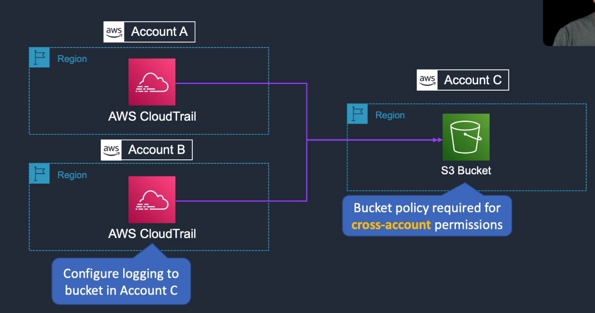
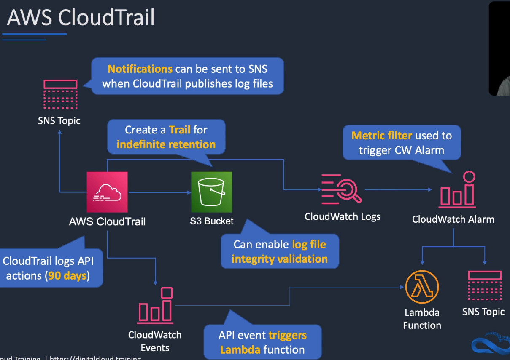
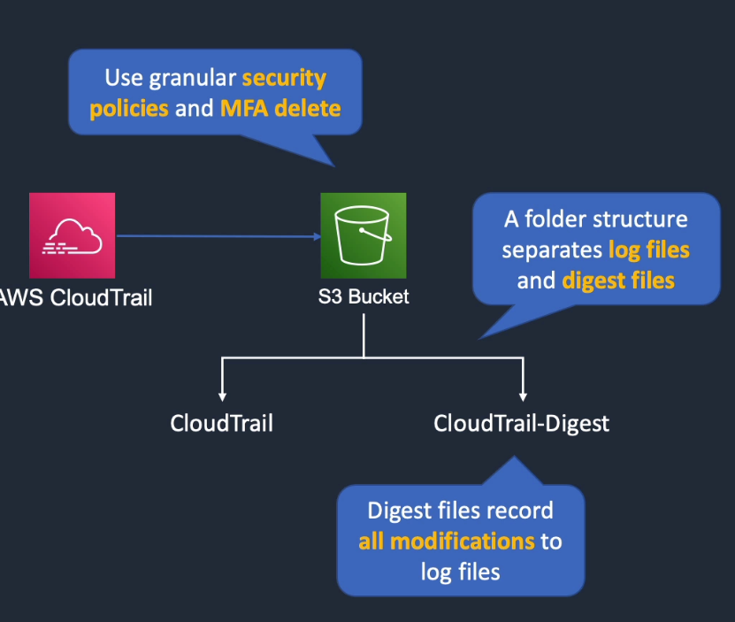

# AWS CloudTrail

## General Info

**CloudTrail monitors API (CLI, SDK, Console) calls in the AWS platform and not performance metrics (CloudWatch)**

Used to capture detailed information about the calls made to Elastic Load Balancing API.

CloudTrail records API calls made by a user **OR** on behalf of a user by an AWS service. Because of that, if we create a CloudFormation stack, we will have a log for **create-stack** and then entries for all the API calls that CloudFormation make to create the stack.

There is an "**invokedBy**" field in the CloudTrail event that we can use to see what triggered the API call.

CloudTrail enables security analysis, track changes to our account (=> **different way than AWS Config**), provide compliance auditing.

CloudTrail can create two types of trails:

* all regions (default): create the same trail in all regions, records the logs in each region in a specific S3 bucket (buckets are region specific) and a CloudWatch log group if we want it too
* one region: specify an S3 bucket that receives events only from one AWS region

CloudTrail is cheap, we pay for S3 storage, management events, insights events and data events.

can aggregate log files across all regions and/or across multiple accounts to a single S3 buckets.

Can customize log storage period with expirations periods, by default logs are stored indefinitely.

API Calls logged by CloudTrail can be passed to CloudWatch in near real time and S3 within several minutes

Storing CloudTrail log files in S3 buckets has a few advantages:

* trail data is stored durably
* new files can trigger an SNS notification or start a Lambda function parse the log file
* data can be automatically archived into Glacier via Lifecycle policies.
* can be used after with Amazon EMR and Redshift to further analyze the data

Advantages of storing the audit trails in CloudWatch:

* near real time
* rerouting information to Amazon ES for search and visualization becomes very easy

=> it is possible to configure CloudTrail to log into both S3 and CloudWatch logs

When CloudTrail is enabled, we can view up to the past 90 days of account activity. Not all services support CloudTrail.
We can have indefinite retention in a bucket, we can even choose which API actions we want to keep or not.

**CloudTrail Event History** (free): 90 days in the past max, specific to a region, only a limited number of events (create, modify, delete API) and account activity. 
If we want more, we need to create a trail (read-only activity, data events, management events, ...). CloudTrail event history cannot be disabled but trails can.

CloudTrail integrated with IAM so easy to control who can see the trails.

Trails are encrypted by default using SSE-S3, good to do: IAM/S3 bucket policies, MFA delete, versioning

**The bucket policy in S3 must be valid otherwise CloudTrail will not be able to deliver log files**

CloudTrail has no impact on performance on the AWS resources or API call latency

possible to validate logs with "validate-logs" CLI command => logs must remain in their original location as delivered by AWS so they cannot be moved before validation

* CloudTrail logs API activity for auditing
* default, management events are logged and retained for 90 days
* cloudtrail logs any events to S3 for indefinite retention
* Trail can be within Region or all Regions
* CloudWatch Events can be triggered based on API calls in CloudTrail
* Events can be streamed to CloudWatch logs + metric filter to perform some action (SNS, Lambda)
* Events
  * management events: provide information about management operations that are performed on resources in our AWS account (API call)
  * data events: information about the resource operations performed on or in a resource (update objects in a bucket rather than change of a bucket)
* multi account and region (use a specific account to store cloudtrail logs)



## Use cases


* track changes to resources
* answer simple questions about user activity
* demonstrate compliance
* troubleshoot
* perform security analysis 
* logs from cloudtrail are not real time, there is a small delay but still quite quick
* log file integrity validation: know if our log files have been tempered with
  * digest files that record all modifications to log files, separate prefix in the logs bucket
  * use granular security policies and MFA delete on the buckets



## Logs

Logs are stored in S3 using Server Side Encryption and are useful to audit our account (can use KMS with own key but incur charges). We can store our logs as long as we like or use S3 LifeCycle rules to archive or delete logs automatically.

**Logs are delivered within 15 minutes** of an API call being made.

**New log files are published every 5 minutes**.

No log files in no API call.

The logs contain:

* identity of who made the API call
* the time of the call
* the source IP
* the request parameters
* the response element returned by the AWS service

Take logs from CloudTrail and stream into CloudWatch logs and use CloudWatch logs for analytics (need to specify a log group and IAM role).
With CloudWatch logs, we can create alarms based on activity, this cannot be done with CloudTrail logs in S3 alone. We pay for CloudWatch logs

Logs can be used to demonstrate that only authorized users have performed certain tasks in our environment in alignment with compliance requirements.

CloudTrail turned on/off will also appear in the logs.

Timestamp are UTC.

By default, CloudTrail log files are stored indefinitely but we can use S3 lifecycle to manage them.

Log files of multiple accounts can be delivered to a single bucket with proper setup

### Search filters
can specify Time range + one of the following attributes: event name, user name, resource name, event source, event ID, resource type

### Integrity validation
feature to determine if a log file was changed, deleted, modified since CloudTrail delivered it to the S3 bucket (auditing). 
Hourly digest files with hash values delivered into another folder in S3 bucket (granular access control policies)


## Creation of a trail

Needed to provide the following information:

* trail name 
* apply trail to all regions: yes/no -> new regions will automatically be added (IsMultiRegionTrail with the API)
* create an S3 bucket: yes/no
* S3 bucket name

All trails in all regions will be delivered to a single bucket. We can update an existing trail and apply it to all regions (~30 seconds).

We can also specify advanced options such as:

* log file prefix
* enable log file validation: yes/no -> use SHA256 for hashing and signing on the log file. With that, it is not currently possible to modify it. We can then use AWS CLI to validate the files (security & audit purposes).
* send SNS notification for every log file delivery: yes/no

Once the trail is active, we can still update the configuration for every option.

We can go to "API activity history" to have a feed of all the calls that are being made on the account (with a delay). When we create a trail, we can see the following: "ConsoleLogin", "PutBucketPolicy", "CreateBucket", "StartLogging", "CreateTrail". => cloudtrail records itself creating the process.

**We only see API calls that are recorded after the trail is created, not the API calls before that.**

Trails data can be sent to S3, CloudWatch logs and CloudWatch events.

## Data events
insights into the resource operations performed on or within the resource itself.

High volume activities (Lambda, S3 objects) and disabled by default when creating a trail.

To record CloudTrail data events, we must explicitly add the supported resources or resource types we want to collect activity on.

=> data events incur additional costs (not the case with management events)

Data events are also delivered to S3 and CloudWatch Events

We can have data events for S3 (actions on objects), Lambda (who invoked, ...), ...

* Management events: management operations performed on our AWS resources
* Data events: log the resource operations performed on or within a resource
* Insights events: identify unusual activity, errors, or user behavior in our account

## Limits

can create up to 5 trails in an AWS region. If a trail is multi region, it counts as 1 trail in each. Different actors can have a trail for different purposes (different encryption, ...).

## CloudTrail processing library
tool to process log files: https://github.com/aws/aws-cloudtrail-processing-library

continuously polling SQS queue, reading and parsing SQS messages, download log files stored in S3, parsing, serializing events in the log file in a fault tolerant manner

## CloudTrail multi account

We can have CloudTrail deliver log files from multiple AWS accounts into a single S3 bucket.

1. Turn on CloudTrail in the account where the destination bucket will belong to account 11111..., do not turn on CloudTrail in any other accounts yet. When creating a trail, enable all regions, encryption with KMS and create a new KMS key. Enable log file validation (integrity). We can optionally send a notification each time a log is created.

2. Update the bucket policy on the destination bucket to grant cross-account permissions to CloudTrail

   1. bucket for the logs properties

   2. permissions

   3. edit bucket policy

   4. change existing policy to add a line for each additional account whose log files we want delivered to this bucket. We don't need to change the first statement (ACL bucket), we just need to change who can put objects in the bucket.

      ```json
      {
        "Version": "2012-10-17",
        "Statement": [
          {
            "Sid": "AWSCloudTrailAclCheck20131101",
            "Effect": "Allow",
            "Principal": {
              "Service": "cloudtrail.amazonaws.com"
            },
            "Action": "s3:GetBucketAcl",
            "Resource": "arn:aws:s3:::myBucketName"
          },
          {
            "Sid": "AWSCloudTrailWrite20131101",
            "Effect": "Allow",
            "Principal": {
              "Service": "cloudtrail.amazonaws.com"
            },
            "Action": "s3:PutObject",
            "Resource": [
              "arn:aws:s3:::myBucketName/[optional] myLogFilePrefix/AWSLogs/111111111111/*",
              "arn:aws:s3:::myBucketName/[optional] myLogFilePrefix/AWSLogs/222222222222/*"
            ],
            "Condition": { 
              "StringEquals": { 
                "s3:x-amz-acl": "bucket-owner-full-control" 
              }
            }
          }
        ]
      }
      ```

3. Turn on CloudTrail in the other accounts. Configure CloudTrail in these accounts to use the same bucket belonging to the account that we specified in step 1 (11111...) and the same settings except that we reuse the same bucket. We need to set the same KMS key than in the CloudTrail config 1111... otherwise it is just standard encryption from S3.

4. in KMS account 11111, update the key policy to add the other accounts to have the possibility to "kms:GenerateDataKey". Now the key can be used by the other accounts for encryption. Note that this doesn't change the encryption of previous logs encrypted with S3, the new ones will be encrypted with KMS. If that is a problem, the key config should be set up before creating the trail in the other accounts.

Important note with KMS is that we have more control over the encryption than simple S3. With KMS, we can have certain people with the authorization to encrypt data and other people with the authorization to decrypt data, or we can have a read only policy for some people and write/delete for some others.

## Billing
History (90 days) is free.

Trail is free, we just pay for the storage in S3 bucket

data events are not free

copies of management events are not free (if we have trail multi region + 1 trail in a region, this counts as a copy)

=> first copy of management events is free of charge in each region
