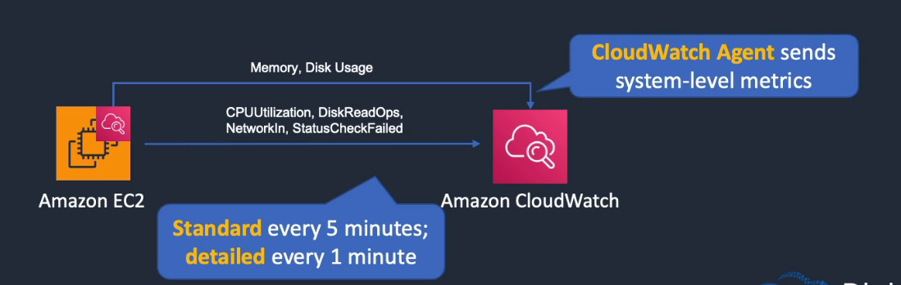
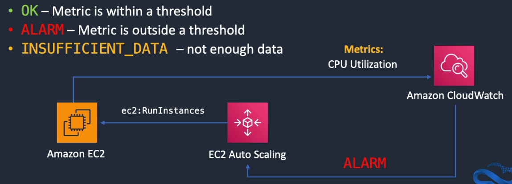
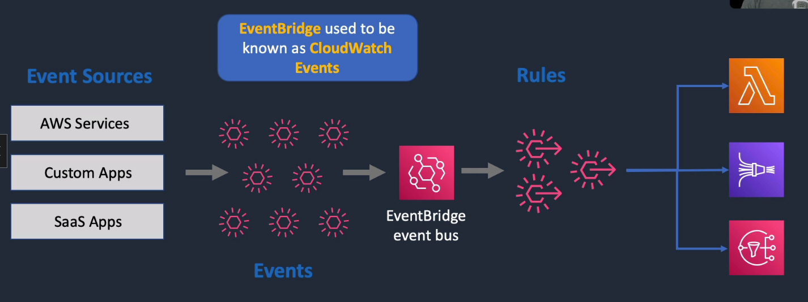
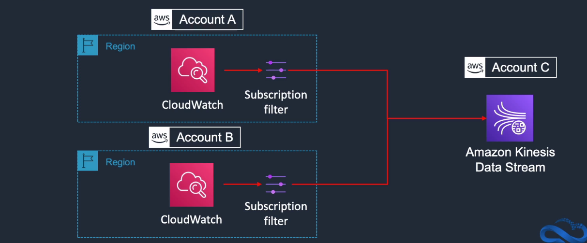

# Amazon CloudWatch

## General Info

Cloudwatch only available in North Virginia (US) -> need to switch region to configure it
Monitoring, metric gathering and graphing service for AWS resources + apps that run on AWS

Can monitor things like:

- Compute: autoscaling groups, elastic load balancers, Route 53 health checks
- Storage & Content Delivery: EBS volumes, Storage Gateways, CloudFront
- Database & Analytics: DynamoDB, Elasticache nodes, RDS instances, Elastic MapReduce job flows, Redshift
- Other: SNS topics, SQS queues, Opsworks, CloudWatch logs, Estimated charges for the AWS billings

CloudWatch can be used on premise and not only on AWS resources -> need to download and install SSM agent and CloudWatch agent

CloudWatch monitors performance while CloudTrail monitors API calls in the AWS platform. CloudTrail is more of an auditing service.

CloudWatch makes it easy to share data with someone else -> copy URL functionality of CloudWatch to share the exact details (Actions -> Share -> Copy URL)

In US East (N. Virginia) but show data for all the regions

CloudWatch can be configured from a CloudFormation template (alarms, log groups, metrics, cloudwatch logs installed on EC2, ...)

We can send CloudTrail events to CloudWatch logs: get notified when certain API calls are made -> CloudTrail -> CloudWatch filters -> SNS like if someone is logged in on the root account instead of a administrator user.

InService instances -> how many instances are on and running in the ASG

HealthyHostCount -> how many instances behind ELB currently reporting healthy, if none app is technically offline. If not enough, tell ASG to increase number

NumberOfMessagesVisible -> how many workers do I need to have online to process the async requests ?

Analyze data to discern utilization patterns. Check the minimum and maximum, not just averages. This shows the extremes and whether they are growing. Amazon EMR can analyze ELB access logs in a batch manner and insert custom aggregate metrics into CW.

Not necessarily for CW but we should ensure that log rotation is enabled where we can. We should also clearly denote application and infrastructure release or updates in the logs for correlation. Log and ship any regular sanity testing performed on the application (can a user log in, is the landing page visible?). Set up a retention configuration for CloudWatch logs.

CloudWatch does not aggregate data across region

high resolution metrics (every second) are available only for 3 hours

Composed of 3 services: main CloudWatch service, CloudWatch Logs and CloudWatch Events.

CloudWatch integrates with IAM for permissions. We can restrict permissions for a specific kind of metrics but we cannot have fine graind permissions for a specific set of instances.
It is either all load balancers or none for instance, not a single Load Balancer.
We can't use IAM roles with CloudWatch CLI.

in CloudWatch logs, we have a functionality called "Insights" where we can run query similar to SQL to get info from a log group. There is a graph function where we can see for example, the number of failed connection attempts for instance.

in order to not lose custom metric data from app during scale down, use the cloudwatch logs agent, create a cloudwatch log group and create custom metrics we need
Stream this info to cloudwatch.

each cloudwatch alarm watches a single metric!

once logs are in CloudWatch, we can send the log data to Lambda for processing, stream the log to ElasticSearch with CloudWatch logs subscriptions or even stream the log data to Kinesis

Cloudwatch agent with batch_count parameter set to 1 will send logs each time there is a record (max 10k)

## Features and use cases
* CloudWatch Metrics: services send time-ordered data points to CloudWatch
  * EC2 metrics are sent every 5 minutes (default, free), detailed is 1 minute (cost)
  * unified CloudWatch Agent sends system-level metrics for EC2 and on-premises servers => need agent for memory and disk usage, not in default metrics
  * can publish custom metrics using CLI or API
    * standard resolution: 1 minute granularity
    * high resolution: 1 second granularity
  * AWS metrics are standard resolution by default



* CloudWatch Alarms: monitor metrics and initiate actions
  * metric alarm: based on a threshold, performs one or more actions based on a single metric
  * composite alarm: use a rule expression and takes into account multiple alarms
  * states:
    * OK: metric is within a threshold
    * ALARM: metric is outside a threshold
    * INSUFFICIENT_DATA: not enough data



* CloudWatch Logs: centralized collection of system and application logs
  * gather application and system logs in CloudWatch
  * can define expiration policies and KMS encryption
  * send to S3 (export), Kinesis Data Streams, Kinesis Data Firehose
    * CloudWatch Logs and S3 bucket must be in the same region, bucket cannot be encrypted with KMS, bucket policy for cloudwatch to write logs there
  * real time processing of logs
    * Amazon Elastic Search service (real time log processing with subscription filters)
    * AWS Lambda
  * we can install the Unified CloudWatch agent on EC2 and on-premises server
  * can send logs from Lambda but not CloudWatch logs permissions
  
* CloudWatch Events: stream of system events describing changes to AWS resources and can trigger actions => old names for Amazon EventBridge
  * scenario: ec2:RunInstances -> cloudwatch events -> rules -> trigger AWS Systems Manager run command to check for updates on the EC2 instances



Cross-Account log data sharing
* share cloudwatch logs across accounts
* Kinesis Data Streams is the only supported destination
* Log data sender: sends log data to the recipient
* Log data recipient: sends data to Kinesis Data Stream
* can be cross account and cross region



## Architecture patterns - monitoring, logging and auditing
* need to stream logs from EC2 instances in an auto-scaling groups: install Unified CloudWatch agent and collect log files in Amazon CloudWatch
* need to collect metrics from EC2 instances with a 1 second granularity: need cloudwatch agent and our custom metric with **high resolution**
* the application logs from on-premises servers must be processed by AWS Lambda in real time: cloudwatch agent on servers, subscription filters that triggers lambda
* cloudwatch logs entries must be transformed with Lambda and then loaded into Amazon S3: configure kinesis firehose destination, transform with Lambda and then load into S3
* cloudwatch logs entries must be analyzed and stored centrally in a security account: cross account sharing and configure Kinesis Data Stream in the security account to collect log files then use Lambda to analyze and store
* access auditing must be enabled and records must be stored for a minimum of 5 years. Any attempts to modify the log files must be identified: cloudtrail with S3 bucket and enable log file integrity validation
* API activity must be captured from multiple accounts and stored in a central security account: cloud trail in each account to record API activity. Use cross account access to a security account to store the log files in a central S3 bucket
* need to trace and debug application with distributed components: use X-ray to trace and debug application

## Concepts and terminology

**Metrics**: 

* time ordered set of datapoints that are published to cloudwatch
* **only exist in the region in which they are created**
* can't be deleted but expire after 14 days if no new data is published to them. If we want to save them -> mon-get-stats and store them in S3/DynamoDB
* services can have multiple different metrics
* each metric has data points organized by time
  * name
  * namespace: used to isolate different application and service metrics. AWS Services have a namespace like that AWS/EC2, AWS/ELB, ... We can create custom namespace for custom metrics.
  * one or more dimensions: represent a name/value pair that uniquely identifies a metric. For example with EC2: InstanceId, InstanceType, ImageId, AutoScalingGroupName. For ELB, AvailabilityZone, LoadBalancerName
  * timestamp
  * unit of measurement
* API actions can be used to publish and retrieve data to and from CloudWatch

**Statistics**:

* **only** 5 statistics in CW: Average, Minimum, Maximum, Sum, SampleCount
* aggregation of metric data over a period of time
* can be computed for any time periods between 60 seconds and 1 day
* for high resolution custom metrics, statistics can be computed for time periods between 1 second and 3 hours

CloudWatch periods: allow us to control what data is aggregated in statistics and can be used for alarms (min 1 second to 30 days)

**Logging** terminology

* Log event: activity being reported (timestamp and raw message in UTF-8 format)
* Log Stream: sequence of log events from the same source such as an application
* Log Group: grouping of log events that have the same properties, policies and access controls
* Metric Filters: allow us to define which metrics to extract and publish to CloudWatch
* Retention Policies: dictate how long the data is kept
* Log Agent: CW agent on EC2 -> auto publish on CW. Config is /opt/aws/amazon-cloudwatch-agent/etc/common-config.toml (no need to configure it if using roles). To configure what we want to send to CloudWatch, we need to create a cfg file and execute 
/opt/aws/amazon-cloudwatch-agent/bin/amazon-cloudwatch-agent-ctl -a fetch-config -m ec2 -c file:cloudwatchconfig.cfg -s

## Metrics

Data points send by AWS resources that are put on a graph as an ordered set of time-series data (=metrics).
Each data point has an associated time stamp and an optional unit of measurement.

Each metric data point must be marked with a timestamp => can be up to two weeks in the past or up to two hours in the future. Timestamp generated auto by CloudWatch if we don't provide it

Host level metrics (hypervisor):

- CPU (CPUCreditBalance, CPUCreditUsage, CPUUtilization)
- Network (NetworkIn, NetworkOut)
- Disk I/O (not the space left) (DiskReadBytes, DiskReadOps, DiskWriteBytes, DiskWriteOps)
- Status check (StatusCheckFailed, StatusCheckFailed_Instance, StatusCheckFailed_System)

Important metrics:

- VolumeQueueLength: should be close to 0 as much as possible
- Read/Write IOPS on EBS
- VolumeThroughputPercentage: percentage I/O delivered of the total IOPS provisioned for an EBS volume

Graphing the same time window look different with 1 minute and 5 minute periods because AWS aggregates the data points for 5 minutes

### Metric granularity

Depends on AWS service, many default are 1 minute but can be 3 or 5 minutes.

Default EC2 monitoring is *5 minutes interval and 1 minute with detailed monitoring* enabled, more expensive. Can be changed while the instance is running.

With detailed monitoring, we have the url: monitoring._region_.amazonaws.com

There is also High-Resolution custom metrics and alarms: down to 1 second resolution. 

- **seconds -> need high resolution metrics (new) - need a plugin for Collectd or we can use put-metric-data manually**, available for 3 hours max. Collectd automatically discovers instance ID and region. In CloudWatch, there is now a **custom namespace "collectd".** It contains
  - cpu.percent.active
  - memory.percent.used
  - df.percent_bytes.used
- 1 minute for detailed monitoring (cost extra): RDS, EC2, Autoscaling, ELB, Route 53, available for 15 days 
- 5 minutes for standard monitoring, available for 63 days
- 1 hour metrics are available for 455 days (15 months)

Very important: if the granularity is 5 minutes and a script pushes info every 1 minute, this info will only be available in CloudWatch every 5 minutes (*5 minutes aggregation*)

We cannot delete metric, we need to let them expire.

### Namespaces

CloudWatch **namespaces**. are containers for metrics. Metrics in different namespaces are **isolated** from each other. All AWS services that provide CloudWatch data use a namespace string starting with "AWS/". Services like CloudTrail do not push data to CloudWatch so **there is no namespace AWS/CloudTrail.**

With **custom** namespace, the user should aggregate the data with statistics like Min, Max, Average, Sum and Sample Data before sending the data to CloudWatch
We can upload a file with data to CloudWatch

CloudWatch receives and aggregates data based on namespace and metric (the region does not matter if the namespace and metrics are the same for custom data)

Need IAM role with PutMetricData permission; request size limit is 8kb GET, 40kb POST (up to 15 minutes delay), the **namespace** must always be part of the request

https://docs.aws.amazon.com/AmazonCloudWatch/latest/monitoring/aws-services-cloudwatch-metrics.html

**Dimension** expands the identity of a metric, they allow us to uniquely identify metrics => alternate ways to look at the metric data. For example, for EC2, we can have AutoScalingGroupName, ImageId, InstanceId, InstanceType. **A dimension requires detailed monitoring to be enabled**. With that, we get a lot more info for our metrics. We can look at the network traffic for the complete autoscaling group if we want with dimension.

Use Auto Scaling CPU metrics to get an average CPU utilization across all instances of a same ASG.
=> we can also have detailed monitoring on Auto Scaling (1 minute info to CloudWatch)

### Storage

Stored 15 months by default (5 minutes), can be changed anytime (for each Log Group)
Data can be retrieved using **GetMetricStatistics API** or using third party tools
*It is possible to retrieve data from any terminated EC2 or ELB instance after its termination*

### Custom metrics

**To be able to push custom metrics from EC2, we need our EC2 to have a role that allows to push data to CloudWatch.**

Can use put-metric-data with statistic-values param with the CLI to upload custom data to CW.
If metric does not exist, CloudWatch creates it.

Custom metrics are anything that is not a host level metrics. For example, memory utilization and disk space left.

Can only have standard resolution (one minute granularity, default) or high resolution (one second).
With high resolution, can be retrieved with a period of 1, 5, 10, 30 or any multiple of 60 seconds.
=> **only custom metrics are available at high resolution, same price than 1 minute custom metrics**

**Minimum granularity is 1 minute for custom metrics. This means that if we send data every second, CloudWatch will aggregate all these data points and average them to have a single data point per minute.**

Our own metric (outside of AWS) can be sent to CloudWatch for graphing using the CLI or the API, available after around 15 minutes (list-metrics), can publish aggregated set of data points called statistic set. When creating a metric, can take up to 2 minutes before we can retrieve the statistics for the new metric (get-metric-statistics).

If we send custom data to CloudWatch and we know that we won't always have data to send, it is best practice to send 0 as data to know that the instance is alive instead of not sending any data.

When we generate a timestamp for CloudWatch, we need to format it this way -> 2019-02-02T22:57:33.572Z

Our custom metrics do not mix with AWS metrics, there is a new metrics group "Custom Metrics" alongside EBS metrics, EC2 metrics, ...

Custom metrics

* provide flexibility to publish custom data to CloudWatch
* beneficial for troubleshooting and create alarms (no need to SSH into instances all the time)
* options to install and configure custom metrics
  * install CloudWatch logs agent on existing instances (OpsWorks, CloudFormation, Beanstalk), user-data, ...
  * use API, CLI, SDKS to install the logs agent or Collectd
* OpsWorks example
  1. install agent
  2. configure agent (specify which logs to monitor and where to send them)
  3. make sure the agent is running
* search and filter metric data with metric filters which have 4 key elements
  * filter pattern
  * metric name
  * metric namespace
  * metric value (1 for each 404 found, ...)

**End-to-end log processing: Install agent with OpsWorks/CF/Beanstalk/... and configure it + send logs to CloudWatch. Once the logs are in cloudwatch, we can retrieve statistics or we could stream the log data into Elastic Search, Kinesis for processing, Elastic Map Reduce, Lambda for custom processing or other systems.**

## Dashboard

We can create multiple dashboards. Dashboard are not linked to a region, they appear in all regions => Dashboard are international. Dashboards are multi region and can display any widget to any region but we need to add the widget from the region it belongs to (need to switch region). Create custom oversight of the AWS environment. **do not forget to save it because not done automatically**

We can only create widget based on the metrics of the current region. It is needed to change the region if we want to create a widget for a particular metric.
We can view metrics from multiple regions on the same page.

Dashboard refreshes automatically when they are open, they are protected by IAM and can be visible to anyone with the correct permissions.

Automatic Dashboards: pre-built with AWS service recommended best practices

Good way to monitor performance globally:

- use dashboard
- use CloudWatch CLI to pull data from regional endpoint, aggregate data offline, store it for graphing in CloudWatch

AWS Console provides options to filter values:

- **relative period**: minutes, days, hours, month -> from one minute to 15 months
- **absolute tab**: specific date and time

Possible to show multiple metrics with different units on the same graph. If graph not plotted correctly because of the different unit, can change Y-axis with "Switch" option

## Alarms

Initiate actions on our behalf based on parameters that we specify against metrics we have in use. 

Actions are sent to SNS for notification or an AutoScaling Group for action.

**All alarms actions must be in the same region as the alarm**: ASG must be in the same region than the alarm.

**AWS resources don't send metric data to CloudWatch under certain conditions**, for example an EBS volume that is not attached to an EC2 instance won't send any disk data to CloudWatch so it may report the INSUFFICIENT_DATA state instead of its usual metric.

We can have up to 5000 alarms per region per AWS account

Can setup alarm action to stop EC2 instances when CPU Utilization is below a threshold limit -> need CloudWatch and EC2 rights to do that (+ ASG ?)
Alarm cannot notify the Auto Scaling launch config to scale up/down, can only notify the ASGroup to scale

For high resolution custom metrics: 10 second or 30 seconds periods

Evaluation period of an alarm is 5 minutes or one hour.

Alarms are continuously evaluated so they may stay in ALARM mode all the time unless the metrics fall below a threshold.

Alarms history is available for 14 days.

### State

**Alarms can't invoke actions because they are in a state, the state must change in order to trigger an alarm! **

Once an alarm is created, we can have 3 states

- OK: alarm has everything needed to work and the metric matches the threshold that we have defined
- INSUFFICIENT_DATA: require some time to get enough info or the metric is not received
- ALARM: alarm triggered based on metrics, the metric is outside of the threshold that we have defined

Alarms can be disabled for a while using DisableAlarmActions API or **disable-alarm-actions** using the CLI

For testing purpose, we can test the notification for a specific alarm with **set-alarm-state** (AWS CLI) instead of trying to make the CPU reach 75% utilization for instance

### Billing

Billing alarms: can create billing alarms to automatically alert us for when we go above a predefined cost that we set, they can be increased/decreased at runtime, no need to create a new one and delete the older one => need to **Enable Receiving Billing Alerts** the first time.

Email alert for the free tier usage are sent to the main account but we can change the email address if we want.

If we start lots of resources at the same time, it is possible that AWS doesn't have time to warn us that we will go over our defined limits (free tier for example).

Create an alarm for the cost ($0.01USD if on the free tier) else another threshold -> send email.

This can also be done through Billing (and not cloudwatch) with a one click.

We can generate a billing reports, we need to provide a S3 bucket name.

### Creation

Create an alarm for whatever metric -> depends on the services used. Possible action is a warning or even delete the whole infrastructure.
Example: EC2 CPU Utilization, ELB latency, ...

We can create or update an alarm with the **put-metric-alarm** command. We can enable and disable alarm using **[enable|disable]-alarm** commands. We can describe alarms using **describe-alarms** command.

**We can create an alarm before we've created the metric** but in order to be valid, we need to specify in the alarm definition:

- all of the dimensions
- metric namespace
- metric names

In the console, go to CloudWatch -> Alarms -> Create an Alarm and select the metric:

* name & description
* the threshold setup based on the metric (logic, number for the threshold and the number of consecutive datapoints of failures needed before triggering the alarm)
* setup the period: from 10 seconds to 1 day
* setup the statistic: average, minimum, maximum, sum, ...
* setup the actions
  * we can add multiple notifications: when this arm has state XXX, send notification to YYY, email list. If it is a new list, we need to confirm the email address (prevent spam).
  * we can also add multiple AutoScaling actions
  * we can add EC2 actions (recover, stop, terminate, reboot)

**When we create an alarm, the alarm period should be equal or greater than the metric frequency**. **Since we now have 1 second high frequency monitoring, period can be set to 10 seconds but for when detailed monitoring is disabled, the period should >= 5 minutes. For detailed monitoring enabled, period must be >= 1 minute.**

### AutoScaling

AutoScaling can be based on metrics like CPU/memory/Network too high = add servers; CPU/memory/network low = remove servers.

We need the role to allow autoscaling (**AmazonEC2FullAccess** policy).

Create a template launch configuration (**create-launch-configuration**) that will be used to configure the autoscaling group (AMI, instance type)

Create an autoscaling group (**create-auto-scaling-group**) based on the launch configuration, specify min size, max size, AZs, ...

Create 2 policies (**put-scaling-policy**) for scaling out (add more instances) and scaling in (remove instances). The **PolicyARN** returned from the command must be saved because they will be used in CloudWatch.

Create 2 alarms (**put-metric-alarm**), one for scaling out, one for scaling in. If we use dimensions, we will base our alarm threshold to the auto scaling group and not a single instance. Note that in the real world, the period should be 2 to 5 minutes in order to not scale out our environment for a spike.

Once it is done, we can check what we created in the AWS console

* EC2
  * Auto scaling -> launch configuration: can **create** another launch config, **create an autoscaling group** from the one launch config we have or **copy to launch template** (Infra as code)
  * Auto scaling -> auto scaling groups: see the asg based on the launch-configuration with min size, max size, AZ, ...
  * Dashboard: we should see at least one instance from the ASG.
* CloudWatch
  * we should see 2 alarms: RemoveCapacity (ALARM) since we don't have enough load, AddCapacity (OK) since our load is not that much

If we want to test the ASG policies and alarms, we can try to put the CPU usage high using an application called **stress**. If we didn't add our SSH keys to the config, we need to copy the launch configuration and add our keys to the copy, enable detailed monitoring.

We then edit our ASG with our new launch config. Now we need to terminate the instance running that doesn't have our SSH key pair associated. The ASG will create a new instance with the new launch configuration with our SSH key.

Once our instance is launched, we can SSH into it and use **stress** application.

After a few minutes, we check CloudWatch and see that the AddCapacity alarm has been triggered (CPUUtilization >= 80 for 2 datapoints within 2 minutes). We can now check the EC2 console and see that new instances are created. After killing stress and waiting a few minutes, the AddCapacity alarm is OK while the RemoveCapacity alarm is ALARM. Now we should only have 1 instances running.

**Clean up**: delete auto scaling group (=> **this terminates all our instances**), launch configuration, **the alarms are automatically removed**.

## Logs

Service to monitor our existing system, application and custom logs in near real time. We can send our existing logs to CloudWatch using the **EC2 CloudWatch logs agent, Logstash, Graylog, Fluentd**. We can create patterns to look for in our logs (need to be in a log group). Very powerful because we can create alarms based on the findings of these patterns. 
Log data can be stored and accessed indefinitely in highly durable, low-cost storage (S3) (=> metrics are not stored indefinitely).

Supports any text based common log data or JSON formatted logs.

**=> Amazon CloudWatch Events produces a stream of events from changes to AWS environments, applies a rules engine, and delivers matching events to specified targets.** 

Three main purposes:

* monitor logs from EC2 instances in real time: track errors, ...
* monitor AWS CloudTrail logged events: can create alarms based on API activity in our account
* archive log data: stored in S3, can rotate logs so they are deleted after some time. By default, logs stored in CW are stored indefinitely.

Terminology:

* **Log Events**: a record sent to CW Logs to be stored, Timestamp and raw event message
* **Log Streams**: sequence of log events that share the same resource (apache access logs, ...). They are automatically deleted after 2 months
* **Log Groups**: groups of log streams that share the same retention, monitoring and access control settings. Each Log Stream has to belong to a Log Group. For example, all the apache access logs of a fleet of EC2 will be in the same group.
* **Metric Filters**: used to define how a service would extract metric observations from events and turn them into data points for a CloudWatch metric (for example, extract all 404 errors and transform that into data points for CW). They are assigned to Log Groups and their Log Streams.
* **Retention settings**: how long log events are kept in CloudWatch logs, expired logs are deleted automatically. These are applied to logs groups which transfer that settings to log streams. **Can select never expire or from 1 day to 10 years.**

Terminated instances: can retrieve metrics from any terminated EC2 or ELB after its termination (for 15 months). CloudWatch logs by default are stored indefinitely.

We can set a threshold for errors in the logs with CloudWatch Logs group and create an alarm on that threshold

### Logs Insights
interactive, pay-as-you-go and integrated log analytics capabilities for CloudWatch logs.
Great to understand our application to make improvements and find and fix problems quickly.
Automatically discovers logs fields from logs from AWS services such as Lambda, CloudTrail, Route 53 or VPC Flow logs and any app log in JSON format.

=> run queries on all our logs being sent to CloudWatch logs, no setup required, no infra to manage.

We can write queries containing aggregations, filters, regex and text searches. Can create ephemeral fields used later by the query language.
Can use concat, strlen, trim, log, sqrt among others. Can also use boolean and logical expressions, min, max, sum, average, percentile, ...

Support visualization (line/stacked area charts), only support a single log group per query.

Fields generated by Logs Insights: @message, @logStream, @timestamp

### Vended Logs
logs natively published by AWS services like VPC Flow logs.

### Agent

CloudWatch logs require an agent to be running on the EC2 (service awslogs status), by default it is available for Ubuntu, CentOS, RHEL, Amazon Linux, Windows. Can be dl from AWS S3. 

Agent send log data every 5 seconds by default (configurable), only text based (or error: /var/log/awslogs.log)

The agent is integrated with IAM and include suppport for both access keys and IAM roles.

We executing the agent, "python awslogs-agent-setup.py --region us-west-2", we need to provide the following:

* access keys (access key and secret access key) if we don't have a role
* the log path we want to send to CW
* the log group name.
* log stream name (we can use EC2 instance ID, hostname, custom)
* the timestamp format of the Log Event (from list or custom)
* initial position of the upload: from start or end of file

Once the main log is setup, we can create other logs configuration.

**CloudWatchFullAccess** policy has the statement that allows actions: autoscaling:Describe\*, cloudwatch:\*, logs:\*, sns:\* => for custom policy, we need the logs:\* to be able to use these in CW.

### Log filters / Metrics filters

define search patterns to look for in the logs and create metrics from logs info.

Filters will **NOT** work on existing log data, it will only work on data pushed to CloudWatch **AFTER** the filter was created. It will only return the **first 50** results

Metrics contain

* filter pattern: simple pattern to look for
* metric name: the name of the cloud watch metric to publish to
* metric namespace: destination namespace in CloudWatch metrics
* metric value: what we publish to the metric

Metrics filters are created from a log group. We can test pattern on a few Log Events.

To create the metric, we can put metric value to 1 => value published to the metric name when a Filter Pattern match occurs. For example, when we have a pattern that looks for "invalid user", we will send 1 to the metric each time we encounter that. We can then use statistics like sum or average.

We can now create an alarm from this metric.

=> Metric filters does **NOT** support regular expressions. We need to use Kinesis for regular expressions.

## Real Time Log processing

https://docs.aws.amazon.com/AmazonCloudWatch/latest/logs/Subscriptions.html

CloudWatch supports real time feed for log events by using subscriptions. The subscriptions feed our logs into different AWS services that allows us to capture, process and analyze logs in real time.

3 main services that we can use a subscription filters:

* Amazon Kinesis Streams: build custom app that process/analyze log streams
* AWS Lambda: process log streams in any way we like
* Amazon Kinesis Firehose: easiest way to load streaming data into AWS data stores and analytics tools

For kinesis role, we need a TrustPolicy like that

``` json
{
    "Statement": {
        "Effect": "Allow",
        "Principal": { "Service": "logs.us-west-2.amazonaws.com"},
        "Action"; "sts:AssumeRole"
    }
}
```

Once the role is created (**aws iam create-role**) with this trust policy and we have our ARN (one from create role, one from the Kinesis Stream), we can use them in our JSON permission file

``` json
{
    "Statement": [
        {
            "Effect": "Allow",
            "Action": "kinesis:PutRecord",
            "Resource": "<stream ARN>"
        },
        {
            "Effect": "Allow",
            "Action": "iam:PassRole",
            "Resource": "<role ARN>"
        }
    ]
}
```

We can now associate this policy with the role (**aws iam put-role-policy**). Once this is setup, we can create a subscription log filters using **aws logs put-subscription-filter**.

**We can only have one subscription filter per log group**.

With **get-records** CLI, we have an output "Data" which is base64 encoded.

This describes the following scenario:

1. logs in syslog
2. logs to cloudwatch
3. streamed from CW to Kinesis Streams
4. create custom application using a shard iterator and get-records API to process the stream

One button deployment for CloudWatch logs Subscription Consumer: https://github.com/amazon-archives/cloudwatch-logs-subscription-consumer

### Shard iterator

The position in the stream from which the consumer will read from. When they start reading from a stream,  consumer get a shard iterator.

When there is a read from a consumer, they use the shard iterator to receive a group of records. The shard iterator moves at the index after the last record that was sent.

The shard iterator supports several behavior:

* at the sequence number
* after the sequence number
* at a timestamp
* the oldest record
* after the latest record

We need the shard iterator to use **get-records** Kinesis CLI.

## CloudWatch Events

Similar to CloudTrail but faster => this is the **Central nervous system of AWS** which becomes aware of changes when they happen (near real time stream of events). We can then send notification or trigger function based on what's happening.
**Use events for near real time action based on changes to AWS resources. Use CloudTrail (logs to S3 and CW Logs) for audit of API activity history.**
**Config provides resource inventory, configuration history and config change notifications (security and governance). Events is for reacting in near real time to config changes without compliance in mind as it is a general purpose event stream.**

Currently, EC2, Auto Scaling and CloudTrail (only mutating API calls, not the read) are supported

Events can be routed to Lambda, Kinesis, SNS streams and other built-in targets.

Can generate custom events with PutEvents API, can generate events on a schedule (UNIX cron syntax).
=> by monitoring for these events, we can implement a scheduled application

event source of an event can be an event pattern from a service name and an event type but also something scheduled

Contain three main components:

* events themselves which are all small pieces of JSON, triggered from
  * state change: when an AWS resource changes state, such as an EC2 instance changing from pending to running or when autoscaling creates or shuts down an instance
  * API call: when an API call is made that is delivered to CloudWatch events via CloudTrail
  * our own code: when our own code generates an application level event which we publish for processing
* rules
  * match the incoming events and route them to one or more targets for processing
  * not ordered
  * all rules that match an event will be processed
  * can customize the JSON that flows to the target and elect to pass only certain keys and values or to pass a literal string
  * a rule can specify **multiple** targets
* targets (where the events are processed)
  * lambda functions
  * Kinesis streams
  * SNS topics
  * built-in targets

In CloudWatch, we can go to **Events** -> **Rules** and create a rule. We then select an **event pattern** or **schedule**. There is a long list of service name for the event pattern. We can then select the **event type**. We add **targets** like a Lambda function to be executed. We then add a rule name, a description, a state (boolean flag enabled or not) and we create the rule.

If our target was a Lambda, we will have a log in CloudWatch with the log group "**/aws/lambda/lambda_name**".

**The difference with CloudTrail is that CloudTrail logs the API calls while CloudWatch events allow us to react in near real time to event happening in our environment.**

## SNS notifications

Using CloudWatch logs agent with SNS notification for a specific event like ASG scaling kicks in

We can use CloudWatch alarm (on metric) or CloudWatch event (new instance start/instance terminated). For the event, we need to specify the SNS topic to which the support is subscribed to.

1. SSH into provided instance (CW logs agent already installed)
2. Start nginx (sudo service nginx start)
3. **go to /etc/awslogs and modify awslogs.conf (timestamp format, log stream name, which logs...) and awscli.conf (plugins, region, credentials info)**
4. restart nginx (sudo service awslogsd restart)
5. create SNS topic and subscription
6. Subscribe to the topic (email address)
7. Create a CloudWatch metric filter
8. Create a CloudWatch alarm
9. verify the CloudWatch alarm

Protocol of SNS can be 

* HTTP/HTTPS
* Email/EmailJSON -> need to confirm with email beforehand (pending -> confirmed)
* SQS
* Application
* Lambda
* SMS

For events, we need to create a **rule** in CloudWatch

Setup event source

* event pattern or schedule (cron -> lambda for instance)
* service name
* event type
  * any state or specific states
  * any instance or specific Ids

Setup targets

* **lambda function, SNS, Kinesis Stream, SQS, SSM automation, SSM run command, Step functions state machine**
* we can have multiple targets

**=> CloudWatch events need permission to send events to Kinesis -> either create a new role automatically or use an existing role**

=> once the SNS topic is created (not done by default), we can set this up from CloudWatch or from the ASG directly in **Notifications** tab. **If we set the notifications in CloudWatch and in the ASG tab, we will receive multiple notifications!**

**=> if we need to do analysis on events, we need to have a end-to-end setup: instances -> CloudWatch events -> Kinesis stream -> Kinesis Analytics || Redshift || ElasticSearch** 

## Resources

Doc: https://docs.aws.amazon.com/AmazonCloudWatch/latest/monitoring/WhatIsCloudWatch.html

API: https://docs.aws.amazon.com/AmazonCloudWatch/latest/APIReference/Welcome.html
