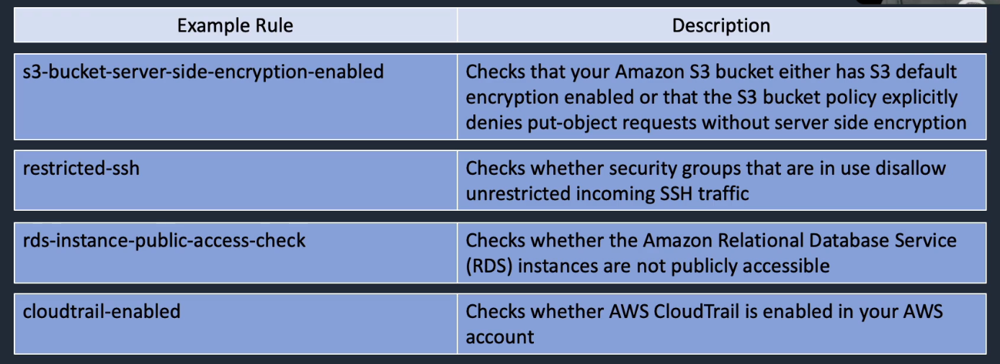

# AWS Config

## General Info

Fully managed service containing AWS resource inventory, configuration history, configuration change notifications to enable security and governance. If we want to know any config change on a resource in the past, it is the best service to use.

**records everything that's happening in our environment all the time and notify on changes. It can record all resources supported in the region but also global resources (IAM resources, ...)**

Config is not as slick as CloudTrail, we cannot turn it on for everything easily like CloudTrail

AWS config stores everything in the AWS Config S3 bucket. Each time something changes, there is an event sent to AWS config.

Config works hand in hand with lambda (lamdba can either be triggered to go through the config event logs or a lambda can be configured to be fired up for a specific event) -> standard or custom rules

Lambda will say if a rule is being broken (use SNS to send a warning to an operator) or not.

We can stream any configuration changes and notifications to an SNS topic.

**AWS Config is regional -> needs to be turned on a per region basis**

=> AWS Config enables us to assess, audit and evaluate the configurations of our AWS resources.

=> continuous monitoring, continuous assessment, troubleshooting, integrate with CloudTrail, assist with change management

Enables:

- compliance auditing: when rules are set and changed
- security analysis: figure out who changed what
- resource tracking

Provides:

- config snapshots and logs config changes of AWS resources
- automated compliance checking: for example, restricted SSH will tell us if SSH is open to the world

Key components

- config dashboard: contains all our resources of a particular region and if they are compliant or not with the rules
- config rules (managed or custom)
- resources
- settings

What we can see:

- resource type
- resource ID
- compliance
- timeline (config details, relationships, changes, CloudTrail events)

Compliance checks:

- trigger (periodic or configuration snapshot delivery (filterable))
- managed rules (currently around 50) which are basic but fundamental like no SSH open to the world

**Permissions needed for Config**

- IAM role with read only permissions to the recorded resource, write access to S3 logging bucket, publish access to SNS
- Restrict access: users need to be authenticated with AWS and have the appropriate permissions set via IAM policies to gain access, only admins needing to set up and manage config require full access, provide read only permissions for config day to day use

Monitoring config

- use CloudTrail with Config to provide deeper insight into resources
- use CloudTrail to monitor access to Config such as someone stopping the Config recorder

Compliance checks

- trigger: periodic or on configuration changes
- managed rules: about 40 basic but fundamental rules (SSH, ...), S3 write access to public and so on

**With AWS Config, we can:**

* **evaluate resource configurations for desired settings**
* **get a snapshot of the current configurations associated with our account**
* **retrieve configurations of resources in our account**
* **retrieve historical configurations**
* **receive a notification for creations, deletions and modifications**
* **vie relationships between resources (members of a security group for example)**

**=> AWS Config looks at everything from a product perspective**

Config needs the role with correct permissions to do its work. It can be created when setting up config or a role can be chosen from our account

Config can be turned off but we need the CLI to delete the rules and so on (**aws configservice delete-configuration-recorder**).

Integrations:
* EC2
* ELB
* RDS
* S3
* many more services

Any configuration change is sent to AWS Config which checks rules and copy to S3 or send to SNS. AWS Config can sometimes fix the issue itself.

## Terminology

**Configuration item** = point-in-time attributes of resource (eg. WebDMZ has port 22, 80, 443 open to the world)

**Configuration snapshots** = collection of config items

**Configuration stream** = stream of changed config items to SNS topic

**Configuration history** = collection of config items for a resource over time

**Configuration recorder** = configuration of config that records and stores config items
recoder setup:

- logs config for account in region
- stores in S3
- notifies SNS

## Use case

**administering resources**: notification when a resource violates configuration rules

**auditing and compliance**: historical records of configurations are sometimes needed in auditing

**configuration management and troubleshooting**: configuration changes on one resource might affect others, can help find these issues quickly and can restore last known good configurations

**security analysis**: allows for historical records of IAM policies (what permissions a user had at the time of an issue), allows for historical records of security group configurations

## Config rules

Rules represent desired configuration settings. AWS Config evaluates whether the resource configurations comply with relevant rules.

If the config matches the rule -> compliant status, if not non-compliant. Actions can be created based on this result (CloudWatch event rule for instance) to automatically remediate to the problem in case of non compliant result.

We can select rules from predefined rules (around 50) but we can also create our own rule (backed by Lambda).

Config rules can be set up to run periodically (age of access keys, ...) or triggered based on changes of the infrastructure (security group changes, cloud trail disabled, ...)

The check is not instant, it can be almost real time but can also takes 5-10 minutes, it depends on the check to make. If we want a direct result, we can force a reevaluation from the console of the rule.

When a config rule is triggered, we can see a timeline of the change with a timestamp to know when the rule was violated. We have other info such as what was changed exactly, what are the relationships of what is tracked with other resources (security groups, ...) -> easier to act on problematic resources. Since we have the history, we can go back in time to see all the config related to the particular resource.

## Aggregated view for multi region/account

Config is regional but we have an aggregated view in the console to aggregate multiple regions but also multiple account.

The view provides the total resource count of AWS resources, a count of compliant and non compliant rules.

All regions and all accounts are selected by default when creating an aggregator.
