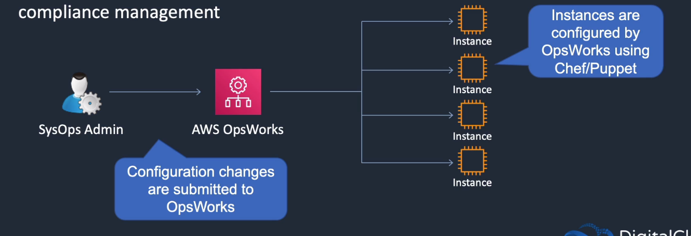

# AWS OpsWorks

## General Info

Tree offerings: OpsWorks for Chef Automate, OpsWorks for Puppet Entreprise and OpsWorks Stacks

managed Puppet & Chef instances (we don't need to configure puppet and chef environment): service that allows us to automate server config for our OS and applications using Puppet or Chef. It works with existing Chef and Puppet code

OpsWorks allows us to provision infrastructure (and manage state and lifecycle) but abstracts some of the detail (like per machine requirement) => abstraction of underlying infra while still giving plenty of control.

=> good to create user account and stuff like that in our resources, automate scheduled tasks, ntp config, ...
=> should be used when we have a requirement to manage EC2 and on-premises Linux systems using Puppet or Chef, OpsWorks is the tool to use. Also automate/monitor/maintain deployments.

As network requirements, the servers must be able to connect to AWS public endpoints.

Even if we have access to the underlying resources created by OpsWorks, we shouldn't modify them directly, we should use OpsWorks to change them.
We can still customize security groups, snapshot of EBS, manage EC2 key pairs ourselves, customize IAM policy, ...

Stacks supports ELB, HAProxy (chef recipe) or any other load balancer.

OpsWorks stacks support any database (RDS, MySQL, Cassandra, ...) -> if there is a chef recipe, it can be installed

OpsWorks is integrated with VPC, IAM, ...

OpsWorks automatically tags all resources with the name of the stack and layer that they are associated with.

Can use our own Linux AMIs, not windows.

It is not possible to configure EC2 instances using User Data, this must be done with Chef recipes.

Convenience (higher level services):

* AWS Elastic Beanstalk (web apps made easy) -> developers oriented, good for short app lifecycle, good for devs who don't care about the underlying infrastructure, app management platform
* AWS OpsWorks (devops automation) -> devops oriented, more customization than beanstalk, good for longer app lifecycle. Focus on productivity and reliability for the DevOps engineer. Config management platform. OpsWorks supports a more narrow range of AWS resources as it focus more on the main services like EC2, RDS, EBS, CloudWatch.

Do it yourself (more control):

* AWS CloudFormation (template driven provisioning)
* Amazon EC2, CloudWatch, Autoscaling, Custom AMIs, ...

When we reach a high number of machines, CloudFormation shows some weaknesses that we can overcome with OpsWorks.

Usual metrics are sent to CloudWatch + custom metrics of OpsWorks (1 minute metric) in the OpsWorks stacks monitoring view

OpsWorks can be seen as a Platform as a Service even if we have full control over the OS, instance count and can make changes directly to the deployment mechanisms.

OpsWorks supports any application, Configuration as code, automation to run at scale (auto scaling, self healing), resource organization. Supports Linux and Windows.

**We have the possibility to completely clone a stack with OpsWorks => easy to setup a blue/green environment.**

Flexibility to change configuration of the environment over time using recipes.

To remove un app -> use undeploy (to remove the files and then install a new version). Shutdown will stop an instance.

OpsWorks lets us use limited resources strategically. We can deploy and create multiple environments to test different features without creating a new stack for each feature.

OpsWorks stacks give us control (can configure anything, recipes, IaC, ...) and easy automation (we define how to scale, maintain and deploy and stack does the rest).
Supports a wide variety of application architectures (simple web app to highly complex applications)

Chef Automate gives us a full-stack CD pipeline, automated testing for compliance and security, and visibility into everything that's happening along the way.
It builds on Chef for infra automation, InSpec for compliance automation, Habitat for app automation.
Chef Automate has a different console accessible through OpsWorks. Supports native Chef tools such as TestKitchen and Knife.
Chef Automate does more than normal Chef for OpsWorks.

jTo make sure that we are deploying consistent version of an application using OpsWorks, use a pipeline to push an archive to the source repo for apps and cookbooks. All app deployments or cookbook updates will install the code from that archive file and every instance will have the same code.

Use tag instead of master for deployment. This way we know that what will be deployed will come from a validated version and not an unwanted commit.

monitoring OpsWorks stacks -> CloudTrail and CloudWatch logs

* AWS OpsWorks is a configuration management service that provides managed instances of Chef and Puppet
* Updates include patching, updating, backup, configuration and compliance management
* opsworks is useful for companies which already use Chef or Puppet on premises and want to migrate (comparison with Systems Manager or not => they do the same things)



Canary deployment is not supported by OpsWorks

## Structure

* **OpsWorks stack** (collection of resources) -> can be the whole application or a subset, can be an environment (dev, test, prod). Helps model, provision and manage the app on AWS using the embedded Chef solo client that is installed on EC2.
* **OpsWorks layer** -> blueprint on how to setup and configure an instance and related resources (volumes, EIP, ...), set of shared functionality or architecture which is applied to a group of components. For example, a node application layer, caching layer, load balancing layer, a database layer, ... => tiers/roles within modern application architecture that can be managed separately. Layers can have built-in or custom Chef recipes. We can customize our layer how we want per environment (for example, we need less instances in dev/test than prod, this can be customized here).
* **OpsWorks instances** -> unit of compute within the platform. They inherit config from stack and layer. Config is fully automatic and performed by Chef. **Note that Chef and OpsWorks are related but not the same thing.** Instance must be associated with at least one layer (can be associated with more layers, for example we could have a php layer and nginx layer but they could both be on the same instance. They will just be managed separately with the layer). We can run instances as 24/7, load-based or time based
* **OpsWorks application** -> applications deployed onto one or more instances through a source code repository like git, svn or S3. We can deploy an app to a layer and have OpsWorks execute recipes to prepare instances for the application. An app is the definition of the application, upload new binaries with the same name and redo the deploy lifecycle event for update
* **OpsWorks recipes** -> created using Ruby language and based of the Chef deployment software
  * custom recipes can customize different layers in an application
  * recipes are run at certain pre-defined lifecycle events within a stack: setup (just after the first boot), configure (on all stack instances when they enter or live the online state), deploy, undeploy, shutdown => to run a specific set of Chef recipes
  * a group of chef recipes is a cookbook  

OpsWorks stacks support the ability to deploy multiple apps per stack and per layer

Under the hood, OpsWorks is composed of two separate technologies: 

* OpsWorks Agent - CHEF
  * (re)configuration of machines
  * unprivileged user
  * provide heartbeat
* OpsWorks Automation Engine
  * Creating, updating, deleting various AWS infrastructure components
  * handling of load balancing
  * auto scaling
  * self healing

=> **OpsWorks is the union of Chef and AWS backend services (automation engine).**

OpsWorks also supports lifecycle events

With Chef Automate, there is a maintenance window (automatic security updates, OS updates, ...) for backward compatible changes. Major upgrades need to be done manually.
Chef server not available during maintenance, connected nodes are pending-server state until maintenance is complete but still operate normally.

### Recipes and Cookbooks

OpsWorks and CHEF are declarative desired state engines => **we define the state we want to happen and leave chef/opsworks to handle the how** (chef uses provider to know how to do that). Within CHEF/OpsWorks, we have resources. Examples include packages to install, services to control (start/stop), config files to update etc. Many resources may be contained in one recipe.

``` ruby
package "httpd" do
    action:install
end

service "httpd" do
    action [:enable,:start]
    supports:restart =>:true
end

template "/var/www/html/index.html" do
    source "index.html.erb"
    owner "apache"
    group "apache"
    mode "0644"
    notifies:restart, "service[httpd]"
end
```

**Cookbooks contain recipes and all associated data to support them.**

### Stacks and layers

**It is important to understand the difference between the configuration at the stack level and in the layer level.**

### Stack

When creating a stack, the following information is required:

* stack name
* region -> **cannot be changed afterwards**, only the regions supporting OpsWorks are available
* VPC -> VPC must be created beforehand (**and cannot be changed afterwards**) if we want to use a custom one, else default is used. **Instances need to have internet access** so we either need public subnets, private subnets with NAT.
* default subnet -> based on VPC selected, **can be changed afterwards**, this is only the default, we can add instances in other subnet afterwards
* default operating system (Linux or windows) like Amazon Linux 2015.09 (comes from a list). **We cannot mix Linux and Windows in OpsWorks**. **Changing it doesn't update the instances, it just applies to new version**.
* default SSH key -> we don't have to provide one, it depends if we need access or not
* Chef version -> 12 supports Windows or Linux
* Use custom chef Cookbooks -> yes/no, these cookbooks need to be retrieved from a repository like git, S3 or HTTP archives
* Stack color -> can choose color in a list

The advanced section of the creation stack tool (won't be changed most likely):

* default root device type: EBS or instance store
* IAM role: aws-opsworks-service-role
* default IAM instance profile: aws-opsworks-ec2-role
* Hostname theme: stack or layer specific
* OpsWorks agent version: specific version or latest version
* Custom JSON: passed to Chef recipes for all instances in our stack. Can use this to override and customize built-in recipes or pass variables to own recipes.
* Security (opsworks security groups): yes/no

### Layers

Layers are logical groupings of instances, in OpsWorks, they share common configuration elements:

- general settings: name, short name, instance shutdown timeout, **auto healing enabled (yes/no) => options from the layer, not the stack**, custom JSON
- recipes: repo URL, setup, configure, deploy, undeploy, shutdown. For each steps, we can define 0 or more recipes.
- networking: elastic load balancing (must be created before hand), auto assign public ip addresses (yes/no), elastic ip addresses (yes/no)
- EBS volumes: EBS optimized instances (yes/no), mount points
- security: security groups, EC2 instance profile (access the instance without using access key)

**=> we have to think that it is for shared instances of this layer and not specific instances**

There are other layer types:

* OpsWorks layer: traditional layer allowing rich feature sets via recipes
* ECS: layer which allows integration of an ECS (docker) cluster with OpsWorks
* RDS: integration between OpsWorks and an existing RDS single instance or HA pair

**An RDS instance can only be associated with one OpsWorks stack**

**A stack clone operation doesn't copy an existing RDS instance**

### Stack options - resources

The "Resources" tab on the stack page allows the registration of **existing** resources with the stack.

They can be **Elastic IP's**, **volumes** (a specific volume or many existing volumes), **RDS** which is functionally identical to adding a RDS layer 

## LifeCycle events

5 events which occur during the lifetime of an instance (setup, configure, deploy, undeploy, shutdown), **some occur one and some occur multiple time**, **events can be manually executed by the stack run command functionality**. When an event occurs, it runs the sets of Chef's recipes assigned to that event (customizable).

**Each layer has its own recipes for each event (a HAProxy layer will run different recipes in response to events than a application server layer).**

**Setup**: event occurs when an instance has finished booting, initialize basic instance setup (install php, apache, ...)

**Configure**: **runs on all instances** when instance enters or leaves the online state, associate or disassociate EIP, attach or detach a load balancer to a layer. This is an ideal point to run configuration update commands

**Deploy**: occurs when we run the deploy command on an instance. The instances run recipes that deploy applications and any related files to the layer instances.

**Undeploy**: delete an application or run an Undeploy, remove app and clean up recipes

**Shutdown**: sent to an instance 45 secondes before actually stopping the instance, runs when an instance is shutdown but before the instance is terminated, allows cleanup like shutting down services.

### Example

HAProxy layer (one instance) and App Server Layer (one instance). Not HA, not load balanced but we want to add this.

When a new app instance is started, any HAProxy instance will need to have its configuration updated to reflect the new entries. Additionally, when a new HAProxy instance is created, it will need to be updated with all the instances available.

In this scenario, starts app2.

Setup: executed when app2 has finished booting, install php, ...

Configure: when app2 has reached the online state, the configure event is triggered on all instances (HA1, App1, App2). => service discovery logic. This is the same if we added HAProxy2, setup then when online, configure executed on all instances (HAProxy1, HAProxy2, App1). An element of the configure event on the HAProxy could be the handle DNS ensuring DNS is aligned with the application topology.

## Instances

Instances can be added in two locations: the layer or the stack instances menu.

When instances are created, we can choose one of **3 scaling types**:

* **24/7 instances**: provisioned manually, and manually started or stopped by an administrator (can be controlled via the command line/API's)
  * hostname
  * size
  * subnet: **overrides the settings from the stack default**
  * SSH key: optional, **overrides the settings at the stack level**, this must be in line with the security settings, for example if we cannot access it due to security groups, the SSH key will not help.
  * operating system: overrides specified at the stack level -> must be the same type (Linux/Windows), we can just overrides the version. **We can "update" an instance by changing this value, destroying it and creating a new one, the instance OS will be picked up and not the stack level.**
  * root device: EBS backed or instance store (not available for instances that do not support instance store volume)
  * Volume type: General purpose, magnetic
* **Time-based instances:** initially provisioned and configured to power-on and off at certain times during the day => for expected load increase/decrease during certain timeframe
  * can specify the same config than 24/7
  * have access to temporal view: green box when started, grey box when not started. **all the times are in UTC**
  * can specify time for every day or for specific days
  * green colors = **times set for instance-on**, light green colors = **power-on for specific time on a specific day**
* **Load-based instances**: initially manually provisioned and configured to automatically power on/off based on configurable load criteria, more restrictive than EC2 AutoScaling groups, we can define a semi rich reaction matrix for growth and reduction 
  * first thing to do is to enable the **scaling configuration** => **per layer scaling configuration**
  * these settings are per layer
  * based on layer averages
    * average CPU: up and down percentage
    * average memory: up and down percentage
    * average load
    *  CloudWatch alarms
  * scaling parameters (=> per layer)
    * start/stop servers in batches of: number (1, 5, ...)
    * if thresholds are exceeded/undershot: 5, 10 minutes, ...
    * after scaling, ignore metrics (up and down): 5, 10 minutes, ... => when a scaling event is done, wait X minutes before doing any other scaling

## Applications

Object which represents the application and the associated metadata.

In the application object:

* application name
* document root
* data source (RDS/none)
* application source: git (can specify a branch in the repo), http, s3
* environment variables
* domain names
* SSL enabled & settings: certificate, keys, ...

Deploying an application:

* executes the deploy recipes on the instances targeted by the command => must have access to the source and so on from the metadata
* an **application-id** is passed to the command -> key element used to construct the data block for the deploy recipe
* application parameters are passed into the chef environment withing **Databags** (JSON object contained in Data)
* deploy recipe accesses the application source information and pulls the application payload on the instance. Method of the pulls depend on the type (git, s3, http)
* **each time an application is deployed, we have 5 versions of the apps that are maintained: the current one and 4 historic**. History can be used for rollbacks

## Create Deployment Command

Two main functions:

* create app deployment and allows manipulation of deployment options
* allows stack level commands to be executed against the stack

**The usage of the command offers functionality outside the scope of its 'name', it is not limited to deployments.**

Syntax:

* aws opsworks --region us-east-1 create-deployment 
  * --stack-id
  * --app-id: command dependent
  * --instance-ids: command dependent
  * --comment: user defined comment string
  * --custom-json: json that can be referenced by recipes
  * --generate-cli-skeleton: output a JSON that can be changed by the operator and given to the --cli-input-json
  * --cli-input-json: accepts a skeleton (scripted use of the create-deployment command)
  * --command: the command to execute. This can be **install_dependencies, update_dependencies, update_custom_cookbooks, execute_recipes, configure, setup, deploy, rollback, start, stop, restart, undeploy**

If we have a running application and we want to deploy/undeploy/rollback ->

* aws opsworks --region us-east-1 create-deployment --stack-id xxx --app-id yyy --command "{\"Name\": \"deploy\"}" => create a new version and keep 4 other old version

* aws opsworks --region us-east-1 create-deployment --stack-id xxx --app-id yyy --command "{\"Name\": \"undeploy\"}" => undeploy and cleanup tasks (if defined in undeploy recipes)

* aws opsworks --region us-east-1 create-deployment --stack-id xxx --app-id yyy --command "{\"Name\": \"rollback\"}" => replace current version with an older version. **We can execute rollback several times but when there is no other version left in the history, it will leave the current version as-is.**

Stack commands:

* **update_custom_cookbooks**: full re-download of any custom cookbooks provided within their repository => doesn't execute the recipes, just download them
* **execute_recipes**: allows the manual spawns of an individual recipe (check valid recipe)
* **setup**
* **configure**: manually force service discovery (useful)
* **update_dependencies**: linux only, not available anymore in Chef 12 => install minor updates and security updates
* **upgrade_operating_system**: linux only, full upgrade of RedHat entreprise or Amazon Linux. Useful for switching between AMI version

https://docs.aws.amazon.com/opsworks/latest/APIReference/API_CreateDeployment.html

https://docs.aws.amazon.com/opsworks/latest/userguide/cli-examples-create-deployment.html

and the doc for all the commands above.

## Databags and BerkShelf

**For any OpsWorks stacks which operate on older versions (less than 11.10), we could only specify one custom cookbook repository. This limited the re-use of community recipes, we had to either combine them into our own repo or limit ourselves to smaller sets of recipes.**

**Chef 11.10 added BerkShelf** allowing us to install cookbooks from multiple repositories without having to copy them into our own repo first.

To have access to BerkShelf:

1. enable custom Chef cookbooks at the stack level (stack settings area within opsworks)

2. create a Berksfile in the root directory of the repository with two main sections

   1. default source: for example https://supermarket.chef.io

   2. cookbook definition: pull from default source or specify an alternate repository

      cookbook 'apt'

      cookbook 'bleh', git: 'git://somewhere/bleh.git'

      **cookbook 'cookbook_name', ['>= cookbook_version'], [cookbook_options]**

**Databags** are key Chef and OpsWorks constructs. It is a global variable available within a Chef-OpsWorks infrastructure. They are global JSON objects accessible from within the Chef framework. Basically, they allow access to contextual information within recipes.

**Databags exist at the Stack, Layer, Instance and Application level**

Data is accessed via the Chef **data_bag_item** & **search** methods within compute assets.

Databags are constructed wit the **custom_json** field for the above OpsWorks components -> populated as parts of stack, layers, applications and instances. They can contain any supported JSON datatypes like Strings, booleans, Number, Lists and JSON objects.

Databags can be searched via the **search method which allows access via a search index, OpsWorks offers a range**, including the following:

* aws_opsworks_app: App databag
* aws_opsworks_layer: layer database
* aws_opsworks_instance: instance databag
* aws_opsworks_user: users databag, a set of users for a stack

### Example

``` ruby
app = search(:aws_opsworks_app).first
app_path = "/srv/#{app['shortname']}"

package "git" do
    node["platform_version"] == "18.04"
end

application app_path do
    javascript "4"
    environment.update("PORT" => "80")
    environment.update(app["environment"])
    
    git app_path do
        repository app["app_source"]["url"]
        revision app["app_source"]["revision"]
    end
    
    link "#{app_path}/server.js" do
        to "#{app_path}/index.js"
    end
    
    npm_install
    npm_start do
        action [:stop,:enable,:start]
    end
end
```

The top line search the app databag, the git app_path block provides the repo where the app is stored.

## Instance Auto-healing

Each OpsWork instance has an agent installed by the orchestration agent. The instance perform ongoing heartbeat style health checks with the OpsWorks orchestration engine. If the heartbeat fails, OpsWorks treats the instance as unhealthy and will perform an auto-heal.

The actions involved in the auto-heal process will depend on the circumstance under which it is initiated.

### Auto-healing workflow

Unhealthy instance is marked after 5 minutes of no response.

**If an instance is terminated outside of OpsWorks, it is recreated using the OS image it was using at the time of termination (=> no the OS image within the stack configuration).**

**EBS backed**

If an EBS backed instance fails a status check, it is stopped and then started.

1. stop
   1. online
   2. stopping
   3. stopped
2. start
   1. requested
   2. pending
   3. booting
   4. online

**The process can fail to start. In that case, it needs manual actions.**

**When online, OpsWorks triggers a configure event on all instances.**

**Instance store**

1. terminate
   1. online
   2. shutting_down
2. launch
   1. requested
   2. pending
   3. booting
   4. online

For the terminate phase, we have the following actions happening

* instance terminates
* root volume deleted
* launches new instances: same hostname, config, layer membership
* reattaches any EBS volumes that were attached when the instance was terminated
* assigns a new public and private IP
* if applicable, reassociates any Elastic IP addresses

**When online, OpsWorks triggers a configure event on all instances.**

### What auto-healing does not do

* AH will not upgrade the OS of instances, even if the default OS is changed at the stack level,** an auto-healed instance will return with the same OS as before the  heal.
* AH will not recover from serious instance corruption. If the communication with the agent is broken, the orchestration engine will attempt remediation. If the instance fails to return to health after remediation, the instance may fail to start with "start_failed" error. This is most likely to happen with EBS backed instances which aren't recreated as part of the auto-healing process. A "start_failed" status will require a manual intervention (new instance or terminate the instance and allow a full re-provision.
* AH is not a performance response (slow instances), it is a failure response (when the communication is broken between the agent and the orchestration engine)

## Stack creation

We can create a stack from scratch or we can register instances from an existing stack. Chef 12 stack for Linux and Windows, Chef 11 for Linux only. We need to choose between Linux or Windows, we cannot manage both at the same time.

1. **Create a stack** with a name, region, VPC, subnet, default OS, default SSH key. With advanced options: EBS/instance store, IAM role, default IAM instance profile, API endpoint region, hostname theme (layer dependent), OpsWorks Agent Version, a custom JSON passed to Chef recipes for all instances in our stack and OpsWorks security groups (enabled by default)

2. Set Chef **cookbook repository** of the stack (git, svn, s3)

3. Create **layers** in the stack and configure self healing, recipes per layer (they are retrieved from the cookbook repository), network, cloudwatch and so on. Ganglia layer is for monitoring. We have predefined layer:

   1. load balancer -> haproxy
   2. app server -> static web server, rails app server, php, nodejs, java, AWS flow (ruby)
   3. DB -> mysql
   4. other -> memcached, ganglia
   5. custom

   This is for OpsWorks but we also have the possibility to have ECS or RDS.

4. Assign **recipes to the deploy lifecycle event** in the layer

5. Add an **instance** to the layer: hostname, size, subnet, scaling type (24/7, time based, load based), SSH key, OS, ops works agent version, EBS and so on. **The status of an instance is initially stopped, we can start it from the console.**

6. Add an **application**: git repository for the source code of the app. Once the app is added, we can execute commands from the console (deploy, undeploy -> remove all versions of our app, rollback, start web server, stop web server, restart web server). When we deploy the app, we can select which instances we want to install it on (all or specific instances).

**=> We can add our external resources to OpsWorks. For example, if we created a load balancer outside of OpsWorks, we can still select it from the layer -> networks (this is layer specific so the ELB will be part of the layer management).**

**=> Make sure that the instances created have a public IP address otherwise the bootstrapping will fail. This is important to have a look at it in case the subnet does not have assign IP enabled by default.**

## Delete stack

We cannot delete a stack that has instances and apps running, they need to be deleted first. Same thing for a layer, we need to delete instances and apps first.

**=> delete a stack in the reverse order that it was created**

## Deployment strategies

**App version consistency** -> updating the repo will automatically update new instances **but not running instances.** To avoid this inconsistency:

* avoid  updating the master branch of the repo, instead use tagging to explicitly define the approved source version
* use S3 packaging code in an archive and use as the source for apps and cookbooks. Versioning can be enabled for versioning and enable rollback => can maintain multiple versions of our apps in S3

**Manual deployment (all at once)**: can run the "Deploy" command for apps and "Update Custom Cookbooks" for cookbooks

* pros: fastest way to deploy
* cons: an issue with the new app version can cause downtime
* We can rollback up to 4 previous versions with OpsWorks (=> OpsWorks save the 5 most recent deployments) . **If we need more than 5 versions, we should use S3 and keep our versions there.** We can also use the undeploy command to remove all versions of the app from instances

**Rolling deployments**: deploy updates in multiple phases, same principle than auto scaling deployment. Instances are updated by batch and there are some health checks done before taking care of the next batch

* pros: can prevent downtime and does not require double resources (cheaper)
* cons: failed deployments reduce capacity and require re-deployment to affected instances, slower manual
* steps:
  * deregister instance from ELB => use **connection draining to keep the session active while a user is using it until a timeout**
  * update and health checks
  * register to ELB
  * repeat with other instances

**Blue/Green deployments**: if cost is not a concern, this is a great deployment strategy. Use a separate stack for each phase of the application lifecycle (dev, staging, prod)

* pros: safe since we keep the blue active until we are sure that the green is successful, easy to rollback, can move the traffic slowly to the new version (weighted routing policy in Route 53), only a small subset of users are affected by a failed deployment
* cons: cost since we create more resources (instances, ELB, ASG, ...), need DNS change

**CloudFormation and OpsWorks**: CF can be used to map out stacks components to easily create multiple environments. Can also use this method to create RDS database which may not need to change during updates.

**Using Pre-Baked AMIs**, we can bake custom AMIs to speed up deployments and updates. This can also be done with **Docker** containers.

## Pros/cons

* (pros) Sits between the overhead & configurability of CloudFormation (JSON) but provides more power and customisation that elastic beanstalk
* (cons) infrastructure not immutable, we create servers and we maintain them and make them evolve
* (cons) does not support a lot of AWS services such as ElastiCache and so on, the supported services are very limited: ECS, RDS, EC2 and not many more
* (cons) typical deployment scenario with loadbalancer/appserver/database and no other architectures
* (cons) does not use Auto Scaling Group like other resources, instances are idle until required

## Limits

* 5 config management servers per region (Chef Automate)
* 30 automated backups per config management server (Chef Automate)
* 10 manual backups per config management server (Chef Automate)
* max 40 stacks, each stack can hold 40 layers, 40 instances and 40 apps -> this does not bypass the 20 EC2 limits for instance

## Resources

User Guide: https://docs.aws.amazon.com/opsworks/latest/userguide/welcome.html

API: https://docs.aws.amazon.com/opsworks/latest/APIReference/Welcome.html

API CM: https://docs.aws.amazon.com/opsworks-cm/latest/APIReference/Welcome.html

CLI: https://docs.aws.amazon.com/cli/latest/reference/opsworks/index.html


