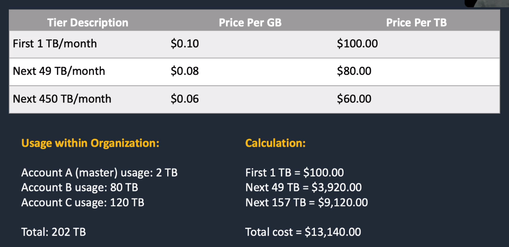
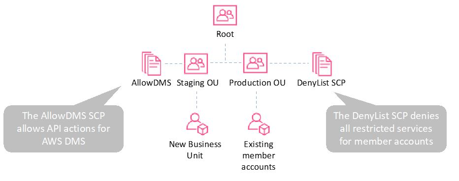

# AWS Organizations

## General Info
manages multiple AWS accounts at once. Possible to create groups of accounts and then apply policies to those groups (dev team, HR team, design team, ...). 

4 things to remember with AWS Organizations:

- centrally manage policies across multiple AWS accounts: policy apply to groups **no need to script anything now**
- control access to AWS services: create **service control policies (SCP)** to allow/deny individual AWS services for a particular group. **even if IAM allows it, SCP will override it**
- automate AWS account creation and management: add a new account to a group auto applies group policy to account
- consolidate billing across multiple AWS accounts: allows to take advantage of pricing benefits from aggregated usage such as volume discounts on EC2 and S3

Centrally manage policies across multiple AWS accounts
Control access to AWS services
Automate AWS account creation and management
Consolidate billing across multiple AWS accounts

=> can invite existing AWS accounts to join the organization (AWS Org sends invitation to the account owner, can accept/decline), this can only be done from the master account (consolidated billing)

Cost Allocation Tags -> must be activated, AWS organize resource costs on Cost Allocation report

If user wants his own billing management -> need to setup programmatic billing access, download and parse the bill as per the requirement

* Management account is the account that creates the organization
* we can create other accounts from AWS Organizations or invite existing accounts
* there is a root account at the top of the hierarchy
* accounts can be grouped into Organizational Units 
* apply policies to these accounts, centralized management
* consolidated billing (All billing info setup must be done in us-east-1 (North Virginia))
* can use AWS SSO using on prem directory
* can enable cloudtrail in management account and apply to members
  * good to enable compliance in organization
* when we create an account, a role with full permission on this account is created (OrganizationAccountAccessRole) => any user in management account (= root account) can assume this role if they have the sts:AssumeRole API permission
  * by default, not what we want so need to restrict that or specify which users can do that

Best practices
* have an account with all the users created
* create roles in the other accounts
* create a trust policy on the roles and specify which IAM user can assume the role

## Consolidated billing
With consolidated billing, the master (payee) can only view the AWS billing details of the linked accounts

Consolidated billing brings cost advantages:
- all accounts in consolidated bill are treated as one
- some services like EC2 and S3 have volume pricing tiers (the more you use, the less you pay). AWS combine usage from all accounts to know which pricing tier to apply
- easy tracking: can track the charges across multiple accounts and download the combined cost and usage data
- no extra fee for consolidated billing
- combined usage: can combine usage across all accounts in the organization to share the volume pricing discounts, Reserved Instance discounts and Savings plans

Note that free tier limits are only for 1 account of an Organization, not for each account

## Service Control Policies (SCP)
* Can control tagging and the available API actions of a whole group of accounts (Organizational Units)
* Needs to be attached to an organizational unit (?)
* SCP only affects **member** accounts of the organizations, not the root
  * use SCP with Deny in root account to restrict access to any account except the root (like purchase reserved instances for instance)
* control the maximum available permissions of an account
* any account has only those permissions permitted by **every** parent above it
* root (management account) has a statement policies allow all on all resources
* explicit deny always takes precedence if we have hierarchy of accounts
  * to be allowed to do something, permissions have to be allowed at all level
* can attach policies to organization entities
  * organization root
  * organizational unit (OU)
  * individual account

### Strategies and inheritance
* SCP attached to or inherited from parent: A, B, C
* SCP attached to child OU or account: C, D, E
  * only C can be used
* policy to root = all OUs and account in the organization inherit that policy
* policy to a specific OU = all OUs and accounts in the organization inherit that policy
* policy to a specific account = only affects this account

#### Deny list strategy (default)
* FullAWSAccess SCP applied at the root level so it is attached to every OU and account (everything allowed)
  * implicit deny
  * explicitly allows all permissions to flow down from the root
  * need to explicitly override with a deny in an SCP (at lower level)

=> **explicit deny overrides any kind of allow**

If we want to grant temporarily access to a new business unit, we need to create a temporary organization unit with the needed permissions.
Move the DenyList SCP from root to the production OU to keep the behavior like before and allow staging OU to do the stuff they need.

With a Deny list strategy, a default SCP allows all services and deny lists must be implemented for any specific services that must be restricted.
* if we need to make exception, we need to create an OU under root with an SCP with fewer restrictions

#### Allow list strategy
* FullAWSAccess SCP is _removed_ from every OU and account
  * all permissions are now denied by default
* to allow a permission, SCPs with allow statements must be added to the account and every OU above it including root
* every SCP in the hierarchy must explicitly allow the APIs we want to use

=> **explicit allow overrides an implicit deny**

## Tag policy
* applied to enforce tag standardization

## Create an organization
* created account are root account (specified by email), don't have password access unless we reset it in IAM
* we access these accounts by switching roles
  * specify account ID and name of the role

## Organizations management
* cannot close account from Organizations
  * need to be done from each individual root account and close account in billing management
  * takes 90 days in suspended state
  
## Create organization

Need to choose between "enable all features" or just "only consolidated billing"
* if we need to restrict access like using SCP, ... we need to have enabled all features in the parent account
* can create or invite existing accounts to the organization
* if we have enabled all features, we automatically have consolidated billing

1. Create accounts: can create a new account or invite an existing one (request date, expiration, status, some actions like cancel)
2. Organize accounts: create organization unit (Dev, HR, Finance, ...). Need to move an account to a particular organization. **an account can only be moved to one organization unit**
3. Apply policies: can select predefined one, copy another SCP or create a new one. The new one will either be a blacklist (allow everything except the specific list) or whitelist (allow only the list). **it is needed to enable policy to be able to apply them to a group**. A group can have multiple policies.

