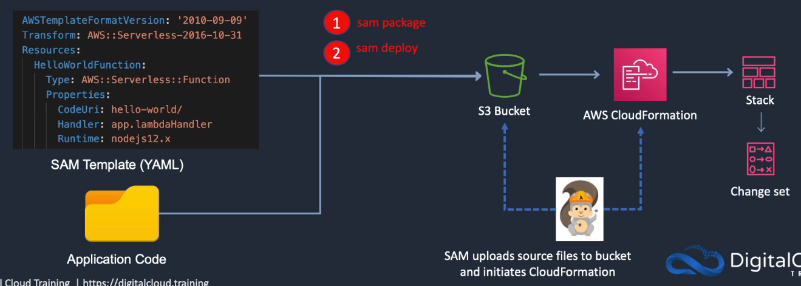
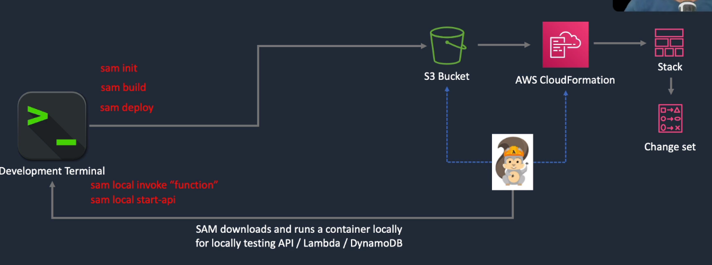

# AWS SAM

## General Info
* provides a shorthand syntax to express functions, API, databases and event source mappings
* we can create Lambda functions, API endpoints, DynamoDB tables, and other resources

* If we see Transform: AWS::Serverless-2016-10-31, we know it is a SAM template
* SAM template file is a YAML configuration that represents the architecture of a serverless application
* we use the template to declare all the AWS resources that comprise our serverless app in one place
* extension of CloudFormation template, any resource that we can declare in an AWS CloudFormation template can also be declared in an AWS SAM template

## Commands
* sam init -> create project
* sam build -> create resources
* sam deploy -> call cloudformation
* sam local invoke "function" -> download a container locally for testing
* sam local start-api

## Resource types
* AWS::Serverless::Function -> Lambda
* AWS::Serverless::Api -> API Gateway
* AWS::Serverless::SimpleTable -> DynamoDB
* AWS::Serverless::Application -> AWS Serverless Application Repository
* AWS::Serverless::HttpApi -> API Gateway HTTP API
* AWS::Serverless::LayerVersion -> lambda layers
