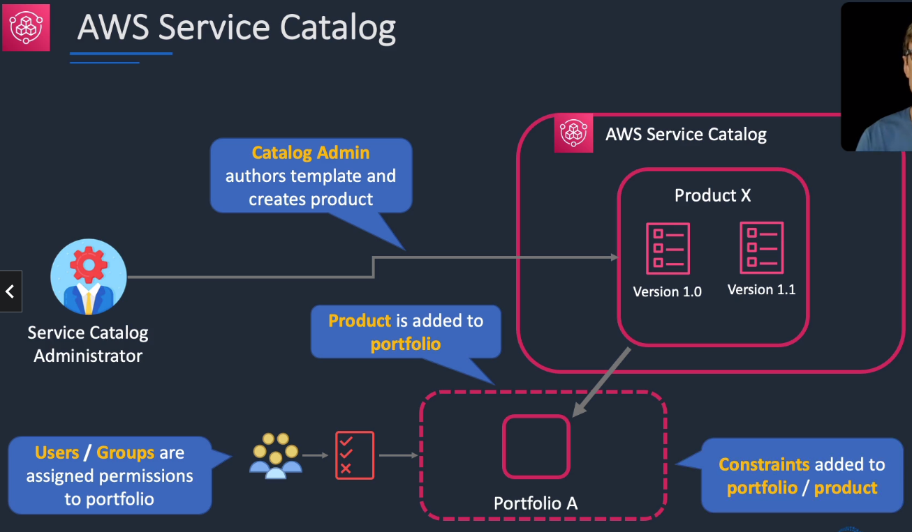

# AWS Service Catalog

## General Info

product which allows administrators to define products and portfolios (groups of products and configuration) => integrated with AWS Budgets

create and manage catalogs of IT services that are approved for use on AWS. These IT services can include everything from virtual machine images, servers, software and databases to complete multi-tier application architectures.

Service Catalog allows us to centrally manage commonly deployed IT services and helps us achieve consistent governance and meet compliance requirements while enabling users to quickly deploy only the approved IT services they need.

service catalog users can be allowed to self service deploy these products without the usual IAM permissions required to do so directly with AWS services

* allows organizations to create and manage catalots of IT services that are approved for use on AWS
  * virtual machine images
  * servers
  * software
  * databases
  * complete multi-tier application architectures
  * ...anything we can define in a CloudFormation template
* allows us to centrally manage commonly deployed IT services
* enables users to quickly deploy only the approved IT services they need

Users need one policy attached: AWSServiceCatalogEndUserFullAccess
* cloudformation
* config
* ssm
* systsems manager
* servicecatalog
* nothing related to EC2, S3, ... these permissions are handled with the role of the products

Limit access with AWSServiceCatalogEndUserReadOnlyAccess, create CloudFormation templates as portfolios created in central AWS account, share them using AWS Organizations,
use launch constraint with a role to prevent end users needing IAM credentials

launch constraint specifies the IAM role that AWS service catalog assumes when an end user launches a product
* without one, end users must launch and manage products using their own IAM credentials
* with one, we can limit the end users permissions to the minimum that they require for the product

## Concepts (important for exam)
* Catalog administrators
  * manage catalog of products, organizing them into portfolios, granting access to end users
* End users
  * receive AWS credentials use the AWS Management Console to launch products to which they have been granted access
* Constraints
  * control the ways that specific AWS resources can be deployed for a product
  * can use them to apply limits to products for governance or cost control
  * types
    * launch constraints (exam!): specify a role for a product in a portfolio. Role is used to provision resources at launch, can restsrict user permissions without impacting user's ability to provision products from catalog
    * notification constraints: get notifications about stack events using an Amazon SNS topic
    * template constraints (exam!): restrict configuration parameters that are available for the user when launching the product
* Sharing
  * share portfolios across accounts in AWS organizations (copy, stack sets, sync, import)
  * share reference to the catalog or deploy a copy of the catalog
    * copy: need to redeploy if there are updates we want to propagate to the recipient accounts
    * share reference: imported stays in sync with the reference
    * CloudFormation StackSets can be used to deploy a catalog to multiple accounts at the same time
  * same region

Shared, imported portfolios relationships:
* products and products versions are inherited in imported one, stay in sync => imported cannot make change
* launch constraints are inherited in imported one => imported cannot add/remove launch constraints
* template constraints are inherited, local portfolio can add template constraints but cannot remove
* IAM users, groups, roles not inherited => admin create users for its own account with the imported one

[Sharing vs reference](https://docs.aws.amazon.com/servicecatalog/latest/adminguide/catalogs_portfolios_sharing.html)

## Steps

1. Admin creates a portfolio that will contain one or more products (similar to an online store) => "engineering tools" (portfolio) that contains "Linux" (product)
2. Admin author products templates (= CloudFormation template)
3. Admin add constraints and access to the resources. **The users or groups need to be specifically added to the portfolio for them to see the products.** The constraints (such as LAUNCH constraint) are a role that has the permissions for the deployment of the stack.
4. Users browse products
5. Users launch products, CloudFormation creates resources in a stack and send events to the users and the admin => we don't need to manage permissions for them directly. it just needs access to the service catalog not EC2, RDS, ..

## Use case

* **migration factory**: people create CloudFormation templates to suit a certain needs of resources and users (developers) can browse them, deploy them and just have to provide the data
* **one click deployment**: organizations who are looking to replicate or create additional environments. Developers can deploy a dev environment easily
* **quick experimentation**: organizations with teams such as data science teams who have regular need to spin up specific resources in AWS for a particular job or experiment
