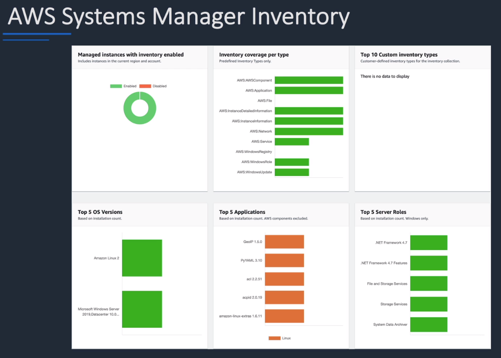
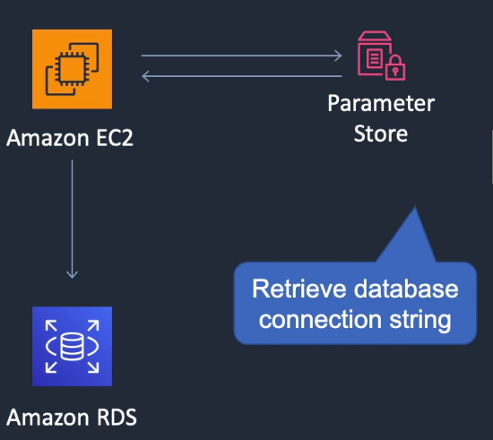
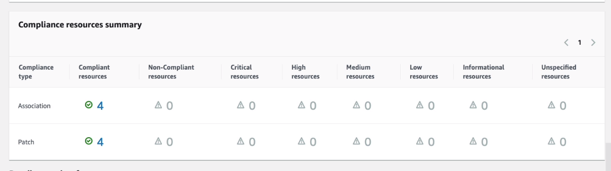

# AWS Systems Manager

## General Info

also known as SSM is a management tool which 

- gives us visibility and control over our AWS infrastructure and on-premises instances
- integrates with CloudWatch (view dashboards, view operational data & detect problems)
- include run command which automates operational tasks across resources (security patching, package installs
- organize inventory (full list of our AWS resources), grouping resources together by app or environment, **including on premises systems** (need SSM agent)
- compliance summary of managed instances (patched or not, ...)
- create maintenance windows (cron) to execute tasks - automation of tasks
- state manager can be used to create a valid config and apply it automatically to resources (and overrides manual changes if they happen)
- supports Linux and Windows
- manages many AWS resources including EC2, S3, RDS

The agent with the proper role on the EC2 (AmazonEC2RoleforSSM) is a requirement for this to work.** Agent is there by default on most recent AMI but can easily be installed if that was not the case.

A managed instance is an EC2 instance, on on-premises servers or VM configured to use Systems Manager. **In the case of on-premises server, there is an activation code to be provided. For EC2, just IAM permissions.** In the Systems Manager console, we have a list of all the managed instances.

Systems Manager need internet access to access the EC2 (internet gateway) or VPC endpoints to have access.

can group resources like EC2 instances, S3 buckets, RDS instances, by application

Logical groups = group of resources associated with a particular worload such as app stack or prod vs dev environment

Insights dashboard: operational data that the Systems Manager auto aggregates for each resource group)

Distributor: distribute and install software packages while maintaining control over versioning. Protected by IAM to control who can create or update packages

Session manager: SSH session in the browser, protected by IAM, CloudTrail, Logs, ...

Good tags on instances are very important since instances can be filtered out using tags!

## Systems Manager Components
* Automation
* Run Command
* Inventory
* Patch Manager
* Session Manager
* Parameter Store

There is an agent that needs a role with permission to send info to Systems Manager

### Document
System Manager documents define actions that systems manager performs, and they can be used by State Manager, Run Command and Automation. 
They are controlling directives and can be written in YAML or JSON => can be thought of as CloudFormation template

Amazon provides lots of default documents that can be reused (S3 config, DynamoDB management, Install application, delete some resource, ...)

A document is associated with one or more managed instances.

The documents are then used to automate IT operations and management tasks across AWS resources via **Automation**

### Actions

Actions are almost all related to managed instances. We can target all managed instances of the account, tags specific instance, or we can manually select instances for actions.

* **AWS Systems Manager Run Command**: manage the configuration of managed instances at scale by distributing commands across a fleet
* **Inventory**: automate the collection of the software inventory from managed instances (good combination with AWS Config to audit app config overtime)
* **State Manager**: keep managed instances in a defined and consistent state
* **Maintenance Window**: define a maintenance window for running administrative tasks
* **Patch Manager**: deploy software patches automatically across group of instances
* **Automation**: perform common maintenance and deployment tasks such as updating Amazon Machine Images
* **Parameter Store**: store, control, access and retrieve configuration data, whether plain-text data such as database strings or secrets such as passwords, encrypted through AWS Key Management System (KMS)

#### Run command

**really important functionality**

- **execute a document on one or more managed instances**
- run commands can be based on tags
- allows running predefined commands on one or more EC2 instances
- stop, restart, terminate, re-size instance
- attach/detach EBS volumes
- create snapshots, backup DynamoDB tables
- apply patches and updates
- run Ansible playbook
- run a shell script
- run our own scripts (AWS-RunShellScript)
- document types include command, automation, package etc

We have access to lots of default "document" but we can create our own.
We can have a notification with SNS about the status if we want, we can check the command that will be executed before executing it.
Once it is executed, we can get the output of the commands in AWS Systems manager. Result can also be saved in a S3 bucket

Good to remember

- Commands can be applied to a group of systems based on AWS instance tags or by selecting manually
- SSM agent needs to be installed on all the managed instances
- **The commands and parameters are defined in a Systems Manager Document**
- Commands can be issued using AWS console, AWS CLI, AWS tools for windows powershell, Systems Manager API or Amazon SDKs
- Can use this service with on-premises systems as well as EC2 instances
- Need a role to be able to execute run commands on EC2

There is an option for rate control to specify either a percentage of targets on which RunCommand is executed or a fixed number.

After the run command is executed, we see an output with the results of the command (find missing windows updates, ...)

#### Inventory

Systems manager offers two insight features, Inventory and Compliance. Both supported by SSM State Manager. 

**Inventory**
* can be collected on a configurable scheduled such as every 30 minutes. 
* We can select what we want to retrieve => almost anything from environment variables, registry, services, network config, updates status, applications installed, instance detailed info, ... 
* **The inventory can be synced to an S3 bucket if we want.**

**Compliance**: 
* allows that data to be compared against a baseline, providing a Compliant or Non-Compliant state to a resource. 
* Compliance uses state manager, SSM patching and custom compliance types.



#### State Manager

State manager is a desired state engine. We defined the desired state in the form of systems manager document (command document or policy document). A command document is used by running command and state manager, a policy document defines desired states and is only used by State manager. 

#### Patch manager

We have a baseline, we evaluate an instance, and then we remediate.

Helps select and deploy OS and software patches automatically across large groups of Amazon EC2 or on-premises instances

We can schedule maintenance windows for our patches so that they are only applied during predefined times

The patch baseline is defined by AWS, there is one for each OS supported (Windows, CentOS, SUSE, Amazon Linux2, Ubuntu, ...). We can also create one ourselves.
* set rules to auto approve select categories of patches to be installed
* specify a list of patches that override these rules and are automatically approved or rejected

With this, we can install patch automatically (instance tags, patch group, instances selected manually), 
we can have a patching schedule (maintenance window, new instance window, now). 
We can also have "scan and install" or "scan only".

=> Patch Manager helps ensure that our software is up-to-date and meets our compliance policies

#### Automation
Automation executes Documents (created by AWS or ours) that describes the actions to do.

Automation is a set of actions such as installing a software, configuring the software, restarting the instances. 

The automation is driven by a specific role. The user only needs to have access to this role to execute the automation even if he doesn't have the specific roles required by each action.

#### Parameter store

Used to store confidential information such as users, passwords, license keys. 
This info needs to be passed to EC2 as bootstrap script, EC2 Run command, AWS CloudFormation, lambda -> use Parameter store.

Hierarchical storage for configuration data management and secrets management

We create a "Parameter" with a name which can have 3 values:

- String: a single value
- String List: a comma separated list of value
- Secure String (ciphertext): encrypts the data using KMS (need to provide the KMS Key ID) and the value

The name is very important since it is used to reference it in what we want (no space allowed, ..)

Benefits:

* provides serverless, secure, scalable, hosted secrets management service
* allows us to separate sensitive data from source control
* can store parameters in hierarchies and track versions for easier organization
* can use these parameters across a variety of AWS services:  EC2, ECS, Lambda, CodeBuild/Deploy, CloudFormation and many more
* can audit, tag, and secure parameters using existing AWS services and tools
* highly scalable, available and durable
* store data such as passwords, database strings, license codes as parameter values
* can reference values by using the unique name that we specified when we create the parameter

**No native rotation of keys (difference with AWS Secrets Manager which does it automatically)** => exam



##### API actions

We access Parameter Store from CLI/SDK using the AWS Systems Manager.

* PutParameter: adds a parameter to a Parameter Store

  * String, StringList, SecureString
  * SecureString is KMS encrypted string that SSM can decrypt for us by using KMS => SSM creates KMS key automatically "alias/aws/ssm".

* GetParameter: can return the parameter value either encrypted or decrypted (returns JSON)

  ```python
  ssm.get_parameter(Name='mydbstringpass', WithDecryption=True)
  ```

  We can use the encrypted version with KMS later on to get the decrypted version.

* DeleteParameter

**=> need to have access to SSM parameter store to use that programmatically.**

#### Compliance
* Systems Manager lets us scan our managed instances for patch compliance and configuration inconsistencies
* we have a dashboard with a view of what's compliant or not
* collect and aggregate data from multiple AWS accounts and Regions, and then drill down into specific resources that aren't compliant
* look for things in our instances and create reporting of findings
* by default, AWS SSM displays data about patching and associations
* can also customize the service and create our own compliance types based on our requirements
  * must use AWS CLI
  * AWS Tools for windows powershell
  * or the SDKs



#### Session Manager
* secure remote management of our instances at scale without logging into our servers
* replaces the need for bastion hosts, SSH or remote PowerShell => no need to open the ports (22 SSH, 5985/5986 RDP) because we use the agent
* integrates with IAM for granular permissions
* all actions taken with Systems Manager are recorded by AWS CloudTrail (commands types in the instances, ...)
* can store session logs in an S3 and output to CloudWatch logs
* requires IAM permissions for EC2 instance to access SSM, S3 and CloudWatch Logs


