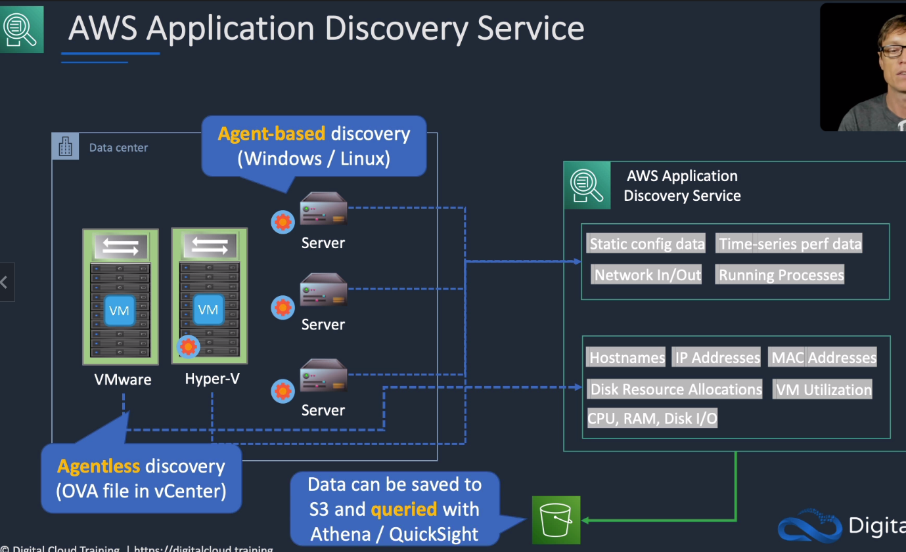
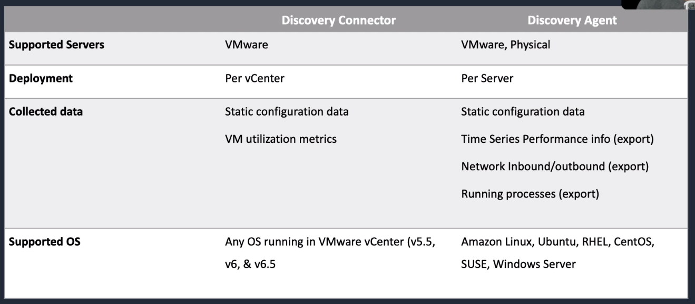

# AWS Application Discovery Service

## General Info
AWS Application Discovery Service helps enterprise customers plan migration projects by gathering information about their on-premises data centers.

Planning data center migrations can involve thousands of workloads that are often deeply interdependent.

Server utilization data and dependency mapping are important early first steps in the migration process.

AWS Application Discovery Service collects and presents configuration, usage, and behavior data from your servers to help you better understand your workloads.

The collected data is retained in encrypted format in an AWS Application Discovery Service data store.

You can export this data as a CSV file and use it to estimate the Total Cost of Ownership (TCO) of running on AWS and to plan your migration to AWS.

In addition, this data is also available in AWS Migration Hub, where you can migrate the discovered servers and track their progress as they get migrated to AWS.

Before migrating
* we need to find what services are running on premises
* need to know the metrics (CPU, RAM, network, ...)
* most likely the first service to use for a migration

The Application Discovery Service collects data about servers in on-premises data center or import spreadsheets

For VMWare, we can have an OVA file in vCenter that will export all the info.

For Hyper-V and physical servers, we need to install an agent (agent base discovery windows/linux)

Data can be saved to S3 and queried with Athena/QuickSight

We can import a file into ADS, but we need to follow a strict template.

Helps entreprise customers plan migration projects by gathering information about their on-premises data centers.

## Differences between connector and agent

Discovery connector is the agentless method and the most efficient method, always use that if possible.

If we have a mix of VMware and physical servers -> we use both (best method) and not only the agent

