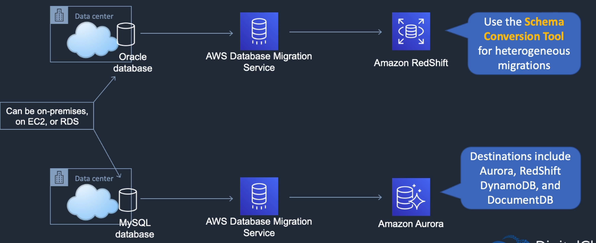

# AWS Database Migration Service

## General Info
Migrate database on premises to RDS, Aurora, ...

If the schemas are not compatible between the DB, we need to use the **Schema Conversion Tool** (heterogeneous migrations)

Destinations can include Aurora, Redshift, DynamoDB and DocumentDB

Databases sources can be on premises, on EC2, or RDS.

DMS runs on EC2, we specify the instances we want for the migration

AWS Database Migration Service helps you migrate databases to AWS quickly and securely.

The source database remains fully operational during the migration, minimizing downtime to applications that rely on the database.

The AWS Database Migration Service can migrate your data to and from most widely used commercial and open-source databases.

Supported migration paths include:

On-premises and EC2 databases to Amazon RDS or Amazon Aurora.
Homogeneous migrations such as Oracle to Oracle.
Heterogeneous migrations between different database platforms, such as Oracle or Microsoft SQL Server to Amazon Aurora.
For the full list of supported sources click here.

For the full list of supported targets click here.

With AWS Database Migration Service, you can continuously replicate your data with high availability and consolidate databases into a petabyte-scale data warehouse by streaming data to Amazon Redshift and Amazon S3.

Use along with the Schema Conversion Tool (SCT) to migrate databases to AWS RDS or EC2-based databases.

The AWS Database Migration Service can migrate your data to and from most widely used commercial and open-source databases.

Schema Conversion Tool can copy database schemas for homogenous migrations (same database) and convert schemas for heterogeneous migrations (different database).

DMS is used for smaller, simpler conversions and supports MongoDB and DynamoDB.

SCT is used for larger, more complex datasets like data warehouses.

DMS has replication functions for on-premises to AWS or to Snowball or S3.

## Sources
* Oracle
* Microsoft SQL server
* Microsoft Azure SQL (+ managed)
* Google Cloud for MySQL
* PostgreSQL
* MySQL compatible DB
* SAP ASE
* MongoDB
* Amazon DocumentDB
* S3
* IBM Db2

## Targets
* Oracle
* Microsoft SQL Server
* PostgreSQL
* MySQL-compatible DB
* Redshift
* SAP ASE
* S3
* DynamoDB
* Kinesis Data Streams
* Kafka
* Amazon OpenSearch
* Amazon DocumentDB
* Amazon Neptune
* Redis

## Use cases
* cloud to cloud: EC2 to RDS, RDS to RDS, RDS to Aurora
* on premises to cloud
* homogeneous migrations: Oracle to Oracle, MySQL to RDS MySQL, Microsoft SQL to RDS for SQL Server
* heterogeneous migrations: Oracle to Aurora, Oracle to PostgreSQL, Microsoft SQL to RDS MySQL (must convert schema first with the Schema conversion tool)
* can also use it for development and test: use the cloud for dev/test workloads
* database consolidation: consolidate multiple source DBs to a single target DB
* continuous data replication: use for disaster recovery, dev/test, single source multi target or multi source single target

## Create a migration
1. create a replication instance (EC2 config: size, network, storage, ...)
2. create a task (select replication instance, source database, target database, migration type)
   1. migration type is important: migrate existing data, migrate existing data and replicate ongoing changes, replicate data changes only
3. create source endpoint and target endpoint to know where to read/write data

