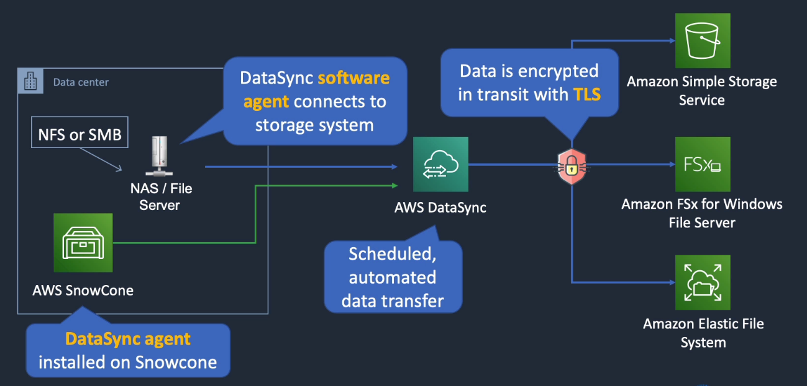

# AWS DataSync

## General Info

data transfer service to move data from on-prem storage to S3 or EFS using an agent (DataSync software agent) or between AWS storage services

it handles encryption, scripts, network optimization, data integrity validation.

transfer data at speeds up to 10 times faster than other tools.

Uses an on-prem agent to connect to the storage using NFS protocol

Copy data over Direct Connect or internet

Enables one-time data migrations, recurring data processing workflows, automated replication for data protection and recovery.

DataSync does **not** support copying EFS data between regions

Agent supports VMWare, KVM, microsoft Hyper-V, Amazon EC2

Data encrypted in transit with TLS, can be encrypted at rest as well in the different services

Possible destinations:

* S3
* Amazon FSx for Windows File Server
* EFS

Another option is the AWS SnowCone device:
* DataSync agent installed on Snowcone

AWS DataSync is an online data transfer service that simplifies, automates, and accelerates moving data between on-premises storage systems and AWS Storage services, as well as between AWS Storage services.

You can use DataSync to migrate active datasets to AWS, archive data to free up on-premises storage capacity, replicate data to AWS for business continuity, or transfer data to the cloud for analysis and processing.

DataSync provides built-in security capabilities such as encryption of data in-transit, and data integrity verification in-transit and at-rest.

It optimizes use of network bandwidth, and automatically recovers from network connectivity failures.

In addition, DataSync provides control and monitoring capabilities such as data transfer scheduling and granular visibility into the transfer process through Amazon CloudWatch metrics, logs, and events.

DataSync can copy data between Network File System (NFS) shares, Server Message Block (SMB) shares, self-managed object storage, AWS Snowcone, Amazon Simple Storage Service (Amazon S3) buckets, Amazon Elastic File System (Amazon EFS) file systems, and Amazon FSx for Windows File Server file systems.
