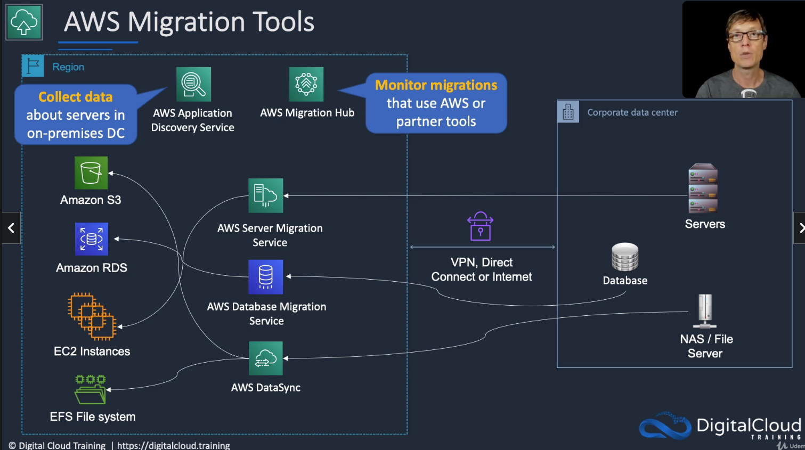

# AWS Migration Hub

## General Info
Services that contain a view of all the migration services (datasync, DMS, SMS, ...)

Monitor migrations that use AWS or partner tools

Even if we have lots of tools for migrating stuff, they all point to migration hub

WS Migration Hub provides a single location to track the progress of application migrations across multiple AWS and partner solutions.

AWS Migration Hub allows you to either import information about on-premises servers and applications, or to perform a deeper discovery using our AWS Discovery Agent or AWS Discovery Collector, an agentless approach for VMware environments.

AWS Migration Hub network visualization allows you to accelerate migration planning by quickly identifying servers and their dependencies, identifying the role of a server, and grouping servers into applications.

To use network visualization, first install AWS Discovery agents and start data collection from the Data Collectors page.

AWS Migration Hub provides all application details in a central location.

This allows you to track the status of all the moving parts across all migrations, making it easier to view overall migration progress and reducing the time spent determining current status and next steps.

AWS Migration Hub lets you track the status of your migrations into any AWS region supported by your migration tools.

Regardless of which regions you migrate into, the migration status will appear in Migration Hub when using an integrated tool

## Architecture patterns - migration and transfer
* company is migrating Linux and Windows VMs in VMware to the cloud. Need to determine performance requirements for right sizing: discovery connector (vCenter) of Application Discovery Service
* company has a mixture of VMware VMs and physical servers to migrate to AWS. Need to identify dependencies for grouping applications for migration: 
  * install Application Discovery Service (discovery connector) in VMware vCenter and the discovery agent on physical servers
* need to migrate an Oracle Data Warehouse to AWS: AWS DMS (+ schema conversion tool) to Redshift
* Snowball edge used to transfer millions of small files using a shell script. Transfer times are very slow: parallel copy, multiple terminal, separate instances of Snowball client
* minimize downtime for servers that must be migrated to AWS: AWS SMS and perform a final sync before cutting over in a short outage window
* need to migrate 50 TB of data and company only has a 1Gbps internet link. Requirement is urgent: snowball to transfer the data
