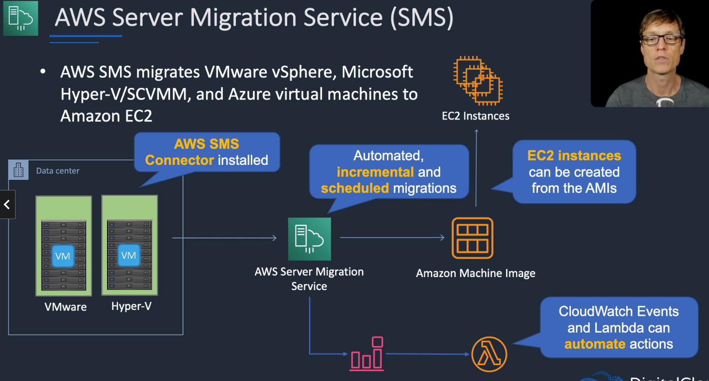
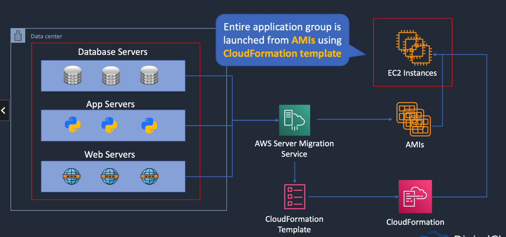

# AWS Server Migration Service (SMS)

## General Info
Migrate on premises server to EC2 instances (always)

AWS SMS migrates VMware vSphere, Microsoft Hyper-V/SCVMM, and Azure Virtual machines to Amazon EC2

We need to install an AWS SMS Connector on the source machine

SMS creates an AMI (automated, incremental and scheduled migrations)

Can configure cloudwatch events and Lambda to start EC2 instances at a certain point of the migration process

We can also do application migration. During the migration, SMS will also create a CloudFormation template to replicate the infra

Great way to migrate application as a unit.

Migration can happen during a period of up to 90 days (incremental) => useful if needed to minimize downtime, we just have a last small sync before we migrate

AWS Server Migration Service (SMS) is an agentless service which makes it easier and faster for you to migrate thousands of on-premises workloads to AWS.

AWS SMS allows you to automate, schedule, and track incremental replications of live server volumes, making it easier for you to coordinate large-scale server migrations.

AWS Transfer Family

The AWS Transfer Family provides fully managed support for file transfers directly into and out of Amazon S3 or Amazon EFS.

With support for Secure File Transfer Protocol (SFTP), File Transfer Protocol over SSL (FTPS), and File Transfer Protocol (FTP), the AWS Transfer Family helps you seamlessly migrate your file transfer workflows to AWS by integrating with existing authentication systems and providing DNS routing with Amazon Route 53, so nothing changes for your customers and partners, or their applications.

With your data in Amazon S3 or Amazon EFS, you can use it with AWS services for processing, analytics, machine learning, archiving, as well as home directories and developer tools.