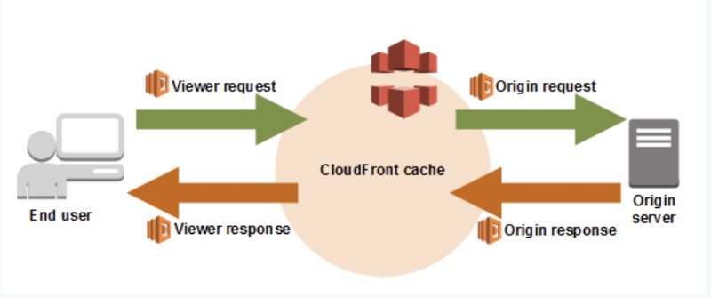
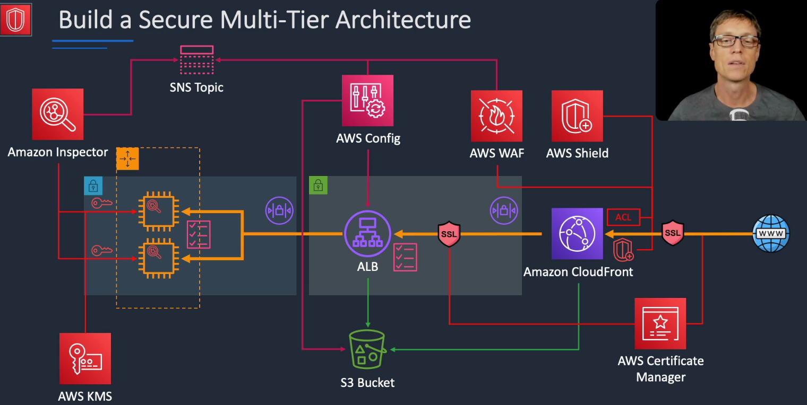
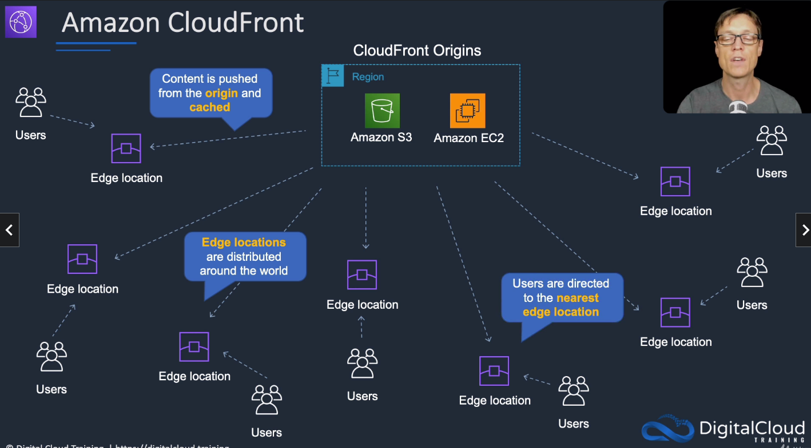
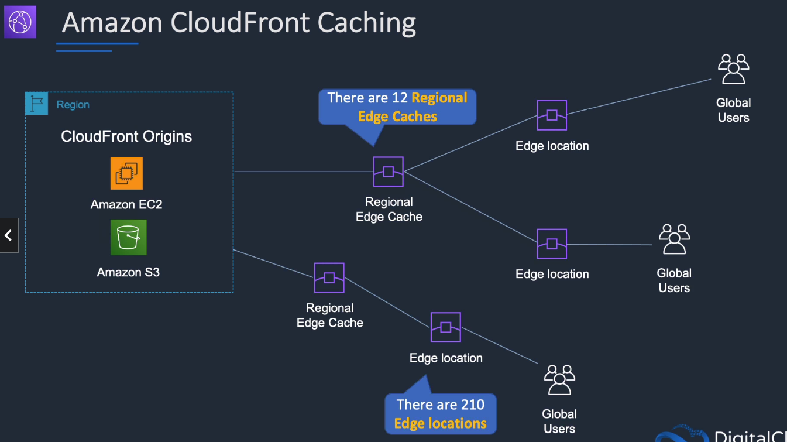
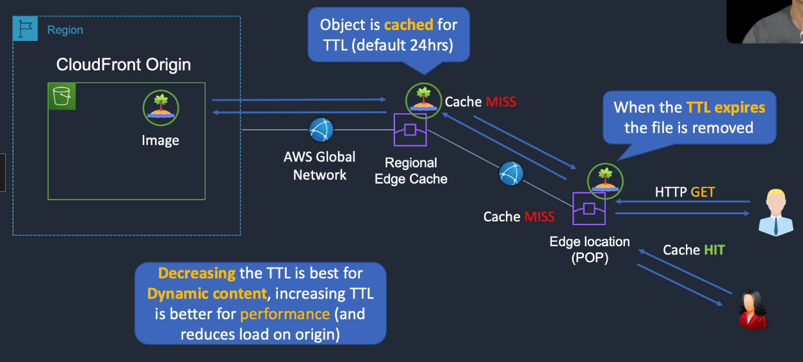
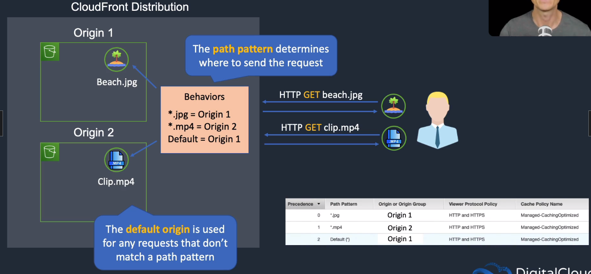
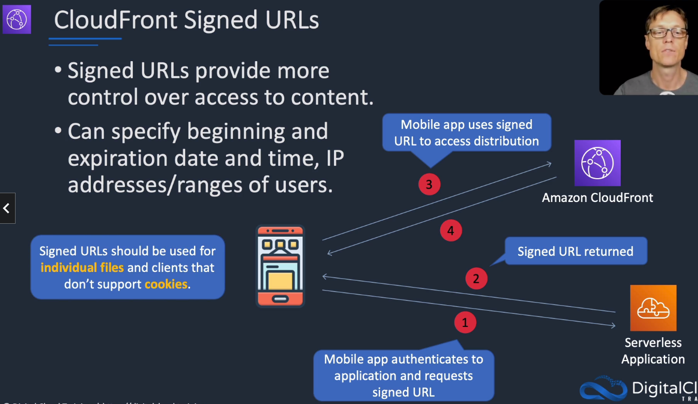
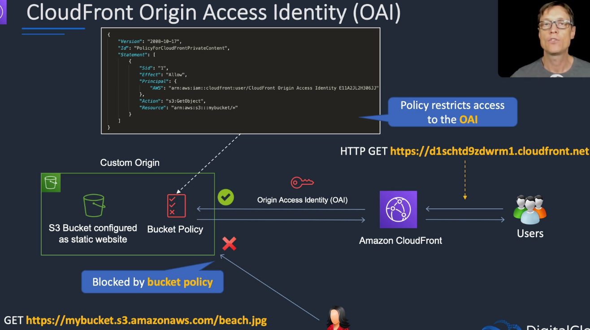
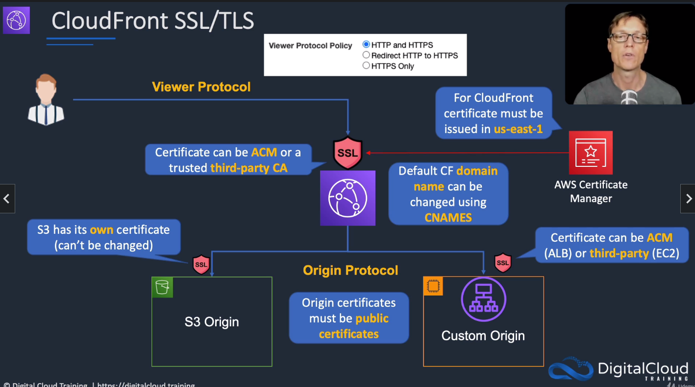
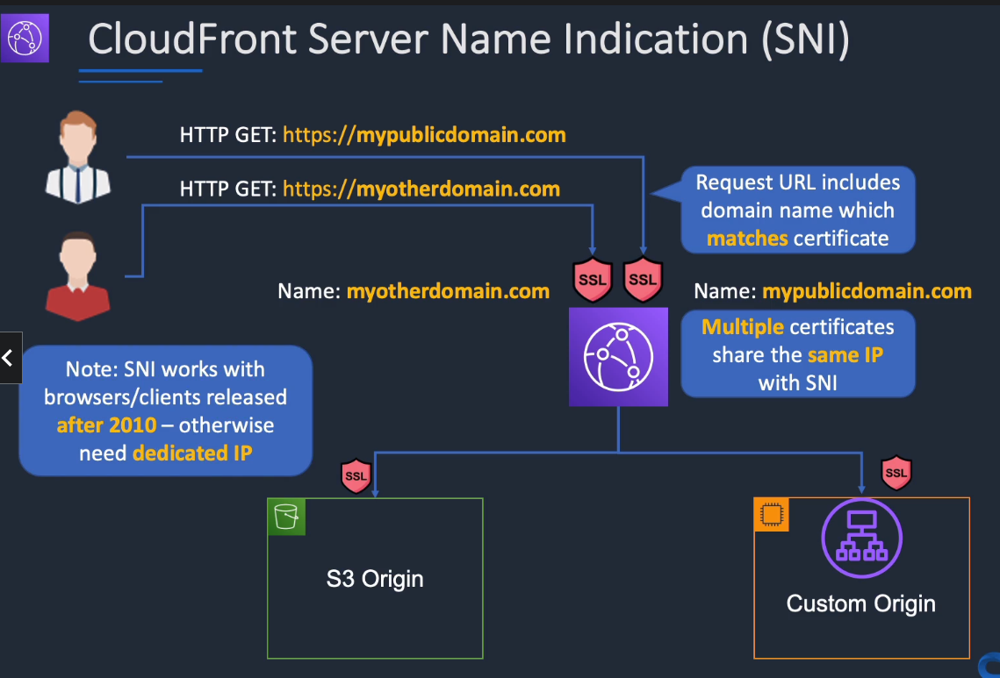

# Amazon CloudFront

## General Info
* fast content delivery network for static, dynamic, streaming content 
* global on AWS
* edge locations are global, low latency because of internal AWS network and caching at edge 
* works with AWS Shield for DDoS, S3, ELB, EC2, Lambda@Edge 
* user is redirected based on latency to the closest edge location when requesting content
* CloudFront is optimized to work with other Amazon services such as S3, EC2, ELB, Route 53 but can work with any non-AWS origin servers that store the original, definitive versions of the files. 
* Can configure CloudFront to create log files that contain detailed information about every user request that CloudFront receives.
* CloudFront integrates with CloudWatch metrics
* If we use custom origin, we can optionally set up custom headers to restrict access
  * need HTTP or HTTPS request to have that option available
  * use WAF web ACL to filter the requests and validate the present of the custom header => prevent bypassing cloudfront to access AWS resources
* Lambda@Edge must be used to load different content based on the client request (operating system, ...)!
  * after CloudFront receives the request from a viewer (viewer request)
  * before CloudFront forwards the request to th origin (origin request)
  * after CloudFront receives the response from the origin (origin response)
  * before CloudFront forwards the response to the viewer (viewer response)
* use Lambda@Edge to organize URL to improve cache hit (viewer request)

If we get HTTP status code 404 with an ALB as default origin of the CloudFront distribution
* we need to add another origin for the static assets
* add behavior to the distribution for the path pattern and the origin of the static assets (S3)

To check in case of Access Denied errors (403):
* objects in the bucket must be publicly accessible
* objects can't be encrypted by KMS
* bucket policy must allow access to s3:GetObject
* bucket policy grants public read access -> AWS account that owns the bucket must also own the object
* requested objects must exist in the bucket
* S3 block public access must be disabled on the bucket
* if requester pays is enabled -> need request-payer parameter
* if using Referer Header to restrict access -> review custom header

## Build a secure multi tier architecture

* encrypt EBS volumes with KMS
* Amazon Inspector scans EC2 for any security issues
* ACL, security groups, private/public subnets => allow only HTTPS for the frontend ALB
* SNS topics for notification from Inspector, Config, WAF
* Config that checks compliance (encrypted bucket, ...)
* SSL certificates with AWS Certificate Manager
  * need to request one public certificate for ALB (alb.mywebsite.com)
  * one for the domain name (mywebsite.com)
  * when we create the cloudfront distribution, we configure alb.mywebsite.com as origin domain name and not the default cloudfront URL otherwise the certificate won't match!
  * for SSL certificates, we need to have the exact information (website URL) to be valid
* AWS Shield, WAF for CloudFront (DDOS, ..)
* public/private subnets, NAT gateway with elastic IP in public subnets + ALB in the same AZ of the resources in the private subnets, the rest in private subnets
* have custom headers on ALB to ensure that we don't bypass cloudfront
  * CloudFront origin settings
  * add conditional rule that requires custom header in ALB

## Origins and Distributions

In CloudFront we create distributions which give us a DNS name.
* speed up distribution of static and dynamic content php, js, html, videos, ... 
* distribute media files using HTTP or HTTPS
* add, update, delete objects, and submit data from web forms
* use live streaming to stream an event in real time
* Can configure HTTP/HTTPS as part of a given CloudFront distribution
* we can have only a few regions or use all edge locations (best performance)
* we can have a default error pages, error responses
* we can blacklist users based on geo restrictions
* security
  * we can create WAF Web ACL for extra security
  * handles certificate SSL/TLS

A cloudfront distribution can have one or more origins
* S3 origins
* Elastic load balancers
* MediaPackage/MediaStore

### Caching
* CloudFront also uses multiple layers of caching at each edge location and collapses simultaneous requests for the same object before contacting the origin server
  * 12 regional edge caches (between AWS and edge location)
  * 210 edge locations
* reduce the need to scale the origin infrastructure when website becomes more popular 
* once a user connects to an edge location, all the traffic between these edge locations and AWS go through the AWS network
* If we need to remove an object form CloudFront edge server caches before it expires, we can either invalidate the object or use object versioning to serve a different version of the object that has a different name. Additionally, it might be better to serve infrequently accessed data directly from the origin server, avoiding the additional cost of origin fetches for data that is not likely to be reused at the edge, however, origin fetches to Amazon S3 are free. 

We can define a maximum TTL and a default TTL. TTL is defined at the behavior level. We can have different TTL for different file types.

After expiration, CloudFront checks the origin for any new requests (check the file is the latest version)

We can use headers to control the cache
* Cache-Control max-age=(seconds): specify how long before cloudfront gets the object again from the origin server
* Expires: specify an expiration date and time

Caching based on Request Headers
* configure CloudFront to forward headers in the viewer request of the origin
* cloudfront can then cache multiple versions of an object based on the values in one or more request headers
* controlled in a behavior to do one of the following:
  * forward all headers to our origin (objects are not cached)
  * forward a whitelist of headers that we specify
  * forward only the default headers (doesn't cache objects based on values in request headers)

### Behaviors
To better understand end user usage patterns, we can use Amazon CloudFront reports

path pattern: check file extensions to know where to send the request to origin

viewer protocol policy: HTTP, HTTPS, HTTP-to-HTTPS, HTTPS only

allowed HTTP methods
* GET, HEAD
* GET, HEAD, OPTIONS
* All

cache policy

origin request policy

## Signed URLs and Origin Access Identities (OAI)
signed URLs 
* provide more control over access to content
* can specify beginning and expiration date and time, IP addresses/range of users
* **cannot use it for multiple files**

signed cookies
* similar to signed URLs
* use signed cookies when we don't want to change URLs
* **can also be used when we want to provide access to multiple restricted files**
* when using signed cookies, the application sends three Set-Cookie headers to the viewer and the viewer stores the name-value pairs and add them to the requests using a Cookie Header
* access is then controlled in CloudFront based on the cookies

Origin Access Identity
* prevents a user to directly target S3 Origin resources since only the Origin Access Identity of CloudFront is allowed in the bucket policy
* OAI = special CloudFront user that is associated with the distribution: use it in S3 bucket policy to restrict access
* **only for S3**, not EC2
* for EC2, we need to use security groups to allow cloudfront IP (dynamic IP so need to update them in SG)
* created during the creation distribution, we can reuse existing
* only read access

## CloudFront SSL/TLS and Server Name Indication (SNI)
* issue certificate from AWS Certificate Manager, must be issued in us-east-1 or trusted 3rd party certificate authority
* default CF domain name can be changed using CNAMES
* S3 already has its own certificate (can't be changed)
* Custom Origin (EC2): certificate can be ACM (ALB) or 3rd party (EC2)

Server Name Indication
* can have multiple SSL/TLS certificates which correspond to different domain names running on the same IP address on cloudfront
* avoids paying for one IP per certificate

## Canary Testing
It is possible to have Canary Testing with CloudFront and Lambda@Edge.

Scenario:

* frontend A/B testing: static content or any cacheable content in general
* content served through CloudFront CDN (caching and geographical proximity)
* we don't want to pollute the frontend with any switching logic => Lambda@Edge is the way of putting logic in the CDN
* content served from S3 buckets directly but the idea can be extended to any http/https source
* two complete version of frontend (main and experiment) in 2 distinct S3 buckets (separate CloudFront distribution origins)
* randomly switch a fraction of users to experiment frontend
* we want user to stay on the same version for the duration of the session (since we don't have any login -> browser session)

Solution:

* use a cookie "X-Source" to keep the user on a single version for the duration of the browser session
* user first hit the Lambda@Edge and gets a "X-Source" cookie if first time -> defines where to send the user
* if cache hit based on cookie, user gets the static content based on cookie (main or experiment)
* if cache miss, user is forwarded to "Origin Request" Lambda@Edge which checks the "X-Source" to know where to send him the first time (main or experiment)
* responses from main and experiments are sent to "Origin Response" Lambda@Edge" which returns the response to the user

## Pricing model

regional data transfer out per GB

requests per 10k

If AWS services is the origin (S3, EC2, ELB, ...) -> data transferred from the origin to edge locations will be free of chage.

For web distributions, data transfer out of Amazon CloudFront to our origin server will be billed at the "Regional Data Transfer Out of Origin" rates.

We can select in which location we want to have it enabled (Europe, US) instead of globally.

Can reserve capacity for 12 months or longer and get a discount.
