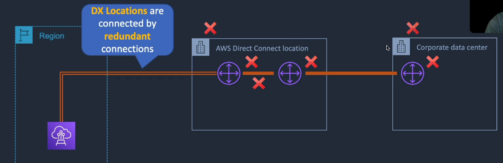
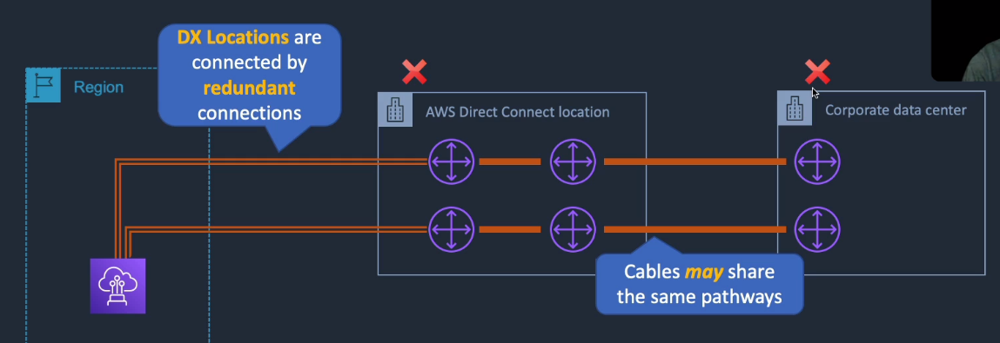

# AWS Direct Connect

## General Info

secure, reliable, low latency dedicated connection between outside AWS and the AWS ecosystem. 
The connection is private and does not suffer from internet latency since it is not shared
=> private virtual interface

**Direct Connect Gateway**

* connect to any VPC in our account in any region
* create in any region and access it from any region (except China)
* **VPCs cannot have overlapping CIDR blocks otherwise we have duplicate IP addresses on the same network**
* communication traverses the AWS network backbone
* great way to handle things globally while being connected to a single direct connect to AWS datacenter
* WAN should then be configured through BGP to forward connections to AWS across the DX connections

By connecting our private virtual interface to a "**Direct connect Gateway"** inside Amazon, we can access any resource in different region => no need to have a direct connect in each region
**=> still need to add a route table to the direct connect gateway**

 This is done through an authorized Direct Connect Provider (Verizon, other ISPs): 1Gbps or 10Gbps

AWS Direct Connect location provides ability to access VPCs in the AWS region it is associated with. We don't have to have a direct connect connection in all regions, once we have one we can just use Amazon network with its Direct Connect gateway.

Access to public service endpoints in all regions

VPN is also a safe way to access AWS but we go through internet.

Best way to avoid downtime is to have a direct connect connection for the migration if the existing line is already busy

If we see consistent network performance, we think direct connect

Combination of transit gateway and DX gateway:
* low complexity
* fully transitive connecitons between VPC in a region
* DX gateway can then connect the transit gateway to the DX connection
* BGP is used to propagate routes from the on-premises data center into AWS and vice versa

From DX, we can connect to all AZ within the region

You can only have one 0.0.0.0/0 (all IP addresses) entry per route table.

You can bind multiple ports for higher bandwidth.

Available in 1 Gbps, 10 Gbps, and 100 Gbps (limited Regions).

Speeds of 50 Mbps, 100 Mbps, 200 Mbps, 300 Mbps, 400 Mbps, and 500 Mbps can be purchased through AWS Direct Connect Partners (APN Partners).

for HA you must have 2x DX connections – can be active/active or active/standby.

Route tables need to be updated to point to a Direct Connect connection.

VPN can be maintained as a backup with a higher BGP priority.

Recommended to enable Bidirectional Forwarding Detection (BFD) for faster detection and failover.

You cannot extend your on-premises VLANs into the AWS cloud using Direct Connect.

Can aggregate up to 4 Direct Connect ports into a single connection using Link Aggregation Groups (LAG).

AWS Direct Connect does not offer encryption => use VPN
* Running an AWS VPN connection over a DX connection provides consistent levels of throughput and encryption algorithms that protect your data. 
* Though a private VIF is typically used to connect to a VPC, in the case of running an IPSec VPN over the top of a DX connection it is necessary to use a public VIF.

## Virtual interfaces
* Each AWS Direct Connect connection can be configured with one or more virtual interfaces (VIFs). 
* Public VIFs allow access to public services such as S3, EC2, and DynamoDB. 
* Private VIFs allow access to your VPC. 
* Must use public IP addresses on public VIFs. 
* Must use private IP addresses on private VIFs.
* Use IPSec (VPN) over public VIFs to remote regions

## Benefits
* Reduce Network costs
  * reduce bandwidth commitment to corporate ISP over public internet
  * data transferred over direct connect is billed at a lower rate by Amazon (in/out)
* increase network consistency
  * dedicated private connections reduce latency (over sending the traffic via public routing)
* dedicated private network connections to on-premise
  * connect to direct connect connection to a Virtual Gateway in our VPC for a dedicated private connection from on-premises to VPC
  * use multiple virtual interfaces to connect to multiple VPCs
    * private VIF -> private VPC
    * public VIF -> non-VPC public endpoints such as S3 and DynamoDB
    
## Physical connection
We connect a corporate data center to an AWS Direct Connect location located in many cities.
* AWS cage: where AWS has their network equipment
* Customer/partner cage: our own rack with our own networking equipment
  * can use an APN (amazon partner network) and use their networking equipment

We have a direct link between an AWS DX router and a customer/partner DX router.

The whole setup can take weeks to months.

Running an AWS VPN connection over a DX connection provides consistent levels of throughput and encryption algorithms 
that protect your data. Though a private VIF is typically used to connect to a VPC, **in the case of running an IPSec VPN 
over the top of a DX connection it is necessary to use a public VIF**

### Virtual interfaces
Once the physical connection is done, we need to create a Private Virtual Interface (VIF) that connects to a single
VPC in the same AWS Region using a VGW.
The VIF is a virtual interface (802.1Q VLAN) and a BGP session

A public VIF can be used to connect to AWS public services in any Region (but not the internet)

With multiple private VIFS:

* speeds from 50Mbps to 500Mbps via APN partner (uses hosted VIFs or hosted connections)
  * hosted VIF is a single VIF that is shared with other customers (shared bandwidth)
  * hosted connection is a DX connection with a single VIF dedicated to us
* DX connections are NOT encrypted
  * use an IPSec S2S VPN connection over a VIF to add encryption in transit
* Link aggregation groups (LAGs) can be used to combine multiple physical connections into a single logical connection using Link Aggregation Control Protocol LACP (provides improved speed)
  * This is NOT improved highly availability, just improved speed
  
#### Private Virtual Interfaces

* interface with an AWS VPC
  * with auto route discovery using BGP
  * requires a public or private ASN number
* can only communicate with internal IP addresses inside of EC2
* cannot access public IP addresses as Direct Connect is **NOT** a n internet provider
* this is a dedicated private connection which works like a VPN
* for best practice, use two direct connect connections for active-active or active-failover availability
* can use VPN as a backup to direct connect connections
* can create multiple private virtual interfaces to multiple VPCs at the same time
* a single virtual private interface can only **directly** connect to VPCs in a particular region (since the direct connect is linked to a region)
* a virtual private interface can use "Direct Connect Gateway" to access other regions, the virtual private interface is then not linked to VPCs directly but use internal AWS gateway

#### Public Virtual Interfaces

* use direct connect connection to connect to public AWS endpoints (DynamoDB, S3, ...)
* even though we are accessing public endpoints, the connection maintains consistent traffic consistency as it is sent over our dedicated network
* access public services in any region
* it still uses AWS network and not the internet

#### Transit Virtual Interfaces
* when we have a direct connection between a DX Gateway and a Transit Gateway

## AWS Direct Connect Gateway
Without it, it can be quite complicated to handle multiple regions.

With a DX gateway, we only need one connection. The rest is handled by AWS internally.

DX gateway does not allow virtual gateways to send traffic to each other. Only from a corporate office to multiple regions using AWS backbone network.

You associate an AWS Direct Connect gateway with either of the following gateways:
* A transit gateway when you have multiple VPCs in the same Region. 
* A virtual private gateway.

You can create the Direct Connect gateway in any public Region and access it from all other public Regions.

## High availability
With the basic setup, we have lots of point of failures on our side.

### Native high availability

If we duplicate the cabling between corporate data center and the AWS direct connect location, it is not guaranteed that 
the cables won't suffer from the same problem.

Since AWS has multiple DX location in a region, we can have redundancy but this can cost a lot of money.

### VPN high availability
If we can't have native high availability, we can setup a VPN connection in parallel.

Need to consider if that's a valid option (internet latency, ...).

Note that we still have multiple single point of failures so we need to add more redundancy.

**AWS doesn't recommend this setup if the required speed is above 1Gbps.**

## How to set up
1. Decide on AWS Direct connect location and connection size
2. Create connection request on the AWS management console (which physical location, what port speed (1Gbps or 10Gbps), use a partner or not)
3. Download **Letter of Authorization (LoA)** from AWS Management console (port numbers to connect to, ... lots of info for the data center)
4. Provide LoA to an APN partner and ask them to establish the connection on our behalf
5. Configure virtual interfaces to establish network connectivity

High resiliency has just one connection between a DX location and a customer data center.

Development and Test has only one Direct Connect location but two connections between a customer data center and the location.
