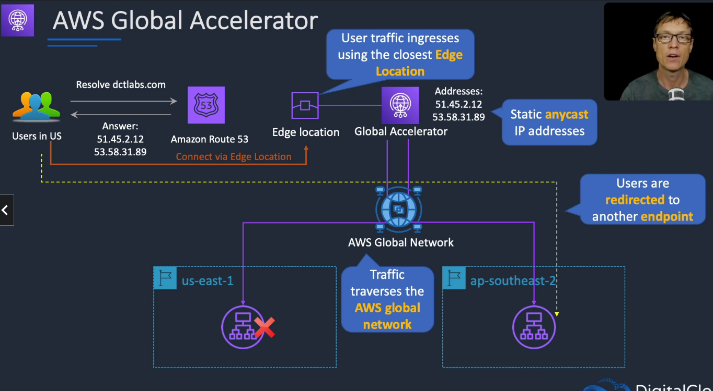

# Amazon Global Accelerator

## General Info
* use AWS network instead of the internet as much as possible
* better bandwidth
* less latency
* more consistency
* all about optimizing network performance to our application 
* We go through Route53 which returns the IP address of Global Accelerator instead of the load balancers of our applications
  * returns 2 static IP of the GA we created
* we just need to create one global accelerator for a LB, and it will be used for all
  * we need to add endpoints (the LB) to the global accelerator configuration
* everything is based on health checks so they need to be configured correctly
  * health check at the GA level (interval, threshold count)
  * health check at the LB level (interval, threshold count)

The request goes on the internet but not very far since it is directed to the closest edge location.
All the rest of the traffic goes through AWS global network.

