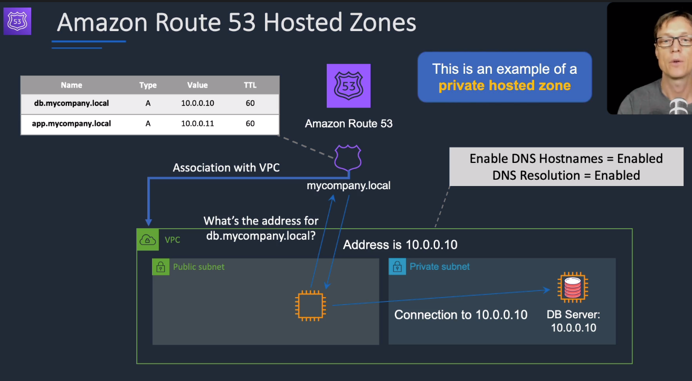
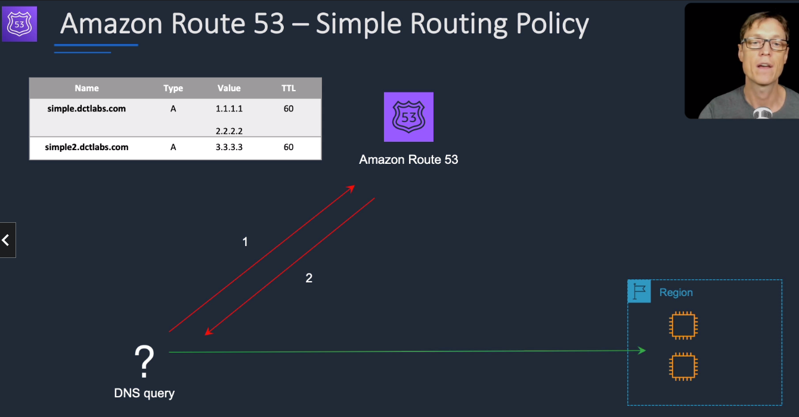
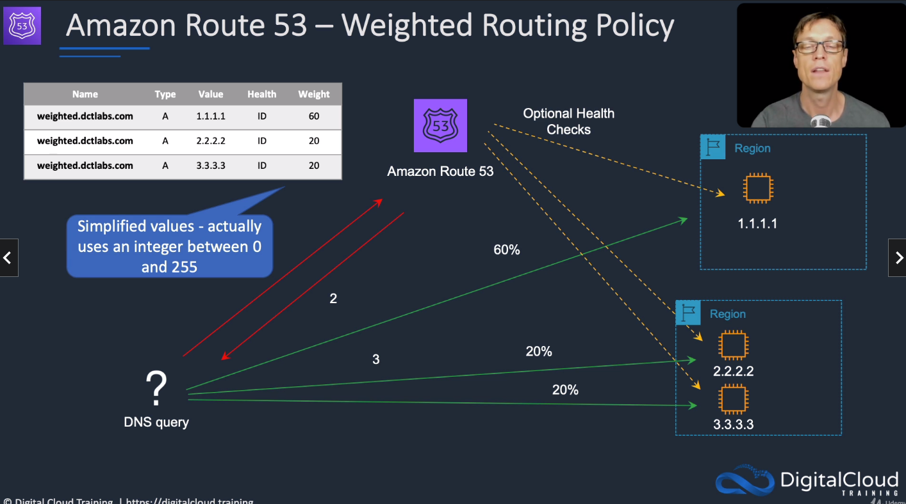
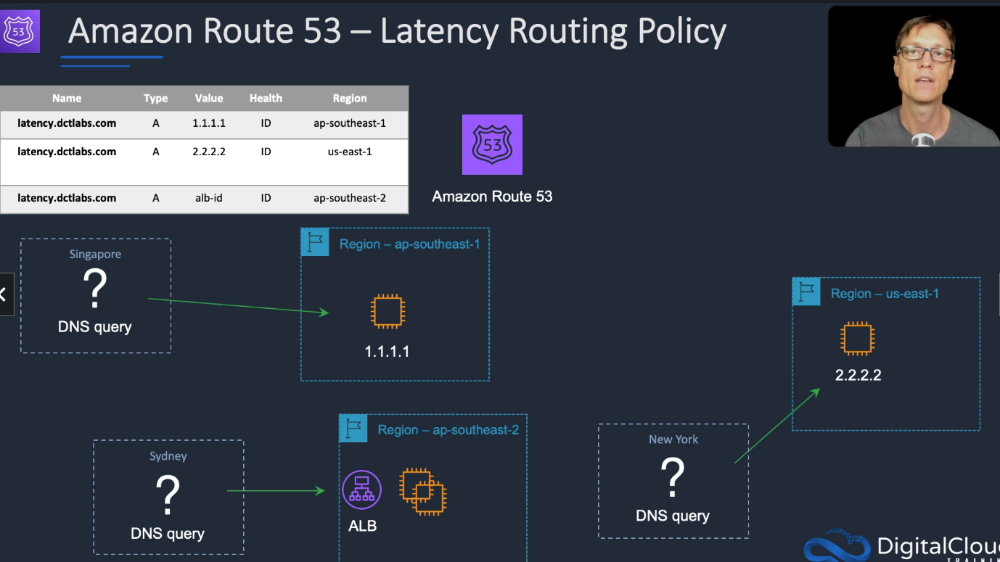
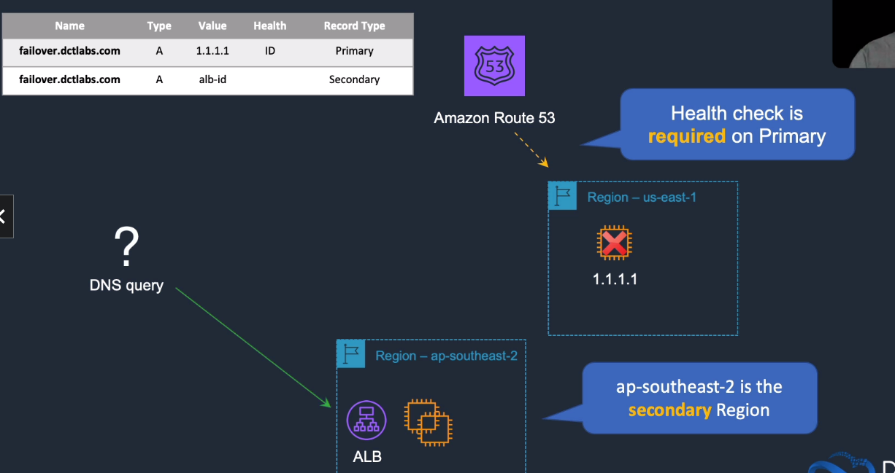
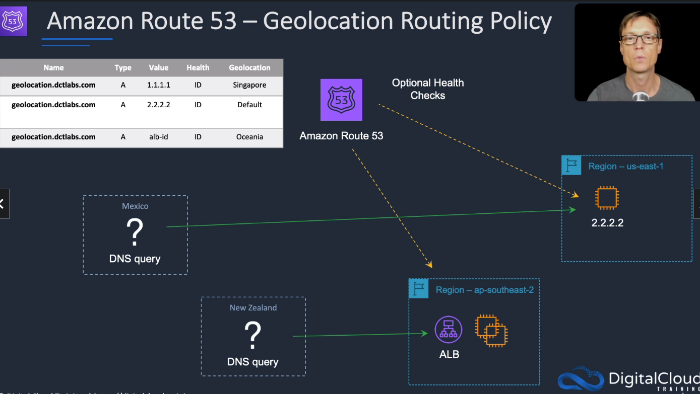
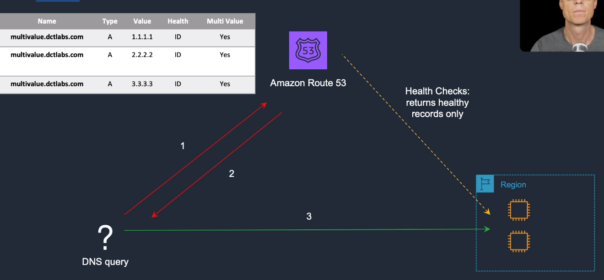
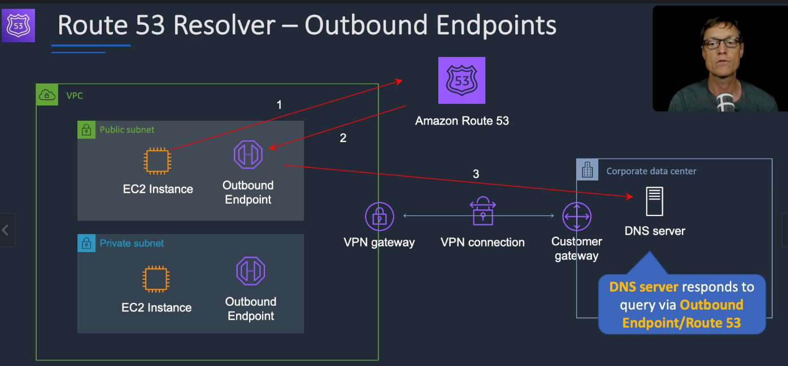
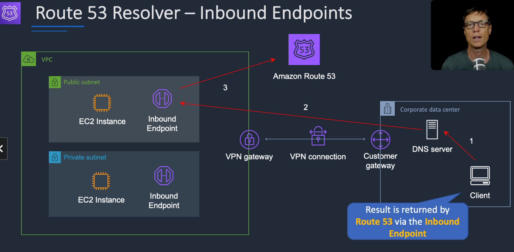

# Amazon Route 53

Route 53 is a global service, not region bound
DNS on port 53, Route66 in the US (famous) -> Route 53

## General Info
Prefer ALIAS (Route 53 specific) to CNAMES (cannot have naked domain names like acloud.guru, needs the www.)
ALIAS records good for Elastic Load Balancing, CloudFront distributions, Beanstalk env, S3 buckets configured as websites.
ALIAS are **NOT** visible to resolvers => resolvers only see the A record and the resulting IP address of the target record

Route 53 is scalable and highly available and currently supports 13 different DNS record types like AAAA, CNAME, SPF, ... but does not support DNSSEC (other than during domain registration).

Route 53 is highly available and scalable DNS web service -> great to use with ELB to improve High Availability and redundancy

When creating a hosted zone, we received four Route 53 name servers (virtual) across four different TLD (high availability) => delegation set. Domain is a general DNS concept, Hosted Zone is an Amazon Route 53 concept.
We can have any prefix we want for the hosted zone but the suffix always stays the same (amazon.com = aws.amazon.com =/= amazon.ca)
It is possible to create multiple hosted zones for the same domain name (test, production environment for instance)

Possible to import a zone config from other DNS providers.

Route 53 does not support website hosting but we can use S3, EC2 for web hosting.

Changes to resource record sets are transactional (ChangeResourceRecordSets API -> INSYNC is all good)

IPv6 supported (AAAA, PTR)

Top Level Domains (.com, .net, ...), country-code Top Level Domains (.be, .fr). 1 year contract usually, auto renewal, can be longer. Can move domains from other registrars.
It is required to provide personal info like email, adresse, name, ... Business must provide public info, personal user can ask Route 53 to hide this info and use forward info managed by AWS instead.

WHOIS is a publicly available database for domain names (contact info, name servers)

It is possible to transfer existing domain to Route 53 without disrupting existing web traffic. Need zone file from domain name to set things up in Route 53.

Migration
* can migrate to/from route53
* can migrate a hosted zone to another AWS account
* can migrate route53 to another registrar
* can associate a route53 hosted zone with a VPC in another account
  * need to authorize association with VPC in the second account
  * create an association in the second account

Route53 has default limit to 5 requests per seconds per AWS account for API calls (throttling)

Health checks are not checking database. We can create custom health check that connects to the RDS DB endpoints. Set the value of Evaluate Target Health to Yes on the latency alias resources.
=> move traffic from one DB to another if one fails

## DNS intro

domain name server: map domain name to ipv4/ipv6
ipv4 is 32bit field with 4 billions possible addressesorganization
ipv6 is 128bit field with 340 undecillion addresses (3.4 x 10^38)

**Top Level Domains**: .com, .edu, .gov, .co.uk, .gov.uk, .com.au (last word is top level domain name, second last is second level domain name)
=> controlled by the Internet Assigned Numbers Authority (IANA) in a root zone db available at http://www.iana.org/domains/root/db (company can registered top level domain names)

**Domain registrars**: domain name must be unique, a registrar is an authority that can assign domain names directly under one or more top level domains. The domains are registered with InterNIC (ICANN service) which enforces uniqueness. Each domain name is registered in the WhoIS database

All DNS have a **start of autorhity record (SOA)** whic stores information about:

- name of the server that supplied the data for the zone
- the administrator of the zone
- current version of the data fileorganization
- default number of seconds for the time-to-live file on resource records (we want it as low as possible for changes to propagate quicker)

**NS records**: Name server records, used by top level domain servers to direct traffic to the Content DNS server which contains the authoritative DNS records
**If we want blabla.com, we will ask our ISP DNS for the IP. If it doesn't have cached, it will ask for it in the .com TLD (NS lookup) with a result that looks like this if it is registered "blabla.com. 172800 IN NS ns.awsdns.com" (domain name, time to live, NS records). The ISP will then contact ns.awsdns.com (the NS records) to get info on blabla.com which will be a start of authority record with all the information needed.**

**A records**: "Address record" = fundamental type of DNS record, used by a computer to translate the name of the domain to an IP address

**TTL**: length that a DNS record is cached on either the resolving server or the users own local PC (Time to live in seconds). Lower = faster propagation. No default, we must specify it.

**CNAMES**: canonical name can be used to resolve one domain name to another. For example mobile.blabla.com and m.blabla.com would be the same

**Alias records**: (unique to Route 53) used to map resource record sets in hosted zone to elastic load balancers, cloud front distributions or S3 buckets that are configured as websites. Alias records work like a CNAME record (can map one DNS name to another target DNS name). Key difference: a CNAME cannot be used for naked domain names (zone apex record like example.com, it needs to be for www.example.com), we can't have a CNAME for http://acloud.guru, it must either be either an A record or an Alias.

### Things to know related to AWS (exam tips)

- ELB do not have pre-defined IPv4 addresses, we resolve them using a DNS name
- CNAME (cannot point to naked domain name) is different than ALIAS (only route 53, can point to naked domain name) => given the choice, always use an alias
- Start of Authority record: info stored in a DNS zone about that zone
- DNS zone is part of a domain for which an individual DNS server is responsible (A records, CNAMES etc). Each zone contains a single SOA record
- Alias records: save time because Route 53 automatically recognizes changes in the record sets that the alias resource record set refers to. If the IP of the ELB changes, it is automatically reflected in the DNS answers from Route 53 (no change to hosted zone that contains resource record sets for example.com)
- common DNS types: SOA records, NS records, A records, CNAMES, MX records (mail server record), PTR records (reverse lookup)

## Hosted zones
Represents a set of records belonging to a domain

We can have a public hosted zones (example.com) or a private hosted zones (mycompany.local). A private hosted zone is 
associated to a VPC (make sure that DNS hostnames and DNS resolution are enabled).

An application cannot resolve record sets created in a private hosted zone of another AWS account. We need to:
* associate the Route53 private hosted zones in account A with the vpc in account B
* need to create the association in account A where the private zone is hosted
* need to authorize the association in account B
* delete the association authorization after the association is created

## Routing policies
Routine policies available on AWS (only one active per domain name)

**never use public IP in production, always Elastic IP**

### Simple routing
* one A record with multiple IP addresses -> random pick, no healthcheck
* if we specify multiple values in a record, Route53 returns all values to the user in random order

### Weighted routing
- 20% this address, 20% this other address, 60% the last address -> always a numerical value. 
- one A record per weight
- optional health checks
- We can reach a number higher than 100 like setup routing policy to be 50 and 150 but in this case, it becomes 25% (50/200) and 75% (150/200). 
- Used for A/B testing, blue/green scenario
- Weights can be any number between 0 and 255

### Latency-based routing
- (performance) the IP address with the lowest latency for the user is picked
- optional health checks
- To maximize availability, create Route 53 latency based routing record set that resolves to Elastic Load Balancers in each region and has them evaluate target health flag set to "true". 
- To boost content delivery, CloudFront can be used.

### Fail-over routing
- need health checks
  - can be endpoints http://elastic-ip/index.html
  - status of other health checks (calculated health checks)
  - state of cloudwatch alarm
- primary/secondary mechanism, if primary fails healthchecks, Route 53 auto failover to secondary one. 
- When the primary is healthy again, traffic is sent towards it.

Configure a health check
- Request interval: standard (30 seconds), can be decreased
- Failure threshold: 3 failures allowed, can be changed (1-10)
- other options that can be customized
- HTTP, HTTPS (no validation on the certificate, supports Server Name Indication), TCP

* DNS failover supports ELB as endpoints (alias record + "Evaluate Target health" flag)
* Can have a static site in S3 as a failover, can have an IP outside of AWS as failover
* Can associate any record type supported by Route 53 except SOA and NS.
* Route 53 does not make routing decisions based on the load or available traffic capacity of other endpoints.
* HTTP 3xx is considered successful and does not follow the redirect
* Recommended TTL is 60 seconds or less for a good failover
* Failover needs at least one healthy endpoints, if none are, Route 53 will behave as if all health checks are passing
* Can use String Matching option to check if the HTML served contains a certain string
* It is possible to configure failover based on any metric in CloudWatch (alarm state = unhealthy)
* Healthchecks with domain name is IPv4, can be IPv6 if we use addresses and not domain

### Geolocation routing
- (compliance) EU customers are redirected to EU region (euro price, languages, ...)
- Route traffic based on geographic location of the users (location from which DNS queries originate)
- different than latency
- optional health checks
- US customers are redirected to US region => different than latency. 
- 3 levels of granularity (Recommended to configure a global record in case the granularity doesn't match)
  - continent
  - country
  - state

Mexico goes to Default in that example.

### Geoproximity
routes to closest region within a geographic area

### Multivalue Answer Routing
- Route 53 replies with up to 8 healthy IP addresses and the client user can choose from this list
- need health checks, return only healthy records
- multiple A records
- used to spread the load
- not a single one like simple routing
  

## Domain name in Route 53

Registering a domain name can take up to 3 days to process a request.
Once it is processed, we can create record sets.

By default, the domain name in Route 53 have several NS records pointing to different AWS DNS in different top level domain in case of outage + one SOA record

## Blue/Green deployment

technique for releasing application by shifting traffic between two identical environment running different version of the application. Great for risk mitigation, if we want to avoid downtime, very convenient if we need to rollback

blue = current application version with production traffic, green is the new one being tested and when okay, the traffic is moved to the green one. Easy to do in the cloud compared to in-premises. More costly to do since we duplicate our environment for a short period of time

We can use this pattern with Route 53 if we can express the endpoint into the environment as a DNS name or IP address.

Example environments:

* single instances with a public or Elastic IP address
* Groups of instances behind an ELB
* instances in an ASG in front of an ELB
* services running on ECS
* beanstalk environment web tiers

**Route 53 manages the DNS hosted zone, we can shift traffic all at once or a weighted distribution . Rollback is done easily as well, just need to switch the DNS record. Using ALIAS is great for that. When we use weighted routing to use a really small portion of the traffic to validate our new application (green), it is called canary testing. Once validated, we increase the traffic to the green environment.**

## DNS record types

* A: address record
* AAAA: IPv6 address record
* CNAME: canonical name record
* CAA: certification authority authorization
* MX: mail exchange record
* NAPTR: name authority pointer record
* NS: name server record
* PTR: pointer record
* SOA: start of authority record
* SPF: sender policy framework
* SRV: service locator
* TXT: text record

+ Alias record (internal to AWS), can be mapped to subdomains, ELB (ELB has no public IP), CloudFront, S3, Beanstalk, API Gateway, VPC endpoint, ...

wildcard supported for all except NS records

multiple IP can be associated to a single record

## Route 53 Traffic flow

global traffic management service to route users based on constraints like latency, endpoint health, load, geoproximity and geography

Traffic policy (free) = set of rules, policy record (charged) = association of traffic policy to DNS in hosted zone Route 53. Traffic Policy can be reused multiple times with other policy records.
Possible to create an Alias record pointing to a DNS name that is being managed by a traffic policy. 

Traffic flow supports all Route 53 DNS routing policies + geoproximity based routing.

## Private DNS
DNS within our VPC without exposing DNS records (name, IP) to the internet. Cannot exist without VPC, can have multiple VPC with a single hosted zone.
Can associate VPC belonging to different accounts with a single hosted zone

Route 53 can handle private IP addresses with private hosted zone. We just need internet for the Route 53 API endpoint, the rest can be handled without internet.

Can have failover setup only if health checks can point to public endpoints, not private.

Possible to block domains and specific DNS names by creating these names in one or more Private DNS hosted zones and pointing these names to our own server

## Route 53 resolver
* regional DNS service that provides recursive DNS lookups for names hosted in EC2 as well as public names on the internet
* Available by default in every VPC
* Recursive DNS is a service that forward query to authoritative DNS (contains the final answer to a DNS query)
* Route53 resolver helps work with on prem DNS and Route53 DNS

Conditional forwarding rules: forward queries for specified domains to the target IP address of our choice (on-premises DNS resolver).
Rules applied at VPC level.

DNS enpoints: one or more ENI that attach to our VPC. The ip address can then serve as a forwarding target for on-premises DNS servers to forward queries.

Resolver is integrated with AWS Resource Access Manager -> share rules with other accounts

This setup ensures that both our EC2 instances and Client can get the info they need from either Route53 or the on prem DNS server

## Logs

Query Logging: possible to enable log information (timestamp, domain name, query type, location, ...) -> sent to CloudWatch logs

CloudTrail supports Route 53. Do not use CloudTrail for rollback changes as they may be incomplete

## Limits

500 hosted zones and 10k resources record sets per hosted zone

## Billing

monthly charge for each hosted zone + initial fee for the creation

charged for every DNS query except for Alias records mapped to AWS resources

domain name (yearly)

health checks 

per policy record in Traffic Flow
