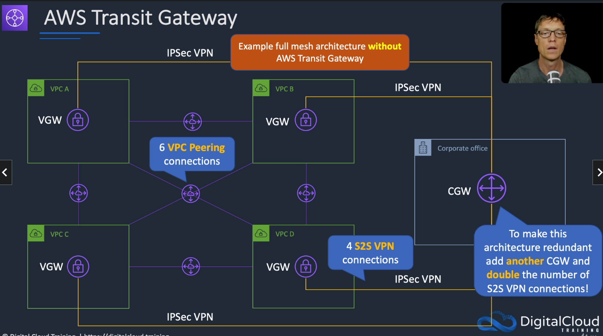
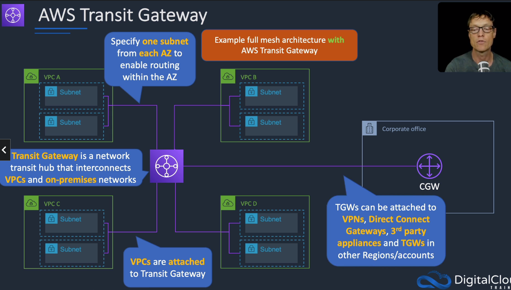
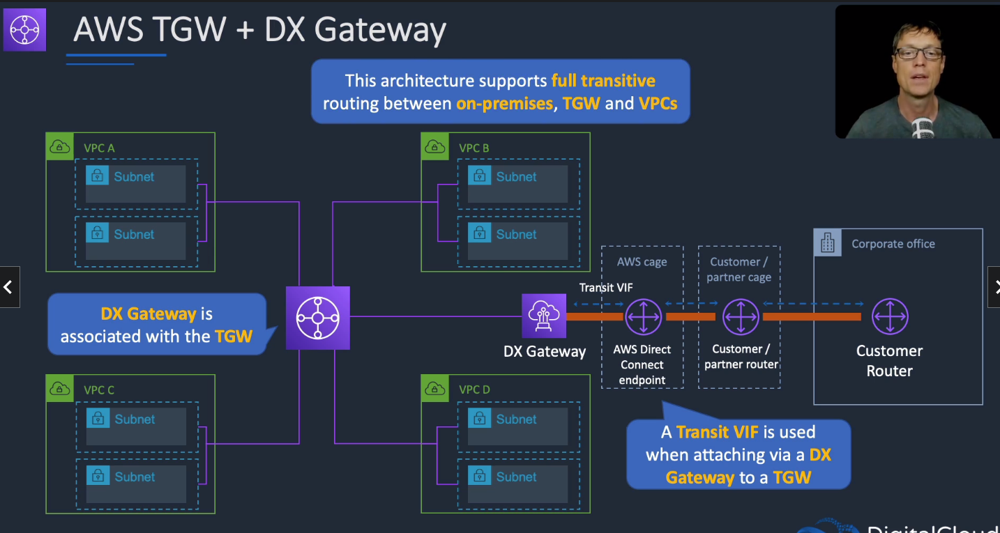

# AWS Transit Gateway

## General info

* Cloud router
* enable users to connect VPC to on-prem networks to a single gateway. 
* Easier to scale networks across multiple accounts and VPC
* VPC can be connected with peering but the connection handling is cumbersome
* with Transit Gateway, we only have to create and manage a single connection from the central gateway into each VPC, on prem data center or remote office across the network.
* Transit Gateway acts as a hub that controls how traffic is routed among all the connected networks which act like spokes.

=> each network only has to connect to the Transit Gateway and not to every other network

Transit gateway can be attached to 
* VPN
* DX gateways
* 3rd party appliances
* TGW in other regions/accounts

If we need highly available and horizontally scalable, we need to:
* attach VPC to a shared transit gateway
* use an egress VPC with firewall appliances in two AZs
* connect the transit gateway using IPSec VPNs with BGP

=> only solution that provides the ability to horizontally scale the outbound internet traffic (BGP equal cost multipathing ECMP)

### DX Gateway and TGW
We can associate a DX gateway with a TGW using a Transit Virtual Interface (Transit VIF).

