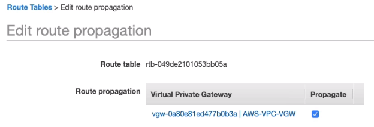

# Amazon VPC

## General Info

VPC (Virtual Private Cloud) = easy to customize virtual data center in the cloud, logically isolated section of AWS cloud where we can launch AWS resources in a virtual network that we define. We have complete control over the virtual networking environment including selection of IP address range, creation of subnets and configuration of route tables and network gateways.
Can create public (internet access) and private subnet (no internet access), can leverage multiple layers of security (security groups, network access control lists)
**Every AWS Region has a default VPC**

We can create a Hardware Virtual Private Network (VPN) connection between our corporate datacenter and AWS VPC and leverage AWS cloud as an extension of our corporate datacenter.

In this VPC, we have a VPC (acloudguru) in a region (US-EAST-1). In the VPC? 2 subnets (one private and one public). 

Two ways to connect to the VPC:

- Internet gateway: provides internet access
- Virtual private gateway: provide VPN access

**The security groups protect the instances, they are stateful (if we open a port inbound, it is also open outbound). We can go into the private subnet through the public subnet (bastion host).**
**Network Access Control Lists are stateless**

Route table = which subnets are allowed to speak with other subnets

**one subnet = one availability zone**
**availability zone name are different for everybody, for example, us-east-1a can be different between 2 AWS accounts**
**we can only have one internet gateway per VPC, internet gateway are highly available and managed by Amazon (span multiple AZ)**
**we can assign a custom IP addresses ranges in each subnet**
**better security, can use network ACLs to block certain IP addresses**
**security groups can span AZ (can have one span multiple AZ) => security groups can span multiple subnets**

- one subnet = one AZ
- create public subnet with internet, default should be private
- need to create internet gateways **(create a route with a destination of 0.0.0.0/0 and the target of the internet gateway ID (igw-xxx))**, NAT gateways and so on
- default security group, network ACL created
- requirements to have internet: public IP address (or EIP => **can be added afterwards**), internet gateway with an associated route table and a security group allowing HTTP traffic
- IPv6 data can only be used with Egress-Only Internet Gateway and Internet Gateway. NAT (instances & gateway) explicitly do not support IPv6 traffic.
- can optionally specify primary private IP address for an instance if we have a custom VPC, if not done, AWS automatically assign one from the range of the VPC.
- We can assign secondary private IP addresses when we launch the instance, when we create an Elastic Network Interface or any time after the instance has been launched or the interface has been created.
- Components to provide connectivity with external networks: Internet Gateway, Virtual Private Gateway (VPC VPN), NAT Instance
- by default, all subnets can route between each other whether they are private or public
- can have only a private subnet if VPN connection setup (no need to have internet gateway ?)

Once created, a VPC size cannot be changed
VPC-VPN: set route table and security group of the public subnet which receives traffic from a virtual private gateway

## Route table

set of rules called routes that are used to determine where network traffic is directed
each subnet must be associated with a route table (route table controls the routing for the subnet)
a subnet can only be associated with one route table at a time
can associate multiple subnets with the same route table

## VPC Wizard

Can create a VPC with an AWS tool in the console
For public subnet: AWS create NAT instance with elastic IP
can also create two subnets with route tables, create an internet gateway and attach it to the VPC...
With default setup, main route table is with private subnet and custom route table with public subnet (-> what should be done for custom VPC as well)

## Default VPC vs Custom VPC

default

- user friendly
- all subnets in default VPC have a route out to the internet
- no private subnets in default VPC
- each EC2 instance has both a public and private IP address

custom

- if private subnet, EC2 doesn't have a public IP address

## VPC Peering

VPC can talk to each other with Peering
* connect one VPC to another via direct network route using private IP addresses (ipv4 & ipv6)
* traffic doesn't go on the internet
* instances behave as if they were on the same private network
* can peer VPC with other AWS accounts as well as with other VPCs in the same account
* need to plan good VPC ip range, there cannot be any overlap between VPC
* cidr blocks of VPCs cannot overlap for this to work!
* VPC can be in different accounts and regions!

Peering is in a star configuration: 1 central VPC peers with other VPCs 

**NO TRANSITIVE PEERING => all the discussion go through the central one, the edge VPC cannot talk to each other directly**

**There must be a VPC peering connection between 2 VPC for them to talk together**

The only way we can make VPC B and VPC C talk directly is by peering them.

The usual needs to be configured:
* security groups
* route tables

### Create VPC peering
We need to know for the 2 VPCs:
* the account ID
* the region of the VPCs
* the VPC IDs
* launch EC2
* configure security groups
* configure route table

=> the owner of the other VPC must accept the connection

## IP addresses / CIDR block
10.0.0.0 - 10.255.255.255 (10/8 prefix)
172.16.0.0 - 172.31.255.255 (172.16/12 prefix)
192.168.0.0 - 192.168.255.255 (192.168/16 prefix)

The prefix gives the highest address range
/8 -> big address range
/12 -> medium
/16 -> small

**Amazon allows biggest range with /16 and smallest range with /28**

**we can have a maximum of 65536 IP for a same VPC with /16**

**we can have a minimum of 16 IP for a same VPC with /28**

**soft limit of 5 VPC per region (can increase by calling Amazon)**

### Tools
http://cidr.xyz/ is a website to visualize IP address and CIDR

https://network00.com/ -> to plan network organization

### Reserved address
* ends with 0 -> can never be associated to a host, it is the network
* ends with 255 -> broadcast all IP addresses

**Amazon reserves 4 IP addresses (the first 4) and the broadcast (.255) so we have to subtract 5 from all the available 
IP addresses in the CIDR block to have the real number of IP available in the VPC**

### Netmask
**IP addresses contain 4 octets of 8 bits giving values between 0 and 255. 
The value after the slash is the number of bits consistent of the routing prefix (translated into a netmask). 
A netmask designates how many available addresses are in the block.**

192.168.0.1/32 -> netmask 255.255.255.255
we can only have one address: 192.168.0.1

192.168.0.1/24 -> netmask 255.255.255.0
we can only have 256 addresses: 192.168.0.1 -> 192.168.0.254

192.168.0.1/16 -> netmask 255.255.0.0
65536 addresses: 192.168.0.1 -> 192.168.255.254

192.168.0.1/8 -> netmask 255.0.0.0
16,777,216 addresses: 192.168.0.1 -> 192.255.255.254

**Note that it doesn't matter if we have 10.0.0.1 or 192.168.0.1 as we will have the same number of IP available for a same CIDR block**
10.0.0.1/8 -> netmask 255.0.0.0
16,777,216 addresses: 10.0.0.1 -> 10.255.255.254

How to calculate the number of IP available for a CIDR block:
**Remember that /24 is 256 IP available, /25 is half that with 128 an so on.**
/16 is 65536 (max), /28 is 16 (min) => for AWS VPC

We can have variable length subnets masks (VLSM).

### Subnets
max size subnet for VPC /16 (65531)
min size subnet for VPC /28 (11 ip available)
Amazon reserve 5 addresses (first 4 and last one)
/24 = 256, /25 = 128 and so on => need to substract 5 to have the real number of IP available

**CIDR block can be broken into multiple subnets**. For example 20.0.0.0/25 (20.0.0.0 - 20.0.0.127) and 20.0.0.128/25 (20.0.0.128 - 20.0.0.255) 

A subnet can have the same CIDR than the VPC -> afterwards impossible to create another CIDR since all the IP are reserved (CIDR overlaps if we try)

### Rules and guidelines
* CIDR block size can be between /16 and /28 (AWS rules)
* CIDR block must not overlap with any existing CIDR block that's associated with the VPC
* cannot increase/decrease the size of an existing CIDR block
* first four and last IP address are not available for use
* AWS recommend we use CIDR blocks from the RFC 1918 ranges
  * 10.0.0.0 - 10.255.255.255 (10/8 prefix) -> VPC must be /16 or smaller (10.0.0.0/16)
  * 172.16.0.0 - 172.31.255.255 (172.16/12 prefix) -> VPC must be /16 or smaller (172.31.0.0/16)
  * 192.168.0.0 - 192.168.255.255 (192.168/16 prefix) -> VPC can be smaller (192.168.0.0/20)

## VPC creation
We can either use the wizard or create everything manually.

1. VPC
   The VPC creation requires an IPv4 CIDR block: 10.0.0.0/16 gives the max number of IP range
   We can choose to have IPv6 (Amazon provided IPv6 CIDR block) or not 
   Select tenancy (default = shared) or dedicated (not shared with other tenants)

When clicking create
* **no other subnets, internet gateways was created automatically for us**
* **one route table, one security group and one network ACL (subnet level firewall) have been created automatically**

2. Subnets
   Custom VPC **must** be selected
   An availability zone **must** be selected
   IPv4 CIDR block **must** be specified: 10.0.1.0/24 (must be smaller than the VPC one)
   IPv6 CIDR block **can** be specified

* one subnet = 1 availability zone
* automatically associated to the route table of the VPC
* each subnet can only be associated with one route table
* there is only 251 available IP addresses for this new subnet -> the first four IP addresses and the last IP address in each subnet CIDR block are reserved for Amazon, Amazon does not support broadcast (255) so they reserve that address as well
* by default, the created subnets are private, no auto assign public IP

3. Internet gateway
   Create a new one, **by default it is detached**
   **we cannot attach more than one internet gateway to a VPC**

4.Configure route table
   One is automatically created for us with a default rules that our subnets are allowed to talk to each other.
   **every time we create a new subnet, it is going to be associated to the main route table => 
   this is why we don't want our main route table to have internet access because each time we create a new subnet, 
   it will be available from the internet**

To fix that, we need to create a new route table. 
**Once it is created, we add a route 0.0.0.0/0 and::/0 to the internet gateway. 
=> each subnet in this route table will have internet**. Remember that /24 is 256 IP available, /25 is half that with 128 an so on.

Once the route table is configured, we need to do some "Subnet associations".
We associate one subnet to the public route table with internet gateway. (10.0.1.0)
We associate the other subnet to the private route table without internet gateway. (10.0.2.0)

5. Configure Auto IP address
   In the created subnet, there is no IPv4 assigned by default. We need to change that so that the instances in our public subnet have an IPv4 assigned to them by default.
   Need to go to subnet and edit that.
6. Test VPC
   Now we can test the VPC by launching 2 EC2 instances, one in each subnet.
   When creating instances, we need to create a security group because **security groups do not span VPC**. We need to create our security groups in each VPC.
   Connect to the instance in the public subnet.
   **we cannot ping the other instance in the private subnet because haven't allowed them to talk to each other (different security group and different subnet)**
   **need to have a security group with ICMP to be able to ping**
7. Create security group for the private instance
   Allow SSH, HTTP, HTTPS, ICMP, other ports like 3306 for MySQL if needed
   We just set our custom IP ranges to 10.0.1.0/24 which is the public subnet that should be able to access our private subnet.

Attach the new security group to the private instance in the private subnet.
Now we can ping it from the public instance.

8. Delete VPC
   Deleting the VPC will also delete all the route tables, subnets, ... that were created and attached to it.
   We can also delete them manually before but they are some dependencies so there is an order to follow.

### DNS, DHCP
We can enable **DNS hostname** for a VPC. That will create a DNS hostname for our instance that can be reached from the internet instead of IP address.

We can enable **DNS resolution** for a VPC (enabled by default).

DHCP (dynamic host configuration protocol) Options set. There is one by default in the VPC but we can create our own and specify
* domain name
* domain name servers if we don't want to use the Amazon provided one
* NTP servers
* NetBIOS name servers
* NetBIOS node type

## VPC Routing
* main route table is created by default when creating a VPC, associated to all subnets of the VPC
  * main route table is implicitly associated with subnets that haven't been explicitly associated with a route table
  * we can create a private route table
* internet gateway need to be attached as well for inbound/outbound traffic

### Route tables
* we can have public and private route tables
* to allow instances in private subnet to access internet
  * we need an entry in the private route table 0.0.0.0/0 to the NAT gateway ID (in the public subnet)
  * the internet gateway of the VPC must also be found in the main route table 0.0.0.0/0

In networking, we try to first match traffic with the most accurate destination. For example,
if we have 10.0.0.0/16 (local) and 0.0.0.0/0 nat gateway ID in our private route table; and we try to reach an instance
in 10.0.. network, the traffic will go there. If there is no match, we go through the most "open" one which is 0.0.0.0/0
and thus the NAT gateway in the public route table.

=> chosen 10.0.0.10/32 before 10.0.0.0/16 before 0.0.0.0/0 (longest prefix wins)

### Multi VPC routing
We cannot peer VPC that have overlapping CIDR blocks. How do we use the route table then?

If we had in the route table the following config, we could not know where to route traffic since they would both have the same "length"
* 172.16.0.0/16 vpc-peer-1
* 172.16.0.0/16 vpc-peer-2

To solve that, we target specific IP (/32) in vpc-peer-2. This way, we know when to route traffic there by specific targeting.
All other traffic is routed through the VPC peering 1 connection.

### Static routes and propagated routes
In a route table, static routes are preferred over propagated routes. Propagated routes are automatically added by BGP (Border gateway protocol).
BGP is used when we have a VPN connection between AWS and an external data center on premise.
* BGP: border gateway protocol
* VGW: virtual gateway protocol
* CGW: hardware or software application on the customer's side of the VPN tunnel

### Gateway route table
We want all traffic to/from the internet to go through a security appliance. 
We need to use 0.0.0.0/0 pointing to the elastic network interface of the security appliance.

To do that, we need to add a gateway route table to the internet gateway or the virtual gateway.

## Direct connect gateway

direct line from outside AWS to a _private virtual interface_ in AWS => secure, reliable, low latency
No need to have a direct line to all regions, we can just link the _private virtual interface_ to the _direct connect gateway_ of AWS. We just need to update the route table to allow the _direct connect gateway_ to connect.
Uses the **Border Gateway Protocol (BGP)**: sharing routing information from the router in customer Data Center to AWS and vice versa.

## NAT instance & NAT gateways

These two features provides internet access to EC2 instances in a private subnet while still making the EC2 instances hidden from the internet.

### Create NAT instances

NAT instances can be found in the Community AMIs when we start an EC2 instance (amzn-ami-vpc-nat-hvm ...)
**The NAT instance needs to be launched in the public subnet because it needs internet.**
**When the NAT instance is started, we need to disable source/destination checks in the networking setup of the EC2 instance. EC2 instance checks that info by default and reject traffic if it is not the case BUT a NAT instance must be able to send and receive traffic when the source or destination is not itself.**
Once the NAT instance is started, we need to update the VPC route table of the **private** subnet to add the NAT instance for IP 0.0.0.0/0. Now all the EC2 instances in the private subnet can have internet access but we cannot use internet to get inside them.
**By default, it is a single instance in a single AZ => no fault tolerance, no good network throughput if we have multiple EC2 instances using it. We can put NAT instance in auto scaling group in multiple AZ to help fix that but the best way is to use NAT gateways.**

NAT instances

- not highly available, need to have one in multiple AZ and have a script manage the failover
- uses special AMI with the string "amzn-ami-vpc-nat"
- bandwidth limited by the instance type, **if bottleneck -> increase instance size**
- managed by customer
- can be used as a bastion server
- behind a security group
- **need to disable source/destination check on the instance otherwise we cannot do NAT forwarding**
- need to also add the route to the NAT instance to the private route table

### Create NAT gateways

In VPC, NAT Gateways (IPv4) or Egress Only Internet Gateways IPv6
Create NAT Gateways in the public subnet of the VPC.
**an elastic IP address must be created for the NAT gateways, this cannot be auto assigned, EIP is not free and must be removed when not used or we have to pay.**
Creating a NAT gateways takes a few minutes to be available..
**Once it is available, we need to go to route tables to allow 0.0.0.0/0 in the private subnet to go through the NAT gateway.**
Now the EC2 instances in the private subnets have internet access.

**Nate gateway ID must be specified in the private subnet route table**

NAT gateways are

- highly available but **it is needed to have NAT gateways in multiple AZ, the failover is automatic**
- bursts up to 10Gbps bandwidth
- managed by AWS (no need to patch or anything)
- price depends on the number of NAT gateways, the usage, ...
- cannot be used as a bastion server
- no security group
- need an elastic IP address
- no need to disable source/destination checks on a NAT gateway (this is not an EC2 instance managed by us)
- far more secure than NAT instance (no SSH access)
- can be assigned an elastic IP; great if we need multiple EC2 instances in a private subnet to access a restricted HTTPS REST endpoint => whitelist the NAT gateway Elastic IP and all the EC2 instances can access it

### Which one to choose
NAT instances are legacy and are replaced by NAT gateways

Note that elastic IP are free if they are used but cost money if they are not allocated.

NAT instance
- disable source/destination check on the instance
- always in a public subnet
- must be a route out of the private subnet to the NAT instance
- the amount of traffic is limited by the instance size. **If bottleneck, increase instance size**
- can create HA using autoscaling groups, multiple subnets in different AZs and a script to automate failover
- need Elastic IP
- behind a security groups

NAT gateways

- preferred
- always in a public subnet
- scale auto up to 10Gbps
- managed by AWS (no need to patch)
- not associated with security groups
- cannot be used as a jump host so we need to create one, not like NAT instance
- we have to assign a public ip address at creation time
- need to update the public and private route tables once it is available
- no need to disable source/destination checks (it is not even an EC2 instance that we can access)
- more securei than NAT instance

Best security: EC2s in private subnet, no public IP, route outgoing traffic via NAT
If we cannot connect to an EC2 instances even if all seems to be in order (security groups, ...) -> check that a public IP address is assigned.

### Jump host / bastion host
Instance in a public subnet where we connect and then connect to an instance in a private subnet.

## Networking security

### Stateful vs stateless firewalls
* security groups are stateful
* NACLs are stateless

A stateful firewall allows the return traffic automatically. A stateless firewall checks for an allow rule for both connections (input and output).

In reality, since the port of the client (65188) is dynamically attributed to the connections, we have a rule that says "any" instead of a specific port.
We do need to specify port 80 though since we don't want a client to connect to any port on the server.

### Security groups

**security groups apply at the instance level in a subnet. Security groups can be applied to instances in any subnet**

* Stateful: add rule is automatic for inbound and outbound
* Evaluated after network ACLs
* Security groups cannot be used to block certain IP addresses -> need to use Network ACL => only allow rules, no deny
* Security groups are **stateful**. When we open a port for input traffic (ingress), for example 3306 for MySQL, 1433 for SQL Server, it is also automatically opened for output traffic (egress).
**In case of connectivity problem between services, it is necessary to check the security groups first!**

It is important to understant the impact of 0.0.0.0/0. 
Anybody from a private subnet can use that to connect to a particular instance. 
Even if an instance is behind a bastion host that restricts access from the internet, 
it is possible that all instances in private subnets that use a security group with 0.0.0.0/0 to connect to the instance 
targeted by the bastion host.

protect AWS resources in a subnet

For instances of the same subnet to be able to communicate with each other -> configure security group as the source and allow traffic on all the protocol and ports

By default when created, all outbound traffic is allowed, all inbound traffic is blocked

There is an implicit deny all at the end so by default, a SG will look for a rule that would allow the connection. If not found, it is blocked.

#### Best practices

Public ALB -> Web Front end -> internal ALB -> application layer => restrict source and destination between them

We want to use security groups as preferred way to handle security. We use NACL to specifically block malicious IP that we detected.

### Network ACLs

**NACLs apply at the subnet level and only to traffic entering/exiting the subnet**
**Stateless so we need to open inbound AND outbound. With NACL, we have an explicity DENY.**
**a network ACL can be associated with multiple subnets but a subnet can only be associated with only one network ACL at a time, when we associate a network ACL to a subnet, the previous association is removed**

**the default Network ACL created with the VPC allows all inbound and outbound traffic. If we create one ourselves, the network ACL doesn't allow any traffic**
**Network ACL cannot span VPC so they must be created in each VPC**
**Network ACL blocks everything by default, we need to manually open what we want**

**A subnet must be linked with a network ACL (default is used)**

rules are evaluated in numerical order:

- allow everything port 80 (100), block own IP port 80 (101) -> no access problem
- block own IP port 80 (99), allow everything port 80 (100) -> access problem
  **=> we should block specific stuff, allow specific stuff then block the rest (with *)**

**changes in network ACLs are reflected immediately**
**network ACLs rules are evaluated before security groups**
**each rule can either allow or deny traffic**

In our custom created Network ACL

1. add inbound rules (start at 100 for ipv4 and 101 for ipv6 and increment by 100 for all new rules): 100 - HTTP(80) - 0.0.0.0/0 & 200 - HTTP(443) - 0.0.0.0/0 && 300 - SSH (22) - 0.0.0.0/0
2. add outbound rules: 100 - HTTP(80) - 0.0.0.0/0 & 200 - HTTP(443) - 0.0.0.0/0 && 300 - Custom TCP rule - port range 1024 - 65535 (ephemeral port, random port used by the server for outbound TCP/UDP/SCTP traffic, as wide as possible, depend on the OS)
3. association with a subnet (our public subnet)

**do not forget ephemeral ports on outbound rules**

- VPC comes with a default network ACL -> all inbound and outbound are allowed
- can create custom network ACL -> by default, all traffic is blocked until we add rules
- each subnet in the VPC must be associated with a network ACL. If we don't do that explicitely, the default one is used (created automatically)
- can associate a network ACL with multiple subnets but a subnet can only be associated to one network ACL
- when associating a network ACL, any previous one is removed
- contain a numbered list of rules evaluated in order starting with the lowest numbered rule -> starts at 100 for ipv4, starts at 101 for ipv6 and increment by 100
- first block specific traffic then allow otherwise it doesn't work => think like a stupid list of rules that will be checked and the first rule that matches is activated
- network ACLs have separate inbound and outbound rules and each rule can either allow or deny traffic
- network ACLs are stateless, need to manually setup inbound and outbound. Security groups are stateful, open port 80 automatically add inbound/outbound rules
- do not forget to open ephemeral ports in outbound rules (Custom TCP rules)
- **IP addresses can only be blocked with network ACLs and not security groups**

If instance A cannot ping instance B (both in different subnets) -> check NACL on subnet B to allow outbound ICMP, it can also be the security group attached to instance B that does not allow inbound ICMP traffic

if VPC has CIDR 20.0.0.0/16 and the private subnet uses CIDR 20.0.0.0/24 -> need the entry "destination 20.0.0.0/16 and target: local" in the route table to allow the instances in the VPC to communicate with each other

can setup network ACL with rules similar to security groups in order to add an additional layer of security to a VPC

## VPC endpoints

With the NAT gateways, we could send a file to S3 from an EC2 instance (with a valid role) through 
the NAT gateways, but it is possible to not go through it by creating an internal gateway.

We now need to create a VPC endpoint (in VPC console).

We pay endpoints by the traffic, not if they are enabled or not.

### Gateway endpoints
serves as a target for a route in our route table for traffic destined for the service (only DynamoDB and S3)

Select S3 gateway then associate it to our VPC and the main subnet (the private one)

**the endpoint has automatically been added to the route table of our private subnet**

DynamoDB and S3 are gateway (much more resilient because not linked to a single ENI), the rest is interface (relies on a single ENI so not resilient)

**This doesn't use an ENI but an entry in the route table.**

We can have IAM policies applied to these endpoints additional to bucket policies to limit access to endpoint source

### Interface endpoints
elastic network interface that serves as an entry point for traffic destined to the service (all the rest)

create endpoint to allow private instance to use AWS resources without using internet (nat gateway)

Not all services support VPC endpoints: Amazon MQ (only available by using an Internet Gateway)

### Service provider model
One VPC has services that are reachable by consumer VPC using an endpoint

## VPC flow logs

capture information about the IP traffic going to and from network interfaces in our VPC.
Logs are stored in CloudWatch logs and S3.

Can be created at 3 levels:

- VPC: all ENI traffic
- Subnet: all EC2 instances in that subnet
- Network interface level: for a particular EC2 instance

Type of traffic to be logged can be: all, accept, reject
Need to allow flow logs to post to cloudwatch (IAM role must be created)
**A log group in cloudwatch must exist or we need to create one.**

**Logs in cloudwatch can be streamed to AWS Lambda (to react in near real time) or Amazon Elasticsearch service.**

**cannot enable flow logs for VPCs that are peered with our VPC unless the peer VPC is in our account**
**cannot tag a flow log**
**once a flow log is created, we cannot change its configuration**

Not all traffic is monitored:

- Amazon DNS server not logged but custom DNS server logged
- traffic for windows license activation
- traffic to and from 169.254.169.254 for instance metadata
- DHCP traffic
- traffic for the reserved IP address for the default VPC router

## VPC cleanup

1. delete EC2 instances and NAT instances
2. remove internet gateways from route tables
3. delete NAT gateway
4. detach internet gateways from VPC
5. delete internet gateway
6. release elastic IP address used for the gateway
7. delete the VPC endpoint
8. delete VPC (that will delete subnets, route tables, ... attached to it)

**key pairs are stored in the region, not in the VPC so they are not deleted**

## IPv6 / IPv4
* IPv4 is 32 bits long, uses dotted decimal => around 4.3 billion addresses, we have to use NAT as a workaround since we don't have enough
* IPv6 is 128 bits long, uses hexadecimal => can put around 100 IPv6 addresses to every atom on earth

### In a VPC
* AWS assign a /56 IPv6 address range to our VPC
* subnet receives /64 address range (18 million trillion addresses). We can have 256 subnets /64
* all IPv6 addresses are publicly routable (no NAT)

We can have an egress-only internet gateway that allows IPv6 traffic outbound but not inbound to allow private instance
access to internet but not inbound.

**We can only one IPv6 CIDR per VPC**

After creating the IPv6 CIDR in the VPC, we need to update the subnet. They can range from 00 to FF.
We add IPv6 CIDR to all subnets, but we only add auto assign public IPv6 to the public subnets.

Afterwards, we update the public route table to map ::/0 to the internet gateway.

Finally, check security groups associated in the public subnet that they allow outbound traffic ::/0.

**remember that the source can be an IP or another security groups (useful for ping)**

## VPN

### Client VPN endpoint
Access in our AWS region to connect via VPN over SSL/TLS (443) and get access to our subnet via the network interfaces.

The VPN endpoint on AWS becomes the internet gateway on the local computer that has the VPN connection started.

When we create a VPN endpoint in VPC, we have to set up a Client IPv4 CIDR that will be in our VPC network.
We also need to select a server certificate from AWS Certificate Manager. 
When we ask for mutual authentication, we also need to get the client certificate from AWS Certificate Manager.
These certificates are generated using easyrsa tool from OpenVPN. We could also have user-based authentication but this
requires an Active Directory setup.

Once created in a VPC, the VPN endpoint needs to be associated with a subnet.

Finally, we need to create an authorization rule for ingress.

Now that the setup is done, we can download the client configuration from the console VPN endpoint and use that with OpenVPN
to connect to the subnet.

Note that since this setup is done for a particular subnet. We only have access to the resources in this subnet.

### Site-to-Site VPN
We connect a data center or an office building to AWS via VPN.

AWS VPN is a managed IPSec VPN, we create a Virtual Private Gateway (VGW) in a VPC (AWS) and 
a customer gateway on the data center (tool: OpenSwan).

This VPN connection supports static routes or BGP peering/routing.

In our route table, we can have the CIDR block of the data center and make it target the virtual gateway.

This setup can also be used as a backup for direct connect in case of issue.

#### How to set it up
These instructions show how to simulate the site-to-site VPN with OpenSwan as a customer gateway. They may be different
for a real site-to-site VPN; most likely the customer gateway side and configuration.

The virtual private gateway needs to be configured to propagate the routes in the route table.

In this example, if we want to have forward traffic, we need to disable source/destination check (for the OpenSwan instance).

1. Create a Customer Gateways in the VPC console (OpenSwan)
2. Create a Virtual Private Gateways and attach it to the VPC
3. Create a VPN connection between the two in the Site-to-Site VPN connections
   1. choose Virtual Private Gateway or Transit Gateway
   2. choose ID of the VPN gateway ID
   3. choose customer gateway ID (create or select existing)
   4. choose routing options (Dynamic with BGP or static). If static, we need to add two IP prefixes: one for both sides of the connection (AWS and on prem)
   5. choose IPv4 or IPv6
   6. choose local and remote IPv4 network CIDR. They are the prefixes mentioned in point 4
   7. In route table of the VPC, go to route propagation and enable it
   
   
4. Once the site-to-site vpn connection has finished starting. Download configuration (OpenSwan)
5. Execute the setup on the OpenSwan EC2 instance acting as the customer gateway.

#### AWS VPN CloudHub
This is not a service but an architectural pattern when using site-to-site VPN technology.

* Connect multiple customer gateways to a single virtual private gateway
* network traffic can be between AWS and customer office or between 2 customer offices through the VPN hub

AWS VPN CloudHub uses an Amazon VPC virtual private gateway with multiple customer gateways, 
each using unique BGP autonomous system numbers (ASNs). Your gateways advertise the appropriate routes (BGP prefixes) 
over their VPN connections. These routing advertisements are received and re-advertised to each BGP peer so that each 
site can send data to and receive data from the other sites. The remote network prefixes for each spoke must have unique 
ASNs, and the sites must not have overlapping IP ranges.
