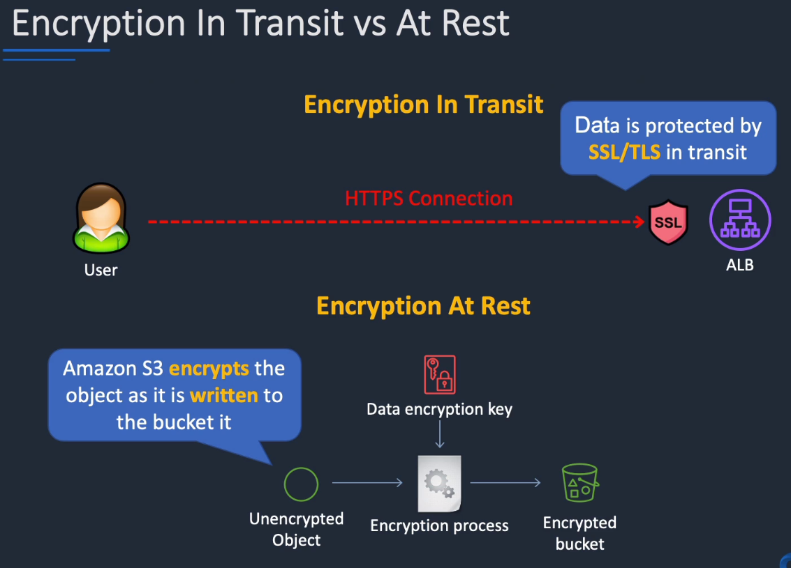
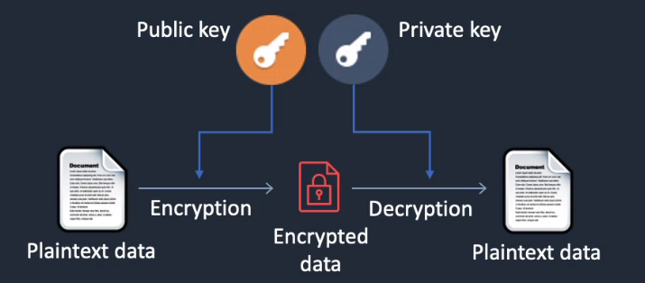

# AWS Certificate Manager

## General info

service for provisioning, managing and deploying SSL/TLS certificates for use with AWS services and internal connected resources.

the service automatically handles purchase, upload and renewal of SSL/TLS certificates

supports ELB, CloudFront, API Gateway

features:

* centrally manage certificates in AWS
* audit the use of each certificate in CloudTrail logs
* private certificate authority (manage lifecycle of our own private certificates) => only service that can manage private certificates
* can be deployed in CloudFront, ELB, API Gateway
* can import 3rd Party certificates from other CAs

when we create a certificate, we need to add a CNAME record to our DNS if we chose DNS validation, it can take up to 72 hours for validation.
Once validated, we can use our certificate on a load balancer for instance.

ACM allows
* create, store and renew SSL/TLS X.509 certificates
* single domains, multiple domain names and wildcards
* integrates with several AWS services
  * ELB
  * CloudFront
  * Beanstalk
  * AWS Nitro Enclaves
  * CloudFormation
* can create public certificates which are signed by the AWS public Certificate Authority
* can also create a Private CA with ACM
  * can then issue private certificates
* can import certificates from 3rd party issues (VPN)

## Encryption generic
### Encryption in transit vs at rest
* TLS is newer version of SSL

### Type
asymmetric (also known as public key cryptography)
* messages encrypted with the public key can only be decrypted with the private key
* messages encrypted with the private key can be decrypted with the public key
* examples include SSL/TLS and SSH

## Billing

public and private certificates provisioned through AWS Certificate Manager for use with ACM-integrated servies are free

With AWS Certificate Manager Private Certificate Authority, we pay monthly for the operation of the private CA and for the private certificates we issue
