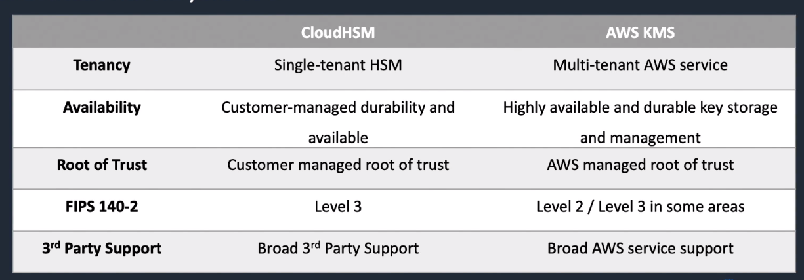

# AWS CloudHSM

## General Info

* If we have compliance for single tenant: use CloudHSM
* we can configure KMS to use our AWS CloudHSM cluster as a custom key store rather the default KMS key store
* managed services and automatically scales
* retain control of our encryption keys - we control access (and AWS has no visibility of our encryption keys)

Generate, store, manage cryptographic keys used to protect data in AWS. Offers high level of security.

managed service that automates time-consuming admin tasks such as hardware provisioning, software patching, HA and backups

HSMs (hardware security modules, physical devices) are used to protect the confidentiality of the keys

**Provides a dedicated HSM instance, hardware is not shared with other tenants, no free tier**

HSM is under our exclusive control without our own VPC

Has FIPS 140-2 Level 3 compliance (US government standard for HSM), the max is 4

Suitable for applications which have a contractual or regulatory requirement for dedicated hardware managing cryptographic keys

Use cases include: 

- DB encryption
- Digital Rights Management (DRM)
- public key infrastructure (PKI)
- authentication and authorization
- document signing
- transaction processing

**With CloudHSM, we can use symmetric or asymmetric encryption**

Tenancy: Single

Scale & HA: HA service from AWS

Key control: Customer

Integration: Broad AWS support

Symmetry: Symmetric & Asymmetric

Compliance: FIPS 140-2 & EAL-4 (FIPS level 3)

Price: $$

* Cloud-based hardware security module (HSM)
* generate and use our own encryption keys on the AWS cloud
* manage our own encryption keys using FIPS 140-2 Level 3 validated HSMs
* CloudHSM runs in our VPC

KMS provides control over encryption keys if we use customer-managed CMK rather than an AWS managed CMK. **CloudHSM uses keys that we both provide and control; and it runs in our VPC**
=> best solution to use if we need to have full control and we don't want the key to use internet.
* use VPC endpoitn to S3
* use S3 bucket policy aws:sourceVpce condition to match the S3 endpoint ID
* use CloudHSM in VPC with endpoint

