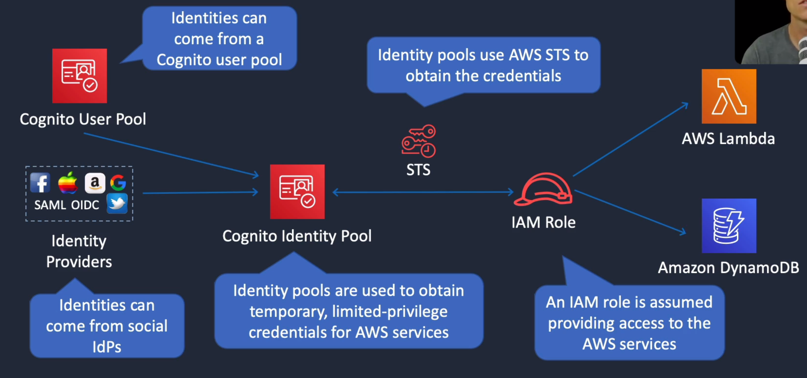

# AWS Directory Service

## General Info

Grouping of products which include Amazon Cloud Directory, Microsoft Active Directory (AD), Simple AD, AD Connector and Amazon Cognito.

When we have a directory service such as Simple AD in a subnet, we can launch a Windows EC2 that can join this domain, also need the EC2 role for SSM. Launch takes longer because the EC2 needs to use SSM to join the directory service. We can then connect to the EC2 using RDP and configure a the server utilities to manage the Simple AD in our environment. We can then add users to this AD, create an URL, assign a role to the user that connects. Once it is done, we can use the URL created with our user to access the AWS console.

Microsoft Active Directory Domain Controllers
* need to forward non-authoritative queries to the VPC resolver (if no record in AD DNS, then forwards to VPC DNS)
* outbound resolvers in Route35, modify EC2 instances (DHCP options set) to use Amazon provided DNS servers

## Identity Federation
System where we have multiple identity sources, and we create a system of trust between them.
=> authentication and authorization is enabled

* Identity providers: source of identity information
* Service providers: contains applications or services that must be available to authenticated/authorized users

### AWS Single Sign-on (SSO)
Preferred services for many use cases
* central management for federated access
* attach multiple AWS accounts and business applications
* identities can also be in AWS SSO (IdP)
* works with many IdPs (AD, ...)
* permissions assigned based on group membership in IdP

A concrete example of what can be done

* Access levels are controlled using permission sets
  * there is a predefined list of policies (Admin, billing, data scientists, DB admin, network admin, ...)
* can only be enable in a single region at a time
  1. choose identity source (an AD, ...)
  2. manage SSO access to our AWS accounts
  3. manage SSO access to our cloud applications

### Amazon Cognito
* Federation support for mobile and web applications
* provides sign-in and sign-up
* supports sign-in with social IdPs such as Apple, Facebook, Google and Amazon
* supports IdPs using SAML 2.0

#### Cognito user pools
* user pool is a directory for managing sign-in and sign-up for mobile applications => JSON Web Token
* Cognito acts as an Identity Broker between the IdP and AWS
* Users can also sign in using Social IdPs

#### Cognito identity pools
* used to obtain temporary, limited privilege credentials for AWS services via STS

Difference between the two: 
* the user pools actually contain the identities
* the identity pools get temporary credentials

### AWS Identity & Access Management
* considered legacy solution today
* uses sts:AssumeRoleWithSAML
* can use separate SAML 2.0 or OIDC (open ID connect) IdPs for each account
* enables access control using federated user attributes
  * cost center
  * job role
  * etc

Can use Web Identity Federation for mobile apps and use OpenID connect but it is preferred to use cognito.

## Active Directories in AWS Directory Services

### Simple AD

**Offers enterprise style active directory or accessories for AD**

Features and patterns:

* low cost directory service based on Samba 4
* capable of providing basic directory service for AWS and non AWS products
* integrates with AWS for SSO and provides service integration with products such as EC2 and Workspaces
* provide a subset of what's Microsoft AD is capable of
* **good enough if we don't need to have a full MS based AD**

Anti patterns:

* not a true Microsoft AD directory so more complex enterprise apps won't work
* does not support TRUST relationships with Microsoft AD (Samba limitation)

### Microsoft Active Directory

**Offers enterprise style active directory or accessories for AD, apply group policy, use single sign-on to apps and services, can enable MFA with RADIUS**

Features and patterns:
* microsoft based directory service provided as a service 
* running Windows Server 2012 R2
* HA by design, running in multiple AZ
* can also be linked to a corporate office / Data center that has Microsoft AD
* can also be connected to Azure AD and Office 365 with the help of ADSync (synchronization) and ADFS (federation service)

Anti patterns:
* not suitable for large scale application workloads or web federation.
* more expensive than Simple AD
* **use only if MS based AD is required**

#### Trust relationship
One or two ways trust relationship (VPN)
* one way: identity in one AD can authenticate to the other
* two ways: identities in both AD can authenticate in both

#### AWS services that support AD authentication
* Console
* Workspaces
* RDS
* Workdocs
* QuickSight
* Workmail
* others...

### AD Connector

**Offers enterprise style active directory or accessories for AD, AD connector is in AWS (available through VPN or DirectConnect)**

**User federation from AD on prem to AWS role to access AWS console**

**Can also seamlessly join Windows EC2 instances to an on-premises AD domain**

Features and patterns:

- **directory proxy provides a bridge between AWS services and an existing on premises AD**
- allows EC2 and workspaces (integrate with on-premises directories)

Anti patterns:

- in isolation it provides no authentication/authorization or directory services
- requires an existing implementation
- requires VPN or direct connect for best performance

### Amazon Cognito

Features and patterns:

- designed to support ID federation (Twitter, Facebook, Amazon, Google, ...)
- user pool management (merge all accounts such as Twitter and Facebook into one Cognito)
- **sign-on and more for web and mobile applications**

Anti patterns:

- not suited for traditional directory service usage
- does not integrate with services in the same way

### Amazon Cloud Directory

Features and patterns:

- graph based store of information
- managed object information, relationships and schema management

Anti patterns:

- not really suited to any workloads which manage user/groups or identities
