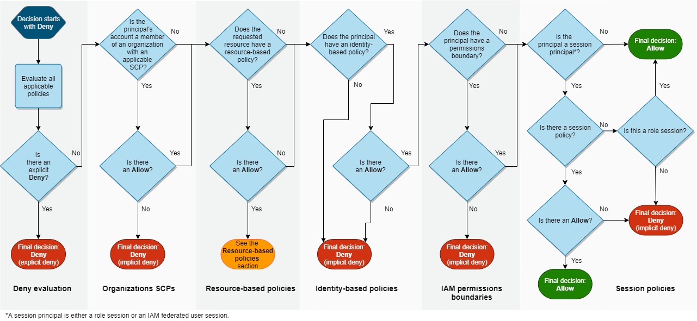
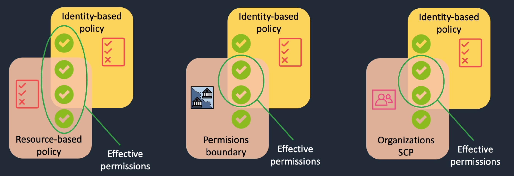
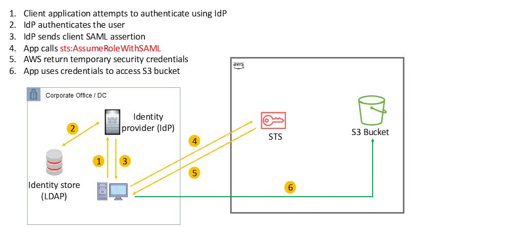

# AWS Identity & Access management

## General Info

Root account owner can set password policy from the IAM console

Sign In URL with account ID by default or alias: https://aws-account-ID-or-alias.signin.aws.amazon.com/console

Can add condition to IAM policy to only allow access to specific tags (like test/prod) => ResourceTag

When we want to give specific rights on AWS resources to lots of users, it is easier to do that with a IAM role and Identity federation (easier to setup than groups and add user to group)

Name can be up to 64 letters, digits and characters (+,=.@-), must be unique, not case sensitive

Users cannot be defined regionally, they are global

Accounts limits like EC2 instances limit are for all users, we cannot limit what an individual user can do.

A policy summary lists the access level, resources and conditions for each service defined in a policy.

An account alias is a name we define to make it more convenient to identify our account (instead of the numbers).

## IAM auth methods
* Console with username/password/mfa
* CLI/API with access keys (access key, secret access key), associated with a user account => do not create that for root. We can have up to 2 access keys per user
* Signing certificate (X.509 certificate authentication to some services like EC2 SOAP and CLI interfaces)
* SSH key / https git credentials for AWS CodeCommit
* Keyspaces credentials for Amazon Keyspaces (apache cassandra managed)

SSH keys for users can only be used in CodeCommit. For EC2, the users need to share the same SSH key within the account to access the same EC2 with a SSH key

### AWS Security Token Service (STS)
Scenario: application on EC2 instance needs access to an S3 bucket

1. create an instance profile and attach an IAM Role to it
2. EC2 attempts to assume role using sts:AssumeRole API call 
3. If trust policy allows it, STS returns temporary credentials to EC2
   1. AccessKeyId
   2. Expiration
   3. SecretAccessKey
   4. SessionToken
4. These temporary credentials are automatically refreshed soon before they expire. **They are used with identity federation, delegation, cross-account access and IAM roles.**

### MFA

On the root account, we have a warning if we don't have MFA enabled for our root account.
We also have a warning if we don't have individual users setup since this means that we are only using the root account.
**We can have MFA on root and normal users account**

When adding MFA. We have a QR code generated. If we take a picture of the QR code, we can reuse it later on (if we create a new authenticator on another phone).

On the individual user, we can also add MFA using Security Credentials in the Console. We can also add an SSH key for AWS code commit (or generate login/pw for CodeCommit).
Using the command line: aws iam create-virtual-mfa-device to create it & aws iam enable-mfa-device to enable it for the user 
**to be able to use MFA with the command line (enforce MFA with CLI), we need to retrieve a session token using: aws sts get-session-token to get temporary credentials**

**In IAM, we can download a credential report which is a CSV file with the users we have in AWS and if they have MFA or not and other info related to users**

can enforce MFA authentication by adding MFA restrictions to IAM policies -> will be required to provide MFA authentication when using the CLI

Each user of a same account can have a different MFA device but there can be only one MFA device for the root account

Something we know (password) + something we have (auth phone, hardware key) + something we are (biometrics like faceid, not supported by AWS) are top security

## Overview

### Users
users account, not necessarily email addresses, can be ASCII strings. Users have no permission by default

### Groups
group for users account -> easier to manage policy, groups cannot contain other groups. Users can be members of up to 10 groups

### Roles
* secure way to grant permissions to trusted entities (ex: IAM user in another account, app code running on EC2 to perform actions on AWS resources, AWS service, ...). 
* A role should be created for customization, but it needs a policy file (authorization) to work. 
* We can define which entity is allowed to assume that role. 
* Roles are used for delegation and are assumed by users (via sts:AssumeRole), applications, and services. 
* Once assumed, the identity becomes the role and gain the roles' permissions. Permissions are there for a short time, renewed automatically. 
* Roles from one account can be assumed from another.
* entity that defines a set of permissions (policies) for making AWS service requests
* not associated with a specific user or group -> trusted entities assume role (STS AssumeRole, AssumeRoleWithWebIdentity, AssumeRoleWithSAML API)
* handle temporary access to resources, cannot make direct requests to AWS services
* a user/service can only assume one role at a time
* can have any number of inline policies (just limited in size for the JSON), can have a maximum of 10 managed policies (AWS managed)
* same role can be used on multiple EC2 instances
* can change/associate/delete role on running EC2 instance, can specify role in launch configuration of ASG to give it to all EC2 instances started by the ASG
* EC2 instance can only have one role
* temporary keys of the role in EC2 instances can be accessed by local user
* service-linked role is a type of role that links to an AWS service such that only the linked service can assume the role
* allow IAM users and federated users to access resources in another AWS account
* an instance profile can only contain one IAM role, one IAM role can be associated with multiple instance profiles. EC2 instances can only have one role attached
* if we want different names for IAM role and instance profiles -> create with CLI. When instance profile is automatically created, it has the same name as the role

=> EC2 uses an instance profile as a container for an IAM role. When we create an IAM role using the IAM console, the console creates an instance profile
automatically and gives it the same name as the role to which it corresponds. If we use EC2 console to launch an instance with an IAM role or to attach
an IAM role to an instance, we choose the role based on a list of instance profile names.

#### Cross account access where we own both accounts
We need 3 configurations:
* a trust policy on the role to be assumed for access to a given resource in account A
* a permission policy on the role to access the resources in account A
* a user in account B with an identity based policy that allows the user to assume the role in account A

#### Cross account access with 3rd party
Same principle except that in the trust policy account A, we add a condition with a secret ID only known by account A&B
```json
{
  "Statement": {
    "Effect": "Allow",
    "Action": "sts:AssumeRole",
    "Principal": {
      "AWS": "3rd party AWS account ID"
    },
    "Condition": {
      "StringEquals": {
        "sts:ExternalId": "secret ID"
      }
    }
  }
}
```

#### Attach role to EC2 instance
The user needs to have a few permissions in order to allow an instance to assume the role.
* iam:PassRole
* iam:CreateInstanceProfile
* iam:AddRoleToInstanceProfile
* ec2:AssociateIamInstanceProfile
* iam:RemoveRoleFromInstanceProfile
* iam:DeleteInstanceProfile
* iam:GetRole

The user does not need to have the necessary permissions on the resources (use buckets, ...), only the passrole one.

### Policies
a group of authorization for a particular resource (AdministratorAccess, S3 Read only, ...). 
The policy is a JSON file (can be edited) with the info. 
Everything implicitly denied by default, must allow what we want.

#### IAM policy structure
* Effect: allow/deny
* Action: list of actions from resources s3:PutObject, ...
* Resource: list of ARN of resources
* Condition: the condition that must be true to be executed

#### Identity-based policy 
applies to users, groups and roles

##### Permission policies
attached to role, specify allow/deny

##### Inline policy
1-to-1 relationship with user, group, or role.
If we delete the identity, we delete the policy as well.

##### Managed policy
Either AWS managed or customer managed. They are standalone because the same policy can be attached to multiple resources

#### resource-based policy 
applies to resources such as s3 buckets (need to specify principal), DynamoDB tables, ...

There is a distinction between managed policies and resource-based policies, managed policies cannot be used as resource-based policies

```json
{
  "Effect": "Allow",
  "Principal": {
    "Service": "arn:aws:iam:xxx:user/Paul"
  },
  "Action": "s3:*",
  "Resource": "arn:aws:s3:::my_bucket"
}
```

Can also be attached to a role.

##### Trust policies
control who can assume the role, attached to the role, can be considered resource based policy

```json
{
  "Effect": "Allow",
  "Principal": {
    "Service": "ec2.amazonaws.com"
  },
  "Action": "sts:AssumeRole"
}
```

## Access control methods
#### RBAC: role based access control
* admin group, development group, operations group, ...
* apply policies to these groups

##### Job function policies
* Administrator
* Billing
* Database administrator
* Data scientist
* Developer power user
* Network administrator
* Security auditor
* Support user
* System administrator
* View-only user

#### ABAC: attribute based access control
Use attribute/tags to define access to resources. Key/value pairs.

```json
{
  "Effect": "Allow",
  "Action": [
    "rds:RebootDBInstance",
    "rds:StartDBInstance",
    "rds:StopDBInstance"
  ],
  "Resource": "*",
  "Condition": {
    "StringEquals": {
      "aws:PrincipalTag/Department": "DBAdmins",
      "rds:db-tag/Environment": "Production"
    }
  }
}
```

Only principal from the department "DBAdmins" can do these actions on RDS DB which are in environment "Production"

## IAM best practices

* no access keys for root user, create a user instead
* don't share credentials -> create individual users
* use groups to assign permissions to IAM users
* use AWS managed policies if available for the task
* use customer managed policies instead of inline policies
* use access levels to review IAM permissions
* configure strong password policy for the users
* roles for EC2 instances, not access keys
* use roles to delegate permissions
* do not share access keys
* rotate credentials regularly
* remove unnecessary credentials
* use policy conditions for extra security (source ip, ...)
* monitor activity in our AWS account
* create IAM permission boundaries to enforce
  * IAM principals can't alter the permissions boundary to allow their own permissions to access restricted services
  * IAM principals must attach the permissions boundary to any IAM principals they create
  * IAM admins can't create IAM principals with more privileges than they already have
  * ... and thus prevent privilege escalation
* IAM permission boundaries also good to limit a certain user from a specific group
* policy statement with least privileged permissions, avoid \* as much as possible
* create policy based on tags to prevent any dev to access prod environment

  ``` json
  {
      "Version": "2012-10-17",
      "Statement": [
          {
              "Effect": "Allow",
              "Action": "ec2:*",
              "Resource": "*",
              "Condition": {
                  "StringNotEquals": {
                      "ec2:ResourceTag/Environment": "PROD"
                  }
              }
          }  
      ]                                        
  }
  ```

  with this policy, a role/group/user cannot have access to resources with tag value PROD for Environment key

* MFA on all accounts
* set password policy
* manage policy for multiple users by putting them in a group and apply policy to the group

### Permission boundaries
Control maximum allowed permissions for a user account. We don't get permissions directly from that, only a statement that we are allowed these actions if they are granted to us.

This can help prevent privilege escalation. For example, a permission boundary could ensure that users created by someone have the same or fewer permissions.

## IAM Process
When we use the Console, CLI or API, a request context is created
* actions/operations that the principal wants to perform
* resources object upon which actions are performed
* principal (person or application that can make a request for an action or operation on an AWS resource)
* environment data (IP address, user agent, SSL status, time of day, ...)
* resource data (data related to the resource that is being requested)

AWS will then determine whether to authorize the request (allow/deny)

### Steps for Authorizing Requests to AWS
1. Authentication of the principal
2. processing of the request context
3. evaluation of all the policies within the account (identity based and resource based policy)
4. action is allowed or denied

### IAM Policy Evaluation Logic




Rules to remember
* they don't apply to root, it can always do whatever
* by default, all requests are implicitly denied
* an explicit allow in an ID-based or resource-based policy overrides this default
* if permissions boundary, organizations SCP, session policy, it might override the allow with an implicit deny
* an explicit deny in any policy overrides any allows


## Custom policies

We can create custom policies with a JSON editor or GUI editor.
Policies have types like AWS managed, Customer Managed, ...
A policy has an ARN: arn:aws:iam::accountid::policy/policyname

A policy must be attached to a role since a role must be attached to an EC2 instance, not a policy. => need to create a role

Policies can be changed at runtime. The instances with the roles attached to the policy are almost updated instantly (can take a second).

## Policy simulator

tool to test and validate effects of our access control policies

https://policysim.aws.amazon.com/

support new or existing policies attached to users, groups or roles

can simulate whether resource-level policies grants access to a particular AWS resources or not

Can be used with Console, SDK, CLI (SimulatePrincipalPolicy and SimulateCustomPolicy)

## Delegation and federation

Identity Provider (IdP): IAM user to control access to AWS resources

We can allow users in other AWS accounts to access the resources in our account (**delegation**). We delegate the **authentication** and sometimes the **authorization** to another AWS account.

**Cross Account Access** -> Let users from one AWS account access resources in another

**Federation** allows users from **external IdP**'s access to our account (Facebook, Google, ...). With rules in place, these authenticated users can act on the resources in our AWS account using a **role**. 

Two types of federation:

* corporate / enterprise identity federation => **users need to have an account in IAM**
  * Active Directory, LDAP
  * custom Federation Proxy, SAML (security association markup language), AWS directory service
* Web or social identity federation (amazon, facebook, google, twitter, OpenID)
  * generally used when we want to give an application or a user (via a web or serverless app) access to our AWS resources
  * AWS Cognito service can handle this interaction in a more elegant way

Two key concepts:

* roles: object which allows an entity to be granted a set of permissions to an account. It contains two policy documents

  * a **TrustPolicy**: defines **who** is allowed to be granted this role (the **principal**)

    ``` json
    {
        "Effect": "Allow",
        "Principal": {
            "AWS": "arn:aws:iam::111111111:root"
        },
        "Action": "sts:AssumeRole"
    }
    ```

    allows **anyone in this account** to use the action "sts:AssumeRole".

  * an **AccessPolicy**: defines **what** the entity can access via this role

    ``` json
    {
        "Effect": "Allow",
        "Action": "*",
        "Resource": "*"
    }
    ```

    this grants full access to do anything to any resources.

* sessions

  * a set of temporary credentials => an access and secret key with an expiration
  * obtained via the Security Token Service (STS)
    * sts:AssumeRole => with direct Access and Secret key for user, or service
    * sts:AssumeRoleWithSAML => with Active Directory and LDAP
    * sts:AssumeRoleWithWebIdentity => with Facebook, ...
  * may or may not involve Cognito - depending on if it is web federation or not
  * when the session expires, we need to request other temporary credentials

Roles is not only for users, they can be granted for services like EC2 instances, Lambda function, ...

**The service (EC2, Lambda) is constantly using sts:AssumeRole obtaining credentials on our behalf and making them available to the instance or function via metadata.**

**The services auto refresh the session which auto refreshes the temporary credentials => managed on our behalf.**

### Corporate identity federation

Use an existing identity store for AWS access. An Identity store can be AWS Directory Service, any SAML compatible provider (active directory or Shibboleth for example) or a custom federation proxy.

It works in a similar way to delegation, it uses the role architecture, trust and access policies control and allow permissions. Temporary access is provided by the Security Token Service (STS) and access is obtained via the **GetFederationToken** or **sts:AssumeRole** operations.

STS provides us with

* session credentials
* AKID
* Secret Access Key
* Session Token
* expiration: min, max, default (depend on the type of identity provider and the type of call)
  * AssumeRole session is min 15 minutes, max 1 hour, 1h default
  * GetFederationToken is min 15 minutes, max 36 hours, 12h default

Within AWS, we have the concept of "**identity provider**" which is an IAM object which holds configuration information about the external identity providers. **We generally map groups in the identity provider with Roles inside AWS.**

This **allows the separation of responsibilities**, the organization may have a dedicated identity team. There is a **definitive source of identities within the business** (eg. HR entry and exit processes are tied to this). This also minimize the administration overhead regarding identity management in the business. We also **reduce the number of identities the staff need to remember and manage** => reduced attack footprint.

#### Scenario: Custom Proxy - Console - AssumeRole

*A user needs to login to AWS using his Active Directory account.*

Federation proxy needs to use an IAM user with permissions to list and assume roles => **must be secured**.

1. Corporate user browse URL to the federation proxy
   1. login box
   2. single sign-on against domain joined machine
2. Federation proxy authenticates with active directory 
3. If successful, the federation proxy will get a list of groups where the account belongs **(must be mapped to IAM roles)**
4. Federation proxy contacts STS to request the list of roles
5. Federation proxy receives list of roles from STS **(mapping between groups and roles used here)**
6. Federation proxy shows the list of roles to the user which can select the best role for the work they are doing
7. Federation proxy receives selected role from user and use **sts:AssumeRole** to task STS for credentials **=> federation proxy user also has Assume Roles permission!**
8. STS response to sts:AssumeRole request with temporary credentials (keys, session, ...)
9. Federation proxy **generate a URL and redirect the user's browser to the AWS console** 
10. User access the console with temporary credentials

#### Scenario: Custom Proxy - API - GetFederationToken

*In this case, it is an application requesting access and not a user.*

1. Corporate app request a session from Federation Proxy
2. Federation Proxy authenticates against the directory
3. If successful, the federation proxy **receives a list of entitlements** which the application has access to (roles on AWS side)
4. Federation proxy asks STS using **GetFederationToken**
5. Federation proxy receives GetFederationTokenResponse from STS
6. Federation proxy sends session to corporate app
7. Corporate apps call AWS API using the session

**There is a huge security issue with this approach**. The IAM user allocated to the proxy needs: 

* the GetFederationToken permission
* all of the permissions of all of the users of the federated proxy system

If we have one application which needs admin rights the federation user needs admin as well.

**GetFederationToken** does not support MFA so there is an extra risk for these users that need to be created for our apps and Federation proxy.

#### Scenario: SAML - Console - AssumeRoleWithSAML
Requirements for SAML
* IAM role created for the federated users' or federated  groups' trust policy must set the SAML provider as the principal
* The web portal calls the AWS STS AssumeRoleWithSAML API with the ARN of the SAML provider, the ARN of the IAM role and the SAML assertion from IdP (step 4)
* the company's IdP defines SAML assertions that properly map users or groups in the company to IAM roles with appropriate permissions



=> need trust relationship between IdP and AWS

With **assumeRoleWithSAML**, we don't need any special services. Any identity providers with a SAML endpoint such as ADFS will function.

1. Corporate user browse to the identity provider (like ADFS). This must be handled at the corporate end because AWS does not support the redirection feature.
2. ADFS server authenticates the user against the directory
3. ADFS receives a SAML authenticated response if successful which is forward to the user. The SAML token contains a tribute (group membership or specific AD attribute which we have configured)
4. The corporate user uses the SAML token to sign in to the AWS sign-in endpoint
5. AWS Sign-in endpoint uses **sts:AssumeRoleWithSAML** to STS
6. AWS sign-in receives the temporary credentials that are forwarded to the user with a console URL
7. The user is redirected to the AWS console

Benefits:

* no need to maintain custom federation proxies
* the proxy does not need to hold active IAM permissions

### Web Identity Federation

This allows a trusted third party to authenticate users instead of authentication within AWS. It avoids us having to create a and manage our users in IAM. It avoids users having to remember multiple IDs. It simplifies the access control via roles. It improves security, no perm credentials stored in our applications.

**Using Web Identity Federation + Cognito also provides user state syncing.** 

#### Standard Web identity Federation (before Cognito)

A mobile user wants to login (or an app)

1. authenticate with web identity provider (Facebook, ...)
2. user receives authenticated identity token
3. user calls STS with AssumeRoleWithWebIdentity
4. STS will then verify the token against the Web Identity provider
5. If successful, STS will check the role (Role Trust Policy) - IP address is correct, trusted user
6. AWS credentials are sent back from STS to the user
7. The application can use these credentials to access AWS resources that it is allowed to

#### Cognito unauthenticated flow

1. Mobile user creates unauthenticated identity to Cognito (cached on the device)
2. Using that unauthenticated identity from Cognito, we request an identity token to Cognito
3. Cognito returns an OpenID token
4. User calls STS with AssumeRole and asks to swap the OpenID token against AWS credentials
5. STS validates the request OpenID with Cognito
6. STS sends the guest role AWS credentials to the user
7. User can then use this guest role to do what is allowed (write data to DynamoDB for instance)

**This is not that much different except that we are using Cognito acting as a shared ID provider for the underlying sources. It handles the guest ID in a consistent way.**

#### Cognito authenticated identities (basic/simple flow)

1. user login to web identity
2. user performs Get or Create Identity to Cognito with the token received from web identity provider
3. Cognito validates token with the provider
4. If successful, an OpenID token is sent to the user
5. User calls STS with AssumeRole (Auth Role) and asks a swap of the OpenID token with AWS credentials
6. STS validates the OpenID token with Cognito
7. STS returns the AWS credentials to the user
8. User access data from AWS resources

#### Cognito authenticated identities (encanced/simplified flow)

1. mobile user logs in with web identity provider to get a token
2. application uses token to create or get an identity with cognito. Cognito validates the token with web identity provider 
3. if successful, application asks for credentials identity to Cognito which handles the validation with STS and returns AWS credentials to the mobile user application
4. Application can then access AWS resources

=> Cognito handles most of the communication with web identity providers and STS.

## Security Token Service

Service which grants temporary credentials to AWS resources such as access key, secret access key and a security token.

Great to use in order to not create IAM users for the whole company.

Default expiration is 12 hours, minimum is 15 minutes and maximum is 36 hours. Can use temporary credentials with MFA protected api access. Security credentials cannot be revoked once granted so it is better to set an appropriate expiration time for the needs. Good practice is to check expiration and request new temporary security credentials before the old one expires (automatically done for EC2).

session token can be used with HTTP headers "x-amz-security-token" to access S3 for instance

Temporary credentials cannot be restricted to a particular region except GovCloud US and China.

### Key terms

Federation: combining or joining list of users in one domain (such as IAM) with a list of users in another domain (Active directory, Facebook, ...)

Identity Broker: a service that allows us to take an identity from point A and join it (federate it) to point B

Identity Store: services like active directory, facebook, google

Identities: a user of a service like Facebook etc

### Scenario

Host a company website on some EC2 web servers in our VPC. Users of the website must log in to the site which then authenticates against the companies active directory servers which are based on site at the companies head quarters. The VPC is connected to the company HQ via a secure IPSEC VPN. Once logged in the user can only have access to their own S3 bucket.
How to set up ?

1. Employees use an application on the web server
2. Application talks to an Identity Broker service (join accounts from two different place - must be developped)
3. Identity broker service authenticates the user against the LDAP directory
4. Identity broker service talks to AWS Security Token Service using the token from active directory
5. AWS Security Token Service gives a temporary token to the Identity Broker Service
6. Identity Broker Service pass the AWS STS token to the applicatrion
7. The Application uses the token to talk to S3 to authenticate
8. S3 checks the token against the AWS Identity and Access management
9. IAM confirms the token validity and the user can use S3

In details with AWS API

1. Employee enters username/pw
2. App calls Identity Broker with username/pw
3. Identity Broker uses organization's LDAP directory to validate employee credentials
4. Identity Broker calls the new **GetFederationToken** using IAM credentials (must a duration 1 to 36 hours + policy that specifies the permissions to be granted to the temporary security credentials)
5. Security Token Service gives permission to create new tokens and then returns four values to the application (access key, secret access key, token, duration)
6. Identity Broker returns the temp security credentials to the application
7. Application uses the credentials to do some actions on AWS resources (results in check of the STS token credentials against IAM)

## Billing

IAM is free, only the resources used are charged

cannot currently see bill details per user

consolidated billing -> one account pays for all the other accounts, email invitation must be accepted to be part of the scheme

Need special permissions to access billing information

## Resources

Documentation: https://docs.aws.amazon.com/IAM/latest/UserGuide/introduction.html

API: https://docs.aws.amazon.com/IAM/latest/APIReference/Welcome.html

CLI: https://docs.aws.amazon.com/cli/latest/reference/iam/index.html
